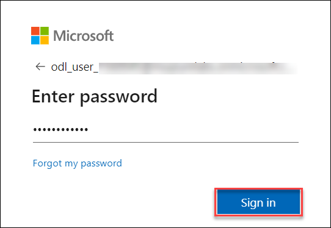

# 一天内开始使用实时智能

欢迎参加您的实时分析研讨会！今天，您将深入了解如何设置实时数据管道、将其与分析引擎集成以及创建实时仪表板以从流数据中获得即时见解。

## 访问您的实验室环境

一旦您准备好开始，您的虚拟机和实验室指南将在您的网络浏览器中触手可及。

### 虚拟机和实验室指南

您的虚拟机是您在整个研讨会期间的主力。实验室指南是您走向成功的路线图。

## 探索您的实验室资源

要更好地了解您的实验室资源和凭证，请导航至 **环境** 选项卡。

## 使用拆分窗口功能

为方便起见，您可以通过从右上角选择 **拆分窗口** 按钮在单独的窗口中打开实验室指南。

## 管理虚拟机

根据需要从 **资源** 选项卡中随意启动、停止或重新启动虚拟机。您的体验掌握在您手中！

## 让我们开始使用 Azure 门户

1. 在您的虚拟机上，单击 Azure 门户图标，如下所示：

    

1. 您将看到 **登录 Microsoft Azure** 选项卡。在这里，输入您的凭据：

   - **电子邮件/用户名**：<inject key="AzureAdUserEmail"></inject>

     

1. 接下来，提供您的密码：

    - **密码**：<inject key="AzureAdUserPassword"></inject>

      

1. 如果系统提示您保持登录状态，您可以单击“否”。

1. 如果出现**欢迎使用 Microsoft Azure**弹出窗口，只需单击“**取消**”即可跳过导览。

1. 单击右下角的“下一个”开始您的实验室之旅！

    

现在，您已准备好探索强大的技术世界。如果您在过程中有任何问题，请随时联系我们。祝您研讨会愉快！
