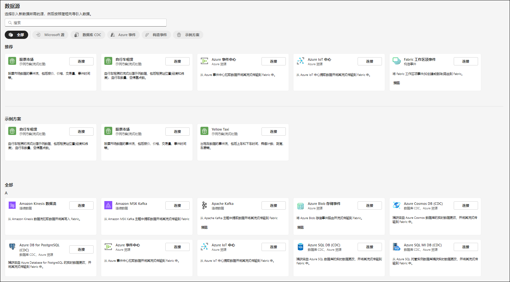

# Microsoft Fabric Real-Time Intelligence in a Day 实验室 1

# 目录

- 文档结构	
- 应用场景/问题陈述	
- 简介	
- Fabric 许可证	
    - 任务1：启用Microsoft Fabric 试用许可证	
- Real-Time Intelligence 和实时中心	
    - 任务2：Real-Time Intelligence 体验项目	
    - 任务3：实时中心	
- 创建工作区和Eventhouse	
    - 任务4：创建Fabric 工作区	
    - 任务5：创建Eventhouse	
- 参考	

 
# 文档结构

本实验室包含用户需要遵循的步骤以及可提供直观协助的关联屏幕截图。在每个屏幕截图中，以橙色框突出显示的部分指出了用户应注意的区域。

# 应用场景/问题陈述

Fabrikam 是一家电子商务公司，专门销售各种户外设备和配件。该公司通过其在线平台满足全球零售客户的需求，并计划增强其在新国际市场的影响力。有一项新计划涉及从电子商务站点提供实时见解，使高管人员能够根据当前信息做出及时决策。

作为销售团队的分析工程师，您的职责包括收集、清理和解释数据集以解决业务问题。您创建和维护批处理数据管道，开发图表和图形等可视化效果，生成和优化全面的语义模型和报表，并将您的发现呈现给组织中的决策者。

# 当前的挑战

- 您需要处理来自电子商务网站的连续实时数据流，这需要一个强大且可扩展的体系结构。

- 确保实时数据处理和分析，以跟上在线销售的快节奏。

- 处理用户交互、交易和网站活动生成的数据量和速度。

- 将实时流式数据与历史数据集成，以进行全面分析。

- 在Eventhouse 环境中使用Medallion 体系结构以有效地构建数据流。

- 利用湖屋中的Eventhouse 数据

- 您有兴趣利用Microsoft Fabric 应对上述挑战，使用Eventhouse、KQL 数据库和 Eventstream 生成可复原且高效的数据处理管道。
 
# 简介

今天，您将学习Microsoft Fabric 的多种主要功能。这是一个介绍性研讨会，旨在向您介绍 Fabric 中提供的各种产品体验和项目。在本研讨会结束时，您将了解如何使用Eventhouse、数据管道、Eventstream、KQL 查询集和实时仪表板。

在本实验室结束时，您将了解到：

- 如何探索Fabric 角色
- 如何创建Fabric 工作区
- 如何创建Eventhouse

# Fabric 许可证

## 任务 1：启用Microsoft Fabric 试用许可证

1. 打开桌面上的 **Microsoft Edge 浏览器**并导航到https://app.fabric.microsoft.com/。系统会将您导航到登录页面。

    > **注意：**如果您未使用实验室环境，并且已经有Power BI 帐户，您可能希望在隐私/无痕模式下使用浏览器。

    

2. 输入**环境变量**选项卡（“实验室指南”旁边）中提供的**用户名**作为电**子邮件**，然后单击提交。

    
 
3. 您将导航到**密码**屏幕。输入讲师与您共享的环境变量选项卡（“实验室指南”旁边）中提供的**密码**。

4. 单击**登录**，然后按照提示登录到Fabric。

    
 
5. 系统会您将导航到 **Fabric 主页** 

    

    若要使用Fabric 项目，您将需要试用许可证和具有Fabric 许可证的工作区。让我们开始设置。

6. 在屏幕右上角，选择**用户图标**。

7. 选择**免费试用**。

    
 
8. “升级到Microsoft Fabric 免费试用版”对话框随即打开。选择**激活**。

    

9. “已成功升级到Microsoft Fabric”对话框随即打开。选择 **Fabric Home Page**。

    
 
10. 系统会将您导航回 **Microsoft Fabric 主页**。

    
 
# Real-Time Intelligence 和实时中心

## 任务 2：Real-Time Intelligence 体验项目

1. 单击Real-Time Intelligence 体验。

    

2. 系统会将您导航到 **Real-Time Intelligence 主页**。您将看到**任务流模板**、**要创建的建议项**和**了解有关Real-Time Intelligence 的详细信息**类别。在**建议**类别中，注意以下项目：

    a. **事件仓库:** 用于创建一个或多个KQL 数据库的工作区，可跨项目共享。还在
Eventhouse 中创建KQL 数据库。

    b. **KQL 查询集:** 用于对数据运行查询以生成可共享的表和视觉对象。

    c. **实时仪表板:** 磁贴的集合，可以选择按页面进行组织，其中每个磁贴都有一个基础查询和一个视觉对象表示形式。

    d. **Eventstream:** 用于捕获、转换和传递实时事件流。

    e. **Reflex:** 在更改的数据中检测到模式或条件时自动采取操作。

    

 
## 任务 3：实时中心

1. 单击屏幕左侧的Fabric 导航窗格中的**实时中心**。

    
 
2. **欢迎使用实时中心**对话框将打开，请自行选择**开始导览**或选择**开始使用**。

    
 
3. 实时中心是在整个组织中流式传输动态数据的一个位置。每个Microsoft Fabric 租户都自动预配了此中心。它使您能够轻松地发现、引入、管理和使用各种来源的动态数据。

4. 在实时中心中，您可以访问三种不同类型的数据集成。

    - **所有数据流** 这用于正在运行的事件流和KQL 数据库，事件流中的所有流输出以及自动显示在实时中心中的KQL 数据库中的表。

    - **流式处理源** 列出来自Microsoft 服务的所有流式处理资源。无论是 Azure 事件中心、Azure IoT 中心还是其他服务，您都可以将数据无缝引入到实时中心中。

    - **Fabric 事件** 通过Fabric 项目和外部源生成的事件在Fabric 中可用，以支持事件驱动的应用场景，例如实时警报和触发下游操作。您可以监视和响应事件，包括 Fabric 工作区项目事件和 Azure Blob 存储事件。

    - **Azure 事件** 此列表包括在 Azure 中生成的您可以访问的系统事件。可以监视事件并设置激活后将发送通知或执行操作的规则。

      

5. 在实时中心右上角，单击 + **连接数据源**按钮。

    

6. 一个窗口随即显示，并将详细列出当前可用的数据流，这些数据流可集成到实时中心中。这包括 Azure 源以及外部云流式处理源（如Amazon Kinesis、Confluent Cloud Kafka 和 Google Cloud Pub/Sub）的混合。甚至还有一些示例数据可供探索

    
 
7.	单击右上角的 “X” 以**关闭**获取事件窗口。
 
# 创建工作区和Eventhouse

## 任务 4：创建Fabric 工作区

1. 现在，让我们创建一个具有Fabric 许可证的工作区。从左侧的导航栏中选择**工作区**。

2. 选择 **+ 新建工作区**。

    

3. 浏览器右侧将打开**创建工作区**对话框。

4. 在**名称**字段中，输入 **RTI_username**。使用环境详细信息中提供给您的用户名。

    > **注意：** 工作区名称必须唯一。确保“名称”字段下方显示带有**此名称可用**的绿色复选标记。

5. 您可以根据需要输入工作区的**描述**。这是可选字段。

6. 点击**高级**以展开此部分。

    
 
7. 在**许可证模式**下，确保选择**试用版**。（这应该已默认选中。）

8. 选择**应用**以创建新工作区。

    

    > **注意:** 如果引入任务流对话框打开，请单击知道了。

    

## 任务 5：创建Eventhouse

1. 单击 **+ 新建**框以打开新窗格，其中包含您可以在此Fabric 工作区中创建的所有项目。

    

2. 从窗格中的**存储数据**部分中选择**事件仓库**。正如我们所讨论的，这看起来可能类似于湖屋，因为我们可以存储数据，但此Eventhouse 专注于实时数据。

    
 
3. 在显示的窗口中，将您的Eventhouse 命名为 **eh_Fabrikam**，然后单击**创建**。

    

4. 在这里，您将最终通过今天的剩余培训流式传输来自各种来源的数据。创建项目后，将出现一个窗口，为您提供有关Eventhouse 的一些详细信息。单击**开始**按钮。

    
 
5. 按照屏幕上的绿色工具提示，快速浏览Eventhouse。首先显示使用 Eventhouse 创建了一个空的Kusto 查询语言(KQL) 数据库。

    

6. 按照屏幕上工具提示的其余部分向您显示在何处创建其他数据库，检查Eventhouse 在 OneLake 中的存储，检查计算时间内Fabric 资源的使用情况，最后查看Eventhouse 中发生了哪些操作。

7. 在Eventhouse 左侧的导航窗格中，找到与Eventhouse 一起创建的KQL 数据库，然后单击它即可查看数据库详细信息

    
 
8. 这将允许左侧的浏览器窗格中仍有一个选项卡，用于查看整个Eventhous 的概述，还有一个新选项卡，用于重点显示KQL 数据库属性。我们希望在本应用场景中实现的一个目标是确保可通过OneLake 访问流式传输到KQL 数据库的数据。通过启用此功能，我们可以通过快捷方式轻松发现此KQL 数据库中的数据，以便在我们可能需要的任何湖屋中使用。找到右侧的**数据库详细信息**部分，然后将“Availability” 选项切换为**开**。

    

9. 通过从浏览器左侧选择 **RTI_username** 工作区来返回到该工作区

    
 
10. 如果您看到**任务流**选项占用了大部分空间，请选择右侧的双向上箭头以将其最小化

    

11. 现在，您基本了解了如何开始将流式数据引入到 OneLake 中。下一步是创建可接收动态数据的数据流。
 
在本实验室中，我们探索了Real-Time Intelligence 界面，探究了实时中心，创建了Fabric 工作区，以及附带KQL 数据库的Eventhouse。在下一个实验室中，您将开始探索将数据资产中各种来源的数据引入到OneLake 的技术，并使用Kusto 查询语言(KQL) 进行一些基本分析。
 
# 参考

Fabric Real-time Intelligence in a Day (RTIIAD) 向您介绍了Microsoft Fabric 中提供的一些主要功能。在服务菜单中，“帮助 (?)”部分包含指向一些优质资源的链接。

以下更多参考资源可帮助您进行与 Microsoft Fabric 相关的后续步骤。

- 请参阅博客文章以阅读完整的 [Microsoft Fabric GA 公告](https://aka.ms/Fabric-Hero-Blog-Ignite23)

- 通过[引导式教程](https://aka.ms/Fabric-GuidedTour)探索Fabric

- 注册[Microsoft Fabric 免费试用版](https://aka.ms/try-fabric)

- 访问[Microsoft Fabric 网站](https://aka.ms/microsoft-fabric)

- 通过探索[Fabric 学习模块](https://aka.ms/learn-fabric)学习新技能

- 探索[Fabric 技术文档](https://aka.ms/fabric-docs)

- 阅读[有关Fabric 入门指南的免费电子书](https://aka.ms/fabric-get-started-ebook)

- 加入[Fabric 社区](https://aka.ms/fabric-community)以发布问题、共享反馈并向他人学习

阅读更多深度Fabric 体验公告博客：

- [Fabric 中的Data Factory 体验博客](https://aka.ms/Fabric-Data-Factory-Blog)

- [Fabric 中的Synapse Data Engineering 体验博客](https://aka.ms/Fabric-DE-Blog)

- [Fabric 中的Synapse Data Science 体验博客](https://aka.ms/Fabric-DS-Blog)

- [Fabric 中的Synapse Data Warehousing 体验博客](https://aka.ms/Fabric-DW-Blog)

- [Fabric 中的Synapse Real-Time Intelligence 体验博客](https://blog.fabric.microsoft.com/en-us/blog/category/real-time-intelligence)
 
- [Power BI 公告博客](https://aka.ms/Fabric-PBI-Blog)

- [Fabric 中的Data Activator 体验博客](https://aka.ms/Fabric-DA-Blog)

- [Fabric 中的管理和治理博客](https://aka.ms/Fabric-Admin-Gov-Blog)

- [Fabric 中的OneLake 博客](https://aka.ms/Fabric-OneLake-Blog)

- [Dataverse 和Microsof t Fabric 集成博客](https://aka.ms/Dataverse-Fabric-Blog)

© 2024 Microsoft Corporation.保留所有权利。

使用本演示/实验室即表示您已同意以下条款：

本演示/实验中的技术/功能由Microsoft Corporation 出于获取反馈和提供学习体验的目的提供。只能将本演示/实验用于评估这些技术特性和功能以及向Microsoft 提供反馈。不得用于任何其他用途。不得对此演示/实验或其任何部分进行修改、复制、分发、传送、显示、执行、复制、公布、许可、转让、销售或基于以上内容创建衍生作品。

严禁将本演示/实验（或其任何部分）复制到任何其他服务器或位置以便进一步复制或再分发。

本演示/实验室出于上述目的，在不涉及复杂设置或安装操作的模拟环境中提供特定软件技术/产品特性和功能，包括潜在的新功能和概念。本演示/实验室中展示的技术/概念可能不是完整的功能，可能会以不同于最终版本的工作方式工作。我们也可能不会发布此类功能或概念的最终版本。在物理环境中使用此类特性和功能的体验可能也有所不同。

**反馈**。如果您针对本演示/实验室中所述的技术特性、功能和/或概念向Microsoft 提供反 馈，则意味着您向Microsoft 无偿提供以任何方式、出于任何目的使用和分享您的反馈并将其商业化的权利。您同样无偿为第三方提供其产品、技术和服务使用或配合使用包含此反馈的Microsoft 软件或服务的任何特定部分所需的任何专利权。如果根据某项许可的规定，Microsoft 由于在其软件或文档中包含了您的反馈需要向第三方授予该软件或文档的许可，请不要提供这样的反馈。这些权利在本协议终止后继续有效。

对于本演示/实验室，MICROSOFT CORPORATION 不提供任何明示、暗示或法定的保证和条件，包括有关适销性、针对特定目的的适用性、所有权和不侵权的所有保证和条件。对于使用本演示/实验产生的结果或输出内容的准确性，或者出于任何目的包含本演示/实验中的信息的适用性，Microsoft 不做任何保证或陈述。

# 免责声明

本演示/实验仅包含Microsoft Power BI 的部分新功能和增强功能。在产品的后续版本中，部分功能可能有所更改。在本演示/实验中，可了解部分新功能，但并非全部新功能。
