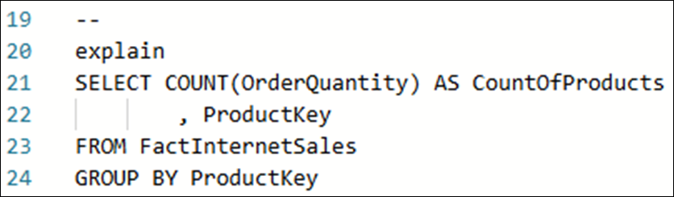

# Microsoft Fabric Real-Time Intelligence in a Day 实验室 2


# 目录

- 文档结构	
- 简介	
- Fabric 实时中心	
    - 任务1：创建事件流源	
    - 任务2：设置Eventstream 目标	
- Kusto 查询语言(KQL)	
    - 任务3：创作Kusto 数据库查询	
    - 任务4：针对KQL 数据库使用T-SQL 查询	
- KQL 查询集	
    - 任务5：使用KQL 查询集	
- 总结	
- 参考	

 
# 文档结构

本实验室包含用户需要遵循的步骤以及可提供直观协助的关联屏幕截图。在每个屏幕截图中，以橙色框突出显示的部分指出了用户应注意的区域。

# 简介

在本实验室中，您将体验一种处理连续实时数据流的方法。您将使用一个名为Eventstream 的 Fabric Real-Time Intelligence 对象将此数据引入您在上一个实验室中创建的Eventhouse，并编写一些基本KQL 查询。

在本实验室结束时，您将了解到：

- 如何创建Eventstream
- 将实时数据加载到KQL 数据库中
- 编写基本Kusto 查询语言查询

# Fabric 实时中心

## 任务 1：创建事件流源

1. 打开您在上一个实验室中创建的 **Fabric 工作区**。从这里，我们可以看到创建的 Eventhouse。

    

2. 通过选择左侧的**实时**按钮导航到实时中心。即使我们看不到任何数据流，这很快就会改变。

    
  
3. 选择应位于右上角的 **+ 连接数据源**绿色按钮。

    

4. 此时将打开一个窗口，允许您选择流数据的来源。正如我们之前所讨论的，有许多出色的选项可供选择，但在本课程中，我们将选择“Azure 事件中心”选项。如果您无法轻松看到 “Azure 事件中心”，请选择顶部的 **Microsoft 源**以筛选您看到的选项。

    

5. 现在，您需要创建与 Azure 事件中心的连接。单击**新建连接**文本，因为您当前没有连接。

    

6. 从环境详细信息页面中，复制所有必要的连接设置并将其粘贴到相应的字段中。对于这些实验室，我们将连接到事件中心，其中包含从Python 笔记本发送的流式数据。此笔记本正在以每小时约 3,100 笔交易的速度创建虚假的销售交易。

    - 事件中心命名空间：**rtiadhub{userid} - 由cloudlabs 提供**

    - 事件中心：**rti-iad-fabrikam**

    - 共享访问密钥名称：**rti-reader**

    - 共享访问密钥：**在“环境详细信息”选项卡中可用**
 
7. 填写完所有属性后，单击**连接**。

    

8. 在 Azure 事件中心数据源的配置中，您可能需要修改事件中心的**使用者组**，以确保获得对指向数据流的唯一访问点的访问权限。对于本研讨会，您可以保留“$Default”值，如下所示 
 
    

9. 在完成本数据源和Eventstream 之前，我们先将Eventstream 重命名为更有用的名称。在右侧的“流详细信息”部分中，选择“Eventstream 名称”旁边的铅笔图标，我们将 Eventstream 称为 **es_Fabrikam_InternetSales**。

    

10. 现在，我们可以单击**下一个**，此操作会将我们转到最终概述页面。

    

11. 在此概述屏幕中，验证内容是否正确，然后单击**创建源**。

    > **注意：** **您的详细信息将与屏幕截图中显示的内容不同**

    
 
12. 创建Eventstream 和Eventstream 源后，选择**打开 Eventstream** 选项

    

13. 此操作会将您转到Eventstream 用户界面。在这里，您将看到流入Eventstream 的源数据流，我们也可以添加转换事件。

14. 源可能需要一些时间才能**可用**，但等待片刻后，单击带有Eventstream 名称的中间图标，您应该会看到数据预览。

    >**注意：如果您收到“警告”状态和审核策略，没有关系。流仍将正常运行**

    

15. 现在，您应该会在底部窗口中看到数据示例。

    
 
16. 此时将向您显示从 Azure 事件中心接收的数据预览。如果您将底部水平滚动条一直滑动到预览的右侧，将能够在名为 **EventProcessedUtcTime** 和 **EventEnqueuedUtcTime** 的两列中看到在事件中心中收到数据的时间。这应该以UTC 格式反映当前日期/时间。

    

# 任务 2：设置Eventstream 目标

1. 单击画布区域中标记为“切换到编辑模式以转换事件或添加目标”的磁贴

    

2. 在Eventstream 用户界面中，单击**转换事件或添加目标**选项以打开下拉菜单。

    
 
3. 查看可对流执行的可用操作的列表。
 
    

4. 查看下面的**操作**部分，您将找到**目标**，选择指示 **Eventhouse** 的选项。

    

5. 这时屏幕右侧会打开一个新菜单。对于目标，您首先需要修改**数据引入模式**。两个选项为**直接引入**和**引入前的事件处理**。因为我们不打算转换Eventstream 中的任何内容，而是将此信息直接加载到KQL 数据库表中，因此请确保您已选择**直接引入**选项。

    
 
6. 按照以下详细信息修改其余设置。

    - 目标名称- **eh-kql-db-fabrikam**
    - 工作区- **RTI_username**
    - Eventhouse- **eh_Fabrikam**
    - KQL 数据库- **eh_Fabrikam**

      
  
7. 单击“保存”。

8. 配置Eventstream 后，单击**发布**按钮以保存此Eventstream 并开始引入。

    

9. 如果您发现 **AzureEventHub** 源变为非活动状态，请将该切换开关切换到“活动”状态，然后在对话框打开时，选择“立即”选项

    
    
 
10. 在**目标**中选择**配置**选项以将流正确映射到 KQL 数据库中的表。

    

11. 单击 **eh_Fabrikam** 数据库下方的 **+ 新建表**选项。

    

12. 将新表命名为 **InternetSales**，然后单击复选标记。

    
  
13. 您可能需要更新您的**数据连接名称**以满足要求。让我们将其重命名为 **eh_Fabrikam_es_InternetSales**。然后，我们可以单击**下一步**。

    

14. 搜索事件后，等待片刻，用户界面应允许您看到已找到示例数据。单击屏幕底部的**完成**。

    
 
15. 之后，您将看到摘要。选中所有绿色复选标记后，单击**关闭**以继续。

16. 一旦您看到用户界面显示从源到Eventstream 再到目标的映射，则表明您已正确配置并启动了KQL 数据库中的数据流。

    
  
# Kusto 查询语言(KQL)

## 任务 3：创作Kusto 数据库查询

1. 您将返回到 **RTI_username** 工作区。您应该会看到刚刚创建的 Eventstream 以及所有 Evenhouse 项目。

    

2. 打开 **eh_Fabrikam** KQL 数据库项目。

    

3. 在此体验中，您可以大致了解KQL 数据库的当前结构、大小和使用。由于Eventstream 不断向此KQL 数据库发送数据，因此您会注意到存储量将随着时间的推移而增加。

    
 
4. 单击屏幕右上角的**刷新图标**。

    
 
5. 数据库的大小应该已增长。与实验室其余部分的屏幕截图相比，您看到的值可能不准确。根据您完成内容所花费的时间，您收到的记录将比课程中其他成员的记录更少或更多。 这完全没问题，不会影响您继续操作的能力。

    

6. 在屏幕左侧的数据库导航区域中，单击KQL 数据库中名为 **InternetSales** 的表，您将看到该表的概述

    
 
7. 此概述将为您提供有关已创建表的元数据详细信息，以及任何通 Eventstream 积极流式传输的数据。同样，表的大小和表格中的行数因学生而异，不会影响本实验室或任何实验室的最终结果。此菜单上需要强调的其他一些项目包括：

    - **数据活动跟踪器-** 显示引入的行数、上次生成的时间以及显示间隔

    - **数据预览-** 显示表引入结果的预览。

    - **架构见解-** 这包括有关列名称和可使用KQL 查询的列的数据类型的详细信息。还显示所选列中值的前 10 个计数

    - **表详细信息-** 显示表的压缩大小和原始大小、OneLake 可用性、表中的行数以及各种其他详细信息

      

8. 返回到数据库视图，然后单击右上角的**浏览数据**。

    

9. 这将打开与Eventhouse 一起创建的默认KQL 查询集。有一些预先编写脚本的查询已创作完成，但需要进行一些轻微的自定义。此外，还有两个指向Microsoft 文档的链接，它们在学习KQL 或查看 SQL 到KQL 的转换时很有帮助，本课程稍后将对此进行讨论。

    
 
10. 单击**行 8**，其中查询显示 **YOUR_TABLE_HERE**，将其替换为表名称 **InternetSales**。

    

11. 突出显示**行 8 和 9**，单击窗口左上角的 **Run** 按钮。

    
 
12. 查询使用 **take** 运算符返回指定数量的行。当查询运行时，它将从 InternetSales 表中提取数据，并返回您插入到查询中的任意数量的行。对于本示例，将仅返回 100 行，就像SQL 中的WHERE 子句一样。使用此运算符无法确定返回的具体行，并且查询结果将与其他查询结果有所不同。

    

13. 单击**行 12**，其中查询显示 **YOUR_TABLE_HERE**，将其替换为表名称 InternetSales。

    

14. 突出显示**行 12 和 13**，单击窗口左上角的 **Run** 按钮。

    

15. 本查询使用count 运算符。本查询将返回在KQL 数据库表上执行查询时存在的聚合记录数。您可以随意再运行几次本查询，您应注意到记录数每隔几秒钟后就会增加。

    

16. 对在**行 16/17** 上为您自动创建的最终查询重复前面的步骤，然后再次运行查询。

    

17. 本查询将为您提供一小时范围内已引入到表中的记录数。对于您当前引入的数据，这些记 录的总体分配约为每小时 4,100 条。不过，每小时的交易记录数会有细微差异，本查询将详细说明每个时间范围中引入的记录数是更少还是更多。

## 任务 4：针对KQL 数据库使用 T-SQL 查询

您可能是第一次使用Kusto 查询语言。虽然此语言直观且易于学习，可用于简单查询，但您可能希望返回比当前查询更复杂的查询的结果。KQL 查询集功能中包含了几个有用的工具，包括将 SQL 查询转换为KQL 查询，以及在KQL 查询集中简单地创作T-SQL 查询。让我们来探索吧！

1. 您需要创建一个查询，可返回包含已售出次数的每个产品。这是您可以使用T-SQL 快速执行的操作。在查询窗口中，您可以将SQL 查询转换为KQL，以便更好地了解将来如何创作 KQL 查询。首先编写以下命令。

    > **注意：双击下面的对象，以便能够复制文本**

    ```
    --
    explain
    ```

    
 
2. 通过注释行“--”后跟关键字“explain”，您现在可以创建一个 SQL 查询，并使用KQL 查询返回结果，该查询可用于实现类似查询和结果。下面输入以下查询，解释KQL 查询的外观：

    ```
    --
    explain
    SELECT COUNT(OrderQuantity) AS CountOfProducts
            , ProductKey
    FROM InternetSales
    GROUP BY ProductKey
    ```

    

3. 这是一个简单SQL 查询，它将从 InternetSales 表中检索结果以返回两列：产品密钥和订单数量计数。由于存在聚合列和非聚合列，因此必须使用“GROUP BY”返回每个单独产品的结果。运行从“--”开始到 T-SQL 查询结束的整个查询。

    
 
4. “explain”查询的输出应为单个记录，其中包含已翻译的 KQL 查询作为结果。单击**脱字号图标(>)** 以展开结果并允许更轻松的翻译。

    
 
5. 单击下面以橙色突出显示的查询窗格。这允许您选择已翻译的KQL 查询并复制它。将此查询粘贴到我们一直在使用的KQL 查询集中

    

6. 查询窗格中显示结果后，突出显示并运行查询以检索结果。**summarize** 运算符将生成一个表，该表聚合输入表的内容，同时确定如何使用 **by Product Key** 对每条记录进行分组，**project** 运算符将在插入新计算列时选择要包含、重命名或删除的列。

    

7. 请随意浏览查询集顶部的 SQL 到KQL 速查表运算的列表，以获取其他功能和转换。

    

8. 除了使用KQL，在 Fabric 中查询KQL 数据库结果的另一种替代方法是编写和运行T-SQL 查询。突出显示用于翻译KQL 查询的原始SQL 语句，并仅运行该语句。

    
 
9. 这也将产生完全有效的结果，而无需事先转换为KQL。

    
 
# KQL 查询集

## 任务 5：使用KQL 查询集

1. 虽然此窗口中的大多数查询都是从用户界面自动创建的，但将来可能会出现以下情况：您希望从头开始创建自己的KQL 查询。这可以通过位于顶部的选项卡功能进行管理。还应注意，此查询集会定期自动保存。

2. 请注意，在查询集顶部，第一页的默认名称与数据库的名称相同。

    
 
3. 我们接下来将通过单击铅笔图标来重命名此选项，让我们将其称为 **My First KQL Query**。

    
 
4. 在将来，如果我们想要隔离代码，只需单击“+”图标即可创建其他选项卡。

    

5. 返回到 **RTI_username** 工作区。您应看到以下对象

    
 
# 总结

在本实验室中，您首先设置与具有正在运行的数据流的事件中心的连接，然后使用 Eventstream 获取该数据并将其引入到KQL 数据库中。引入数据后，您可以创作多个KQL 查询，并查看使用T-SQL 的功能以帮助学习KQL 语法，或者只是使用 SQL 语句返回结果。

# 参考

Fabric Real-time Intelligence in a Day (RTIIAD) 向您介绍了Microsoft Fabric 中提供的一些主要功能。在服务菜单中，“帮助 (?)”部分包含指向一些优质资源的链接。


以下更多参考资源可帮助您进行与 Microsoft Fabric 相关的后续步骤。

- 请参阅博客文章以阅读完整的 [Microsoft Fabric GA 公告](https://aka.ms/Fabric-Hero-Blog-Ignite23)

- 通过[引导式教程](https://aka.ms/Fabric-GuidedTour)探索Fabric

- 注册[Microsoft Fabric 免费试用版](https://aka.ms/try-fabric)

- 访问[Microsoft Fabric 网站](https://aka.ms/microsoft-fabric)

- 通过探索[Fabric 学习模块](https://aka.ms/learn-fabric)学习新技能

- 探索[Fabric 技术文档](https://aka.ms/fabric-docs)

- 阅读[有关Fabric 入门指南的免费电子书](https://aka.ms/fabric-get-started-ebook)

- 加入[Fabric 社区](https://aka.ms/fabric-community)以发布问题、共享反馈并向他人学习

阅读更多深度Fabric 体验公告博客：

- [Fabric 中的Data Factory 体验博客](https://aka.ms/Fabric-Data-Factory-Blog)

- [Fabric 中的Synapse Data Engineering 体验博客](https://aka.ms/Fabric-DE-Blog)

- [Fabric 中的Synapse Data Science 体验博客](https://aka.ms/Fabric-DS-Blog)

- [Fabric 中的Synapse Data Warehousing 体验博客](https://aka.ms/Fabric-DW-Blog)

- [Fabric 中的Synapse Real-Time Intelligence 体验博客](https://blog.fabric.microsoft.com/en-us/blog/category/real-time-intelligence)
 
- [Power BI 公告博客](https://aka.ms/Fabric-PBI-Blog)

- [Fabric 中的Data Activator 体验博客](https://aka.ms/Fabric-DA-Blog)

- [Fabric 中的管理和治理博客](https://aka.ms/Fabric-Admin-Gov-Blog)

- [Fabric 中的OneLake 博客](https://aka.ms/Fabric-OneLake-Blog)

- [Dataverse 和Microsof t Fabric 集成博客](https://aka.ms/Dataverse-Fabric-Blog)

© 2024 Microsoft Corporation.保留所有权利。

使用本演示/实验室即表示您已同意以下条款：

本演示/实验中的技术/功能由Microsoft Corporation 出于获取反馈和提供学习体验的目的提供。只能将本演示/实验用于评估这些技术特性和功能以及向Microsoft 提供反馈。不得用于任何其他用途。不得对此演示/实验或其任何部分进行修改、复制、分发、传送、显示、执行、复制、公布、许可、转让、销售或基于以上内容创建衍生作品。

严禁将本演示/实验（或其任何部分）复制到任何其他服务器或位置以便进一步复制或再分发。

本演示/实验室出于上述目的，在不涉及复杂设置或安装操作的模拟环境中提供特定软件技术/产品特性和功能，包括潜在的新功能和概念。本演示/实验室中展示的技术/概念可能不是完整的功能，可能会以不同于最终版本的工作方式工作。我们也可能不会发布此类功能或概念的最终版本。在物理环境中使用此类特性和功能的体验可能也有所不同。

**反馈**。如果您针对本演示/实验室中所述的技术特性、功能和/或概念向Microsoft 提供反 馈，则意味着您向Microsoft 无偿提供以任何方式、出于任何目的使用和分享您的反馈并将其商业化的权利。您同样无偿为第三方提供其产品、技术和服务使用或配合使用包含此反馈的Microsoft 软件或服务的任何特定部分所需的任何专利权。如果根据某项许可的规定，Microsoft 由于在其软件或文档中包含了您的反馈需要向第三方授予该软件或文档的许可，请不要提供这样的反馈。这些权利在本协议终止后继续有效。

对于本演示/实验室，MICROSOFT CORPORATION 不提供任何明示、暗示或法定的保证和条件，包括有关适销性、针对特定目的的适用性、所有权和不侵权的所有保证和条件。对于使用本演示/实验产生的结果或输出内容的准确性，或者出于任何目的包含本演示/实验中的信息的适用性，Microsoft 不做任何保证或陈述。

# 免责声明

本演示/实验仅包含Microsoft Power BI 的部分新功能和增强功能。在产品的后续版本中，部分功能可能有所更改。在本演示/实验中，可了解部分新功能，但并非全部新功能。
