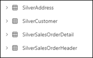
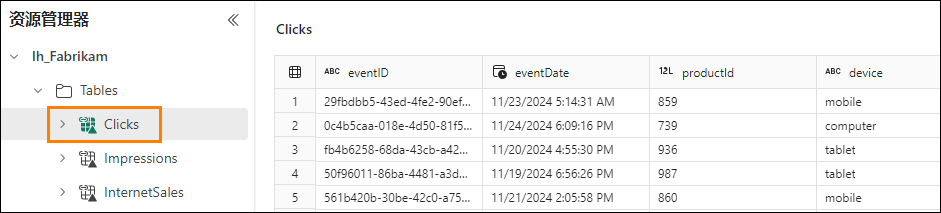

# Microsoft Fabric Real-Time Intelligence in a Day 实验室 4


# 目录

- 文档结构	
- 简介	
- KQL 数据库中的奖牌框架	
    - 任务1：创建铜牌表	
    - 任务2：使用数据管道加载铜牌表	
    - 任务3：转换银牌图层中的表	
    - 任务4：使用具体化视图创建金牌图层	
- Fabric 湖屋和 OneLake 可用性	
    - 任务5：创建湖屋	
    - 任务6：KQL 数据库表的快捷方式	
- 总结	
- 参考	

 
# 文档结构

本实验室包含用户需要遵循的步骤以及可提供直观协助的关联屏幕截图。在每个屏幕截图中，以橙色框突出显示的部分指出了用户应注意的区域。

# 简介

在本实验室中，您将使用铜牌、银牌、金牌图层方法创建奖牌框架，以处理处于不同开发阶段的数据并在分析中使用它。然后，您将KQL 数据库中的数据连接到湖屋中，以展示与组织中想要将其用于Power BI 报告的人员共享实时数据的速度有多快。

在本实验室结束时，您将了解到：

- 使用Kusto 查询语言创建KQL 数据库表

- 使用Data Factory 管道将数据加载到KQL 数据库中

- 在KQL 数据库中创建具体化视图

- 创建湖屋并使用KQL 数据库的快捷方式

# KQL 数据库中的奖牌框架

## 任务 1：创建铜牌表

1. 打开课程的 **Fabric 工作区**，然后打开您在上一个实验室中创建的KQL 查询集 **Create Tables**。

    
 
2. 在此KQL 查询集中，我们将此处的原始选项卡从“eh_Fabrikam”重命名为“Create External Tables”，以便更轻松地组织和理解此查询集中的内容。

    

3. 现在，让我们选择“+”图标来创建一个新选项卡，然后将新选项卡命名为“Bronze Layer”

    

4. 在此新选项卡中，粘贴并突出显示以下代码，然后选择“运行”以创建四个新表，这些表将用作奖牌框架的铜牌图层。

    ```
    //BRONZE LAYER
    .execute database script <|

    .create table [Address] (AddressID:int,AddressLine1:string,AddressLine2:string,City: string, StateProvince:string, CountryRegion:string, PostalCode: string, rowguid: guid, ModifiedDate:datetime)
    .create table [Customer](CustomerID:int, NameStyle: string, Title: string, FirstName: string, MiddleName: string, LastName: string,Suffix:string, CompanyName: string, SalesPerson: string, EmailAddress: string, Phone: string, ModifiedDate: datetime)
    .create table [SalesOrderHeader](SalesOrderID: int, OrderDate: datetime, DueDate: datetime, ShipDate: datetime, ShipToAddressID: int, BillToAddressID: int, SubTotal: decimal, TaxAmt: decimal, Freight: decimal, TotalDue: decimal, ModifiedDate: datetime)
    .create table [SalesOrderDetail](SalesOrderID: int, SalesOrderDetailID: int, OrderQty: int, ProductID: int, UnitPrice: decimal , UnitPriceDiscount: decimal,LineTotal: decimal, ModifiedDate: datetime)
    ```

    
  
5. 执行后，您应该立即看到在数据库对象资源管理器中创建的四个新表。

    - Address
    - Customer
    - SalesOrderDetail
    - SalesOrderHeader

      

6. 通过单击名称旁边的 > 图标展开 **Address 表**。

    

7. 这将向您显示表的架构（列名称和数据类型）。向 KQL 数据库的此表中添加一个引入时间隐藏列非常有用，该列稍后将在奖牌体系结构中使用。让我们现在添加该列。复制并粘贴下面的脚本，以通过添加引入时间列来更改您刚创建的表。

    ``` 
    //adds a hidden field showing ingestion time
    .execute database script <|
    .alter table Address policy ingestiontime true
    .alter table Customer policy ingestiontime true
    .alter table SalesOrderHeader policy ingestiontime true
    .alter table SalesOrderDetail policy ingestiontime true
    ```

    

8. 这四个新表是空白表，其架构均已定义。现在，您需要通过一种方法正确加载这些表。导航回您的工作区 **RTI_username**。

## 任务 2：使用数据管道加载铜牌表

1. 从工作区中选择 **+ 新建项**选项，以显示选择窗格。然后，找到并选择名为 **Data pipeline** 的选项。

    
 
2. 将新管道命名为 **Load KQL Database Bronze Layer**。

    
 
3. 单击**创建**。

4. 显示管道菜单后，单击**复制数据助手**选项。

    

5. 首先，您将需要与要从中提取数据的源数据库建立连接。单击“新建源”下的 **Azure SQL 数据库**选项。如果您没有立即看到它，可以使用顶部的搜索栏来筛选源。我们将连接到与上一个实验室相同的外部 Azure SQL 数据库，但连接到不同的表。
 
    

6. 您将需要输入数据库的连接详细信息。使用您的环境中的信息，或如下所示。

    - fabrikamdemo.database.windows.net
    - fabrikamdb
    - demouser
    - fabrikam@123456

7. 填写完所有内容后，单击**下一步**。

8. 从可用表列表中，选择以下表：

    - SalesLT.Address
    - SalesLT.Customer
    - SalesLT.SalesOrderDetail
    - SalesLT.SalesOrderHeader

      
  
9. 单击**下一步**。

10. 您现在需要设置目标，以确定希望管道将数据发送到的位置。查找 **OneLake 数据中心**，然后选择您的KQL 数据库 **eh_Fabrikam**。

    

11. 如果系统提示您登录，只需使用“环境详细信息”页面中提供的凭据即可

12.	如果尚未选择 **SalesLT.Address** 表，请单击该表，然后单击**表**选项旁边的下拉菜单。单击 **Address** 表选项。

    
 
13. 您现在将看到列**映射的**概述。这将允许您可视化源数据库中您要发送到KQL 数据库的所有字段。如果您不希望特定字段从源映射，可以选择删除这些字段。

    

14. 对表 **SalesLT.Customer、SaleLT.SalesOrderDetail** 和 **SalesLT.SalesOrderHeader** 执行与步骤 11- 12 相同的步骤。无需执行列映射，因此只需匹配表名称即可。正确映射所有表后，单击**下一步**。

15. 使用“复制数据”助手的最后一页是概述页面，用于验证您选择的所有设置。确保源表数和目标表数相同。

    

16. 单击**保存+ 运行**。
 
17. 片刻之后，将显示一个弹出窗口，其中包含**参数**。我们刚刚完成的复制助手向导创建了一个表列表，用于进行迭代并加载到KQL 表中。只需单击**确定**按钮即可运行管道，因为它当前已从“复制数据”助手配置。

    

18. 让管道运行，大约一分钟后，数据移动应完成。一旦您看到管道中的所有活动**均成功**，即表明您已传输数据。

    

19. 让我们检查其中一个表并验证数据。导航回我们一直在使用的名为 **Create Tables** 的KQL 查询集，并确保您位于 **Bronze Layer** 选项卡中，然后运行以下脚本

    ```
    //Query the Bronze layer Customer table 

    Customer
    | take 100
    ```

    

20. 您应该会看到如下图所示的一些数据，但这些数据可能不准确

    

## 任务 3：转换银牌图层中的表

1. 现在铜牌表已加载，我们将在KQL 查询集中创建名为“Silver Layer”的新选项卡。

    

2. 运行 “Silver Layer”选项卡中的以下KQL 脚本，以创建四个新表，这些表将用作奖牌框架的银牌图层。

    ```
    //SILVER LAYER

    .execute database script <|

    .create table [SilverAddress] (AddressID:int,AddressLine1:string,AddressLine2:string,City: string, StateProvince:string, CountryRegion:string, PostalCode: string, rowguid: guid, ModifiedDate:datetime, IngestionDate: datetime)

    .create table [SilverCustomer](CustomerID:int, NameStyle: string, Title: string, FirstName: string, MiddleName: string, LastName: string,Suffix:string, CompanyName: string, SalesPerson: string, EmailAddress: string, Phone: string, ModifiedDate: datetime, IngestionDate: datetime)

    .create table [SilverSalesOrderHeader](SalesOrderID: int, OrderDate: datetime, DueDate: datetime, ShipDate: datetime, ShipToAddressID: int, BillToAddressID: int, SubTotal: decimal, TaxAmt: decimal, Freight: decimal, TotalDue: decimal, ModifiedDate: datetime, DaysShipped: long, IngestionDate: datetime)

    .create table [SilverSalesOrderDetail](SalesOrderID: int, SalesOrderDetailID: int, OrderQty: int, ProductID: int, UnitPrice: decimal, UnitPriceDiscount: decimal,LineTotal: decimal, ModifiedDate: datetime, IngestionDate: datetime)
    ```

3. 通过突出显示新脚本并单击**运行**来运行该脚本。

    

4. 执行该脚本后，您将看到KQL 数据库表菜单中添加了四个新表。

    

5. 现在表已创建，您需要将数据加载到表中。您将创建一个更新策略，以在数据引入到铜牌图层时对其进行转换和移动。复制并粘贴以下脚本，然后**运行**代码。

    ```
    // use update policies to transform data during Ingestion

    .execute database script <|

    .create function ifnotexists with (docstring = 'Add ingestion time to raw data') ParseAddress (){ Address
    | extend IngestionDate = ingestion_time()
    }

    .alter table SilverAddress policy update @'[{"Source": "Address", "Query": "ParseAddress", "IsEnabled" : true, "IsTransactional": true }]'

    .create function ifnotexists with (docstring = 'Add ingestion time to raw data') ParseCustomer (){ Customer
    | extend IngestionDate = ingestion_time()
    }

    .alter table SilverCustomer policy update @'[{"Source": "Customer", "Query": "ParseCustomer", "IsEnabled" : true, "IsTransactional": true }]'

    .create function ifnotexists with (docstring = 'Add ingestion time to raw data') ParseSalesOrderHeader (){ SalesOrderHeader
    | extend DaysShipped = datetime_diff('day', ShipDate, OrderDate)
    | extend IngestionDate = ingestion_time()
    }

    .alter table SilverSalesOrderHeader policy update @'[{"Source": "SalesOrderHeader", "Query": "ParseSalesOrderHeader", "IsEnabled" : true, "IsTransactional": true }]'

    .create function ifnotexists with (docstring = 'Add ingestion time to raw data') ParseSalesOrderDetail () { SalesOrderDetail
    | extend IngestionDate = ingestion_time()
    }

    .alter table SilverSalesOrderDetail policy update @'[{"Source": "SalesOrderDetail", "Query": "ParseSalesOrderDetail", "IsEnabled" : true, "IsTransactional": true }]'
    ```

6. 虽然您将看到查询执行的结果，但查询已完成的最佳证明是，您将在“数据库对象”窗格中看到一个新的可扩展文件夹。单击 **Functions 文件夹**旁边的 > **图标**。这些函数允许将数据加载到KQL 数据库的铜牌图层中，然后进行镜像、转换并加载到银牌图层中。

    

7. 现在，让我们模拟此流程，您将再次运行之前在本实验室中创建的管道。现在导航回 **Load KQL Database** 管道。

    

8. 只需单击**主页功能区**中的**运行**按钮，即可再次执行管道，并将数据加载到铜牌图层，然后这些数据将通过您创建的函数进行转换并加载到银牌表中。

    

9. 在此弹出窗口中单击**确定**以使用与之前相同的参数运行管道。

    

10. 同样，等待大约一分钟，让管道完成加载，当输出菜单中的所有项目都指示**成功**时，继续执行下一个步骤。

    

11. 数据管道完成后，继续在KQL 数据库中验证结果。返回到 **Create Tables** KQL 查询集并导航到 **Silver Layer** 选项卡。

12. 在新行中，通过编写以下查询并执行代码来查询SilverAddress 表。

    ```
    SilverAddress
    | take 100
    ```
    

13. 请注意，在结果中，您的 **SilverAddress** 表中额外有一列 **IngestionDate**，该列实际上不存在于 **Address** 表中。

    

## 任务 4：使用具体化视图创建金牌图层

现在，您已在银牌图层中拥有已转换的数据图层，您可以开始对Power BI 报表、RTI 数据集中可信、经过验证和扩充的数据执行分析，或者只需创作一些KQL 查询。但是，有时您可能认为有必要聚合数据，以便最终用户更易于使用这些数据。让我们看看如何在KQL 数据库中完成此操作。
 
1. 如果尚未完成，请打开您的 **Create Tables** KQL 查询集，并创建一个名为“Gold Layer”的新选项卡。

    

2. 在查询集中粘贴以下代码，以创建具体化视图。

    ```
    //GOLD LAYER
    // use materialized views to view the latest changes in the SilverAddress table
    .create materialized-view with (backfill=true) GoldAddress on table SilverAddress
    {
    SilverAddress
    | summarize arg_max(IngestionDate, *) by AddressID
    }
    ``` 

3. 粘贴代码后，突出显示该代码，然后单击 **Run** 按钮以执行代码。

    

4. 您将在查询结果中看到一个输出，其中详细说明了如何创建该具体化视图。

    
 
5. 您还将看到在KQL 数据库对象资源管理器中创建了另一个文件夹。展开 **Materialized View** 文件夹，您将在其中找到您的 **GoldAddress** 视图。

    
  
6. 在查询窗口中，运行以下代码以查询新的具体化视图。

    ```
    GoldAddress
    | take 1000
    ```
    

7. 此查询将返回 **SilverAddress** 表中每个唯一 **AddressID** 具有最新 **IngestionDate** 的行。

8. 现在，粘贴并运行以下查询以为其他表生成更多金牌图层具体化视图。

    ```
    //Create additional Gold Materialized Views
    .execute database script <|

    .create materialized-view with (backfill=true) GoldCustomer on table SilverCustomer
    {
    SilverCustomer
    | summarize arg_max(IngestionDate, *) by CustomerID
    }

    .create materialized-view with (backfill=true) GoldSalesOrderHeader on table SilverSalesOrderHeader
    {
    SilverSalesOrderHeader
    | summarize arg_max(IngestionDate, *) by SalesOrderID
    }

    .create materialized-view with (backfill=true) GoldSalesOrderDetail on table SilverSalesOrderDetail
    {
    SilverSalesOrderDetail
    | summarize arg_max(IngestionDate, *) by SalesOrderDetailID
    }

    .create async materialized-view with (backfill=true) GoldDailyClicks on table Clicks
    {
    Clicks
    | extend dateOnly = substring(tostring(todatetime(eventDate)), 0, 10)
    | summarize count() by dateOnly
    }

    .create async materialized-view with (backfill=true) GoldDailyImpressions on table Impressions
    {
    Impressions
    | extend dateOnly = substring(tostring(todatetime(eventDate)), 0, 10)
    | summarize count() by dateOnly
    }
    ```
 
9. 现在，您的KQL 数据库中应该有六个具体化视图。

    

10. 现在，您已成功在KQL 数据库中生成了奖牌框架。虽然此数据易于使用，但您的一些用户可能从未使用过Kusto 并且更愿意通过其他方式访问这些表中的数据。在下一个任务中，您将创建湖屋。然后，使用我们在实验室 01 中启用的Onelake 可用性功能，使KQL 数据库中的某些表可使用快捷方式通过湖屋访问

# Fabric 湖屋和OneLake 可用性

## 任务 5：创建湖屋

1. 返回到 **RTI_username** 工作区。

2. 单击 **+ 新建项目**选项，然后从可用选项列表中选择**湖屋**。

    

3. 将湖屋命名为 **lh_Fabrikam**，然后单击**创建**。不要启用湖屋架构的预览功能

    

## 任务 6：KQL 数据库表的快捷方式

在湖屋用户界面中，有几个选项用于将流式数据引入到湖屋本身。课程中前面提到的一个选项是，使用Eventstream 将数据从事件中心而不是KQL 数据库直接加载到湖屋中。由于您已决定使用KQL 数据库来满足特定目标和要求，因此您不需要再次复制该数据。相反，让我们使用**快捷方式**从已有的KQL 数据库中引入该数据，以便更熟悉本体验的用户可以访问我们一直在KQL 数据库中使用的数据

1. 从菜单中选择指示**新建快捷方式**的选项。

    

2. 在**内部源**下选择 **Microsoft OneLake** 选项。

    
 
3. 在菜单中，选择 **eh_Fabrikam** KQL 数据库以将该存储中的表引入到湖屋中，而无需复制数据。

    

4. 单击菜单底部的**下一步**。
 
5. 通过单击 **> 图标**打开 **eh_Fabrikam** 中的表，然后选择以下要引入的表。

    - Clicks
    - Impressions
    - InternetSales

      

6. 对于可能在Fabric 中利用笔记本的任何用户，这些表都非常有用。在数据科学试验 中，可以使用此数据来训练一个模型，该模型可以预测用户可能对哪些链接感兴趣。

7. 单击**下一步**。

8. 将显示最后一个验证屏幕。一旦您对您的选择感到满意，就可以单击屏幕底部的**创建**按钮。

    

9. 您现在可以看到，从KQL 数据库中选择的所有表都已显示在湖屋中。

    

10. 单击名为 **Clicks** 的表。

    
 
11. 您可以看到，该表中的记录示例已显示在您的用户界面中。

    > **注意：该数据最多可能需要几个小时才能显示在OneLake 中
(https://learn.microsoft.com/en-us/fabric/real-time-intelligence/event-house-onelake- availability)**

# 总结

在本实验室中，用户在Kusto 查询语言(KQL) 数据库中创建了奖牌框架。用户使用数据管道将原始数据引入到奖牌架构的铜牌图层中。他们转换了此数据并将其加载到银牌图层中以进行进一步处理和优化。最后，用户使用具体化视图聚合并优化了数据，以便在金牌图层中进行分析。
 
在生成奖牌框架后，用户使用了Microsoft Fabric 快捷方式将KQL 数据库中的数据链接到湖屋。此集成支持在两个环境中无缝访问和分析数据。本实验室结束时，用户验证了数据链接并执行了基本查询，以确保框架的功能。

# 参考

Fabric Real-time Intelligence in a Day (RTIIAD) 向您介绍了Microsoft Fabric 中提供的一些主要功能。在服务菜单中，“帮助 (?)”部分包含指向一些优质资源的链接。


以下更多参考资源可帮助您进行与 Microsoft Fabric 相关的后续步骤。

- 请参阅博客文章以阅读完整的 [Microsoft Fabric GA 公告](https://aka.ms/Fabric-Hero-Blog-Ignite23)

- 通过[引导式教程](https://aka.ms/Fabric-GuidedTour)探索Fabric

- 注册[Microsoft Fabric 免费试用版](https://aka.ms/try-fabric)

- 访问[Microsoft Fabric 网站](https://aka.ms/microsoft-fabric)

- 通过探索[Fabric 学习模块](https://aka.ms/learn-fabric)学习新技能

- 探索[Fabric 技术文档](https://aka.ms/fabric-docs)

- 阅读[有关Fabric 入门指南的免费电子书](https://aka.ms/fabric-get-started-ebook)

- 加入[Fabric 社区](https://aka.ms/fabric-community)以发布问题、共享反馈并向他人学习

阅读更多深度Fabric 体验公告博客：

- [Fabric 中的Data Factory 体验博客](https://aka.ms/Fabric-Data-Factory-Blog)

- [Fabric 中的Synapse Data Engineering 体验博客](https://aka.ms/Fabric-DE-Blog)

- [Fabric 中的Synapse Data Science 体验博客](https://aka.ms/Fabric-DS-Blog)

- [Fabric 中的Synapse Data Warehousing 体验博客](https://aka.ms/Fabric-DW-Blog)

- [Fabric 中的Synapse Real-Time Intelligence 体验博客](https://blog.fabric.microsoft.com/en-us/blog/category/real-time-intelligence)
 
- [Power BI 公告博客](https://aka.ms/Fabric-PBI-Blog)

- [Fabric 中的Data Activator 体验博客](https://aka.ms/Fabric-DA-Blog)

- [Fabric 中的管理和治理博客](https://aka.ms/Fabric-Admin-Gov-Blog)

- [Fabric 中的OneLake 博客](https://aka.ms/Fabric-OneLake-Blog)

- [Dataverse 和Microsof t Fabric 集成博客](https://aka.ms/Dataverse-Fabric-Blog)

© 2024 Microsoft Corporation.保留所有权利。

使用本演示/实验室即表示您已同意以下条款：

本演示/实验中的技术/功能由Microsoft Corporation 出于获取反馈和提供学习体验的目的提供。只能将本演示/实验用于评估这些技术特性和功能以及向Microsoft 提供反馈。不得用于任何其他用途。不得对此演示/实验或其任何部分进行修改、复制、分发、传送、显示、执行、复制、公布、许可、转让、销售或基于以上内容创建衍生作品。

严禁将本演示/实验（或其任何部分）复制到任何其他服务器或位置以便进一步复制或再分发。

本演示/实验室出于上述目的，在不涉及复杂设置或安装操作的模拟环境中提供特定软件技术/产品特性和功能，包括潜在的新功能和概念。本演示/实验室中展示的技术/概念可能不是完整的功能，可能会以不同于最终版本的工作方式工作。我们也可能不会发布此类功能或概念的最终版本。在物理环境中使用此类特性和功能的体验可能也有所不同。

**反馈**。如果您针对本演示/实验室中所述的技术特性、功能和/或概念向Microsoft 提供反 馈，则意味着您向Microsoft 无偿提供以任何方式、出于任何目的使用和分享您的反馈并将其商业化的权利。您同样无偿为第三方提供其产品、技术和服务使用或配合使用包含此反馈的Microsoft 软件或服务的任何特定部分所需的任何专利权。如果根据某项许可的规定，Microsoft 由于在其软件或文档中包含了您的反馈需要向第三方授予该软件或文档的许可，请不要提供这样的反馈。这些权利在本协议终止后继续有效。

对于本演示/实验室，MICROSOFT CORPORATION 不提供任何明示、暗示或法定的保证和条件，包括有关适销性、针对特定目的的适用性、所有权和不侵权的所有保证和条件。对于使用本演示/实验产生的结果或输出内容的准确性，或者出于任何目的包含本演示/实验中的信息的适用性，Microsoft 不做任何保证或陈述。

# 免责声明

本演示/实验仅包含Microsoft Power BI 的部分新功能和增强功能。在产品的后续版本中，部分功能可能有所更改。在本演示/实验中，可了解部分新功能，但并非全部新功能。
