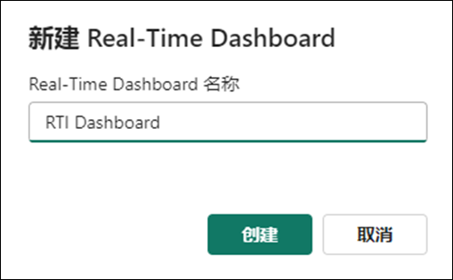
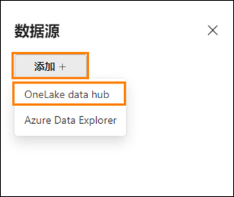
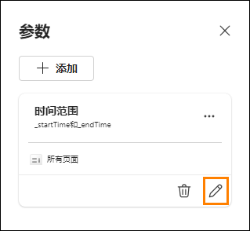
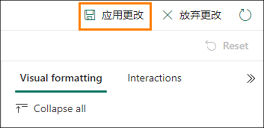
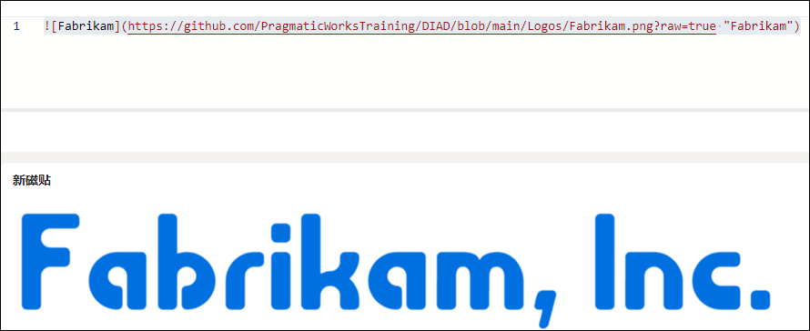
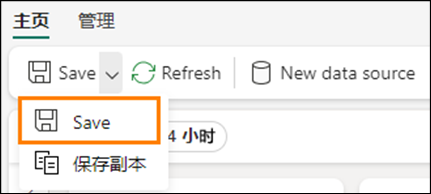

# Microsoft Fabric Real-Time Intelligence in a Day 实验室 5


# 目录

- 文档结构	
- 简介	
- 实时仪表板	
    - 任务1：创建实时仪表板	
    - 任务2：将数据源连接到实时仪表板	
    - 任务3：使用KQL 创建实时仪表板磁贴	
    - 任务4：向实时仪表板添加更多仪表板磁贴	
    - 任务5：为按位置的展现量添加地图视觉对象	
    - 任务6：在实时仪表板上设置自动刷新	
    - 可选任务7：添加公司徽标	
    - 可选任务8：将条件格式设置应用到视觉对象	
- 总结	
- 参考	
 
# 文档结构

本实验室包含用户需要遵循的步骤以及可提供直观协助的关联屏幕截图。在每个屏幕截图中，以橙色框突出显示的部分指出了用户应注意的区域。

# 简介

在本实验室中，您将使用已流式传输并加载到KQL 数据库中的数据，并使用快捷方式轻松链接到湖屋，以创建实时仪表板，从而可视化和共享您从访问的数据流中获得的见解。

在本实验室结束时，您将了解到：

- 在Fabric 中创建实时仪表板
- 使用KQL 编写查询以填充仪表板中的视觉对象
- 将条件格式设置添加到仪表板视觉对象

# 实时仪表板

## 任务 1：创建实时仪表板

1. 打开课程的 **Fabric 工作区**。

    
 
2. 单击 **+ 新建项**按钮以创建一个新项目。

    
 
3. 您将看到**可视化数据**的类别。单击名为**实时仪表板**的项目。

    

4. 将实时仪表板命名为 **RTI Dashboard**，然后单击**创建**。

    
 
5. 您应该会立即转到实时仪表板的空白实例。

    

## 任务 2：将数据源连接到实时仪表板

1. 在主页功能区下，找到名为 **New data source** 的选项，然后单击该选项。

    

2. 在屏幕右侧显示的弹出窗格中，单击**添加+**，然后选择 **OneLake data hub**。

     
 
3. 此时将显示OneLake 中的可用源列表，仅列出KQL 数据库中的源，因此您只能使用一个选项，即 **eh_Fabrikam** KQL 数据库。选择该选项。

     
  
4. 在屏幕底部，单击 **Connect**。

     

5. 现在，您将能够创建数据源。单击弹出窗格底部的 **Add** 按钮。

     
 
6. 现在，您将看到实时仪表板中已添加一个数据源。如果需要，您可以从此处添加其他 KQL 数据库。现在，单击窗口底部的**关闭**。

     
 
## 任务 3：使用KQL 创建实时仪表板磁贴

1. 单击仪表板中的空白磁贴以使用视觉对象填充磁贴。

     

2. 默认情况下，您将连接到之前创建的KQL 数据库作为源。您可以从此处编写自己的KQL 查询，以使用数据填充此视觉对象。删除默认存在的所有先前Markdown KQL。复制以下查询并将其粘贴到查询窗口中。

     ``` 
     //Clicks by hour Clicks
     | where eventDate between (_startTime.._endTime)
     | summarize date_count = count() by bin(eventDate, 1h)
     | render timechart
     | top 30 by date_count
     | sort by eventDate
     ```

3. 正确配置查询后，运行查询以查看结果。

     
 
4. 请注意，您的输出中可能只有一个结果。这是由于为此磁贴默认设置了**时间范围**。您有一个参数，使用该参数可以更改返回数据的时间范围。eventDate between (_startTime.._endTime) 允许您利用此参数。将**时间范围**参数修改为**最后 3 小时**并观察输出如何变化。

     
 
5. 现在，您应该在查询输出中看到最后 3 小时的时间范围内的点击结果。

     

6. 虽然可以修改此参数，但您可能希望它默认为特定时间范围，而不是强制用户修改它。在时间范围选项上方，单击 **@ 参数**选项。

     
 
7. 单击**铅笔图标**以编辑**时间范围**参数。

     
  
8. 将**默认值**更改为**最后 24 小时**，以默认始终显示最后一天。完成后，单击**完成**。

     

9. 关闭参数窗格。

10. 现在，单击查询结果上方的 **+ 添加视觉对象按钮**。

     

11. 屏幕右侧将显示一个新的弹出窗口。单击 **Tile name** 选项下方的文本框，以将此视觉对象命名为 **Clicks by Hour**。

     
 
12. 默认情况下，用于显示此KQL 查询结果的视觉对象是表。这可能不是让用户快速使用和理解数据结果所发生情况的最佳方式。将视觉对象类型从表更改为 **Area chart**。

     

13. 设置视觉对象的新格式后，您可以使用之前在本课程中创建的数据流更好地了解电子商务站点中点击数的高峰和低谷。

     
 
14. 若要将此视觉对象保存到仪表板，请单击屏幕右上角的**应用更改**按钮。

     

15. 将此视觉对象放入仪表板后，该视觉对象可能仅显示最后一个小时的结果。修改仪表板以 显示**最后 24 小时**的**时间范围**。

     

16. 刷新视觉对象，可以看到结果将略有变化，以反映自上次执行查询以来传入的数据。

     

## 任务 4：向实时仪表板添加更多仪表板磁贴

1. 从实时仪表板的**主页功能区**中，单击 **New tile **按钮。

     

2. 将以下KQL 查询输入到查询窗格中。

     ```
     //Impressions by hour Impressions
     | where eventDate between (_startTime.._endTime)
     | summarize date_count = count() by bin(eventDate, 1h)
     | render timechart
     | top 30 by date_count
     | sort by eventDate
     ```

3. **运行**查询。

     
 
4. 单击 **+ 添加视觉对象**按钮。

     

5. 编辑视觉对象，将 **Tile name** 更改为 **Impressions by Hour**，将 **Visual type** 更改为 **Area chart**。

     
 
6. 将更改应用到视觉对象。

     

7. 再添加一个 **+ New tile**。

     
 
8. 复制以下查询并将其粘贴到查询窗格中。请注意，这是一个多语句查询，它使用多个let 语句和一个由分号组合的查询。

     ```
     //Clicks, Impressions, CTR

     let imp = Impressions
     | where eventDate between (_startTime.._endTime)
     | extend dateOnly = substring(todatetime(eventDate).tostring(), 0, 10)
     | summarize imp_count = count() by dateOnly;


     let clck = Clicks
     | where eventDate between (_startTime.._endTime)
     | extend dateOnly = substring(todatetime(eventDate).tostring(), 0, 10)
     | summarize clck_count = count() by dateOnly;


     imp
     | join clck on $left.dateOnly == $right.dateOnly
     | project selected_date = dateOnly , impressions = imp_count , clicks = clck_count, CTR = clck_count * 100 / imp_count
     ```

9. **运行**查询以查看结果。

     
 
10. 单击 **+ 添加视觉对象**按钮。

11. 显示视觉对象设置时，修改以下设置以创建展现量计数。

    - **Tile name-** Impressions
    - **Visual type-** Stat
    - **Value column-** impressions (long)

      
  
12. 当所有设置均已正确配置时，选择**应用更改**。

     
 
13. 在新磁贴上，单击省略号 (…)，然后选择**复制磁贴**选项。

     

14. 针对复制的磁贴单击**铅笔图标**以编辑配置。

     
 
15. 将此 **Tile name** 重命名为 **Clicks**，将 **Value column** 更改为 **clicks (long)**。

     

16. 将更改应用到此视觉对象。

17. 再次复制其中任一新磁贴，创建一个最终统计信息视觉对象。

     
 
18. 编辑新磁贴，以将 **Tile name** 更改为 **Click Through Rate**，将 **Value column** 更改为 **CTR (long)**。

     

19. 应用更改。

20. 如果磁贴已分离，或者您要重新组织它们，可以将鼠标悬停在磁贴上，直到显示手形图标，然后将视觉对象拖放到所需位置。

     

## 任务 5：为按位置的展现量添加地图视觉对象

1. 向实时仪表板添加 **New tile**。

     

2. 复制以下查询并将其粘贴到查询窗格中。此查询从此数据流的IP 地址列中提取纬度和经度，以生成可在地图上绘制的位置。此查询可能比之前的查询花费更多时间。

     ```
     //Impressions by location Impressions
     | where eventDate between (_startTime.._endTime)
     | join external_table('products') on $left.productId == $right.ProductID
     | project lon = toreal(geo_info_from_ip_address(ip_address).longitude), lat = toreal(geo_info_from_ip_address(ip_address).latitude), Name
     | render scatterchart with (kind = map) //, xcolumn=lon, ycolumns=lat)
     ```

3. 执行查询以验证其配置是否正确。单击 **+ 添加视觉对象**按钮。

     

4. 将 **Tile name** 更改为 **Impressions by Location**，将 **Visual type** 更改为 **Map**。

     
  
5. 在 **Visual type** 区域下，通过将**通过以下方式定义位置**选项修改为**纬度和经度**确保正确选择了纬度和经度，并验证剩余字段是否与下图匹配。

     

6. 应用更改。

7. 抓取仪表板中地图视觉对象左下角的定位点，以增大视觉对象的大小。

     
 
8. 所有视觉对象均可重设大小并且可移动。按所需方式随时重新排列视觉对象。

     

9. 保存更改。

     
 
## 任务 6：在实时仪表板上设置自动刷新

1. 单击**管理功能区**，然后选择**自动刷新**选项。

     

2. 打开切换开关以启用**自动刷新**。

     
 
3. 将**最小时间间隔**修改为 30 秒，将**默认刷新率**修改为 1 分钟。

     

4. 单击窗口底部的**应用**。

5. 在菜单的右上角，单击**正在编辑**按钮，然后将其修改为**正在查看**以查看您的最终用户将使用此实时仪表板获得什么体验。

     

6. 如果时间允许，并且您有兴趣检索公司徽标或对视觉对象应用条件格式设置（如下所示），请随时完成以下可选任务。否则，实验室就完成了！

     
 
## 可选任务 7：添加公司徽标

1. 就像我们之前所做的那样，从仪表板的**正在查看**模式切换到**正在编辑**模式。

     

2. 单击主页功能区中名为 **New text tile** 的按钮。

     
 
3. 复制以下Markdown 代码并将其粘贴到查询窗口中。

     ```
     
     ```

     

4. 应用更改。

5. 重设磁贴大小并移动磁贴，以适应实时仪表板中的某个位置。

     
  
6. 保存更改。

     

## 可选任务 8：将条件格式设置应用到视觉对象

1. 单击 **Click Through Rate** 视觉对象上的**铅笔图标**。

     

2. 在视觉对象格式设置窗格底部，单击**条件格式**下方的 **+ Add rule** 按钮。

     
 
3. 单击**铅笔图标**以编辑条件格式设置规则。

     
 
4. 修改规则的条件以指向名为 **CTR (long)** 的 **Column**，并将Operator 和 Value 设为规则 **> 10**。

     

5. 按所需方式随时修改格式设置。只要CTR 值大于 10，它就会显示在该视觉对象上。

     
 
6. 单击“条件格式设置”窗格中的**保存**按钮。

     

7. 应用更改。

8. 保存更改。

     

# 总结

在本实验室中，用户创建了一个实时仪表板并将其连接到我们的KQL 数据库。我们发现，我们使用KQL 语言来管理查询，然后我们可以通过多种方式可视化结果，每个视觉对象都有自己的配置。同时，我们还了解了如何修改仪表板中可用的默认参数，并进行设置以便仪表板将自动更新。
 
# 参考

Fabric Real-time Intelligence in a Day (RTIIAD) 向您介绍了Microsoft Fabric 中提供的一些主要功能。在服务菜单中，“帮助 (?)”部分包含指向一些优质资源的链接。

 

以下更多参考资源可帮助您进行与 Microsoft Fabric 相关的后续步骤。

- 请参阅博客文章以阅读完整的 [Microsoft Fabric GA 公告](https://aka.ms/Fabric-Hero-Blog-Ignite23)

- 通过[引导式教程](https://aka.ms/Fabric-GuidedTour)探索Fabric

- 注册[Microsoft Fabric 免费试用版](https://aka.ms/try-fabric)

- 访问[Microsoft Fabric 网站](https://aka.ms/microsoft-fabric)

- 通过探索[Fabric 学习模块](https://aka.ms/learn-fabric)学习新技能

- 探索[Fabric 技术文档](https://aka.ms/fabric-docs)

- 阅读[有关Fabric 入门指南的免费电子书](https://aka.ms/fabric-get-started-ebook)

- 加入[Fabric 社区](https://aka.ms/fabric-community)以发布问题、共享反馈并向他人学习

阅读更多深度Fabric 体验公告博客：

- [Fabric 中的Data Factory 体验博客](https://aka.ms/Fabric-Data-Factory-Blog)

- [Fabric 中的Synapse Data Engineering 体验博客](https://aka.ms/Fabric-DE-Blog)

- [Fabric 中的Synapse Data Science 体验博客](https://aka.ms/Fabric-DS-Blog)

- [Fabric 中的Synapse Data Warehousing 体验博客](https://aka.ms/Fabric-DW-Blog)

- [Fabric 中的Synapse Real-Time Intelligence 体验博客](https://blog.fabric.microsoft.com/en-us/blog/category/real-time-intelligence)
 
- [Power BI 公告博客](https://aka.ms/Fabric-PBI-Blog)

- [Fabric 中的Data Activator 体验博客](https://aka.ms/Fabric-DA-Blog)

- [Fabric 中的管理和治理博客](https://aka.ms/Fabric-Admin-Gov-Blog)

- [Fabric 中的OneLake 博客](https://aka.ms/Fabric-OneLake-Blog)

- [Dataverse 和Microsof t Fabric 集成博客](https://aka.ms/Dataverse-Fabric-Blog)

© 2024 Microsoft Corporation.保留所有权利。

使用本演示/实验室即表示您已同意以下条款：

本演示/实验中的技术/功能由Microsoft Corporation 出于获取反馈和提供学习体验的目的提供。只能将本演示/实验用于评估这些技术特性和功能以及向Microsoft 提供反馈。不得用于任何其他用途。不得对此演示/实验或其任何部分进行修改、复制、分发、传送、显示、执行、复制、公布、许可、转让、销售或基于以上内容创建衍生作品。

严禁将本演示/实验（或其任何部分）复制到任何其他服务器或位置以便进一步复制或再分发。

本演示/实验室出于上述目的，在不涉及复杂设置或安装操作的模拟环境中提供特定软件技术/产品特性和功能，包括潜在的新功能和概念。本演示/实验室中展示的技术/概念可能不是完整的功能，可能会以不同于最终版本的工作方式工作。我们也可能不会发布此类功能或概念的最终版本。在物理环境中使用此类特性和功能的体验可能也有所不同。

**反馈**。如果您针对本演示/实验室中所述的技术特性、功能和/或概念向Microsoft 提供反 馈，则意味着您向Microsoft 无偿提供以任何方式、出于任何目的使用和分享您的反馈并将其商业化的权利。您同样无偿为第三方提供其产品、技术和服务使用或配合使用包含此反馈的Microsoft 软件或服务的任何特定部分所需的任何专利权。如果根据某项许可的规定，Microsoft 由于在其软件或文档中包含了您的反馈需要向第三方授予该软件或文档的许可，请不要提供这样的反馈。这些权利在本协议终止后继续有效。

对于本演示/实验室，MICROSOFT CORPORATION 不提供任何明示、暗示或法定的保证和条件，包括有关适销性、针对特定目的的适用性、所有权和不侵权的所有保证和条件。对于使用本演示/实验产生的结果或输出内容的准确性，或者出于任何目的包含本演示/实验中的信息的适用性，Microsoft 不做任何保证或陈述。

# 免责声明

本演示/实验仅包含Microsoft Power BI 的部分新功能和增强功能。在产品的后续版本中，部分功能可能有所更改。在本演示/实验中，可了解部分新功能，但并非全部新功能。

