# 目录

- 文档结构	
- 简介	
- 使用Reflex 创建警报	
    - 任务1：使用实时仪表板设置警报	
    - 任务2：从Reflex 体验测试电子邮件警报	
    - 任务3：从数据流中创建新Reflex 对象	
- 清理资源	
    - 任务4：清理工作区	
- 总结	
- 参考	

# 文档结构

本实验室包含用户需要遵循的步骤以及可提供直观协助的关联屏幕截图。在每个屏幕截图中，以橙色框突出显示的部分指出了用户应注意的区域。

# 简介

在本实验室中，您将了解如何利用Data Activator 创建Reflex，以从我们新创建的实时仪表板发送警报。此外，我们还将了解如何扩展Reflex 的使用范围，以针对我们流式传输到Eventhouse中的数据创建其他自定义警报

在本实验室结束时，您将了解到：

- 从实时仪表板上的警报选项创建Reflex

- 使用Data Activator Reflex 项目创建更多自定义警报

# 使用Reflex 创建警报

## 任务 1：使用实时仪表板设置警报

1. 打开课程的 **Fabric 工作区**，然后选择您在上一个实验室中创建的实时仪表板。

    

2. 在**点击率**视觉对象上，单击省略号 (…)，然后选择 **Set alert** 选项。

    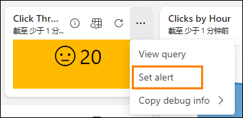
 
3. 屏幕右侧将打开一个新的弹出窗口。您可以从仪表板查看正在监视的内容，包括警报将关联的特定视觉对象。条件是您可以完全控制的内容。将**条件**修改为**小于**。

    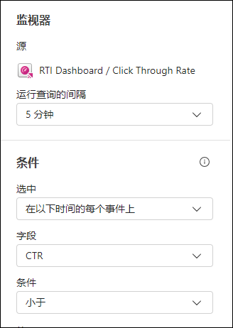

4. 将显示一个新字段，以供您输入**值**，将此值修改为 **20**。

    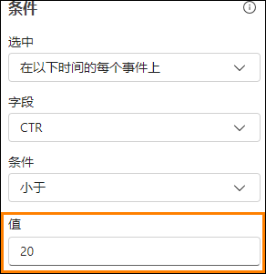
 
5. 目前有三种可能的操作可用于在Data Activator Reflex 项目识别到您的条件已满足后，您希望收到哪种类型的警报。选择**在Teams 中向我发送消息**选项。

    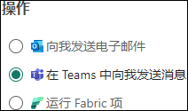
 
6. 最后，您需要决定使用此警报创建的 **Reflex 项目**的存储位置。默认情况下，这应该会选择您的当前工作区，但您需要在“项”下拉菜单下特别标注**创建新项**。

    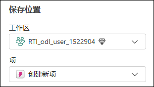

7. 将项目重命名为 **CTR Reflex**，然后单击**创建**。创建需要一些时间。

    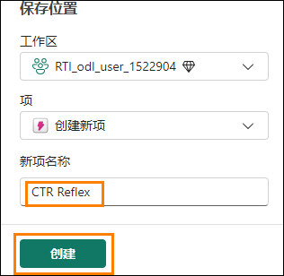
 
8. 您将收到已创建反射警报的验证。单击**打开**按钮以打开 Reflex。

    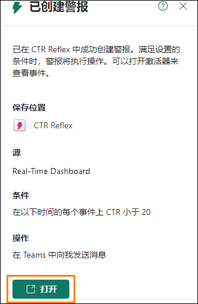
 
9. 系统会将您转到正式的 **Reflex 体验**。从此处，您可以实时监视数据流，查看用于支持

    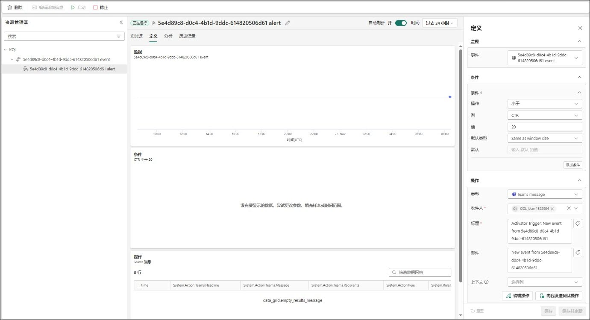

# Reflex 的数据，以及从同一流创建其他触发器。

## 任务 2：从Reflex 体验测试电子邮件警报

1. 在Reflex 体验中，单击事件名称旁边的铅笔图标，然后将其重命名为 **CTR is less than 20**

    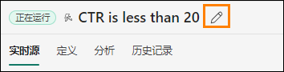

2. 我们也将更新**标题**和**邮件**，这些内容可在右侧的**操作**部分中找到。更新这两个区域以如下图所示，然后单击**保存并更新**。

    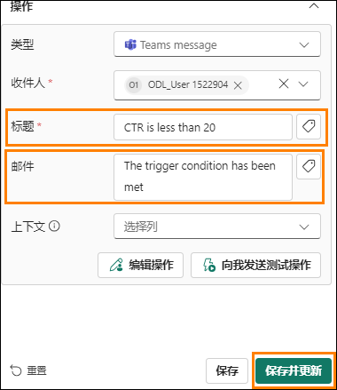
 
3. 在右侧的同一**操作**部分中，单击**向我发送测试操作**按钮，以从 Reflex 获取 Teams 中的示例消息。

    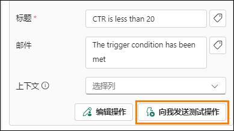

4. 在您的环境Edge 浏览器中打开“新建选项卡”，然后转到 Teams.Microsoft.com。

5. 使用您的环境凭据登录（如果需要）。可能会显示“开始试用”消息，您希望接受本消息。

6. 您应该在Teams 中看到一条消息，告知您CTR 小于 20。

    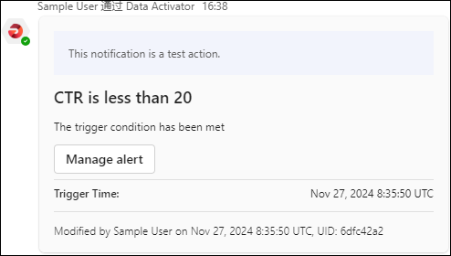
 
7. 导航回Reflex 体验，让我们创建另一个触发器。

## 任务 3：从数据流中创建新Reflex 对象

1. 选择标记为 **KQL Source Event** 的对象，然后选择**新建规则**。

    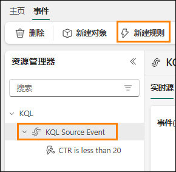
  
2. 单击**铅笔**图标，然后将此规则命名为 **Clicks Greater Than 30,000**（您可以在此处选择一个更符合您流式传输的数据量的值）。

    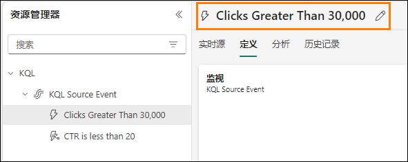

3. 首先，您需要监视数据流中的一列，为此我们需要配置“条件”和“操作”部分。单击规则的 “定义”选项卡以设置条件和操作。

4. 在打开的“定义”页面中，在**条件**中，选择以下属性：

    - **操作=** 大于
    - **列=** clicks
    - **值=** 30000

   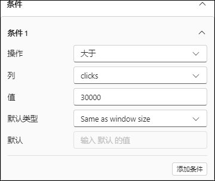

5. 在**操作**中，选择下面的属性：
    
    - **类型=** Teams message
    - **收件人=** {your user id here}

   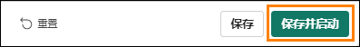

6. 最后，单击**保存并启动**以启动此规则

    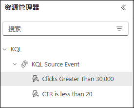

7. 现在，有两个触发器在监视同一个数据流。

    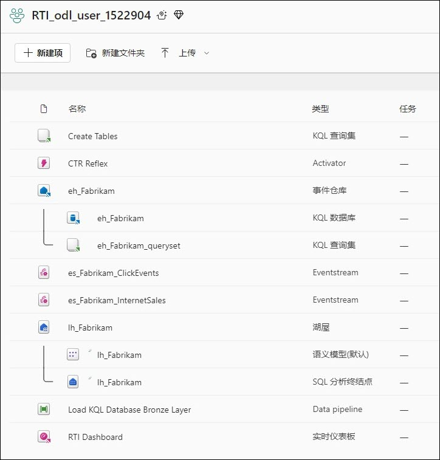

# 清理资源

## 任务 4：清理工作区

1. 这是Real-Time Analytics in a Day 的最后一个实验室，也是最后一部分。如果您已完成该实验室，并且针对该内容没有需要讲师解决的其他问题或需求，请帮助我们解除分配工作区。导航回 **RTI_username** 工作区。

    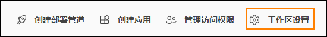

2. 单击右上角的**工作区设置**。

    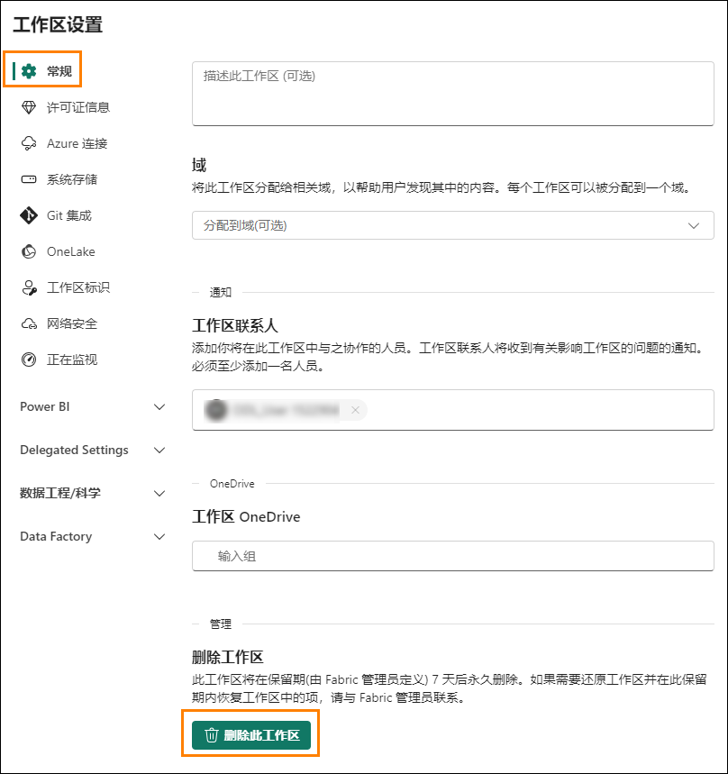
 
3. 从**常规**工作区设置中，向下滚动并单击**删除此工作区**按钮。

    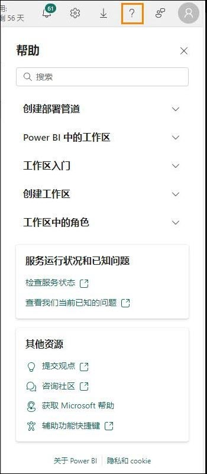

4. 实验室和课程结束！
 
# 总结

在本实验室中，我们演练了如何使用Data Activator。利用本功能，您可以直接连接到实时仪表板或数据流，并基于该数据创建触发器。然后，可以使用检测条件配置这些触发器，满足这些条件后，即可采取行动。在本实验室中，我们使用了在触发器中满足特定条件时发送电子邮件的功能。Data Activator 仍处于预览版阶段，因此将来可能会提供新操作。

# 参考

Fabric Real-time Intelligence in a Day (RTIIAD) 向您介绍了Microsoft Fabric 中提供的一些主要功能。在服务菜单中，“帮助 (?)”部分包含指向一些优质资源的链接。

  

以下更多参考资源可帮助您进行与 Microsoft Fabric 相关的后续步骤。

- 请参阅博客文章以阅读完整的 [Microsoft Fabric GA 公告](https://aka.ms/Fabric-Hero-Blog-Ignite23)

- 通过[引导式教程](https://aka.ms/Fabric-GuidedTour)探索Fabric

- 注册[Microsoft Fabric 免费试用版](https://aka.ms/try-fabric)

- 访问[Microsoft Fabric 网站](https://aka.ms/microsoft-fabric)

- 通过探索[Fabric 学习模块](https://aka.ms/learn-fabric)学习新技能

- 探索[Fabric 技术文档](https://aka.ms/fabric-docs)

- 阅读[有关Fabric 入门指南的免费电子书](https://aka.ms/fabric-get-started-ebook)

- 加入[Fabric 社区](https://aka.ms/fabric-community)以发布问题、共享反馈并向他人学习

阅读更多深度Fabric 体验公告博客：

- [Fabric 中的Data Factory 体验博客](https://aka.ms/Fabric-Data-Factory-Blog)

- [Fabric 中的Synapse Data Engineering 体验博客](https://aka.ms/Fabric-DE-Blog)

- [Fabric 中的Synapse Data Science 体验博客](https://aka.ms/Fabric-DS-Blog)

- [Fabric 中的Synapse Data Warehousing 体验博客](https://aka.ms/Fabric-DW-Blog)

- [Fabric 中的Synapse Real-Time Intelligence 体验博客](https://blog.fabric.microsoft.com/en-us/blog/category/real-time-intelligence)
 
- [Power BI 公告博客](https://aka.ms/Fabric-PBI-Blog)

- [Fabric 中的Data Activator 体验博客](https://aka.ms/Fabric-DA-Blog)

- [Fabric 中的管理和治理博客](https://aka.ms/Fabric-Admin-Gov-Blog)

- [Fabric 中的OneLake 博客](https://aka.ms/Fabric-OneLake-Blog)

- [Dataverse 和Microsof t Fabric 集成博客](https://aka.ms/Dataverse-Fabric-Blog)

© 2024 Microsoft Corporation.保留所有权利。

使用本演示/实验室即表示您已同意以下条款：

本演示/实验中的技术/功能由Microsoft Corporation 出于获取反馈和提供学习体验的目的提供。只能将本演示/实验用于评估这些技术特性和功能以及向Microsoft 提供反馈。不得用于任何其他用途。不得对此演示/实验或其任何部分进行修改、复制、分发、传送、显示、执行、复制、公布、许可、转让、销售或基于以上内容创建衍生作品。

严禁将本演示/实验（或其任何部分）复制到任何其他服务器或位置以便进一步复制或再分发。

本演示/实验室出于上述目的，在不涉及复杂设置或安装操作的模拟环境中提供特定软件技术/产品特性和功能，包括潜在的新功能和概念。本演示/实验室中展示的技术/概念可能不是完整的功能，可能会以不同于最终版本的工作方式工作。我们也可能不会发布此类功能或概念的最终版本。在物理环境中使用此类特性和功能的体验可能也有所不同。

**反馈**。如果您针对本演示/实验室中所述的技术特性、功能和/或概念向Microsoft 提供反 馈，则意味着您向Microsoft 无偿提供以任何方式、出于任何目的使用和分享您的反馈并将其商业化的权利。您同样无偿为第三方提供其产品、技术和服务使用或配合使用包含此反馈的Microsoft 软件或服务的任何特定部分所需的任何专利权。如果根据某项许可的规定，Microsoft 由于在其软件或文档中包含了您的反馈需要向第三方授予该软件或文档的许可，请不要提供这样的反馈。这些权利在本协议终止后继续有效。

对于本演示/实验室，MICROSOFT CORPORATION 不提供任何明示、暗示或法定的保证和条件，包括有关适销性、针对特定目的的适用性、所有权和不侵权的所有保证和条件。对于使用本演示/实验产生的结果或输出内容的准确性，或者出于任何目的包含本演示/实验中的信息的适用性，Microsoft 不做任何保证或陈述。

# 免责声明

本演示/实验仅包含Microsoft Power BI 的部分新功能和增强功能。在产品的后续版本中，部分功能可能有所更改。在本演示/实验中，可了解部分新功能，但并非全部新功能。
