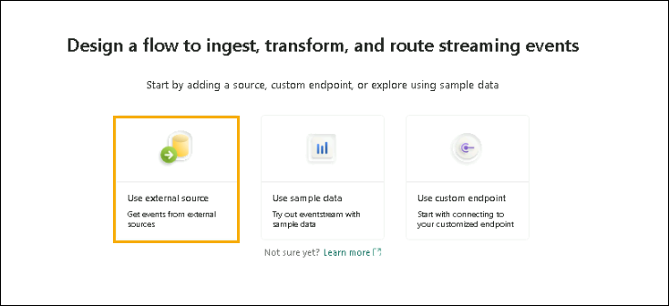
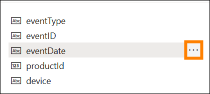

# Microsoft Fabric Real-Time Intelligence in a Day Lab 3


# Contents

- Document Structure
- Introduction
- Fabric Eventstreams
    - Task 1: Create an Eventstream
    - Task 2: Transform the Eventstream
    - Task 3: Split Eventstream and Load Two Destinations
- Adding More Data to KQL Database
    - Task 4: Validate Event Data Tables
    - Task 5: Create KQL Database Shortcuts for Dimension tables
- Summary
- References

# Document Structure 

The lab includes steps for the user to follow along with associated
screenshots that provide visual aid. In each screenshot, sections are
highlighted with orange boxes to indicate the area(s) user should
focus on.

# Introduction 

In this lab, you will create another Eventstream to ingest additional
data into our existing Eventhouse. We will see how to include
transformations within the Eventstream to control what data we want to
be adding to the KQL database

By the end of this lab, you will have learned:

- Eventstream Processing and Transformation

- Write KQL Queries to Join Data from an external Database

- Use KQL to query data and view within Power BI

# Fabric Eventstreams

## Task 1: Create an Eventstream 

1. Open the **Fabric workspace** you have been using for the course
today.

    

2. There is additional streaming data for us to Ingest related to our
e-commerce store. For this Eventstream though we will want to
transform the data prior to loading it into the Eventhouse. Instead
of going to the **"Real-Time Hub"** we can create a new Eventstream
directly from the workspace. From the **+ New** **item** menu,
create a new **Eventstream**.

    

3. Give the new Eventstream the name, **es_Fabrikam_ClickEvents**, and then click on **Create**.

    

4. In the newly created eventstream, click on **Use external source**.

    

5. Similarly to the previous lab we will be connecting to an Azure
Event Hub which has data being streamed to from a python notebook.
Click on **"Connect"** for the **"Azure Event Hubs"** tile. If you
do not see "**Azure Event Hubs"** in the recommended section, then
select **"View all source"** to discover it.

    

6. Create a **New connection**.

    

7. Please copy and paste all the required connection settings into the corresponding fields using the details provided below.

 - Event Hub namespace :
     ```
     rtiadhub<inject key="DeploymentID" enableCopy="false"/>
     ```
 - Event Hub :
     ```
     rti-iad-clicks
     ```
 - Shared Access Key Name :
     ```
     rti-reader
     ```
 - Shared Access Key :

    ```
    <inject key="rti-iad-clicks Primary Key" enableCopy="false"/>
    ```
     
     

    >**Note**: If the primary SAS key , shows any error as invalid creds Follow the below steps : 

    i. Go to the azure portal search for the event hub select the **rtiadhub<inject key="DeploymentID" enableCopy="false"/>** and under enities select event hubs

    ii. Select the **rti-iad-clicks**

    iii. Under the settings from the left hand side Shared access policies and click on rti-reader and copy the Secondary key

8. Once all the properties have been filled out click on **Connect**.

    >**Note:** Connecting might take a while. If an error appears, refresh the page and repeat the steps outlined above.
   
9. In the configuration of the Azure Event Hub data source, you may
need to modify the **Consumer group** of the Event Hub to ensure
that you gain access to a unique access point to the stream of data.
For this workshop you can leave the "\$Default" value as shown below

    

10. Click on **Next**.

11. On the review and create window, verify that everything is
configured correctly and click **Add**.

    

12. Once the stream is configured, you will be able to see a preview of
the data coming from the Event Hub.

    

13. Examine the data being received. There are two types of events that
are logged from the e-commerce website, click and impressions.

   - **IMPRESSION** - An impression event is recorded each time an
    advertisement or a product listing is displayed to a user.
    Impressions are a measure of how many times an item (ad or product)
    is viewed, regardless of whether it is interacted with.

   - **CLICK** - A click event is recorded when a user interacts with an
    item by clicking on it. This usually indicates a higher level of
    engagement compared to an impression.

In addition to the clicks and impression events that are logged there
are details about what product the click or impression was for, what
device and browser the webpage was loaded from, and what IP address
accessed the page and how long the page took to load.

## Task 2: Transform the Eventstream

1. You will now take this stream of data and transform it prior to
being ingested into your KQL Database in a way that can be easily
understood for analysts looking to derive insights from this data.
Within the Eventstream canvas, click on the dropdown for the **Transform events** object.

    

2. From the list of available operations, select the **Manage fields**
option.

    

3. On the new icon that appears called **ManageFields** click on the **pencil icon** to select what fields you wish to add to your stream from the source.

    

4. In the flyout pane that appears, click on the button the option to **Add all fields**.

    

5. From the list of fields, select the one called **PartitionId** and
click on the ellipses (...) that appears when you hover over the
field

    

6. Choose the option to **Remove** that field. For this stream of data
coming from the Event Hub, partitioning is not being used so this
column is not helpful to us, thus we are removing it.

    

7. Remove all the following fields that will not be needed for this
stream.

    - userAgent

    - page_loading_seconds

    - EventProcessedUtcTime

    - EventEnqueredUtcTime

    You should be left with the following fields in the image below.

    

8. Hover over the eventDate field and when an ellipses (...) appears on
the right-hand side of the window, click it.

    

9. Choose the option, **Edit**.

    

10. Click on the **Change type toggle** to modify the data type of this field. The original type is a String, you need to modify the **Converted Type** to **DateTime**. After you have finished click on **Save**.

    

## Task 3: Split Eventstream and Load Two Destinations

1. While you could load this stream of data to a KQL Database for
analysis, you may want to have another way to consume this data to
differentiate CLICK events and IMPRESSION events. Add another
transformation activity to the user interface by hovering over the
end of the **ManageFields** transform

    

1. Choose the **Filter** transform from the available list of
operations.

    

1. Click on the **pencil icon** on the new transformation, **Filter**.

    

1. In the flyout that appears on the right-hand side of the screen,customize the filter conditions to reflect a way to only return CLICK values by using the settings below. It is important to note that the Filter transform is case sensitive

   - **Operation name** - Clicks

   - **Select a field to filter on** - eventType

   - **Keep events when the value** - equals -- CLICK **(Important! This
    is a case sensitive field, ensure to input in all capitals for this
    example)**

     

1. Choose the **Save** option to keep your changes.

1. Click on the **Refresh button** again to verify the data has been
filtered to CLICK eventTypes.

    

1. These may be the only rows that you're interested in sending to a table but another option is to instead create two separate streams to route different information to two or more tables. From the **Home** ribbon of the Eventstream click on the **Transform events** dropdown and then select **Filter**.

    

1. A new object called **Filter (Name may differ)** will appear on your
canvas. You will need to connect the **ManageFields** stream to the
new filter transformation. Drag a line from the green dot on one
transform to another to make that connection.

    

1. Click on the **pencil icon** for **Filter** to edit its settings.

    

1. In the flyout that appears on the right-hand side of the screen,
customize the filter conditions to reflect a way to only return
IMPRESSION values by using the values below. Remember that the
Filter transform is case sensitive

    - **Operation name** - Impressions

    - **Select a field to filter on** - eventType

    - **Keep events when the value** - equals -- IMPRESSION **(Important!
    This is a case sensitive field, ensure to input in all capitals for
    this example)**

      

1. Choose the **Save** option to keep your changes.

1. Before we load the data into new tables within our KQL Database we
can remove additional columns which are not needed. In this case for
the stream of data which is filtered for our "CLICK" records we no
longer need the "eventType" column since every row holds the same
value. For our "IMPRESSION" stream of data we can remove the
"eventType" column for the same reasons mentioned above and we can
also remove the "referrer" column as it is empty for every row in
this table.

1. Click on the **+ icon** after the **Clicks** filter operation.

    

1. In the dropdown menu select "Manage fields".

    

1. Click on the **pencil icon** to select what fields you wish to add/remove to your stream.

    

1. Rename the operation to "Manage_Clicks". As well select "Add all fields" then remove "eventType". Once done click **Save**.

    

1. Next, let's add another "Manage fields" transform connected to the "Impressions" filter as seen below.

    

1. Click on the **pencil icon** to select what fields you wish to add/remove to your stream.

    

1. Rename the operation to "Manage_Impressions". Then select "Add all fields" then remove "eventType" and "referrer". Your "Manage fields" transform should look like the following:

    

1. Now that you have cleaned up the data for the streams for each of the types of events, you need to load each stream into a new table on the KQL Database. Click on the **+ icon** after the **Manage_Clicks** manage fields operation.

    

1. In the dropdown list that appears, go to **Destinations** and select **Eventhouse**.

    

1. Click on the **pencil icon** for the Eventhouse destination.

    

1. For this destination, configure the following properties.

    - **Destination name** -- dbo-Clicks

    - **Workspace** - RTI_<inject key="DeploymentID" enableCopy="false"/>

    - **Eventhouse** -- eh_Fabrikam

    - **KQL Database** - eh_Fabrikam

    - **KQL Destination Table** - Create a new table called **Clicks**

      

1. Click on **Save** at the bottom of the flyout.

1. Configure the following properties for this destination and select the details from the dropdown.

    - **Destination name** :
       ```
       dbo-Impressions
       ```
    - **Workspace** :
        ```
        RTI_<inject key="DeploymentID" enableCopy="false"/>
        ```
    - **Eventhouse** :
         ```
         eh_Fabrikam
         ```
    - **KQL Database** :
         ```
         eh_Fabrikam
         ```
    - **KQL Destination Table** - Create a new table called **Impressions**

        

1. Save your changes.

1. This Eventstream is now ready to begin streaming. Click on **Publish** to begin that stream.

    

1. With the Eventstream now running, you should see the Eventstream
user interface slightly change to signify that you are streaming the
data from Event Hub transforming and splitting that data stream and
loading it into two separate KQL Database tables.

    

# Adding More Data to the KQL Database

## Task 4: Validate Event Data Tables

1. Return to your **RTI_<inject key="DeploymentID" enableCopy="false"/>** workspace.

2. Open the **eh_Fabrikam** KQL Database.

    

3. With the Eventstream running you should now see two new tables on
the KQL Database Overview page. After letting the Eventstream run
for a few moments you will see that the **Top tables** within the
KQL Database will be displayed on the Overview page and show how
much data is stored within the tables.

    

4. Click on the **Impressions** table. This table receives about 1.5
million records every 24 hours. There are many more impressions than
Clicks so this will be your largest table for the purposes of this
class.

    

## Task 5: Create KQL Database Shortcuts for Dimension tables

Up to this point you have been working with streaming data, but are
still missing some critical elements to be able to derive intelligence
from the data you have brought in. In this task we will bring in data
from an external Azure SQL Database which will serve as dimension tables
within our KQL Database. This will allow us to better describe the data
we are streaming currently. For example, all our tables contain a form
of Product ID which is a numeric field, but it would be better if we had
some sort of Product name to be able to display. The data we need to
support this is currently in an external Azure SQL Database, let's see
how easy it is to make connections to some of these dimension tables.

1. In the **eh_Fabrikam** database, click on the drop-down menu called **New related item**. Then choose the option that says Queryset.

    

2. Give the KQL Queryset the name **Create Tables** and then click the **Create** button.

    

3. The OneLake data hub will open and the only option to select with be the **"eh_Fabrikam"** kql database. Select this database and click **"Connect"**.

     

3. In the new interface click once within the query window and
highlight all the text by using the keyboard shortcut **Ctrl + A**.
Once everything has been highlighted, delete everything.

    

4. In the blank query window enter the following KQL script. Thisscript will create a connection to an external Azure SQL Database and make it available within our KQL database as a **Shortcut**. A **Shortcut** is attached in a read-only mode, making it possible to view and run queries alongside the streaming data that was ingested into the KQL database.

    ```
    .execute database script <|
    //External tables - shortcuts
    // connect to operational Database with external table Product
    .create external table products (ProductID: int, ProductNumber: string,  Name: string) 
    kind=sql
    table=[SalesLT.Product]
    ( 
    h@'Server= fabrikamserverdb.database.windows.net,1433;Initial Catalog=fabrikamdb;User Id=demouser;Password=fabrikam@1234567'
    )
    with 
    (
    createifnotexists = true
    )  
    // connect to operational Database with external table ProductCategory
    .create external table productCategories (ProductCategoryID: int, Name: string) 
    kind=sql
    table=[SalesLT.ProductCategory]
    ( 
    h@'Server= fabrikamserverdb.database.windows.net,1433;Initial Catalog=fabrikamdb;User Id=demouser;Password=fabrikam@1234567'
    )
    with 
    (
    createifnotexists = true
    )  
    ```

    

5. Click the **Run** button to execute the script.

    

6. In your Database Explorer window, you will now see a new folder
called **Shortcuts** and within the folder you should see two
additional tables that are linked to this KQL Database. These tables
exist within an Azure SQL Database, but through the script you
executed, you now have them linked to this KQL Database to be joined
with your InternetSales and event tables.

    

7. Now that you have dimensional qualities to your database, you can
answer questions and give more context to consumers of the reports
and queries these tables off insights on across your business. Run
the following KQL query to see one of them.

    ```
    InternetSales
    | join kind=inner 
    (external_table("products")) on ($left.ProductKey == $right.ProductID)
    | summarize SalesPerProduct=sum(SalesAmount) by Name
    | project Name, SalesPerProduct
    ```

8. You will now see in your query results values for each individual
product that your company has sold.

    

9. With your query highlighted click on the button in your toolbar, **Create Power BI report**.

    

10. This gives you the opportunity to create a Power BI report using the
data within your KQL Database. Feel free to explore this for a few
moments, but you will not need to create a report from this data
just yet. Click the **X button** in the top-right corner when you
are ready to move forward.

    

11. Navigate back to the **eh_Fabrikam** KQL Database.

    

12. Click on the **Shortcuts** option within the **eh_Fabrikam**
navigation pane. This will show you all the shortcuts you have
created to this KQL Database. It should be noted that these
Shortcuts are considered classical Azure Data Explorer external
tables using Azure SQL external table syntax and are constructed
differently than OneLake, ADLS, or S3 shortcuts which are also
supported in KQL Database within Fabric.

    

# Summary

In this lab, you created another stream of data but were able to
transform the stream using the user interface of the Eventstream in
Fabric. Loading the data to two separate tables has allowed you to track
all the clicks and impressions within your e-commerce system for
marketing, advertising, and analysis purposes. You also created a
shortcut to an external Azure SQL Database using the KQL Queryset
external table feature. You now have a few dimensions to better
understand the context of the sales and clicks within your KQL Database.

# References

Fabric Real-time Intelligence in a Day (RTIIAD) introduces you to some of the key functions available in Microsoft Fabric. In the menu of the service, the Help (?) section has links to some great resources.


Here are a few more resources that will help you with your next steps with Microsoft Fabric.

- See blog post to read the full [Microsoft Fabric GA announcement](https://aka.ms/Fabric-Hero-Blog-Ignite23)
- Explore Fabric through the [Guided Tour](https://aka.ms/Fabric-GuidedTour)
- Sign up for the [Microsoft Fabric free trial](https://aka.ms/try-fabric)
- Visit the [Microsoft Fabric website](https://aka.ms/microsoft-fabric)
- Learn new skills by exploring the [Fabric Learning modules](https://aka.ms/learn-fabric)
- Explore the [Fabric technical documentation](https://aka.ms/fabric-docs)
- Read the [free e-book on getting started with Fabric](https://aka.ms/fabric-get-started-ebook)
- Join the [Fabric community](https://aka.ms/fabric-community) to post your questions, share your feedback, and learn from others

Read the more in-depth Fabric experience announcement blogs:

- [Data Factory experience in Fabric blog](https://aka.ms/Fabric-Data-Factory-Blog)
- [Synapse Data Engineering experience in Fabric blog](https://aka.ms/Fabric-DE-Blog)
- [Synapse Data Science experience in Fabric blog](https://aka.ms/Fabric-DS-Blog)
- [Synapse Data Warehousing experience in Fabric blog](https://aka.ms/Fabric-DW-Blog)
- [Real-](https://aka.ms/Fabric-RTA-Blog)[Time Intelligence experience in Fabric blog](https://blog.fabric.microsoft.com/en-us/blog/category/real-time-intelligence)[](https://aka.ms/Fabric-RTA-Blog)
- [Power BI announcement blog](https://aka.ms/Fabric-PBI-Blog)
- [Data Activator experience in Fabric blog](https://aka.ms/Fabric-DA-Blog)
- [Administration and governance in Fabric blog](https://aka.ms/Fabric-Admin-Gov-Blog)
- [OneLake in Fabric blog](https://aka.ms/Fabric-OneLake-Blog)
- [Dataverse and Microsoft Fabric integration blog](https://aka.ms/Dataverse-Fabric-Blog)

© 2024 Microsoft Corporation. All rights reserved.

By using this demo/lab, you agree to the following terms:

The technology/functionality described in this demo/lab is provided by Microsoft Corporation for purposes of obtaining your feedback and to provide you with a learning experience. You may only use the demo/lab to evaluate such technology features and functionality and provide feedback to Microsoft. You may not use it for any other purpose. You may not modify, copy, distribute, transmit, display, perform, reproduce, publish, license, create derivative works from, transfer, or sell this demo/lab or any portion thereof.

COPYING OR REPRODUCTION OF THE DEMO/LAB (OR ANY PORTION OF IT) TO ANY OTHER SERVER OR LOCATION FOR FURTHER REPRODUCTION OR REDISTRIBUTION IS EXPRESSLY PROHIBITED.

THIS DEMO/LAB PROVIDES CERTAIN SOFTWARE TECHNOLOGY/PRODUCT FEATURES AND FUNCTIONALITY, INCLUDING POTENTIAL NEW FEATURES AND CONCEPTS, IN A SIMULATED ENVIRONMENT WITHOUT COMPLEX SET-UP OR INSTALLATION FOR THE PURPOSE DESCRIBED ABOVE. THE TECHNOLOGY/CONCEPTS REPRESENTED IN THIS DEMO/LAB MAY NOT REPRESENT FULL FEATURE FUNCTIONALITY AND MAY NOT WORK THE WAY A FINAL VERSION MAY WORK. WE ALSO MAY NOT RELEASE A FINAL VERSION OF SUCH FEATURES OR CONCEPTS. YOUR EXPERIENCE WITH USING SUCH FEATURES AND FUNCITONALITY IN A PHYSICAL ENVIRONMENT MAY ALSO BE DIFFERENT.

**FEEDBACK**. If you give feedback about the technology features, functionality and/or concepts described in this demo/lab to Microsoft, you give to Microsoft, without charge, the right to use, share and commercialize your feedback in any way and for any purpose. You also give to third parties, without charge, any patent rights needed for their products, technologies and services to use or interface with any specific parts of a Microsoft software or service that includes the feedback. You will not give feedback that is subject to a license that requires Microsoft to license its software or documentation to third parties because we include your feedback in them. These rights survive this agreement.

MICROSOFT CORPORATION HEREBY DISCLAIMS ALL WARRANTIES AND CONDITIONS WITH REGARD TO THE DEMO/LAB, INCLUDING ALL WARRANTIES AND CONDITIONS OF MERCHANTABILITY, WHETHER EXPRESS, IMPLIED OR STATUTORY, FITNESS FOR A PARTICULAR PURPOSE, TITLE AND NON-INFRINGEMENT. MICROSOFT DOES NOT MAKE ANY ASSURANCES OR REPRESENTATIONS WITH REGARD TO THE ACCURACY OF THE RESULTS, OUTPUT THAT DERIVES FROM USE OF DEMO/ LAB, OR SUITABILITY OF THE INFORMATION CONTAINED IN THE DEMO/LAB FOR ANY PURPOSE.

**DISCLAIMER**

This demo/lab contains only a portion of new features and enhancements in Microsoft Power BI. Some of the features might change in future releases of the product. In this demo/lab, you will learn about some, but not all, new features.
