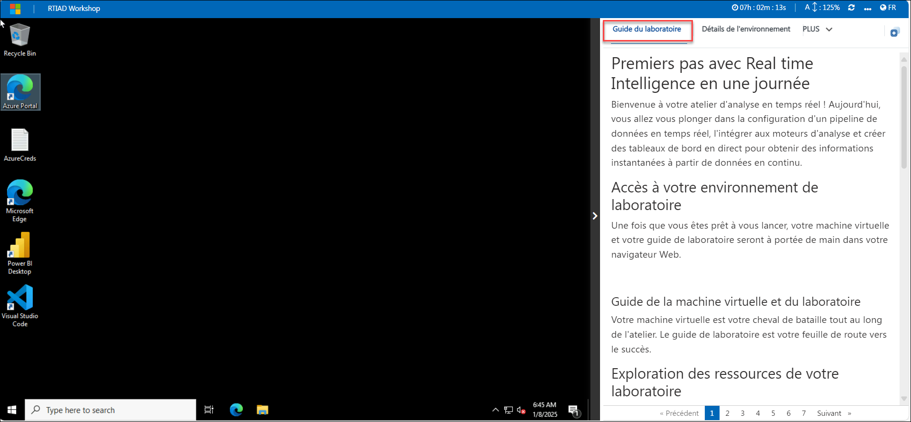
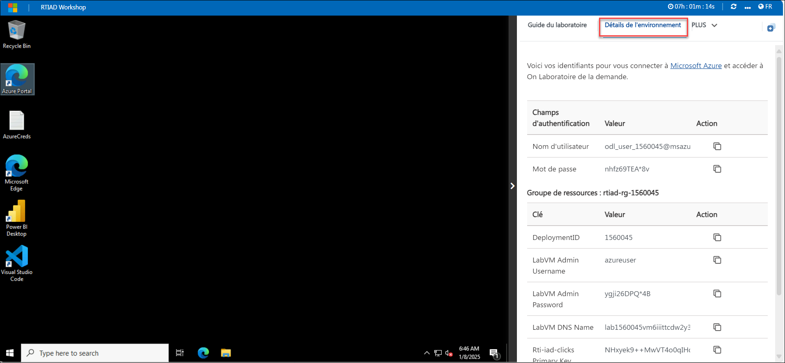
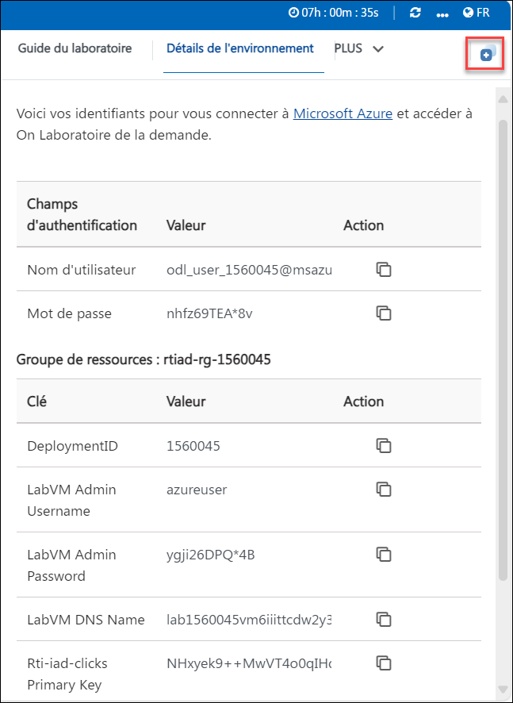
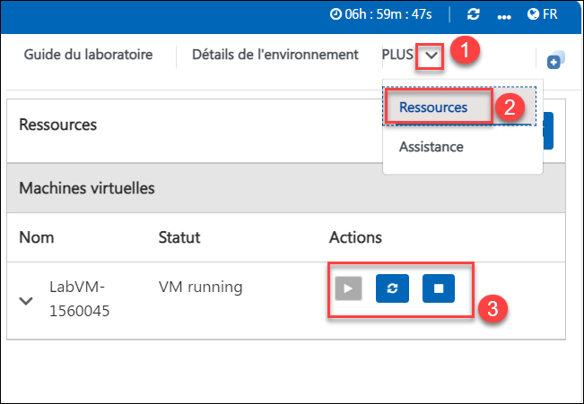
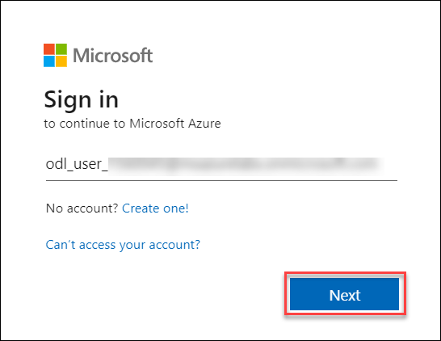
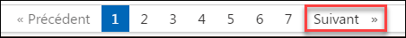

# Premiers pas avec Real time Intelligence en une journée

Bienvenue à votre atelier d'analyse en temps réel ! Aujourd'hui, vous allez vous plonger dans la configuration d'un pipeline de données en temps réel, l'intégrer aux moteurs d'analyse et créer des tableaux de bord en direct pour obtenir des informations instantanées à partir de données en continu.

## Accès à votre environnement de laboratoire

Une fois que vous êtes prêt à vous lancer, votre machine virtuelle et votre guide de laboratoire seront à portée de main dans votre navigateur Web.

### Guide de la machine virtuelle et du laboratoire

Votre machine virtuelle est votre cheval de bataille tout au long de l'atelier. Le guide de laboratoire est votre feuille de route vers le succès.

## Exploration des ressources de votre laboratoire

Pour mieux comprendre les ressources et les informations d'identification de votre laboratoire, accédez à l'onglet **Environnement**.

## Utilisation de la fonctionnalité de fenêtre fractionnée

Pour plus de commodité, vous pouvez ouvrir le guide de laboratoire dans une fenêtre distincte en sélectionnant le bouton **Fenêtre fractionnée** dans le coin supérieur droit.

## Gestion de votre machine virtuelle

N'hésitez pas à démarrer, arrêter ou redémarrer votre machine virtuelle selon vos besoins à partir de l'onglet **Ressources**. Votre expérience est entre vos mains !

## Commençons par utiliser le portail Azure

1. Sur votre machine virtuelle, cliquez sur l'icône du portail Azure comme indiqué ci-dessous :

1. Vous verrez l'onglet **Se connecter à Microsoft Azure**. Ici, saisissez vos identifiants :

- **E-mail/Nom d'utilisateur :** <inject key="AzureAdUserEmail"></inject>

1. Ensuite, indiquez votre mot de passe :

- **Mot de passe :** <inject key="AzureAdUserPassword"></inject>

1. Si vous êtes invité à rester connecté, vous pouvez cliquer sur « Non ».

1. Si une fenêtre contextuelle **Bienvenue dans Microsoft Azure** apparaît, cliquez simplement sur « Annuler** » pour ignorer la visite.

1. Cliquez sur « Suivant » dans le coin inférieur droit pour vous lancer dans votre aventure Lab !

Vous êtes désormais prêt à explorer le monde puissant de la technologie. N'hésitez pas à nous contacter si vous avez des questions. Profitez de votre atelier !
