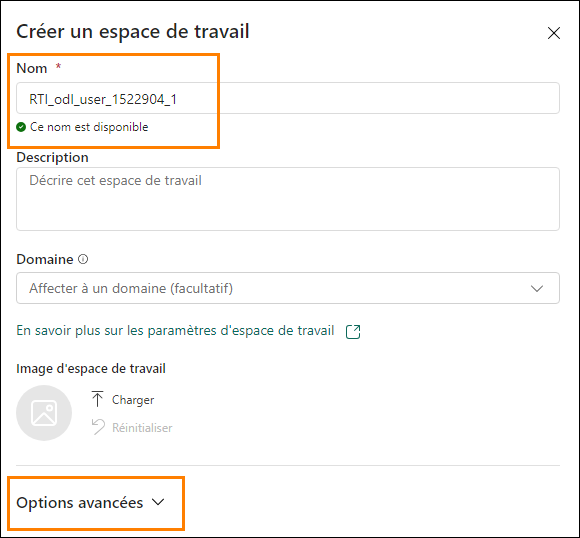
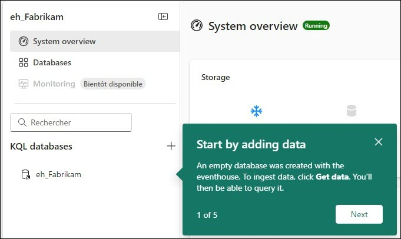
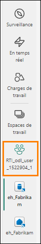

# Sommaire

- Structure du document	
- Scénario/Énoncé du problème	
- Introduction	
- Licence Fabric	
    - Tâche 1 : activer une licence d’essai Microsoft Fabric	
- Real-Time Intelligence et hub en temps réel	
    - Tâche 2 : éléments d’expérience Real-Time Intelligence	
    - Tâche 3 : hub en temps réel	
- Créer un espace de travail et un Eventhouse	
    - Tâche 4 : créer un espace de travail Fabric	
    - Tâche 5 : Créer un Eventhouse	
- Références	

 
# Structure du document

Le labo comprend des étapes à suivre par l’utilisateur, ainsi que des captures d’écran associées qui fournissent une aide visuelle. Dans chaque capture d’écran, des sections sont mises en évidence avec des encadrés orange afin de souligner la ou les zones sur laquelle/lesquelles l’utilisateur doit se concentrer.

# Scénario/Énoncé du problème

Fabrikam est une société d’e-commerce spécialisée dans une large gamme d’équipements et d’accessoires de plein air. La société s’adresse aux clients de détail du monde entier au moyen de sa plateforme en ligne et prévoit de renforcer sa présence sur de nouveaux marchés internationaux. Une nouvelle initiative consiste à fournir des informations stratégiques en temps réel à partir d’un site d’e- commerce pour permettre aux dirigeants de prendre rapidement des décisions sur la base d’informations à jour.

En tant qu’ingénieur analyste au sein de l’équipe commerciale, vous êtes responsable de la collecte, du nettoyage et de l’interprétation des jeux de données pour résoudre des problèmes métier. Vous créez et gérez des pipelines de données par lots, développez des visualisations telles que des tableaux et des graphiques, créez et optimisez des modèles et états sémantiques complets et présentez vos conclusions aux décideurs de l’organisation.

# Défis actuels

- Vous devez gérer un flux continu de données en temps réel provenant du site web d’e- commerce, ce qui nécessite une architecture robuste et évolutive.

- Assurer le traitement et l’analyse des données en temps réel pour suivre le rythme rapide des ventes en ligne.

- Gérer le volume et la vitesse des données générées par les interactions utilisateur, les transactions et l’activité du site web.

- Intégrer les données diffusées en continu en temps réel à des données historiques pour une analyse complète.

- Structurer efficacement le flux de données à l’aide de l’architecture en médaillon dans un environnement Eventhouse.

- Exploitation des données Eventhouse dans une lakehouse.

- Vous souhaitez utiliser Microsoft Fabric pour relever les défis susmentionnés, en créant un pipeline de traitement de données résilient et efficace à l’aide d’Eventhouse, de la base de données KQL et d’EventStream.
 
# Introduction

Aujourd’hui, vous allez découvrir diverses fonctionnalités clés de Microsoft Fabric. Il s’agit d’un atelier d’introduction destiné à vous présenter les différentes expériences produit et les divers éléments disponibles dans Fabric. À la fin de cet atelier, vous saurez comment utiliser un Eventhouse, un pipeline de données, un Eventstream, un jeu de requêtes KQL et un tableau de bord en temps réel.

À la fin de ce labo, vous saurez:

- comment explorer les profils Fabric ;
- comment créer un espace de travail Fabric ;
- comment créer un Eventhouse.

# Licence Fabric

## Tâche 1 : activer une licence d’essai Microsoft Fabric

1. Ouvrez le **Microsoft Edge navigateur** sur le bureau et accédez à https://app.fabric.microsoft.com/. Vous êtes alors redirigé vers la page de connexion. 

    > **Remarque:** si vous n’utilisez pas l’environnement de labo et que vous disposez d’un compte Power BI existant, vous pouvez utiliser le navigateur en mode privé/incognito.

    
 
2. Saisissez le **Nom d’utilisateur** disponible dans l’onglet **Variables d’environnement** (en regard du Guide de labo) dans le champ **E-mail** et cliquez sur **Envoyer**.

    
 
3. Vous êtes alors redirigé vers l’écran **Mot de passe**. Saisissez le **Mot de passe** disponible dans l’onglet **Variables d’environnement** (en regard du Guide de labo) qui vous a été communiqué par le formateur.
 
4. Cliquez sur **Se connecter** et suivez les invites pour vous connecter à Fabric.

     

5. Vous êtes alors redirigé vers la page d’**accueil de Fabric**.

    
 
Pour utiliser des éléments Fabric, vous avez besoin d’une licence d’essai et d’un espace de travail doté d’une licence Fabric. En avant pour la configuration.

6. Dans le coin supérieur droit de l’écran, cliquez sur l’**icône utilisateur**.

7. Cliquez sur **Essai gratuit**.

    
 
8. La boîte de dialogue de mise à niveau vers un essai gratuit Microsoft Fabric s’ouvre alors. Sélectionnez **Activer**.

     

9. La boîte de dialogue Mise à niveau réussie vers Microsoft Fabric s’ouvre alors. Cliquez sur **Page d’accueil Fabric**.

      
 
10.	Vous êtes alors redirigé vers la **page d’accueil Microsoft Fabric**.

       

# Real-Time Intelligence et hub en temps réel

## Tâche 2 : éléments d’expérience Real-Time Intelligence

1. Cliquez sur l’expérience Real-Time Intelligence.

      

2. Vous êtes alors redirigé vers la **page d’accueil Real-Time Intelligence**. Vous verrez alors les catégories **Modèles Flux de tâches, Éléments à créer recommandés** et **En savoir plus sur Real-Time Intelligence**. Dans la catégorie **Recommandés** notez les éléments suivants:

a. **Eventhouse:** permet de créer un espace de travail d’une ou plusieurs bases de données KQL, qui peuvent être partagées entre les projets. Crée également une base de données KQL dans l’Eventhouse.

b. **Jeu de requêtes KQL:** permet d’exécuter des requêtes sur les données afin de produire des tables et visuels qui peuvent être partagés.

c. **Tableau de bord en temps réel:** collection de vignettes, éventuellement organisées en pages, où chaque vignette est associée à une requête sous-jacente et à une représentation visuelle.
 
d. **Eventstream:** permet de capturer, de transformer et d’acheminer un flux d’événements en temps réel.

e. **Reflex:** permet d’entreprendre automatiquement des actions lorsque des modèles ou conditions sont détecté(e)s dans des données changeantes.

 

## Tâche 3 : hub en temps réel

1. Cliquez sur le bouton **Hub en temps réel** dans le volet de navigation Fabric sur le côté gauche de l’écran.
   
   

2. La boîte de dialogue **Bienvenue dans le hub en temps réel** s’ouvre. Sélectionnez alors **Visite guidée** ou cliquez sur **Démarrer**.

    
 
3. Le hub en temps réel est l’endroit unique pour les données diffusées en continu en mouvement sur l’ensemble de votre organisation. Chaque tenant Microsoft Fabric est automatiquement pourvu de ce hub. Il vous permet de détecter, d’ingérer, de gérer et d’utiliser facilement des données en mouvement à partir d’un large éventail de sources.

4. Dans le hub en temps réel, vous avez accès à trois types différents d’intégrations de données:

- **Tous les flux de données:** pour vos Eventstreams et bases de données KQL en cours d’exécution, toutes les sorties de flux d’Eventstreams et les tables des bases de données KQL s’affichent automatiquement dans le hub en temps réel.

- **Sources de diffusion de contenu:** répertorie toutes les ressources de diffusion en continu des services Microsoft. Qu’il s’agisse d’Azure Event Hubs, d’Azure IoT Hub ou d’autres
services, vous pouvez ingérer facilement des données dans le hub en temps réel.

- **Événements Fabric:** les événements générés au moyen d’artefacts Fabric et de sources externes sont mis à disposition dans Fabric pour prendre en charge des scénarios basés sur des événements tels que l’envoi d’alertes en temps réel et le déclenchement d’actions en aval. Vous pouvez surveiller et réagir à des événements, notamment des événements d’élément d’espace de travail Fabric et des événements Stockage Blob Azure.

- **Événements Azure:** cette liste répertorie les événements système générés dans Azure auxquels vous pouvez accéder. un événement peut être surveillé et des règles peuvent être définies pour envoyer des notifications ou effectuer des actions lorsqu’elles sont activées.

   
 
5. Dans le coin supérieur droit du hub en temps réel, cliquez sur le bouton **+ Connecter la source de données**.

   

6. Une fenêtre s’affiche alors et détaille les flux de données actuellement disponibles pour intégration au hub en temps réel, notamment un mélange de sources Azure et de sources cloud externes de diffusion en continu comme Amazon Kinesis, Confluent Cloud Kafka et Google Cloud Pub/Sub. Il existe même des échantillons de données à explorer.

    

7. **Fermez** la fenêtre Obtenir des événements en cliquant sur le « X » dans le coin supérieur droit.
 
# Créer un espace de travail et un Eventhouse

## Tâche 4 : créer un espace de travail Fabric

1. Créons maintenant un espace de travail avec la licence Fabric. Cliquez sur **Espaces de travail** dans la barre de navigation à gauche.

2. Cliquez sur **+ Nouvel espace de travail**.

   

3. La boîte de dialogue **Créer un espace de travail** s’ouvre alors sur le côté droit du navigateur.

4. Dans le champ **Nom**, saisissez **RTI_username**. Utilisez le nom d’utilisateur qui vous est fourni à partir des détails de l’environnement.

    > **Remarque:** le nom de l’espace de travail doit être unique. Assurez-vous qu’une coche verte avec « **Ce nom est disponible** » s’affiche sous le champ Nom.

5. Si vous le souhaitez, vous pouvez saisir une **Description** pour l’espace de travail. Il s’agit d’un champ facultatif.

6. Cliquez sur **Options avancées** pour développer la section.

    
 
7. Sous **Modèle de Licence**, assurez-vous que la case **Essai** est cochée. (Elle devrait l’être par défaut.)

8. Cliquez sur **Appliquer** pour créer un espace de travail.

    

>**Remarque** : si la boîte de dialogue Présentation des flux de tâches s’ouvre, cliquez sur OK.

  
 
## Tâche 5 : créer un Eventhouse

1. Cliquez sur le bouton **+ Nouveau** pour ouvrir un nouveau volet contenant tous les éléments que vous pouvez créer dans cet espace de travail Fabric.

    

2. Cliquez sur l’icône **Eventhouse** à partir de la section **Stocker les données** dans le volet. Comme nous l’avons dit, ce système peut être considéré comme un Lakehouse en ce sens qu’il permet de stocker des données, mais cet Eventhouse est axé sur les données en temps réel.

    
 
3. Dans la fenêtre qui s’affiche, nommez votre Eventhouse **eh_Fabrikam**, puis cliquez sur **Créer**.

     

4. C’est là que vous allez finaliser des données de flux provenant de diverses sources tout au long de la formation aujourd’hui. Lorsque l’élément est créé, une fenêtre s’affiche pour vous donner quelques détails sur l’Eventhouse. Cliquez sur le bouton **Démarrer**.

      
 
5. Découvrez rapidement l’Eventhouse en suivant les info-bulles vertes sur votre écran. Cette première info-bulle montre qu’une base de données KQL (Langage de requête Kusto) vide a été créée avec l’Eventhouse.

     

6. Suivez le reste des info-bulles autour de l’écran pour afficher où créer des bases de données supplémentaires, vérifier le stockage dans OneLake de l’Eventhouse, vérifier l’utilisation des ressources Fabric en minutes de calcul et enfin voir les actions s’étant produites dans l’Eventhouse.

7. Dans le volet de navigation à gauche de l’Eventhouse, trouvez votre base de données KQL qui a été créée en même temps que l’Eventhouse et cliquez simplement dessus pour afficher les détails de la base de données

   

8. Cela nous permettra d’avoir toujours un onglet dans le volet gauche du navigateur pour voir la vue d’ensemble de notre Eventhouse et un nouvel onglet pour se concentrer sur les propriétés de la base de données KQL. L’un des objectifs que nous souhaitons atteindre dans notre scénario est de nous assurer que les données diffusées en continu vers la base de données KQL sont accessibles au moyen de OneLake. En activant cette fonctionnalité, nous rendons les données de cette base de données KQL facilement détectables grâce à des raccourcis et utilisables dans toute lakehouse que nous souhaitons. Recherchez la section **Détails de la base de données** sur la droite et **activez** l’option « Disponibilité ».

   

9. Revenez à votre espace de travail **RTI_username** en le sélectionnant dans la partie gauche du navigateur.

   
 
10.	Si vous voyez que l’option **Flux de tâches** occupe la majeure partie de l’espace, cliquez sur la double flèche pointant vers le haut, située à droite, pour la réduire

    
 
11.	Vous disposez maintenant des bases de la façon dont vous allez commencer à ingérer les données diffusées en continu dans OneLake. L’étape suivante consiste à créer un flux de données pouvant recevoir les données en mouvement.

    

Dans ce labo, nous avons exploré l’interface Real-Time Intelligence, examiné le hub en temps réel, créé un espace de travail Fabric et un Eventhouse fourni avec une base de données KQL. Dans le prochain labo, vous allez commencer à explorer des techniques qui permettent d’ingérer des données provenant de diverses sources de votre parc dans OneLake et d’effectuer une analyse de base avec le Langage de requête Kusto (KQL).
 
# Références

Fabric Real-Time Intelligence in a Day (RTIIAD) vous présente certaines des fonctions clés de Microsoft Fabric. Dans le menu du service, la section Aide (?) comporte des liens vers d’excellentes ressources.

 
Voici quelques autres ressources qui vous aideront lors de vos prochaines étapes avec Microsoft Fabric :

- Consultez le billet de blog pour lire l’intégralité de l’  [texannonce de la GA de Microsof t Fabrict](https://aka.ms/Fabric-Hero-Blog-Ignite23) 

- Explorez Fabric grâce à la [visite guidée](https://aka.ms/Fabric-GuidedTour)

- Inscrivez-vous pour bénéficier d’un [essai gratuit de Microsof t Fabric](https://aka.ms/try-fabric)

- Rendez-vous sur le [site web Microsoft Fabric](https://aka.ms/microsoft-fabric)

- Acquérez de nouvelles compétences en explorant les [modules d’apprentissage Fabric](https://aka.ms/learn-fabric)

- Explorez la [documentation technique Fabric](https://aka.ms/fabric-docs)

- Lisez le [livre électronique gratuit sur la prise en main de Fabric](https://aka.ms/fabric-get-started-ebook)

- Rejoignez la [communauté Fabric](https://aka.ms/fabric-community) pour publier vos questions, partager vos commentaires et apprendre des autres

Lisez les blogs d’annonces plus détaillés sur l’expérience Fabric:

- [Blog Expérience Data Factory dans Fabric](https://aka.ms/Fabric-Data-Factory-Blog)

- [Blog Expérience Synapse Data Engineering dans Fabric](https://aka.ms/Fabric-DE-Blog)

- [Blog Expérience Synapse Data Science dans Fabric](https://aka.ms/Fabric-DS-Blog)

- [Blog Expérience Synapse Data Warehousing dans Fabric ](https://aka.ms/Fabric-DW-Blog)

- [Blog Expérience Real-Time Intelligence dans Fabric](https://blog.fabric.microsoft.com/en-us/blog/category/real-time-intelligence)

- [Blog Annonce Power BI](https://aka.ms/Fabric-PBI-Blog)

- [Blog Expérience Data Activator dans Fabric](https://aka.ms/Fabric-DA-Blog)

- [Blog Administration et gouvernance dans Fabric](https://aka.ms/Fabric-Admin-Gov-Blog)

- [Blog OneLake dans Fabric](https://aka.ms/Fabric-OneLake-Blog)

- [Blog Intégration de Dataverse et Microsoft Fabric](https://aka.ms/Dataverse-Fabric-Blog)

© 2024 Microsoft Corporation. Tous droits réservés.
En effectuant cette démonstration/ce labo, vous acceptez les conditions suivantes :

La technologie/fonctionnalité décrite dans cette démonstration/ce labo est fournie par Microsoft Corporation en vue d’obtenir vos commentaires et de vous fournir une expérience d’apprentissage. Vous pouvez utiliser cette démonstration/ce labo uniquement pour évaluer ces technologies et fonctionnalités, et pour fournir des commentaires à Microsoft. Vous ne pouvez pas l’utiliser à d’autres fins. Vous ne pouvez pas modifier, copier, distribuer, transmettre, afficher, effectuer, reproduire, publier, accorder une licence, créer des œuvres dérivées, transférer ou vendre tout ou une partie de cette démonstration/ce labo.

LA COPIE OU LA REPRODUCTION DE CETTE DÉMONSTRATION/CE LABO (OU DE TOUTE PARTIE DE CEUX-CI) SUR TOUT AUTRE SERVEUR OU AUTRE EMPLACEMENT EN VUE D’UNE AUTRE REPRODUCTION OU REDISTRIBUTION EST EXPRESSÉMENT INTERDITE.

CETTE DÉMONSTRATION/CE LABO FOURNIT CERTAINES FONCTIONNALITÉS DE PRODUIT/TECHNOLOGIES LOGICIELLES,NOTAMMENT D’ÉVENTUELS NOUVEAUX CONCEPTS ET FONCTIONNALITÉS, DANS UN ENVIRONNEMENT
SIMULÉ SANS CONFIGURATION NI INSTALLATION COMPLEXES AUX FINS DÉCRITES CI-DESSUS. LES TECHNOLOGIES/CONCEPTS REPRÉSENTÉS DANS CETTE DÉMONSTRATION/CE LABO PEUVENT NE PAS REPRÉSENTER LES FONCTIONNALITÉS COMPLÈTES ET PEUVENT NE PAS FONCTIONNER DE LA MÊME MANIÈRE QUE DANS UNE VERSION FINALE. IL EST ÉGALEMENT
POSSIBLE QUE NOUS NE PUBLIIONS PAS DE VERSION FINALE DE CES FONCTIONNALITÉS OU CONCEPTS. VOTRE EXPÉRIENCE D’UTILISATION DE CES FONCTIONNALITÉS DANS UN ENVIRONNEMENT PHYSIQUE PEUT ÉGALEMENT ÊTRE DIFFÉRENTE.

**COMMENTAIRES**. Si vous envoyez des commentaires sur les fonctionnalités, technologies et/ou concepts décrit(e)s dans ces labos/cette démonstration à Microsoft, vous accordez à Microsoft, sans frais, le droit d’utiliser, de partager et de commercialiser vos commentaires de quelque manière et à quelque fin que ce soit. Vous accordez également à des tiers, sans frais, les droits de brevet nécessaires pour leurs produits, technologies et services en vue de l’utilisation ou de l’interface avec des parties spécifiques d’un logiciel ou service Microsoft incluant les commentaires. Vous n’enverrez pas de commentaires soumis à une licence exigeant que.

Microsoft accorde une licence pour son logiciel ou sa documentation à des tiers du fait que nous y incluons vos commentaires. Ces droits survivent à ce contrat.
MICROSOFT CORPORATION DÉCLINE TOUTES LES GARANTIES ET CONDITIONS EN CE QUI CONCERNE CETTE DÉMONSTRATION/CE LABO, Y COMPRIS TOUTES LES GARANTIES ET CONDITIONS DE
QUALITÉ MARCHANDE,
QU’ELLES SOIENT EXPLICITES, IMPLICITES OU LÉGALES, D’ADÉQUATION À UN USAGE PARTICULIER, DE TITRE ET D’ABSENCE DE
CONTREFAÇON. MICROSOFT N’OFFRE AUCUNE GARANTIE OU REPRÉSENTATION EN CE QUI
CONCERNE LA PRÉCISION DES RÉSULTATS, LA CONSÉQUENCE QUI DÉCOULE DE L’UTILISATION DE CETTE DÉMONSTRATION/CE LABO, OU L’ADÉQUATION DES INFORMATIONS CONTENUES DANS CETTE DÉMONSTRATION/CE LABO À QUELQUE FIN QUE CE SOIT.

**CLAUSE D’EXCLUSION DE RESPONSABILITÉ**

Cette démonstration/Ce labo comporte seulement une partie des nouvelles fonctionnalités et améliorations disponibles dans Microsoft Power BI. Certaines fonctionnalités sont susceptibles de changer dans les versions ultérieures du produit. Dans ce labo/cette démonstration, vous
allez découvrir comment utiliser certaines nouvelles fonctionnalités, mais pas toutes.
