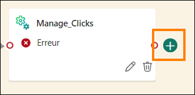

# Sommaire 


- Structure du document
- Introduction
- Eventstreams Fabric
  - Tâche 1 : créer un Eventstream
  - Tâche 2 : transformer l’Eventstream
  - Tâche 3 : fractionner l’Eventstream et charger deux destinations
- Ajout de données supplémentaires à la base de données KQL
  - Tâche 4 : valider les tables de données d’événement
  - Tâche 5 : créer des raccourcis de base de données KQL pour les tables dimensionnelles
- Résumé
- Références

# Structure du document 
Le labo comprend des étapes à suivre par l’utilisateur, ainsi que des captures d’écran associées qui fournissent une aide visuelle. Dans chaque capture d’écran, des sections sont mises en évidence avec des encadrés orange afin de souligner la ou les zones sur laquelle/lesquelles l’utilisateur doit se concentrer. 

# Introduction 
Dans ce labo, vous allez créer un autre Eventstream pour ingérer des données supplémentaires dans notre Eventhouse existante. Nous allons voir comment inclure des transformations dans l’Eventstream pour contrôler les données que nous souhaitons ajouter à la base de données KQL
À la fin de ce labo, vous saurez : 
- comment traiter et transformer des flux de données avec EventStream ;
- comment écrire des requêtes KQL pour joindre des données d’une base externe ;
- interroger des données et les afficher dans Power BI à l’aide de KQL.

# Eventstreams Fabric
## Tâche 1 : créer un Eventstream 

1.	Ouvrez l’espace de travail **Fabric** que vous avez utilisé pour le cours aujourd’hui.

    

2.	Nous devons ingérer des données diffusées en continu supplémentaires liées à notre boutique d’e-commerce. Pour cet Eventstream, cependant, nous souhaitons transformer les données avant de les charger dans l’Eventhouse. Au lieu d’accéder au **« hub en temps réel »**, nous pouvons créer un Eventstream directement à partir de l’espace de travail. Dans l’élément de menu **+ Nouveau**, créez un **Eventstream**.

    
 
3.	Nommez le nouvel Eventstream **es_Fabrikam_ClickEvents**, cochez la case **« Fonctionnalités améliorées »**, puis cliquez sur **Créer**.
 
    
 
4.	Sous le ruban Accueil, cliquez sur la liste déroulante **Ajouter une source**, puis sélectionnez **Sources externes**.

    
 
5.	Comme pour le labo précédent, nous allons nous connecter à un Azure Event Hub vers lequel les données sont diffusées en continu à partir d’un notebook Python. Cliquez sur « Connecter » pour la vignette **« Azure Event Hubs »**. Si vous ne voyez pas **« Azure Event Hubs »** dans la section recommandée, sélectionnez **« Afficher toutes les sources »** pour le révéler.

    

 
6.	Créez une connexion en cliquant sur **Nouvelle connexion**.

    
 
7.	Sur la page des détails de votre environnement, copiez-collez tous les paramètres de connexion nécessaires dans les champs appropriés. 

    - Espace de noms du Event Hub : **rtiadhub{username}**

    - Event Hub : **rta-iad-clicks**

    - Nom de la clé d’accès partagé : **rti-reader**

    - Clé d’accès partagé : **fournie dans Détails de l’environnement**

        
 
8.	Une fois toutes les propriétés renseignées, cliquez sur **Connecter**.


9.	Dans la configuration de la source de données Azure Event Hubs, vous aurez peut-être besoin de modifier le g**roupe de consommateurs** du Event Hub pour veiller à avoir accès à un point d’accès unique au flux de données. Pour cet atelier, vous pouvez laisser la valeur « $Default » comme indiqué ci-après

    

10.	Cliquez sur **Suivant**.

11.	Dans la fenêtre Examiner et créer, vérifiez que tout est configuré correctement et cliquez sur **Ajouter**.

    

12.	Une fois le flux configuré, vous pouvez afficher un aperçu des données provenant de l’Event Hub.

     
 
13.	Examinez les données reçues. Deux types d’événements sont enregistrés à partir du site web d’e-commerce : les clics et les impressions.
 - **IMPRESSION** : un événement d’impression est enregistré chaque fois qu’une annonce ou une liste de produits est présentée à un utilisateur. Les impressions sont une mesure du nombre de fois qu’un élément (annonce ou produit) est consulté, qu’il suscite ou non des interactions.
 - **CLIC** : un événement de clic est enregistré lorsqu’un utilisateur interagit avec un élément en cliquant dessus. Cela indique généralement un niveau d’engagement plus élevé par rapport à une impression.

Outre les événements de clic et d’impression enregistrés, vous trouverez des détails sur le produit ayant fait l’objet du clic ou de l’impression, sur l’appareil et le navigateur à partir desquels la page web a été chargée, sur l’adresse IP qui a accédé à la page et sur le temps de chargement de la page.

## Tâche 2 : transformer l’Eventstream

1.	Vous allez maintenant extraire ce flux de données et le transformer avant qu’il ne soit ingéré dans votre base de données KQL d’une manière facile à comprendre pour les analystes qui cherchent à tirer des informations stratégiques de ces données. Dans le canevas de l’Eventstream, cliquez sur la liste déroulante de l’objet **Transformer les événements**.

    
 
2.	Dans la liste des opérations disponibles, sélectionnez l’option **Gérer les champs**.

    
 
3.	Sur la nouvelle icône nommée **ManageFields** qui s’affiche, cliquez sur **l’icône représentant un crayon** pour sélectionner les champs que vous souhaitez ajouter à votre flux à partir de la source.

      
 
4.	Dans le volet volant qui s’affiche, cliquez sur le bouton **Ajouter tous les champs**.

      

5.	Dans la liste des champs, sélectionnez celui nommé **PartitionId** et cliquez sur les points de suspension (…) qui s’affichent lorsque vous survolez le champ

      

6.	Choisissez l’option **Supprimer** ce champ. Pour ce flux de données provenant de l’Event Hub, le partitionnement n’est pas utilisé, donc cette colonne ne nous est pas utile et nous la supprimons.

       
 
7.	Supprimez tous les champs suivants non nécessaires pour ce flux :
    - userAgent
    - page_loading_seconds
    - EventProcessedUtcTime
    - EventEnqueredUtcTime

    Vous devriez vous retrouver avec les champs suivants dans l’image ci-dessous :

    
  
8.	Survolez le champ eventDate et lorsque des points de suspension (…) s’affichent sur le côté droit de la fenêtre, cliquez dessus.

     
 
9.	Choisissez l’option **Modifier**.

    
 
10.	Cliquez sur le bouton bascule **Modifier le type** pour modifier le type de données de ce champ. Le champ Type d’origine est défini sur Chaîne et vous devez redéfinir le champ **Type converti** sur **DateTime**. Ensuite, cliquez sur **Enregistrer**.

     

## Tâche 3 : fractionner l’Eventstream et charger deux destinations

1.	Bien que vous puissiez charger ce flux de données dans une base de données KQL à des fins d’analyse, vous souhaitez peut-être disposer d’une autre façon d’exploiter ces données pour différencier les événements CLICK et les événements IMPRESSION. Ajoutez une autre activité de transformation à l’interface utilisateur en survolant la fin de la transformation **ManageFields**

    
 
2. Choisissez la transformation **Filtrer** dans la liste des opérations disponibles.

    

3. Cliquez sur **l’icône de crayon** sur la nouvelle transformation, à savoir, **Filter**.

    

4.	Dans le menu volant qui s’affiche sur le côté droit de l’écran, personnalisez les conditions de filtrage pour refléter un moyen de renvoyer uniquement les valeurs CLIC à l’aide des paramètres ci-dessous. Notez que la transformation Filtrer respecte la casse
    - **Nom de l’opération** : Clicks
    - **Sélectionner un champ sur lequel filtrer** : eventType
    - **Conserver les événements lorsque la valeur** : est égal à – CLICK **(Important ! Il s’agit d’un champ respectant la casse, donc veillez à le renseigner en majuscules pour cet exemple)**

        
 
5.	Cliquez sur le bouton **Enregistrer** pour enregistrer vos modifications.

6.	Recliquez sur le bouton **Actualiser** pour vérifier que les données ont été filtrées selon la valeur CLICK du champ eventType.

    
 
7.	Il s’agit peut-être des seules rangées que vous souhaitez envoyer à une table, mais une autre option consiste à créer à la place deux flux distincts pour acheminer des informations différentes vers deux tables ou plus. Dans le ruban **Accueil** de l’Eventstream, cliquez sur la liste déroulante **Transformer des événements**, puis sélectionnez **Filtrer**.

      
 
8. Un nouvel objet nommé **Filter (sachant que le nom peut différer)** s’affiche alors sur votre canevas. Vous devez connecter le flux **ManageFields** à la nouvelle transformation Filtrer. Faites glisser une ligne du point vert d’une transformation à l’autre pour établir cette connexion.

      

9.	Cliquez sur **l’icône de crayon** de **Filter** pour modifier ses paramètres.

      

10.	Dans le menu volant qui s’affiche sur le côté droit de l’écran, personnalisez les conditions de filtrage pour refléter un moyen de renvoyer uniquement les valeurs IMPRESSION à l’aide des valeurs ci-dessous. N’oubliez pas que la transformation Filtrer respecte la casse
    - **Nom de l’opération** : Impressions
    - **Sélectionner un champ sur lequel filtrer** : eventType
    - **Conserver les événements lorsque la valeur** : est égal à – IMPRESSION **(Important ! Il s’agit d’un champ respectant la casse, donc veillez à le renseigner en majuscules pour cet exemple)**

        

11.	Cliquez sur le bouton **Enregistrer** pour enregistrer vos modifications.


12.	Avant de charger les données dans de nouvelles tables de notre base de données KQL, nous pouvons supprimer les colonnes supplémentaires non nécessaires. Dans ce cas, pour le flux de données filtré pour nos enregistrements « CLIC », nous n’avons plus besoin de la colonne « eventType » puisque chaque ligne comporte la même valeur. Pour notre flux de données « IMPRESSION », nous pouvons supprimer la colonne « eventType » pour les mêmes raisons que celles susmentionnées, ainsi que la colonne « referrer », car elle est vide pour chaque ligne de cette table.


13.	Cliquez sur l’icône + après l’opération de filtrage **Clicks**.

    

14.	Dans le menu déroulant, sélectionnez « Gérer les champs ».

     

15.	Cliquez sur **l’icône représentant un crayon** pour sélectionner les champs que vous souhaitez ajouter à/supprimer de votre flux.

     

16.	Redéfinissez le nom de l’opération sur « Manage_Clicks ». De plus, cliquez sur « Ajouter tous les champs », puis supprimez « eventType ». Une fois que vous avez terminé, cliquez sur **Enregistrer**.

      

17.	Ensuite, ajoutons une autre transformation « Gérer les champs » connectée au filtre « Impressions » comme illustré ci-dessous.

      

18.	Cliquez sur **l’icône représentant un crayon** pour sélectionner les champs que vous souhaitez ajouter à/supprimer de votre flux.


19.	Redéfinissez le nom de l’opération sur « Manage_Impressions ». Ensuite, cliquez sur « Ajouter tous les champs », puis supprimez « eventType » et « referrer ». Votre transformation « Gérer les champs » devrait ressembler à l’image suivante :

     

20.	Maintenant que vous avez nettoyé les données des flux pour chacun des types d’événements, vous devez charger chaque flux dans une nouvelle table sur la base de données KQL. Cliquez sur **l’icône +** après l’opération de gestion des champs **Manage_Clicks**.

     
 
21.	Dans la liste déroulante qui s’affiche, accédez à **Destinations** et sélectionnez **Eventhouse**.

      
 
22.	Cliquez sur **l’icône de crayon** pour la destination Eventhouse.

      

23.	Pour cette destination, configurez les propriétés suivantes :
    - **Nom de la destination** : dbo-Clicks
    - **Espace de travail** : RTI_username
    - **Eventhouse** – eh_Fabrikam
    - **Base de données KQL** : eh_Fabrikam
    - **Table de destination** : créez une table nommée **Clicks**

     
 
24.	Cliquez sur **Enregistrer** en bas du menu volant.

25.	Faites de même pour la table Impressions avec les informations suivantes configurées comme ci-dessous :

     

26.	Enregistrez vos modifications.

27.	Cet Eventstream est maintenant prêt à être diffusé en continu. Cliquez sur **Publier** pour commencer ce flux.

    
 
28.	Avec l’Eventstream en cours d’exécution, l’interface utilisateur devrait changer légèrement pour signifier que vous diffusez en continu les données d’Event Hub, que vous transformez et fractionnez ce flux de données et que vous le chargez dans deux tables de base de données KQL distinctes.

    
 
# Ajout de données supplémentaires à la base de données KQL
## Tâche 4 : valider les tables de données d’événement

1. Revenez à votre espace de travail **RTI_username**.

2. Ouvrez la base de données KQL **eh_Fabrikam**.

    

3.	Avec l’Eventstream en cours d’exécution, deux nouvelles tables devraient maintenant s’afficher sur la page Vue d’ensemble de la base de données KQL. Après avoir laissé l’Eventstream s’exécuter pendant un certain temps, les **Premières tables** de la base de données KQL s’affichent sur la page Vue d’ensemble et indiquent le volume de données stockées dans les tables.

    

4.	Cliquez sur la table **Impressions**. Cette table reçoit environ 1,5 million d’enregistrements toutes les 24 heures. Il y a beaucoup plus d’impressions que de clics, donc il s’agit de votre plus grande table pour les besoins de ce cours.

     

## Tâche 5 : créer des raccourcis de base de données KQL pour les tables dimensionnelles
Jusqu’à présent, vous avez utilisé des données diffusées en continu, mais il vous manque encore certains éléments clés pour pouvoir tirer de l’intelligence des données que vous avez importées. Dans cette tâche, nous allons importer des données d’une base de données Azure SQL externe qui serviront de tables dimensionnelles dans notre base de données KQL. Ainsi, nous pourrons mieux décrire les données que nous diffusons actuellement en continu. Par exemple, toutes nos tables comportent une forme d’ID produit qui est un champ numérique, mais il serait préférable d’avoir une sorte de nom de produit à afficher. Les données nécessaires à cette prise en charge se trouvent actuellement dans une base de données Azure SQL externe. Voyons à quel point il est facile d’établir des connexions à certaines de ces tables dimensionnelles.

1. Dans la base de données **eh_Fabrikam**, cliquez sur le menu déroulant nommé **New related item**. Choisissez ensuite l’option indiquant KQL Queryset.

    
   

2. Nommez le jeu de requêtes KQL **Create Tables**, puis cliquez sur le bouton **Créer**.

    

3.	Le hub de données OneLake s’ouvre alors et la seule option à sélectionner est la base de données KQL **« eh_Fabrikam »**. Sélectionnez cette base de données et cliquez sur **« Connecter »**.

    

4. Dans la nouvelle interface, cliquez une fois dans la fenêtre de requête et mettez en surbrillance tout le texte à l’aide du raccourci clavier **Ctrl + A**. Après avoir tout mis en surbrillance, supprimez tout.

    
 
5. Dans la fenêtre de requête vide, saisissez le script KQL suivant. Ce script entraîne la création d’une connexion à une base de données Azure SQL externe et la met à disposition dans notre base de données KQL en tant que **raccourci**. Un **raccourci** est associé en mode Lecture seule, ce qui permet d’afficher et d’exécuter des requêtes en même temps que les données diffusées en continu ingérées dans la base de données KQL.

    ```
    .execute database script <|
    //External tables - shortcuts
    // connect to operational Database with external table Product
    .create external table products (ProductID: int, ProductNumber: string,  Name: string) 
    kind=sql
    table=[SalesLT.Product]
    ( 
    h@'Server= fabrikamdemo.database.windows.net,1433;Initial Catalog=fabrikamdb;User Id=demouser;Password=fabrikam@123456'
    )
    with 
    (
    createifnotexists = true
    )  
    // connect to operational Database with external table ProductCategory
    .create external table productCategories (ProductCategoryID: int, Name: string) 
    kind=sql
    table=[SalesLT.ProductCategory]
    ( 
     h@'Server= fabrikamdemo.database.windows.net,1433;Initial Catalog=fabrikamdb;User Id=demouser;Password=fabrikam@123456'    )
    with 
    (
    createifnotexists = true
    )
    ```

    

6.	Cliquez sur le bouton **Exécuter** pour exécuter le script.

     
 
7. Dans votre fenêtre Explorateur de bases de données, un nouveau dossier nommé **Shortcuts** s’affiche désormais. Dans ce dossier, deux tables supplémentaires devraient être liées à cette base de données KQL. Ces tables existent dans une base de données Azure SQL, mais grâce au script que vous avez exécuté, elles sont maintenant liées à cette base de données KQL à associer à vos tables InternetSales et d’événement.

    
 
8.	Maintenant que vous disposez des qualités dimensionnelles de votre base de données, vous pouvez répondre à des questions et fournir plus de contexte aux consommateurs des états et interroger ces tables à partir d’informations clés, sur l’ensemble de votre entreprise. Exécutez la requête KQL suivante pour afficher l’une d’entre elles :

    ```
    InternetSales
    | join kind=inner 
    (external_table("products")) on ($left.ProductKey == $right.ProductID)
    | summarize SalesPerProduct=sum(SalesAmount) by Name
    | project Name, SalesPerProduct
    ```

9.	Vous allez maintenant voir les valeurs de chaque produit individuel que votre société a vendu dans les résultats de votre requête.

    

10.	Avec votre requête en surbrillance, cliquez sur le bouton **Créer un état Power BI** dans votre barre d’outils.

    

11.	Ainsi, vous pouvez créer un état Power BI à l’aide des données de votre base KQL. N’hésitez pas à explorer cela pendant quelques instants, mais vous n’aurez pas besoin de créer un état à partir de ces données pour le moment. Cliquez sur le **bouton X** dans le coin supérieur droit lorsque vous êtes prêt à avancer.

    

12.	Revenez à la base de données KQL **eh_Fabrikam**.

     

13.	Cliquez sur le bouton **Shortcuts** dans le volet de navigation **eh_Fabrikam**. Tous les raccourcis que vous avez créés vers cette base de données KQL s’affichent alors. Notez que ces raccourcis sont considérés comme des tables externes Azure Data Explorer classiques utilisant la syntaxe de table externe Azure SQL et construits différemment des raccourcis OneLake, ADLS ou S3 également pris en charge dans la base de données KQL au sein de Fabric.

    

# Résumé
Dans ce labo, vous avez créé un autre flux de données, mais vous avez pu le transformer à l’aide de l’interface utilisateur de l’Eventstream dans Fabric. Le chargement des données dans deux tables distinctes vous a permis de suivre l’ensemble des clics et impressions au sein de votre système d’e-commerce à des fins de marketing, de publicité et d’analyse. Vous avez également créé un raccourci vers une base de données Azure SQL externe à l’aide de la fonctionnalité de table externe de jeu de données KQL. Vous disposez désormais de quelques dimensions pour mieux comprendre le contexte des ventes et des clics au sein de votre base de données KQL.

# Références 
Fabric Real-Time Intelligence in a Day (RTIIAD) vous présente certaines des fonctions clés de Microsoft Fabric. 
Dans le menu du service, la section Aide (?) comporte des liens vers d’excellentes ressources. 


 
Voici quelques autres ressources qui vous aideront lors de vos prochaines étapes avec Microsoft Fabric : 

- Consultez le billet de blog pour lire l’intégralité de l’  [texannonce de la GA de Microsof t Fabrict](https://aka.ms/Fabric-Hero-Blog-Ignite23) 

- Explorez Fabric grâce à la [visite guidée](https://aka.ms/Fabric-GuidedTour)

- Inscrivez-vous pour bénéficier d’un [essai gratuit de Microsof t Fabric](https://aka.ms/try-fabric)

- Rendez-vous sur le [site web Microsoft Fabric](https://aka.ms/microsoft-fabric)

- Acquérez de nouvelles compétences en explorant les [modules d’apprentissage Fabric](https://aka.ms/learn-fabric)

- Explorez la [documentation technique Fabric](https://aka.ms/fabric-docs)

- Lisez le [livre électronique gratuit sur la prise en main de Fabric](https://aka.ms/fabric-get-started-ebook)

- Rejoignez la [communauté Fabric](https://aka.ms/fabric-community) pour publier vos questions, partager vos commentaires et apprendre des autres

Lisez les blogs d’annonces plus détaillés sur l’expérience Fabric:

- [Blog Expérience Data Factory dans Fabric](https://aka.ms/Fabric-Data-Factory-Blog)

- [Blog Expérience Synapse Data Engineering dans Fabric](https://aka.ms/Fabric-DE-Blog)

- [Blog Expérience Synapse Data Science dans Fabric](https://aka.ms/Fabric-DS-Blog)

- [Blog Expérience Synapse Data Warehousing dans Fabric ](https://aka.ms/Fabric-DW-Blog)

- [Blog Expérience Real-Time Intelligence dans Fabric](https://blog.fabric.microsoft.com/en-us/blog/category/real-time-intelligence)

- [Blog Annonce Power BI](https://aka.ms/Fabric-PBI-Blog)

- [Blog Expérience Data Activator dans Fabric](https://aka.ms/Fabric-DA-Blog)

- [Blog Administration et gouvernance dans Fabric](https://aka.ms/Fabric-Admin-Gov-Blog)

- [Blog OneLake dans Fabric](https://aka.ms/Fabric-OneLake-Blog)

- [Blog Intégration de Dataverse et Microsoft Fabric](https://aka.ms/Dataverse-Fabric-Blog)
 
© 2024 Microsoft Corporation. Tous droits réservés. 
En effectuant cette démonstration/ce labo, vous acceptez les conditions suivantes :

La technologie/fonctionnalité décrite dans cette démonstration/ce labo est fournie par Microsoft Corporation en vue d’obtenir vos commentaires et de vous fournir une expérience d’apprentissage. Vous pouvez utiliser cette démonstration/ce labo uniquement pour évaluer ces technologies et fonctionnalités, et pour fournir des commentaires à Microsoft. Vous ne pouvez pas l’utiliser à d’autres fins. Vous ne pouvez pas modifier, copier, distribuer, transmettre, afficher, effectuer, reproduire, publier, accorder une licence, créer des œuvres dérivées, transférer ou vendre tout ou une partie de cette démonstration/ce labo.

LA COPIE OU LA REPRODUCTION DE CETTE DÉMONSTRATION/CE LABO (OU DE TOUTE PARTIE DE CEUX-CI) SUR TOUT AUTRE SERVEUR OU AUTRE EMPLACEMENT EN VUE D’UNE AUTRE REPRODUCTION OU REDISTRIBUTION EST EXPRESSÉMENT INTERDITE.

CETTE DÉMONSTRATION/CE LABO FOURNIT CERTAINES FONCTIONNALITÉS DE PRODUIT/TECHNOLOGIES LOGICIELLES,NOTAMMENT D’ÉVENTUELS NOUVEAUX CONCEPTS ET FONCTIONNALITÉS, DANS UN ENVIRONNEMENT
SIMULÉ SANS CONFIGURATION NI INSTALLATION COMPLEXES AUX FINS DÉCRITES CI-DESSUS. LES TECHNOLOGIES/CONCEPTS REPRÉSENTÉS DANS CETTE DÉMONSTRATION/CE LABO PEUVENT NE PAS REPRÉSENTER LES FONCTIONNALITÉS COMPLÈTES ET PEUVENT NE PAS FONCTIONNER DE LA MÊME MANIÈRE QUE DANS UNE VERSION FINALE. IL EST ÉGALEMENT
POSSIBLE QUE NOUS NE PUBLIIONS PAS DE VERSION FINALE DE CES FONCTIONNALITÉS OU CONCEPTS. VOTRE EXPÉRIENCE D’UTILISATION DE CES FONCTIONNALITÉS DANS UN ENVIRONNEMENT PHYSIQUE PEUT ÉGALEMENT ÊTRE DIFFÉRENTE.

**COMMENTAIRES**. Si vous envoyez des commentaires sur les fonctionnalités, technologies et/ou concepts décrit(e)s dans ces labos/cette démonstration à Microsoft, vous accordez à Microsoft, sans frais, le droit d’utiliser, de partager et de commercialiser vos commentaires de quelque manière et à quelque fin que ce soit. Vous accordez également à des tiers, sans frais, les droits de brevet nécessaires pour leurs produits, technologies et services en vue de l’utilisation ou de l’interface avec des parties spécifiques d’un logiciel ou service Microsoft incluant les commentaires. Vous n’enverrez pas de commentaires soumis à une licence exigeant que.

Microsoft accorde une licence pour son logiciel ou sa documentation à des tiers du fait que nous y incluons vos commentaires. Ces droits survivent à ce contrat.
MICROSOFT CORPORATION DÉCLINE TOUTES LES GARANTIES ET CONDITIONS EN CE QUI CONCERNE CETTE DÉMONSTRATION/CE LABO, Y COMPRIS TOUTES LES GARANTIES ET CONDITIONS DE
QUALITÉ MARCHANDE,
QU’ELLES SOIENT EXPLICITES, IMPLICITES OU LÉGALES, D’ADÉQUATION À UN USAGE PARTICULIER, DE TITRE ET D’ABSENCE DE
CONTREFAÇON. MICROSOFT N’OFFRE AUCUNE GARANTIE OU REPRÉSENTATION EN CE QUI
CONCERNE LA PRÉCISION DES RÉSULTATS, LA CONSÉQUENCE QUI DÉCOULE DE L’UTILISATION DE CETTE DÉMONSTRATION/CE LABO, OU L’ADÉQUATION DES INFORMATIONS CONTENUES DANS CETTE DÉMONSTRATION/CE LABO À QUELQUE FIN QUE CE SOIT.

**CLAUSE D’EXCLUSION DE RESPONSABILITÉ**

Cette démonstration/Ce labo comporte seulement une partie des nouvelles fonctionnalités et améliorations disponibles dans Microsoft Power BI. Certaines fonctionnalités sont susceptibles de changer dans les versions ultérieures du produit. Dans ce labo/cette démonstration, vous
allez découvrir comment utiliser certaines nouvelles fonctionnalités, mais pas toutes.
