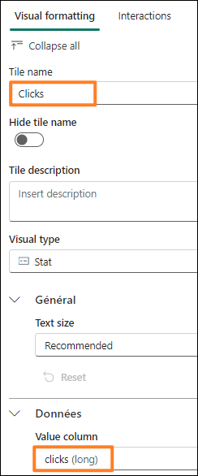
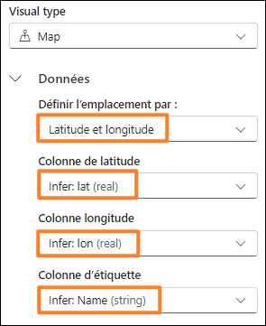
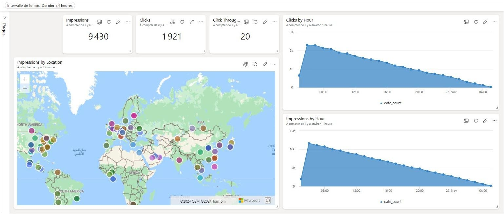
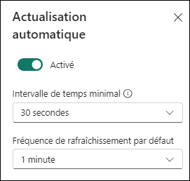
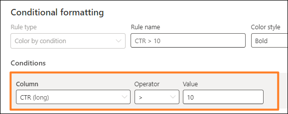

# Microsoft Fabric Real-Time Intelligence in a Day Labo 5


 
# Sommaire

- Structure du document	
- Introduction	
- Tableaux de bord en temps réel	
  - Tâche 1 : créer un tableau de bord en temps réel
  - Tâche 2 : connecter une source de données à un tableau de bord en temps réel	
  - Tâche 3 : créer une vignette de tableau de bord en temps réel avec KQL	
  - Tâche 4 : ajouter d’autres vignettes de tableau de bord au tableau de bord en temps réel
  - Tâche 5 : ajouter un visuel de carte pour les impressions par emplacement	
  - Tâche 6 : configurer l’actualisation automatique sur le tableau de bord en temps réel	
  - Tâche facultative 7 : ajouter le logo d’une société	
  - Tâche facultative 8 : appliquer une mise en forme conditionnelle au visuel	
- Résumé	
- Références	

 
# Structure du document

Le labo comprend des étapes à suivre par l’utilisateur, ainsi que des captures d’écran associées qui fournissent une aide visuelle. Dans chaque capture d’écran, des sections sont mises en évidence avec des encadrés orange afin de souligner la ou les zones sur laquelle/lesquelles l’utilisateur doit se concentrer.
Introduction

Dans ce labo, vous allez créer un tableau de bord en temps réel à l’aide des données que vous avez diffusées en continu et chargées dans votre base de données KQL et liées succinctement à une
lakehouse grâce à des raccourcis pour visualiser et partager vos observations stratégiques à partir des flux de données auxquels vous avez accédé.
À la fin de ce labo, vous saurez :

  - comment créer un tableau de bord en temps réel dans Fabric ;
  - comment écrire des requêtes à l’aide de KQL afin de renseigner des visuels dans un tableau de bord ;
  - comment ajouter une mise en forme conditionnelle à des visuels de tableau de bord.


# Tableaux de bord en temps réel
## Tâche 1 : créer un tableau de bord en temps réel

1. Ouvrez l’espace de travail **Fabric** pour le cours.
   
2. Cliquez sur le bouton **+ Nouvel élément** pour créer un élément.

     
 
3. Vous verrez une catégorie pour **Visualiser les données**. Cliquez sur l’élément **Tableau de bord en temps réel**.

     

4. Nommez votre tableau de bord en temps réel **RTI Dashboard**, puis cliquez sur **Créer**.

     

5. Vous devriez être immédiatement redirigé vers une instance vide d’un tableau de bord en temps réel.
       
      
 
## Tâche 2 : connecter une source de données à un tableau de bord en temps réel

1. Dans le ruban Accueil, recherchez et cliquez sur le bouton **New data source**.

      

2. Dans le volet volant qui s’affiche sur le côté droit de l’écran, cliquez sur **Ajouter +**, puis choisissez **OneLake data hub**.

      

3. Une liste des sources disponibles dans OneLake s’affiche alors. Seules les sources des bases de données KQL sont répertoriées, donc une seule option est à votre disposition, à savoir la base de données KQL **eh_Fabrikam**. Sélectionnez cette option.

      

4. En bas de l’écran, cliquez sur **Connect**.

      

5. Vous allez maintenant pouvoir créer la source de données. Cliquez sur le bouton **Add** en bas du volet volant.

      

6. Une source de données est alors ajoutée au tableau de bord en temps réel. Ensuite, vous pouvez ajouter des bases de données KQL supplémentaires si nécessaire. Pour l’instant, cliquez sur **Fermer** en bas de la fenêtre.
 

      

## Tâche 3 : créer une vignette de tableau de bord en temps réel avec KQL

1. Cliquez sur la vignette vide dans le tableau de bord pour renseigner la vignette avec un visuel.

     

2. Par défaut, vous vous connectez à la base de données KQL que vous avez créée précédemment comme source. Ensuite, vous pouvez écrire votre propre requête KQL pour renseigner ce visuel avec des données. Supprimez tout le balisage Markdown KQL précédent présent par défaut. Copiez-collez la requête suivante dans la fenêtre de requête :

    ```
    //Clicks by hour Clicks
    | where eventDate between (_startTime.._endTime)
    | summarize date_count = count() by bin(eventDate, 1h)
    | render timechart
    | top 30 by date_count
    | sort by eventDate
    ```

3. Exécutez la requête après l’avoir correctement configurée pour afficher les résultats.

    
 
4. Notez que vous ne pouvez avoir qu’un seul résultat dans votre sortie. en raison de l’**Intervalle de temps** défini par défaut pour cette vignette. Vous disposez d’un paramètre qui vous permet de modifier l’intervalle de temps à partir duquel vous renvoyez des données. Le code eventDate between (_startTime.._endTime) vous permet de tirer parti de ce paramètre. Redéfinissez le paramètre **Intervalle de temps** sur **3 dernières heures** et observez l’évolution de votre sortie.

    

5. Les résultats des clics au cours des 3 dernières heures devraient maintenant s’afficher dans la sortie de votre requête.

    
 
6. Bien que ce paramètre puisse être modifié, vous souhaiterez peut-être qu’il soit défini par défaut sur un intervalle de temps spécifique au lieu de forcer les utilisateurs à le modifier. Au-dessus de l’option Intervalle de temps, cliquez sur le bouton **@ Paramètres**.

      
 
7. Cliquez sur l’**icône représentant un crayon** pour modifier le paramètre **Intervalle de temps**.

      
 
8. Redéfinissez le champ **Valeur par défaut** sur **24 dernières heures** pour toujours afficher le dernier jour par défaut. Ensuite, cliquez sur **Terminé**.

      
 
9. Fermez le volet Modifier le paramètre.

10. Cliquez maintenant sur le bouton **+ Ajouter un visuel** au-dessus des résultats de la requête.

      
 
11. Un nouveau menu volant s’affiche alors sur le côté droit de l’écran. Cliquez dans la zone de texte sous l’option **Nom de la vignette** pour nommer ce visuel **Clicks by Hour**.

      

12. Par défaut, le visuel vous permettant d’afficher les résultats de cette requête KQL est une table. Ce n’est peut-être pas le meilleur moyen pour quelqu’un de consommer et comprendre rapidement ce qui se passe avec les résultats de vos données. Redéfinissez le champ Type de visuel en remplaçant Table par **Graphique en aires**.

      

13. Avec ce visuel nouvellement mis en forme, vous pouvez mieux comprendre les pics et les creux du nombre de clics sur votre site d’e-commerce à l’aide du flux de données que vous avez créé précédemment dans ce cours.

       
  
14. Pour enregistrer ce visuel dans le tableau de bord, cliquez sur le bouton **Appliquer les changements** dans le coin supérieur droit de l’écran.

       

15. Une fois ce visuel placé dans le tableau de bord, il est possible que le visuel n’affiche que la dernière heure de résultats. Modifiez le tableau de bord pour afficher l’**Intervalle de temps 24 dernières heures**.

      
 
16. Actualisez le visuel et notez que les résultats changent légèrement pour refléter les données reçues depuis la dernière exécution de la requête.

      

## Tâche 4 : ajouter d’autres vignettes de tableau de bord au tableau de bord en temps réel

1. Dans le **ruban Accueil** du tableau de bord en temps réel, cliquez sur le bouton **New tile**.

    
 
2. Saisissez la requête KQL suivante dans le volet de requête :

    ```
    //Impressions by hour Impressions
    | where eventDate between (_startTime.._endTime)
    | summarize date_count = count() by bin(eventDate, 1h)
    | render timechart
    | top 30 by date_count
    | sort by eventDate
    ```

3. Cliquez sur **Exécuter** pour exécuter la requête.

    

4. Cliquez sur le bouton **+ Ajouter un visuel**.

    

5. Modifiez le visuel pour redéfinir les champs **Nom de la vignette** sur **Impressions par heure** et
**Type de visuel** sur **Graphique en aires**.

    

6. Appliquez les changements au visuel.

    

7. Cliquez sur **New tile** pour ajouter une autre vignette.

     

8. Copiez-collez la requête suivante dans le volet de requête. Notez qu’il s’agit d’une requête multi- instructions qui utilise plusieurs instructions let et une requête combinée par des points-virgules.
 
    ```
    //Clicks, Impressions, CTR
    
    let imp = Impressions
    | where eventDate between (_startTime.._endTime)
    | extend dateOnly = substring(todatetime(eventDate).tostring(), 0, 10)
    | summarize imp_count = count() by dateOnly;
    
    let clck = Clicks
    | where eventDate between (_startTime.._endTime)
    | extend dateOnly = substring(todatetime(eventDate).tostring(), 0, 10)
    | summarize clck_count = count() by dateOnly;
     
    imp
    | join clck on $left.dateOnly == $right.dateOnly
    | project selected_date = dateOnly , impressions = imp_count , clicks = clck_count, CTR = clck_count * 100 / imp_count
    ```

9. Cliquez sur **Exécuter** pour exécuter la requête afin d’afficher les résultats.

   

10. Cliquez sur le bouton **+ Ajouter un visuel**.

11. Lorsque les paramètres du visuel s’affichent, modifiez les paramètres suivants pour créer un décompte des impressions :

  - **Nom de la vignette** : Impressions
  - **Type de visuel** : Statistique
  - **Colonne de valeurs** : impressions (long)

    

12. Cliquez sur **Appliquer les changements** après avoir configuré tous les paramètres de manière appropriée.

    
 
13. Sur la nouvelle vignette, cliquez sur les points de suspension (…) et sélectionnez l’option
**Vignette dupliquée**.

     
 
14. Cliquez sur l’**icône représentant un crayon** de la vignette dupliquée pour modifier les paramètres.

     

15. Redéfinissez les champs **Nom de la vignette** sur **Clicks** et **Colonne de valeurs** sur **clicks (long)**.

     

16. Appliquez les changements à ce visuel.

17. Dupliquez l’une ou l’autre des nouvelles vignettes une fois de plus pour créer un dernier visuel statistique.

     
 
18. Modifiez la nouvelle vignette pour redéfinir les champs **Nom de la vignette** sur **Click Through Rate** et **Colonne de valeurs** sur **CTR (long)**.

     

19. Appliquez les changements.


20. Si les vignettes sont séparées ou si vous souhaitez les réorganiser, vous pouvez survoler la
vignette jusqu’à ce qu’une icône représentant une main s’affiche, puis glisser-déplacer le visuel où vous le souhaitez.

     

## Tâche 5 : ajouter un visuel de carte pour les impressions par emplacement

1. Cliquez sur **New tile** pour ajouter une vignette au tableau de bord en temps réel.

    

2. Copiez-collez la requête suivante dans le volet de requête. Cette requête extrait la latitude et la longitude de la colonne Adresse IP de ce flux de données pour générer un emplacement que vous pouvez placer sur une carte. Cette requête peut prendre un peu plus de temps que les précédentes.

    ```
    //Impressions by location
    
    Impressions
    | where eventDate between (_startTime.._endTime)
    | join external_table('products') on $left.productId == $right.ProductID
    | project lon = toreal(geo_info_from_ip_address(ip_address).longitude), lat = toreal(geo_info_from_ip_address(ip_address).latitude), Name
    | render scatterchart with (kind = map) //, xcolumn=lon, ycolumns=lat)
    
    ```

3. Exécutez la requête pour vérifier qu’elle est correctement configurée. Cliquez sur le bouton + Ajouter un visuel.

    

4. Redéfinissez les champs **Nom de la vignette** sur **Impressions par emplacement** et **Type de visuel** sur **Carte**.

    
 
5. Sous la zone **Type de visuel**, assurez-vous que la latitude et la longitude sont sélectionnées de manière appropriée en redéfinissant le champ **Définir l’emplacement par** sur **Latitude et longitude** et vérifiez que les champs restants correspondent à l’image ci-dessous.

    

6. Appliquez les modifications.

7. Saisissez le point d’ancrage en bas du visuel de carte à gauche dans le tableau de bord pour agrandir le visuel.

     
 
8. Tous les visuels sont redimensionnables et mobiles. N’hésitez pas à réorganiser les vôtres comme vous le souhaitez.

     

9. Enregistrez vos modifications.

     

## Tâche 6 : configurer l’actualisation automatique sur le tableau de bord en temps réel

1. Cliquez sur le bouton **Gérer** dans le ruban, puis sur le bouton **Actualisation automatique**.

     

2. Activez le bouton bascule sous **Actualisation automatique**.

     

3. Redéfinissez les champs **Intervalle de temps minimal** sur 30 secondes et **Fréquence de rafraîchissement par défaut** sur 1 minute.

     

4. Cliquez sur **Appliquer** en bas de la fenêtre.

5. Dans le coin supérieur droit de votre menu, cliquez sur le bouton **Modification** et redéfinissez-le sur **Consultation** pour voir l’expérience de vos utilisateurs finaux avec ce tableau de bord en
temps réel.

     

6. Si le temps le permet et que vous souhaitez récupérer le logo d’une société ou appliquer une mise en forme conditionnelle à vos visuels comme illustré ci-dessous, n’hésitez pas à effectuer les tâches facultatives ci-dessous. Sinon, le labo est terminé.

    

## Tâche facultative 7 : ajouter le logo d’une société

1. Tout comme nous l’avons fait précédemment, passez du mode **Consultation** du tableau de bord au mode **Modification**.

   

2. Cliquez sur le bouton **New text tile** dans le ruban Accueil.

    

3. Copiez-collez le code Markdown suivant dans la fenêtre de requête :


    

4. Appliquez les modifications.

5. Redimensionnez et déplacez la vignette pour l’adapter à votre tableau de bord en temps réel.

    
 
6. Enregistrez vos modifications.

    

## Tâche facultative 8 : appliquer une mise en forme conditionnelle au visuel

1. Cliquez sur l’**icône représentant un crayon** sur le visuel **Click Through Rate**.

    

2. En bas du volet de mise en forme du visuel, cliquez sur le bouton **+ Add rule** sous **Mise en forme conditionnelle**.

     
 
3. Cliquez sur l’**icône représentant un crayon** pour modifier la règle de mise en forme conditionnelle.

      
 
4. Sous Conditions, redéfinissez les champs **Column** sur **CTR (long)**, et Opérateur et Valeur sur >10.

      

5. N’hésitez pas à modifier la mise en forme comme vous le souhaitez. Tant que la valeur de la colonne CTR est supérieure à 10, elle s’affiche sur ce visuel.

    

6. Cliquez sur le bouton **Enregistrer** dans le volet Mise en forme conditionnelle.

    
 
7. Appliquez les modifications.

8. Enregistrez vos modifications.

     


# Résumé
Dans ce labo, les utilisateurs ont créé un tableau de bord en temps réel et l’ont connecté à notre base de données KQL. Nous avons pu constater que le langage KQL nous permet d’organiser les requêtes, puis nous pouvons visualiser les résultats de plusieurs façons, chaque visuel ayant sa propre configuration. De plus, nous avons découvert comment modifier le paramètre par défaut disponible dans le tableau de bord afin que le tableau de bord s’actualise automatiquement.
 
# Références

Fabric Real-Time Intelligence in a Day (RTIIAD) vous présente certaines des fonctions clés de Microsoft Fabric.
Dans le menu du service, la section Aide (?) comporte des liens vers d’excellentes ressources.


Voici quelques autres ressources qui vous aideront lors de vos prochaines étapes avec Microsoft Fabric :

- Consultez le billet de blog pour lire l’intégralité de l’ [annonce de la GA de Microsoft Fabric](https://aka.ms/Fabric-Hero-Blog-Ignite23)
- Explorez Fabric grâce à la [visite guidée](https://aka.ms/Fabric-GuidedTour)
- Inscrivez-vous pour bénéficier d’un [essai gratuit de Microsoft Fabric](https://aka.ms/try-fabric)
- Rendez-vous sur le [site web Microsoft Fabric](https://aka.ms/microsoft-fabric)
- Acquérez de nouvelles compétences en explorant les [modules d’apprentissage Fabric](https://learn.microsoft.com/en-us/training/browse/?products=fabric&resource_type=module)
- Explorez la [documentation technique Fabric](https://aka.ms/fabric-docs)
- Lisez le [livre électronique gratuit sur la prise en main de Fabric](https://aka.ms/fabric-get-started-ebook)
- Rejoignez la [communauté Fabric](https://aka.ms/fabric-community) pour publier vos questions, partager vos commentaires et apprendre des autres

Lisez les blogs d’annonces plus détaillés sur l’expérience Fabric :

- [Blog Expérience Data Factory dans Fabric](https://aka.ms/Fabric-Data-Factory-Blog)
- [Blog Expérience Synapse Data Engineering dans Fabric](https://aka.ms/Fabric-DE-Blog)
- [Blog Expérience Synapse Data Science dans Fabric](https://aka.ms/Fabric-DS-Blog)
- [Blog Expérience Synapse Data Warehousing dans Fabric](https://aka.ms/Fabric-DW-Blog)
- [Blog Expérience Real-Time Intelligence dans Fabric](https://blog.fabric.microsoft.com/en-us/blog/category/real-time-intelligence)
- [Blog Annonce Power BI](https://aka.ms/Fabric-PBI-Blog)
- [Blog Expérience Data Activator dans Fabric](https://aka.ms/Fabric-DA-Blog)
- [Blog Administration et gouvernance dans Fabric](https://aka.ms/Fabric-Admin-Gov-Blog)
- [Blog OneLake dans Fabric](https://aka.ms/Fabric-OneLake-Blog)
- [Blog Intégration de Dataverse et Microsof t Fabric](https://aka.ms/Dataverse-Fabric-Blog)
 
© 2024 Microsoft Corporation. Tous droits réservés.

En effectuant cette démonstration/ce labo, vous acceptez les conditions suivantes :

La technologie/fonctionnalité décrite dans cette démonstration/ce labo est fournie par Microsoft Corporation en vue d’obtenir vos commentaires et de vous fournir une expérience d’apprentissage.
Vous pouvez utiliser cette démonstration/ce labo uniquement pour évaluer ces technologies et fonctionnalités, et pour fournir des commentaires à Microsoft. Vous ne pouvez pas l’utiliser à d’autres fins. Vous ne pouvez pas modifier, copier, distribuer, transmettre, afficher, effectuer, reproduire, publier, accorder une licence, créer des œuvres dérivées, transférer ou vendre tout ou une partie de cette démonstration/ce labo.

LA COPIE OU LA REPRODUCTION DE CETTE DÉMONSTRATION/CE LABO (OU DE TOUTE PARTIE DE CEUX-CI) SUR TOUT AUTRE SERVEUR OU AUTRE EMPLACEMENT EN VUE D’UNE AUTRE REPRODUCTION OU REDISTRIBUTION EST EXPRESSÉMENT INTERDITE.

CETTE DÉMONSTRATION/CE LABO FOURNIT CERTAINES FONCTIONNALITÉS DE PRODUIT/ TECHNOLOGIES LOGICIELLES, NOTAMMENT D’ÉVENTUELS NOUVEAUX CONCEPTS ET FONCTIONNALITÉS, DANS UN ENVIRONNEMENT SIMULÉ SANS CONFIGURATION NI INSTALLATION COMPLEXES AUX FINS DÉCRITES CI-DESSUS. LES TECHNOLOGIES/CONCEPTS REPRÉSENTÉS DANS CETTE DÉMONSTRATION/CE LABO PEUVENT NE PAS REPRÉSENTER LES FONCTIONNALITÉS COMPLÈTES ET PEUVENT NE PAS FONCTIONNER DE LA MÊME MANIÈRE QUE DANS UNE VERSION FINALE. IL EST ÉGALEMENT POSSIBLE QUE NOUS NE PUBLIIONS PAS DE VERSION FINALE DE CES FONCTIONNALITÉS OU CONCEPTS. VOTRE EXPÉRIENCE D’UTILISATION DE CES FONCTIONNALITÉS DANS UN ENVIRONNEMENT PHYSIQUE PEUT ÉGALEMENT ÊTRE DIFFÉRENTE.

**COMMENTAIRES.** Si vous envoyez des commentaires sur les fonctionnalités, technologies et/ou concepts décrit(e)s dans ces labos/cette démonstration à Microsoft, vous accordez à Microsoft, sans frais, le droit d’utiliser, de partager et de commercialiser vos commentaires de quelque manière et
à quelque fin que ce soit. Vous accordez également à des tiers, sans frais, les droits de brevet nécessaires pour leurs produits, technologies et services en vue de l’utilisation ou de l’interface avec des parties spécifiques d’un logiciel ou service Microsoft incluant les commentaires. Vous n’enverrez pas de commentaires soumis à une licence exigeant que Microsoft accorde une licence pour son logiciel ou sa documentation à des tiers du fait que nous y incluons vos commentaires. Ces droits survivent à ce contrat.

MICROSOFT CORPORATION DÉCLINE TOUTES LES GARANTIES ET CONDITIONS EN CE
QUI CONCERNE CETTE DÉMONSTRATION/CE LABO, Y COMPRIS TOUTES LES GARANTIES ET CONDITIONS DE QUALITÉ MARCHANDE, QU’ELLES SOIENT EXPLICITES, IMPLICITES
OU LÉGALES, D’ADÉQUATION À UN USAGE PARTICULIER, DE TITRE ET D’ABSENCE DE
CONTREFAÇON. MICROSOFT N’OFFRE AUCUNE GARANTIE OU REPRÉSENTATION EN CE QUI CONCERNE LA PRÉCISION DES RÉSULTATS, LA CONSÉQUENCE QUI DÉCOULE DE L’UTILISATION DE CETTE DÉMONSTRATION/CE LABO, OU L’ADÉQUATION DES INFORMATIONS CONTENUES DANS CETTE DÉMONSTRATION/CE LABO À QUELQUE FIN QUE CE SOIT.

**CLAUSE D’EXCLUSION DE RESPONSABILITÉ**
Cette démonstration/Ce labo comporte seulement une partie des nouvelles fonctionnalités et améliorations disponibles dans Microsoft Power BI. Certaines fonctionnalités sont susceptibles de changer dans les versions ultérieures du produit. Dans ce labo/cette démonstration, vous
allez découvrir comment utiliser certaines nouvelles fonctionnalités, mais pas toutes.
