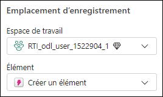
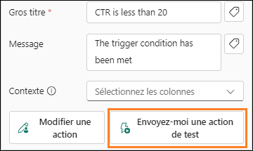

# Microsoft Fabric Real-Time Intelligence in a Day Labo 6

# Sommaire

- Structure du document	
- Introduction	
- Création d’une alerte avec Reflex	
    - Tâche 1 : définir des alertes à l’aide du tableau de bord en temps réel	
    - Tâche 2 : tester l’alerte par e-mail à partir de l’expérience Reflex	
    - Tâche 3 : créer un objet Reflex à partir du flux de données	
- Nettoyage des ressources	
    - Tâche 4 : nettoyer l’espace de travail	
- Résumé	
- Références	
 
# Structure du document

Le labo comprend des étapes à suivre par l’utilisateur, ainsi que des captures d’écran associées qui fournissent une aide visuelle. Dans chaque capture d’écran, des sections sont mises en évidence avec des encadrés orange afin de souligner la ou les zones sur laquelle/lesquelles l’utilisateur doit se concentrer.

# Introduction

Dans ce labo, vous allez découvrir comment tirer parti de Data Activator pour créer un Reflex afin d’envoyer des alertes à partir de notre tableau de bord en temps réel venant d’être créé. De plus, nous allons découvrir comment étendre l’utilisation de Reflex pour créer des alertes personnalisées supplémentaires sur les données que nous diffusons en continu dans notre Eventhouse

À la fin de ce labo, vous saurez :

- comment créer un Reflex depuis l’option Alerte sur un tableau de bord en temps réel ;
- comment créer des alertes plus personnalisées à l’aide d’éléments Data Activator Reflex

# Création d’une alerte avec Reflex

## Tâche 1 : définir des alertes à l’aide du tableau de bord en temps réel

1. Ouvrez l’**espace de travail Fabric** pour le cours et sélectionnez le tableau de bord en temps réel que vous avez créé dans le dernier labo.

   

2. Sur le visuel **Click Through Rate**, cliquez sur les points de suspension (…) et sélectionnez l’option **Set alert**.

    

3. Un nouveau menu volant s’ouvre alors sur le côté droit de l’écran. Vous pouvez voir ce que vous surveillez à partir du tableau de bord, y compris le visuel spécifique auquel l’alerte sera associée. La condition est un élément sur lequel vous avez un contrôle total. Redéfinissez le champ **Condition** sur **Est inférieur à**.

    
 
4. Un nouveau champ **Valeur** s’affiche alors : redéfinissez-le sur **20**.

    

5. Vous disposez actuellement de trois actions possibles pour le type d’alerte que vous souhaitez recevoir une fois que l’élément Data Activator Reflex reconnaît que votre condition est remplie. Sélectionnez l’option **Envoyez-moi un message dans Teams**.

    
 
6. Enfin, vous devez décider de l’emplacement auquel vous allez stocker l’**élément Reflex** que vous créez avec cette alerte. Le système devrait sélectionner votre espace de travail actuel par défaut, mais vous devez spécifier un **Nouvel élément** dans le menu déroulant Élément.

    

7. Redéfinissez le nom de l’élément sur **CTR Reflex**, puis cliquez sur **Créer**. La création prend quelques instants.

    
 
8. Vous allez recevoir une validation indiquant que l’alerte Reflex a été créée. Cliquez sur le bouton **Ouvert** pour ouvrir le Reflex.

    
 
9. Vous êtes alors redirigé vers l’**expérience Reflex** formelle. Ensuite, vous pouvez surveiller le flux de données en temps réel, afficher les données permettant de prendre en charge le Reflex et

    

# créer des déclencheurs supplémentaires à partir du même flux.

## Tâche 2 : tester l’alerte par e-mail à partir de l’expérience Reflex

1. Dans l’expérience Reflex, cliquez sur l’icône en forme de crayon en regard du nom de l’événement et renommez ce dernier **CTR is less than 20**.

     

2. Mettons également à jour **Gros titre** et **Message** que vous trouverez dans la section **Action** à droite. Mettez à jour les deux zones pour qu’elles correspondent à l’image ci-dessous et appuyez sur **Enregistrer et mettre à jour**.

    

3. Dans la même section **Action** à droite, cliquez sur le bouton **Envoyez-moi une action de test**
pour obtenir un exemple de message dans Teams depuis Reflex.

    

4. Ouvrez un nouvel onglet dans le navigateur Edge de votre environnement et accédez à **Teams.Microsoft.com**.

5. Connectez-vous avec les identifiants de votre environnement si vous y êtes invité. Un message vous invitant à démarrer un essai peut s’afficher, que vous devrez accepter.

6. Un message dans Teams devrait s’afficher, vous indiquant que le CTR est inférieur à 20.

     
 
7. Revenez à l’expérience Reflex pour créer un autre déclencheur.
  
## Tâche 3 : créer un objet Reflex à partir du flux de données

1. Sélectionnez l’objet labellisé **KQL Source Event**, puis sélectionnez **Nouvelle règle**.

    

2. Cliquez sur l’icône de **crayon** et attribuez un nom à cette règle, **Clicks Greater Than 30,000** (vous pouvez choisir ici une valeur qui correspond mieux à la quantité de données diffusées en continu).

     

3. Pour commencer, vous devez surveiller l’une des colonnes du flux de données. Pour ce faire, nous devons configurer les sections Condition et Action. Sélectionnez l’onglet Définition de la règle pour définir les conditions et l’action.

 
4. Sur la page Définition qui s’ouvre, dans **Condition**, sélectionnez les propriétés suivantes :

    - **Opération** = Est supérieur à
    - **Colonne** = clicks
    - **Valeur** = 3000

      

5. Dans **Action**, sélectionnez les propriétés suivantes :

    - **Type** = Teams message
    - **Destinataire** = {votre ID utilisateur}

      

6. Enfin, cliquez sur Enregistrer et diffuser en continu pour exécuter cette règle

    
 
7. Vous disposez désormais de deux déclencheurs qui surveillent le même flux de données.

    

# Nettoyage des ressources

## Tâche 4 : nettoyer l’espace de travail

1. Il s’agit du dernier labo et de la dernière partie de Real-Time Analytics in a Day. Si vous avez terminé le labo et que vous n’avez pas d’autres questions ou besoins de la part du formateur sur le contenu, aidez-nous en annulant l’affectation de l’espace de travail. Accédez à l’espace de travail **RTI_username**.

    

2. Cliquez sur le bouton **Paramètres d’espace de travail** dans le coin supérieur droit.

    

3. Sous **Général**, faites défiler vers le bas et cliquez sur le bouton **Supprimer cet espace de travail**.

    

4. Labo et classe terminés!
 
# Résumé

Dans ce labo, nous avons découvert l’utilisation de Data Activator. Grâce à cette fonctionnalité, vous pouvez vous connecter directement à des tableaux de bord ou flux de données en temps réel et créer des déclencheurs sur ces données. Ces déclencheurs peuvent ensuite être configurés avec des conditions de détection, et une fois ces conditions remplies, une action peut être entreprise. Dans ce labo, nous avons utilisé la possibilité d’envoyer un e-mail lorsque certaines conditions étaient remplies dans nos déclencheurs. Data Activator étant toujours en version préliminaire, de nouvelles actions pourraient être disponibles à l’avenir.

# Références

Fabric Real-Time Intelligence in a Day (RTIIAD) vous présente certaines des fonctions clés de Microsoft Fabric. Dans le menu du service, la section Aide (?) comporte des liens vers d’excellentes ressources.

   
 
Voici quelques autres ressources qui vous aideront lors de vos prochaines étapes avec Microsoft Fabric :

- Consultez le billet de blog pour lire l’intégralité de l’  [annonce de la GA de Microsof t Fabrict](https://aka.ms/Fabric-Hero-Blog-Ignite23) 

- Explorez Fabric grâce à la [visite guidée](https://aka.ms/Fabric-GuidedTour)

- Inscrivez-vous pour bénéficier d’un [essai gratuit de Microsof t Fabric](https://aka.ms/try-fabric)

- Rendez-vous sur le [site web Microsoft Fabric](https://aka.ms/microsoft-fabric)

- Acquérez de nouvelles compétences en explorant les [modules d’apprentissage Fabric](https://aka.ms/learn-fabric)

- Explorez la [documentation technique Fabric](https://aka.ms/fabric-docs)

- Lisez le [livre électronique gratuit sur la prise en main de Fabric](https://aka.ms/fabric-get-started-ebook)

- Rejoignez la [communauté Fabric](https://aka.ms/fabric-community) pour publier vos questions, partager vos commentaires et apprendre des autres

Lisez les blogs d’annonces plus détaillés sur l’expérience Fabric:

- [Blog Expérience Data Factory dans Fabric](https://aka.ms/Fabric-Data-Factory-Blog)

- [Blog Expérience Synapse Data Engineering dans Fabric](https://aka.ms/Fabric-DE-Blog)

- [Blog Expérience Synapse Data Science dans Fabric](https://aka.ms/Fabric-DS-Blog)

- [Blog Expérience Synapse Data Warehousing dans Fabric ](https://aka.ms/Fabric-DW-Blog)

- [Blog Expérience Real-Time Intelligence dans Fabric](https://blog.fabric.microsoft.com/en-us/blog/category/real-time-intelligence)

- [Blog Annonce Power BI](https://aka.ms/Fabric-PBI-Blog)

- [Blog Expérience Data Activator dans Fabric](https://aka.ms/Fabric-DA-Blog)

- [Blog Administration et gouvernance dans Fabric](https://aka.ms/Fabric-Admin-Gov-Blog)

- [Blog OneLake dans Fabric](https://aka.ms/Fabric-OneLake-Blog)

- [Blog Intégration de Dataverse et Microsoft Fabric](https://aka.ms/Dataverse-Fabric-Blog)

© 2024 Microsoft Corporation. Tous droits réservés.
En effectuant cette démonstration/ce labo, vous acceptez les conditions suivantes :

La technologie/fonctionnalité décrite dans cette démonstration/ce labo est fournie par Microsoft Corporation en vue d’obtenir vos commentaires et de vous fournir une expérience d’apprentissage. Vous pouvez utiliser cette démonstration/ce labo uniquement pour évaluer ces technologies et fonctionnalités, et pour fournir des commentaires à Microsoft. Vous ne pouvez pas l’utiliser à d’autres fins. Vous ne pouvez pas modifier, copier, distribuer, transmettre, afficher, effectuer, reproduire, publier, accorder une licence, créer des œuvres dérivées, transférer ou vendre tout ou une partie de cette démonstration/ce labo.

LA COPIE OU LA REPRODUCTION DE CETTE DÉMONSTRATION/CE LABO (OU DE TOUTE PARTIE DE CEUX-CI) SUR TOUT AUTRE SERVEUR OU AUTRE EMPLACEMENT EN VUE D’UNE AUTRE REPRODUCTION OU REDISTRIBUTION EST EXPRESSÉMENT INTERDITE. 

CETTE DÉMONSTRATION/CE LABO FOURNIT CERTAINES FONCTIONNALITÉS DE PRODUIT/TECHNOLOGIES LOGICIELLES,NOTAMMENT D’ÉVENTUELS NOUVEAUX CONCEPTS ET FONCTIONNALITÉS, DANS UN ENVIRONNEMENT SIMULÉ SANS CONFIGURATION NI INSTALLATION COMPLEXES AUX FINS DÉCRITES CI-DESSUS. LES TECHNOLOGIES/CONCEPTS REPRÉSENTÉS DANS CETTE DÉMONSTRATION/CE LABO PEUVENT NE PAS REPRÉSENTER LES FONCTIONNALITÉS COMPLÈTES ET PEUVENT NE PAS FONCTIONNER DE LA MÊME MANIÈRE QUE DANS UNE VERSION FINALE. IL EST ÉGALEMENT POSSIBLE QUE NOUS NE PUBLIIONS PAS DE VERSION FINALE DE CES FONCTIONNALITÉS OU CONCEPTS. VOTRE EXPÉRIENCE D’UTILISATION DE CES FONCTIONNALITÉS DANS UN ENVIRONNEMENT PHYSIQUE PEUT ÉGALEMENT ÊTRE DIFFÉRENTE.

**COMMENTAIRES**. Si vous envoyez des commentaires sur les fonctionnalités, technologies et/ou concepts décrit(e)s dans ces labos/cette démonstration à Microsoft, vous accordez à Microsoft, sans frais, le droit d’utiliser, de partager et de commercialiser vos commentaires de quelque manière et à quelque fin que ce soit. Vous accordez également à des tiers, sans frais, les droits de brevet nécessaires pour leurs produits, technologies et services en vue de l’utilisation ou de l’interface avec des parties spécifiques d’un logiciel ou service Microsoft incluant les commentaires. Vous n’enverrez pas de commentaires soumis à une licence exigeant que. Microsoft accorde une licence pour son logiciel ou sa documentation à des tiers du fait que nous y incluons vos commentaires. Ces droits survivent à ce contrat.

MICROSOFT CORPORATION DÉCLINE TOUTES LES GARANTIES ET CONDITIONS EN CE QUI CONCERNE CETTE DÉMONSTRATION/CE LABO, Y COMPRIS TOUTES LES GARANTIES ET CONDITIONS DE QUALITÉ MARCHANDE, QU’ELLES SOIENT EXPLICITES, IMPLICITES OU LÉGALES, D’ADÉQUATION À UN USAGE PARTICULIER, DE TITRE ET D’ABSENCE DE CONTREFAÇON. MICROSOFT N’OFFRE AUCUNE GARANTIE OU REPRÉSENTATION EN CE QUI CONCERNE LA PRÉCISION DES RÉSULTATS, LA CONSÉQUENCE QUI DÉCOULE DE L’UTILISATION DE CETTE DÉMONSTRATION/CE LABO, OU L’ADÉQUATION DES INFORMATIONS CONTENUES DANS CETTE DÉMONSTRATION/CE LABO À QUELQUE FIN QUE CE SOIT.

## CLAUSE D’EXCLUSION DE RESPONSABILITÉ

Cette démonstration/Ce labo comporte seulement une partie des nouvelles fonctionnalités et améliorations disponibles dans Microsoft Power BI. Certaines fonctionnalités sont susceptibles de changer dans les versions ultérieures du produit. Dans ce labo/cette démonstration, vous allez découvrir comment utiliser certaines nouvelles fonctionnalités, mais pas toutes.
