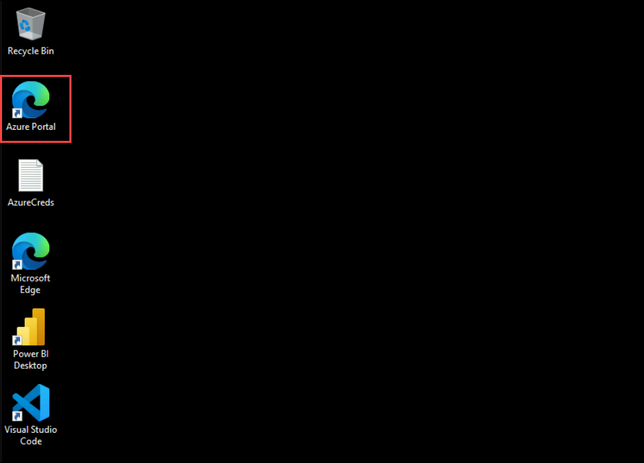
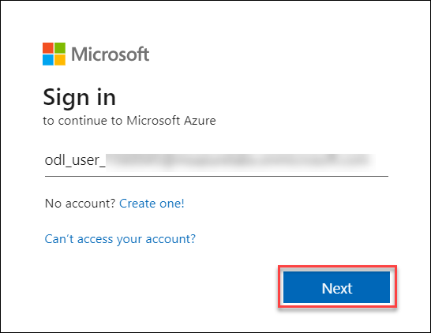
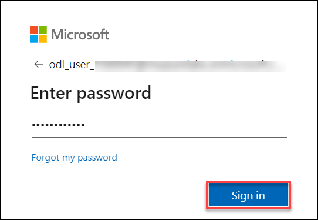

# Erste Schritte mit Echtzeit-Intelligenz an einem Tag

Willkommen zu Ihrem Workshop zu Echtzeitanalysen! Heute werden Sie sich mit der Einrichtung einer Echtzeit-Datenpipeline befassen, diese in Analyse-Engines integrieren und Live-Dashboards erstellen, um sofortige Erkenntnisse aus Streaming-Daten zu gewinnen.

## Zugriff auf Ihre Laborumgebung

Sobald Sie bereit sind, loszulegen, stehen Ihnen Ihre virtuelle Maschine und Ihr Laborhandbuch in Ihrem Webbrowser direkt zur Verfügung.

### Virtuelle Maschine und Laborhandbuch

Ihre virtuelle Maschine ist während des gesamten Workshops Ihr Arbeitspferd. Das Laborhandbuch ist Ihr Fahrplan zum Erfolg.

## Erkundung Ihrer Laborressourcen

Um Ihre Laborressourcen und -nachweise besser zu verstehen, navigieren Sie zur Registerkarte **Umgebung**.

## Die Funktion „Geteiltes Fenster“ nutzen

Der Einfachheit halber können Sie den Laborleitfaden in einem separaten Fenster öffnen, indem Sie die Schaltfläche **Geteiltes Fenster** in der oberen rechten Ecke auswählen.

## Ihre virtuelle Maschine verwalten

Sie können Ihre virtuelle Maschine nach Bedarf über die Registerkarte **Ressourcen** starten, stoppen oder neu starten. Ihre Erfahrung liegt in Ihren Händen!

## Erste Schritte mit Azure Portal

1. Klicken Sie auf Ihrer virtuellen Maschine auf das Azure Portal-Symbol, wie unten gezeigt:

1. Sie sehen die Registerkarte **Bei Microsoft Azure anmelden**. Geben Sie hier Ihre Anmeldeinformationen ein:

- **E-Mail/Benutzername:** <inject key="AzureAdUserEmail"></inject>

1. Geben Sie als Nächstes Ihr Passwort ein:

- **Passwort:** <inject key="AzureAdUserPassword"></inject>

1. Wenn Sie aufgefordert werden, angemeldet zu bleiben, können Sie auf „Nein“ klicken.

1. Wenn ein Popup-Fenster **Willkommen bei Microsoft Azure** angezeigt wird, klicken Sie einfach auf „**Abbrechen**“, um die Tour zu überspringen.

1. Klicken Sie unten rechts auf „Weiter“, um Ihre Lab-Reise zu beginnen!

.png)

Jetzt sind Sie bereit, die leistungsstarke Welt der Technologie zu erkunden. Wenn Sie unterwegs Fragen haben, können Sie sich jederzeit an uns wenden. Viel Spaß bei Ihrem Workshop!
