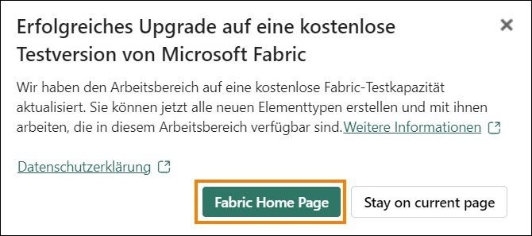
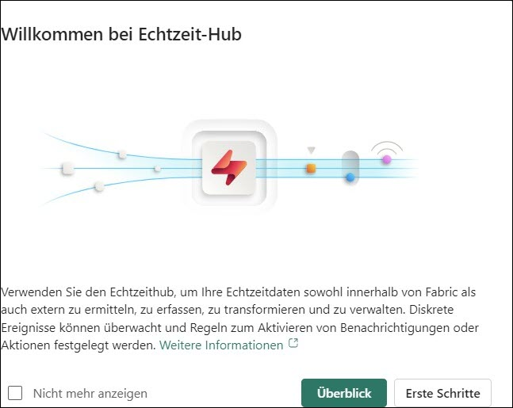

# Microsoft Fabric Real-Time Intelligence in a Day Übung 1

 
 # Inhalt

- Dokumentstruktur	
- Anwendungsfall/Problemstellung	
- Einführung	
- Fabric-Lizenz	
    - Aufgabe 1: Lizenz für Testversion von Microsoft Fabric aktivieren	
- Real-Time Intelligence und Echtzeit-Hub	
    - Aufgabe 2: Erfahrungselemente in Real-Time Intelligence	
    - Aufgabe 3: Echtzeit-Hub	
- Arbeitsbereich und Eventhouse erstellen	
    - Aufgabe 4: Fabric-Arbeitsbereich erstellen	
    - Aufgabe 5: Ein Eventhouse erstellen	
- Referenzen	
 
# Dokumentstruktur

Die Übung enthält die Schritte, die der Benutzer durchführen muss, sowie zugehörige Screenshots zur visuellen Unterstützung. Wichtige Abschnitte sind in den Screenshots mit einem orangefarbenen Kasten gekennzeichnet.

# Anwendungsfall/Problemstellung

Fabrikam ist ein E-Commerce-Unternehmen, das auf ein breites Spektrum an Outdoor-Ausrüstung und - Zubehör spezialisiert ist. Das Unternehmen bedient über seine Online-Plattform Einzelhandelskunden auf der ganzen Welt und plant, seine Präsenz auf neuen internationalen Märkten auszubauen. Eine neue Initiative zielt darauf ab, Echtzeiteinblicke in die Daten einer E-Commerce-Site bereitzustellen und Führungskräften so die Möglichkeit zu geben, zeitnahe Entscheidungen auf Grundlage aktueller Informationen zu treffen.

Als Analysetechniker im Vertriebsteam umfassen Ihre Aufgaben das Erfassen, Bereinigen und Interpretieren von Datasets zur Lösung geschäftlicher Probleme. Sie erstellen und verwalten Batch- Datenpipelines, entwickeln Visualisierungen wie Diagramme und Grafiken, erstellen und optimieren umfassende semantische Modelle und Berichte und präsentieren Ihre Ergebnisse den Entscheidungsträgern in der Organisation.

## Aktuelle Herausforderungen

- Sie müssen einen kontinuierlichen Datenstrom von Echtzeitdaten von der E-Commerce- Website verarbeiten, was eine robuste und skalierbare Architektur erfordert.
- Sicherstellen einer Datenverarbeitung und -analyse in Echtzeit, um mit der Schnelllebigkeit des Onlineverkaufs Schritt zu halten
- Handhabung des Volumens und der Anzahl der durch Benutzerinteraktionen, Transaktionen und Websiteaktivitäten generierten Daten
- Integration von Echtzeit-Streaming-Daten mit historischen Daten für umfassende Analysen
- Verwenden der Medallion-Architektur in einer Eventhouse-Umgebung, um den Datenfluss effizient zu strukturieren
- Nutzung der Eventhouse-Daten innerhalb eines Lakehouse
- Sie sind daran interessiert, Microsoft Fabric zu nutzen, um die oben genannten Herausforderungen zu bewältigen und mithilfe von Eventhouse, KQL-Datenbank und Eventstream eine belastbare und effiziente Datenverarbeitungspipeline aufzubauen.

# Einführung

Heute geht es um die verschiedenen Hauptfunktionen von Microsoft Fabric. In diesem Einführungsworkshop werden die verschiedenen Funktionsbereiche und Bestandteile von Fabric vorgestellt. Am Ende dieses Workshops lernen Sie, wie Sie ein Eventhouse, eine Datenpipeline, einen Eventstream, einen KQL-Abfragesatz und ein Echtzeit-Dashboard verwenden.

Am Ende dieser Übung haben Sie Folgendes gelernt:

- Wie Sie Fabric-Personas erkunden
- Wie Sie einen Fabric-Arbeitsbereich erstellen
- Wie Sie ein Eventhouse erstellen
 
# Fabric-Lizenz

## Aufgabe 1: Lizenz für Testversion von Microsoft Fabric aktivieren

1. Öffnen Sie den **Microsoft Edge-Browser** auf dem Desktop, und navigieren Sie zu https://app.fabric.microsoft.com/. Die Anmeldeseite wird angezeigt. **Hinweis:** Wenn Sie nicht die Übungsumgebung nutzen und bereits ein Power BI-Konto haben, können Sie den Browser im privaten Modus/Inkognito-Modus verwenden.

   

2. Geben Sie den **Benutzernamen**, den Sie auf der Registerkarte **Umgebungsvariablen** (neben der Übungsanleitung) finden, sowie die **E-Mail** ein, und klicken Sie auf **Senden**.

   

3. Die Seite **Kennwort** wird angezeigt. Geben Sie das **Kennwort** ein, das Sie auf der Registerkarte **Umgebungsvariablen** (neben der Übungsanleitung) finden und Ihnen von Ihrem Kursleiter mitgeteilt wurde.

4. Klicken Sie auf **Anmelden**, und folgen Sie den Anweisungen, um sich bei Fabric anzumelden.

   

5. Sie werden zur Startseite von **Fabric** geleitet.

    

   Wenn Sie mit Fabric-Elementen arbeiten möchten, benötigen Sie eine Testlizenz und einen Arbeitsbereich mit einer Fabric-Lizenz. Lassen Sie uns das einrichten.

6. Klicken Sie oben rechts auf dem Bildschirm auf das **Benutzersymbol**.

7. Wählen Sie **Kostenlose Testversion** aus.

   

8. Das Dialogfeld „Upgrade auf eine kostenlose Testversion auf Microsoft Fabric“ wird geöffnet. Wählen Sie **Aktivieren** aus. 

    

9. Das Dialogfeld „Erfolgreiches Upgrade auf Microsoft Fabric“ wird geöffnet. Wählen Sie **Fabric Home Page** aus.

    

10. Sie werden zurück zur **Startseite von Microsoft Fabric** geleitet.

    

# Real-Time Intelligence und Echtzeit-Hub

## Aufgabe 2: Erfahrungselemente in Real-Time Intelligence

1. Klicken Sie auf die Real-Time Intelligence-Erfahrung.

   

2. Sie werden zur Startseite von **Real-Time Intelligence** weitergeleitet. Sie sehen die Kategorien **Aufgabenflowvorlagen**, **Zu erstellende empfohlene Elemente** und **Weitere Informationen zu Real-Time Intelligence**. Beachten Sie in der Kategorie **Empfohlene Elemente** die folgenden Elemente:

    a. **Eventhouse**: Dient dem Erstellen eines Arbeitsbereichs mit einer oder mehreren KQL- Datenbanken, der projektübergreifend genutzt werden kann. Erstellt außerdem eine KQL-Datenbank innerhalb des Eventhouse.

    b. **KQL-Abfragesatz**: Dient zum Abfragen der Daten, um gemeinsam verwendbare Tabellen und Grafiken zu erstellen.

    c. **Echtzeitdashboard**: Eine Sammlung von Kacheln, optional in Seiten organisiert, wobei jeder Kachel eine Abfrage und eine visuelle Darstellung zugrunde liegt.

    d. **Eventstream**: Hiermit werden Ereignisströme in Echtzeit erfasst, umgewandelt und weitergeleitet.

    e. **Reflex**: Zum automatischen Ergreifen von Maßnahmen, wenn in sich ändernden Daten Muster oder Bedingungen erkannt werden.

    

## Aufgabe 3: Echtzeit-Hub

1. Klicken Sie auf **Echtzeit-Hub** im Fabric-Navigationsbereich auf der linken Seite des Bildschirms.

   
 
2. Der Dialog **Willkommen bei Echtzeit-Hub** wird geöffnet, und Sie können gern **Überblick** oder **Erste Schritte** auswählen.

   

3. Der Echtzeit-Hub ist der zentrale Ort zum Streamen übertragener Daten in Ihrer gesamten Organisation. Jeder Microsoft Fabric-Mandant wird automatisch mit diesem Hub bereitgestellt. Damit können Sie übertragene Daten aus einer Vielzahl von Quellen problemlos erkennen, erfassen, verwalten und nutzen.
 
4. Innerhalb des Echtzeit-Hubs haben Sie Zugriff auf drei verschiedene Arten der Datenintegration.

    - **Alle Datenströme**: Für Ihre laufenden Eventstreams und KQL-Datenbanken werden alle Stream-Ausgaben von Eventstreams und Tabellen aus KQL-Datenbanken automatisch im Echtzeit-Hub angezeigt.

    - **Streamingquellen**: Listet alle Streaming-Ressourcen von Microsoft-Diensten auf. Unabhängig davon, ob es sich um Azure Event Hubs, Azure IoT Hub oder andere Dienste handelt, können Sie Daten nahtlos in den Echtzeit-Hub übertragen.

    - **Fabric-Ereignisse**: Ereignisse, die über Fabric-Artefakte und externe Quellen generiert werden, werden in Fabric verfügbar gemacht, um ereignisgesteuerte Szenarien wie Echtzeitwarnungen und das Auslösen nachgelagerter Aktionen zu unterstützen. Sie können Ereignisse, darunter Fabric-Arbeitsbereichselementereignisse und Azure Blob Storage-Ereignisse, überwachen und darauf reagieren.

    - **Azure-Veranstaltungen**: Diese Liste enthält in Azure generierte Systemereignisse, auf die Sie zugreifen können. Ein Ereignis kann überwacht werden, und es können Regeln festgelegt werden, die Benachrichtigungen senden oder Aktionen ausführen, wenn sie aktiviert werden.

        

5. Klicken Sie in der oberen rechten Ecke des Echtzeit-Hubs auf die Schaltfläche **+ Datenquelle verbinden**.

   

6. Es wird ein Fenster mit Einzelheiten zu den aktuell verfügbaren Datenströmen angezeigt, die in den Echtzeit-Hub integriert werden können. Dies umfasst eine Mischung aus Azure-Quellen sowie externen Cloud-Streaming-Quellen wie Amazon Kinesis, Confluent Cloud Kafka und Google Cloud Pub/Sub. Es stehen sogar einige Beispieldaten zur Verfügung.

   

7. **Schließen** Sie das Fenster „Ereignisse abrufen“, indem Sie auf das „X“ in der oberen rechten Ecke klicken.

# Arbeitsbereich und Eventhouse erstellen
## Aufgabe 4: Fabric-Arbeitsbereich erstellen
1. Erstellen wir jetzt einen Arbeitsbereich mit Fabric-Lizenz. Wählen Sie in der Navigationsleiste auf der linken Seite die Option **Arbeitsbereiche** aus.

2. Wählen Sie + **Neuer Arbeitsbereich** aus.

   
 
3. Rechts im Browser wird das Dialogfeld **Arbeitsbereich erstellen** geöffnet.

4. Geben Sie im Feld **Name** die Bezeichnung **RTI_username** ein. Verwenden Sie den Benutzernamen, den Sie aus den Umgebungsdetails erhalten haben.

    **Hinweis:** Der Name des Arbeitsbereichs muss eindeutig sein. Achten Sie darauf, dass unter dem Feld für den Namen ein grünes Häkchen mit dem Text **Dieser Name ist verfügbar** zu sehen ist.

5. Wenn Sie möchten, können Sie eine **Beschreibung** des Arbeitsbereichs eingeben. Dieses Feld ist optional.

6. Erweitern Sie den Abschnitt mit **Erweitert**.

   

7. Überprüfen Sie unter **Lizenzmodus**, dass die Option **Testversion** ausgewählt ist. (Standardmäßig ist dies der Fall.)

8. Erstellen Sie den neuen Arbeitsbereich durch Klicken auf **Übernehmen**.

   

    **Hinweis:** Wenn sich das Dialogfeld **Introducing task flows** öffnet, klicken Sie auf **Got it**.

    

# Aufgabe 5: Ein Eventhouse erstellen

1. Klicken Sie auf das Feld **+ Neu**, um einen neuen Bereich zu öffnen, in dem alle Elemente angezeigt werden, die Sie in diesem Fabric-Arbeitsbereich erstellen können.

   

2. Wählen Sie in dem Bereich aus dem Abschnitt **Daten speichern** das **Eventhouse** aus. Wie wir besprochen haben, kann dies ähnlich wie ein Lakehouse betrachtet werden, da wir Daten speichern können, der Fokus liegt beim Eventhouse jedoch auf Echtzeitdaten.

   

3. Geben Sie Ihrem Eventhouse im angezeigten Fenster den Namen **eh_Fabrikam**, und klicken Sie auf
**Erstellen**.

   

4. Hier werden Sie im weiteren Verlauf des heutigen Trainings Daten aus verschiedenen Quellen streamen. Wenn das Element erstellt ist, wird ein Fenster mit einigen Details zum Eventhouse angezeigt. Klicken Sie auf die Schaltfläche **Get started**.

   

5. Machen Sie eine kurze Tour durch das Eventhouse, indem Sie den grünen Tooltips auf Ihrem Bildschirm folgen. Der erste zeigt, dass mit Eventhouse eine leere Datenbank der Kusto-Abfragesprache (KQL) erstellt wurde.

   

6. Folgen Sie den restlichen Tooltips auf dem Bildschirm, um zu sehen, wo Sie zusätzliche Datenbanken erstellen, den Speicher im OneLake des Eventhouse überprüfen, die Nutzung der Fabric-Ressourcen in Rechenminuten prüfen und schließlich sehen, welche Aktionen im Eventhouse aufgetreten sind.
 
7. Suchen Sie im Navigationsbereich links im Eventhouse nach Ihrer KQL-Datenbank, die zusammen mit dem Eventhouse erstellt wurde, und klicken Sie darauf, um die Datenbankdetails anzuzeigen.

   

8. Dadurch haben wir im linken Bereichs des Browsers neben der Registerkarte, auf der wir die Übersicht über unser gesamtes Eventhouse anzeigen können, eine neue Registerkarte, auf der wir uns auf die Eigenschaften der KQL-Datenbank konzentrieren können. Ein Ziel, das wir in unserem Szenario erreichen möchten, ist sicherzustellen, dass die in die KQL-Datenbank gestreamten Daten über OneLake zugänglich sind. Durch Aktivieren dieser Funktion machen wir die Daten in dieser KQL-Datenbank über Verknüpfungen leicht auffindbar und sie können so in jedem gewünschten Lakehouse verwendet werden. Gehen Sie zum Abschnitt **Datenbankdetails** auf der rechten Seite und schalten Sie die Option „Availability“ auf **Ein**.

    
 
9. Kehren Sie zu Ihrem Arbeitsbereich **RTI_username** zurück, indem Sie ihn auf der linken Seite des Browsers auswählen.

   
 
10.	Wenn die Option **Aufgabenabläufe** den meisten Platz einnimmt, wählen Sie den Doppel- Aufwärtspfeil auf der rechten Seite, um sie zu verkleinern.

    

11.	Sie verfügen nun über die Grundlage für die Erfassung der Streaming-Daten in Ihren OneLake. Der nächste Schritt besteht darin, einen Datenstrom zu erstellen, der die Daten während der Bewegung empfangen kann.

    

In dieser Übung haben wir die Real-Time Intelligence-Schnittstelle erkundet, den Echtzeit-Hub untersucht, einen Fabric-Arbeitsbereich und ein Eventhouse erstellt, das mit einer KQL-Datenbank bereitgestellt wurde. In der nächsten Übung beginnen Sie, Techniken zu erkunden, die Daten aus verschiedenen Quellen Ihres gesamten Datenbestands in OneLake erfassen, und führen einige grundlegende Analysen mit der Kusto-Abfragesprache (KQL) durch.
 
# Referenzen

Bei Fabric Real-time Intelligence in a Day (RTIIAD) lernen Sie einige der wichtigsten Funktionen von Microsoft Fabric kennen.

Im Menü des Dienstes finden Sie in der Hilfe (?) Links zu praktischen Informationen.

Nachfolgend finden Sie weitere Angebote zur weiteren Arbeit mit Microsoft Fabric.

- Die vollständige Ankündigung der [Microsof t Fabric allgemeinen Verfügbarkeit finden Sie im Blogbeitrag](https://www.microsoft.com/en-us/microsoft-fabric/blog/2023/11/15/prepare-your-data-for-ai-innovation-with-microsoft-fabric-now-generally-available/)

- Fabric bei einer [interaktiven Vorstellung](https://guidedtour.microsoft.com/en-us/guidedtour/microsoft-fabric/microsoft-fabric/1/1) kennenlernen 

- Zur kostenlosen Testversion von [Microsof t Fabric anmelden](https://www.microsoft.com/en-us/microsoft-fabric/getting-started)

- Besuchen Sie die [Microsoft Fabric-Website](https://www.microsoft.com/en-in/microsoft-fabric)

- Mit den Modulen von [Fabric Learning](https://learn.microsoft.com/en-us/training/browse/?products=fabric&resource_type=module) neue Qualifikationen erwerben

- [Technische Dokumentation zu Fabric](https://learn.microsoft.com/en-us/fabric/) erkunden

- [Kostenloses E--Book zum Einstieg in Fabric lesen](https://info.microsoft.com/ww-landing-unlocking-transformative-data-value-with-microsoft-fabric.html)

- Mitglied der [Fabric-Community](https://community.fabric.microsoft.com/) werden, um Fragen zu stellen, Feedback zu geben und sich mit anderen auszutauschen

Lesen Sie die detaillierteren Blogs zur Ankündigung der Fabric-Umgebung:

- [Blog zum Data Factory-Funktionsbereich in Fabric](https://blog.fabric.microsoft.com/en-us/blog/introducing-data-factory-in-microsoft-fabric/)
- [Blog zum Synapse Data Engineering-Funktionsbereich in Fabric](https://blog.fabric.microsoft.com/en-us/blog/introducing-synapse-data-engineering-in-microsoft-fabric/)
- [Blog zum Synapse Data Science-Funktionsbereich in Fabric](https://blog.fabric.microsoft.com/en-us/blog/introducing-synapse-data-science-in-microsoft-fabric/)
- [Blog zum Synapse Data Warehousing-Funktionsbereich in Fabric](https://blog.fabric.microsoft.com/en-us/blog/introducing-synapse-data-warehouse-in-microsoft-fabric/)
- [Real-Time Intelligence-Erfahrung im Fabric-Blog](https://blog.fabric.microsoft.com/en-us/blog/category/real-time-intelligence)
- [Power BI-Ankündigung im Blog](https://powerbi.microsoft.com/en-us/blog/empower-power-bi-users-with-microsoft-fabric-and-copilot/)
- [Blog zum Data Activator-Funktionsbereich in Fabric](https://blog.fabric.microsoft.com/en-us/blog/driving-actions-from-your-data-with-data-activator/)
- [Blog zu Verwaltung und Governance in Fabric](https://blog.fabric.microsoft.com/en-us/blog/administration-security-and-governance-in-microsoft-fabric/)
- [Blog zu OneLake in Fabric](https://blog.fabric.microsoft.com/en-us/blog/microsoft-onelake-in-fabric-the-onedrive-for-data/)
- [Blog zur Dataverse- und Microsoft Fabric-Integration](https://www.microsoft.com/en-us/dynamics-365/blog/it-professional/2023/05/24/new-dataverse-enhancements-and-ai-powered-productivity-with-microsoft-365-copilot/)

© 2024 Microsoft Corporation. Alle Rechte vorbehalten.

Durch die Verwendung der vorliegenden Demo/Übung stimmen Sie den folgenden Bedingungen zu:
Die in dieser Demo/Übung beschriebene Technologie/Funktionalität wird von der Microsoft Corporation bereitgestellt, um Feedback von Ihnen zu erhalten und Ihnen Wissen zu vermitteln.
Sie dürfen die Demo/Übung nur verwenden, um derartige Technologiefeatures und Funktionen
zu bewerten und Microsoft Feedback zu geben. Es ist Ihnen nicht erlaubt, sie für andere Zwecke zu verwenden. Es ist Ihnen nicht gestattet, diese Demo/Übung oder einen Teil derselben zu ändern, zu kopieren, zu verbreiten, zu übertragen, anzuzeigen, auszuführen, zu vervielfältigen, zu veröffentlichen, zu lizenzieren, zu transferieren oder zu verkaufen oder aus ihr abgeleitete Werke zu erstellen.

DAS KOPIEREN ODER VERVIELFÄLTIGEN DER DEMO/ÜBUNG (ODER EINES TEILS DERSELBEN) AUF EINEN/EINEM ANDEREN SERVER ODER SPEICHERORT FÜR DIE WEITERE VERVIELFÄLTIGUNG ODER VERBREITUNG IST AUSDRÜCKLICH UNTERSAGT.

DIESE DEMO/ÜBUNG BIETET BESTIMMTE SOFTWARETECHNOLOGIE/PRODUKTFUNKTIONEN UND FUNKTIONALITÄT, EINSCHLIESSLICH MÖGLICHER NEUER FUNKTIONEN UND KONZEPTE, IN EINER SIMULIERTEN UMGEBUNG OHNE KOMPLEXE EINRICHTUNG ODER INSTALLATION FÜR DEN BESCHRIEBENEN ZWECK OBEN. DIE IN DIESER DEMO/ÜBUNG DARGESTELLTEN TECHNOLOGIEN/KONZEPTE STELLEN MÖGLICHERWEISE NICHT DIE VOLLSTÄNDIGE FUNKTIONALITÄT DER FUNKTION
DAR UND FUNKTIONIEREN MÖGLICHERWEISE NICHT SO, WIE EINE ENDGÜLTIGE VERSION FUNKTIONIEREN KÖNNTE. UNTER UMSTÄNDEN VERÖFFENTLICHEN WIR AUCH KEINE
ENDGÜLTIGE VERSION DERARTIGER FEATURES ODER KONZEPTE. IHRE ERFAHRUNG BEI DER
VERWENDUNG DERARTIGER FEATURES UND FUNKTIONEN IN EINER PHYSISCHEN UMGEBUNG KANN FERNER ABWEICHEND SEIN.

**FEEDBACK**. Wenn Sie Feedback zu den Technologiefeatures, Funktionen und/oder Konzepten geben, die in dieser Demo/Übung beschrieben werden, gewähren Sie Microsoft das Recht, Ihr Feedback in jeglicher Weise und für jeglichen Zweck kostenlos zu verwenden, zu veröffentlichen und gewerblich zu nutzen. Außerdem treten Sie Dritten kostenlos sämtliche Patentrechte ab, die erforderlich sind, damit deren Produkte, Technologien und Dienste bestimmte Teile einer Software oder eines Dienstes von Microsoft, welche/welcher das Feedback enthält, verwenden oder eine Verbindung zu dieser/diesem herstellen können. Sie geben kein Feedback, das einem Lizenzvertrag unterliegt, aufgrund dessen Microsoft Drittparteien eine Lizenz für seine Software oder Dokumentation gewähren muss, weil wir Ihr Feedback in diese aufnehmen. Diese Rechte bestehen nach Ablauf dieser Vereinbarung fort.

DIE MICROSOFT CORPORATION LEHNT HIERMIT JEGLICHE GEWÄHRLEISTUNGEN UND GARANTIEN IN BEZUG AUF DIE DEMO/ÜBUNG AB, EINSCHLIESSLICH ALLER AUSDRÜCKLICHEN, KONKLUDENTEN ODER GESETZLICHEN GEWÄHRLEISTUNGEN UND GARANTIEN DER HANDELSÜBLICHKEIT, DER EIGNUNG FÜR EINEN BESTIMMTEN ZWECK, DES RECHTSANSPRUCHS UND DER NICHTVERLETZUNG VON RECHTEN DRITTER. MICROSOFT MACHT KEINERLEI ZUSICHERUNGEN BZW. ERHEBT KEINERLEI ANSPRÜCHE IM HINBLICK AUF DIE RICHTIGKEIT DER ERGEBNISSE UND DES AUS DER VERWENDUNG DER DEMO/ÜBUNG RESULTIERENDEN ARBEITSERGEBNISSES BZW. BEZÜGLICH DER EIGNUNG DER IN DER DEMO/ÜBUNG ENTHALTENEN INFORMATIONEN FÜR EINEN BESTIMMTEN ZWECK.

**HAFTUNGSAUSSCHLUSS**

Diese Demo/Übung enthält nur einen Teil der neuen Features und Verbesserungen in Microsoft Power BI. Einige Features können sich unter Umständen in zukünftigen Versionen des Produkts ändern. In dieser Demo/Übung erhalten Sie Informationen über einige, aber nicht über alle neuen Features.

