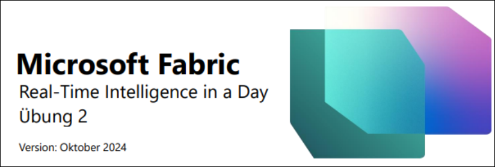


# Inhalt
- Dokumentstruktur	
- Einführung	
- Fabric-Echtzeit-Hub	
    - Aufgabe 1: Eine Ereignisstreamquelle erstellen	
    - Aufgabe 2: Eventstream-Ziel einrichten	
- Kusto-Abfragesprache (KQL)	
    - Aufgabe 3: Kusto-Datenbankabfragen autorisieren	
    - Aufgabe 4: T-SQL-Abfragen für eine KQL-Datenbank ausführen	
- KQL-Abfragesatz	
    - Aufgabe 5: Mit einem KQL-Abfragesatz arbeiten	
- Zusammenfassung	
- Referenzen	

 
# Dokumentstruktur

Die Übung enthält die Schritte, die der Benutzer durchführen muss, sowie zugehörige Screenshots zur visuellen Unterstützung. Wichtige Abschnitte sind in den Screenshots mit einem orangefarbenen Kasten gekennzeichnet.

# Einführung

In dieser Übung erfahren Sie, wie Sie einen kontinuierlichen Datenstrom von Echtzeitdaten
verarbeiten können. Sie verwenden ein Fabric Real-Time Intelligence-Objekt namens Eventstream, um diese Daten im Eventhouse zu erfassen, das Sie in der letzten Übung erstellt haben, und
schreiben einige grundlegende KQL-Abfragen.

Am Ende dieser Übung haben Sie Folgendes gelernt:

- Einen Eventstream erstellen
- Echtzeitdaten in eine KQL-Datenbank laden
- Grundlegende Abfragen in der Kusto-Abfragesprache schreiben 

# Fabric-Echtzeit-Hub

## Aufgabe 1: Eine Ereignisstreamquelle erstellen

1. Öffnen Sie den **Fabric-Arbeitsbereich**, den Sie in der letzten Übung erstellt haben. Hier wird uns das erstellte Eventhouse angezeigt.

    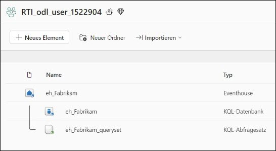

2. Navigieren Sie zum Echtzeit-Hub. Wählen Sie dazu auf der linken Seite die Schaltfläche
**Echtzeit** aus. Auch wenn wir noch keine Datenströme sehen, wird sich das bald ändern.

   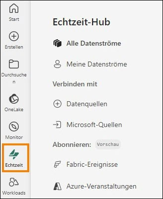
 
3. Wählen Sie die grüne Schaltfläche **+ Datenquelle verbinden** aus, die sich in der oberen rechten Ecke befinden sollte.

   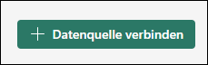

4. Es öffnet sich ein Fenster, in dem Sie eine Quelle für unsere Stream-Daten auswählen können. Wie wir bereits besprochen haben, gibt es viele hervorragende Optionen zur Auswahl, aber für diese Klasse wählen wir die Option „Azure Event Hubs“ aus. Wenn Sie „Azure Event Hubs“ nicht gleich finden, wählen Sie oben **Microsoft-Quellen** aus, um die angezeigten Optionen zu filtern.

    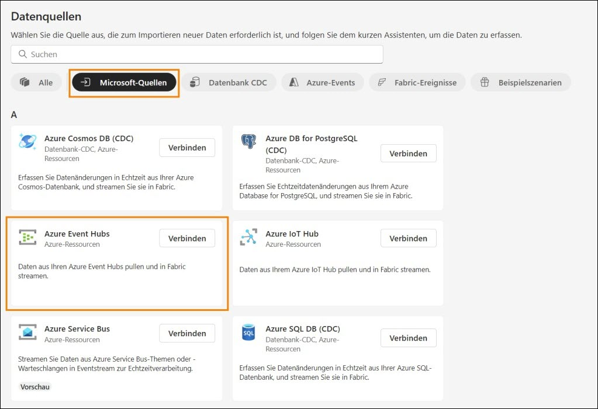

5. Sie müssen jetzt eine Verbindung zum Azure-Event Hub herstellen. Klicken Sie auf den Text **Neue Verbindung**, da Sie derzeit keine Verbindung haben.

   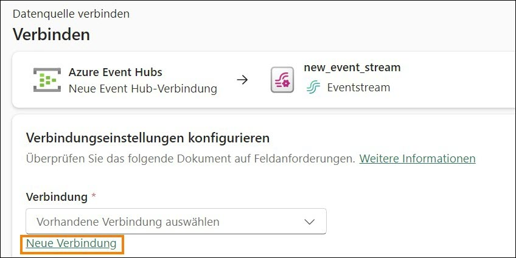

6. Kopieren Sie von Ihrer Umgebungsdetailseite alle erforderlichen Verbindungseinstellungen, und fügen Sie sie in die entsprechenden Felder ein. Für diese Übungen stellen wir eine Verbindung zu einem Event Hub her, an den Streamingdaten von einem Python-Notebook gesendet werden. Dieses Notebook erstellt gefälschte Verkaufstransaktionen mit einer Rate von etwa 3.100 Transaktionen pro Stunde.

    Event Hub-Namespace: **rtiadhub{userid} – bereitgestellt von Cloudlabs**

    Event Hub: **rti-iad-fabrikam**

    Name des gemeinsamen Zugriffsschlüssels: **rti-reader**

    Gemeinsamer Zugriffsschlüssel: **verfügbar in der Registerkarte "Umgebungsdetails"**


7. Sobald alle Eigenschaften ausgefüllt sind, klicken Sie auf **Verbinden**.

    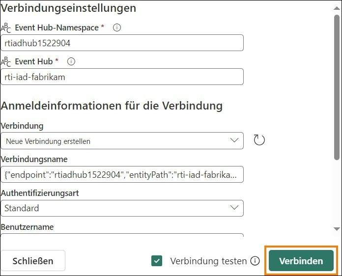

8. In der Konfiguration der Azure-Event Hub-Datenquelle müssen Sie ggf. die **Consumergruppe** von Event Hub ändern, um sicherzustellen, dass Sie einen eindeutigen Zugriffspunkt auf den Datenstrom erhalten. Für diesen Workshop können Sie den Wert „$Default“ wie unten gezeigt belassen.

   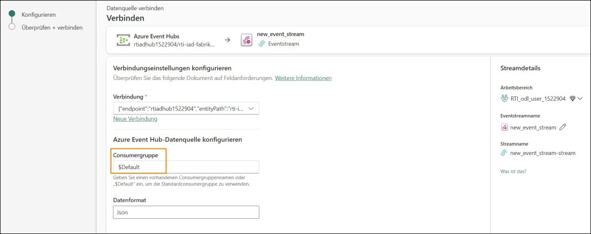

9.	Bevor wir diese Datenquelle und den Eventstream fertigstellen, benennen wir unseren Eventstream in einen nützlicheren Namen um. Klicken Sie im Abschnitt „Streamdetails“ rechts auf das Bleistiftsymbol neben „Eventstreamname“ und nennen Sie unseren Eventstream „**es_Fabrikam_InternetSales“**.

    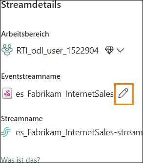

10.	Nun können wir auf **Weiter** klicken, wodurch wir zu einer letzten Übersichtsseite gelangen.

    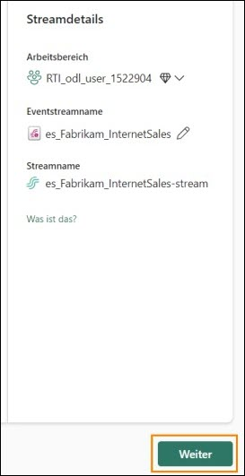

11. Überprüfen Sie in diesem Übersichtsbildschirm, ob der Inhalt korrekt ist, und klicken Sie auf
**Verbinden**.

    **Hinweis: Ihre Details werden von denen im Screenshot abweichen.**

    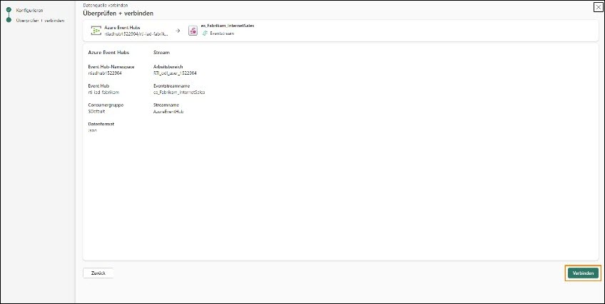

12. Sobald der Eventstream und die Eventstream-Quelle erstellt sind, wählen Sie die Option
„**Eventstream öffnen**“ aus.

    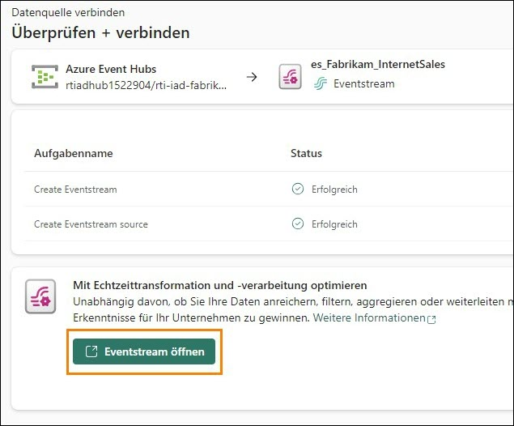

13. Dadurch gelangen Sie zur Eventstream-Benutzeroberfläche. Hier sehen Sie, wie Ihr Datenquellenstream in unseren Eventstream einfließt, und wir können auch „Ereignisse transformieren“ hinzufügen.

14.	Es kann einen Moment dauern, bis Ihre Quelle **aktiv** ist. Warten Sie jedoch einen Moment, und klicken Sie dann auf das mittlere Symbol mit dem Namen Ihres Eventstreams. Sie sollten jetzt eine Vorschau der Daten sehen.

    **Hinweis: Wenn Sie bezüglich einer Audit-Richtlinie den Status "Warnung" erhalten, ist das in Ordnung. Der Stream funktioniert weiterhin.**

    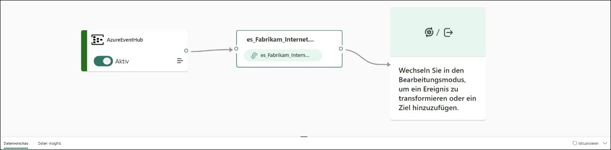

15.	Sie sollten jetzt im unteren Fenster ein Beispiel der Daten sehen.

    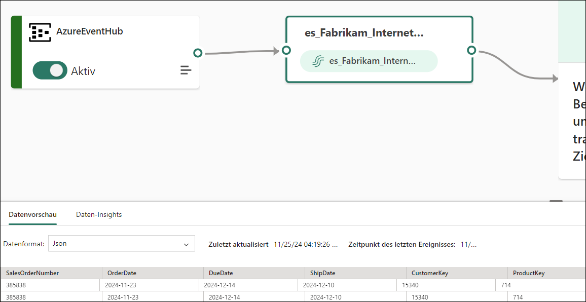

16.	Hier erhalten Sie eine Vorschauversion der Daten, die vom Azure-Event Hub empfangen werden. Wenn Sie die untere horizontale Bildlaufleiste ganz nach rechts neben Ihrer Vorschauversion schieben, können Sie in zwei Spalten mit den Namen **EventProcessedUtcTime** und **EventEnqueuedUtcTime** die Zeit sehen, zu der die Daten im Event Hub empfangen wurden. Dies sollte das aktuelle Datum/die aktuelle Uhrzeit im UTC-Format widerspiegeln.

    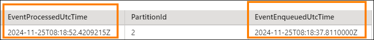

## Aufgabe 2: Eventstream-Ziel einrichten

1. Klicken Sie auf die Kachel im Canvas-Bereich mit der Bezeichnung Wechseln Sie in den Bearbeitungsmodus, um ein Ereignis zu transformieren oder ein Ziel hinzuzufügen.

   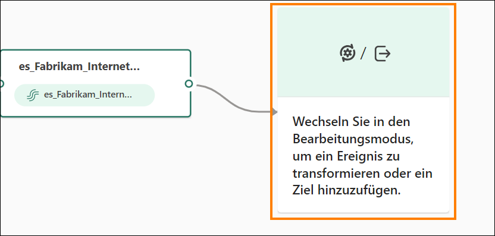

2. Klicken Sie in der Eventstream-Benutzeroberfläche auf die Option **Ereignisse transformieren oder Ziel hinzufügen**, um das Dropdownmenü zu öffnen.

   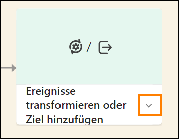

3. Zeigen Sie die Liste der verfügbaren Vorgänge an, die im Stream durchgeführt werden können.

   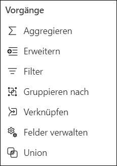

4. Unter dem Abschnitt **Vorgänge** finden Sie die **Ziele**. Wählen Sie die Option mit der Bezeichnung **Eventhouse** aus.

   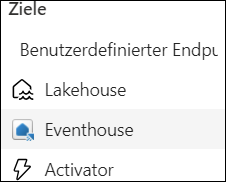

5. Auf der rechten Seite des Bildschirms wird ein neues Menü geöffnet. Das Erste, was Sie für das Ziel ändern müssen, ist der **Datenerfassungsmodus**. Die beiden Optionen lauten **Direkte Erfassung** und **Ereignisverarbeitung vor der Erfassung**. Da wir in unserem Eventstream nichts transformieren und diese Informationen direkt in eine KQL-Datenbanktabelle laden, stellen Sie sicher, dass Sie die Option **Direkte Erfassung** ausgewählt haben.

   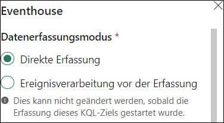
 
6. Ändern Sie die restlichen Einstellungen mit den folgenden Angaben.

    - Zielname – **eh-kql-db-fabrikam**
    - Arbeitsbereich – **RTI_username**
    - Eventhouse – **eh_Fabrikam**
    - KQL-Datenbank – **eh_Fabrikam**

        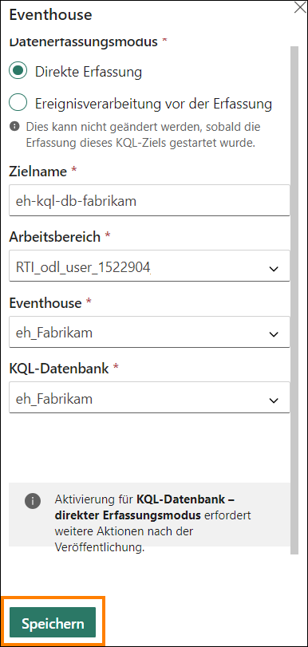

7. Klicken Sie auf „Speichern“.

8. Klicken Sie nach der Konfiguration des Eventstreams auf die Schaltfläche **Veröffentlichen**, um diesen Eventstream zu speichern und mit der Erfassung zu beginnen.

    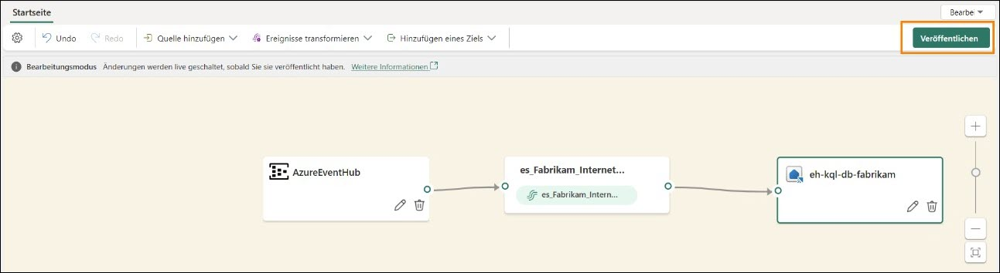

9. Wenn Sie feststellen, dass die **AzureEventHub**-Quelle inaktiv geworden ist, schalten Sie den Schalter auf den Status „Aktiv“ und wählen Sie die Option „Jetzt“, wenn das Dialogfeld geöffnet wird.
 
   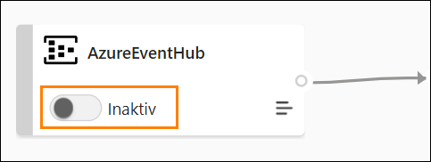

   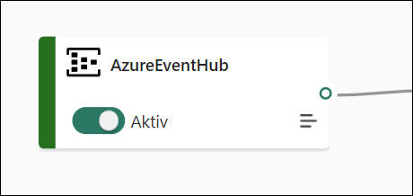

10.	Wählen Sie die Option **Konfigurieren** im **Ziel** aus, um den Stream korrekt einer Tabelle in der KQL-Datenbank zuzuordnen.

    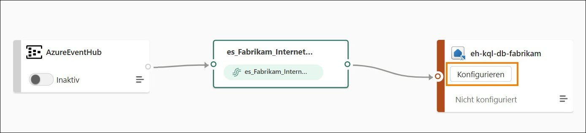

11.	Klicken Sie auf die Option **+ Neue Tabelle** unter der Datenbank **eh_Fabrikam**.

    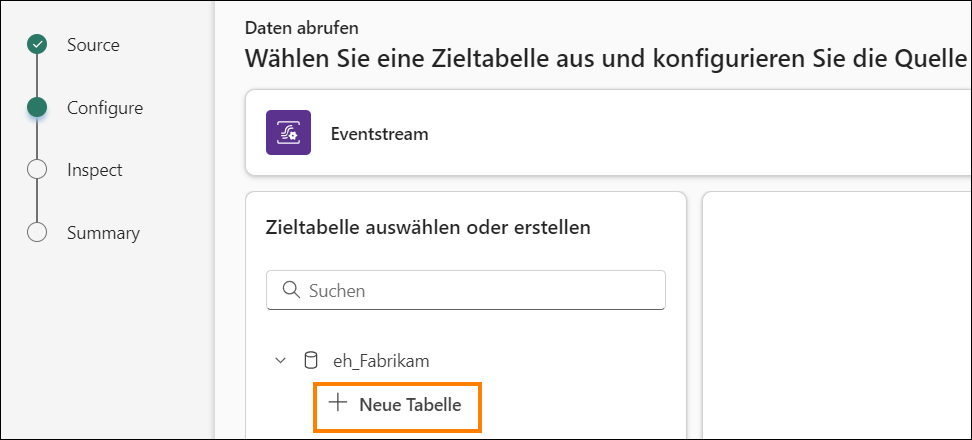

12.	Geben Sie der neuen Tabelle den Namen **InternetSales**, und klicken Sie anschließend auf das Häkchen.

    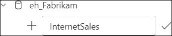
 
13.	Möglicherweise müssen Sie Ihren **"Namen der Datenverbindung"** aktualisieren, um die Anforderungen zu erfüllen. Benennen wir ihn in **"eh_Fabrikam_es_InternetSales"** um. Dann können wir auf **Weiter** klicken.

    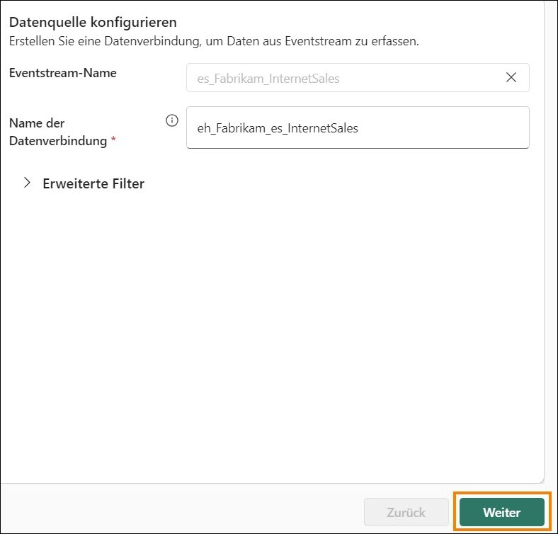

14. Nachdem Sie einen Moment nach Ereignissen gesucht haben, sollte Ihnen die Benutzeroberfläche anzeigen, dass Beispieldaten gefunden wurden. Klicken Sie unten im Bildschirm auf **Fertig stellen.**

    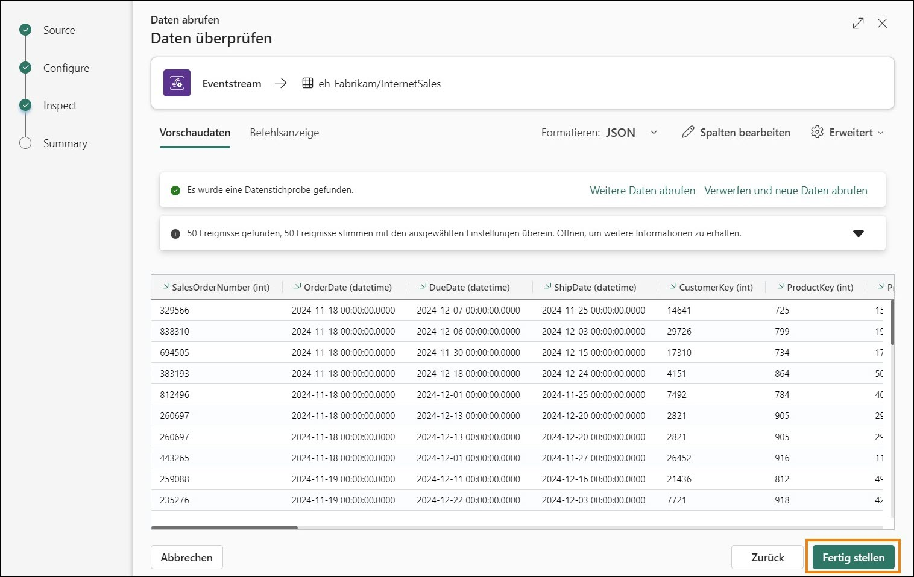

15.	Anschließend wird Ihnen eine Zusammenfassung angezeigt. Wenn alle Häkchen grün sind, klicken Sie auf **Schließen**, um fortzufahren.

16.	Sobald die Benutzeroberfläche die Zuordnungen von der Quelle zum Eventstream und zum Ziel anzeigt, haben Sie einen Datenstream in Ihrer KQL-Datenbank korrekt konfiguriert und gestartet.

    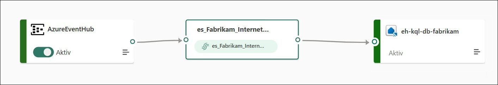

# Kusto-Abfragesprache (KQL)

## Aufgabe 3: Kusto-Datenbankabfragen autorisieren

1. Gehen Sie zurück zu Ihrem Arbeitsbereich **RTI_username**. Sie sollten neben allen Evenhouse- Elementen den neuen Eventstream sehen, den Sie gerade erstellt haben.

    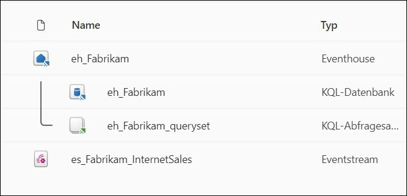

2. Öffnen Sie das KQL-Datenbankelement **eh_Fabrikam**.

    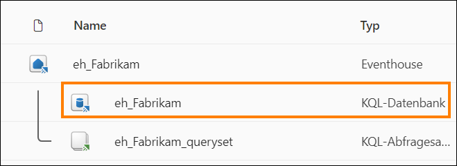

3. Im Rahmen dieser Erfahrung können Sie sich einen Überblick über die aktuelle Struktur, Größe und Verwendung der KQL-Datenbank verschaffen. Da der Eventstream ständig Daten an diese KQL-Datenbank sendet, werden Sie feststellen, dass die Speichermenge mit der Zeit zunimmt.

    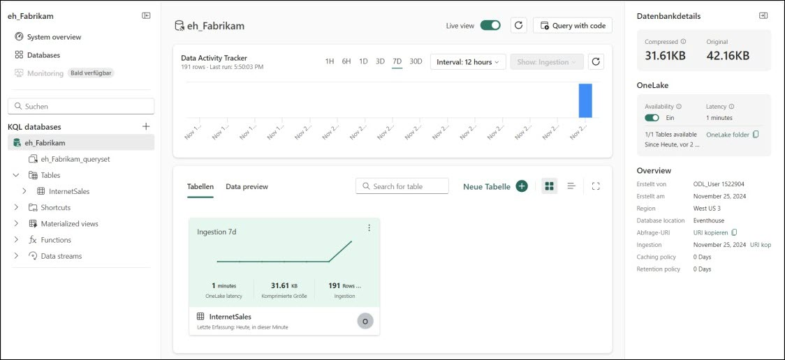

4. Klicken Sie auf das **Aktualisierungssymbol** in der rechten oberen Ecke des Bildschirms.

    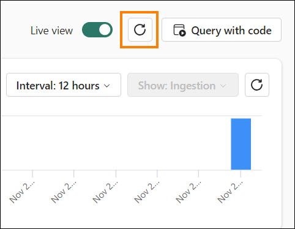

5. Die Datenbank sollte größer geworden sein. Der angezeigte Wert kann von dem Wert in den Screenshots der restlichen Übung abweichen. Je nachdem, wie lange Sie zum Absolvieren der Inhalte brauchen, haben Sie mehr oder weniger Erfassungen erhalten als andere Mitglieder der Klasse. Das ist völlig in Ordnung, und Sie können der Übung problemlos weiter folgen.

   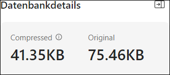

6. Klicken Sie im Navigationsbereich der Datenbank auf der linken Seite des Bildschirms auf die Tabelle in Ihrer KQL-Datenbank mit dem Namen **InternetSales**, und Sie sehen eine Übersicht über die Tabelle.

   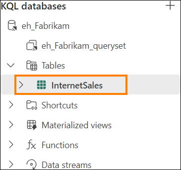

7. Diese Übersicht enthält Metadatendetails zu der von Ihnen erstellten Tabelle und zu allen aktiv mit Ihrem Eventstream gestreamten Daten. Auch hier gilt, dass die Größe der Tabelle und die Anzahl der Zeilen in der Tabelle von Kursteilnehmer zu Kursteilnehmer unterschiedlich sind und Ihre Endergebnisse in dieser oder einer anderen Übung nicht beeinflussen. In diesem Menü sind einige zusätzliche Punkte hervorzuheben:

    - **Data Activity Tracker** – Zeigt die Anzahl der erfassten Zeilen, den Zeitpunkt der letzten Generierung und das Anzeigeintervall an.
    - **Data preview** – Zeigt eine Vorschau der Tabellenerfassungsergebnisse an.
    - **Schema insights** – Hierzu gehören Angaben zum Spaltennamen und den Datentypen der Spalte, die mit KQL abgefragt werden können. Zeigt auch die Top 10 für die Werte in der ausgewählten Spalte an.
    - **Tabellendetails** – Zeigt die komprimierte und ursprüngliche Größe der Tabelle, die OneLake- Verfügbarkeit, die Anzahl der Zeilen in den Tabellen und verschiedene andere Details an.

        

8. Kehren Sie zur Datenbankansicht zurück und klicken Sie in der oberem rechten Ecke auf **Query with code**.

   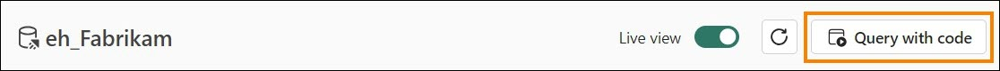

9. Dadurch wird der Standard-KQL-Abfragesatz geöffnet, der zusammen mit dem Eventhouse
erstellt wurde. Es gibt einige vorgefertigte Abfragen, die bereits erstellt wurden, aber geringfügig angepasst werden müssen. Es gibt außerdem zwei Links zur Microsoft-Dokumentation, die beim Erlernen von KQL oder auch bei der Betrachtung von SQL-zu-KQL-Konvertierungen hilfreich sein können, die später in diesem Kurs besprochen werden.

    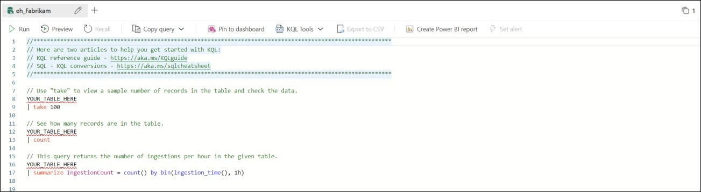

10. Klicken Sie auf **Zeile 8** und an die Stelle, wo die Abfrage **YOUR_TABLE_HERE** lautet. Ersetzen Sie dies durch den Tabellennamen **InternetSales**.

    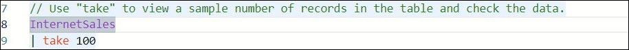

11.	Markieren Sie **Zeile 8 und 9**, und klicken Sie auf die Schaltfläche **Run** oben links im Fenster.

    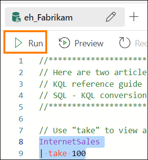

12.	Die Abfrage verwendet den **take**-Operator, um eine bestimmte Anzahl an Zeilen wiederherzustellen. Wenn die Abfrage ausgeführt wird, werden Daten aus der Tabelle
„InternetSales“ abgerufen und die Anzahl der Zeilen zurückgegeben, die Sie in die Abfrage eingefügt haben. In diesem Beispiel werden nur 100 Zeilen zurückgegeben, wie bei einer WHERE- Klausel in SQL. Die konkreten zurückgegebenen Zeilen können mit diesem Operator nicht ermittelt werden und die Ergebnisse Ihrer Abfrage werden von den Ergebnissen anderer abweichen.

    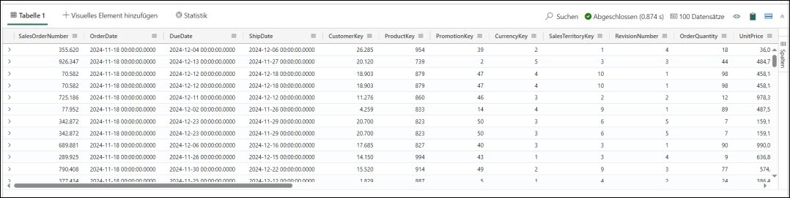


13.	Klicken Sie auf **Zeile 12** und an die Stelle, wo die Abfrage **YOUR_TABLE_HERE** lautet. Ersetzen Sie dies durch den Tabellennamen **InternetSales**.

    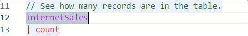

14.	Markieren Sie **Zeile 12 und 13**, und klicken Sie auf die Schaltfläche **Run** oben links im Fenster.

    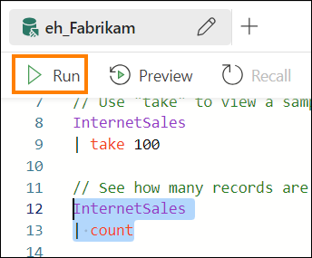

15.	Diese Abfrage verwendet den count-Operator. Diese Abfrage gibt eine aggregierte Anzahl von Datensätzen zurück, die zum Zeitpunkt der Abfrageausführung in der KQL-Datenbanktabelle vorhanden sind. Sie können diese Abfrage gerne noch ein paar Mal ausführen. Sie werden dann feststellen, dass die Anzahl der Datensätze alle paar Sekunden zunimmt.

    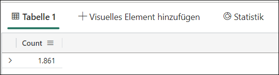

16.	Wiederholen Sie die vorherigen Schritte für die letzte Abfrage, die in **Zeile 16/17** automatisch für Sie erstellt wird, und führen Sie die Abfrage erneut aus.

    

17.	Diese Abfrage gibt Ihnen die Anzahl der Datensätze an, die innerhalb eines Stundenfensters in Ihre Tabelle aufgenommen wurden. Die Gesamtverteilung dieser Datensätze für die Daten, die Sie aktuell erfassen, beträgt ungefähr 4.100 pro Stunde. Es wird jedoch leichte Abweichungen bei der Anzahl der Transaktionen pro Stunde geben und diese Abfrage gibt detailliert an, ob in jedem Fenster mehr oder weniger Datensätze erfasst wurden.

## Aufgabe 4: T-SQL-Abfragen für eine KQL-Datenbank ausführen

Möglicherweise arbeiten Sie zum ersten Mal mit der Kusto-Abfragesprache. Obwohl diese Sprache für einfache Abfragen intuitiv und leicht zu erlernen ist, möchten Sie möglicherweise die Ergebnisse komplexerer Abfragen zurückgeben, als Sie derzeit können. In die Funktionen des KQL-Abfragesatzes wurden mehrere hilfreiche Tools integriert, darunter die Konvertierung von SQL-Abfragen in KQL- Abfragen und die einfache Erstellung von T-SQL-Abfragen innerhalb des KQL-Abfragesatzes. Sehen wir uns dies an!

1. Sie müssen eine Abfrage erstellen, die jedes Produkt mit der Anzahl seiner Verkäufe zurückgibt. Dies ist eine Aufgabe, die Sie schnell mit T-SQL ausführen können. Im Abfragefenster können Sie Ihre SQL-Abfragen in KQL übersetzen, um besser zu verstehen, wie Sie in Zukunft KQL-Abfragen erstellen. Beginnen Sie mit dem Schreiben des folgenden Befehls.

    **(Hinweis: Doppelklicken Sie auf das Objekt unten, um den Text kopieren zu können.)**

    ```
    --
    explain
    ```

   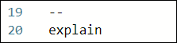

2. Mit der Kommentarzeile „--“, gefolgt vom Schlüsselwort "explain", können Sie nun eine SQL- Abfrage erstellen und mit der KQL-Abfrage ein Ergebnis zurückgeben, mit dem eine ähnliche
Abfrage und ein ähnliches Ergebnis erzielt werden können. Geben Sie unten die folgende Abfrage ein, um zu erklären, wie die KQL-Abfrage aussehen würde:

    ```
    --
    explain
    SELECT COUNT(OrderQuantity) AS CountOfProducts
    , ProductKey FROM InternetSales GROUP BY ProductKey
    ```

   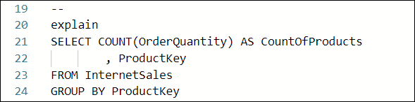


3. Dies ist eine einfache SQL-Abfrage, die Ergebnisse aus der Tabelle „InternetSales“ abruft und zwei Spalten zurückgibt: den Produktschlüssel und eine Anzahl der Bestellungen. Da es eine aggregierte und eine nicht aggregierte Spalte gibt, müssen Sie GROUP BY verwenden, um Ergebnisse für jedes einzelne Produkt zurückzugeben. Führen Sie die gesamte Abfrage aus, beginnend mit „--“ bis zum Ende der T-SQL-Abfrage.

   

4. Die Ausgabe der EXPLAIN-Abfrage sollte ein einzelner Datensatz mit der übersetzten KQL-Abfrage als Ergebnis sein. Klicken Sie auf das **Caret-Symbol (>)**, um die Ergebnisse zu erweitern und die Übersetzung zu erleichtern.

   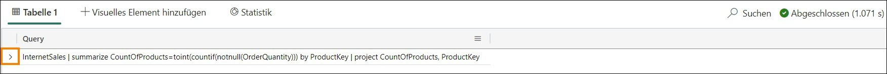

5. Klicken Sie auf den unten in Orange hervorgehobenen Abfragebereich. Dadurch können Sie die übersetzte KQL-Abfrage auswählen und kopieren. Fügen Sie diese Abfrage in den von uns
verwendeten KQL-Abfragesatz ein.

   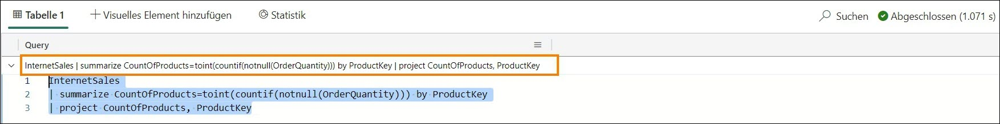

6. Markieren Sie die Abfrage in Ihrem Abfragebereich und führen Sie sie aus, um die Ergebnisse abzurufen. Der **summarize**-Operator erstellt eine Tabelle, die den Inhalt der Eingabetabelle aggregiert und gleichzeitig bestimmt, wie die einzelnen Datensätze mit dem **Produktschlüssel** gruppiert werden. Der **project**-Operator wählt die Spalten aus, die beim Einfügen neuer berechneter Spalten einbezogen, umbenannt oder gelöscht werden sollen.

    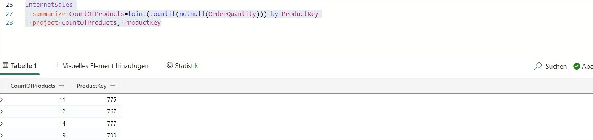

7. Sehen Sie sich oben in Ihrem Abfragesatz die Liste der SQL-zu-KQL-Spickzetteloperationen für zusätzliche Funktionen und Konvertierungen an.

    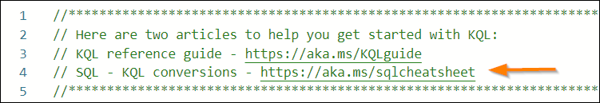

8. Anstelle von KQL können Sie die Ergebnisse der KQL-Datenbank in Fabric auch alternativ abfragen, indem Sie eine T-SQL-Abfrage schreiben und ausführen. Markieren Sie die ursprüngliche SQL- Anweisung, die zum Übersetzen der KQL-Abfrage verwendet wurde, und führen Sie nur diese aus.

    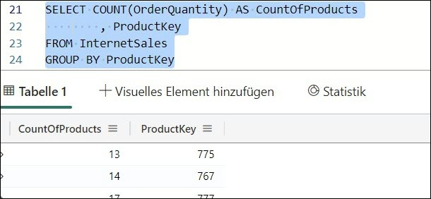

9. Damit erhalten Sie auch ohne vorherige Konvertierung in KQL absolut valide Ergebnisse.

    

# KQL-Abfragesatz

## Aufgabe 5: Mit einem KQL-Abfragesatz arbeiten

1. Während die meisten Abfragen in diesem Fenster automatisch über die Benutzeroberfläche
erstellt wurden, kann es in Zukunft vorkommen, dass Sie Ihre eigenen KQL-Abfragen von Grund auf neu erstellen möchten. Dies kann über die Registerkarten im oberen Bereich verwaltet
werden. Es ist außerdem zu beachten, dass dieser Abfragesatz regelmäßig automatisch gespeichert wird.


2. Im oberen Bereich des Abfragesatzes sehen Sie den Standardnamen unserer ersten Seite, der dem Namen unserer Datenbank entspricht.

     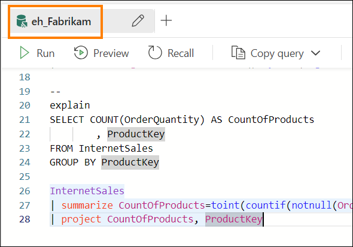

3. Lassen Sie uns diese Registerkarte umbenennen. Klicken Sie dazu auf das Bleistiftsymbol und nennen Sie sie in **"My First KQL Query"** um.

     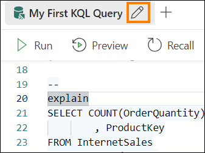

4. Wenn wir unseren Code in Zukunft isolieren möchten, können wir einfach zusätzliche Registerkarten erstellen, indem wir auf das „+“-Symbol klicken.

     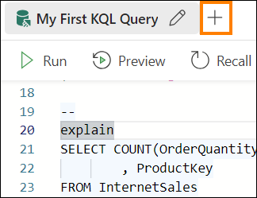

5. Kehren Sie zu Ihrem Arbeitsbereich **RTI_username** zurück. Folgende Objekte sollten vorhanden sein

     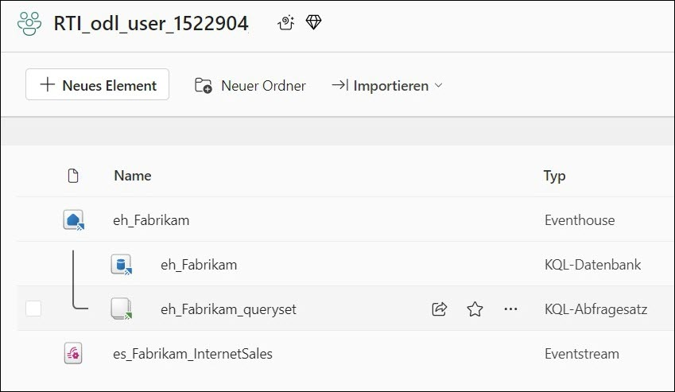

# Zusammenfassung

In dieser Übung haben Sie zunächst eine Verbindung zu einem Event Hub mit einem laufenden Datenstrom eingerichtet und einen Eventstream verwendet, um diese Daten zu übernehmen und in einer KQL-Datenbank zu erfassen. Nachdem die Daten erfasst wurden, konnten Sie mehrere KQL-Abfragen erstellen und sich die Funktionalität der Verwendung von T-SQL ansehen, um die KQL-Syntax zu erlernen oder einfach Ergebnisse mit SQL-Anweisungen zurückzugeben.

# Referenzen

Bei Fabric Real-time Intelligence in a Day (RTIIAD) lernen Sie einige der wichtigsten Funktionen von Microsoft Fabric kennen. 

Im Menü des Dienstes finden Sie in der Hilfe (?) Links zu praktischen Informationen.


Nachfolgend finden Sie weitere Angebote zur weiteren Arbeit mit Microsoft Fabric.

- Die vollständige Ankündigung der [Microsof t Fabric allgemeinen Verfügbarkeit finden Sie im Blogbeitrag.](https://www.microsoft.com/en-us/microsoft-fabric/blog/2023/11/15/prepare-your-data-for-ai-innovation-with-microsoft-fabric-now-generally-available/)
- Fabric bei einer [interaktiven Vorstellung](https://guidedtour.microsoft.com/en-us/guidedtour/microsoft-fabric/microsoft-fabric/1/1) kennenlernen
- Zur kostenlosen Testversion von [Microsoft Fabric anmelden](https://www.microsoft.com/en-us/microsoft-fabric/getting-started)
- Besuchen Sie die [Microsoft Fabric-Website](https://www.microsoft.com/en-in/microsoft-fabric)
- Mit den [Modulen von Fabric Learning](https://www.microsoft.com/en-in/microsoft-fabric) neue Qualifikationen erwerben
- [Technische Dokumentation zu Fabric](https://learn.microsoft.com/en-us/fabric/) erkunden
- [Kostenloses E--Book zum Einstieg in Fabric lesen](https://info.microsoft.com/ww-landing-unlocking-transformative-data-value-with-microsoft-fabric.html)
- Mitglied der [Fabric-Community](https://community.fabric.microsoft.com/) werden, um Fragen zu stellen, Feedback zu geben und sich mit anderen auszutauschen

Lesen Sie die detaillierteren Blogs zur Ankündigung der Fabric-Umgebung:'

- [Blog zum Data Factory-Funktionsbereich in Fabric](https://blog.fabric.microsoft.com/en-us/blog/introducing-data-factory-in-microsoft-fabric/)
- [Blog zum Synapse Data Engineering-Funktionsbereich in Fabric](https://blog.fabric.microsoft.com/en-us/blog/introducing-synapse-data-engineering-in-microsoft-fabric/)
- [Blog zum Synapse Data Science-Funktionsbereich in Fabric](https://blog.fabric.microsoft.com/en-us/blog/introducing-synapse-data-science-in-microsoft-fabric/)
- [Blog zum Synapse Data Warehousing-Funktionsbereich in Fabric](https://blog.fabric.microsoft.com/en-us/blog/introducing-synapse-data-warehouse-in-microsoft-fabric/)
- [Real-Time Intelligence-Erfahrung im Fabric-Blog](https://blog.fabric.microsoft.com/en-us/blog/category/real-time-intelligence)
- [Power BI-Ankündigung im Blog](https://powerbi.microsoft.com/en-us/blog/empower-power-bi-users-with-microsoft-fabric-and-copilot/)
- [Blog zum Data Activator-Funktionsbereich in Fabric](https://blog.fabric.microsoft.com/en-us/blog/driving-actions-from-your-data-with-data-activator/)
- [Blog zu Verwaltung und Governance in Fabric](https://blog.fabric.microsoft.com/en-us/blog/administration-security-and-governance-in-microsoft-fabric/)
- [Blog zu OneLake in Fabric](https://blog.fabric.microsoft.com/en-us/blog/microsoft-onelake-in-fabric-the-onedrive-for-data/)
- [Blog zur Dataverse- und Microsoft Fabric-Integration](https://www.microsoft.com/en-us/dynamics-365/blog/it-professional/2023/05/24/new-dataverse-enhancements-and-ai-powered-productivity-with-microsoft-365-copilot/)
 
© 2024 Microsoft Corporation. Alle Rechte vorbehalten.

Durch die Verwendung der vorliegenden Demo/Übung stimmen Sie den folgenden Bedingungen zu:

Die in dieser Demo/Übung beschriebene Technologie/Funktionalität wird von der Microsoft Corporation bereitgestellt, um Feedback von Ihnen zu erhalten und Ihnen Wissen zu vermitteln. Sie dürfen die Demo/Übung nur verwenden, um derartige Technologiefeatures und Funktionen zu bewerten und Microsoft Feedback zu geben. Es ist Ihnen nicht erlaubt, sie für andere Zwecke zu
verwenden. Es ist Ihnen nicht gestattet, diese Demo/Übung oder einen Teil derselben zu ändern, zu kopieren, zu verbreiten, zu übertragen, anzuzeigen, auszuführen, zu vervielfältigen, zu veröffentlichen, zu lizenzieren, zu transferieren oder zu verkaufen oder aus ihr abgeleitete Werke zu erstellen.

DAS KOPIEREN ODER VERVIELFÄLTIGEN DER DEMO/ÜBUNG (ODER EINES TEILS DERSELBEN)
AUF EINEN/EINEM ANDEREN SERVER ODER SPEICHERORT FÜR DIE WEITERE VERVIELFÄLTIGUNG ODER VERBREITUNG IST AUSDRÜCKLICH UNTERSAGT.

DIESE DEMO/ÜBUNG BIETET BESTIMMTE SOFTWARETECHNOLOGIE/PRODUKTFUNKTIONEN UND FUNKTIONALITÄT, EINSCHLIESSLICH MÖGLICHER NEUER FUNKTIONEN UND KONZEPTE, IN EINER SIMULIERTEN UMGEBUNG OHNE KOMPLEXE EINRICHTUNG ODER INSTALLATION FÜR DEN BESCHRIEBENEN ZWECK OBEN. DIE IN DIESER DEMO/ÜBUNG DARGESTELLTEN TECHNOLOGIEN/ KONZEPTE STELLEN MÖGLICHERWEISE NICHT DIE VOLLSTÄNDIGE FUNKTIONALITÄT DER FUNKTION DAR UND FUNKTIONIEREN MÖGLICHERWEISE NICHT SO, WIE EINE ENDGÜLTIGE VERSION FUNKTIONIEREN KÖNNTE. UNTER UMSTÄNDEN VERÖFFENTLICHEN WIR AUCH KEINE ENDGÜLTIGE VERSION DERARTIGER FEATURES ODER KONZEPTE. IHRE ERFAHRUNG BEI DER VERWENDUNG DERARTIGER FEATURES UND FUNKTIONEN IN EINER PHYSISCHEN UMGEBUNG KANN FERNER ABWEICHEND SEIN.

**FEEDBACK**. Wenn Sie Feedback zu den Technologiefeatures, Funktionen und/oder Konzepten geben, die in dieser Demo/Übung beschrieben werden, gewähren Sie Microsoft das Recht, Ihr
Feedback in jeglicher Weise und für jeglichen Zweck kostenlos zu verwenden, zu veröffentlichen und gewerblich zu nutzen. Außerdem treten Sie Dritten kostenlos sämtliche Patentrechte ab, die erforderlich sind, damit deren Produkte, Technologien und Dienste bestimmte Teile einer Software oder eines Dienstes von Microsoft, welche/welcher das Feedback enthält, verwenden oder eine Verbindung zu dieser/diesem herstellen können. Sie geben kein Feedback, das einem Lizenzvertrag unterliegt, aufgrund dessen Microsoft Drittparteien eine Lizenz für seine Software oder Dokumentation gewähren muss, weil wir Ihr Feedback in diese aufnehmen. Diese Rechte bestehen nach Ablauf dieser Vereinbarung fort.

DIE MICROSOFT CORPORATION LEHNT HIERMIT JEGLICHE GEWÄHRLEISTUNGEN UND GARANTIEN IN BEZUG AUF DIE DEMO/ÜBUNG AB, EINSCHLIESSLICH ALLER AUSDRÜCKLICHEN, KONKLUDENTEN ODER GESETZLICHEN GEWÄHRLEISTUNGEN UND GARANTIEN DER HANDELSÜBLICHKEIT, DER EIGNUNG FÜR EINEN BESTIMMTEN ZWECK, DES RECHTSANSPRUCHS UND DER NICHTVERLETZUNG VON RECHTEN DRITTER. MICROSOFT MACHT KEINERLEI ZUSICHERUNGEN BZW. ERHEBT KEINERLEI ANSPRÜCHE IM HINBLICK AUF DIE RICHTIGKEIT DER ERGEBNISSE UND DES AUS DER VERWENDUNG DER DEMO/ÜBUNG RESULTIERENDEN ARBEITSERGEBNISSES BZW. BEZÜGLICH DER EIGNUNG DER IN DER DEMO/ÜBUNG ENTHALTENEN INFORMATIONEN FÜR EINEN BESTIMMTEN ZWECK.

**HAFTUNGSAUSSCHLUSS**

Diese Demo/Übung enthält nur einen Teil der neuen Features und Verbesserungen in Microsoft Power BI. Einige Features können sich unter Umständen in zukünftigen Versionen des Produkts ändern. In dieser Demo/Übung erhalten Sie Informationen über einige, aber nicht über alle neuen Features.

