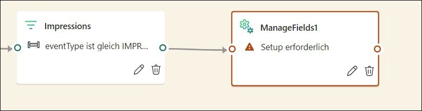
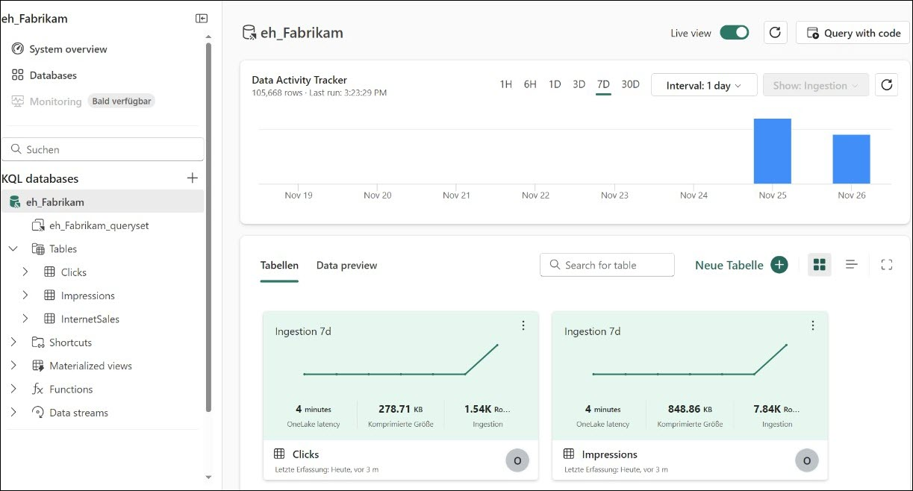
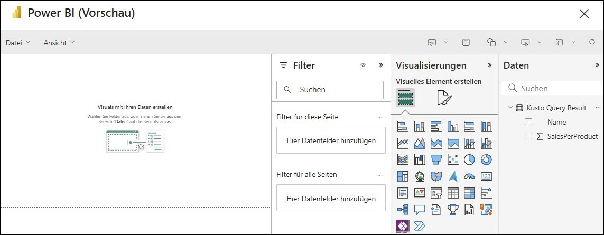

# Microsoft Fabric Real-Time Intelligence in a Day Übung 3


# Inhalt 
- Dokumentstruktur
- Einführung
- Fabric Eventstreams
    - Aufgabe 1: Einen Eventstream erstellen
    - Aufgabe 2: Den Eventstream transformieren
    - Aufgabe 3: Eventstream aufteilen und zwei Ziele laden
- Weitere Daten zur KQL-Datenbank hinzufügen
    - Aufgabe 4: Ereignisdatentabellen validieren
    - Aufgabe 5: KQL-Datenbankverknüpfungen für Dimensionstabellen erstellen
- Zusammenfassung
- Referenzen

# Dokumentstruktur 
Die Übung enthält die Schritte, die der Benutzer durchführen muss, sowie zugehörige Screenshots zur visuellen Unterstützung. Wichtige Abschnitte sind in den Screenshots mit einem orangefarbenen Kasten gekennzeichnet. 

# Einführung
In dieser Übung erstellen Sie einen weiteren Eventstream, um zusätzliche Daten in unserem bestehenden Eventhouse zu erfassen. Wir sehen uns an, wie Transformationen in den Eventstream einbezogen werden, um zu steuern, welche Daten wir der KQL-Datenbank hinzufügen möchten.

Am Ende dieser Übung haben Sie Folgendes gelernt: 
- Eventstream-Verarbeitung und -Transformation
- KQL-Abfragen zum Zusammenführen von Daten aus externen Datenbanken schreiben
- KQL zum Abfragen und Anzeigen von Daten in Power BI verwenden

# Fabric Eventstreams
## Aufgabe 1: Einen Eventstream erstellen 

1. Öffnen Sie den **Fabric-Arbeitsbereich**, den Sie heute im Kurs verwenden.

   


2. Für uns stehen im Zusammenhang mit unserem E-Commerce-Shop zusätzliche Streaming-Daten zum Erfassen zur Verfügung. Für diesen Eventstream möchten wir die Daten jedoch transformieren, bevor wir sie in das Eventhouse laden. Anstatt zum **„Echtzeit-Hub“** zu navigieren, können wir direkt aus dem Arbeitsbereich einen neuen Eventstream erstellen. Erstellen Sie über das Menü **+ Neues Element** einen neuen **Eventstream**.

    
 
3. Geben Sie dem neuen Eventstream den Namen **es_Fabrikam_ClickEvents**, aktivieren Sie die Option **„Erweiterten Funktionen“**, und klicken Sie dann auf **Erstellen**.

   
 
4. Klicken Sie unter dem Menüband „Startseite“ auf das Dropdownmenü **Quelle hinzufügen**, und wählen Sie dann **Externe Quellen** aus.

    
 
5. Ähnlich wie in der vorherigen Übung stellen wir eine Verbindung zu einem Azure-Event Hub her, zu dem Daten aus einem Python-Notebook gestreamt werden. Klicken Sie auf **„Verbinden“** für die Kachel **„Azure Event Hubs“**. Wenn Sie **„Azure Event Hubs“** im empfohlenen Abschnitt nicht sehen, dann wählen Sie **„Alle anzeigen Quellen“**, um sie zu finden.

    
 
6. Erstellen Sie eine **neue Verbindung**.

     
 
7. Kopieren Sie von Ihrer Umgebungsdetailseite alle erforderlichen Verbindungseinstellungen, und fügen Sie sie in die entsprechenden Felder ein.

    - Event Hub-Namespace: **rtiadhub{username}**

    - Event Hub: **rta-iad-clicks**

    - Name des gemeinsamen Zugriffsschlüssels: **rti-reader**

    - Gemeinsamer Zugriffsschlüssel: **Bereitgestellt von Umgebungsdetails**

      
 
8. Sobald alle Eigenschaften ausgefüllt sind, klicken Sie auf **Verbinden**.

9. In der Konfiguration der Azure Event Hub-Datenquelle müssen Sie ggf. die **Consumergruppe** von Event Hub ändern, um sicherzustellen, dass Sie einen eindeutigen Zugriffspunkt auf den Datenstrom erhalten. Für diesen Workshop können Sie den Wert „$Default“ wie unten gezeigt belassen. 

      
 

10. Klicken Sie auf **Weiter**.

11. Überprüfen Sie im Fenster „Überprüfen + verbinden“, ob alles richtig konfiguriert ist, und klicken Sie auf **Hinzufügen**.

     
 
12. Sobald der Stream konfiguriert ist, können Sie eine Vorschau der vom Event Hub kommenden Daten sehen.

     
 
13. Untersuchen Sie die empfangenen Daten. Es gibt zwei Arten von Ereignissen, die von der E-Commerce-Website protokolliert werden: Klicks und Impressionen.

    - **IMPRESSION** – Ein Impressions-Ereignis wird jedes Mal aufgezeichnet, wenn einem Benutzer eine Werbeanzeige oder eine Produktliste angezeigt wird. Impressionen sind ein Maß dafür, wie oft ein Element (eine Anzeige oder ein Produkt) angesehen wird, unabhängig davon, ob damit interagiert wird.

    - **KLICK** – Ein Klickereignis wird aufgezeichnet, wenn ein Benutzer mit einem Element interagiert, indem er darauf klickt. Dies deutet im Allgemeinen auf ein höheres Maß an Interaktion hin als ein Impression.
    Zusätzlich zu den Klick- und Impressions-Ereignissen, die protokolliert werden, gibt es Details darüber, für welches Produkt der Klick oder die Impression war, von welchem Gerät und Browser aus die Webseite geladen wurde, über welche IP-Adresse auf die Seite zugegriffen wurde und wie lange das Laden der Seite gedauert hat.

## Aufgabe 2: Den Eventstream transformieren

1. Sie nehmen nun diesen Datenstrom und transformieren ihn vor der Erfassung in Ihrer KQL-Datenbank, und zwar auf eine Weise, die für Analysten, die aus diesen Daten Erkenntnisse gewinnen möchten, leicht verständlich ist. Klicken Sie im Eventstream-Canvas auf das Dropdownmenü für das Objekt **Ereignisse transformieren**.

     
 
2. Wählen Sie in der Liste der verfügbaren Operationen die Option **Felder verwalten** aus.
 
     

3. Klicken Sie auf dem neu angezeigten Symbol mit der Bezeichnung **ManageFields** auf das **Bleistiftsymbol**, um auszuwählen, welche Felder Sie aus der Quelle zu Ihrem Stream hinzufügen möchten.

     
 
4. Klicken Sie im angezeigten Flyout-Bereich auf die Schaltfläche mit der Option **Alle Felder hinzufügen**.

      

5. Wählen Sie in der Liste der Felder das Feld mit der Bezeichnung **PartitionId** aus, und klicken Sie auf die Auslassungspunkte (…), die angezeigt werden, wenn Sie mit der Maus über das Feld fahren.

      

6. Wählen Sie die Option zum **Entfernen** dieses Felds aus. Für diesen Datenstrom vom Event Hub wird keine Partitionierung verwendet. Daher ist diese Spalte für uns nicht hilfreich und wir entfernen sie.

      
 
7. Es sollten nur noch die Felder angezeigt werden wie im nachfolgenden Bild.

    - userAgent
    - page_loading_seconds
    - EventProcessedUtcTime
    - EventEnqueredUtcTime

      

      Im Bild unten sollten die folgenden Felder übrig bleiben.
  
8. Bewegen Sie den Mauszeiger über das Feld „eventDate“, und klicken Sie auf die Auslassungspunkte (…), die auf der rechten Seite des Fensters angezeigt werden.

      
 
9. Wählen Sie die Option **Bearbeiten** aus.
 
      


10. Klicken Sie auf den Umschalter **Änderungstyp**, um den Datentyp dieses Felds zu ändern. Der ursprüngliche Typ ist eine Zeichenfolge. Sie müssen den **konvertierten Typ** in **DateTime** ändern. Wenn Sie fertig sind, klicken Sie auf **Speichern**.

      

## Aufgabe 3: Eventstream aufteilen und zwei Ziele laden

1. Sie könnten diesen Datenstrom zwar zur Analyse in eine KQL-Datenbank laden, möchten diese Daten aber möglicherweise auf eine andere Weise nutzen, um zwischen CLICK- und IMPRESSIONS-Ereignissen zu unterscheiden. Fügen Sie der Benutzeroberfläche eine weitere Transformationsaktivität hinzu, indem Sie den Mauszeiger über das Ende der Transformation **ManageFields** bewegen.

     
 
2. Wählen Sie die Transformation **Filter** aus der Liste der verfügbaren Vorgänge aus.

     

3. Klicken Sie auf das **Bleistiftsymbol** in der neuen Transformation **Filter**.

     

4. Passen Sie im Flyout, das auf der rechten Seite des Bildschirms angezeigt wird, die Filterbedingungen so an, dass mithilfe der folgenden Einstellungen nur CLICK-Werte zurückgegeben werden. Es ist wichtig zu beachten, dass die Filtertransformation zwischen Groß- und Kleinschreibung unterscheidet.

    - **Name des Vorgangs** – Clicks
    
    - **Wählen Sie ein Feld aus, nach dem gefiltert werden soll** – eventType
    
    - **Ereignisse beibehalten, wenn der Wert** – ist gleich – CLICK **(Wichtig! In diesem Feld wird zwischen Groß- und Kleinschreibung unterschieden. Achten Sie in diesem Beispiel darauf, die Eingabe ausschließlich in Großbuchstaben vorzunehmen.)**

      
 
5. Wählen Sie die Option **Speichern** aus, um Ihre Änderungen beizubehalten.

6. Klicken Sie erneut auf die Schaltfläche **Aktualisieren**, um zu überprüfen, ob die Daten nach CLICK-Ereignistypen gefiltert wurden.

    
 
7. Dies sind möglicherweise die einzigen Zeilen, die Sie an eine Tabelle senden möchten. Eine andere Möglichkeit besteht darin, stattdessen zwei separate Streams zu erstellen, um unterschiedliche Informationen an zwei oder mehr Tabellen weiterzuleiten. Klicken Sie im Menüband **Start** des Eventstreams auf das Dropdownmenü **Ereignisse transformieren**, und wählen Sie dann **Filter** aus.

    
 
8. Ein neues Objekt mit dem Namen **Filter (Name kann abweichen)** wird auf Ihrer Canvas angezeigt. Sie müssen den Stream **ManageFields** mit der neuen Filtertransformation verbinden. Ziehen Sie eine Linie vom grünen Punkt einer Transformation zu einer anderen, um diese Verbindung herzustellen.

    

9. Klicken Sie auf das **Bleistiftsymbol** für **Filter**, um die Einstellungen zu bearbeiten.

     

10. Passen Sie im Flyout, das auf der rechten Seite des Bildschirms angezeigt wird, die Filterbedingungen so an, dass mithilfe der folgenden Werte nur IMPRESSION-Werte zurückgegeben werden. Beachten Sie, dass bei der Filtertransformation zwischen Groß- und Kleinschreibung unterschieden wird.
      
    - **Name des Vorgangs** – Impressions
    
    - **Wählen Sie ein Feld aus, nach dem gefiltert werden soll** – eventType
    
    - **Ereignisse beibehalten, wenn der Wert** – ist gleich – IMPRESSION **(Wichtig! In diesem Feld wird zwischen Groß- und Kleinschreibung unterschieden. Achten Sie in diesem Beispiel darauf, die Eingabe ausschließlich in Großbuchstaben vorzunehmen.)**

      
 
11. Wählen Sie die Option **Speichern** aus, um Ihre Änderungen beizubehalten.

12. Bevor wir die Daten in neue Tabellen in unserer KQL-Datenbank laden, können wir zusätzliche Spalten entfernen, die nicht benötigt werden. In diesem Fall benötigen wir für den Datenstrom, der nach unseren „CLICK“-Datensätzen gefiltert wird, die Spalte „eventType“ nicht mehr, da jede Zeile denselben Wert enthält. Für unseren „IMPRESSIONEN“-Datenstrom können wir die Spalte „eventType“ aus den gleichen oben genannten Gründen entfernen und wir können auch die Spalte „Referrer“ entfernen, da sie für jede Zeile in dieser Tabelle leer ist.

13. Klicken Sie auf das **Symbol +** nach dem Filtervorgang **Clicks**.

    

14. Wählen Sie im Dropdownmenü „Felder verwalten“ aus.

    

15. Klicken Sie auf das **Bleistiftsymbol**, um auszuwählen, welche Felder Sie Ihrem Stream hinzufügen bzw. daraus entfernen möchten.

    

16. Benennen Sie den Vorgang in „Manage_Clicks“ um. Darüber hinaus wählen wir „Alle Felder hinzufügen“ aus und entfernen dann „eventType“. Klicken Sie abschließend auf **Speichern**.

    

17. Als Nächstes fügen wir eine weitere Transformation „Felder verwalten“ zum Filter „Impressionen“ hinzu, wie unten angezeigt.

     

18. Klicken Sie auf das **Bleistiftsymbol**, um auszuwählen, welche Felder Sie Ihrem Stream hinzufügen bzw. daraus entfernen möchten.

     

19. Benennen Sie den Vorgang in „Manage_Impressions“ um. Wählen Sie dann „Alle Felder hinzufügen“ aus, und entfernen Sie „eventType“ und „referrer“. Ihre Transformation „Felder verwalten“ sollte nun wie in der Abbildung unten aussehen.

     

20. Nachdem Sie nun die Daten für die Streams für jeden Ereignistyp bereinigt haben, müssen Sie jeden Stream in eine neue Tabelle in der KQL-Datenbank laden. Klicken Sie auf das **Symbol +** nach dem Vorgang **Manage_Clicks**.

     
 
21. Gehen Sie in der angezeigten Dropdownliste zu **Ziele**, und wählen Sie **Eventhouse** aus.

      
 
22. Klicken Sie für das Ziel Eventhouse auf das **Bleistiftsymbol**.

      
 
23. Konfigurieren Sie für dieses Ziel die folgenden Eigenschaften.
      
    - **Zielname** – dbo-Clicks
    - **Arbeitsbereich** – RTI_username
    - **Eventhouse** – eh_Fabrikam
    - **KQL-Datenbank** – eh_Fabrikam
    - **KQL Destination table** – Erstellen Sie eine neue Tabelle mit dem Namen **Clicks**.

      
 
24. Klicken Sie unten im Flyout auf **Speichern**.

25. Machen Sie dasselbe für die Impressionen-Tabelle mit den folgenden Informationen, die wie unten angegeben konfiguriert sind.

      
 
26. Speichern Sie Ihre Änderungen.

27. Dieser Eventstream ist jetzt bereit zum Streaming. Klicken Sie auf **Veröffentlichen**, um den Stream zu starten.

       
 
28. Wenn Eventstream jetzt ausgeführt wird, sollten Sie eine leichte Änderung der Eventstream-Benutzeroberfläche feststellen. Dies weist darauf hin, dass Sie die Daten vom Event Hub streamen, diesen Datenstrom transformieren und aufteilen und ihn in zwei separate KQL-Datenbanktabellen laden.

       
 
# Weitere Daten zur KQL-Datenbank hinzufügen
## Aufgabe 4: Ereignisdatentabellen validieren

1. Kehren Sie zu Ihrem Arbeitsbereich **RTI_username** zurück.

2. Öffnen Sie die KQL-Datenbank **eh_Fabrikam**.

    

3. Wenn der Eventstream ausgeführt wird, sollten Sie jetzt zwei neue Tabellen auf der Übersichtsseite der KQL-Datenbank sehen. Nachdem Sie den Eventstream einige Momente lang ausgeführt haben, werden Sie sehen, dass die **Oberen Tabellen** innerhalb der KQL-Datenbank auf der Übersichtsseite angezeigt werden und zeigen, wie viele Daten in den Tabellen gespeichert sind.

    

4. Klicken Sie auf die Tabelle **Impressions**. Diese Tabelle empfängt alle 24 Stunden etwa 1,5 Millionen Datensätze. Es gibt viel mehr Impressionen als Klicks, daher ist dies für die Zwecke dieser Klasse Ihre größte Tabelle.

     

## Aufgabe 5: KQL-Datenbankverknüpfungen für Dimensionstabellen erstellen
Bis zu diesem Punkt haben Sie mit Streaming-Daten gearbeitet, aber es fehlen noch einige wichtige Elemente, um aus den erfassten Daten Erkenntnisse gewinnen zu können. In dieser Aufgabe werden wir Daten aus einer externen Azure SQL-Datenbank erfassen, die als Dimensionstabellen innerhalb unserer KQL-Datenbank fungieren werden. Dadurch können wir die Daten, die wir aktuell streamen, besser beschreiben. Beispielsweise enthalten alle unsere Tabellen eine Form der Produkt-ID, bei der es sich um ein numerisches Feld handelt. Es wäre jedoch besser, wenn wir eine Art Produktnamen hätten, den wir anzeigen könnten. Die Daten, die wir hierfür benötigen, befinden sich derzeit in einer externen Azure SQL-Datenbank. Sehen wir uns an, wie einfach es ist, Verbindungen zu einigen dieser Dimensionstabellen herzustellen.

1. Klicken Sie in der **eh_Fabrikam**-Datenbank auf das Dropdownmenü mit der Bezeichnung **New related item**. Wählen Sie dann die Option „KQL Queryset“ aus.

    

2. Geben Sie dem KQL-Abfragesatz den Namen **Create Tables**, und klicken Sie dann auf die Schaltfläche **Erstellen**.

    

3. Der OneLake-Daten-Hub wird geöffnet und die einzige Option zur Auswahl ist die KQL-Datenbank **„eh_Fabrikam“**. Wählen Sie diese Datenbank aus, und klicken Sie auf **„Verbinden“**.

    

4. Klicken Sie in der neuen Oberfläche einmal in das Abfragefenster, und markieren Sie den gesamten Text mit der Tastenkombination **STRG+A**. Sobald alles markiert ist, löschen Sie alles.

    
 
5. Geben Sie im leeren Abfragefenster das folgende KQL-Skript ein. Dieses Skript erstellt eine Verbindung zu einer externen Azure SQL-Datenbank und macht sie in unserer KQL-Datenbank als **Verknüpfung** verfügbar. Eine **Verknüpfung** wird im schreibgeschützten Modus angehängt, wodurch es möglich wird, Abfragen neben den Streaming-Daten anzuzeigen und auszuführen, die in die KQL-Datenbank aufgenommen wurden.

    ```
    .execute database script <|
     //External tables - shortcuts
     // connect to operational Database with external table Product
     .create external table products (ProductID: int, ProductNumber: string,  Name: string) 
     kind=sql
     table=[SalesLT.Product]
     ( 
     h@'Server= fabrikamdemo.database.windows.net,1433;Initial Catalog=fabrikamdb;User Id=demouser;Password=fabrikam@123456'
     )
     with 
     (
     createifnotexists = true
     )  
     // connect to operational Database with external table ProductCategory
     .create external table productCategories (ProductCategoryID: int, Name: string) 
     kind=sql
     table=[SalesLT.ProductCategory]
     ( 
      h@'Server= fabrikamdemo.database.windows.net,1433;Initial Catalog=fabrikamdb;User Id=demouser;Password=fabrikam@123456'        )
     with 
     (
     createifnotexists = true
     )
    ```

    

6. Klicken Sie auf die Schaltfläche **Run**, um das Skript auszuführen.

    
 
7. In Ihrem Datenbank-Explorer-Fenster sehen Sie jetzt einen neuen Ordner namens **Shortcuts** und innerhalb des Ordners sollten Sie zwei zusätzliche Tabellen sehen, die mit dieser KQL-Datenbank verknüpft sind. Diese Tabellen sind in einer Azure SQL-Datenbank vorhanden, aber durch das von Ihnen ausgeführte Skript haben Sie sie jetzt mit dieser KQL-Datenbank verknüpft, um sie mit Ihren InternetSales- und Ereignistabellen zu verbinden.

     
 
8. Da Ihre Datenbank nun über dimensionale Qualitäten verfügt, können Sie Fragen beantworten und den Benutzern der Berichte und Abfragen mehr Kontext bieten. Diese Tabellen bieten Erkenntnisse über Ihr gesamtes Unternehmen. Führen Sie die folgende KQL-Abfrage aus, um eine davon anzuzeigen.

    ```
    InternetSales
    | join kind=inner 
    (external_table("products")) on ($left.ProductKey == $right.ProductID)
    | summarize SalesPerProduct=sum(SalesAmount) by Name
    | project Name, SalesPerProduct
    ```

9. Sie sehen nun in Ihren Abfrageergebnissen Werte für jedes einzelne Produkt, das Ihr Unternehmen verkauft hat.

     

10. Klicken Sie bei markierter Abfrage auf die Schaltfläche in Ihrer Symbolleiste **Create Power BI report**.

      

11. Dies gibt Ihnen die Möglichkeit, einen Power BI-Bericht mit den Daten in Ihrer KQL-Datenbank zu erstellen. Sehen Sie sich das Ganze gerne kurz einmal an, Sie müssen aus diesen Daten aber noch keinen Bericht erstellen. Klicken Sie auf die **X-Schaltfläche** in der oberen rechten Ecke, wenn Sie bereit sind, fortzufahren.

      

12. Navigieren Sie zurück zur KQL-Datenbank **eh_Fabrikam**.

    

13. Klicken Sie auf die Option **Shortcuts** im Navigationsbereich **eh_Fabrikam**. Dadurch werden Ihnen alle Verknüpfungen angezeigt, die Sie zu dieser KQL-Datenbank erstellt haben. Es ist zu beachten, dass diese Verknüpfungen als klassische externe Azure Data Explorer-Tabellen unter Verwendung der externen Azure SQL-Tabellensyntax betrachtet werden und anders aufgebaut sind als OneLake-, ADLS- oder S3-Verknüpfungen, die auch in der KQL-Datenbank innerhalb von Fabric unterstützt werden.

    

# Zusammenfassung
In dieser Übung haben Sie einen anderen Datenstrom erstellt, konnten den Datenstrom aber mithilfe der Benutzeroberfläche des Eventstreams in Fabric transformieren. Durch das Laden der Daten in zwei separate Tabellen können Sie alle Klicks und Impressionen in Ihrem E-Commerce-System für Marketing-, Werbe- und Analysezwecke verfolgen. Sie haben außerdem mithilfe der externen 
KQL-Abfrage-Tabellenfunktion eine Verknüpfung zu einer externen Azure SQL-Datenbank erstellt. Sie verfügen jetzt über einige Dimensionen, um den Kontext der Verkäufe und Klicks in Ihrer 
KQL-Datenbank besser zu verstehen.

# Referenzen 
Bei Fabric Real-time Intelligence in a Day (RTIIAD) lernen Sie einige der wichtigsten Funktionen von Microsoft Fabric kennen. 

Im Menü des Dienstes finden Sie in der Hilfe (?) Links zu praktischen Informationen. 


 
Nachfolgend finden Sie weitere Angebote zur weiteren Arbeit mit Microsoft Fabric. 

- Die vollständige Ankündigung der [Microsof t Fabric allgemeinen Verfügbarkeit finden Sie im Blogbeitrag](https://www.microsoft.com/en-us/microsoft-fabric/blog/2023/11/15/prepare-your-data-for-ai-innovation-with-microsoft-fabric-now-generally-available/)

- Fabric bei einer [interaktiven Vorstellung](https://guidedtour.microsoft.com/en-us/guidedtour/microsoft-fabric/microsoft-fabric/1/1) kennenlernen 

- Zur kostenlosen Testversion von [Microsof t Fabric anmelden](https://www.microsoft.com/en-us/microsoft-fabric/getting-started)

- Besuchen Sie die [Microsoft Fabric-Website](https://www.microsoft.com/en-in/microsoft-fabric)

- Mit den Modulen von [Fabric Learning](https://learn.microsoft.com/en-us/training/browse/?products=fabric&resource_type=module) neue Qualifikationen erwerben

- [Technische Dokumentation zu Fabric](https://learn.microsoft.com/en-us/fabric/) erkunden

- [Kostenloses E--Book zum Einstieg in Fabric lesen](https://info.microsoft.com/ww-landing-unlocking-transformative-data-value-with-microsoft-fabric.html)

- Mitglied der [Fabric-Community](https://community.fabric.microsoft.com/) werden, um Fragen zu stellen, Feedback zu geben und sich mit anderen auszutauschen

Lesen Sie die detaillierteren Blogs zur Ankündigung der Fabric-Umgebung:

- [Blog zum Data Factory-Funktionsbereich in Fabric](https://blog.fabric.microsoft.com/en-us/blog/introducing-data-factory-in-microsoft-fabric/)
- [Blog zum Synapse Data Engineering-Funktionsbereich in Fabric](https://blog.fabric.microsoft.com/en-us/blog/introducing-synapse-data-engineering-in-microsoft-fabric/)
- [Blog zum Synapse Data Science-Funktionsbereich in Fabric](https://blog.fabric.microsoft.com/en-us/blog/introducing-synapse-data-science-in-microsoft-fabric/)
- [Blog zum Synapse Data Warehousing-Funktionsbereich in Fabric](https://blog.fabric.microsoft.com/en-us/blog/introducing-synapse-data-warehouse-in-microsoft-fabric/)
- [Real-Time Intelligence-Erfahrung im Fabric-Blog](https://blog.fabric.microsoft.com/en-us/blog/category/real-time-intelligence)
- [Power BI-Ankündigung im Blog](https://powerbi.microsoft.com/en-us/blog/empower-power-bi-users-with-microsoft-fabric-and-copilot/)
- [Blog zum Data Activator-Funktionsbereich in Fabric](https://blog.fabric.microsoft.com/en-us/blog/driving-actions-from-your-data-with-data-activator/)
- [Blog zu Verwaltung und Governance in Fabric](https://blog.fabric.microsoft.com/en-us/blog/administration-security-and-governance-in-microsoft-fabric/)
- [Blog zu OneLake in Fabric](https://blog.fabric.microsoft.com/en-us/blog/microsoft-onelake-in-fabric-the-onedrive-for-data/)
- [Blog zur Dataverse- und Microsoft Fabric-Integration](https://www.microsoft.com/en-us/dynamics-365/blog/it-professional/2023/05/24/new-dataverse-enhancements-and-ai-powered-productivity-with-microsoft-365-copilot/)
 
© 2024 Microsoft Corporation. Alle Rechte vorbehalten. 

Durch die Verwendung der vorliegenden Demo/Übung stimmen Sie den folgenden Bedingungen zu:
Die in dieser Demo/Übung beschriebene Technologie/Funktionalität wird von der Microsoft Corporation bereitgestellt, um Feedback von Ihnen zu erhalten und Ihnen Wissen zu vermitteln.
Sie dürfen die Demo/Übung nur verwenden, um derartige Technologiefeatures und Funktionen
zu bewerten und Microsoft Feedback zu geben. Es ist Ihnen nicht erlaubt, sie für andere Zwecke zu verwenden. Es ist Ihnen nicht gestattet, diese Demo/Übung oder einen Teil derselben zu ändern, zu kopieren, zu verbreiten, zu übertragen, anzuzeigen, auszuführen, zu vervielfältigen, zu veröffentlichen, zu lizenzieren, zu transferieren oder zu verkaufen oder aus ihr abgeleitete Werke zu erstellen.

DAS KOPIEREN ODER VERVIELFÄLTIGEN DER DEMO/ÜBUNG (ODER EINES TEILS DERSELBEN) AUF EINEN/EINEM ANDEREN SERVER ODER SPEICHERORT FÜR DIE WEITERE VERVIELFÄLTIGUNG ODER VERBREITUNG IST AUSDRÜCKLICH UNTERSAGT.

DIESE DEMO/ÜBUNG BIETET BESTIMMTE SOFTWARETECHNOLOGIE/PRODUKTFUNKTIONEN UND FUNKTIONALITÄT, EINSCHLIESSLICH MÖGLICHER NEUER FUNKTIONEN UND KONZEPTE, IN EINER SIMULIERTEN UMGEBUNG OHNE KOMPLEXE EINRICHTUNG ODER INSTALLATION FÜR DEN BESCHRIEBENEN ZWECK OBEN. DIE IN DIESER DEMO/ÜBUNG DARGESTELLTEN TECHNOLOGIEN/KONZEPTE STELLEN MÖGLICHERWEISE NICHT DIE VOLLSTÄNDIGE FUNKTIONALITÄT DER FUNKTION
DAR UND FUNKTIONIEREN MÖGLICHERWEISE NICHT SO, WIE EINE ENDGÜLTIGE VERSION FUNKTIONIEREN KÖNNTE. UNTER UMSTÄNDEN VERÖFFENTLICHEN WIR AUCH KEINE
ENDGÜLTIGE VERSION DERARTIGER FEATURES ODER KONZEPTE. IHRE ERFAHRUNG BEI DER
VERWENDUNG DERARTIGER FEATURES UND FUNKTIONEN IN EINER PHYSISCHEN UMGEBUNG KANN FERNER ABWEICHEND SEIN.

**FEEDBACK**. Wenn Sie Feedback zu den Technologiefeatures, Funktionen und/oder Konzepten geben, die in dieser Demo/Übung beschrieben werden, gewähren Sie Microsoft das Recht, Ihr Feedback in jeglicher Weise und für jeglichen Zweck kostenlos zu verwenden, zu veröffentlichen und gewerblich zu nutzen. Außerdem treten Sie Dritten kostenlos sämtliche Patentrechte ab, die erforderlich sind, damit deren Produkte, Technologien und Dienste bestimmte Teile einer Software oder eines Dienstes von Microsoft, welche/welcher das Feedback enthält, verwenden oder eine Verbindung zu dieser/diesem herstellen können. Sie geben kein Feedback, das einem Lizenzvertrag unterliegt, aufgrund dessen Microsoft Drittparteien eine Lizenz für seine Software oder Dokumentation gewähren muss, weil wir Ihr Feedback in diese aufnehmen. Diese Rechte bestehen nach Ablauf dieser Vereinbarung fort.

DIE MICROSOFT CORPORATION LEHNT HIERMIT JEGLICHE GEWÄHRLEISTUNGEN UND GARANTIEN IN BEZUG AUF DIE DEMO/ÜBUNG AB, EINSCHLIESSLICH ALLER AUSDRÜCKLICHEN, KONKLUDENTEN ODER GESETZLICHEN GEWÄHRLEISTUNGEN UND GARANTIEN DER HANDELSÜBLICHKEIT, DER EIGNUNG FÜR EINEN BESTIMMTEN ZWECK, DES RECHTSANSPRUCHS UND DER NICHTVERLETZUNG VON RECHTEN DRITTER. MICROSOFT MACHT KEINERLEI ZUSICHERUNGEN BZW. ERHEBT KEINERLEI ANSPRÜCHE IM HINBLICK AUF DIE RICHTIGKEIT DER ERGEBNISSE UND DES AUS DER VERWENDUNG DER DEMO/ÜBUNG RESULTIERENDEN ARBEITSERGEBNISSES BZW. BEZÜGLICH DER EIGNUNG DER IN DER DEMO/ÜBUNG ENTHALTENEN INFORMATIONEN FÜR EINEN BESTIMMTEN ZWECK.

**HAFTUNGSAUSSCHLUSS**

Diese Demo/Übung enthält nur einen Teil der neuen Features und Verbesserungen in Microsoft Power BI. Einige Features können sich unter Umständen in zukünftigen Versionen des Produkts ändern. In dieser Demo/Übung erhalten Sie Informationen über einige, aber nicht über alle neuen Features.

