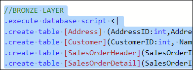
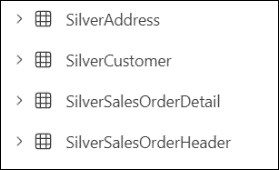
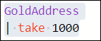
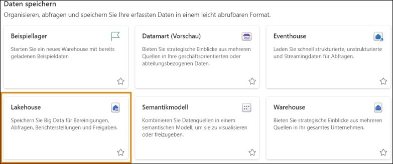

# Microsoft Fabric Real-Time Intelligence in a Day Übung 4
 
 

# Inhalt
- Dokumentstruktur
- Einführung
- Medallion-Framework in KQL-Datenbanken
    - Aufgabe 1: Bronze-Tabellen erstellen
    - Aufgabe 2: Bronze-Tabellen mithilfe einer Datenpipeline laden
    - Aufgabe 3: Tabellen auf der Silber-Ebene transformieren
    - Aufgabe 4: Eine Gold-Ebene mit materialisierten Ansichten erstellen
- Fabric Lakehouse- und OneLake-Verfügbarkeit
    - Aufgabe 5: Lakehouse erstellen
    - Aufgabe 6: Mit KQL-Datenbanktabellen verknüpfen
- Zusammenfassung
- Referenzen

# Dokumentstruktur

Die Übung enthält die Schritte, die der Benutzer durchführen muss, sowie zugehörige Screenshots zur visuellen Unterstützung. Wichtige Abschnitte sind in den Screenshots mit einem orangefarbenen Kasten gekennzeichnet.

# Einführung

In dieser Übung erstellen Sie ein Medallion-Framework mithilfe des Bronze-, Silber- und Gold- Ebenenansatzes zur Handhabung von Daten in ihren verschiedenen Entwicklungsstadien und zur Verwendung in Analysen. Anschließend verbinden Sie die Daten aus Ihrer KQL-Datenbank mit einem Lakehouse, um zu demonstrieren, wie schnell Sie Ihre Echtzeitdaten mit denjenigen in Ihrer Organisation teilen können, die sie für Power BI-Berichte verwenden möchten.

Am Ende dieser Übung haben Sie Folgendes gelernt:

- KQL-Datenbanktabellen mit der Kusto-Abfragesprache erstellen
- Daten in KQL-Datenbanken mit Data Factory-Pipelines laden
- Materialisierte Ansichten in KQL-Datenbanken erstellen
- Ein Lakehouse erstellen und Verknüpfungen zur KQL-Datenbank verwenden

# Medallion-Framework in KQL-Datenbanken

## Aufgabe 1: Bronze-Tabellen erstellen

1. Öffnen Sie den **Fabric-Arbeitsbereich** für den Kurs und den (Create Tables), den Sie in der letzten Übung erstellt haben.

    

2. Wir benennen die ursprüngliche Registerkarte in diesem KQL-Abfragesatz von „eh_Fabrikam“ in
„Cerate External Tables“ um, damit wir diesen Abfragesatz leichter organisieren und verstehen können.

    

3. Wir erstellen nun eine neue Registerkarte. Dazu wählen wir das „+“-Symbol aus und nennen die neue Registerkarte „Bronze Layer“.

    

4. Fügen Sie in dieser neuen Registerkarte den folgenden Code ein, heben Sie ihn hervor und wählen Sie „Ausführen“ aus, um vier neue Tabellen zu erstellen, die als Ihre Bronze-Ebene des Medallion- Frameworks dienen.

     ```

    //BRONZE LAYER

    .execute database script <|

    .create table [Address] (AddressID:int,AddressLine1:string,AddressLine2:string,City: string, StateProvince:string, CountryRegion:string, PostalCode: string, rowguid: guid, ModifiedDate:datetime)

    .create table [Customer](CustomerID:int, NameStyle: string, Title: string, FirstName: string, MiddleName: string, LastName: string,Suffix:string, CompanyName: string, SalesPerson: string, EmailAddress: string, Phone: string, ModifiedDate: datetime)

    .create table [SalesOrderHeader](SalesOrderID: int, OrderDate: datetime, DueDate: datetime, ShipDate: datetime, ShipToAddressID: int, BillToAddressID: int, SubTotal: decimal, TaxAmt: decimal, Freight: decimal, TotalDue: decimal, ModifiedDate: datetime)

    .create table [SalesOrderDetail](SalesOrderID: int, SalesOrderDetailID: int, OrderQty: int, ProductID: int, UnitPrice: decimal , UnitPriceDiscount: decimal,LineTotal: decimal, ModifiedDate: datetime)

    ```

    
 
5. Sobald dies ausgeführt wird, sollten Sie sofort vier neue Tabellen in Ihrem Datenbankobjekt- Explorer sehen.
    - Address
    - Customer
    - SalesOrderDetail
    - SalesOrderHeader

        

6. Erweitern Sie die **Adresstabelle** durch Klicken auf das Symbol „>“ neben dem Namen.

    

7. Hier wird Ihnen das Schema (Spaltennamen und Datentypen) für die Tabelle angezeigt. Es wäre hilfreich, dieser Tabelle in der KQL-Datenbank eine ausgeblendete Spalte für die Erfassungszeit hinzuzufügen, die später in der Medallion-Architektur verwendet wird. Fügen wir diese Zeile nun hinzu. Kopieren Sie das folgende Skript und fügen Sie es ein, um die soeben erstellten Tabellen durch Hinzufügen einer Spalte für die Erfassungszeit zu ändern.

   ```
    //adds a hidden field showing ingestion time
    
    .execute database script <|
    
    .alter table Address policy ingestiontime true
    
    .alter table Customer policy ingestiontime true
    
    .alter table SalesOrderHeader policy ingestiontime true
    
    .alter table SalesOrderDetail policy ingestiontime true

    ```

    

8. Die vier neuen Tabellen sind leere Tabellen mit definiertem Schema. Jetzt benötigen Sie eine Möglichkeit, diese Tabellen ordnungsgemäß zu laden. Navigieren Sie zurück zu Ihrem Arbeitsbereich **RTI_username**.

## Aufgabe 2: Bronze-Tabellen mithilfe einer Datenpipeline laden

1. Wählen Sie im Arbeitsbereich die Option **„+ Neues Element“** aus, um den Auswahlbereich zu öffnen. Wählen Sie dann die Option **Data pipeline** aus.

   
 
2. Geben Sie der neuen Pipeline den Namen **Load KQL Database Bronze Layer**.

    

3. Klicken Sie auf **Erstellen**.

4. Wenn das Pipeline-Menü angezeigt wird, klicken Sie auf die Option **„Assistent für Daten kopieren“**.

   
    

5. Zunächst müssen Sie eine Verbindung zur Quelldatenbank herstellen, aus der Sie die Daten extrahieren möchten. Klicken Sie unter „Neue Quellen“ auf die Option **Azure SQL-Datenbank**. Wenn sie Ihnen nicht sofort angezeigt wird, können Sie die Suchleiste oben verwenden, um Quellen zu filtern. Wir stellen eine Verbindung mit derselben externen Azure SQL-Datenbank wie in der vorherigen Übung her, verbinden uns dabei aber mit unterschiedlichen Tabellen.

   

6. Sie müssen die Verbindungsdetails der Datenbank eingeben. Befolgen Sie die Anweisungen in Ihrer Umgebung oder wie unten beschrieben.
    - fabrikamdemo.database.windows.net
    - fabrikamdb
    - demouser
    - fabrikam@123456
 
7. Klicken Sie auf **Weiter**, wenn alles ausgefüllt ist.

8. Wählen Sie aus der Liste der verfügbaren Tabellen Folgende aus:
    - SalesLT.Address
    - SalesLT.Customer
    - SalesLT.SalesOrderDetail
    - SalesLT.SalesOrderHeader

        

9. Klicken Sie auf **Weiter**.

10.	Sie müssen jetzt Ihr Ziel einrichten, um festzulegen, wohin die Pipeline die Daten senden soll. Suchen Sie den **OneLake-Datenhub**, und wählen Sie dann Ihre KQL-Datenbank **eh_Fabrikam** aus.

    

11.	Wenn Sie zur Anmeldung aufgefordert werden, verwenden Sie einfach die Anmeldeinformationen, die auf der Seite mit den Umgebungsdetails angegeben sind.

12.	Klicken Sie auf die Tabelle **SalesLT.Address**, falls sie nicht bereits ausgewählt ist, und klicken Sie dann auf das Dropdownmenü neben der Option **Tabelle**. Klicken Sie auf die Tabellenoption **Address**.

    

13.	Sie sehen nun eine Übersicht über die **Spaltenzuordnungen**. Auf diese Weise können Sie alle Felder aus der Quelldatenbank visualisieren, die Sie an Ihre KQL-Datenbank senden. Sie haben die Möglichkeit, bestimmte Felder zu entfernen, wenn Sie nicht möchten, dass sie aus der Quelle übernommen werden.

    

14.	Befolgen Sie dieselben Schritte wie in Schritt 11–12 für die Tabellen **SalesLT.Customer**, **SaleLT.SalesOrderDetail** und **SalesLT.SalesOrderHeader**. Es müssen keine Spaltenzuordnungen durchgeführt werden, ordnen Sie einfach die Tabellennamen zu. Wenn alle Tabellen entsprechend zugeordnet wurden, klicken Sie auf **Weiter**.

15.	Die letzte Seite mit dem Assistenten „Daten kopieren“ ist eine Übersichtsseite zum Überprüfen aller von Ihnen ausgewählten Einstellungen. Stellen Sie sicher, dass die Quell- und
Zieltabellenanzahl identisch ist.

    
 
16.	Klicken Sie auf **Speichern und ausführen**.

17.	Nach einigen Momenten wird ein Flyout-Fenster angezeigt, das einen **Parameter** enthält. Der soeben abgeschlossene Assistent „Daten kopieren“ hat eine Liste der Tabellen erstellt, die durchlaufen und in die KQL-Tabellen geladen werden sollen. Klicken Sie einfach auf die Schaltfläche **OK**, um die Pipeline in ihrer aktuellen Konfiguration aus dem Assistenten
„Daten kopieren“ auszuführen.

    

18.	Lassen Sie die Pipelineausführung weiter laufen und nach etwa einer Minute sollte die Datenverschiebung abgeschlossen sein. Sobald Sie sehen, dass alle Aktivitäten innerhalb der Pipeline **Erfolgreich** waren, haben Sie die Daten übertragen.

    
 
19.	Lassen Sie uns eine unserer Tabellen überprüfen und die Daten verifizieren. Navigieren Sie zu dem von uns verwendeten KQL-Abfragesatz **Tabellen erstellen** zurück, stellen Sie sicher, dass Sie sich auf der Registerkarte **Bronze Layer** befinden, und führen Sie das folgende Skript aus:

    //Query the Bronze layer Customer table 

    Customer

    | take 100

    

20.	Sie sollten einige Daten wie im Bild unten sehen, aber sie sind möglicherweise nicht genau.

    

## Aufgabe 3: Tabellen auf der Silber-Ebene transformieren

1. Nachdem die Bronze-Tabellen geladen sind, erstellen wir in unserem KQL-Abfragesatz eine neue Registerkarte mit dem Namen „Silver Layer“.

   

2. Führen Sie das folgende KQL-Skript in der Registerkarte „Silver Layer“ aus, um vier neue Tabellen zu erstellen, die als Ihre „Silver Layer“ des Medallion-Frameworks dienen.
 
    ```
    //SILVER LAYER

    .execute database script <|

    .create table [SilverAddress] (AddressID:int,AddressLine1:string,AddressLine2:string,City: string, StateProvince:string, CountryRegion:string, PostalCode: string, rowguid: guid, ModifiedDate:datetime, IngestionDate: datetime)

    .create table [SilverCustomer](CustomerID:int, NameStyle: string, Title: string, FirstName: string, MiddleName: string, LastName: string,Suffix:string, CompanyName: string, SalesPerson: string, EmailAddress: string, Phone: string, ModifiedDate: datetime, IngestionDate: datetime)

    .create table [SilverSalesOrderHeader](SalesOrderID: int, OrderDate: datetime, DueDate: datetime, ShipDate: datetime, ShipToAddressID: int, BillToAddressID: int, SubTotal: decimal, TaxAmt: decimal, Freight: decimal, TotalDue: decimal, ModifiedDate: datetime, DaysShipped: long, IngestionDate: datetime)

    .create table [SilverSalesOrderDetail](SalesOrderID: int, SalesOrderDetailID: int, OrderQty: int, ProductID: int, UnitPrice: decimal, UnitPriceDiscount: decimal,LineTotal: decimal, ModifiedDate: datetime, IngestionDate: datetime)
    
    ```

3. Führen Sie das Skript aus, indem Sie das neue Skript markieren und auf **Ausführen** klicken.

    

4. Sobald das Skript ausgeführt wird, werden Ihnen vier neue Tabellen angezeigt, die zum Tabellenmenü der KQL-Datenbank hinzugefügt wurden.

    
 
5. Nachdem die Tabellen erstellt wurden, müssen Sie Daten in die Tabellen laden. Sie erstellen eine Aktualisierungsrichtlinie, um die Daten zu transformieren und zu verschieben, wenn sie auf der Bronze-Ebene erfasst werden. Kopieren Sie das folgende Skript, fügen Sie es ein und **führen Sie** dann den Code aus.

    ```
 
    // use update policies to transform data during Ingestion

    .execute database script <|

    .create function ifnotexists with (docstring = 'Add ingestion time to raw data') ParseAddress (){ Address

    | extend IngestionDate = ingestion_time()

    }

    .alter table SilverAddress policy update @'[{"Source": "Address", "Query": "ParseAddress", "IsEnabled" : true, "IsTransactional": true }]'

    .create function ifnotexists with (docstring = 'Add ingestion time to raw data') ParseCustomer (){ Customer

    | extend IngestionDate = ingestion_time()

    }

    .alter table SilverCustomer policy update @'[{"Source": "Customer", "Query": "ParseCustomer", "IsEnabled" : true, "IsTransactional": true }]'

    .create function ifnotexists with (docstring = 'Add ingestion time to raw data') ParseSalesOrderHeader (){ SalesOrderHeader

    | extend DaysShipped = datetime_diff('day', ShipDate, OrderDate)

    | extend IngestionDate = ingestion_time()

    }

    .alter table SilverSalesOrderHeader policy update @'[{"Source": "SalesOrderHeader", "Query": "ParseSalesOrderHeader", "IsEnabled" : true, "IsTransactional": true }]'

    .create function ifnotexists with (docstring = 'Add ingestion time to raw data') ParseSalesOrderDetail () { SalesOrderDetail

    | extend IngestionDate = ingestion_time()

    }

    .alter table SilverSalesOrderDetail policy update @'[{"Source": "SalesOrderDetail", "Query": "ParseSalesOrderDetail", "IsEnabled" : true, "IsTransactional": true }]'

    ```


6. Obwohl Sie Ergebnisse der Abfrageausführung sehen, ist der beste Beweis dafür, dass Ihre Abfrage abgeschlossen wurde, die Anzeige eines neuen erweiterbaren Ordners in Ihrem Datenbankobjektbereich. Klicken Sie auf das **>-Symbol** neben dem **Ordner „Functions“**. Diese Funktionen ermöglichen es, die in die Bronze-Ebene der KQL-Datenbank geladenen Daten anschließend zu spiegeln, zu transformieren und in die Silber-Ebene zu laden.
 
    

7. Lassen Sie uns diesen Prozess nun simulieren. Sie führen die Pipeline, die Sie zuvor in dieser Übung erstellt haben, erneut aus. Navigieren Sie jetzt zurück zur Pipeline **Load KQL Database**.
 
     
 
8. Klicken Sie einfach auf die Schaltfläche **Ausführen** im **Menüband „Startseite“**, um die Pipeline erneut auszuführen und die Daten in die Bronze-Ebene zu laden. Dort werden sie dann von den von Ihnen erstellten und in die Silber-Tabellen geladenen Funktionen transformiert.

    

9. Klicken Sie auf **OK** in diesem Flyout, um die Pipeline mit denselben Parametern wie zuvor auszuführen.

    
 
10.	Warten Sie erneut etwa eine Minute, bis die Pipeline ihren Ladevorgang abgeschlossen hat, und fahren Sie mit dem nächsten Schritt fort, wenn alle Elemente in Ihrem Ausgabemenü **Erfolgreich** anzeigen.

    

11.	Sobald die Datenpipeline abgeschlossen ist, validieren Sie die Ergebnisse in der KQL-Datenbank. Kehren Sie zum KQL-Abfragesatz **Tabellen erstellen** zurück und navigieren Sie zur Registerkarte **Silver Layer**.
 
12.	Fragen Sie in einer neuen Zeile die SilverAddress-Tabelle ab, indem Sie die folgende Abfrage schreiben und den Code ausführen.

    SilverAddress

    | take 100

    

13.	Beachten Sie in Ihren Ergebnissen, dass Ihre **SilverAddress**-Tabelle die zusätzliche Spalte **IngestionDate** aufweist, die nicht physisch in der Tabelle **Address** vorhanden ist.

    

## Aufgabe 4: Eine Gold-Ebene mit materialisierten Ansichten erstellen

Jetzt, da Sie Ihre transformierte Ebene an Daten innerhalb der Silber-Ebene haben, können Sie beginnen, Analysen mit vertrauenswürdigen, validierten und angereicherten Daten in einem Power BI-Bericht,RTI-Datensatz oder einfach durch das Erstellen einiger KQL-Abfragen auszuführen. Es kann jedoch vorkommen, dass Sie es für notwendig erachten, Ihre Daten zu aggregieren, um sie für Endbenutzer besser nutzbar zu machen. Sehen wir uns an, wie dies in einer KQL-Datenbank erreicht wird.

1. Falls dies noch nicht geschehen ist, öffnen Sie Ihren KQL-Abfragesatz **Create Tables**, und erstellen Sie eine neue Registerkarte mit dem Namen „Gold Layer“.


   

2. Fügen Sie zum Erstellen einer materialisierten Ansicht den folgenden Code in den Abfragesatz ein.

   ```
    //GOLD LAYER

    // use materialized views to view the latest changes in the SilverAddress table

    .create materialized-view with (backfill=true) GoldAddress on table SilverAddress

    {

    SilverAddress

    | summarize arg_max(IngestionDate, *) by AddressID

    }

   ```
 
3. Sobald der Code eingefügt wurde, markieren Sie den Code und führen Sie ihn aus, indem Sie auf die Schaltfläche **Run** klicken.

   

4. In Ihren Abfrageergebnissen wird eine Ausgabe mit detaillierten Informationen zur Erstellung dieser materialisierten Sicht angezeigt.

   
 
5. Sie werden auch sehen, dass im Objekt-Explorer der KQL-Datenbank ein weiterer Ordner erstellt wurde. Erweitern Sie den Ordner **Materiallized View**, und Sie werden dort Ihre Ansicht **GoldAddress** finden.

    

6. Führen Sie in Ihrem Abfragefenster den folgenden Code aus, um die neue materialisierte Sicht abzufragen.

    GoldAddress

    | take 1000

    

7. Diese Abfrage gibt die Zeile mit dem neuesten **IngestionDate** für jede einzigartige **AddressID** in der Tabelle **SilverAddress** zurück.

8. Fügen Sie nun die folgenden Abfragen ein und führen Sie sie aus, um weitere materialisierte Gold-Ebene-Ansichten für die anderen Tabellen zu erstellen.
 
    ``` 
    //Create additional Gold Materialized Views
    .execute database script <|

    .create materialized-view with (backfill=true) GoldCustomer on table SilverCustomer
    
    {
    
    SilverCustomer
    
    | summarize arg_max(IngestionDate, *) by CustomerID
    
    }

    .create materialized-view with (backfill=true) GoldSalesOrderHeader on table SilverSalesOrderHeader
    
    {
    
    SilverSalesOrderHeader
    
    | summarize arg_max(IngestionDate, *) by SalesOrderID
    
    }

    .create materialized-view with (backfill=true) GoldSalesOrderDetail on table SilverSalesOrderDetail
    
    {
    
    SilverSalesOrderDetail
    
    | summarize arg_max(IngestionDate, *) by SalesOrderDetailID
    
    }

    .create async materialized-view with (backfill=true) GoldDailyClicks on table 
    
    Clicks
    
    {
    
    Clicks
    
    | extend dateOnly = substring(tostring(todatetime(eventDate)), 0, 10)
    
    | summarize count() by dateOnly
    
    }

    .create async materialized-view with (backfill=true) GoldDailyImpressions on table Impressions
    
    {
    
    Impressions
    
    | extend dateOnly = substring(tostring
    (todatetime(eventDate)), 0, 10)
    
    | summarize count() by dateOnly
    
    }

    ```

9. Sie sollten jetzt sechs materialisierte Ansichten in Ihrer KQL-Datenbank haben.

   

10.	Sie haben jetzt erfolgreich ein Medallion-Framework innerhalb einer KQL-Datenbank erstellt. Obwohl diese Daten problemlos nutzbar sind, gibt es unter Ihnen sicherlich Benutzer, die noch nie mit Kusto gearbeitet haben und daher lieber auf anderem Wege auf die Daten aus diesen Tabellen zugreifen möchten. In der nächsten Aufgabe erstellen Sie ein Lakehouse. Machen Sie dann mithilfe der OneLake-Verfügbarkeitsfunktion, die wir in Übung 01 aktiviert haben, einige der Tabellen in unserer KQL-Datenbank über Lakehouse mithilfe von Verknüpfungen zugänglich.
 
# Fabric Lakehouse- und OneLake-Verfügbarkeit
## Aufgabe 5: Lakehouse erstellen
1. Kehren Sie zum Arbeitsbereich **RTI_username** zurück.
2. Klicken Sie auf die Option **+ Neues Element**, und wählen Sie dann **Lakehouse** aus der Liste der verfügbaren Optionen aus.

   

3. Geben Sie dem Lakehouse den Namen **lh_Fabrikam**, und klicken Sie dann auf **Erstellen**. Aktivieren Sie nicht die Vorschaufunktion des Lakehouse-Schemas.

   

## Aufgabe 6: Mit KQL-Datenbanktabellen verknüpfen
Innerhalb der Lakehouse-Benutzeroberfläche haben Sie einige Optionen, wie Sie Streaming- Daten in Lakehouse selbst einbringen können. Eine zuvor im Kurs erwähnte Option ist die
Verwendung eines Eventstreams, um Daten direkt vom Event Hub statt aus der KQL-Datenbank in Lakehouse zu laden. Da Sie bereits entschieden haben, dass KQL-Datenbanken zum Erreichen bestimmter Ziele und Anforderungen verwendet werden sollen, möchten Sie diese Daten nicht erneut kopieren. Verwenden wir stattdessen eine **Verknüpfung**, um die Daten aus der KQL-
Datenbank zugänglich zu machen, über die wir bereits verfügen. So können Benutzer, die mit dieser Erfahrung vertrauter sind, auf die Daten zugreifen können, die wir in der KQL-Datenbank verwendet haben.

1. Wählen Sie im Menü die Option **Neue Verknüpfung** aus.

    
 
2. Wählen Sie die Option **Microsoft OneLake** unter **Interne Quellen** aus.

    

3. Wählen Sie im Menü die KQL-Datenbank **eh_Fabrikam** aus, um Tabellen aus diesem Speicher in das Lakehouse zu übertragen, ohne die Daten zu duplizieren oder zu kopieren.

    
 
4. Klicken Sie unten im Menü auf **Weiter**.

5. Öffnen Sie die Tabellen innerhalb von **eh_Fabrikam** durch Klicken auf das **>-Symbol**, und wählen Sie dann zum Übertragen die folgenden Tabellen aus.

    - Clicks
    - Impressions
    - InternetSales

    

6. Diese Tabellen könnten für alle Benutzer sehr nützlich sein, die Notebooks innerhalb von Fabric nutzen. Diese Daten könnten in Datenwissenschaftsexperimenten verwendet werden, um ein Modell zu trainieren, das vorhersagt, an welchen Links Benutzer wahrscheinlich interessiert sein könnten.

7. Klicken Sie auf **Weiter**.
 
8. Ein letzter Validierungsbildschirm wird angezeigt. Sobald Sie mit Ihrer Auswahl zufrieden sind, klicken Sie auf die Schaltfläche **Erstellen** unten im Bildschirm.

   
 
9. Sie sehen jetzt alle Tabellen, die Sie aus der KQL-Datenbank ausgewählt haben, innerhalb von Lakehouse.

    

10.	Klicken Sie auf die Tabelle mit dem Namen **Clicks**.

    
 
11.	Sie können eine Auswahl der Datensätze aus dieser Tabelle sehen, die in Ihrer Benutzeroberfläche angezeigt wurden.
Hinweis: Es kann einige Stunden dauern, bis die Daten in OneLake angezeigt werden 
(https://learn.microsoft.com/en-us/fabric/real-time-intelligence/event-house-onelake-availability).


# Zusammenfassung

In dieser Übung haben Benutzer ein Medallion-Framework innerhalb einer Datenbank der Kusto- Abfragesprache (KQL) erstellt. Benutzer haben Rohdaten mithilfe einer Datenpipeline in der Bronze- Ebene der Medallion-Architektur erfasst. Sie haben diese Daten transformiert und zur weiteren
Verarbeitung und Optimierung in die Silber-Ebene geladen. Abschließend haben Benutzer die Daten mithilfe von materialisierten Ansichten für die Analyse in der Gold-Ebene aggregiert und optimiert.

Nach dem Erstellen des Medallion-Frameworks haben die Benutzer Microsoft Fabric- Tastenkombinationen verwendet, um die Daten aus der KQL-Datenbank mit einem Lakehouse zu verknüpfen. Diese Integration ermöglichte einen nahtlosen Zugriff und eine Analyse der Daten in beiden Umgebungen. Zum Abschluss der Übung haben die Benutzer die Datenverknüpfung überprüft und grundlegende Abfragen durchgeführt, um die Funktionalität des Frameworks sicherzustellen.

# Referenzen

Bei Fabric Real-time Intelligence in a Day (RTIIAD) lernen Sie einige der wichtigsten Funktionen von Microsoft Fabric kennen. Im Menü des Dienstes finden Sie in der Hilfe (?) Links zu praktischen Informationen.


	 	
Nachfolgend finden Sie weitere Angebote zur weiteren Arbeit mit Microsoft Fabric.

- Die vollständige Ankündigung der [Microsoft Fabric allgemeinen Verfügbarkeit finden Sie im Blogbeitrag](https://aka.ms/Fabric-Hero-Blog-Ignite23).
- Fabric bei einer [interaktiven Vorstellung](https://aka.ms/Fabric-GuidedTour) kennenlernen
- Zur kostenlosen Testversion von [Microsoft Fabric anmelden](https://aka.ms/try-fabric)
- Besuchen Sie die [Microsoft Fabric-Website](https://aka.ms/microsoft-fabric)
- Mit den Modulen von [Fabric Learning](https://aka.ms/learn-fabric) neue Qualifikationen erwerben
- [Technische Dokumentation zu Fabric](https://aka.ms/fabric-docs) erkunden
- [Kostenloses E--Book zum Einstieg in Fabric lesen](https://aka.ms/fabric-get-started-ebook)
- Mitglied der [Fabric-Community](https://aka.ms/fabric-community) werden, um Fragen zu stellen, Feedback zu geben und sich mit anderen auszutauschen
 
Lesen Sie die detaillierteren Blogs zur Ankündigung der Fabric-Umgebung:
- [Blog zum Data Factory-Funktionsbereich in Fabric](https://aka.ms/Fabric-Data-Factory-Blog)
- [Blog zum Synapse Data Engineering-Funktionsbereich in Fabric](https://aka.ms/Fabric-DE-Blog)
- [Blog zum Synapse Data Science-Funktionsbereich in Fabric](https://aka.ms/Fabric-DS-Blog)
- [Blog zum Synapse Data Warehousing-Funktionsbereich in Fabric](https://aka.ms/Fabric-DW-Blog)
- [Real-Time Intelligence-Erfahrung im Fabric-Blog](https://blog.fabric.microsoft.com/en-us/blog/category/real-time-intelligence)
- [Power BI-Ankündigung im Blog](https://aka.ms/Fabric-PBI-Blog)
- [Blog zum Data Activator-Funktionsbereich in Fabric](https://aka.ms/Fabric-DA-Blog)
- [Blog zu Verwaltung und Governance in Fabric](https://aka.ms/Fabric-Admin-Gov-Blog)
- [Blog zu OneLake in Fabric](https://aka.ms/Fabric-OneLake-Blog)
- [Blog zur Dataverse- und Microsof t Fabric-Integration](https://aka.ms/Dataverse-Fabric-Blog)


© 2024 Microsoft Corporation. Alle Rechte vorbehalten.

Durch die Verwendung der vorliegenden Demo/Übung stimmen Sie den folgenden Bedingungen zu:

Die in dieser Demo/Übung beschriebene Technologie/Funktionalität wird von der Microsoft Corporation bereitgestellt, um Feedback von Ihnen zu erhalten und Ihnen Wissen zu vermitteln. Sie dürfen die Demo/Übung nur verwenden, um derartige Technologiefeatures und Funktionen zu bewerten und Microsoft Feedback zu geben. Es ist Ihnen nicht erlaubt, sie für andere Zwecke zu verwenden. Es ist Ihnen nicht gestattet, diese Demo/Übung oder einen Teil derselben zu ändern, zu kopieren, zu verbreiten, zu übertragen, anzuzeigen, auszuführen, zu vervielfältigen, zu veröffentlichen, zu lizenzieren, zu transferieren oder zu verkaufen oder aus ihr abgeleitete Werke zu erstellen.

DAS KOPIEREN ODER VERVIELFÄLTIGEN DER DEMO/ÜBUNG (ODER EINES TEILS DERSELBEN) AUF EINEN/EINEM ANDEREN SERVER ODER SPEICHERORT FÜR DIE WEITERE VERVIELFÄLTIGUNG ODER VERBREITUNG IST AUSDRÜCKLICH UNTERSAGT.
DIESE DEMO/ÜBUNG BIETET BESTIMMTE SOFTWARETECHNOLOGIE/PRODUKTFUNKTIONEN UND FUNKTIONALITÄT, EINSCHLIESSLICH MÖGLICHER NEUER FUNKTIONEN UND KONZEPTE, IN EINER SIMULIERTEN UMGEBUNG OHNE KOMPLEXE EINRICHTUNG ODER INSTALLATION FÜR DEN BESCHRIEBENEN ZWECK OBEN. DIE IN DIESER DEMO/ÜBUNG DARGESTELLTEN
TECHNOLOGIEN/KONZEPTE STELLEN MÖGLICHERWEISE NICHT DIE VOLLSTÄNDIGE FUNKTIONALITÄT DER FUNKTION DAR UND FUNKTIONIEREN MÖGLICHERWEISE NICHT SO, WIE EINE ENDGÜLTIGE VERSION FUNKTIONIEREN KÖNNTE. UNTER UMSTÄNDEN VERÖFFENTLICHEN WIR AUCH KEINE ENDGÜLTIGE VERSION DERARTIGER FEATURES ODER KONZEPTE. IHRE 
ERFAHRUNG BEI DER VERWENDUNG DERARTIGER FEATURES UND FUNKTIONEN IN EINER PHYSISCHEN UMGEBUNG KANN FERNER ABWEICHEND SEIN.

**FEEDBACK.** Wenn Sie Feedback zu den Technologiefeatures, Funktionen und/oder Konzepten geben, die in dieser Demo/Übung beschrieben werden, gewähren Sie Microsoft das Recht, Ihr Feedback in jeglicher Weise und für jeglichen Zweck kostenlos zu verwenden, zu veröffentlichen und gewerblich zu nutzen. Außerdem treten Sie Dritten kostenlos sämtliche Patentrechte ab, die erforderlich sind, damit deren Produkte, Technologien und Dienste bestimmte Teile einer Software oder eines Dienstes von Microsoft, welche/welcher das Feedback enthält, verwenden oder eine Verbindung zu dieser/diesem herstellen können. Sie geben kein Feedback, das einem Lizenzvertrag unterliegt, aufgrund dessen Microsoft Drittparteien eine Lizenz für seine Software oder Dokumentation gewähren muss, weil wir Ihr Feedback in diese aufnehmen. Diese Rechte bestehen nach Ablauf dieser Vereinbarung fort.

DIE MICROSOFT CORPORATION LEHNT HIERMIT JEGLICHE GEWÄHRLEISTUNGEN UND
GARANTIEN IN BEZUG AUF DIE DEMO/ÜBUNG AB, EINSCHLIESSLICH ALLER AUSDRÜCKLICHEN, KONKLUDENTEN ODER GESETZLICHEN GEWÄHRLEISTUNGEN UND GARANTIEN DER HANDELSÜBLICHKEIT, DER EIGNUNG FÜR EINEN BESTIMMTEN ZWECK, DES RECHTSANSPRUCHS UND DER NICHTVERLETZUNG VON RECHTEN DRITTER. MICROSOFT MACHT KEINERLEI
ZUSICHERUNGEN BZW. ERHEBT KEINERLEI ANSPRÜCHE IM HINBLICK AUF DIE RICHTIGKEIT DER ERGEBNISSE UND DES AUS DER VERWENDUNG DER DEMO/ÜBUNG RESULTIERENDEN ARBEITSERGEBNISSES BZW. BEZÜGLICH DER EIGNUNG DER IN DER DEMO/ÜBUNG ENTHALTENEN INFORMATIONEN FÜR EINEN BESTIMMTEN ZWECK.

**HAFTUNGSAUSSCHLUSS**

Diese Demo/Übung enthält nur einen Teil der neuen Features und Verbesserungen in Microsoft Power BI. Einige Features können sich unter Umständen in zukünftigen Versionen des Produkts ändern. In dieser Demo/Übung erhalten Sie Informationen über einige, aber nicht über alle neuen Features.

