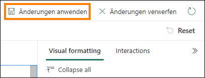
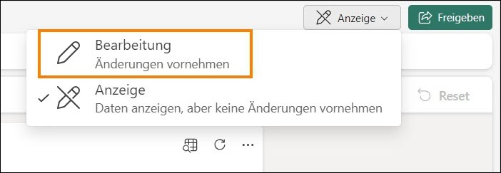
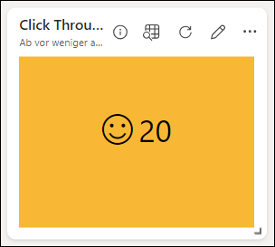

# Microsoft Fabric
## Real-Time Intelligence in a Day Übung 5
 
# Inhalt
- Dokumentstruktur
- Einführung
- Echtzeit-Dashboards
    - Aufgabe 1: Ein Echtzeit-Dashboard erstellen
    - Aufgabe 2: Eine Datenquelle für ein Echtzeit-Dashboard verbinden
    - Aufgabe 3: Eine Echtzeit-Dashboard-Kachel mit KQL erstellen
    - Aufgabe 4: Weitere Dashboard-Kacheln zum Echtzeit-Dashboard hinzufügen
    - Aufgabe 5: Kartenvisualisierung für Impressionen nach Standort hinzufügen
    - Aufgabe 6: Automatische Aktualisierung auf dem Echtzeit-Dashboard einrichten
    - Optionale Aufgabe 7: Firmenlogo hinzufügen
    - Optionale Aufgabe 8: Bedingte Formatierung auf das Visual anwenden
- Zusammenfassung
- Referenzen

 
# Dokumentstruktur
Die Übung enthält die Schritte, die der Benutzer durchführen muss, sowie zugehörige Screenshots zur visuellen Unterstützung Wichtige Abschnitte sind in den Screenshots mit einem orangefarbenen Kasten gekennzeichnet.

# Einführung
In dieser Übung verwenden Sie die Daten, die Sie gestreamt und in Ihre KQL-Datenbank geladen und mithilfe von Verknüpfungen umgehend mit einem Lakehouse verknüpft haben, um ein Echtzeit- Dashboard zum Visualisieren und Teilen Ihrer Erkenntnisse aus den Datenströmen, auf die Sie zugegriffen haben, zu erstellen.

Am Ende dieser Übung haben Sie Folgendes gelernt:

- Ein Echtzeit-Dashboard in Fabric erstellen
- KQL zum Schreiben von Abfragen verwenden, um Visualisierungen in einem Dashboard aufzufüllen
- Bedingte Formatierung zu Dashboard-Visuals hinzufügen

# Echtzeit-Dashboards

## Aufgabe 1: Ein Echtzeit-Dashboard erstellen

1. Öffnen Sie den **Fabric-Arbeitsbereich** für den Kurs.

    

2. Klicken Sie zum Erstellen eines neuen Elements auf die Schaltfläche **+ Neues Element**.

    
 
3. Sie sehen eine Kategorie für **Daten visualisieren**. Klicken Sie auf das Element mit der Bezeichnung **Echtzeitdashboard**.

    

4. Geben Sie Ihrem Echtzeitdashboard den Namen **RTI Dashboard**, und klicken Sie anschließend auf **Erstellen**.
   
   

5. Sie sollten sofort zu einer leeren Instanz eines Echtzeit-Dashboards weitergeleitet werden.
 
    

## Aufgabe 2: Eine Datenquelle für ein Echtzeit-Dashboard verbinden

1. Suchen Sie unter der Registerkarte „Startseite“ nach der Option **New data source**, und klicken Sie darauf.

   

2. Klicken Sie im Flyout-Fenster auf der rechten Seite des Bildschirms auf **Hinzufügen +**, und wählen Sie dann **OneLake data hub** aus.

   
 
3. Eine Liste der verfügbaren Quellen in Ihrem OneLake wird angezeigt. Es werden nur Quellen aus KQL-Datenbanken aufgelistet, sodass Ihnen eine Option zur Verfügung steht: **eh_Fabrikam** KQL-Datenbank. Wählen Sie diese Option aus.

   

4. Klicken Sie unten im Bildschirm auf **Connect**.

   

5. Jetzt können Sie die Datenquelle erstellen. Klicken Sie auf die Schaltfläche **Add** unten im Flyout- Bereich.

   

6. Sie sehen jetzt, dass dem Echtzeit-Dashboard eine Datenquelle hinzugefügt wurde. Von hier aus können Sie bei Bedarf weitere KQL-Datenbanken hinzufügen. Klicken Sie zunächst auf **Schließen** unten im Fenster.

    
 
## Aufgabe 3: Eine Echtzeit-Dashboard-Kachel mit KQL erstellen

1. Klicken Sie auf die leere Kachel im Dashboard, um die Kachel mit einem Bild zu füllen.

    

2. Standardmäßig stellen Sie eine Verbindung mit der KQL-Datenbank her, die Sie zuvor als Quelle erstellt haben. Von hier aus können Sie Ihre eigene KQL-Abfrage schreiben, um dieses Visual mit Daten zu füllen. Löschen Sie alle vorherigen Markdown-KQL, die standardmäßig vorhanden sind. Kopieren Sie die folgende Abfrage, und fügen Sie diese in das Abfragefenster ein.

    ```
    //Clicks by hour 

    Clicks

    | where eventDate between (_startTime.._endTime)

    | summarize date_count = count() by bin(eventDate, 1h)

    | render timechart

    | top 30 by date_count

    | sort by eventDate

    ```

3. Führen Sie die Abfrage aus, sobald Sie sie richtig konfiguriert haben, um die Ergebnisse anzuzeigen.

    
 
4. Beachten Sie, dass Ihre Ausgabe möglicherweise nur ein Ergebnis enthält. Dies liegt an dem **Zeitbereich**, der für diese Kachel standardmäßig eingestellt ist. Sie verfügen über einen Parameter, mit dem Sie den Zeitraum ändern können, aus dem Sie Daten zurückgeben. Mit eventDate between (_startTime.._endTime) können Sie diesen Parameter zu Ihrem Vorteil nutzen. Ändern Sie den Parameter **Zeitbereich** in **Letzte 3 Stunden**, und beobachten Sie, wie sich Ihre Ausgabe ändert.

    

5. Sie sollten jetzt in Ihrer Abfrageausgabe die Ergebnisse der Klicks der letzten 3 Stunden sehen.

    

6. Obwohl dieser Parameter geändert werden kann, möchten Sie ihn möglicherweise standardmäßig auf einen bestimmten Zeitraum festlegen, anstatt die Benutzer zu einer
Änderung zu zwingen. Klicken Sie über der Option „Zeitbereich“ auf die Option **@ Parameter**.

     
 
7. Klicken Sie auf das **Bleistiftsymbol** zum Bearbeiten des Parameters **Zeitbereich**.

    

8. Ändern Sie den **Standardwert** in **Letzte 24 Stunden**, um standardmäßig immer den letzten Tag anzuzeigen. Klicken Sie auf Fertig, wenn Sie **fertig** sind.

    

9. Schließen Sie dann den Bereich „Parameter“.
 
10.	Klicken Sie nun über den Abfrageergebnissen auf die Schaltfläche **+ Visuelles Element hinzufügen**.

    

11.	Auf der rechten Seite des Bildschirms wird ein neues Flyout angezeigt. Klicken Sie in das Textfeld unter der Option **Tile name**, um diesem Visual den Namen **Clicks by Hour** zu geben.

    
 
12.	Standardmäßig ist das Visual, das Sie zum Anzeigen der Ergebnisse dieser KQL-Abfrage verwenden, eine Tabelle. Dies ist möglicherweise nicht die beste Möglichkeit für jemanden, schnell zu erfassen und zu verstehen, was mit den Ergebnissen Ihrer Daten geschieht.Ändern Sie den Visual-Typ von einer Tabelle in ein **Flächendiagramm**.

    
 
13.	Mit dieser neu formatierten Darstellung können Sie die Höhen und Tiefen der Klicks auf Ihrer E-Commerce-Site besser verstehen, indem Sie den Datenstrom verwenden, den Sie zuvor in diesem Kurs erstellt haben.

    

14.	Um dieses Visual im Dashboard zu speichern, klicken Sie oben rechts auf dem Bildschirm auf die Schaltfläche **Änderungen anwenden**.

    
 
15.	Nachdem Sie dieses Visual im Dashboard platziert haben, werden möglicherweise nur die Ergebnisse der letzten Stunde anzeigt. Ändern Sie das Dashboard, um den **Zeitbereich** der **letzten 24 Stunden** anzuzeigen.

     
 
16.	Aktualisieren Sie das Visual und beachten Sie, dass sich die Ergebnisse leicht ändern, um die Daten widerzuspiegeln, die seit der letzten Ausführung der Abfrage eingegangen sind.

     

## Aufgabe 4: Weitere Dashboard-Kacheln zum Echtzeit-Dashboard hinzufügen

1. Klicken Sie im **menüband „Startseite“** im Echtzeit-Dashboard auf die Schaltfläche **New tile**.

    

2. Geben Sie im Abfragebereich die neue KQL-Abfrage ein.


    ```
    //Impressions by hour Impressions

    | where eventDate between (_startTime.._endTime)

    | summarize date_count = count() by bin(eventDate, 1h)

    | render timechart

    | top 30 by date_count

    | sort by eventDate

    ```


3. **Führen** Sie die Abfrage **aus**.

    

4. Klicken Sie auf die Schaltfläche **+ Visuelles Element hinzufügen**.

    
 
5. Bearbeiten Sie das Visual, um den **Tile name** in **Impressions by Hour** und den **Visual type** in **Area chart** zu ändern.

    

6. Wenden Sie die Änderungen auf das Visual an.

    

7. Fügen Sie eine weitere **„New tile“** hinzu.

    

8. Kopieren Sie die folgende Abfrage, und fügen Sie diese in den Abfragebereich ein. Beachten Sie, dass dies eine Abfrage mit mehreren Anweisungen ist, die mehrere let-Anweisungen und eine durch Semikolons kombinierte Abfrage verwendet.

    ```
    //Clicks, Impressions, CTR

    let imp = Impressions

    | where eventDate between (_startTime.._endTime)

    | extend dateOnly = substring(todatetime(eventDate).tostring(), 0, 10)

    | summarize imp_count = count() by dateOnly;


    let clck = Clicks

    | where eventDate between (_startTime.._endTime)

    | extend dateOnly = substring(todatetime(eventDate).tostring(), 0, 10)

    | summarize clck_count = count() by dateOnly;


    imp

    | join clck on $left.dateOnly == $right.dateOnly

    | project selected_date = dateOnly , impressions = imp_count , clicks = clck_count, CTR = clck_count * 100 / imp_count

    ```

9. **Führen** Sie die Abfrage **aus**, um die Ergebnisse anzuzeigen.

    
 
10.	Klicken Sie auf die Schaltfläche **Visuelles Element hinzufügen**.


11.	Wenn die Visual-Einstellungen angezeigt werden, ändern Sie die folgenden Einstellungen, um eine Anzahl von Impressionen zu erstellen.
    - **Tile name** – Impressions
    - **Visual type** – Stat
    - **Value column** – impressions (long)

        

12.	Wählen Sie **Änderungen anwenden** aus, wenn alle Einstellungen entsprechend konfiguriert sind.

     

13. Klicken Sie auf der neuen Kachel auf die Auslassungspunkte (…), und wählen Sie die Option **Kachel duplizieren** aus.

    

14. Klicken Sie auf das **Bleistiftsymbol** für die duplizierte Kachel, um die Konfigurationen zu bearbeiten.

    
 
15. Benennen Sie diese **„Tile name“** in **Clicks** um, und ändern Sie die **„Value column“** in **clicks (long)**.

    

16. Wenden Sie die Änderungen auf dieses Visual an.

17. Duplizieren Sie eine der neuen Kacheln noch einmal, um eine endgültige Statistikdarstellung zu erstellen.

    
 
18.	Bearbeiten Sie die neue Kachel, um den **„Tile name“** in **Click Through Rate** und die **„Value column“** in **CTR (long)** zu ändern.

    

19. Übernehmen Sie die Änderungen.

20. Wenn die Kacheln getrennt sind oder Sie sie neu anordnen möchten, können Sie den Mauszeiger über die Kachel bewegen, bis ein Handsymbol angezeigt wird, und das Bild per Drag & Drop an die gewünschte Stelle ziehen.

    

## Aufgabe 5: Kartenvisualisierung für Impressionen nach Standort hinzufügen

1. Fügen Sie dem Echtzeit-Dashboard eine **„New tile“** hinzu.

   

2. Kopieren Sie die folgende Abfrage, und fügen Sie diese in den Abfragebereich ein. Diese Abfrage extrahiert den Breiten- und Längengrad aus der IP-Adressspalte dieses Datenstroms, um einen Standort zu generieren, den Sie auf einer Karte darstellen können. Diese Abfrage kann etwas mehr Zeit in Anspruch nehmen als die vorherigen.
 
    ```
    //Impressions by location

    Impressions

    | where eventDate between (_startTime.._endTime)
    
    | join external_table('products') on $left.productId == $right.ProductID
    
    | project lon = toreal(geo_info_from_ip_address(ip_address).longitude), lat = toreal(geo_info_from_ip_address(ip_address).latitude), Name
    
    | render scatterchart with (kind = map) //, xcolumn=lon, ycolumns=lat)

    ```

3. Führen Sie die Abfrage aus, um zu überprüfen, ob sie richtig konfiguriert ist. Klicken Sie auf die Schaltfläche **+ Visuelles Element**.

    

4. Ändern Sie den **„Tile name“** in **Impressions by Location** und den **„Visual type“** in **Map**.

    

5. Stellen Sie im Bereich **Visual type** sicher, dass der Breiten- und Längengrad richtig ausgewählt ist.
Ändern Sie dazu die Option **Standort definieren durch in Breitengrad und Längengrad** und überprüfen Sie, ob die restlichen Felder mit dem Bild unten übereinstimmen.

    

6. Übernehmen Sie die Änderungen.

7. Klicken Sie auf den Ankerpunkt unten links im Karten-Visual im Dashboard, um das Visual zu vergrößern.

   
 
8. Alle Visuals lassen sich in der Größe verändern und können verschoben werden. Sie können es ganz nach Ihren Wünschen neu anordnen.

   

9. Speichern Sie Ihre Änderungen.

   

## Aufgabe 6: Automatische Aktualisierung auf dem Echtzeit-Dashboard einrichten

1. Klicken Sie auf das **Menüband „Verwalten“**, und wählen Sie dann die Option **Automatische Aktualisierung** aus.

   

2. Aktivieren Sie den Schalter, um **Automatische Aktualisierung** zu aktivieren.

   
 
3. Ändern Sie das **Mindestzeitintervall** in 30 Sekunden und die **Standardaktualisierungsrate**
in 1 Minute.

   

4. Klicken Sie unten im Fenster auf **Übernehmen**.

5. Klicken Sie in der oberen rechten Ecke Ihres Menüs auf die Schaltfläche **Bearbeitung**, und ändern Sie sie in **Anzeige**, um zu sehen, was Ihre Endbenutzer mit diesem Echtzeit-Dashboard erleben.

   

6. Wenn die Zeit es erlaubt und Sie daran interessiert sind, ein Firmenlogo abzurufen oder eine bedingte Formatierung auf Ihre Visuals anzuwenden, wie unten gezeigt, können Sie gerne
die optionalen Aufgaben unten durcharbeiten. Ansonsten ist die Übung abgeschlossen!

   

## Optionale Aufgabe 7: Firmenlogo hinzufügen

1. Wechseln Sie vom Modus **Anzeige** des Dashboards in den Modus **Bearbeitung**.

   

2. Klicken Sie auf die Schaltfläche im Menüband „Startseite“ mit dem Namen **New text tile**.

   

3. Kopieren Sie den folgenden Markdown-Code, und fügen Sie diesen in das Abfragefenster ein.


   

4. Übernehmen Sie die Änderungen.

5. Passen Sie die Größe der Kachel an und verschieben Sie sie, damit sie an eine Stelle in Ihrem Echtzeit-Dashboard passt.

   
 
6. Speichern Sie Ihre Änderungen.

   

## Optionale Aufgabe 8: Bedingte Formatierung auf das Visual anwenden

1. Klicken Sie auf das **Bleistiftsymbol** im Visual **Click Through Rate**.

   

2. Klicken Sie unten im Bereich für die Visual-Formatierung auf die Schaltfläche **+ Add rule** unter **Bedingte Formatierung**.

    

3. Klicken Sie auf das **Bleistiftsymbol**, um die Regel zur bedingten Formatierung zu bearbeiten.

    

4. Ändern Sie die Bedingungen der Regel, um auf die **Column** mit der Bezeichnung **CTR (long)** zu zeigen, und geben Sie als Regel für den Operator und den Value **> 10** ein.

    

5. Sie können die Formatierung nach Belieben ändern. Solange der CTR-Wert größer als 10 ist, wird er auf dem Bild angezeigt.

   
 
6. Klicken Sie im Bereich „Bedingte Formatierung“ auf die Schaltfläche **Speichern**.

   

7. Übernehmen Sie die Änderungen.

8. Speichern Sie Ihre Änderungen.

   
 
# Zusammenfassung

In dieser Übung haben Benutzer ein Echtzeit-Dashboard erstellt und es mit unserer KQL- Datenbank verbunden. Wir haben gesehen, dass wir die KQL-Sprache verwenden, um Abfragen zu kuratieren, und dann die Ergebnisse auf viele Arten visualisieren können, wobei jede Visualisierung ihre eigene Konfiguration hat. Außerdem haben wir gesehen, wie wir die im Dashboard verfügbaren Standardparameter ändern und dafür sorgen können, dass das Dashboard automatisch aktualisiert wird.

# Referenzen

Bei Fabric Real-time Intelligence in a Day (RTIIAD) lernen Sie einige der wichtigsten Funktionen von Microsoft Fabric kennen. Im Menü des Dienstes finden Sie in der Hilfe (?) Links zu praktischen Informationen.


Nachfolgend finden Sie weitere Angebote zur weiteren Arbeit mit Microsoft Fabric.
- Die vollständige Ankündigung der [Microsoft Fabric allgemeinen Verfügbarkeit finden Sie im Blogbeitrag](https://aka.ms/Fabric-Hero-Blog-Ignite23).
- Fabric bei einer [interaktiven Vorstellung](https://aka.ms/Fabric-GuidedTour) kennenlernen
- Zur kostenlosen Testversion von [Microsoft Fabric anmelden](https://aka.ms/try-fabric)
- Besuchen Sie die [Microsoft Fabric-Website](https://aka.ms/microsoft-fabric)
- Mit den Modulen von [Fabric Learning](https://aka.ms/learn-fabric) neue Qualifikationen erwerben
- [Technische Dokumentation zu Fabric](https://aka.ms/fabric-docs) erkunden
- [Kostenloses E--Book zum Einstieg in Fabric lesen](https://aka.ms/fabric-get-started-ebook)
- Mitglied der [Fabric-Community](https://aka.ms/fabric-community) werden, um Fragen zu stellen, Feedback zu geben und sich mit anderen auszutauschen
 
Lesen Sie die detaillierteren Blogs zur Ankündigung der Fabric-Umgebung:
- [Blog zum Data Factory-Funktionsbereich in Fabric](https://aka.ms/Fabric-Data-Factory-Blog)
- [Blog zum Synapse Data Engineering-Funktionsbereich in Fabric](https://aka.ms/Fabric-DE-Blog)
- [Blog zum Synapse Data Science-Funktionsbereich in Fabric](https://aka.ms/Fabric-DS-Blog)
- [Blog zum Synapse Data Warehousing-Funktionsbereich in Fabric](https://aka.ms/Fabric-DW-Blog)
- [Real-Time Intelligence-Erfahrung im Fabric-Blog](https://blog.fabric.microsoft.com/en-us/blog/category/real-time-intelligence)
- [Power BI-Ankündigung im Blog](https://aka.ms/Fabric-PBI-Blog)
- [Blog zum Data Activator-Funktionsbereich in Fabric](https://aka.ms/Fabric-DA-Blog)
- [Blog zu Verwaltung und Governance in Fabric](https://aka.ms/Fabric-Admin-Gov-Blog)
- [Blog zu OneLake in Fabric](https://aka.ms/Fabric-OneLake-Blog)
- [Blog zur Dataverse- und Microsof t Fabric-Integration](https://aka.ms/Dataverse-Fabric-Blog)


© 2024 Microsoft Corporation. Alle Rechte vorbehalten.

Durch die Verwendung der vorliegenden Demo/Übung stimmen Sie den folgenden Bedingungen zu:

Die in dieser Demo/Übung beschriebene Technologie/Funktionalität wird von der Microsoft Corporation bereitgestellt, um Feedback von Ihnen zu erhalten und Ihnen Wissen zu vermitteln. Sie dürfen die Demo/Übung nur verwenden, um derartige Technologiefeatures und Funktionen zu bewerten und Microsoft Feedback zu geben. Es ist Ihnen nicht erlaubt, sie für andere Zwecke zu verwenden. Es ist Ihnen nicht gestattet, diese Demo/Übung oder einen Teil derselben zu ändern, zu kopieren, zu verbreiten, zu übertragen, anzuzeigen, auszuführen, zu vervielfältigen, zu veröffentlichen, zu lizenzieren, zu transferieren oder zu verkaufen oder aus ihr abgeleitete Werke zu erstellen.

DAS KOPIEREN ODER VERVIELFÄLTIGEN DER DEMO/ÜBUNG (ODER EINES TEILS DERSELBEN) AUF EINEN/EINEM ANDEREN SERVER ODER SPEICHERORT FÜR DIE WEITERE VERVIELFÄLTIGUNG ODER VERBREITUNG IST AUSDRÜCKLICH UNTERSAGT.

DIESE DEMO/ÜBUNG BIETET BESTIMMTE SOFTWARETECHNOLOGIE/PRODUKTFUNKTIONEN UND FUNKTIONALITÄT, EINSCHLIESSLICH MÖGLICHER NEUER FUNKTIONEN UND KONZEPTE, IN EINER SIMULIERTEN UMGEBUNG OHNE KOMPLEXE EINRICHTUNG ODER INSTALLATION FÜR DEN BESCHRIEBENEN ZWECK OBEN. DIE IN DIESER DEMO/ÜBUNG DARGESTELLTEN TECHNOLOGIEN/KONZEPTE STELLEN MÖGLICHERWEISE NICHT DIE VOLLSTÄNDIGE FUNKTIONALITÄT DER FUNKTION DAR UND FUNKTIONIEREN MÖGLICHERWEISE NICHT SO, WIE EINE ENDGÜLTIGE VERSION FUNKTIONIEREN KÖNNTE. UNTER UMSTÄNDEN
VERÖFFENTLICHEN WIR AUCH KEINE ENDGÜLTIGE VERSION DERARTIGER FEATURES ODER KONZEPTE. IHRE ERFAHRUNG BEI DER VERWENDUNG DERARTIGER FEATURES UND FUNKTIONEN IN EINER PHYSISCHEN UMGEBUNG KANN FERNER ABWEICHEND SEIN.

**FEEDBACK .** Wenn Sie Feedback zu den Technologiefeatures, Funktionen und/oder Konzepten geben, die in dieser Demo/Übung beschrieben werden, gewähren Sie Microsoft das Recht, Ihr Feedback in jeglicher Weise und für jeglichen Zweck kostenlos zu verwenden, zu veröffentlichen und gewerblich zu nutzen. Außerdem treten Sie Dritten kostenlos sämtliche Patentrechte ab, die erforderlich sind, damit deren Produkte, Technologien und Dienste bestimmte Teile einer Software oder eines Dienstes von Microsoft, welche/welcher das Feedback enthält, verwenden oder eine Verbindung zu dieser/diesem herstellen können. Sie geben kein Feedback, das einem Lizenzvertrag unterliegt, aufgrund dessen Microsoft Drittparteien eine Lizenz für seine Software oder Dokumentation gewähren muss, weil wir Ihr Feedback in diese aufnehmen. Diese Rechte bestehen nach Ablauf dieser Vereinbarung fort.
 
DIE MICROSOFT CORPORATION LEHNT HIERMIT JEGLICHE GEWÄHRLEISTUNGEN UND GARANTIEN IN BEZUG AUF DIE DEMO/ÜBUNG AB, EINSCHLIESSLICH ALLER AUSDRÜCKLICHEN, KONKLUDENTEN ODER GESETZLICHEN GEWÄHRLEISTUNGEN UND GARANTIEN DER
HANDELSÜBLICHKEIT, DER EIGNUNG FÜR EINEN BESTIMMTEN ZWECK, DES RECHTSANSPRUCHS UND DER NICHTVERLETZUNG VON RECHTEN DRITTER. MICROSOFT MACHT KEINERLEI ZUSICHERUNGEN BZW. ERHEBT KEINERLEI ANSPRÜCHE IM HINBLICK AUF DIE RICHTIGKEIT DER ERGEBNISSE UND DES AUS DER VERWENDUNG DER DEMO/ÜBUNG RESULTIERENDEN ARBEITSERGEBNISSES BZW. BEZÜGLICH DER EIGNUNG DER IN DER DEMO/ÜBUNG ENTHALTENEN INFORMATIONEN FÜR EINEN BESTIMMTEN ZWECK.

**HAFTUNGSAUSSCHLUSS**

Diese Demo/Übung enthält nur einen Teil der neuen Features und Verbesserungen in Microsoft Power BI. Einige Features können sich unter Umständen in zukünftigen Versionen des Produkts ändern. In dieser Demo/Übung erhalten Sie Informationen über einige, aber nicht über alle neuen Features.
