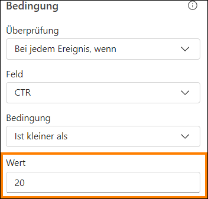

# Microsoft Fabric
## Real-Time Intelligence in a Day Übung 6

 

# Inhalt
- Dokumentstruktur
- Einführung
- Eine Warnung mit Reflex erstellen
    - Aufgabe 1: Das Echtzeit-Dashboard zum Festlegen von Warnungen verwenden
    - Aufgabe 2: Die E-Mail-Warnung aus der Reflex-Erfahrung testen
    - Aufgabe 3: Ein neues Reflex-Objekt aus dem Datenstrom erstellen
- Ressourcen bereinigen
    - Aufgabe 4: Arbeitsbereich bereinigen
- Zusammenfassung
- Referenzen
 
# Dokumentstruktur
Die Übung enthält die Schritte, die der Benutzer durchführen muss, sowie zugehörige Screenshots zur visuellen Unterstützung. Wichtige Abschnitte sind in den Screenshots mit einem orangefarbenen Kasten gekennzeichnet.

# Einführung
In dieser Übung erfahren Sie, wie Sie Data Activator nutzen, um einen Reflex zum Senden von Warnungen von unserem neu erstellten Echtzeit-Dashboard zu erstellen. Außerdem sehen wir uns an, wie wir die Nutzung von Reflex erweitern können, um zusätzliche benutzerdefinierte Warnmeldungen für die Daten zu erstellen, die wir in unser Eventhouse streamen.

Am Ende dieser Übung haben Sie Folgendes gelernt:
- Einen Reflex aus der Warnoption auf einem Echtzeit-Dashboard erstellen
- Data Activator Reflex-Elemente zum Erstellen weiterer benutzerdefinierter Warnungen verwenden 

# Eine Warnung mit Reflex erstellen
## Aufgabe 1: Das Echtzeit-Dashboard zum Festlegen von Warnungen verwenden

1. Öffnen Sie den **Fabric-Arbeitsbereich** für den Kurs und wählen Sie das Echtzeit-Dashboard aus, das Sie in der letzten Übung erstellt haben.

   

2. Klicken Sie im Visual **Click Through Rate** auf die Auslassungspunkte (…), und wählen Sie die Option
**Set alert** aus.

   

3. Auf der rechten Seite des Bildschirms wird ein neues Flyout geöffnet. Sie können vom Dashboard aus sehen, was Sie überwachen, einschließlich der spezifischen visuellen Darstellung, mit der die Warnung verknüpft ist. Über die Bedingung haben Sie die volle Kontrolle. Ändern Sie die **Bedingung** in **Ist kleiner als.**
 
   
 
4. Es wird ein neues Feld angezeigt, in das Sie einen **Wert** eingeben können. Ändern Sie diesen in **20**.

   

5. Für die Art der Benachrichtigung, die Sie erhalten möchten, sobald das Data Activator Reflex- Element erkennt, dass Ihre Bedingung erfüllt ist, stehen Ihnen derzeit drei mögliche Aktionen zur Verfügung. Wählen Sie die Option **Nachricht an mich in Teams senden** aus.

   

6. Schließlich müssen Sie den Speicherort festlegen, unter dem Sie das** Reflex-Element** speichern, das Sie mit dieser Warnung erstellen. Dadurch sollte standardmäßig Ihr aktueller Arbeitsbereich ausgewählt werden, aber Sie müssen speziell ein **neues Element** unter dem Dropdownmenü
„Element“ aufrufen.

   
 
 
7. Benennen Sie das Element in **CTR Reflex** um, und klicken Sie dann auf **Erstellen**. Das Erstellen wird einen Moment dauern.

    
 
8. Sie erhalten eine Bestätigung, dass die Reflex-Benachrichtigung erstellt wurde. Klicken Sie auf die Schaltfläche **Öffnen**, um das Reflex zu öffnen.

    
  
9. Damit gelangen Sie zum formalen **Reflex- Erfahrung**. Von hier aus können Sie den Datenstrom in Echtzeit überwachen, die zur Unterstützung von Reflex verwendeten Daten anzeigen und zusätzliche Trigger aus demselben Datenstrom erstellen.

    

## Aufgabe 2: Die E-Mail-Warnung aus der Reflex-Erfahrung testen

1. Klicken Sie in der Reflex-Erfahrung auf das Bleistiftsymbol neben dem Ereignisnamen und benennen Sie es in **CTR is less than 20**.

    

2. Wir aktualisieren außerdem die **Überschrift** und die **Nachricht**, die im Abschnitt **Aktion** auf der rechten Seite zu finden sind. Aktualisieren Sie die beiden Bereiche so, dass sie mit dem Bild unten übereinstimmen, und klicken Sie auf **Speichern und aktualisieren**.

    
 
3. Klicken Sie immer noch im Abschnitt **Aktion** auf der rechten Seite auf die Schaltfläche **Testaktion an mich senden**, um eine Beispielnachricht von Reflex in Teams zu erhalten.

    

4. Öffnen Sie eine neue Registerkarte im Edge-Browser Ihrer Umgebung, und gehen Sie zu
**Teams.Microsoft.com**.

5.	Melden Sie sich mit Ihren Umgebungs-Anmeldeinformationen an, wenn Sie dazu aufgefordert werden. Möglicherweise wird eine Meldung zum Starten einer Testversion angezeigt, die Sie akzeptieren müssen.

6. Sie sollten innerhalb von Teams eine Nachricht erhalten haben, die Sie darüber informiert, dass CTR kleiner als 20 ist.

    
 
7. Navigieren Sie zurück zum Reflex-Erlebnis, und erstellen Sie einen weiteren Trigger.

## Aufgabe 3: Ein neues Reflex-Objekt aus dem Datenstrom erstellen

1. Wählen Sie das Objekt mit der Bezeichnung **KQL Source Event** und dann **Neue Regel** aus.

   

2. Klicken Sie auf das **Bleistiftsymbol** und geben Sie der Regel den Namen **Clicks Greater Than 30,000** (Sie können hier einen Wert wählen, der der von Ihnen gestreamten Datenmenge besser entspricht).

   

3. Zu Beginn müssen Sie eine der Spalten aus dem Datenstrom überwachen. Dazu müssen wir die Abschnitte „Bedingung“ und „Aktion“ konfigurieren. Klicken Sie auf die Registerkarte „Definition“ der Regel, um die Bedingungen und Aktionen festzulegen.

4. Auf der sich öffnenden Definitionsseite wählen Sie unter **Bedingung** die folgenden Eigenschaften aus:
    - **Vorgang** = Ist größer als
    - **Spalte** = clicks
    - **Wert** = 30000

        
 
5. Unter **Aktion** wählen Sie die folgenden Eigenschaften aus:
    - *Typ* = Teams message
    - *Empfänger* = {Ihre Benutzer-ID}

        

6. Klicken Sie abschließend auf **Speichern und starten**, um diese Regel zu aktivieren.

   

7. Sie haben jetzt zwei Trigger, die denselben Datenstrom überwachen.

    

# Ressourcen bereinigen

## Aufgabe 4: Arbeitsbereich bereinigen

1. Dies ist die letzte Übung und der letzte Teil von „Real-Time Analytics in a Day“. Wenn Sie die Übung absolviert haben und keine weiteren inhaltlichen Fragen oder Wünsche an den Dozenten vorliegen, unterstützen Sie uns bitte durch die Freigabe des Arbeitsbereiches. Navigieren Sie zum Arbeitsbereich **RTI_username**.

   

2. Klicken Sie auf die **Arbeitsbereichseinstellungen** rechts oben in der Ecke.

    

3. Scrollen Sie von den Arbeitsplatzeinstellungen **Allgemein** nach unten, und klicken Sie auf die Schaltfläche **Diesen Arbeitsbereich entfernen**.

     
 
4. Übung und Unterricht abgeschlossen!
 
# Zusammenfassung

In dieser Übung sind wir die Verwendung von Data Activator durchgegangen. Mit dieser Funktion können Sie eine direkte Verbindung zu Echtzeit-Dashboards oder Datenströmen herstellen und Trigger für diese Daten erstellen. Diese Trigger können dann mit Erkennungsbedingungen konfiguriert werden und sobald diese Bedingungen erfüllt sind, können Maßnahmen ergriffen werden. In dieser Übung haben wir die Möglichkeit genutzt, eine E-Mail zu senden, wenn innerhalb unserer Trigger bestimmte Bedingungen erfüllt waren. Der Data Activator befindet sich noch in der Vorschauversion, daher könnten in Zukunft neue Aktionen verfügbar sein.

# Referenzen

Bei Fabric Real-time Intelligence in a Day (RTIIAD) lernen Sie einige der wichtigsten Funktionen von Microsoft Fabric kennen. Im Menü des Dienstes finden Sie in der Hilfe (?) Links zu praktischen Informationen.

   

Nachfolgend finden Sie weitere Angebote zur weiteren Arbeit mit Microsoft Fabric.
- Die vollständige Ankündigung der [Microsoft Fabric allgemeinen Verfügbarkeit finden Sie im Blogbeitrag](https://aka.ms/Fabric-Hero-Blog-Ignite23).
- Fabric bei einer [interaktiven Vorstellung](https://aka.ms/Fabric-GuidedTour) kennenlernen
- Zur kostenlosen Testversion von [Microsoft Fabric anmelden](https://aka.ms/try-fabric)
- Besuchen Sie die [Microsoft Fabric-Website](https://aka.ms/microsoft-fabric)
- Mit den Modulen von [Fabric Learning](https://aka.ms/learn-fabric) neue Qualifikationen erwerben
- [Technische Dokumentation zu Fabric](https://aka.ms/fabric-docs) erkunden
- [Kostenloses E--Book zum Einstieg in Fabric lesen](https://aka.ms/fabric-get-started-ebook)
- Mitglied der [Fabric-Community](https://aka.ms/fabric-community) werden, um Fragen zu stellen, Feedback zu geben und sich mit anderen auszutauschen
 
Lesen Sie die detaillierteren Blogs zur Ankündigung der Fabric-Umgebung:
- [Blog zum Data Factory-Funktionsbereich in Fabric](https://aka.ms/Fabric-Data-Factory-Blog)
- [Blog zum Synapse Data Engineering-Funktionsbereich in Fabric](https://aka.ms/Fabric-DE-Blog)
- [Blog zum Synapse Data Science-Funktionsbereich in Fabric](https://aka.ms/Fabric-DS-Blog)
- [Blog zum Synapse Data Warehousing-Funktionsbereich in Fabric](https://aka.ms/Fabric-DW-Blog)
- [Real-Time Intelligence-Erfahrung im Fabric-Blog](https://blog.fabric.microsoft.com/en-us/blog/category/real-time-intelligence)
- [Power BI-Ankündigung im Blog](https://aka.ms/Fabric-PBI-Blog)
- [Blog zum Data Activator-Funktionsbereich in Fabric](https://aka.ms/Fabric-DA-Blog)
- [Blog zu Verwaltung und Governance in Fabric](https://aka.ms/Fabric-Admin-Gov-Blog)
- [Blog zu OneLake in Fabric](https://aka.ms/Fabric-OneLake-Blog)
- [Blog zur Dataverse- und Microsof t Fabric-Integration](https://aka.ms/Dataverse-Fabric-Blog)

© 2024 Microsoft Corporation. Alle Rechte vorbehalten.

Durch die Verwendung der vorliegenden Demo/Übung stimmen Sie den folgenden Bedingungen zu:
Die in dieser Demo/Übung beschriebene Technologie/Funktionalität wird von der Microsoft Corporation bereitgestellt, um Feedback von Ihnen zu erhalten und Ihnen Wissen zu vermitteln. Sie dürfen die Demo/Übung nur verwenden, um derartige Technologiefeatures und Funktionen zu bewerten und Microsoft Feedback zu geben. Es ist Ihnen nicht erlaubt, sie für andere Zwecke zu verwenden. Es ist Ihnen nicht gestattet, diese Demo/Übung oder einen Teil derselben zu ändern, zu kopieren, zu verbreiten, zu übertragen, anzuzeigen, auszuführen, zu vervielfältigen, zu veröffentlichen, zu lizenzieren, zu transferieren oder zu verkaufen oder aus ihr abgeleitete Werke zu erstellen.

DAS KOPIEREN ODER VERVIELFÄLTIGEN DER DEMO/ÜBUNG (ODER EINES TEILS DERSELBEN) AUF EINEN/EINEM ANDEREN SERVER ODER SPEICHERORT FÜR DIE WEITERE VERVIELFÄLTIGUNG ODER VERBREITUNG IST AUSDRÜCKLICH UNTERSAGT.DIESE DEMO/ÜBUNG BIETET BESTIMMTE SOFTWARETECHNOLOGIE/PRODUKTFUNKTIONEN UND FUNKTIONALITÄT, EINSCHLIESSLICH MÖGLICHER NEUER FUNKTIONEN UND KONZEPTE, IN EINER SIMULIERTEN UMGEBUNG OHNE KOMPLEXE EINRICHTUNG ODER INSTALLATION FÜR DEN BESCHRIEBENEN ZWECK OBEN. DIE IN DIESER DEMO/ÜBUNG DARGESTELLTEN TECHNOLOGIEN/KONZEPTE STELLEN MÖGLICHERWEISE NICHT DIE VOLLSTÄNDIGE
FUNKTIONALITÄT DER FUNKTION DAR UND FUNKTIONIEREN MÖGLICHERWEISE NICHT SO, WIE EINE ENDGÜLTIGE VERSION FUNKTIONIEREN KÖNNTE. UNTER UMSTÄNDEN VERÖFFENTLICHEN WIR AUCH KEINE ENDGÜLTIGE VERSION DERARTIGER FEATURES ODER KONZEPTE. IHRE ERFAHRUNG BEI DER VERWENDUNG DERARTIGER FEATURES UND FUNKTIONEN IN EINER
PHYSISCHEN UMGEBUNG KANN FERNER ABWEICHEND SEIN.

**FEEDBACK.** Wenn Sie Feedback zu den Technologiefeatures, Funktionen und/oder Konzepten geben, die in dieser Demo/Übung beschrieben werden, gewähren Sie Microsoft das Recht, Ihr Feedback in jeglicher Weise und für jeglichen Zweck kostenlos zu verwenden, zu veröffentlichen und gewerblich zu nutzen. Außerdem treten Sie Dritten kostenlos sämtliche Patentrechte ab,
die erforderlich sind, damit deren Produkte, Technologien und Dienste bestimmte Teile einer Software oder eines Dienstes von Microsoft, welche/welcher das Feedback enthält, verwenden oder eine Verbindung zu dieser/diesem herstellen können. Sie geben kein Feedback, das einem Lizenzvertrag unterliegt, aufgrund dessen Microsoft Drittparteien eine Lizenz für seine Software oder Dokumentation gewähren muss, weil wir Ihr Feedback in diese aufnehmen. Diese Rechte bestehen nach Ablauf dieser Vereinbarung fort.
 
DIE MICROSOFT CORPORATION LEHNT HIERMIT JEGLICHE GEWÄHRLEISTUNGEN UND
GARANTIEN IN BEZUG AUF DIE DEMO/ÜBUNG AB, EINSCHLIESSLICH ALLER AUSDRÜCKLICHEN, KONKLUDENTEN ODER GESETZLICHEN GEWÄHRLEISTUNGEN UND GARANTIEN DER
HANDELSÜBLICHKEIT, DER EIGNUNG FÜR EINEN BESTIMMTEN ZWECK, DES RECHTSANSPRUCHS UND DER NICHTVERLETZUNG VON RECHTEN DRITTER. MICROSOFT MACHT KEINERLEI ZUSICHERUNGEN BZW. ERHEBT KEINERLEI ANSPRÜCHE IM HINBLICK AUF DIE RICHTIGKEIT DER ERGEBNISSE UND DES AUS DER VERWENDUNG DER DEMO/ÜBUNG RESULTIERENDEN
ARBEITSERGEBNISSES BZW. BEZÜGLICH DER EIGNUNG DER IN DER DEMO/ÜBUNG ENTHALTENEN INFORMATIONEN FÜR EINEN BESTIMMTEN ZWECK.

**HAFTUNGSAUSSCHLUSS**
Diese Demo/Übung enthält nur einen Teil der neuen Features und Verbesserungen in Microsoft Power BI. Einige Features können sich unter Umständen in zukünftigen Versionen des Produkts ändern. In dieser Demo/Übung erhalten Sie Informationen über einige, aber nicht über alle neuen Features.
