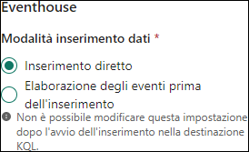
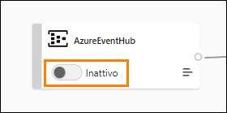
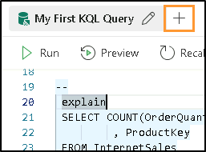

# Microsoft Fabric Real-Time Intelligence in a Day Lab 2

  
 
# Sommario

- Struttura del documento	

- Introduzione	

- Hub in tempo reale di Fabric	

    - Attività 1. Creazione di un'origine di flusso di eventi	

    - Attività 2. Impostazione della destinazione dell'Eventstream	

- Linguaggio di query Kusto (KQL)	

    - Attività 3. Creazione di query di database Kusto	

    - Attività 4. Uso di query T-SQL su un database KQL	

- Set di query KQL	

  - Attività 5. Uso di un set di query KQL	

- Riepilogo	

- Riferimenti	

 
# Struttura del documento

Il lab include i passaggi che l'utente deve seguire con gli screenshot associati che forniscono un aiuto visivo. In ogni screenshot vi sono sezioni evidenziate con riquadri arancioni che indicano le aree su cui l'utente deve concentrarsi.

# Introduzione

In questo lab si apprenderà a gestire un flusso continuo di dati in tempo reale. Si userà un oggetto Fabric Real-Time Intelligence denominato Eventstream per inserire questi dati nell'Eventhouse creato nell'ultimo lab e scrivere alcune query KQL di base.

In questo lab si apprenderà quanto segue:

- Come creare un Eventstream

- Come caricare dati in tempo reale in un database KQL

- Come scrivere query di base nel Linguaggio di query Kusto

# Hub in tempo reale di Fabric

## Attività 1. Creazione di un'origine di flusso di eventi

1. Aprire l'**area di lavoro Fabric** creata nell'ultimo lab. Qui è visibile l'Eventhouse creato.
 
    
   
2. Passare all'hub in tempo reale selezionando il pulsante **In tempo reale** sul lato sinistro. Anche se al momento non si vedono flussi di dati, la situazione cambierà a breve.
   
    
 
3. Selezionare il pulsante verde **+ Connettere un'origine dati** che dovrebbe trovarsi nell'angolo in alto a destra.

    

4. Si aprirà una finestra in cui selezionare un'origine per i dati in streaming. Come indicato in precedenza, è possibile scegliere tra molte straordinarie opzioni, ma per questa lezione selezioneremo l'opzione "Hub eventi di Azure". Se "Hub eventi di Azure" non è facilmente visibile, selezionare **Origini Microsoft** in alto per filtrare le opzioni visualizzate.

    

5. Ora è necessario creare una connessione all'Hub eventi di Azure. Fare clic sul testo **Nuova connessione** poiché al momento non si dispone di alcuna connessione.

    

6. Dalla pagina dei dettagli dell'ambiente copiare e incollare tutte le impostazioni di connessione necessarie nei campi appropriati. Per questi lab si eseguirà la connessione a un hub eventi che riceve dati in streaming da un notebook Python. Questo notebook crea false transazioni di vendita al ritmo di circa 3.100 transazioni all'ora.

    Spazio dei nomi hub eventi: **rtiadhu/{userid} - fornito da cloudlabs**

    Hub eventi: **rti-iad-fabrikam**

    Nome chiave di accesso condivisa: **rti-reader**

    Chiave di accesso condivisa: **disponibile nella scheda Dettagli ambiente**

7.	Una volta compilate tutte le proprietà, fare clic su **Connetti.**

    

8.	Nella configurazione dell'origine dati Hub eventi di Azure potrebbe essere necessario modificare il **Gruppo di consumer** dell'hub eventi per essere certi di ottenere l'accesso a un punto di accesso univoco al flusso di dati. Per questo workshop è possibile lasciare il valore "$Default", come mostrato di seguito

     

9.	Prima di finalizzare questa origine dati e l'Eventstream, è opportuno rinominare l'Eventstream con un nome più utile. Nella sezione "Dettagli flusso" a destra selezionare l'icona della matita accanto a "Nome Eventstream" e assegnare all'Eventstream il nome "**es_Fabrikam_InternetSales**".

    

10.	Ora è possibile fare clic su **Avanti** e accedere così alla pagina della panoramica finale.

    

11.	In questa schermata di panoramica verificare che il contenuto sia corretto e fare clic su **Connetti.**

    **Nota: i dettagli saranno diversi da quelli visualizzati nello screenshot**

    

12.	Una volta creati l'Eventstream e l'origine dell'Eventstream, selezionare l'opzione "**Apri Eventstream**"

    

13.	Si accederà così all'interfaccia utente dell'Eventstream. Qui è possibile visualizzare il flusso di dati di origine che fluisce nell'Eventstream, come pure aggiungere anche eventi di trasformazione.

14.	Potrebbe passare qualche istante prima che l'origine diventi **attiva**, ma dopo una breve attesa fare clic sull'icona centrale con il nome dell'Eventstream per vedere un'anteprima dei dati.

    **Nota: la visualizzazione di uno stato di "Avviso" per un criterio di controllo non deve suscitare preoccupazioni. Il flusso funzionerà comunque**

    
 
15.	Ora dovrebbe essere visibile un campione dei dati nella finestra in basso.

    

16.	Verrà visualizzata un'anteprima dei dati ricevuti dall'Hub eventi di Azure. Se si fa scorrere completamente la barra di scorrimento orizzontale inferiore verso destra nell'anteprima, sarà possibile vedere la data e l'ora in cui i dati sono stati ricevuti nell'hub eventi in due colonne denominate **EventProcessedUtcTime** ed **EventEnqueuedUtcTime**. Dovrebbe apparire la data/ora corrente nel formato UTC.

    

## Attività 2. Impostazione della destinazione dell'Eventstream

1.	Fare clic sul riquadro all'interno dell'area canvas con l'etichetta "Passa alla modalità di modifica per trasformare l'evento o aggiungere la destinazione"

    
   
2.	All'interno dell'interfaccia utente di Eventstream fare clic sull'opzione **Trasforma gli eventi o aggiungi una destinazione** per aprire il menu a discesa.

    

3.	Visualizzare l'elenco delle operazioni disponibili che è possibile eseguire sul flusso.
 
     
     
4.	Sotto la sezione **Operazioni** sono disponibili le **Destinazioni**: selezionare l'opzione **Eventhouse**.

     

5.	Si apre un nuovo menu sul lato destro della schermata. La prima cosa che occorre modificare per la destinazione è la **modalità di inserimento dei dati**. Le due opzioni sono **Inserimento diretto** ed **Elaborazione degli eventi prima dell'inserimento**. Poiché non verrà trasformato nulla nell'Eventstream e si caricheranno direttamente queste informazioni in una tabella del database KQL, accertarsi di aver selezionato l'opzione **Inserimento diretto**.

    

6.	Modificare le restanti impostazioni con i dettagli specificati di seguito.

    - Nome destinazione: **eh-kql-db-fabrikam**

    - Area di lavoro: **RTI_username**

    - Eventhouse: **eh_Fabrikam**

    - Database KQL: **eh_Fabrikam**

      

7.	Fare clic su Salva.

8.	Con l'Eventstream configurato, fare clic sul pulsante **Pubblica** per salvare questo Eventstream e iniziare l'inserimento.

    

9.	Se si nota che l'origine **AzureEventHub** è diventata inattiva, impostare l'interruttore sullo stato "Attiva" e scegliere l'opzione "Ora" quando si apre la finestra di dialogo

    
    

10.	Scegliere l'opzione **Configura** all'interno della **Destinazione** per eseguire correttamente il mapping del flusso in una tabella nel database KQL.
 
    

11.	Fare clic sull'opzione **+ Nuova tabella** sotto il database **eh_Fabrikam**.

    

12.	Assegnare alla nuova tabella il nome **InternetSales**, quindi fare clic sul segno di spunta.

    
 
13.	Potrebbe essere necessario aggiornare il "**Nome connessione dati**" per soddisfare i requisiti. Rinominarlo in "**eh_Fabrikam_es_InternetSales**". Quindi, fare clic su **Avanti**.
   
    

14.	Dopo qualche istante di ricerca degli eventi, l'interfaccia utente dovrebbe mostrare che sono stati trovati dati campione. Fare clic su **Termina** nella parte inferiore della schermata.
 
    

15.	A questo punto verrà visualizzato un riepilogo. Una volta che tutti i segni di spunta sono verdi, fare clic su **Chiudi** per proseguire.
 
16.	Una volta visualizzata l'interfaccia utente che mostra i mapping dall'origine all'Eventstream alla destinazione, si è configurato e avviato correttamente un flusso di dati nel database KQL.

    
 
# Linguaggio di query Kusto (KQL)

## Attività 3. Creazione di query di database Kusto

1.	Tornare all'area di lavoro **RTI_username**. Dovrebbe essere presente il nuovo Eventstream appena creato insieme a tutti gli elementi dell'Eventhouse.

    

2.	Aprire l'elemento Database KQL **eh_Fabrikam**.

    

3.	Questa esperienza fornirà una panoramica della struttura, delle dimensioni e dell'utilizzo attuali del database KQL. Poiché l'Eventstream invia dati a questo database KQL in modo coerente, si noterà che la quantità di spazio di archiviazione aumenterà nel tempo.

    

4.	Fare clic sull'**icona di aggiornamento** in alto a destra nella schermata.

    
 
5.	La dimensione del database dovrebbe essere aumentata. Il valore visualizzato potrebbe non essere esatto rispetto agli screenshot presenti nel resto del laboratorio. A seconda del tempo impiegato per completare il contenuto, si riceverà un numero inferiore o superiore di record
rispetto agli altri partecipanti al lab. Questo è del tutto normale e non influirà in alcun modo sulla prosecuzione del corso.

    
 
6.	Nell'area di spostamento nel database sul lato sinistro della schermata, fare clic sulla tabella nel database KQL denominata **InternetSales**. Verrà visualizzata una panoramica della tabella

    

7.	La panoramica fornirà dettagli sui metadati della tabella creati e su tutti i dati in streaming attivo con l'Eventstream. Anche in questo caso, la dimensione della tabella e il numero di righe al suo interno variano da studente a studente e non influiranno sui risultati finali di questo o di qualsiasi altro lab. Di seguito sono elencati alcuni elementi aggiuntivi da tenere presenti in questo menu:

    - **Registro attività dati**: mostra il numero di righe inserite, la data/ora dell'ultima generazione e l'intervallo di visualizzazione

    - **Anteprima dati**: mostra un'anteprima dei risultati dell'inserimento nella tabella.

    - **Informazioni schema**: include dettagli sul nome della colonna e sui tipi di dati della colonna su cui è possibile eseguire query con KQL. Mostra anche il conteggio dei primi 10 valori nella colonna selezionata

    - **Dettagli tabella**: mostra le dimensioni compresse e originali della tabella, la disponibilità di OneLake, il numero di righe nelle tabelle e vari altri dettagli

      
     
8.	Tornare alla visualizzazione del database e fare clic su **Query with code** nell'angolo in alto a destra.

    
 
9.	Verrà aperto il set di query KQL predefinito creato insieme all'Eventhouse. Esistono già alcune query con script predefiniti, ma che necessitano di una minima personalizzazione. Sono inoltre disponibili due collegamenti alla documentazione Microsoft che possono essere utili per
imparare a usare KQL o per analizzare le conversioni da SQL a KQL, un argomento che verrà affrontato più avanti in questo corso.

    

10.	Fare clic sulla **Riga 8** e sostituire l'indicazione **YOUR_TABLE_HERE** con il nome della tabella,**InternetSales**.

    

11.	Evidenziare le **Righe 8 e 9**, quindi fare clic sul pulsante **Run** nell'angolo in alto a sinistra della finestra.

    
 
12.	La query usa l'operatore **take** per recuperare un numero specificato di righe. Quando viene eseguita la query, verranno estratti i dati dalla tabella InternetSales e verrà restituito il numero di righe specificato nella query. In questo esempio verranno restituite solo 100 righe, come in una clausola WHERE in SQL. Le righe specifiche restituite non possono essere determinate con questo operatore e i risultati della query varieranno da quelli degli altri partecipanti al corso.

    

13. Fare clic sulla **Riga 12** e sostituire l'indicazione **YOUR_TABLE_HERE** con il nome della tabella,**InternetSales**.

    

14.	Evidenziare le **Righe 12 e 13**, quindi fare clic sul pulsante **Run** nell'angolo in alto a sinistra della finestra.

    
 
15.	Questa query usa l'operatore count. Restituirà un numero aggregato di record esistenti al momento dell'esecuzione della query nella tabella del database KQL. Se si esegue ripetutamente questa query, si potrà notare che il numero di record aumenta ogni pochi secondi.

    

16.	Ripetere i passaggi precedenti per la query finale creata automaticamente alla **Riga 16/17** ed eseguire nuovamente la query.

    

17.	Questa query permetterà di conoscere il numero di record inseriti nella tabella nell'arco di un'ora. La distribuzione complessiva di questi record per i dati attualmente in fase di inserimento sarà di circa 4.100 all'ora. Ci saranno però delle minime variazioni nel numero di transazioni
orarie e questa query indicherà in dettaglio se sono stati inseriti più o meno record in ogni arco temporale.

# Attività 4. Uso di query T-SQL su un database KQL

Potrebbe essere la prima volta che si usa il Linguaggio di query Kusto. Sebbene questo linguaggio sia intuitivo e facile da apprendere per query semplici, potrebbe accadere di dover restituire risultati di query di complessità maggiore rispetto a quanto si è attualmente in grado di fare. Nelle funzionalità del set di query KQL sono stati inclusi diversi strumenti utili, tra cui la conversione di query SQL in query KQL e la semplice creazione di query T-SQL all'interno del set di query KQL. Procediamo a
esaminarle.

1.	È necessario creare una query che restituisca ogni prodotto con il numero di volte in cui è stato venduto. È possibile eseguire rapidamente questa operazione con T-SQL. All'interno della finestra di query, è possibile convertire le query SQL in KQL per comprendere meglio come creare le
query KQL in futuro. Iniziare scrivendo il seguente comando.

    **Nota: fare doppio clic sull'oggetto sottostante per poter copiare il testo**

    

    

2.	La riga di commento "—" seguita dalla parola chiave "explain" permetterà ora di creare una query SQL e di restituire un risultato con la query KQL che potrebbe essere usata per ottenere una query
e un risultato simili. Immettere di seguito la seguente query per spiegare come apparirà la query KQL:
 
    

    
 
3.	Questa è una semplice query SQL che recupererà i risultati dalla tabella InternetSales e restituirà due colonne, il codice prodotto e un conteggio del numero degli ordini. Poiché sono presenti una colonna aggregata e una colonna non aggregata, è necessario usare GROUP BY per restituire risultati per ogni singolo prodotto. Eseguire l'intera query iniziando con "--" fino alla fine della query T-SQL.

    

4.	L'output della query explain dovrebbe essere un singolo record con la query KQL convertita come risultato. Fare clic **sull'icona** > per espandere i risultati e supportare una conversione più semplice.

     
 
5.	Fare clic sul riquadro della query evidenziato in arancione qui sotto. Ciò permetterà di
selezionare la query KQL convertita e di copiarla. Incollare la query nel set di query KQL che stiamo usando

    

6.	Con i risultati nel riquadro della query, evidenziare ed eseguire la query per recuperare i risultati.
L'operatore **summarize** produrrà una tabella che aggrega il contenuto della tabella di input determinando al contempo come raggruppare ciascun record con l'operatore **by ProductKey** mentre l'operatore **project** selezionerà le colonne da includere, rinominare o eliminare
inserendo le nuove colonne calcolate.

    

7.	Per conoscere ulteriori funzionalità e conversioni, consultare l'elenco di riferimento rapido delle operazioni da SQL a KQL nella parte superiore del set di query.

    
    
8.	Anziché usare KQL, un'alternativa per eseguire query sui risultati del database KQL in Fabric è
scrivere ed eseguire una query T-SQL. Evidenziare l'istruzione SQL originale usata per convertire la query KQL ed eseguire solo quella.

    

9.	In questo modo si otterranno risultati perfettamente validi anche senza dover prima eseguire la conversione in KQL.

    

# Set di query KQL

## Attività 5. Uso di un set di query KQL

1.	Sebbene la maggior parte delle query in questa finestra sia stata creata automaticamente
dall'interfaccia utente, in futuro potrebbe capitare di voler creare da zero le proprie query KQL. Questa operazione può essere gestita tramite la funzionalità delle schede situata in alto. Va inoltre notato che questo set di query esegue un salvataggio automatico e periodico.
 
2.	Nella parte superiore del set di query il nome predefinito della prima pagina è lo stesso nome del database.

    

3.	Rinominare questa scheda facendo clic sull'icona della matita e specificando "**My First KQL Query**".

     

4.	In futuro, per isolare il codice personalizzato, sarà possibile creare semplicemente schede aggiuntive facendo clic sull'icona "+".

     

5.	Tornare all'area di lavoro **RTI_username**. Dovrebbero essere presenti i seguenti oggetti

     

# Riepilogo

Abbiamo iniziato questo lab impostando una connessione a un hub eventi con un flusso di dati in esecuzione e abbiamo usato un Eventstream per acquisire tali dati e inserirli in un database KQL.
Una volta inseriti i dati, è stato possibile creare diverse query KQL e osservare la funzionalità dell'uso di T-SQL per apprendere la sintassi KQL o semplicemente per restituire risultati con istruzioni SQL.

# Riferimenti

Fabric Real-time Intelligence in a Day (RTIIAD) presenta alcune delle funzioni chiave disponibili in Microsoft Fabric.

Nel menu di servizio, la sezione Guida (?) include collegamenti ad alcune risorse utili.

   

Di seguito sono riportate ulteriori risorse utili che consentiranno di progredire nell'uso di Microsoft Fabric.

•	Fare riferimento al post del blog per leggere l'[annuncio completo sulla disponibilità generale di Microsoft Fabric](https://www.microsoft.com/en-us/microsoft-fabric/blog/2023/11/15/prepare-your-data-for-ai-innovation-with-microsoft-fabric-now-generally-available/)

•	Esplorare Fabric tramite la [Presentazione guidata](https://guidedtour.microsoft.com/en-us/guidedtour/microsoft-fabric/microsoft-fabric/1/1)

•	Iscriversi alla [versione di valutazione gratuita di Microsoft Fabric](https://www.microsoft.com/en-us/microsoft-fabric/getting-started)

•	Visitare il [sito Web di Microsoft Fabric](https://www.microsoft.com/en-in/microsoft-fabric)

•	Acquisire nuove competenze esplorando i [moduli di apprendimento di Fabric](https://learn.microsoft.com/en-us/training/browse/?products=fabric&resource_type=module)

•	Consultare la [documentazione tecnica di Fabric](https://learn.microsoft.com/en-us/fabric/)

•	Leggere l'[e-book gratuito introduttivo a Fabric](https://info.microsoft.com/ww-landing-unlocking-transformative-data-value-with-microsoft-fabric.html)

•	Unirsi alla [community di Fabric](https://community.fabric.microsoft.com/) per pubblicare domande, condividere feedback e imparare dagli altri

Leggere i blog di annunci più approfonditi sull'esperienza Fabric:

•	[Blog sull'esperienza Data Factory in Fabric](https://blog.fabric.microsoft.com/en-us/blog/introducing-data-factory-in-microsoft-fabric/)

•	[Blog sull'esperienza Synapse Data Engineering in Fabric](https://blog.fabric.microsoft.com/en-us/blog/introducing-synapse-data-engineering-in-microsoft-fabric/)

•	[Blog sull'esperienza Synapse Data Science in Fabric](https://blog.fabric.microsoft.com/en-us/blog/introducing-synapse-data-science-in-microsoft-fabric/)

•	[Blog sull'esperienza Synapse Data Warehousing in Fabric](https://blog.fabric.microsoft.com/en-us/blog/introducing-synapse-data-warehouse-in-microsoft-fabric/)

•	[Blog sull'esperienza Real-Time Intelligence in Fabric](https://blog.fabric.microsoft.com/en-us/blog/category/real-time-intelligence)
 
•	[Blog di annunci di Power BI](https://powerbi.microsoft.com/en-us/blog/empower-power-bi-users-with-microsoft-fabric-and-copilot/)

•	[Blog sull'esperienza Data Activator in Fabric](https://blog.fabric.microsoft.com/en-us/blog/driving-actions-from-your-data-with-data-activator/)

•	[Blog su amministrazione e governance in Fabric](https://blog.fabric.microsoft.com/en-us/blog/administration-security-and-governance-in-microsoft-fabric/)

•	[Blog su OneLake in Fabric](https://blog.fabric.microsoft.com/en-us/blog/microsoft-onelake-in-fabric-the-onedrive-for-data/)

•	[Blog sull'integrazione di Dataverse e Microsoft Fabric](https://www.microsoft.com/en-us/dynamics-365/blog/it-professional/2023/05/24/new-dataverse-enhancements-and-ai-powered-productivity-with-microsoft-365-copilot/)

© 2024 Microsoft Corporation. Tutti i diritti sono riservati.

L'uso della demo/del lab implica l'accettazione delle seguenti condizioni:

La tecnologia/le funzionalità descritte nella demo/nel lab sono fornite da Microsoft Corporation allo scopo di ottenere feedback dall'utente e offrire un'esperienza di apprendimento. L'utilizzo della demo/del lab è consentito solo per la valutazione delle caratteristiche e delle funzionalità di tale tecnologia e per l'invio di feedback a Microsoft. L'utilizzo per qualsiasi altro scopo non
è consentito. È vietato modificare, copiare, distribuire, trasmettere, visualizzare, eseguire, riprodurre, pubblicare, concedere in licenza, usare per la creazione di lavori derivati, trasferire o vendere questa demo/questo lab o parte di essi.

SONO ESPLICITAMENTE PROIBITE LA COPIA E LA RIPRODUZIONE DELLA DEMO/DEL LAB (O DI QUALSIASI PARTE DI ESSI) IN QUALSIASI ALTRO SERVER O IN QUALSIASI ALTRA POSIZIONE PER ULTERIORE RIPRODUZIONE O RIDISTRIBUZIONE.

QUESTA DEMO/QUESTO LAB RENDONO DISPONIBILI TECNOLOGIE SOFTWARE/FUNZIONALITÀ DI PRODOTTO SPECIFICHE, INCLUSI NUOVI CONCETTI E NUOVE FUNZIONALITÀ POTENZIALI, IN UN AMBIENTE SIMULATO, CON UN'INSTALLAZIONE E UNA CONFIGURAZIONE PRIVE DI
COMPLESSITÀ, PER GLI SCOPI DESCRITTI IN PRECEDENZA. LA TECNOLOGIA/I CONCETTI RAPPRESENTATI IN QUESTA DEMO/IN QUESTO LAB POTREBBERO NON CONTENERE LE
FUNZIONALITÀ COMPLETE E IL LORO FUNZIONAMENTO POTREBBE NON ESSERE LO STESSO DELLA VERSIONE FINALE. È ANCHE POSSIBILE CHE UNA VERSIONE FINALE DI TALI FUNZIONALITÀ O CONCETTI NON VENGA RILASCIATA. L'ESPERIENZA D'USO DI TALI CARATTERISTICHE E
FUNZIONALITÀ PUÒ INOLTRE RISULTARE DIVERSA IN UN AMBIENTE FISICO.

**FEEDBACK**. L'invio a Microsoft di feedback sulle caratteristiche, sulle funzionalità e/o sui concetti della tecnologia descritti in questa demo/questo lab implica la concessione a Microsoft, a titolo gratuito, del diritto di usare, condividere e commercializzare tale feedback in qualsiasi modo e per qualsiasi scopo. Implica anche la concessione a titolo gratuito a terze parti del diritto di utilizzo di eventuali brevetti necessari per i loro prodotti, le loro tecnologie e i loro servizi al fine di usare
o interfacciarsi ai componenti software o ai servizi Microsoft specifici che includono il feedback. L'utente si impegna a non inviare feedback la cui inclusione all'interno di software o documentazione Microsoft imponga a Microsoft di concedere in licenza a terze parti tale software
o documentazione. Questi diritti sussisteranno anche dopo la scadenza del presente contratto.

CON LA PRESENTE MICROSOFT CORPORATION NON RICONOSCE ALCUNA GARANZIA
E CONDIZIONE RELATIVAMENTE ALLA DEMO/AL LAB, INCLUSE TUTTE LE GARANZIE E CONDIZIONI DI COMMERCIABILITÀ, DI FATTO ESPRESSE, IMPLICITE O PRESCRITTE DALLA LEGGE,
ADEGUATEZZA PER UNO SCOPO SPECIFICO, TITOLARITÀ E NON VIOLABILITÀ. MICROSOFT NON OFFRE GARANZIE O RAPPRESENTAZIONI IN RELAZIONE ALL'ACCURATEZZA DEI RISULTATI E DELL'OUTPUT DERIVANTI DALL'USO DELLA DEMO/DEL LAB O ALL'ADEGUATEZZA DELLE
INFORMAZIONI CONTENUTE NELLA DEMO/NEL LAB PER QUALSIASI SCOPO.
 
**CLAUSOLA DI RESPONSABILITÀ**
Questa demo/questo lab contiene solo una parte delle nuove funzionalità e dei miglioramenti in Microsoft Power BI. Alcune funzionalità potrebbero cambiare nelle versioni future del prodotto. In questa demo/in questo lab si apprendono alcune delle nuove funzionalità, ma non tutte.

