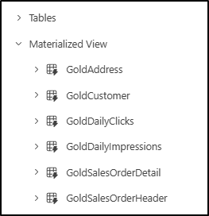

# Microsoft Fabric Real-Time Intelligence in a Day Lab 4

  
 
# Sommario
- Struttura del documento

- Introduzione

- Framework Medallion all’interno dei database KQL

    - Attività 1. Creazione di tabelle Bronze

    - Attività 2. Caricamento delle tabelle Bronze mediante una pipeline di dati

    - Attività 3. Trasformazione delle tabelle in livello Silver

    - Attività 4. Creazione di un livello Gold con viste materializzate

- Lakehouse Fabric e disponibilità di OneLake

    - Attività 5. Creazione di un lakehouse

    - Attività 6. Collegamento alle tabelle del database KQL

- Riepilogo

- Riferimenti

# Struttura del documento

Il lab include i passaggi che l’utente deve seguire con gli screenshot associati che forniscono un aiuto visivo. In ogni screenshot vi sono sezioni evidenziate con riquadri arancioni che indicano le aree su
cui l’utente deve concentrarsi.

# Introduzione

In questo lab si creerà un framework Medallion usando l’approccio con i livelli Bronze, Silver e Gold per gestire i dati nelle diverse fasi di sviluppo e uso nell’analisi. Si procederà quindi a connettere i dati dal database KQL a un lakehouse per mostrare la rapidità con cui è possibile condividere i dati in tempo reale con gli utenti dell’organizzazione che vogliono usarli per la creazione di report Power BI.

In questo lab si apprenderà quanto segue:

- Come creare tabelle di database KQL con il 
Linguaggio di query Kusto

- Come caricare dati nei database KQL con le pipeline di Data Factory

- Come creare viste materializzate nei database KQL

- Come creare un lakehouse e usare i collegamenti al database KQL

# Framework Medallion all’interno dei database KQL

## Attività 1. Creazione di tabelle Bronze

1. Aprire l’**area di lavoro Fabric** per il corso e il set di query KQL creato nell’ultimo lab, **Create Tables**.

    

2. All’interno di questo set di query KQL rinominare la scheda originale da "eh_Fabrikam" a "Create External Tables", rendendo più semplice organizzare e comprendere il contenuto del set di query.

    

3. Creare una nuova scheda selezionando l’icona "+" e chiamare la nuova scheda "Bronze Layer"

    

4. All’interno di questa nuova scheda incollare ed evidenziare il seguente codice, quindi selezionare "Esegui" per creare quattro nuove tabelle che fungeranno da livello Bronze del framework
Medallion.

    ```
    //BRONZE LAYER

    .execute database script <|

    .create table [Address] (AddressID:int,AddressLine1:string,AddressLine2:string,City: string, StateProvince:string, CountryRegion:string, PostalCode: string, rowguid: guid, ModifiedDate:datetime)

    .create table [Customer](CustomerID:int, NameStyle: string, Title: string, FirstName: string, MiddleName: string, LastName: string,Suffix:string, CompanyName: string, SalesPerson: string, EmailAddress: string, Phone: string, ModifiedDate: datetime)

    .create table [SalesOrderHeader](SalesOrderID: int, OrderDate: datetime, DueDate: datetime, ShipDate: datetime, ShipToAddressID: int, BillToAddressID: int, SubTotal: decimal, TaxAmt: decimal, Freight: decimal, TotalDue: decimal, ModifiedDate: datetime)

    .create table [SalesOrderDetail](SalesOrderID: int, SalesOrderDetailID: int, OrderQty: int, ProductID: int, UnitPrice: decimal , UnitPriceDiscount: decimal,LineTotal: decimal, ModifiedDate: datetime)
    ```

    
 
5. Una volta eseguito, dovrebbero essere immediatamente visibili quattro nuove tabelle create in Esplora oggetti del database.
    - Address
    - Customer
    - SalesOrderDetail
    - SalesOrderHeader

    

6. Espandere la **tabella Address** facendo clic sull’icona ">" accanto al nome.

    
 
7. Viene mostrato lo schema (nomi delle colonne e tipi di dati) della tabella. Sarà utile aggiungere a questa tabella nel database KQL una colonna nascosta in cui archiviare l’ora di inserimentoe che verrà usata in seguito nell’architettura Medallion. Procedere all’aggiunta. Copiaree incollare lo script sottostante per modificare le tabelle appena create aggiungendo una colonna relativa all’ora di inserimento.
     ```
    //adds a hidden field showing ingestion time

    .execute database script <|

    .alter table Address policy ingestiontime true

    .alter table Customer policy ingestiontime true

    .alter table SalesOrderHeader policy 
    ingestiontime true

    .alter table SalesOrderDetail policy ingestiontime true
     ```
     

8. Le quattro nuove tabelle sono tabelle vuote con il loro schema definito. Ora è necessario trovare un modo per caricare correttamente queste tabelle. Tornare all’area di lavoro **RTI_username**.


## Attività 2. Caricamento delle tabelle Bronze mediante una pipeline di dati

1. Dall’area di lavoro selezionare l’opzione **"+ Nuovo elemento"** per visualizzare il riquadro di selezione. Trovare e selezionare l’opzione **Data pipeline**.

   
 
2. Assegnare alla nuova pipeline il nome **Load KQL Database Bronze Layer**.

   

3. Fare clic su **Crea**.

4. Quando viene visualizzato il menu della pipeline, fare clic sull’opzione **Assistente alla copia dati**.

   

5. Per iniziare, sarà necessario creare una connessione al database di origine da cui si desidera estrarre i dati. Fare clic sull’opzione **Database SQL di Azure** in "Nuove origini". Se non è subito visibile, è possibile usare la barra di ricerca in alto per filtrare le origini. Stabiliremo una
connessione allo stesso database SQL di Azure esterno del lab precedente, ma a tabelle diverse.

   

6. Sarà necessario immettere i dettagli di connessione del database. Usare le informazioni presenti nel proprio ambiente o quelle riportate di seguito.

    - fabrikamdemo.database.windows.net
    - fabrikamdb
    - demouser
    - fabrikam@123456
 
7. Fare clic su **Avanti** una volta compilati tutti i campi.

8. Dall’elenco delle tabelle disponibili selezionare le seguenti:

    - SalesLT.Address
    - SalesLT.Customer
    - SalesLT.SalesOrderDetail
    - SalesLT.SalesOrderHeader

      

9. Fare clic su **Avanti**.

10.	Ora verrà richiesto di impostare la destinazione per determinare dove la pipeline dovrà inviare i dati. Trovare l’**hub dei dati OneLake**, quindi selezionare il database KQL, **eh_Fabrikam**.

     

11.	Se viene richiesto di effettuare l’accesso, utilizzare le credenziali fornite nella pagina dei dettagli dell’ambiente
 
12.	Fare clic sulla tabella **SalesLT.Address** se non è già selezionata, quindi fare clic sul menu a discesa accanto all’opzione **Tabella**. Fare clic sull’opzione della tabella **Address**.

     

13.	Verrà visualizzata una panoramica dei **mapping delle colonne**. Ciò permetterà di visualizzare tutti i campi provenienti dal database di origine che si stanno inviando al database KQL. È possibile rimuovere campi specifici se non si vuole che ne venga eseguito il mapping dall’origine.

     

14.	Seguire gli stessi passaggi 11-12 per le tabelle **SalesLT.Customer, SaleLT.SalesOrderDetail** e **SalesLT.SalesOrderHeader**. Non sarà necessario eseguire alcun mapping delle colonne, sarà sufficiente abbinare i nomi delle tabelle. Una volta eseguito correttamente il mapping di tutte le tabelle, fare clic su **Avanti**.
 
15.	L’ultima pagina che usa Assistente alla copia dati è una pagina di panoramica per verificare tutte le impostazioni selezionate. Assicurarsi che il numero di tabelle di origine e di destinazione corrisponda.

       

16.	Fare clic su **Salva + Esegui**.

17.	Dopo qualche istante apparirà una finestra a comparsa che include un **parametro**. La procedura guidata di copia appena completata ha creato un elenco delle tabelle su cui eseguire l’iterazione e quindi caricare nelle tabelle kql. È sufficiente fare clic sul pulsante **OK** per eseguire la pipeline così come è attualmente configurata da Assistente alla copia dati.

      

18.	Lasciare che la pipeline svolga il proprio lavoro e dopo circa un minuto lo spostamento dei dati dovrebbe essere completato. Una volta che tutte le attività all’interno della pipeline avranno lo stato **Riuscito**, il trasferimento dei dati sarà stato completato.

      

19.	Controlliamo una delle nostre tabelle e verifichiamo i dati. Tornare al set di query KQL utilizzato denominato **Create Tables** e assicurarsi di essere nella scheda **Bronze Layer**, quindi eseguire
lo script seguente

    ```
    //Query the Bronze layer Customer table
    
    Customer
    | take 100
    ```
    
    

20.	Dovrebbero essere visualizzati alcuni dati simili all’immagine qui sotto

      

## Attività 3. Trasformazione delle tabelle in livello Silver

1.	Caricate le tabelle Bronze, si procederà alla creazione di una nuova scheda all’interno del set di query KQL denominata "Silver Layer".

      
 
2.	Eseguire il seguente script KQL nella scheda "Silver Layer" per creare quattro nuove tabelle che fungeranno da livello Silver del framework Medallion.

     ```
    //SILVER LAYER

    .execute database script <|

    .create table [SilverAddress] (AddressID:int,AddressLine1:string,AddressLine2:string,City: string, StateProvince:string, CountryRegion:string, PostalCode: string, rowguid: guid, ModifiedDate:datetime, IngestionDate: datetime)

    .create table [SilverCustomer](CustomerID:int, NameStyle: string, Title: string, FirstName: string, MiddleName: string, LastName: string,Suffix:string, CompanyName: string, SalesPerson: string, EmailAddress: string, Phone: string, ModifiedDate: datetime, IngestionDate: datetime)

    .create table [SilverSalesOrderHeader](SalesOrderID: int, OrderDate: datetime, DueDate: datetime, ShipDate: datetime, ShipToAddressID: int, BillToAddressID: int, SubTotal: decimal, TaxAmt: decimal, Freight: decimal, TotalDue: decimal, ModifiedDate: datetime, DaysShipped: long, IngestionDate: datetime)

    .create table [SilverSalesOrderDetail](SalesOrderID: int, SalesOrderDetailID: int, OrderQty: int, ProductID: int, UnitPrice: decimal, UnitPriceDiscount: decimal,LineTotal: decimal, ModifiedDate: datetime, IngestionDate: datetime)
    ```
3. Eseguire il nuovo script evidenziandolo e facendo clic su **Esegui**.
   
   

4. Una volta eseguito lo script, verranno aggiunte quattro nuove tabelle al menu delle tabelle del database KQL.

    

5. Ora che le tabelle sono state create, è necessario caricare i dati al loro interno. Si procederà a creare un criterio di aggiornamento per trasformare i dati e spostarli quando vengono inseriti nel livello Bronze. Copiare e incollare il seguente script, quindi selezionare **Esegui** per eseguire il codice.

    ```
    // use update policies to transform data during Ingestion

    .execute database script <|

    .create function ifnotexists with (docstring = 'Add ingestion time to raw data') ParseAddress (){ Address
    
    | extend IngestionDate = ingestion_time()
    
    }

    .alter table SilverAddress policy update @'[{"Source": "Address", "Query": "ParseAddress", "IsEnabled" : true, "IsTransactional": true }]'

    .create function ifnotexists with (docstring = 'Add ingestion time to raw data') ParseCustomer (){ Customer
    
    | extend IngestionDate = ingestion_time()
    
    }

    .alter table SilverCustomer policy update @'[{"Source": "Customer", "Query": "ParseCustomer", "IsEnabled" : true, "IsTransactional": true }]'

    .create function ifnotexists with (docstring = 'Add ingestion time to raw data') ParseSalesOrderHeader (){ SalesOrderHeader
   
    | extend DaysShipped = datetime_diff('day', ShipDate, OrderDate)
   
    | extend IngestionDate = ingestion_time()
   
    }

    .alter table SilverSalesOrderHeader policy update @'[{"Source": "SalesOrderHeader", "Query": "ParseSalesOrderHeader", "IsEnabled" : true, "IsTransactional": true }]'

    .create function ifnotexists with (docstring = 'Add ingestion time to raw data') ParseSalesOrderDetail () { SalesOrderDetail
   
    | extend IngestionDate = ingestion_time()
   
    }

    .alter table SilverSalesOrderDetail policy update @'[{"Source": "SalesOrderDetail", "Query": "ParseSalesOrderDetail", "IsEnabled" : true, "IsTransactional": true }]'
    ```
    
6. Benché sia possibile vedere i risultati dell’esecuzione della query, la prova migliore che la query è stata completata è la visualizzazione di una nuova cartella espandibile nel riquadro Oggetti database. Fare clic sull’**icona >** accanto alla **cartella Functions**. Queste funzioni permetteranno il mirroring, la trasformazione e il caricamento nel livello Silver dei dati caricati nel livello Bronze del database KQL.

     

7. Ora simuliamo questo processo: si eseguirà nuovamente la pipeline creata in precedenza in questo lab. Tornare alla pipeline **Load KQL Database**.

     

8. È sufficiente fare clic sul pulsante **Esegui** nella **barra multifunzione Home** per eseguire nuovamente la pipeline e caricare i dati nel livello Bronze, dove verranno trasformati dalle funzioni create e caricati nelle tabelle Silver.

     

9. Fare clic su **OK** su questo riquadro a comparsa per eseguire la pipeline con gli stessi parametri di prima.

    
 
10.	Di nuovo, attendere circa un minuto affinché la pipeline completi il caricamento e quando tutte le voci nel menu Output indicano **Riuscito** continuare con il successivo passaggio.

    

11.	Una volta completata la pipeline dei dati, convalidare i risultati nel database KQL. Tornare al set di query KQL **Create Tables** e passare alla scheda **Silver Layer**.
 
12.	Su una nuova riga, eseguire una query sulla tabella SilverAddress scrivendo la query seguente ed eseguendo il codice.
    ```
    SilverAddress

    | take 100
    ```
    

13.	Notare che nei risultati la tabella **SilverAddress** ha una colonna aggiuntiva, **IngestionDate**, che non è fisicamente presente nella tabella **Address**.

      

## Attività 4. Creazione di un livello Gold con viste materializzate

Ora che il livello trasformato di dati si trova nel livello Silver, è possibile iniziare a eseguire analisi con dati attendibili, convalidati e arricchiti all’interno di un report Power BI, di un set di dati RTI o semplicemente creando alcune query KQL. Tuttavia, in alcune circostanze si potrebbe ritenere necessario aggregare i dati per renderli più fruibili dagli utenti finali. Vediamo come realizzare questa operazione all’interno di un database KQL.

1. Se non è già aperto, aprire il set di query KQL **Create Tables** e creare una nuova scheda chiamata "Gold Layer".

    

2. Incollare il seguente codice nel set di query per creare una vista materializzata.
   
    ```
    //GOLD LAYER

    // use materialized views to view the latest changes in the SilverAddress table

    .create materialized-view with (backfill=true) GoldAddress on table SilverAddress

    {

    SilverAddress

    | summarize arg_max(IngestionDate, *) by AddressID

    }
    ```
3. Una volta incollato il codice, evidenziarlo ed eseguirlo facendo clic sul pulsante **Run**.

   

4. Nei risultati della query verrà visualizzato un output con informazioni dettagliate su come è stata creata questa vista materializzata.

   
 
5. Notare che è stata creata anche un’altra cartella in Esplora oggetti del database KQL. Espandere la cartella **Materialized View**; al suo interno sarà presente la vista **GoldAddress**.

    
 
6. Nella finestra di query eseguire il codice seguente per effettuare una query sulla nuova vista materializzata.
    ```
    GoldAddress

    | take 1000
    ```
    

7. Questa query restituirà la riga con la **IngestionDate** più recente per ogni **AddressID** univoco nella tabella **SilverAddress**.
 
8. Ora incollare ed eseguire le seguenti query per creare altre viste materializzate di livello Gold per le altre tabelle.

    ```
    //Create additional Gold Materialized Views

    .execute database script <|

    .create materialized-view with (backfill=true) GoldCustomer on table SilverCustomer

    {

    SilverCustomer

    | summarize arg_max(IngestionDate, *) by CustomerID

    }

    .create materialized-view with (backfill=true) GoldSalesOrderHeader on table SilverSalesOrderHeader

    {

    SilverSalesOrderHeader

    | summarize arg_max(IngestionDate, *) by SalesOrderID

    }

    .create materialized-view with (backfill=true) GoldSalesOrderDetail on table SilverSalesOrderDetail

    {

    SilverSalesOrderDetail

    | summarize arg_max(IngestionDate, *) by SalesOrderDetailID

    }

    .create async materialized-view with (backfill=true) GoldDailyClicks on table Clicks

    {

    Clicks

    | extend dateOnly = substring(tostring(todatetime(eventDate)), 0, 10)

    | summarize count() by dateOnly

    }

    .create async materialized-view with (backfill=true) GoldDailyImpressions on table Impressions

    {

    Impressions

    | extend dateOnly = substring(tostring(todatetime(eventDate)), 0, 10)

    | summarize count() by dateOnly

    }
    ```
9. A questo punto dovrebbero essere presenti sei viste materializzate nel database KQL.

     
 
10.	Si è così creato un framework Medallion all’interno di un database KQL. Sebbene questi dati siano facilmente usabili, alcuni utenti non hanno mai lavorato con Kusto e preferirebbero accedere ai dati di queste tabelle con strumenti diversi. Nella prossima attività si creerà un lakehouse. Quindi, usando la funzionalità di disponibilità di Onelake, abilitata nel Lab 01, rendere accessibili alcune delle tabelle del database KQL tramite lakehouse, usando i collegamenti
 
# Lakehouse Fabric e disponibilità di OneLake

## Attività 5. Creazione di un lakehouse

1. Tornare all’area di lavoro **RTI_username**.

2. Fare clic sull’opzione **+ Nuovo elemento** e selezionare **Lakehouse** dall’elenco delle opzioni disponibili.

    

3. Assegnare al lakehouse il nome **lh_Fabrikam**, quindi fare clic su **Crea**. Non abilitare funzionalità di anteprima degli schemi lakehouse

    

## Attività 6. Collegamento alle tabelle del database KQL

All’interno dell’interfaccia utente del lakehouse sono disponibili alcune opzioni per importare i dati in streaming nel lakehouse stesso. Un’opzione menzionata in precedenza durante la lezione è l’uso di un Eventstream per caricare i dati direttamente nel lakehouse dall’hub eventi anziché dal database KQL. Poiché si è già deciso di utilizzare i database KQL per soddisfare obiettivi e requisiti specifici, si vuole evitare di copiare nuovamente tali dati. Si userà invece un **collegamento** per portare tali dati dal database KQL già a disposizione; in questo modo gli utenti che hanno già familiarità con questa esperienza potranno avere accesso ai dati usati nel database KQL

1. Scegliere dal menu l’opzione **Nuovo collegamento**.

   
 
2. Selezionare l’opzione **Microsoft OneLake in Origini interne**.

    

3. All’interno del menu selezionare il database KQL **eh_Fabrikam** per importare le tabelle da tale spazio di archiviazione nel lakehouse senza duplicare o copiare i dati.

     
 
4. Fare clic su **Avanti** nella parte inferiore del menu.

5. Aprire le tabelle all’interno di **eh_Fabrikam** facendo clic sull’**icona >** e selezionare le seguenti tabelle da importare.

    - Clicks
    - Impressions
    - InternetSales
      
      

6.	Queste tabelle potrebbero rivelarsi molto utili per tutti gli utenti che intendono usare
i notebook in Fabric. Questi dati potrebbero essere usati nella data science o per eseguire il training di un modello in grado di prevedere a quale collegamento potrebbero essere interessati gli utenti.
 
7.	Fare clic su **Avanti**.

8.	Verrà visualizzata un’ultima schermata di convalida. Una volta soddisfatti della propria selezione, fare clic sul pulsante **Crea** nella parte inferiore della schermata.

    

9.	Tutte le tabelle selezionate dal database KQL sono ora visibili all’interno del lakehouse.

    

10.	Fare clic sulla tabella denominata **Clicks**.

    
 
11.	Un esempio dei record di quella tabella è ora visualizzato nell’interfaccia utente.

**Nota: potrebbero trascorrere alcune ore prima che i dati vengano visualizzati in OneLake (https://learn.microsoft.com/en-us/fabric/real-time-intelligence/event-house-onelake-availability)**

# Riepilogo

In questo lab gli utenti hanno creato un framework Medallion all’interno di un database KQL (Linguaggio di query Kusto). Gli utenti hanno inserito dati non elaborati nel livello Bronze dell’architettura Medallion usando una pipeline di dati. Hanno trasformato questi dati e li hanno caricati nel livello Silver per un’ulteriore elaborazione e perfezionamento. Infine, gli utenti hanno aggregato e ottimizzato i dati per l’analisi nel livello Gold usando le viste materializzate.

Dopo aver creato il framework Medallion, gli utenti hanno usato i collegamenti di Microsoft Fabric per collegare i dati dal database KQL a un lakehouse. Questa integrazione ha permesso un accesso e un’analisi dei dati in entrambi gli ambienti senza problemi. Il lab si è concluso con la verifica da parte degli utenti del collegamento dei dati e l’esecuzione di query di base per accertarsi della funzionalità del framework.

# Riferimenti
Fabric Real-time Intelligence in a Day (RTIIAD) presenta alcune delle funzioni chiave disponibili in Microsoft Fabric. Nel menu di servizio, la sezione Guida (?) include collegamenti ad alcune risorse utili.

  
 
Di seguito sono riportate ulteriori risorse utili che consentiranno di progredire nell’uso di Microsoft Fabric.
- Fare riferimento al post del blog per leggere l’[annuncio completo sulla disponibilità generale di Microsoft Fabric](https://aka.ms/Fabric-Hero-Blog-Ignite23)
- Esplorare Fabric tramite la [Presentazione guidata](https://aka.ms/Fabric-GuidedTour)
- Iscriversi alla [versione di valutazione gratuita di Microsoft Fabric](https://aka.ms/try-fabric)
- Visitare [il sito Web di Microsoft Fabric](https://aka.ms/microsoft-fabric)
- Acquisire nuove competenze esplorando i [moduli di apprendimento di Fabric](https://aka.ms/learn-fabric)
- Consultare la [documentazione tecnica di Fabric](https://aka.ms/fabric-docs)
- Leggere [l’e-book gratuito introduttivo a Fabric](https://aka.ms/fabric-get-started-ebook)
- Unirsi alla [community di Fabric](https://aka.ms/fabric-community) per pubblicare domande, condividere feedback e imparare dagli altri

Leggere i blog di annunci più approfonditi sull’esperienza Fabric:

- [Blog sull’esperienza Data Factory in Fabric](https://aka.ms/Fabric-Data-Factory-Blog)
- [Blog sull’esperienza Synapse DataEngineering in Fabric](https://aka.ms/Fabric-Data-Factory-Blog)
- [Blog sull’esperienza Synapse Data Science in Fabric](https://aka.ms/Fabric-DS-Blog)
- [Blog sull’esperienza Synapse Data Warehousing in Fabric](https://aka.ms/Fabric-DW-Blog)
- [Blog sull’esperienza Real-Time Intelligence in Fabric](https://blog.fabric.microsoft.com/en-us/blog/category/real-time-intelligence)
- [Blog di annunci di Power BI](https://aka.ms/Fabric-PBI-Blog)
- [Blog sull’esperienza Data Activator in Fabric](https://aka.ms/Fabric-DA-Blog)
- [Blog su amministrazione e governance in Fabric](https://aka.ms/Fabric-Admin-Gov-Blog)
- [Blog su OneLake in Fabric](https://aka.ms/Fabric-OneLake-Blog)
- [Blog sull’integrazione di Dataverse e Microsoft Fabric](https://aka.ms/Dataverse-Fabric-Blog)

© 2024 Microsoft Corporation. Tutti i diritti sono riservati.

L’uso della demo/del lab implica l’accettazione delle seguenti condizioni:

La tecnologia/le funzionalità descritte nella demo/nel lab sono fornite da Microsoft Corporation allo scopo di ottenere feedback dall’utente e offrire un’esperienza di apprendimento. L’utilizzo della demo/del lab è consentito solo per la valutazione delle caratteristiche e delle funzionalità di tale tecnologia e per l’invio di feedback a Microsoft. L’utilizzo per qualsiasi altro scopo non è consentito. È vietato modificare, copiare, distribuire, trasmettere, visualizzare, eseguire, riprodurre, pubblicare, concedere in licenza, usare per la creazione di lavori derivati, trasferire o vendere questa demo/questo lab o parte di essi.

SONO ESPLICITAMENTE PROIBITE LA COPIA E LA RIPRODUZIONE DELLA DEMO/DEL LAB (O DI QUALSIASI PARTE DI ESSI) IN QUALSIASI ALTRO SERVER O IN QUALSIASI ALTRA
POSIZIONE PER ULTERIORE RIPRODUZIONE O RIDISTRIBUZIONE.

QUESTA DEMO/QUESTO LAB RENDONO DISPONIBILI TECNOLOGIE SOFTWARE/FUNZIONALITÀ DI PRODOTTO SPECIFICHE, INCLUSI NUOVI CONCETTI E NUOVE FUNZIONALITÀ POTENZIALI, IN UN AMBIENTE SIMULATO, CON UN’INSTALLAZIONE E UNA CONFIGURAZIONE PRIVE DI COMPLESSITÀ, PER GLI SCOPI DESCRITTI IN PRECEDENZA. LA TECNOLOGIA/I CONCETTI RAPPRESENTATI IN QUESTA DEMO/IN QUESTO LAB POTREBBERO NON CONTENERE LE
FUNZIONALITÀ COMPLETE E IL LORO FUNZIONAMENTO POTREBBE NON ESSERE LO STESSO DELLA VERSIONE FINALE. È ANCHE POSSIBILE CHE UNA VERSIONE FINALE DI TALI FUNZIONALITÀ O CONCETTI NON VENGA RILASCIATA. L’ESPERIENZA D’USO DI TALI CARATTERISTICHE E FUNZIONALITÀ PUÒ INOLTRE RISULTARE DIVERSA IN UN AMBIENTE FISICO.

**FEEDBACK.** L’invio a Microsoft di feedback sulle caratteristiche, sulle funzionalità e/o sui concetti della tecnologia descritti in questa demo/questo lab implica la concessione a Microsoft, a titolo gratuito, del diritto di usare, condividere e commercializzare tale feedback in qualsiasi modo e per qualsiasi scopo. Implica anche la concessione a titolo gratuito a terze parti del diritto di utilizzo di eventuali brevetti necessari per i loro prodotti, le loro tecnologie e i loro servizi al fine di usare o interfacciarsi ai componenti software o ai servizi Microsoft specifici che includono il feedback. L’utente si impegna a non inviare feedback la cui inclusione all’interno di software o documentazione Microsoft imponga a Microsoft di concedere in licenza a terze parti tale software o documentazione. Questi diritti sussisteranno anche dopo la scadenza del presente contratto.

CON LA PRESENTE MICROSOFT CORPORATION NON RICONOSCE ALCUNA GARANZIA E CONDIZIONE RELATIVAMENTE ALLA DEMO/AL LAB, INCLUSE TUTTE LE GARANZIE E CONDIZIONI DI COMMERCIABILITÀ, DI FATTO ESPRESSE, IMPLICITE O PRESCRITTE DALLA LEGGE, ADEGUATEZZA PER UNO SCOPO SPECIFICO, TITOLARITÀ E NON VIOLABILITÀ. MICROSOFT NON OFFRE GARANZIE O RAPPRESENTAZIONI IN RELAZIONE ALL’ACCURATEZZA DEI RISULTATI E DELL’OUTPUT DERIVANTI DALL’USO DELLA DEMO/DEL LAB O ALL’ADEGUATEZZA DELLE
INFORMAZIONI CONTENUTE NELLA DEMO/NEL LAB PER QUALSIASI SCOPO.

**CLAUSOLA DI RESPONSABILITÀ**

Questa demo/questo lab contiene solo una parte delle nuove funzionalità e dei miglioramenti in Microsoft Power BI. Alcune funzionalità potrebbero cambiare nelle versioni future del prodotto. In questa demo/in questo lab si apprendono alcune delle nuove funzionalità, ma non tutte.

