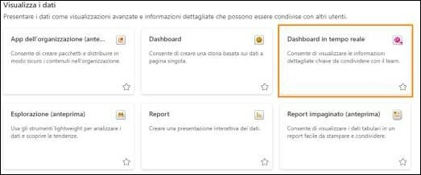
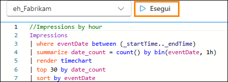
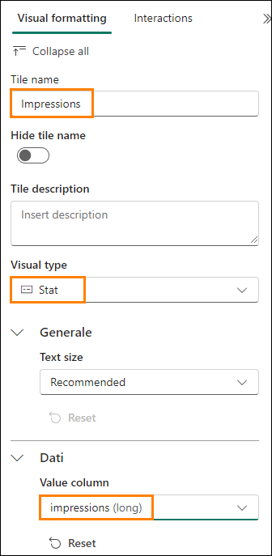

# Microsoft Fabric Real-Time Intelligence in a Day Lab 5

   

# Sommario
- Struttura del documento
- Introduzione
- Dashboard in tempo reale
    - Attività 1. Creazione di un dashboard in tempo reale
    - Attività 2. Connessione di un'origine dati al dashboard in tempo reale
    - Attività 3. Creazione di un riquadro del dashboard in tempo reale con KQL
    - Attività 4. Aggiunta di più riquadri al dashboard in tempo reale
    - Attività 5. Aggiunta di un oggetto visivo mappa per le impressioni in base all'ubicazione
    - Attività 6. Impostazione dell'aggiornamento automatico sul dashboard in tempo reale
    - Attività facoltativa 7. Aggiunta del logo aziendale
    - Attività facoltativa 8. Applicazione della formattazione condizionale all'oggetto visivo
- Riepilogo
- Riferimenti

 
# Struttura del documento

Il lab include i passaggi che l'utente deve seguire con gli screenshot associati che forniscono un aiuto visivo. In ogni screenshot vi sono sezioni evidenziate con riquadri arancioni che indicano le aree su cui l'utente deve concentrarsi.

# Introduzione

In questo lab si useranno i dati trasmessi in streaming, caricati nel database KQL e collegati in modo sintetico a un lakehouse tramite collegamenti per creare un dashboard in tempo reale per visualizzare e condividere le informazioni dettagliate dai flussi di dati ai quali si ha avuto accesso.

In questo lab si apprenderà quanto segue:
- Come creare un dashboard in tempo reale in Fabric
- Come usare KQL per scrivere query per popolare oggetti visivi in un dashboard
- Come aggiungere formattazione condizionale agli oggetti visivi del dashboard

# Dashboard in tempo reale

## Attività 1. Creazione di un dashboard in tempo reale

1. Aprire l'**area di lavoro Fabric** del corso.

    

2. Fare clic sul pulsante + **Nuovo elemento** per creare un nuovo elemento.
 
    

3. Verrà visualizzata una categoria per **Visualizza i dati**. Fare clic sull'elemento denominato **Dashboard in tempo reale**.

   

4. Assegnare al dashboard in tempo reale il nome **RTI Dashboard**, quindi fare clic su **Crea**.

    

5. Si dovrebbe immediatamente essere indirizzati a un'istanza vuota di un dashboard in tempo reale.

    
 
## Attività 2. Connessione di un'origine dati al dashboard in tempo reale

1. Nella barra multifunzione della Home page trovare l'opzione denominata **New data source** e fare clic su di essa.
   
      

2. Nel riquadro a comparsa visualizzato sul lato destro della schermata, fare clic su **Aggiungi +**, quindi scegliere **OneLake data hub**.
 
     

3. Apparirà un elenco delle origini disponibili in OneLake; saranno elencate solo le origini provenienti dai database KQL, quindi risulterà disponibile un'unica opzione, il database KQL **eh_Fabrikam**. Selezionare l'opzione.

    

4. Nella parte inferiore della schermata fare clic su **Connect**.

     
 
5. Ora sarà possibile creare l'origine dati. Fare clic sul pulsante **Add** nella parte inferiore del riquadro a comparsa.

    

6. Come si può notare, un'origine dati è stata aggiunta al dashboard in tempo reale. Da qui è possibile aggiungere ulteriori database KQL qualora se ne presentasse la necessità. Per ora, fare clic su **Chiudi** nella parte inferiore della finestra.
 
    

## Attività 3. Creazione di un riquadro del dashboard in tempo reale con KQL

1. Fare clic sul riquadro vuoto all'interno del dashboard per popolarlo con un oggetto visivo.

    

2. Per impostazione predefinita, si verrà connessi al database KQL creato in precedenza come origine. Da qui sarà possibile scrivere la propria query KQL per popolare questo oggetto visivo con i dati. Eliminare tutto il precedente markdown KQL presente per impostazione predefinita. Copiare e incollare la seguente query nella finestra di query.

    ```
    //Clicks by hour 

    Clicks

    | where eventDate between (_startTime.._endTime)

    | summarize date_count = count() by bin(eventDate, 1h)

    | render timechart

    | top 30 by date_count

    | sort by eventDate
    ```

3. Dopo aver configurato correttamente la query, eseguirla per visualizzare i risultati.
  
    

4. Notare che l'output potrebbe essere di un solo risultato. Questo perché l'**intervallo di tempo** è impostato in modo predefinito per questo riquadro. È disponibile un parametro con cui è possibile modificare l'intervallo di tempo per il quale vengono restituiti i dati. Il codice eventDate between (_startTime.._endTime) è quello che permette di sfruttare questo parametro. Modificare il parametro **Intervallo di tempo** impostandolo su **Ultime 3 ore** e osservare come cambia l'output.

    

5. Ora l'output della query dovrebbe includere i risultati dei clic nell'arco delle ultime 3 ore.
 
   

6. Sebbene questo parametro possa essere modificato, è comunque preferibile impostarlo come predefinito su un intervallo di tempo specifico anziché costringere gli utenti a modificarlo. Sopra l'opzione Intervallo di tempo, fare clic sull'opzione **@ Parametri**.
 
   

7. Fare clic sull'**icona della matita** per modificare il parametro **Intervallo di tempo**.

   

8. Modificare il **Valore predefinito** in **Ultime 24 ore** per visualizzare sempre l'ultimo giorno per impostazione predefinita. Al termine, fare clic su **Fatto**.

   

9. Chiudere il riquadro dei parametri.
 
10. Ora fare clic sul **pulsante + Aggiungi oggetto visivo** sopra i risultati della query.

    

11. Verrà visualizzato un nuovo riquadro a comparsa sul lato destro della schermata. Fare clic nella casella di testo sotto l'opzione **Tile name** per assegnare a questo oggetto visivo il nome **Clicks by Hour**.

    
 
12. Per impostazione predefinita, l'oggetto visivo usato per visualizzare i risultati di questa query KQL è una tabella. Questo potrebbe non essere il modo migliore per consentire agli altri utenti di comprendere immediatamente cosa sta accadendo con i risultati dei dati. Modificare il tipo di oggetto visivo da tabella a **grafico ad area**.

    

13. La nuova formattazione di questo oggetto visivo permette di comprendere meglio i picchi e levalli dei clic del sito di e-commerce usando il flusso di dati creato in precedenza in questa lezione.

    
 
14. Per salvare questo oggetto visivo nel dashboard, fare clic sul pulsante **Applica modifiche** nell'angolo in alto a destra della schermata.

    

15. Una volta posizionato questo oggetto visivo nel dashboard, c'è la possibilità che l'oggetto visivo continui a mostrare soltanto i risultati dell'ultima ora. Modificare il dashboard in modo che mostri un **Intervallo di tempo** uguale a **Ultime 24 ore**.

    
 
16. Aggiornare l'oggetto visivo e notare che i risultati cambiano leggermente per riflettere i dati ricevuti dall'ultima esecuzione della query.

    
 
## Attività 4. Aggiunta di più riquadri al dashboard in tempo reale

1. Dalla **barra multifunzione della Home page** nel dashboard in tempo reale fare clic sul pulsante **New tile**.

    

2. Immettere la seguente query KQL nel riquadro della query.

    ```
    //Impressions by hour Impressions

    | where eventDate between (_startTime.._endTime)

    | summarize date_count = count() by bin(eventDate, 1h)

    | render timechart

    | top 30 by date_count

    | sort by eventDate
     ```

3. Fare clic su **Esegui** per eseguire la query.
  
    

4. Fare clic sul pulsante + **Aggiungi oggetto visivo**.

   
 
5. Modificare l'oggetto visivo per cambiare il **nome riquadro** in **Impressions by Hour** e il **tipo di oggetto visivo** in **Area chart**.

   
 
6. Applicare le modifiche all'oggetto visivo.
    
    
 
7. Aggiungere un altro riquadro selezionando + **New tile**.

    

8. Copiare e incollare la seguente query nel riquadro delle query. Notare che questa è una query multi-istruzione che usa più istruzioni let e una query combinata tramite punto e virgola.
  
    ```  
    //Clicks, Impressions, CTR

    let imp = Impressions

    | where eventDate between (_startTime.._endTime)

    | extend dateOnly = substring(todatetime(eventDate).tostring(), 0, 10)

    | summarize imp_count = count() by dateOnly;

    let clck = Clicks

    | where eventDate between (_startTime.._endTime)

    | extend dateOnly = substring(todatetime(eventDate).tostring(), 0, 10)

    | summarize clck_count = count() by dateOnly;

    imp

    | join clck on $left.dateOnly == $right.dateOnly

    | project selected_date = dateOnly , impressions = imp_count , clicks = clck_count, CTR = clck_count * 100 / imp_count
    ```

9. Selezionare **Esegui** per eseguire la query e visualizzare i risultati.
   
     

10. Fare clic sul pulsante **+ Aggiungi oggetto visivo**.

11. Quando vengono visualizzate le impostazioni dell'oggetto visivo, modificare le seguenti impostazioni per creare un conteggio delle impressioni.

    - **Tile name**: Impressions
    
    - **Visual type**: Stat
    
    - **Value column**: impressions (long)
 
      
 
12. Scegliere **Applica modifiche** una volta completata la configurazione di tutte le impostazioni.

    

13. Nel nuovo riquadro, fare clic sui puntini di sospensione (…) e selezionare **Duplica riquadro** per duplicare il riquadro.

    
 
14. Fare clic sull'**icona della matita** per il riquadro duplicato per modificare le configurazioni.

     

15. Rinominare questo **nome riquadro** in **Clicks** e modificare la **colonna Valore** in **clicks (long)**.

    
 
16. Applicare le modifiche a questo oggetto visivo.

17. Duplicare ancora una volta uno dei nuovi riquadri per creare un oggetto visivo di tipo statistica finale.

    
 
18. Modificare il nuovo riquadro per cambiare il **nome riquadro** in **Click Through Rate** e la **colonna Valore** in **CTR (long)**.

    

19. Applicare le modifiche.

20. Se i riquadri sono separati o si desidera riorganizzarli, è possibile passare il mouse sul riquadro finché non compare l'icona di una mano, quindi trascinare e rilasciare l'oggetto visivo nella posizione desiderata.

    

## Attività 5. Aggiunta di un oggetto visivo mappa per le impressioni in base all'ubicazione

1. Aggiungere un **nuovo riquadro** al dashboard in tempo reale.
   
    

2. Copiare e incollare la seguente query nel riquadro delle query. Questa query estrae latitudine e longitudine dalla colonna Ip address di questo flusso di dati per generare un'ubicazione che è possibile tracciare su una mappa. La query potrebbe richiedere un po' più di tempo rispetto alle precedenti.
  
    ``` 
    //Impressions by location

    Impressions

    | where eventDate between (_startTime.._endTime)

    | join external_table('products') on $left.productId == $right.ProductID

    | project lon = toreal(geo_info_from_ip_address(ip_address).longitude), lat = toreal(geo_info_from_ip_address(ip_address).latitude), Name

    | render scatterchart with (kind = map) //, xcolumn=lon, ycolumns=lat)
    ```

3. Eseguire la query per verificare che la configurazione sia corretta. Fare clic sul pulsante **+ Aggiungi oggetto visivo**.

    

4. Modificare il **nome riquadro** in **Impressions by Location** e il **tipo di oggetto visivo** in **Map**.

    
 
5. Nell'area **Visual type** verificare che la latitudine e la longitudine siano correttamente selezionate modificando l'opzione **Definisci posizione per** in **Latitudine e longitudine**, quindi controllare che i restanti campi siano impostati come nell'immagine di seguito.

    

6. Applicare le modifiche.

7. Per aumentare le dimensioni dell'oggetto visivo, agganciare il punto di ancoraggio in basso a sinistra dell'oggetto visivo di tipo mappa.

   
 
8. Tutti gli oggetti visivi sono ridimensionabili e spostabili. È quindi possibile disporli in base alle proprie preferenze.
   
    

9. Salvare le modifiche.

    
 
## Attività 6. Impostazione dell'aggiornamento automatico sul dashboard in tempo reale

1. Fare clic sulla **barra multifunzione Gestisci**, quindi selezionare l'opzione **Aggiornamento automatico**.

   

2. Attivare l'interruttore per abilitare l'**Aggiornamento automatico**.

    
 
3. Modificare l'**Intervallo di tempo minimo** impostandolo su 30 secondi e la **Frequenza di aggiornamento predefinita** impostandola su 1 minuto.

    

4. Fare clic su **Applica** nella parte inferiore della finestra.

5. Nell'angolo in alto a destra del menu, fare clic sul **pulsante Modifica** e modificarlo in **Visualizzazione** per vedere quale sarà l'esperienza degli utenti finali con questo dashboard in tempo reale.

     

6. Se il tempo lo consente e si è interessati a recuperare un logo aziendale o ad applicare la formattazione condizionale agli oggetti visivi come mostrato di seguito, è possibile #svolgere le attività facoltative indicate di seguito. In caso contrario, il lab è terminato!

     

## Attività facoltativa 7. Aggiunta del logo aziendale

1. Proprio come in precedenza, passiamo dalla modalità **Visualizzazione** del dashboard alla modalità **Modifica**
 
    

2. Fare clic sul pulsante nella barra multifunzione della Home page denominato **New text tile**.

    

3. Copiare e incollare il seguente codice markdown nella finestra di query.

    

4. Applicare le modifiche.

5. Ridimensionare e spostare il riquadro per adattarlo in un punto qualsiasi del dashboard in tempo reale.

   
 
6. Salvare le modifiche.

   

## Attività facoltativa 8. Applicazione della formattazione condizionale all'oggetto visivo

1. Fare clic sull'**icona della matita** sull'oggetto visivo **Click Through Rate**.

    

2. Nella parte inferiore del riquadro di formattazione dell'oggetto visivo, fare clic sul pulsante **+ Add rule** sotto **Formattazione condizionale**.

    

3. Fare clic sull'**icona della matita** per modificare la regola di formattazione condizionale.

   
 
4. Modificare le condizioni della regola in modo che punti alla **colonna** denominata **CTR (long)** e impostare la regola su **> 10** per l'operatore e il valore.

   

5. È possibile modificare liberamente la formattazione. Finché il valore CTR è maggiore di 10, l'elemento apparirà su quell'oggetto visivo.

   

6. Fare clic sul pulsante **Salva** nel riquadro Formattazione condizionale.

   

7. Applicare le modifiche.

8. Salvare le modifiche.

   
 
# Riepilogo

In questo lab gli utenti hanno creato un dashboard in tempo reale e l'hanno collegato al database KQL. Abbiamo visto che usando il linguaggio KQL per curare le query, possiamo poi visualizzarei risultati in molti modi, con ogni oggetto visivo dotato di una propria configurazione. Abbiamo anche visto come possiamo modificare il parametro predefinito disponibile nel dashboard e fare in modo
che il dashboard si aggiorni automaticamente.

# Riferimenti

Fabric Real-time Intelligence in a Day (RTIIAD) presenta alcune delle funzioni chiave disponibili in Microsoft Fabric. Nel menu di servizio, la sezione Guida (?) include collegamenti ad alcune risorse utili.


Di seguito sono riportate ulteriori risorse utili che consentiranno di progredire nell’uso di Microsoft Fabric.
- Fare riferimento al post del blog per leggere l’[annuncio completo sulla disponibilità generale di Microsoft Fabric](https://aka.ms/Fabric-Hero-Blog-Ignite23)
- Esplorare Fabric tramite la [Presentazione guidata](https://aka.ms/Fabric-GuidedTour)
- Iscriversi alla [versione di valutazione gratuita di Microsoft Fabric](https://aka.ms/try-fabric)
- Visitare [il sito Web di Microsoft Fabric](https://aka.ms/microsoft-fabric)
- Acquisire nuove competenze esplorando i [moduli di apprendimento di Fabric](https://aka.ms/learn-fabric)
- Consultare la [documentazione tecnica di Fabric](https://aka.ms/fabric-docs)
- Leggere [l’e-book gratuito introduttivo a Fabric](https://aka.ms/fabric-get-started-ebook)
- Unirsi alla [community di Fabric](https://aka.ms/fabric-community) per pubblicare domande, condividere feedback e imparare dagli altri

Leggere i blog di annunci più approfonditi sull’esperienza Fabric:

- [Blog sull’esperienza Data Factory in Fabric](https://aka.ms/Fabric-Data-Factory-Blog)
- [Blog sull’esperienza Synapse DataEngineering in Fabric](https://aka.ms/Fabric-Data-Factory-Blog)
- [Blog sull’esperienza Synapse Data Science in Fabric](https://aka.ms/Fabric-DS-Blog)
- [Blog sull’esperienza Synapse Data Warehousing in Fabric](https://aka.ms/Fabric-DW-Blog)
- [Blog sull’esperienza Real-Time Intelligence in Fabric](https://blog.fabric.microsoft.com/en-us/blog/category/real-time-intelligence)
- [Blog di annunci di Power BI](https://aka.ms/Fabric-PBI-Blog)
- [Blog sull’esperienza Data Activator in Fabric](https://aka.ms/Fabric-DA-Blog)
- [Blog su amministrazione e governance in Fabric](https://aka.ms/Fabric-Admin-Gov-Blog)
- [Blog su OneLake in Fabric](https://aka.ms/Fabric-OneLake-Blog)
- [Blog sull’integrazione di Dataverse e Microsoft Fabric](https://aka.ms/Dataverse-Fabric-Blog)

© 2024 Microsoft Corporation. Tutti i diritti sono riservati.

L'uso della demo/del lab implica l'accettazione delle seguenti condizioni:

La tecnologia/le funzionalità descritte nella demo/nel lab sono fornite da Microsoft Corporation allo scopo di ottenere feedback dall'utente e offrire un'esperienza di apprendimento. L'utilizzo della demo/del lab è consentito solo per la valutazione delle caratteristiche e delle funzionalità di tale tecnologia e per l'invio di feedback a Microsoft. L'utilizzo per qualsiasi altro scopo nonè consentito. È vietato modificare, copiare, distribuire, trasmettere, visualizzare, eseguire, riprodurre, pubblicare, concedere in licenza, usare per la creazione di lavori derivati,
trasferire o vendere questa demo/questo lab o parte di essi.

SONO ESPLICITAMENTE PROIBITE LA COPIA E LA RIPRODUZIONE DELLA DEMO/DEL LAB (O DI QUALSIASI PARTE DI ESSI) IN QUALSIASI ALTRO SERVER O IN QUALSIASI ALTRA
POSIZIONE PER ULTERIORE RIPRODUZIONE O RIDISTRIBUZIONE.QUESTA DEMO/QUESTO LAB RENDONO DISPONIBILI TECNOLOGIE SOFTWARE/FUNZIONALITÀ DI PRODOTTO SPECIFICHE, INCLUSI NUOVI CONCETTI E NUOVE FUNZIONALITÀ POTENZIALI, IN UN AMBIENTE SIMULATO, CON UN'INSTALLAZIONE E UNA CONFIGURAZIONE PRIVE DI COMPLESSITÀ, PER GLI SCOPI DESCRITTI IN PRECEDENZA. LA TECNOLOGIA/I CONCETTI RAPPRESENTATI IN QUESTA DEMO/IN QUESTO LAB POTREBBERO NON CONTENERE LE
FUNZIONALITÀ COMPLETE E IL LORO FUNZIONAMENTO POTREBBE NON ESSERE LO STESSO DELLA VERSIONE FINALE. È ANCHE POSSIBILE CHE UNA VERSIONE FINALE DI TALI FUNZIONALITÀ O CONCETTI NON VENGA RILASCIATA. L'ESPERIENZA D'USO DI TALI CARATTERISTICHE E FUNZIONALITÀ PUÒ INOLTRE RISULTARE DIVERSA IN UN AMBIENTE FISICO.

**FEEDBACK.** L'invio a Microsoft di feedback sulle caratteristiche, sulle funzionalità e/o sui concetti della tecnologia descritti in questa demo/questo lab implica la concessione a Microsoft, a titolo gratuito, del diritto di usare, condividere e commercializzare tale feedback in qualsiasi modo e per qualsiasi scopo. Implica anche la concessione a titolo gratuito a terze parti del diritto di utilizzo di eventuali brevetti necessari per i loro prodotti, le loro tecnologie e i loro servizi al fine di usare o interfacciarsi ai componenti software o ai servizi Microsoft specifici che includono il feedback.
L'utente si impegna a non inviare feedback la cui inclusione all'interno di software o documentazione Microsoft imponga a Microsoft di concedere in licenza a terze parti tale software o documentazione. Questi diritti sussisteranno anche dopo la scadenza del presente contratto.
 
CON LA PRESENTE MICROSOFT CORPORATION NON RICONOSCE ALCUNA GARANZIA E CONDIZIONE RELATIVAMENTE ALLA DEMO/AL LAB, INCLUSE TUTTE LE GARANZIE E CONDIZIONI DI COMMERCIABILITÀ, DI FATTO ESPRESSE, IMPLICITE O PRESCRITTE DALLA LEGGE, ADEGUATEZZA PER UNO SCOPO SPECIFICO, TITOLARITÀ E NON VIOLABILITÀ. MICROSOFT NON OFFRE GARANZIE O RAPPRESENTAZIONI IN RELAZIONE ALL'ACCURATEZZA DEI RISULTATI E DELL'OUTPUT DERIVANTI DALL'USO DELLA DEMO/DEL LAB O ALL'ADEGUATEZZA DELLE INFORMAZIONI CONTENUTE NELLA DEMO/NEL LAB PER QUALSIASI SCOPO.

**CLAUSOLA DI RESPONSABILITÀ**

Questa demo/questo lab contiene solo una parte delle nuove funzionalità e dei miglioramenti in Microsoft Power BI. Alcune funzionalità potrebbero cambiare nelle versioni future del prodotto. In questa demo/in questo lab si apprendono alcune delle nuove funzionalità, ma non tutte.
