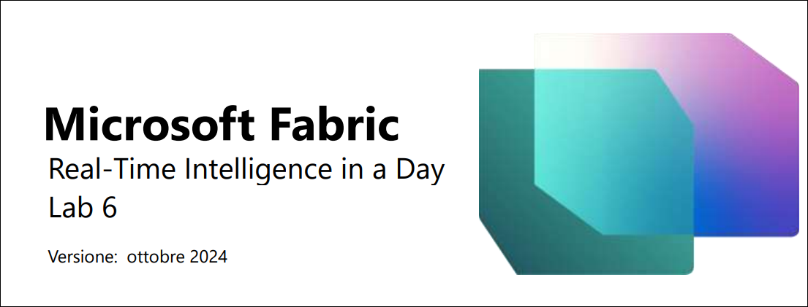
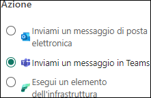
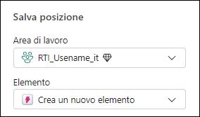

# Microsoft Fabric Real-Time Intelligence in a Day Lab 6

 
# Sommario
- Struttura del documento
- Introduzione
- Creazione di un avviso con Reflex
    - Attività 1. Uso del dashboard in tempo reale per impostare gli avvisi
    - Attività 2. Test dell'avviso e-mail dall'esperienza Reflex
    - Attività 3. Creazione di un nuovo oggetto Reflex dal flusso di dati
- Pulizia delle risorse
    - Attività 4. Pulizia dell'area di lavoro
- Riepilogo
- Riferimenti
 
# Struttura del documento

Il lab include i passaggi che l'utente deve seguire con gli screenshot associati che forniscono un aiuto visivo. In ogni screenshot vi sono sezioni evidenziate con riquadri arancioni che indicano le aree su cui l'utente deve concentrarsi.

# Introduzione

In questo lab verrà illustrato come sfruttare Data Activator per creare un Reflex che invii avvisi dal dashboard in tempo reale appena creato. Verrà inoltre spiegato come estendere l'utilizzo di Reflex per creare avvisi personalizzati aggiuntivi sui dati trasmessi in streaming nell'Eventhouse

In questo lab si apprenderà quanto segue:
- Come creare un Reflex dall'opzione di avviso su un dashboard in tempo reale
- Come usare gli elementi Reflex di Data Activator per creare più avvisi personalizzati

# Creazione di un avviso con Reflex

## Attività 1. Uso del dashboard in tempo reale per impostare gli avvisi

1. Aprire l'**area di lavoro Fabric** del corso e selezionare il dashboard in tempo reale creato nell'ultimo lab.

   

2. Nella oggetto visivo **Click Through Rate** fare clic sui puntini di sospensione (…) e selezionare l'opzione **Set alert**.

   

3. Si apre un nuovo riquadro a comparsa sul lato destro della schermata. È possibile vedere cosa si sta monitorando dal dashboard, incluso l'oggetto visivo specifico a cui sarà affiliato l'avviso.Ricordare che si ha il pieno controllo sulla condizione. Modificare la **Condizione** in **È minore di**.

    
 
4. Verrà visualizzato un nuovo campo in cui inserire un **Valore**; modificarlo in **20**.

    

5. Al momento sono disponibili tre possibili azioni per il tipo di avviso che si desidera ricevere una volta che l'elemento Reflex di Data Activator riconosce che la condizione è stata soddisfatta.Selezionare l'opzione **Inviami un messaggio in Teams**.

    

6. Infine, occorre decidere l'ubicazione nella quale archiviare l'**elemento Reflex** che si sta creando con questo avviso. Per impostazione predefinita dovrebbe essere selezionata l'area di lavoro corrente, ma è necessario richiamare specificamente un **Nuovo elemento** nel menu a discesa Elemento.

     

7. Rinominare l'elemento in **CTR Reflex**, quindi fare clic su **Crea**. L'operazione di creazione richiederà alcuni istanti.

    

8. Si riceverà una convalida di creazione dell'avviso dell'elemento Reflex. Fare clic sul pulsante **Apri** per aprire il Reflex.

   
 
9. Si accederà così all'**esperienza Reflex** formale. Da qui è possibile monitorare il flusso di dati in tempo reale, visualizzare i dati usati per supportare il Reflex e creare trigger aggiuntivi dallo stesso flusso.

    

## Attività 2. Test dell'avviso e-mail dall'esperienza Reflex

1. Nell'esperienza Reflex, fare clic sull'icona della matita accanto al nome dell'evento e rinominarlo **CTR is less than 20**

   

2. Aggiornare anche l'**Intestazione** e il **Messaggio** che si trovano nella sezione **Azione** sul lato destro. Aggiornare le due aree in modo che corrispondano all'immagine seguente, quindi fare clic su **Salva e aggiorna**.

    

3. Nella stessa sezione **Azione** sul lato destro, fare clic sul pulsante **Inviami un'azione di test** per ottenere un messaggio di esempio in Teams da Reflex.

    

4. Aprire una nuova scheda all'interno del browser Edge dell'ambiente e andare a **Teams.Microsoft.com**.

5. Accedere con le credenziali del proprio ambiente, se richieste. Potrebbe apparire un messaggio che chiede di avviare una versione di valutazione, che andrà accettato.
 
6. In Teams dovrebbe essere presente un messaggio indicante che il CTR è inferiore a 20.

    

7. Tornare all'esperienza Reflex per creare un altro trigger.

## Attività 3. Creazione di un nuovo oggetto Reflex dal flusso di dati

1. Selezionare l'oggetto etichettato **KQL Source Event**, quindi **Nuova regola**.

    

2. Fare clic sull'icona della **matita** e assegnare alla regola il nome **Clicks Greater Than 30,000**(è possibile scegliere un valore che sia più in linea con la quantità di dati trasmessi in streaming).

    

3. Per iniziare, è necessario monitorare una delle colonne del flusso di dati; per fare ciò, occorre configurare le sezioni Condizione e Azione. Fare clic sulla scheda Definizione della regola per impostare le condizioni e l'azione.
 
4. Nella pagina Definizione che si apre, in **Condizione** selezionare le seguenti proprietà:
   
    - **Operazione** = È maggiore di
    - **Colonna** = clicks
    - **Valore** = 30000

      

5. In **Azione** selezionare le seguenti proprietà:

    - **Tipo** = Teams message
    - **Destinatari** = {ID utente}

      

6. Infine, fare clic su **Salva e aggiorna** per avviare questa regola

    

7. Ora si dispone di due trigger che monitorano lo stesso flusso di dati.

    

# Pulizia delle risorse

## Attività 4. Pulizia dell'area di lavoro

1. Questo è l'ultimo lab e l'ultima parte di Real-Time Analytics in a Day. Se si è già completato il lab e non si hanno ulteriori domande o esigenze da sottoporre al docente in merito ai contenuti, provvedere a deallocare l'area di lavoro. Passare all'area di lavoro **RTI_username**.

   

2. Fare clic su **Impostazioni area di lavoro** nell'angolo in alto a destra.

   

3. Dalle impostazioni dell'area di lavoro **Generale** scorrere verso il basso e fare clic sul pulsante **Rimuovere questa area di lavoro**.

   

4. Lab e lezione completati!
 
# Riepilogo

In questo lab abbiamo preso in esame l'uso di Data Activator. Questa funzionalità permette di connettersi direttamente al dashboard in tempo reale o ai flussi di dati e creare trigger su tali dati. Questi trigger possono quindi essere configurati con condizioni di rilevamento e, una volta soddisfatte tali condizioni, è possibile intraprendere azioni. In questo lab abbiamo usato la funzionalità di invio di un messaggio e-mail quando venivano soddisfatte determinate condizioni nei trigger. Data Activator è ancora in anteprima, quindi in futuro potrebbero essere disponibili nuove azioni.

# Riferimenti

Fabric Real-time Intelligence in a Day (RTIIAD) presenta alcune delle funzioni chiave disponibili in Microsoft Fabric. Nel menu di servizio, la sezione Guida (?) include collegamenti ad alcune risorse utili.

Di seguito sono riportate ulteriori risorse utili che consentiranno di progredire nell’uso di Microsoft Fabric.

- Fare riferimento al post del blog per leggere l’[annuncio completo sulla disponibilità generale di Microsoft Fabric](https://aka.ms/Fabric-Hero-Blog-Ignite23)
- Esplorare Fabric tramite la [Presentazione guidata](https://aka.ms/Fabric-GuidedTour)
- Iscriversi alla [versione di valutazione gratuita di Microsoft Fabric](https://aka.ms/try-fabric)
- Visitare [il sito Web di Microsoft Fabric](https://aka.ms/microsoft-fabric)
- Acquisire nuove competenze esplorando i [moduli di apprendimento di Fabric](https://aka.ms/learn-fabric)
- Consultare la [documentazione tecnica di Fabric](https://aka.ms/fabric-docs)
- Leggere [l’e-book gratuito introduttivo a Fabric](https://aka.ms/fabric-get-started-ebook)
- Unirsi alla [community di Fabric](https://aka.ms/fabric-community) per pubblicare domande, condividere feedback e imparare dagli altri

Leggere i blog di annunci più approfonditi sull’esperienza Fabric:

- [Blog sull’esperienza Data Factory in Fabric](https://aka.ms/Fabric-Data-Factory-Blog)
- [Blog sull’esperienza Synapse DataEngineering in Fabric](https://aka.ms/Fabric-Data-Factory-Blog)
- [Blog sull’esperienza Synapse Data Science in Fabric](https://aka.ms/Fabric-DS-Blog)
- [Blog sull’esperienza Synapse Data Warehousing in Fabric](https://aka.ms/Fabric-DW-Blog)
- [Blog sull’esperienza Real-Time Intelligence in Fabric](https://blog.fabric.microsoft.com/en-us/blog/category/real-time-intelligence)
- [Blog di annunci di Power BI](https://aka.ms/Fabric-PBI-Blog)
- [Blog sull’esperienza Data Activator in Fabric](https://aka.ms/Fabric-DA-Blog)
- [Blog su amministrazione e governance in Fabric](https://aka.ms/Fabric-Admin-Gov-Blog)
- [Blog su OneLake in Fabric](https://aka.ms/Fabric-OneLake-Blog)
- [Blog sull’integrazione di Dataverse e Microsoft Fabric](https://aka.ms/Dataverse-Fabric-Blog)

© 2024 Microsoft Corporation. Tutti i diritti sono riservati.

L'uso della demo/del lab implica l'accettazione delle seguenti condizioni:

La tecnologia/le funzionalità descritte nella demo/nel lab sono fornite da Microsoft Corporation allo scopo di ottenere feedback dall'utente e offrire un'esperienza di apprendimento. L'utilizzo della demo/del lab è consentito solo per la valutazione delle caratteristiche e delle funzionalità di tale tecnologia e per l'invio di feedback a Microsoft. L'utilizzo per qualsiasi altro scopo non è consentito. È vietato modificare, copiare, distribuire, trasmettere, visualizzare, eseguire, riprodurre, pubblicare, concedere in licenza, usare per la creazione di lavori derivati, trasferire o vendere questa demo/questo lab o parte di essi.

SONO ESPLICITAMENTE PROIBITE LA COPIA E LA RIPRODUZIONE DELLA DEMO/DEL LAB (O DI QUALSIASI PARTE DI ESSI) IN QUALSIASI ALTRO SERVER O IN QUALSIASI ALTRA POSIZIONE PER ULTERIORE RIPRODUZIONE O RIDISTRIBUZIONE.

QUESTA DEMO/QUESTO LAB RENDONO DISPONIBILI TECNOLOGIE SOFTWARE/FUNZIONALITÀ DI PRODOTTO SPECIFICHE, INCLUSI NUOVI CONCETTI E NUOVE FUNZIONALITÀ POTENZIALI, IN UN AMBIENTE SIMULATO, CON UN'INSTALLAZIONE E UNA CONFIGURAZIONE PRIVE DI COMPLESSITÀ, PER GLI SCOPI DESCRITTI IN PRECEDENZA. LA TECNOLOGIA/I CONCETTI RAPPRESENTATI IN QUESTA DEMO/IN QUESTO LAB POTREBBERO NON CONTENERE LE FUNZIONALITÀ COMPLETE E IL LORO FUNZIONAMENTO POTREBBE NON ESSERE LO STESSO DELLA VERSIONE FINALE. È ANCHE POSSIBILE CHE UNA VERSIONE FINALE DI TALI FUNZIONALITÀ O CONCETTI NON VENGA RILASCIATA. L'ESPERIENZA D'USO DI TALI CARATTERISTICHE E FUNZIONALITÀ PUÒ INOLTRE RISULTARE DIVERSA IN UN AMBIENTE FISICO.

**FEEDBACK.** L'invio a Microsoft di feedback sulle caratteristiche, sulle funzionalità e/o sui concetti della tecnologia descritti in questa demo/questo lab implica la concessione a Microsoft, a titolo gratuito, del diritto di usare, condividere e commercializzare tale feedback in qualsiasi modo e per qualsiasi scopo. Implica anche la concessione a titolo gratuito a terze parti del diritto di
utilizzo di eventuali brevetti necessari per i loro prodotti, le loro tecnologie e i loro servizi al fine di usare o interfacciarsi ai componenti software o ai servizi Microsoft specifici che includono il feedback. L'utente si impegna a non inviare feedback la cui inclusione all'interno di software
o documentazione Microsoft imponga a Microsoft di concedere in licenza a terze parti tale software o documentazione. Questi diritti sussisteranno anche dopo la scadenza del presente contratto.
 
CON LA PRESENTE MICROSOFT CORPORATION NON RICONOSCE ALCUNA GARANZIA E CONDIZIONE RELATIVAMENTE ALLA DEMO/AL LAB, INCLUSE TUTTE LE GARANZIE E CONDIZIONI DI COMMERCIABILITÀ, DI FATTO ESPRESSE, IMPLICITE O PRESCRITTE DALLA LEGGE,ADEGUATEZZA PER UNO SCOPO SPECIFICO, TITOLARITÀ E NON VIOLABILITÀ. MICROSOFT NON OFFRE GARANZIE O RAPPRESENTAZIONI IN RELAZIONE ALL'ACCURATEZZA DEI RISULTATI E DELL'OUTPUT DERIVANTI DALL'USO DELLA DEMO/DEL LAB O ALL'ADEGUATEZZA DELLE INFORMAZIONI CONTENUTE NELLA DEMO/NEL LAB PER QUALSIASI SCOPO.

**CLAUSOLA DI RESPONSABILITÀ**

Questa demo/questo lab contiene solo una parte delle nuove funzionalità e dei miglioramenti in Microsoft Power BI. Alcune funzionalità potrebbero cambiare nelle versioni future del prodotto. In questa demo/in questo lab si apprendono alcune delle nuove funzionalità, ma non tutte.
