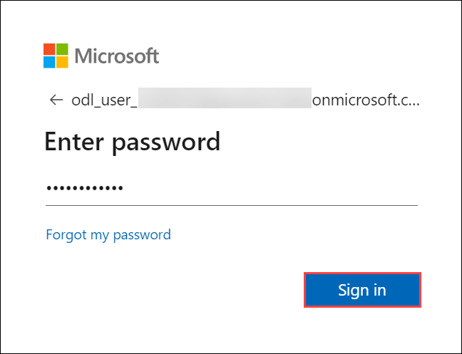

# Introduzione all'intelligence in tempo reale in un giorno

Benvenuti al workshop Real-Time Analytics! Oggi, ti immergerai nella configurazione di una pipeline di dati in tempo reale, la integrerai con motori di analisi e creerai dashboard live per ottenere informazioni immediate dai dati in streaming.

## Accesso all'ambiente di laboratorio

1. Quando sarai pronto a immergerti, la tua macchina virtuale e la guida di laboratorio saranno a portata di mano nel tuo browser web.

    

### Macchina virtuale e guida di laboratorio

La tua macchina virtuale è il tuo cavallo di battaglia durante tutto il workshop. La guida di laboratorio è la tua tabella di marcia verso il successo.

## Esplorazione delle risorse di laboratorio

1. Per comprendere meglio le risorse e le credenziali del tuo laboratorio, vai alla scheda **Ambiente**.

    

## Utilizzo della funzionalità Finestra divisa

1. Per comodità, puoi aprire la guida del laboratorio in una finestra separata selezionando il pulsante **Finestra divisa** nell'angolo in alto a destra.

    

## Gestione della macchina virtuale

1. Sentiti libero di avviare, arrestare o riavviare la macchina virtuale in base alle tue esigenze dalla scheda **Risorse**. La tua esperienza è nelle tue mani!

    

## Iniziamo con il portale di Azure

1. Sulla macchina virtuale, fai clic sull'icona del portale di Azure come mostrato di seguito:

    

1. Visualizzerai la scheda **Accedi a Microsoft Azure**. Qui, inserisci le tue credenziali:

- **Email/Nome utente:** <inject key="AzureAdUserEmail"></inject>

    

3. Quindi, fornisci la tua password:

- **Password:** <inject key="AzureAdUserPassword"></inject>

    

4. Se ti viene chiesto di rimanere connesso, puoi fare clic su "No".

5. Se viene visualizzata una finestra pop-up **Benvenuto in Microsoft Azure**, fai clic su "**Annulla**" per saltare il tour.

6. Fai clic su "Avanti" nell'angolo in basso a destra per iniziare il tuo viaggio in Lab!

    

Ora sei pronto per esplorare il potente mondo della tecnologia. Sentiti libero di contattarci se hai domande lungo il percorso. Goditi il ​​tuo workshop!
