# Microsoft Fabric Real-Time Intelligence in a Day ラボ 1

 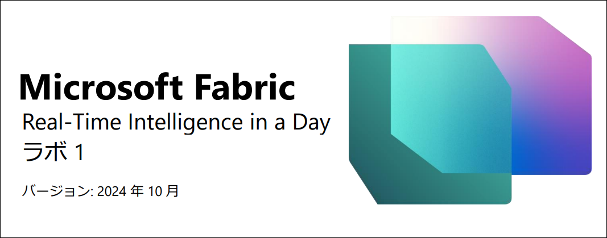

# 目次

- ドキュメントの構造	

- シナリオ/ 問題の説明	

- 概要	

- Fabric ライセンス	

  - タスク1: Microsoft Fabric 試用版ライセンスを有効にする	

- Real-Time Intelligence とリアルタイムハブ	

    - タスク2: Real-Time Intelligence エクスペリエンスの各項目	

    - タスク3: リアルタイムハブ	

- ワークスペースとEventhouse を作成する	

    - タスク4: Fabric ワークスペースを作成する

    - タスク5: Eventhouse を作成する	

- 参考資料	

 
# ドキュメントの構造

このラボでは、実行する手順だけでなく、視覚的にわかりやすいように、手順に関連するスクリーンショットも提示されます。各スクリーンショットでは、ユーザーが注目する必要のある領域が、オレンジのボックスで強調表示されて示されます。

# シナリオ/ 問題の説明

Fabrikam は、さまざまなアウトドア設備やアクセサリに特化した e コマース会社です。この会社はオンラインプラットフォームを通じて世界中の小売顧客と取引しており、新たな国際市場でプレゼンスを高めることを計画しています。e コマースサイトからリアルタイムの分析情報を取得し、経営幹部が正確な情報に基づくタイムリーな意思決定を行えるようにするという新たな構想があります。

あなたは営業チームの分析エンジニアとして、データ セットの収集、クリーニング、解釈を行い、ビジネス上の問題を解決する任務を負っています。あなたは、バッチ データパイプラインの作成と管理、チャートやグラフなどの視覚化の作成、包括的なセマンティック モデルおよびレポートの作成と最適化を行い、調査結果を組織内の意思決定者に提示する必要があります。

## 現在の課題

- e コマースのWeb サイトから継続的にストリーム配信されるリアルタイムデータを処理する必要があります。それには堅牢かつスケーラブルなアーキテクチャが必要です。

- ペースの速いオンライン販売に合わせて確実にリアルタイムのデータ処理と分析を実行します。

- ユーザーの対話、トランザクション、Web サイト活動によって生成されるデータの量と速度に対処します。

- リアルタイムのストリーミングデータを履歴データと統合して包括的な分析を行います。

- Eventhouse 環境でメダリオンアーキテクチャを使い、効率的にデータフローを構築します。

- レイクハウス内でEventhouse データを活用します

- Microsoft Fabric を活用して上記の課題に対処することに関心を持っています。 Eventhouse、KQL データベース、Eventstream を使用して、回復性がある効率的なデータ処理パイプラインを構築します。
 
# 概要

今日は、Microsoft Fabric のさまざまな主要機能について学習します。この入門ワークショップでは、Fabric で利用できる製品のさまざまなエクスペリエンスやアイテムを紹介します。このワークショップを終了すると、Eventhouse、データ パイプライン、Eventstream、KQL クエリセット、リアルタイムダッシュボードの使い方がわかります。
このラボを終了すると、次のことが学べます。

- Fabric のペルソナの確認方法
- Fabric ワークスペースの作成方法
- Eventhouse の作成方法

# Fabric ライセンス

## タスク 1: Microsoft Fabric 試用版ライセンスを有効にする

1.	デスクトップで **Microsoft Edge ブラウザー**を開き、https://app.fabric.microsoft.com/ に移動します。ログイン ページが表示されます。**注:** ラボ環境を使用しておらず、Power BI ア カウントを既にお持ちの場合は、ブラウザーをプライベート モードやシークレット モードで使用することをお勧めします。

    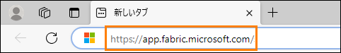

2.	**環境変数**タブ([ラボガイド] タブの横) で確認できる**ユーザー名を電子メール**として入力して、**送信**をクリックします。
 
    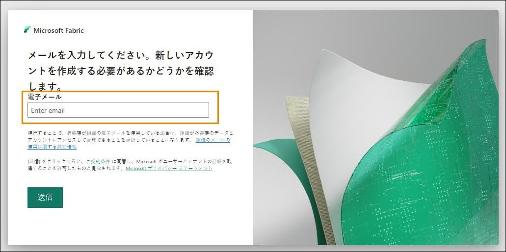
 
3.	**パスワード**画面が表示されます。**環境変数**タブ([ラボガイド] タブの横) で確認できる、講師から提供された**パスワード**を入力します。

4.	**サインイン**をクリックし、プロンプトに従って Fabric にサインインします。

    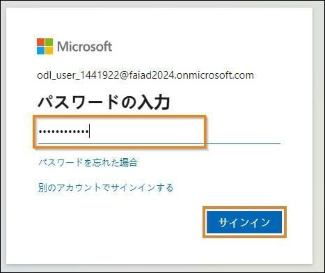

5.	**Fabric のホーム**が開きます。

    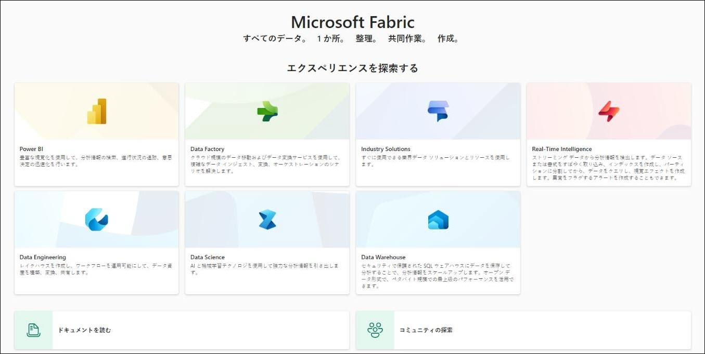

    Fabric のアイテムを操作するには、試用版ライセンスのほか、ワークスペースにFabric ライセンスが必要です。設定を始めましょう。

6.	画面右上の**ユーザーアイコン**を選択します。

7.	**無料試用版**を選択します。
 
     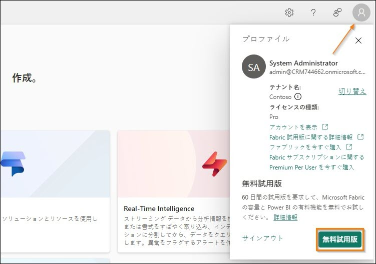

8.	Microsoft Fabric の無料試用版にアップグレードするダイアログが開きます。**アクティブ化**を選択します。

    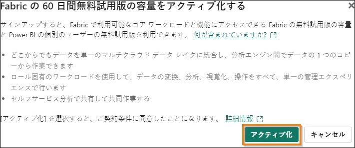

9.	Microsoft Fabric へのアップグレード成功のダイアログが開きます。Fabric Home Page を選択します。

    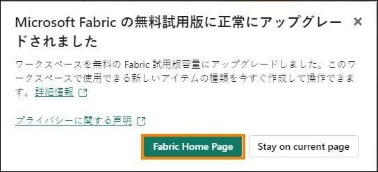
 
10.	Microsoft Fabric のホームページに戻ります。

    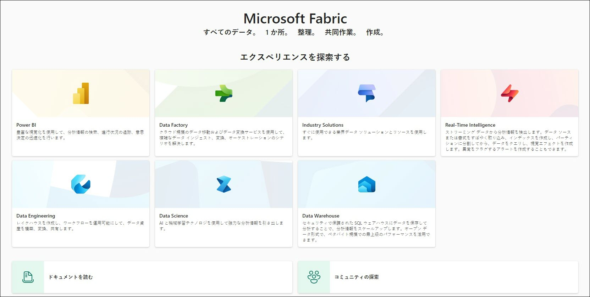

# Real-Time Intelligence とリアルタイムハブ

## タスク 2: Real-Time Intelligence エクスペリエンスの各項目

1.	Real-Time Intelligence エクスペリエンスをクリックします。

     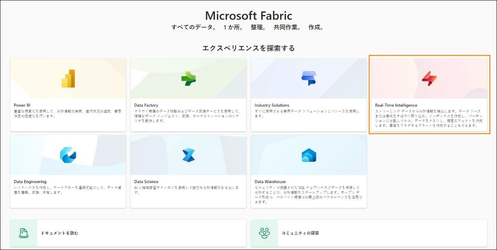

2.	**Real-Time Intelligence のホームページ**が表示されます。**タスクフローテンプレート、作成する推奨項目**、**Real-Time Intelligence の詳細**のカテゴリが表示されます。**推奨**カテゴリには次の項目があります。

    a. **イベントハウス**: 1 つまたは複数のKQL データベースのワークスペースを作成するために使います。これはプロジェクト間で共有できます。Eventhouse 内にも
    KQL データベースが作成されます。
    
    b. **KQL クエリセット**: データに対してクエリを実行し、共有可能なテーブルとビジュアルを生成するために使用されます。

    c. **リアルタイムダッシュボード**: タイルのコレクションです。必要に応じてページで整理でき、各タイルは基になるクエリと視覚的表現を持ちます。

    d. **Eventstream**: リアルタイムイベントストリームのキャプチャ、変換、ルーティングに使用されます。

    e. **Reflex**: 変化するデータからパターンや条件が検出されたときに自動的にアクションを実行するために使います。

    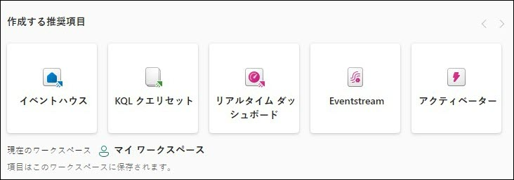

## タスク 3: リアルタイムハブ

1.	画面左側の[Fabric] ナビゲーションウィンドウ内にある**リアルタイムハブ**をクリックします。

    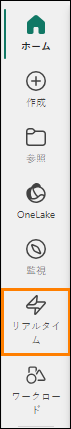
 
2.	**リアルタイムハブへようこそ**ダイアログが開き、**ツアーを見る**または**開始する**を自由に
選択できます。

    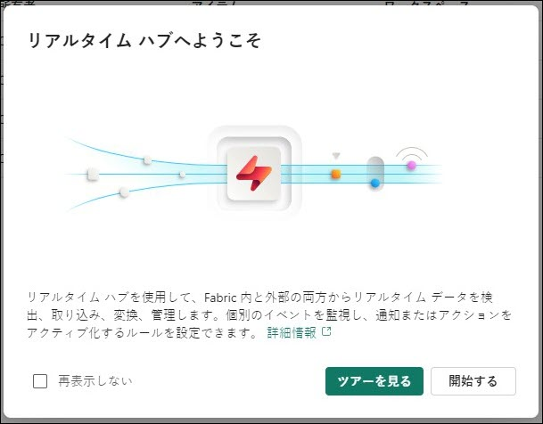

3.	リアルタイムハブは、組織全体にわたって移動するデータをストリーミングするための
1 つの場所です。すべてのMicrosoft Fabric テナントは、自動的にこのハブと共にプロビジョニングされます。これを使えば、さまざまなソースからの移動するデータを簡単に検出、インジェスト、管理、利用することができます。

4.	リアルタイムハブ内では、3 つの異なる種類のデータ統合にアクセスできます。

    - **すべてのデータストリーム**: Eventstream およびKQL データベースを実行している場合、Eventstream およびKQL データベースのテーブルからのストリーム出力 は、すべて自動的にリアルタイムハブに表示されます。

    - **ストリーミングソース**: Microsoft サービスからのすべてのストリーミングリソースを一覧表示します。Azure Event Hubs、Azure IoT Hub、または他のサービスでも、シームレスにリアルタイムハブにデータを取り込むことができます。

    - **Fabric イベント**: Fabric アーティファクトや外部ソースを介して生成されたイベントをFabric で利用して、リアルタイム アラートや下流アクションのトリガーなどのイベント駆動型シナリオをサポートできます。Fabric ワークスペース項目のイベントや Azure Blob Storage イベントなど、各種イベントを監視し、対応することができます。
    
    - **Azure のイベント:** このリストには、アクセスできる Azure で生成されたシステムイベントが含まれています。イベントを監視し、アクティブ化されたときに通知
    を送信またはアクションを実行するルール セットを設定することができます。

      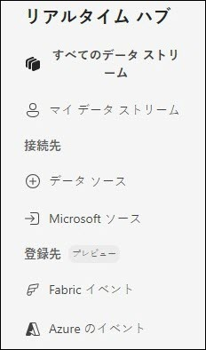

5.	リアルタイムハブの右上隅にある + **データソースの接続**ボタンをクリックします。

     

6.	ウィンドウが表示され、現在リアルタイム ハブに統合できる各データ ストリームの詳細が表示されます。これには、Azure の各種ソースに加え、Amazon Kinesis、Confluent Cloud Kafka、Google Cloud Pub/Sub などの外部のクラウドストリーミングソースも含まれます。調査できるサンプルデータもいくつかあります。
    
      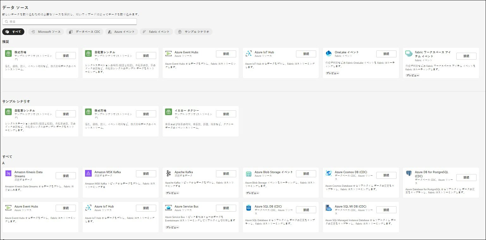

7.	右上隅の[X] をクリックして、イベントを取得するウィンドウを**閉じます。**
 
# ワークスペースとEventhouse を作成する

## タスク 4: Fabric ワークスペースを作成する

1.	次は、Fabric ライセンスを使用してワークスペースを作成しましょう。左のナビゲーションバーから**ワークスペース**を選択します。

2. **+ 新しいワークスペース**を選択します。

    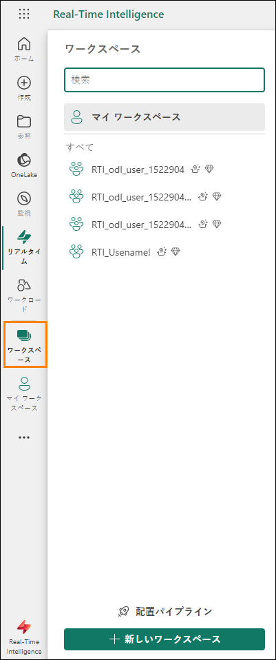

3.	**ワークスペースの作成**ダイアログがブラウザーの右側に開きます。

4.	**名前**フィールドに、**RTI_username** と入力します。環境の詳細で提供されたユーザー名を使用します。

    **注:** ワークスペース名は一意である必要があります。[名前] フィールドの下に、**この名前は使用できます**という緑色のチェック マークが表示されていることを確認してください。

5.	必要に応じて、ワークスペースの**説明**を入力できます。このフィールドはオプションです。
 
6.	**詳細**をクリックしてセクションを展開します。

    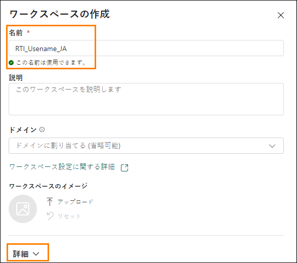

7.	**ライセンスモードで、試用版**が選択されていることを確認します (既定で選択されています)。

8.	**適用**を選択して新しいワークスペースを作成します。

    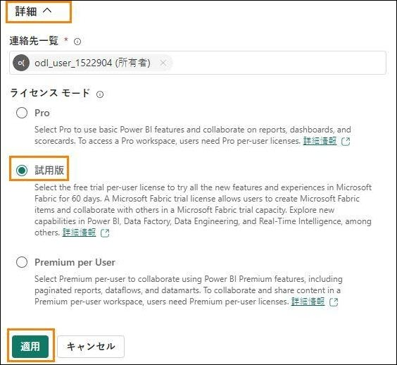

    **注:** **Introducing task flows** ダイアログが開いた場合は、**Got it** をクリックします。

    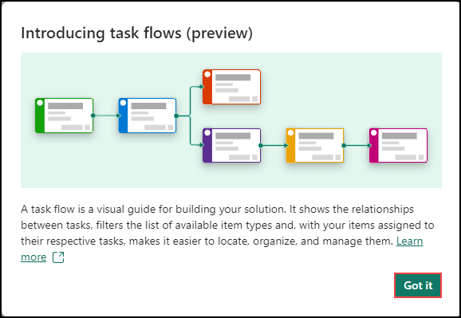 

## タスク 5: Eventhouse を作成する

1. **+ 新しい**項目をクリックして、このFabric ワークスペースに作成できるすべての項目が表示された新しいペインを開きます。

    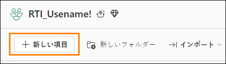

2.	ペイン内の**データの保管**セクションから**イベントハウス**を選択します。前に説明したとお り、これはデータを保存できるという点でレイクハウスと同じように考えることができます
が、このEventhouse ではリアルタイム データに重点が置かれます。

    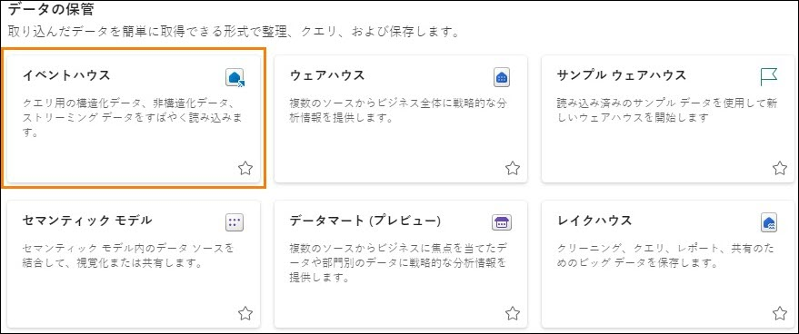

3.	表示されたウィンドウで、Eventhouse に **eh_Fabrikam** という名前を付け、**作成**をクリックします。

    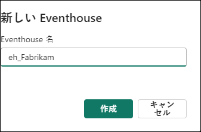
 
4.	本日残りのトレーニングでは、最終的にこの場所でさまざまなソースからデータをストリーミングします。項目が作成されるとウィンドウが表示され、Eventhouse に関する詳細が表示されます。**Get started** ボタンをクリックします。

    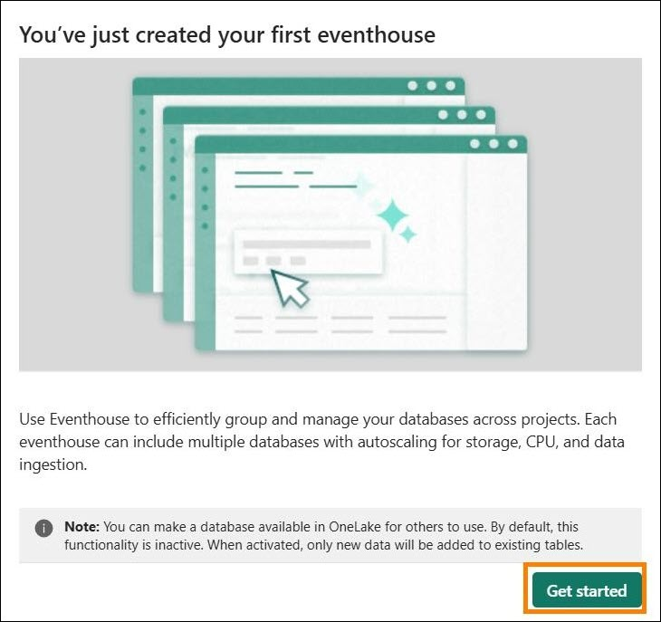

5.	画面に表示される緑色のヒントに従って、Eventhouse の操作を簡単に確認します。最初のヒントは、Eventhouse と共に空のKusto 照会言語(KQL) データベースが作成されたことを示しています。
 
    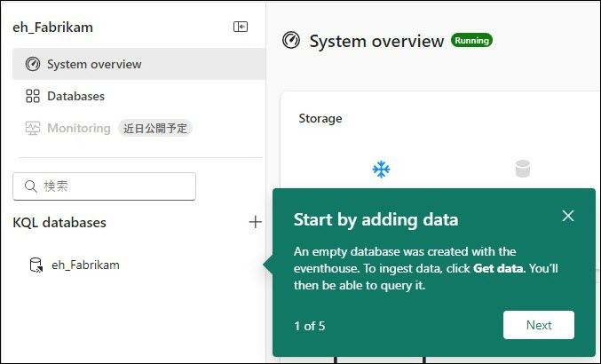

6.	画面上に表示される残りのヒントに従って、追加のデータベースを作成する場所、 Eventhouse の OneLake のストレージ、計算時間(分) でのFabric リソースの使用状況、 Eventhouse で発生したアクションを確認します。

7.	Eventhouse の左のナビゲーションペインで、Eventhouse と一緒に作成されたKQL データベースを見つけ、それをクリックしてデータベースの詳細を表示します。
 
     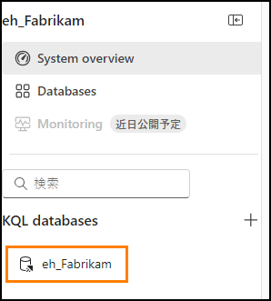

8.	これにより、左のブラウザーペインの 1 つのタブで Eventhouse 全体の概要を表示しなが
ら、新しいタブで KQL データベースのプロパティを確認することができます。このシナリオで実現したい目標の 1 つは、KQL データベースにストリーム配信されるデータに、OneLake経由でアクセスできるようにすることです。この機能を実現すれば、この KQL データベース内のデータを、必要な任意のレイクハウスで使うショートカットを通じて簡単に検出できるようになります。右側の**データベースの詳細**セクションを特定し、[可用性] オプションを**オン**に切り替えます。

    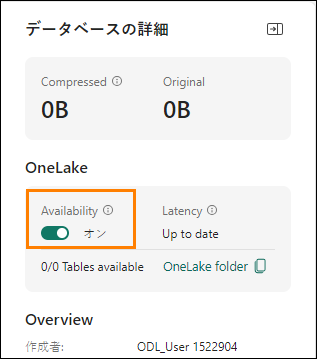

9.	ブラウザーの左側から **RTI_username** ワークスペースを選択して、そこに戻ります。

    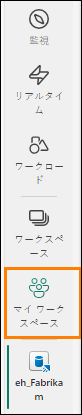
 
10.	スペースを最も多く占める**タスク フロー** オプションが表示された場合は、右側の二重上
矢印を選択して、そのスペースを最小化します。

    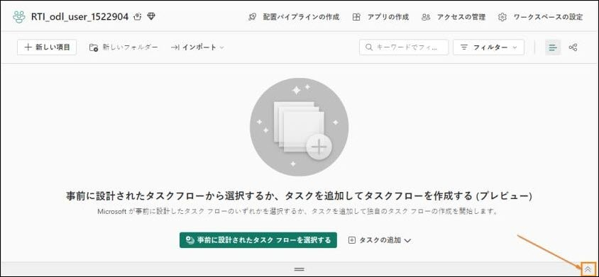

11.	これで、ストリーミングデータをOneLake に取り込み始めるための基本設定が完了しました。次のステップでは、移動するデータを受信できる、データのストリームを作成します。

    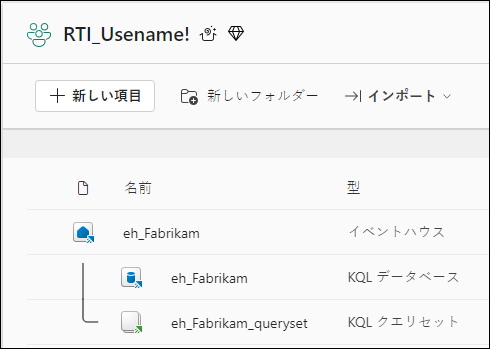

このラボでは、Real-Time Intelligence のインターフェイスを確認し、リアルタイム ハブについて調べ、Fabric ワークスペースを作成して、KQL データベースが付属する Eventhouse を作成しました。次のラボでは、データ資産全体のさまざまなソースからOneLake にデータを取り込む手法を調べていきます。また、Kusto 照会言語(KQL) を使っていくつかの基本的な分析を行います。
 
# 参考資料

Fabric Real-time Intelligence in a Day (RTIIAD) では、Microsoft Fabric で使用できる主要な機能の一部をご紹介します。

サービスのメニューにあるヘルプ (?) セクションには、いくつかの優れたリソースへのリンクがあります。
 
  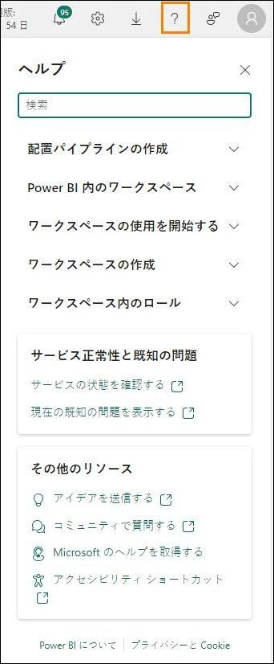

Microsoft Fabric の次のステップに役立つリソースをいくつか以下に紹介します。

- ブログ記事で [Microsof t Fabric の GA に関するお知らせ](https://www.microsoft.com/en-us/microsoft-fabric/blog/2023/11/15/prepare-your-data-for-ai-innovation-with-microsoft-fabric-now-generally-available/)の全文を確認する

- [ガイド付きツアー](https://guidedtour.microsoft.com/en-us/guidedtour/microsoft-fabric/microsoft-fabric/1/1)を通じて Fabric を探索する

- [Microsoft Fabric の無料試用版](https://www.microsoft.com/en-us/microsoft-fabric/getting-started)にサインアップする

- [Microsoft Fabric のWeb サイト](https://www.microsoft.com/en-in/microsoft-fabric)にアクセスする

- [Fabric の学習モジュール](https://learn.microsoft.com/en-us/training/browse/?products=fabric&resource_type=module)で新しいスキルを学ぶ

- [Fabric の技術ドキュメント](https://learn.microsoft.com/en-us/fabric/)を参照する

- [Fabric 入門編の無料のe-book](https://info.microsoft.com/ww-landing-unlocking-transformative-data-value-with-microsoft-fabric.html) を読む

- [Fabric コミュニティ](https://community.fabric.microsoft.com/)に参加し、質問の投稿やフィードバックの共有を行い、他のユーザーから学びを得る
 
より詳しい Fabric エクスペリエンスのお知らせに関するブログを参照してください。

- [Fabric のData Factory エクスペリエンスに関するブログ](https://blog.fabric.microsoft.com/en-us/blog/introducing-data-factory-in-microsoft-fabric/)

- [Fabric のSynapse Data Engineering エクスペリエンスに関するブログ](https://blog.fabric.microsoft.com/en-us/blog/introducing-synapse-data-engineering-in-microsoft-fabric/)

- [Fabric のSynapse Data Science エクスペリエンスに関するブログ](https://blog.fabric.microsoft.com/en-us/blog/introducing-synapse-data-science-in-microsoft-fabric/)

- [Fabric のSynapse Data Warehousing エクスペリエンスに関するブログ](https://blog.fabric.microsoft.com/en-us/blog/introducing-synapse-data-warehouse-in-microsoft-fabric/)

- [Fabric のReal-Time Intelligence エクスペリエンスに関するブログ](https://blog.fabric.microsoft.com/en-us/blog/category/real-time-intelligence)

- [Power BI のお知らせに関するブログ](https://powerbi.microsoft.com/en-us/blog/empower-power-bi-users-with-microsoft-fabric-and-copilot/)

- [Fabric のData Activator エクスペリエンスに関するブログ](https://blog.fabric.microsoft.com/en-us/blog/driving-actions-from-your-data-with-data-activator/)

- [Fabric の管理とガバナンスに関するブログ](https://blog.fabric.microsoft.com/en-us/blog/administration-security-and-governance-in-microsoft-fabric/)

- [Fabric の OneLake に関するブログ](https://blog.fabric.microsoft.com/en-us/blog/microsoft-onelake-in-fabric-the-onedrive-for-data/)

- [Dataverse とMicrosof t Fabric の統合に関するブログ](https://www.microsoft.com/en-us/dynamics-365/blog/it-professional/2023/05/24/new-dataverse-enhancements-and-ai-powered-productivity-with-microsoft-365-copilot/)

© 2024 Microsoft Corporation.All rights reserved.

このデモ/ラボを使用すると、次の条件に同意したことになります。

このデモ/ラボで説明するテクノロジまたは機能は、ユーザーのフィードバックを取得 し、学習エクスペリエンスを提供するために、Microsoft Corporation によって提供されます。ユーザーは、このようなテクノロジおよび機能を評価し、Microsoft にフィードバックを提供するためにのみデモ/ラボを使用できます。それ以外の目的には使用できません。このデモ/ラボまたはその一部を、変更、コピー、配布、送信、表示、実行、再現、発行、ライセンス、著作物の作成、転送、または販売することはできません。

複製または再頒布のために他のサーバーまたは場所にデモ/ラボ (またはその一部) をコピーまたは複製することは明示的に禁止されています。

このデモ/ラボは、前に説明した目的のために複雑なセットアップまたはインストールを必要としないシミュレーション環境で潜在的な新機能や概念などの特定のソフトウェアテクノロジ/製品の機能を提供します。このデモ/ラボで表されるテクノロジ/概念 は、フル機能を表していない可能性があり、最終バージョンと動作が異なることがあります。また、そのような機能や概念の最終版がリリースされない場合があります。物理環境でこのような機能を使用するエクスペリエンスが異なる場合もあります。

**フィードバック**。このデモ/ラボで説明されているテクノロジ、機能、概念に関するフィードバックをMicrosoft に提供する場合、ユーザーは任意の方法および目的でユーザ
ーのフィードバックを使用、共有、および商品化する権利を無償でMicrosoft に提供するものとします。また、ユーザーは、フィードバックを含むMicrosoft のソフトウェアまたはサービスの特定部分を使用したり特定部分とインターフェイスを持ったりする製
品、テクノロジ、サービスに必要な特許権を無償でサード パーティに付与します。ユーザーは、フィードバックを含めるためにMicrosoft がサードパーティにソフトウェアまたはドキュメントをライセンスする必要があるライセンスの対象となるフィードバックを提供しません。これらの権限は、本契約の後も存続します。

Microsoft Corporation は、明示、黙示、または法律上にかかわらず、商品性のすべての保証および条件、特定の目的、タイトル、非侵害に対する適合性など、デモ/ラボに関するすべての保証および条件を拒否します。Microsoft は、デモ/ラボから派生する結果、出力の正確さ、任意の目的に対するデモ/ラボに含まれる情報の適合性に関して、いかなる保証または表明もしません。

**免責事項**

このデモ/ラボには、Microsoft Power BI の新機能と機能強化の一部のみが含まれています。一部の機能は、製品の将来のリリースで変更される可能性があります。このデモ/ラボでは、新機能のすべてではなく一部について学習します。

