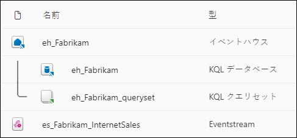
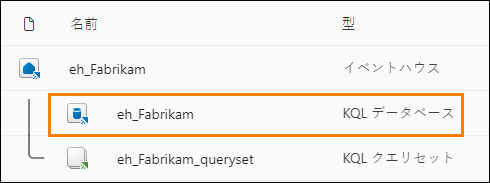
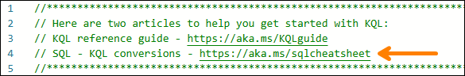

# Microsoft Fabric Real-Time Intelligence in a Day ラボ 2

 

 
# 目次

- ドキュメントの構造	

- 概要	

- Fabric リアルタイム ハブ	

    - タスク1: イベントストリームのソースを作成する

    - タスク2: Eventstream の出力先を設定する	

- Kusto 照会言語(KQL)	

    - タスク3: Kusto データベースクエリの作成	

    - タスク4: KQL データベースに対して T-SQL クエリを使用する	

- KQL クエリセット

  - タスク5: KQL クエリセットの操作	

- まとめ	

- 参考資料	

 # ドキュメントの構造

このラボでは、実行する手順だけでなく、視覚的にわかりやすいように、手順に関連するスクリーンショットも提示されます。各スクリーンショットでは、ユーザーが注目する必要のある領域が、オレンジのボックスで強調表示されて示されます。

# 概要

このラボでは、継続的にストリーム配信されるリアルタイムデータを処理する方法を体験できます。Eventstream と呼ばれるFabric Real-Time Intelligence オブジェクトを使って、前回のラボで作成した Eventhouse にこのデータを取り込み、いくつかの基本的な KQL クエリを記述します。
このラボを終了すると、次のことが学べます。

- Eventstream の作成方法

- KQL データベースへのリアルタイムデータの読み込み

- 基本的なKusto 照会言語クエリの記述

# Fabric リアルタイムハブ

## タスク 1: イベントストリームのソースを作成する

1.	前回のラボで作成した **Fabric ワークスペース**を開きます。ここでは、作成した Eventhouse を確認できます。

    

2.	左側にある**リアルタイム** ボタンを選択して、リアルタイム ハブに移動します。データの ストリームが表示されない場合でも、すぐに変化します。
 
    

3.	右上隅にある緑色の + **データソースの接続**ボタンを選択します。
 
    

4.	開いたウィンドウを使って、ストリームデータのソースを選択できます。前に説明したように、多くの優れたオプションの中から選択できますが、このクラスでは [Azure Event
Hubs] というオプションを選択します。“Azure Event Hubs” が簡単に表示されない場合は、上部の **Microsoft ソース**を選択して、表示されるオプションをフィルター処理します。

    
 
5.	次に、Azure イベント ハブへの接続を作成するよう求められます。現在は接続がないので、**新しい接続**というテキストをクリックします。

     

6.	環境の詳細ページから、必要なすべての接続設定をコピーして、適切なフィールドに貼り付けます。これらのラボでは、Python ノートブックからストリーミングデータが送信されるイベントハブに接続します。このノートブックは、1 時間に約 3,100 件の割合で架空の売上トランザクションを作成します。

    イベントハブの名前空間: **rtiadhub{userid} – cloudlabs が提供**

    イベントハブ: **rti-iad-fabrikam**

    共有アクセスキー名: **rti-reader**

    共有アクセスキー: **[環境の詳細] タブで入手可能**

7.	すべてのプロパティを入力したら、**接続**をクリックします。

    

8.	Azure イベント ハブのデータソースの構成で、イベント ハブの**コンシューマー グループ**を変更して、データ ストリームへの一意のアクセスポイントにアクセスできるようにする必要があります。このワークショップでは、以下に示すように “$Default” 値のままにできます。

    

9.	このデータソースとEventstream を完成させる前に、Eventstream の名前をより便利な名前に変更しておきましょう。右側の[ストリームの詳細] セクションで、[Eventstream 名] の横にある鉛筆アイコンを選択して、Eventstream に **es_Fabrikam_InternetSales** という名前を付けます。
 
     

10.	これで、**次へ**を選択して最後の概要ページに移動できます。

     

11.	この概要画面で、内容が正しいことを確認して、**接続**をクリックします。

    **注: 詳細は、スクリーンショットに表示される内容と異なります。**

    

12.	Eventstream とEventstream ソースを作成したら、**Eventstream を開**くオプションを選択します。

     

13.	これで Eventstream のユーザーインターフェイスに移動します。ここでは、データのソース ストリームが Eventstream に流れていることがわかり、変換イベントを追加することもできます。
 
14.	ソースが**アクティブ**になるまで、少し時間がかかる場合がありますが、しばらく待って
から、Eventstream の名前が表示されている中央のアイコンをクリックすると、データのプレビューが表示されます。

    **注:「警告」 ステータスと監査ポリシーが表示されても、問題ありません。ストリームは引き続き機能します**

    

15.	これで、下部ウィンドウにデータのサンプルが表示されているはずです。

    

16.	これで、Azure イベントハブから受信しているデータのプレビューを確認できます。下部にある水平スクロールバーをプレビューの右側に移動させると、EventProcessedUtcTimeと EventEnqueuedUtcTime という 2 つの列で、イベント ハブでデータを受信した時刻を確認できます。これらは、現在の日付/時刻を UTC 形式で反映しているはずです。
 
    
 
## スク 2: Eventstream の出力先を設定する

1.	編集モードに切り替えてイベントを変換するか、変換先を追加します というラベルの付いたキャンバス領域内のタイルをクリックします。

    

2.	Eventstream のユーザーインターフェイス内で、**イベントの変換または変換先の追加オ**プションをクリックしてドロップダウン メニューを開きます。

    

3.	ストリームに対して実行できる操作の一覧を確認します。

    
 
4.	**操作**セクションの下に**宛先**があるので、**Eventhouse** というオプションを選択します。

    

5.	画面の右側に新しいメニューが開きます。出力先に関しては、まず**データ インジェストモード**を変更する必要があります。2 つのオプションがあり、**直接インジェストとインジェスト前のイベント処理**です。この Eventstream では変換を行わず、KQL データベーステーブルに直接この情報を読み込むため、**直接インジェスト** オプションを選択していることを確認してください。

    

6.	以下の詳細を使用して、残りの設定を変更します。

    - 宛先名– **eh-kql-db-fabrikam**

    - ワークスペース– **RTI_username**

    - Eventhouse – **eh_Fabrikam**

    - KQL データベース– **eh_Fabrikam**
 
    

7.	[保存] をクリックします。

8.	Eventstream を構成した状態で、**公開**ボタンをクリックしてこのEventstream を保存し、インジェストを開始します。

    

9.	**AzureEventHub** ソースが非アクティブになったら、「アクティブ」状態に切り替えて、ダイアログが開いたら「今すぐ」オプションを選択します。

    
    

10.	**出力先**の**構成**オプションを選択して、ストリームをKQL データベース内のテーブルに正しくマップします。

    
 
11.	**eh_Fabrikam** データベースの下にある **+ 新しいテーブル** オプションをクリックします。

    
 
12.	**新**しいテーブルに **InternetSales** という名前を付けて、チェックマークをクリックします。

    

13.	要件を満たすために**データ接続名**を更新する必要がある場合があります。その名前を
**eh_Fabrikam_es_InternetSales** に変更しましょう。次に、**次へ**をクリックします。

     
 
14.	イベントをしばらく検索した後、ユーザー インターフェイスでサンプルデータが検出されたことを確認できるはずです。画面の下部にある**終了**をクリックします。

    

15.	そうすると、概要が表示されます。すべて緑色のチェックマークになったら、**閉じる**をクリックして次に進みます。

16.	ソースから Eventstream、Eventstream から出力先へのマッピングがユーザーインターフェイスに表示されたら、KQL データベースへのデータストリームを正しく構成し、開始することができています。

    
 
# Kusto 照会言語(KQL)

## タスク 3: Kusto データベースクエリの作成

1.	**RTI_username** ワークスペースに戻ります。作成した新しい Evenhouse が、すべての Eventstream アイテムと共に表示されるはずです。
   
    

2.	**eh_Fabrikam KQL** データベースアイテムを開きます。

    

3.	このエクスペリエンスでは、KQL データベースの現在の構造、サイズ、使用に関する概要を確認できます。Eventstream が絶えずこのKQL データベースにデータを送信しているため、時間の経過と共にストレージ容量が増加するのがわかります。

    
 
4.	画面の右上隅にある**更新アイコン**をクリックします。

    

5.	データベースのサイズが大きくなっているはずです。表示される値は、ラボの残りの部分のスクリーンショットと完全に同じではない場合があります。コンテンツの完了にかかる時間の長さに応じて、受信するレコード数がクラスの他のメンバーより多い場合や少ない場合があります。数値が異なっていてもまったく問題はありませんし、手順の実行に支障はありません。

    

6.	画面の左側にあるデータベース ナビゲーション領域内で、**InternetSales** というKQL データベース内のテーブルをクリックすると、テーブルの概要が表示されます。

    
 
7.	この概要には、作成したテーブルに関するメタデータの詳細と、Eventstream でアクティブにストリーミングされているデータが表示されます。繰り返しになりますが、テーブルのサイズとテーブル内の行数は学生ごとに異なり、このラボをはじめとするラボの最終結果には影響しません。このメニューで注意すべきその他の項目を次にいくつか示します。

- **Data Activity Tracker** – 取り込んだ行数、最後に生成された時刻、表示の間隔を示します。

- **Data Preview** – テーブルインジェスト結果のプレビューを表示します。

- **Schema Insights** – KQL を使ってクエリを実行できる列名と列のデータ型に関する詳細が含まれています。選択した列の値の上位 10 カウントも表示されます。

- **テーブルの詳細** – 圧縮されたテーブルサイズと元のテーブルサイズ、OneLake の可用性、テーブル内の行数、その他のさまざまな詳細を示します。

  

8.	データベースビューに戻り、右上隅にある **Explore your data** をクリックします。

    

9.	これにより、Eventhouse と共に作成された既定の KQL クエリセットが開きます。事前作成済みのクエリがいくつかありますが、若干のカスタマイズが必要です。また、
Microsoft ドキュメントへの 2 つのリンクも表示されています。これらはKQL を学習する場合や、SQL からKQL への変換について確認する場合に便利です。この変換についてはこのクラスで後ほど説明します。
 
    
 
10.	**8 行目**をクリックし、クエリの **YOUR_TABLE_HERE** という箇所をテーブル名 **InternetSales** に置き換えます。

    

11.	**8 行目と 9 行目**を強調表示して、ウィンドウの左上隅にある Run ボタンをクリックします。

     

12.	このクエリでは、**take** 演算子を使って指定した数の行を返します。このクエリを実行すると、InternetSales テーブルからデータが取得され、クエリで指定した任意の数の行が返されます。この例では、SQL の WHERE 句のように、100 行だけが返されます。この演算子によって具体的にどの行が返されるかを特定することはできず、結果はクエリごとに異なります。
 
    
 
13.	**12 行目**をクリックし、クエリの **YOUR_TABLE_HERE** という箇所をテーブル名
**InternetSales** に置き換えます。

    

14.	**12 行目と 13 行目**を強調表示して、ウィンドウの左上隅にある Run ボタンをクリックします。

    

15.	このクエリではcount 演算子を使用しています。このクエリは、クエリの実行時に KQLデータベーステーブル上に存在しているレコードの集計数を返します。さらに何度かこのクエリを実行してみてください。数秒ごとにレコード数が増えるのがわかります。
 
    

16.	**16/17 行目**に自動的に作成される最後のクエリについて上の各手順を繰り返し、クエリ
を再度実行します。

    

17.	このクエリを実行すると、1 時間以内にテーブルに取り込まれたレコードの数を取得できます。現在取り込み中のデータに関するこれらのレコードの一般的な配分は、1 時間あたり約 4,100 件です。ただし、その 1 時間あたりのトランザクション数は若干変動します。このクエリを実行すれば、各期間内に取り込まれたレコード数が多いのか少ないのかを詳しく確認できます。

## タスク 4: KQL データベースに対して T-SQL クエリを使用する

Kusto 照会言語をお使いになるのは初めてかもしれません。この言語は直感的で、シンプルなクエリであれば簡単に学習できますが、自分が現在扱えるクエリよりも複雑なクエリの結果を返す必要がある場合があるかもしれません。KQL クエリセットの機能には、いくつかの便利なツールが含まれています。たとえば、SQL クエリをKQL クエリに変換するツール や、KQL クエリセット内でシンプルにT-SQL クエリを作成するツールなどです。詳しく見ていきましょう。

1.	各製品とそれが販売された回数を返すクエリを作成する必要があります。T-SQL を使えば簡単に実行できる処理です。クエリ ウィンドウ内でSQL クエリをKQL に変換すれば、今後KQL クエリを作成する方法を深く理解することができます。まず、次のコマンドを記述します。
 
    **(注: テキストをコピーするには、下のオブジェクトをダブルクリックしてください)**

    

    
 
2.	コメント行“—” の後にキーワード“explain” を続けると、ここでSQL クエリを作成し、それと同様のクエリと結果を実現するために使えるKQL クエリの結果を返すことができます。その下に次のクエリを入力して、どのような KQL クエリを生成するかを説明します。

   

   

3.	これは、InternetSales テーブルから結果を取得して、製品キーと注文数の 2 列を返すシンプルな SQL クエリです。集計列と非集計列があるので、GROUP BY を使って各製品の結果を個別に返す必要があります。“—” からT-SQL クエリの末尾までのクエリ全体を実行します。

   
 
4.	explain クエリの出力は、翻訳された KQL クエリを結果として含む 1 つのレコードになるはずです。**キャレットアイコン(>)** をクリックして結果を展開すると、翻訳がわかりやすくなります。

    

5.	次のオレンジ色で強調表示されているクエリペインをクリックします。そうすると、翻訳されたKQL クエリを選択してコピーできます。使用している KQL クエリセットにこのクエリを貼り付けます

    

6.	クエリペインにある結果を使用して、クエリを強調表示して実行し、結果を取得しま す。**summarize** 演算子によって入力テーブルの内容を集計するテーブルを作成しなが ら、**by Product Key** によって各レコードをグループ化する方法を決定します。また、 **project** 演算子によって追加、名前変更、または削除する列を選択しながら、新しい計算列を挿入します。
    

    

7.	追加の機能や変換については、クエリ セットの上部にあるSQL からKQL への変換の一覧が載っているチートシートをご自由に参照してください。
 
    
 
8.	KQL を使用する代わりに、Fabric 内のKQL データベースの結果をクエリする別の方法として、T-SQL クエリを記述して実行することもできます。KQL クエリの翻訳に使用した元の SQL ステートメントを強調表示して、それだけを実行します。

    

9.	この方法でも、完全に有効な結果が生成されます。事前に KQL に変換する必要はありません。

    

# KQL クエリセット

## タスク 5: KQL クエリセットの操作

1.	このウィンドウ内のクエリの大部分はユーザー インターフェイスから自動的に作成されましたが、今後、独自のKQL クエリをゼロから作成したくなる可能性があります。これは、上部にあるタブ機能を使用して管理できます。このクエリセットは定期的に自動保存されることにも注意してください。

2.	クエリセットの上部に表示される最初のページの既定の名前は、データベースと同じ名前です。
 
    
 
3.	次に、鉛筆アイコンをクリックしてこのタブの名前を変更します。“**My First KQL Query**”という名前を付けましょう。

    

4.	将来、コードを分離する場合は、[+] アイコンをクリックして追加のタブを作成できます。

    

5.	**RTI_username** ワークスペースに戻ります。次のオブジェクトが存在しているはずです

    

# まとめ

このラボでは、まずデータがストリーム配信されるイベント ハブへの接続を設定しました。また、Eventstream を使ってそのデータを取得し、KQL データベースに取り込みまし
た。データを取り込んだ後、いくつかの KQL クエリを作成することができました。また、T- SQL を使ってKQL 構文の学習に役立てる機能と、シンプルに SQL ステートメントで結果を返す機能について確認しました。

# 参考資料

Fabric Real-time Intelligence in a Day (RTIIAD) では、Microsoft Fabric で使用できる主要な機能の一部をご紹介します。

サービスのメニューにあるヘルプ (?) セクションには、いくつかの優れたリソースへのリンクがあります。
 
  

Microsoft Fabric の次のステップに役立つリソースをいくつか以下に紹介します。

- ブログ記事で [Microsof t Fabric の GA に関するお知らせ](https://www.microsoft.com/en-us/microsoft-fabric/blog/2023/11/15/prepare-your-data-for-ai-innovation-with-microsoft-fabric-now-generally-available/)の全文を確認する

- [ガイド付きツアー](https://guidedtour.microsoft.com/en-us/guidedtour/microsoft-fabric/microsoft-fabric/1/1)を通じて Fabric を探索する

- [Microsoft Fabric の無料試用版](https://www.microsoft.com/en-us/microsoft-fabric/getting-started)にサインアップする

- [Microsoft Fabric のWeb サイト](https://www.microsoft.com/en-in/microsoft-fabric)にアクセスする

- [Fabric の学習モジュール](https://learn.microsoft.com/en-us/training/browse/?products=fabric&resource_type=module)で新しいスキルを学ぶ

- [Fabric の技術ドキュメント](https://learn.microsoft.com/en-us/fabric/)を参照する

- [Fabric 入門編の無料のe-book](https://info.microsoft.com/ww-landing-unlocking-transformative-data-value-with-microsoft-fabric.html) を読む

- [Fabric コミュニティ](https://community.fabric.microsoft.com/)に参加し、質問の投稿やフィードバックの共有を行い、他のユーザーから学びを得る
 
より詳しい Fabric エクスペリエンスのお知らせに関するブログを参照してください。

- [Fabric のData Factory エクスペリエンスに関するブログ](https://blog.fabric.microsoft.com/en-us/blog/introducing-data-factory-in-microsoft-fabric/)

- [Fabric のSynapse Data Engineering エクスペリエンスに関するブログ](https://blog.fabric.microsoft.com/en-us/blog/introducing-synapse-data-engineering-in-microsoft-fabric/)

- [Fabric のSynapse Data Science エクスペリエンスに関するブログ](https://blog.fabric.microsoft.com/en-us/blog/introducing-synapse-data-science-in-microsoft-fabric/)

- [Fabric のSynapse Data Warehousing エクスペリエンスに関するブログ](https://blog.fabric.microsoft.com/en-us/blog/introducing-synapse-data-warehouse-in-microsoft-fabric/)

- [Fabric のReal-Time Intelligence エクスペリエンスに関するブログ](https://blog.fabric.microsoft.com/en-us/blog/category/real-time-intelligence)

- [Power BI のお知らせに関するブログ](https://powerbi.microsoft.com/en-us/blog/empower-power-bi-users-with-microsoft-fabric-and-copilot/)

- [Fabric のData Activator エクスペリエンスに関するブログ](https://blog.fabric.microsoft.com/en-us/blog/driving-actions-from-your-data-with-data-activator/)

- [Fabric の管理とガバナンスに関するブログ](https://blog.fabric.microsoft.com/en-us/blog/administration-security-and-governance-in-microsoft-fabric/)

- [Fabric の OneLake に関するブログ](https://blog.fabric.microsoft.com/en-us/blog/microsoft-onelake-in-fabric-the-onedrive-for-data/)

- [Dataverse とMicrosof t Fabric の統合に関するブログ](https://www.microsoft.com/en-us/dynamics-365/blog/it-professional/2023/05/24/new-dataverse-enhancements-and-ai-powered-productivity-with-microsoft-365-copilot/)

© 2024 Microsoft Corporation.All rights reserved.

このデモ/ラボを使用すると、次の条件に同意したことになります。

このデモ/ラボで説明するテクノロジまたは機能は、ユーザーのフィードバックを取得 し、学習エクスペリエンスを提供するために、Microsoft Corporation によって提供されます。ユーザーは、このようなテクノロジおよび機能を評価し、Microsoft にフィードバックを提供するためにのみデモ/ラボを使用できます。それ以外の目的には使用できません。このデモ/ラボまたはその一部を、変更、コピー、配布、送信、表示、実行、再現、発行、ライセンス、著作物の作成、転送、または販売することはできません。

複製または再頒布のために他のサーバーまたは場所にデモ/ラボ (またはその一部) をコピーまたは複製することは明示的に禁止されています。

このデモ/ラボは、前に説明した目的のために複雑なセットアップまたはインストールを必要としないシミュレーション環境で潜在的な新機能や概念などの特定のソフトウェアテクノロジ/製品の機能を提供します。このデモ/ラボで表されるテクノロジ/概念 は、フル機能を表していない可能性があり、最終バージョンと動作が異なることがあります。また、そのような機能や概念の最終版がリリースされない場合があります。物理環境でこのような機能を使用するエクスペリエンスが異なる場合もあります。

**フィードバック**。このデモ/ラボで説明されているテクノロジ、機能、概念に関するフィードバックをMicrosoft に提供する場合、ユーザーは任意の方法および目的でユーザ
ーのフィードバックを使用、共有、および商品化する権利を無償でMicrosoft に提供するものとします。また、ユーザーは、フィードバックを含むMicrosoft のソフトウェアまたはサービスの特定部分を使用したり特定部分とインターフェイスを持ったりする製
品、テクノロジ、サービスに必要な特許権を無償でサード パーティに付与します。ユーザーは、フィードバックを含めるためにMicrosoft がサードパーティにソフトウェアまたはドキュメントをライセンスする必要があるライセンスの対象となるフィードバックを提供しません。これらの権限は、本契約の後も存続します。

Microsoft Corporation は、明示、黙示、または法律上にかかわらず、商品性のすべての保証および条件、特定の目的、タイトル、非侵害に対する適合性など、デモ/ラボに関するすべての保証および条件を拒否します。Microsoft は、デモ/ラボから派生する結果、出力の正確さ、任意の目的に対するデモ/ラボに含まれる情報の適合性に関して、いかなる保証または表明もしません。

**免責事項**

このデモ/ラボには、Microsoft Power BI の新機能と機能強化の一部のみが含まれています。一部の機能は、製品の将来のリリースで変更される可能性があります。このデモ/ラボでは、新機能のすべてではなく一部について学習します。