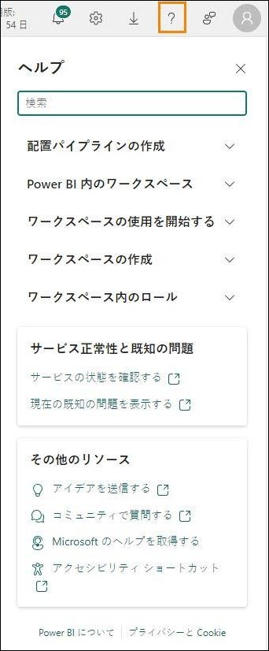

# Microsoft Fabric Real-time intelligence in a day 3


# 目次 
- ドキュメントの構造
- 概要
- Fabric の Eventstream
   - タスク 1: Eventstream を作成する
   - タスク 2: Eventstream を変換する
   - タスク 3: Eventstream を分割し、2 つの宛先を読み込む
- KQL データベースへのデータの追加
   - タスク 4: イベント データ テーブルを検証する
   - タスク 5: 分析コード テーブルの KQL データベース ショートカットを作成する
- まとめ
- 参考資料

# ドキュメントの構造
このラボでは、実行する手順だけでなく、視覚的にわかりやすいように、手順に関連するスクリーンショットも提示されます。各スクリーンショットでは、ユーザーが注目する必要のある領域が、オレンジのボックスで強調表示されて示されます。

# 概要
このラボでは、既存の Eventhouse に追加データを取り込むために、別の Eventstream を作成します。KQL データベースにどのようなデータを追加するかを制御するために、Eventstream に変換を含める方法を見ていきましょう。

このラボを終了すると、次のことが学べます。
- Eventstream 処理と変換
- 外部データベースからのデータを結合する KQL クエリの作成
- KQL を使って Power BI 内でデータのクエリを実行して表示する

# Fabric の Eventstream
## タスク 1: Eventstream を作成する

1. 今日のコースで使用している **Fabric ワークスペース**を開きます。

    

2. eコマース店舗に関連して、取り込むべき追加のストリーミング データがあります。ただし、この Eventstream については、データを Eventhouse に読み込む前に変換します。**リアルタイム ハブ**に移動しなくても、ワークスペースから新しい Eventstream を直接作成することができます。**+ 新しい項目**メニューから、新しい **Eventstream** を作成します。
 
    

3. 新しい Eventstream に **es_Fabrikam_ClickEvents** という名前を付け、**強化された機能**オプションをオンにして、**作成**をクリックします。

    
 
4. [ホーム] リボンで**ソースの追加**ドロップダウンをクリックし、**外部ソ**ースをクリックします。
 
     

5. 前のラボと同様に、Python ノートブックからデータがストリーミングされる Azure イベント ハブに接続します。**Azure Event Hubs** タイルの**接続**をクリックします。[推奨] セクションに **Azure Event Hubs** が表示されない場合は、**すべてのソースを表示**を選択して検出してください。

     
 
6. **新しい接続**を作成します。

   
 
7.	環境の詳細ページから、必要なすべての接続設定をコピーして、適切なフィールドに貼り付けます。

     - イベント ハブの名前空間: **rtiadhub{username}**

     - イベント ハブ: **rta-iad-clicks**

     - 共有アクセス キー名: **rti-reader**

     - 共有アクセス キー: **[環境の詳細] で提供**

       
 
8. すべてのプロパティを入力したら、**接続**をクリックします。

9. Azure イベント ハブのデータ ソースの構成で、イベント ハブの**コンシューマー グループ**を変更して、データ ストリームへの一意のアクセス ポイントにアクセスできるようにする必要があります。このワークショップでは、以下に示すように “$Default” 値のままにできます。

    
 
10. **次**へをクリックします。

11. 確認および作成のウィンドウで、すべてが正しく構成されていることを確認し、**追加**をクリックします。

     

12. ストリームが構成された後、イベント ハブから送信されているデータのプレビューを見ることができます。

      
 
13.	受信しているデータを確認します。eコマースの Web サイトから記録されるイベントには、クリックとインプレッションの 2 種類があります。
- **IMPRESSION** - インプレッション イベントは、ユーザーに対して広告や製品の一覧が表示されるたびに記録されます。インプレッションは、項目 (広告または製品) が何回表示されたかを示すメジャーです。これは項目が操作されたかどうかには関係ありません。
- **CLICK** - クリック イベントは、ユーザーが項目をクリックして操作したときに記録されます。これは通常、インプレッションに比べて、より高いレベルのエンゲージメントを示します。

記録されたクリック イベントおよびインプレッション イベントに加えて、クリックまたはインプレッションがどの製品に対するものであったか、Web ページがどのようなデバイスやブラウザーから読み込まれたか、ページにアクセスした IP アドレス、ページの読み込みにかかった時間に関する詳細も示されます。

## タスク 2: Eventstream を変換する

1. 次に、このデータ ストリームを取得し、KQL データベースに取り込む前に変換して、このデータから分析情報を得ようとしているアナリストが簡単に理解できるようにします。Eventstream キャンバス内で、**イベントの変換**オブジェクトのドロップダウンをクリックします。

    
 
2. 使用できる操作の一覧から、**フィールドの管理**オプションを選択します。

     
 
3. 表示される **ManageFields** という新しいアイコンで、**鉛筆アイコン**をクリックして、ソースからストリームに追加するフィールドを選択します。

      
 
4. 表示されたポップアウト ペインで、**すべてのフィールドを追加**するオプションをクリックします。

      
 
5. フィールドの一覧から **PartitionId** というフィールドを選択し、フィールドにカーソルを移動したときに表示される省略記号 (...) をクリックします。

      
 
6. そのフィールドを**削除**するオプションを選択します。イベント ハブから取得されたこのデータ ストリームについては、パーティションは使用されておらず、この列が役に立つことはないので削除します。

     
 
7. 以下のフィールドはこのストリームに必要ないので、すべて削除します。
      - userAgent
      - page_loading_seconds
      - EventProcessedUtcTime
      - EventEnqueredUtcTime

      次の画像のとおり、以下のフィールドが残ります。

      
  
8. eventDate フィールドにカーソルを移動し、ウィンドウの右側に省略記号 (...) が表示されたら、それをクリックします。

      
 
9. **編集**オプションを選択します。

    
 
10. **種類を変更するトグル**をクリックして、このフィールドのデータ型を変更します。元の型は文字列です。**変換された型**を **DateTime** に変更する必要があります。完了したら、**保存**をクリックします。

     

## タスク 3: Eventstream を分割し、2 つの宛先を読み込む

1. このデータ ストリームを分析のために KQL データベースに読み込むこともできますが、CLICK イベントと IMPRESSION イベントを区別するために、このデータを使用する別の方法が必要になることがあります。マウス ポインターで **ManageFields** 変換の端をポイントして、ユーザー インターフェイスに別の変換アクティビティを追加します。

    
 
2. 使用可能な操作の一覧から**フィルタ**ー変換を選択します。

     

3. 新しい変換である Filter の**鉛筆アイコン**をクリックします。

      

4. 画面の右側に表示されるポップアップで、以下の設定を使用して、CLICK 値のみを返すようにフィルター条件をカスタマイズします。重要なこととして、フィルター変換では大文字と小文字が区別されることに注意してください。
     - **操作名** - Clicks
     - **フィルター処理を行うフィールドを選びます** - eventType
     - **値のときにイベントを保持する** - 次の値と等しい – CLICK **(重要! これは大文字と小文字を区別するフィールドです。この例ではすべての大文字で入力する必要があります)**

       
 
5. **保存**オプションを選択して、変更を保持します。

6. **最新の情報に更新ボタン**をもう一度クリックして、データが CLICK eventTypes にフィルター処理されたことを確認します。

   
 
7. これらの行のみがテーブルに送信される場合もありますが、別のオプションとして、2 つの別個のストリームを作成し、異なる情報を 2 つ以上のテーブルにルーティングすることもできます。Eventstream の**ホーム** リボンで**イベントの変換**ドロップダウンをクリックしてから、**フィルタ**ーを選択します。

     
 
8. **Filter (名前は異なる可能性があります)** という新しいオブジェクトがキャンバスに表示されます。**ManageFields** ストリームを新しいフィルター変換に接続する必要があります。変換の緑の点から別の点に線をドラッグして、その接続を行います。

     

9. **Filter** の設定を編集するために、**鉛筆アイコン**をクリックします。

     

10. 画面の右側に表示されるポップアップで、以下の値を使用して、IMPRESSION 値のみを返すようにフィルター条件をカスタマイズします。フィルター変換では大文字と小文字が区別されることに注意してください
     - **操作名** - Impressions
     - **フィルター処理を行うフィールドを選びます** - eventType
     - **値のときにイベントを保持する** - 次の値と等しい – IMPRESSION **(重要! これは大文字と小文字を区別するフィールドです。この例ではすべての大文字で入力する必要があります)**

       
 
11. **保存**オプションを選択して、変更を保持します。

12. KQL データベース内の新しいテーブルにデータを読み込む前に、不要なその他の列を削除できます。この場合、“CLICK” レコードについてフィルター処理されるデータ ストリームでは、“eventType” 列は、すべての行が同じ値を保持するので不要になります。“IMPRESSION” データ ストリームについては、上記と同じ理由で、“eventType” 列を削除できます。また、“referrer” 列も、このテーブルのすべての行で空であるため削除できます。

13. **Clicks** フィルター操作の後の **+ アイコン**をクリックします。

    

14. ドロップダウン メニューで、[フィールドの管理] を選択します。

    

15. **鉛筆アイコン**をクリックして、ストリームに追加するフィールドまたはストリームから削除するフィールドを選択します

     

16. 操作の名前を “Manage_Clicks” に変更します。また、[すべてのフィールドを追加] を選択してから、“eventType” を削除します。完了したら、**保存**をクリックします。

      

17. 次に、以下に示すように “Impressions” フィルターに関連付けた別の ”フィールドの管理” 変換を追加しましょう。

      

18. **鉛筆アイコン**をクリックして、ストリームに追加するフィールドまたはストリームから削除するフィールドを選択します

      

19. 操作の名前を “Manage_Impressions” に変更します。次に、[すべてのフィールドを追加] を選択してから、“eventType” と “referrer” を削除します。“Manage fields” 変換は次のようになります。

     

20. これで各イベント タイプのストリームのデータが仕上がりました。次に、KQL データベースの新しいテーブルに各ストリームを読み込む必要があります。**Manage_Clicks** フィールド管理操作の後の + アイコンをクリックします。

     
 
21. 表示されたドロップダウン リストで、**宛先**に移動し、**Eventhouse** を選択します。

     
 
22. Eventhouse の出力先の**鉛筆アイコン**をクリックします。

    
 
23. の出力先について、次のプロパティを構成します。
     - **宛先名** - dbo-Clicks
     - **ワークスペース** - RTI_<ユーザー名>
     - **Eventhouse** – eh_Fabrikam
     - **KQL データベース** - eh_Fabrikam
     - **KQL Destination table** - **Clicks** という新しいテーブルを作成します

       
 
24. ポップアップの下部にある**保存**をクリックします。

25. 次の情報を以下のように構成して、Impressions テーブルについて同じことを行います。

    
 
26. 変更を保存します。

27. この Eventstream は、ストリーミングを開始する準備が整いました。**公開**をクリックしてストリームを開始します。

    
 
28. Eventstream が実行されると、Eventstream ユーザー インターフェイスがわずかに変化します。イベント ハブからデータをストリーミングし、そのデータ ストリームを変換および分割して、2 つの別々の KQL データベース テーブルに読み込んでいることが示されます。

     

# KQL データベースへのデータの追加
## タスク 4: イベント データ テーブルを検証する

1. **RTI_username** ワークスペースに戻ります。

2. **eh_Fabrikam** KQL データベースを開きま
す。

     

3. Eventstream が実行されると、KQL データベースの概要ページに 2 つの新しいテーブルが表示されます。Eventstream をしばらく実行すると、KQL データベース内の**上位のテーブル**が概要ページに表示され、テーブル内にどれだけの量のデータが格納されているかが示されます。 

     

4. **Impressions** テーブルをクリックします。このテーブルでは、24 時間に約 150 万件のレコードが受信されます。クリックよりも多くのインプレッションがあり、このクラスではこれが最大のテーブルになります。

      
 
## タスク 5: 分析コード テーブルの KQL データベース ショートカットを作成する
ここまではストリーミング データを扱ってきましたが、取り込んだデータからインテリジェンスを引き出すためにはまだ重要な要素がいくつか欠けています。このタスクでは、外部の Azure SQL Database から、KQL データベース内で分析コード テーブルとして機能するデータを取り込みます。これにより、現在ストリーミングしているデータをより適切に表すことができるようになります。たとえば、すべてのテーブルには数値フィールドである製品 ID の形式が含まれていますが、何らかの製品名を表示できると便利です。これをサポートするために必要なデータは現在、外部の Azure SQL Database にあります。これらの分析コード テーブルのいくつかに接続するのがどれだけ簡単かを確認してみましょう。

1. **eh_Fabrikam** データベースで、**New related item** というップダウン メニューをクリックします。次に、KQL Queryset というオプションを選択します。

     

2. KQL クエリセットに **Create Tables** という名前を付け、**作成**ボタンをクリックします。

     

3. OneLake データ ハブが開き、**“eh_Fabrikam”** KQL データベースが選択する唯一のオプションになります。このデータベースを選択し、**接続**をクリックします。

      

4. 新しいインターフェイスのクエリ ウィンドウ内で 1 回クリックし、キーボード ショートカット **Ctrl + A** を使ってすべてのテキストを強調表示します。すべてが強調表示されたら、すべてを削除します。

     
 
5. 空白のクエリ ウィンドウに次の KQL スクリプトを入力します。このスクリプトは、外部の Azure SQL Database への接続を作成し、それを KQL データベース内で**ショートカット**として使用できるようにします。**ショートカット**は読み取り専用モードで関連付けられ、KQL データベースに取り込まれたストリーミング データとともにクエリを表示および実行することが可能になります。

    ```
    .execute database script <|
    //External tables - shortcuts
    // connect to operational Database with external table Product
    .create external table products (ProductID: int, ProductNumber: string,  Name: string) 
    kind=sql
    table=[SalesLT.Product]
    ( 
    h@'Server= fabrikamserverdb.database.windows.net,1433;Initial Catalog=fabrikamdb;User Id=demouser;Password=fabrikam@1234567'
    )
    with 
    (
    createifnotexists = true
    )  
    // connect to operational Database with external table ProductCategory
    .create external table productCategories (ProductCategoryID: int, Name: string) 
    kind=sql
    table=[SalesLT.ProductCategory]
    ( 
    h@'Server= fabrikamserverdb.database.windows.net,1433;Initial Catalog=fabrikamdb;User Id=demouser;Password=fabrikam@1234567'
    )
    with 
    (
    createifnotexists = true
    )  
    ```

    

6. **Run** ボタンをクリックしてスクリプトを実行します。

     
 
7. データベース エクスプローラー ウィンドウに、**Shortcuts** という新しいフォルダーが表示され、そのフォルダー内に、この KQL データベースにリンクされた 2 つの追加テーブルが表示されます。これらのテーブルは Azure SQL Database 内に存在しますが、実行したスクリプトによって、これらのテーブルはこの KQL データベースにリンクされ、InternetSales およびイベント テーブルに結合されています。

      
 
8. データベースに分析コードの特性が備わったことで、質問に答えたり、レポートやクエリの利用者に対して、ビジネス全体に関する分析情報をテーブルから得たりして、より多くのコンテキストを提供できるようになります。次の KQL クエリを実行して、その 1 つを確認してみましょう。

     ```
     InternetSales
     | join kind=inner 
     (external_table("products")) on ($left.ProductKey == $right.ProductID)
     | summarize SalesPerProduct=sum(SalesAmount) by Name
     | project Name, SalesPerProduct
     ```

9. これで、会社が販売した個々の製品それぞれのクエリ結果の値が表示されます。

    

10. クエリを強調表示した状態で、ツール バーの **Power BI**をクリックします。

     

11. これにより、KQL データベース内のデータを使用して Power BI レポートを作成できるようになります。しばらくの間、自由に探索してかまいません。ただし、このデータからレポートを作成する必要はまだありません。先に進む準備ができたら、右上隅にある **X ボタン**をクリックします。

     

12. **eh_Fabrikam** KQL データベースに戻ります。

     

13. **eh_Fabrikam** のナビゲーション ウィンドウで、**Shortcuts** オプションをクリックします。この KQL データベースに作成したすべてのショートカットが表示されます。これらのショートカットは、Azure SQL 外部テーブル構文を使用する従来の Azure Data Explorer 外部テーブルと見なされ、同じく Fabric 内の KQL データベースでサポートされている OneLake、ADLS、または S3 のショートカットとは異なる方法で構築されていることに注意してください。

    
 
# まとめ
このラボでは、別のデータ ストリームを作成しましたが、Fabric の Eventstream のユーザー インターフェイスを使用してストリームを変換することができました。データを 2 つの異なるテーブルに読み込むことで、マーケティング、広告、分析のために eコマース システム内のすべてのクリックとインプレッションを追跡することができました。また、KQL クエリセットの外部テーブル機能を使用して、外部の Azure SQL Database へのショートカットを作成しました。これで、KQL データベース内の売上とクリックのコンテキストをより深く理解するためのいくつかの分析コードができました。

# 参考資料
Fabric Real-Time Intelligence in a Day (RTIIAD) では、Microsoft Fabric で使用できる主要な機能の一部をご紹介します。

サービスのメニューにあるヘルプ (?) セクションには、いくつかの優れたリソースへのリンクがあります。



 
Microsoft Fabric の次のステップに役立つリソースをいくつか以下に紹介します。
- ブログ記事で [Microsof t Fabric の GA に関するお知らせ](https://www.microsoft.com/en-us/microsoft-fabric/blog/2023/11/15/prepare-your-data-for-ai-innovation-with-microsoft-fabric-now-generally-available/)の全文を確認する

- [ガイド付きツアー](https://guidedtour.microsoft.com/en-us/guidedtour/microsoft-fabric/microsoft-fabric/1/1)を通じて Fabric を探索する

- [Microsoft Fabric の無料試用版](https://www.microsoft.com/en-us/microsoft-fabric/getting-started)にサインアップする

- [Microsoft Fabric のWeb サイト](https://www.microsoft.com/en-in/microsoft-fabric)にアクセスする

- [Fabric の学習モジュール](https://learn.microsoft.com/en-us/training/browse/?products=fabric&resource_type=module)で新しいスキルを学ぶ

- [Fabric の技術ドキュメント](https://learn.microsoft.com/en-us/fabric/)を参照する

- [Fabric 入門編の無料のe-book](https://info.microsoft.com/ww-landing-unlocking-transformative-data-value-with-microsoft-fabric.html) を読む

- [Fabric コミュニティ](https://community.fabric.microsoft.com/)に参加し、質問の投稿やフィードバックの共有を行い、他のユーザーから学びを得る
 
より詳しい Fabric エクスペリエンスのお知らせに関するブログを参照してください。

- [Fabric のData Factory エクスペリエンスに関するブログ](https://blog.fabric.microsoft.com/en-us/blog/introducing-data-factory-in-microsoft-fabric/)

- [Fabric のSynapse Data Engineering エクスペリエンスに関するブログ](https://blog.fabric.microsoft.com/en-us/blog/introducing-synapse-data-engineering-in-microsoft-fabric/)


- [Fabric のSynapse Data Science エクスペリエンスに関するブログ](https://blog.fabric.microsoft.com/en-us/blog/introducing-synapse-data-science-in-microsoft-fabric/)

- [Fabric のSynapse Data Warehousing エクスペリエンスに関するブログ](https://blog.fabric.microsoft.com/en-us/blog/introducing-synapse-data-warehouse-in-microsoft-fabric/)

- [Fabric のReal-Time Intelligence エクスペリエンスに関するブログ](https://blog.fabric.microsoft.com/en-us/blog/category/real-time-intelligence)

- [Power BI のお知らせに関するブログ](https://powerbi.microsoft.com/en-us/blog/empower-power-bi-users-with-microsoft-fabric-and-copilot/)

- [Fabric のData Activator エクスペリエンスに関するブログ](https://blog.fabric.microsoft.com/en-us/blog/driving-actions-from-your-data-with-data-activator/)

- [Fabric の管理とガバナンスに関するブログ](https://blog.fabric.microsoft.com/en-us/blog/administration-security-and-governance-in-microsoft-fabric/)

- [Fabric の OneLake に関するブログ](https://blog.fabric.microsoft.com/en-us/blog/microsoft-onelake-in-fabric-the-onedrive-for-data/)

- [Dataverse とMicrosof t Fabric の統合に関するブログ](https://www.microsoft.com/en-us/dynamics-365/blog/it-professional/2023/05/24/new-dataverse-enhancements-and-ai-powered-productivity-with-microsoft-365-copilot/)

© 2024 Microsoft Corporation.All rights reserved.

このデモ/ラボを使用すると、次の条件に同意したことになります。

このデモ/ラボで説明するテクノロジまたは機能は、ユーザーのフィードバックを取得 し、学習エクスペリエンスを提供するために、Microsoft Corporation によって提供されます。ユーザーは、このようなテクノロジおよび機能を評価し、Microsoft にフィードバックを提供するためにのみデモ/ラボを使用できます。それ以外の目的には使用できません。このデモ/ラボまたはその一部を、変更、コピー、配布、送信、表示、実行、再現、発行、ライセンス、著作物の作成、転送、または販売することはできません。

複製または再頒布のために他のサーバーまたは場所にデモ/ラボ (またはその一部) をコピーまたは複製することは明示的に禁止されています。

このデモ/ラボは、前に説明した目的のために複雑なセットアップまたはインストールを必要としないシミュレーション環境で潜在的な新機能や概念などの特定のソフトウェアテクノロジ/製品の機能を提供します。このデモ/ラボで表されるテクノロジ/概念 は、フル機能を表していない可能性があり、最終バージョンと動作が異なることがあります。また、そのような機能や概念の最終版がリリースされない場合があります。物理環境でこのような機能を使用するエクスペリエンスが異なる場合もあります。

**フィードバック**。このデモ/ラボで説明されているテクノロジ、機能、概念に関するフィードバックをMicrosoft に提供する場合、ユーザーは任意の方法および目的でユーザ
ーのフィードバックを使用、共有、および商品化する権利を無償でMicrosoft に提供するものとします。また、ユーザーは、フィードバックを含むMicrosoft のソフトウェアまたはサービスの特定部分を使用したり特定部分とインターフェイスを持ったりする製
品、テクノロジ、サービスに必要な特許権を無償でサード パーティに付与します。ユーザーは、フィードバックを含めるためにMicrosoft がサードパーティにソフトウェアまたはドキュメントをライセンスする必要があるライセンスの対象となるフィードバックを提供しません。これらの権限は、本契約の後も存続します。

Microsoft Corporation は、明示、黙示、または法律上にかかわらず、商品性のすべての保証および条件、特定の目的、タイトル、非侵害に対する適合性など、デモ/ラボに関するすべての保証および条件を拒否します。Microsoft は、デモ/ラボから派生する結果、出力の正確さ、任意の目的に対するデモ/ラボに含まれる情報の適合性に関して、いかなる保証または表明もしません。

**免責事項**

このデモ/ラボには、Microsoft Power BI の新機能と機能強化の一部のみが含まれています。一部の機能は、製品の将来のリリースで変更される可能性があります。このデモ/ラボでは、新機能のすべてではなく一部について学習します。

