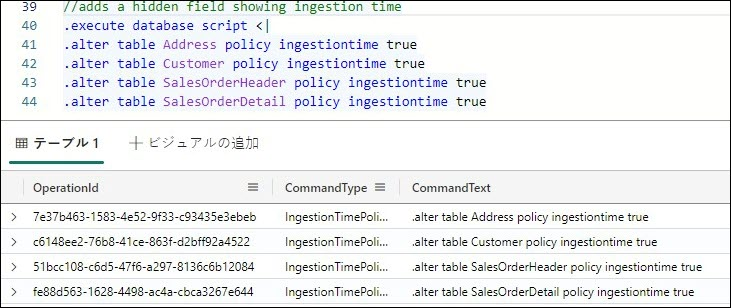
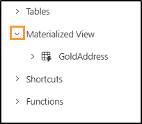

# Microsoft Fabric Real-Time Intelligence in a Day ラボ 4

# 目次

- ドキュメントの構造

- 概要

- KQL データベース内のメダリオンフレームワーク

  - タスク1: ブロンズテーブルを作成する

  - タスク2: データパイプラインを使用してブロンズ テーブルを読み込む

  - タスク3: シルバーレイヤーでテーブルを変換する

  - タスク4: 具体化されたビューを含むゴールドレイヤーを作成する

- Fabric レイクハウスと OneLake の可用性

  - タスク5: レイクハウスを作成する

  - タスク6: KQL データベーステーブルへのショートカット

- まとめ

- 参考資料

# ドキュメントの構造

このラボでは、実行する手順だけでなく、視覚的にわかりやすいように、手順に関連するスクリーンショットも提示されます。各スクリーンショットでは、ユーザーが注目する必要のある領域が、オレンジのボックスで強調表示されて示されます。

# 概要

このラボでは、開発のさまざまなステージにおけるデータの処理と分析における使用にブロンズ、シルバー、ゴールドレイヤーアプローチを使用してメダリオン フレームワークを作成します。その後、KQL データベースのデータをレイクハウスに接続して、そのデータを Power BI レポートで使用することを希望する組織内のユーザーとリアルタイムですばやく共有する方法を示します。

このラボを終了すると、次のことが学べます。

- Kusto 照会言語を使用した KQL データベーステーブルの作成

- Data Factory パイプラインを使用したKQL データベースへのデータの読み込み

- KQL データベースでの具体化されたビューの作成

- レイクハウスの作成とKQL データベースへのショートカットの使用

# KQL データベース内のメダリオンフレームワーク

## タスク 1: ブロンズテーブルを作成する

1. コースの **Fabric ワークスペース**を開き、前のラボで作成した KQL クエリセット **Create Tables** を開きます。

    

2. このKQL クエリセット内で、ここで使用する元のタブの名前を "eh_Fabrikam" から "Create External Tables" に変更して、このクエリセットの内容をより簡単に整理し、理解できるようにします。

    

3. 次に、[+] アイコンを選択して新しいタブを作成し、新しいタブに "Bronze Layer" という名前を付けます。

   

4. この新しいタブ内で、次のコードを強調表示し、[Run] を選択してメダリオン フレームワークのブロンズレイヤーとして機能する 4 つの新しいテーブルを作成します。

    ```
    //BRONZE LAYER
    
    .execute database script <|
    
    .create table [Address] (AddressID:int,AddressLine1:string,AddressLine2:string,City: string, StateProvince:string, CountryRegion:string, PostalCode: string, rowguid: guid, ModifiedDate:datetime)
    
    .create table [Customer](CustomerID:int, NameStyle: string, Title: string, FirstName: string, MiddleName: string, LastName: string,Suffix:string, CompanyName: string, SalesPerson: string, EmailAddress: string, Phone: string, ModifiedDate: datetime)
    
    .create table [SalesOrderHeader](SalesOrderID: int, OrderDate: datetime, DueDate: datetime, ShipDate: datetime, ShipToAddressID: int, BillToAddressID: int, SubTotal: decimal, TaxAmt: decimal, Freight: decimal, TotalDue: decimal, ModifiedDate: datetime)
    
    .create table [SalesOrderDetail](SalesOrderID: int, SalesOrderDetailID: int, OrderQty: int, ProductID: int, UnitPrice: decimal , UnitPriceDiscount: decimal,LineTotal: decimal, ModifiedDate: datetime)
    ```

    

5. 実行すると、データベースオブジェクトエクスプローラー内に作成された 4 つの新しいテーブルがすぐに表示されます。

   - Address

    - Customer

    - SalesOrderDetail

    - SalesOrderHeader

        

6. 名前の横の **>** アイコンをクリックして、**Address テーブル**を展開します。

   

7. これにより、テーブルのスキーマ(列名およびデータ型) が表示されます。KQL データベースでこのテーブルに追加すると役に立つ 1 つの項目は、後でメダリオンアーキテクチャで使用されるインジェスト時間用の非表示列です。ここで追加してみましょう。下のスクリプトをコピーして貼り付け、インジェスト時間列を追加することで、作成したテーブルを変更します。

    ```
    //adds a hidden field showing ingestion time
    .execute database script <|
    .alter table Address policy ingestiontime true
    .alter table Customer policy ingestiontime true
    .alter table SalesOrderHeader policy ingestiontime true
    .alter table SalesOrderDetail policy ingestiontime true
    ```

   

8. 4 つの新しいテーブルは、スキーマが定義された空白のテーブルです。次に、これらのテーブルを適切に読み込む方法が必要です。ワークスペース **RTI_username** に戻ります。

## タスク 2: データパイプラインを使用してブロンズ テーブルを読み込む

1. ワークスペースから **+ 新しい項目**オプションを選択して選択ペインを表示します。次に、**Data pipeline** というオプションを探して選択します。

   

2. 新しいパイプラインに **Load KQL Database Bronze Layer** という名前を付けます。

   

3. **作成**をクリックします。

4. パイプラインメニューが表示されたら、**データコピーのアシスタント** オプションをクリックします。

   

5. 最初に、データを抽出するソース データベースへの接続を作成する必要があります。[新しいソース] の下の **Azure SQL Database** オプションをクリックします。すぐに表示されない場合は、上部の検索バーを使用してソースをフィルター処理できます。前のラボで使用したのと同じ外部 Azure SQL データベースに接続しますが、別のテーブルに接続します。

   

6. データベースの接続の詳細を入力する必要があります。環境の情報を使用するか、以下のように入力します。

    - fabrikamdemo.database.windows.net

    - fabrikamdb

    - demouser

    - fabrikam@123456

7. すべて入力したら、**次へ**をクリックします。

8. 使用可能なテーブルの一覧から、以下を選択します。

    - SalesLT.Address

    - SalesLT.Customer

    - SalesLT.SalesOrderDetail

    - SalesLT.SalesOrderHeader

        

9. **次へ**をクリックします。

10. 宛先を設定して、パイプラインのデータの送信先を決定する必要があります。**OneLake データハブ**を探し、KQL データベース **eh_Fabrikam** を選択します。

    

11. サインインを求められたら、[環境の詳細] ページで提供された資格情報を使用します。

12. まだ選択していない場合は **SalesLT.Address** テーブルをクリックし、**テーブル** オプションの横のドロップダウンをクリックします。**Address** テーブルオプションをクリ ックします。

    

13. **列マッピング**の概要が表示されます。これにより、KQL データベースに送信する、ソースデータベースから取得されたすべてのフィールドを視覚化できます。ソースから特定のフィールドをマップしない場合は、そのフィールドを削除できます。

    

14. **SalesLT.Customer、SaleLT.SalesOrderDetail、SalesLT.SalesOrderHeader** について、ステッ プ 11 - 12 と同じ手順を実行します。列マッピングを実行する必要はないため、単純にテーブル名を一致させます。すべてのテーブルが適切にマップされたら、**次へ**をクリックします。

15. データコピーアシスタントを使用する最後のページは、選択したすべての設定を確認する概要ページです。テーブルのソース番号とテーブルの宛先番号が同じであることを確認します。

    

16. **保存と実行**をクリックします。

17. しばらくすると、**パラメーター**が表示されたポップアップウィンドウが開きます。完了したコピーアシスタントウィザードにより、反復処理してkql テーブルに読み込むテー ブルの一覧が作成されています。パイプラインは現在データ コピーアシスタントから構成されているため、**OK** ボタンをクリックするだけで実行されます。

    

18. パイプラインを実行しましょう。約 1 分後にデータ移動が完了します。パイプライン内のすべてのアクティビティが**成功**と表示されたら、データの転送は完了です。
   
    

19. 次に、テーブルの 1 つをチェックし、データを確認しましょう。使用してきた

**Create Tables** というKQL クエリセットに戻って **Bronze Layer** タブが表示されていることを確認し、次のスクリプトを実行します

 ```
//Query the Bronze layer Customer table

Customer
 | take 100
```


20. 下の画像のようなデータが表示されますが、これは正確ではない可能性があります。

    

## タスク 3: シルバーレイヤーでテーブルを変換する

1. これでブロンズテーブルが読み込まれたので、"Silver Layer" というKQL クエリセット内に新しいタブを作成します。

   

2. [Silver Layer] タブ内の次のKQL スクリプトを実行して、メダリオンフレームワークのシルバーレイヤーとして機能する 4 つの新しいテーブルを作成します。

    ```
    //SILVER LAYER

    .execute database script <|

    .create table [SilverAddress] (AddressID:int,AddressLine1:string,AddressLine2:string,City: string, StateProvince:string, CountryRegion:string, PostalCode: string, rowguid: guid, ModifiedDate:datetime, IngestionDate: datetime)

    .create table [SilverCustomer](CustomerID:int, NameStyle: string, Title: string, FirstName: string, MiddleName: string, LastName: string,Suffix:string, CompanyName: string, SalesPerson: string, EmailAddress: string, Phone: string, ModifiedDate: datetime, IngestionDate: datetime)

    .create table [SilverSalesOrderHeader](SalesOrderID: int, OrderDate: datetime, DueDate: datetime, ShipDate: datetime, ShipToAddressID: int, BillToAddressID: int, SubTotal: decimal, TaxAmt: decimal, Freight: decimal, TotalDue: decimal, ModifiedDate: datetime, DaysShipped: long, IngestionDate: datetime)

    .create table [SilverSalesOrderDetail](SalesOrderID: int, SalesOrderDetailID: int, OrderQty: int, ProductID: int, UnitPrice: decimal, UnitPriceDiscount: decimal,LineTotal: decimal, ModifiedDate: datetime, IngestionDate: datetime)
    ```

3. 新しいスクリプトを強調表示して **Run** ボタンをクリックすることで、スクリプトを実行します。

   

4. そのスクリプトが実行されると、KQL データベーステーブルのメニューに新しいテーブルが 4 つ表示されます。

    

5. これでテーブルが作成されました。次に、テーブルにデータを読み込む必要があります。データがブロンズレイヤーに取り込まれるときにデータを変換して移動する更新ポリシーを作成します。次のスクリプトをコピーして貼り付けてから、コードを**実行**します。

    ```
    // use update policies to transform data during Ingestion

    .execute database script <|

    .create function ifnotexists with (docstring = 'Add ingestion time to raw data') ParseAddress (){ Address

    | extend IngestionDate = ingestion_time()

    }

    .alter table SilverAddress policy update @'[{"Source": "Address", "Query": "ParseAddress", "IsEnabled" : true, "IsTransactional": true }]'

    .create function ifnotexists with (docstring = 'Add ingestion time to raw data') ParseCustomer (){ Customer

    | extend IngestionDate = ingestion_time()

    }

    .alter table SilverCustomer policy update @'[{"Source": "Customer", "Query": "ParseCustomer", "IsEnabled" : true, "IsTransactional": true }]'

    .create function ifnotexists with (docstring = 'Add ingestion time to raw data') ParseSalesOrderHeader (){ SalesOrderHeader

    | extend DaysShipped = datetime_diff('day', ShipDate, OrderDate)

    | extend IngestionDate = ingestion_time()

    }

    .alter table SilverSalesOrderHeader policy update @'[{"Source": "SalesOrderHeader", "Query": "ParseSalesOrderHeader", "IsEnabled" : true, "IsTransactional": true }]'

    .create function ifnotexists with (docstring = 'Add ingestion time to raw data') ParseSalesOrderDetail () { SalesOrderDetail

    | extend IngestionDate = ingestion_time()

    }

    .alter table SilverSalesOrderDetail policy update @'[{"Source": "SalesOrderDetail", "Query": "ParseSalesOrderDetail", "IsEnabled" : true, "IsTransactional": true }]'
    ```

6. クエリの実行結果が表示されますが、クエリが完了したことを示す最善の証拠は、新しい展開可能なフォルダーがデータベースオブジェクトペインに表示されることです。

**Functions フォルダー**の横の **> アイコン**をクリックします。これらの関数により、KQL デ

ータベースのブロンズレイヤーに読み込まれたデータをミラーリングし、変換して、シルバーレイヤーに読み込むことができます。

 

7. 次に、このプロセスをシミュレートします。このラボで前に作成したパイプラインを再度実行します。**Load KQL Database** パイプラインに戻ります。

   

8. **[ホーム] リボン**内の**実行**ボタンをクリックしてパイプラインを再度実行し、ブロンズ レイヤーにデータを読み込みます。そこで、作成してシルバー テーブルに読み込んだ関数

によって変換されます。


9. このポップアップで **OK** をクリックすると、前と同じパラメーターでパイプラインが実行されます。

   

10. ここでも、パイプラインの読み込みが完了するまで約 1 分待ちます。[出力] メニューのすべての項目が**成功**と表示されたら、次のステップに進みます。
   
    

11. データパイプラインが完了したら、KQL データベースに移動し、結果を検証します。

**Create Tables** KQL クエリセットに戻り、**Silver Layer**
タブに移動します。

12. 新しい行で、次のクエリを記述し、コードを実行することで、SilverAddress テーブルのクエリを実行します。

    ```
    SilverAddress
    | take 100
    ```

    

13. 結果に注目してください。**SilverAddress** テーブルには追加の列 **IngestionDate** がありますが、これは **Address** テーブルに物理的には存在しません。

    

## タスク 4: 具体化されたビューを含むゴールドレイヤーを作成する

これで、シルバーレイヤー内のデータのレイヤーを変換したので、Power BI レポートまたはRTI データセットで、またはいくつかのKQL クエリを作成するだけで、信頼性が高く検証済みのエンリッチされたデータを使用して分析の実行を開始できます。ただし、エンド ユーザーが使いやすくなるようにデータを集計する必要があると思われる場合があります。これをKQL
データベース内でどのように行うのかを見てみましょう。

1. まだ存在しない場合は、**Create Tables** KQL クエリセットを開き、[Gold Layer] という新しいタブを作成します。

    

2. 具体化されたビューを作成するための次のコードをクエリセットに貼り付けます。

    ```
    //GOLD LAYER

    // use materialized views to view the latest changes in the SilverAddress table

    .create materialized-view with (backfill=true) GoldAddress on table SilverAddress

    {

    SilverAddress

    | summarize arg_max(IngestionDate, *) by AddressID

    }
    ```

3. コードを貼り付けた後に、コードを強調表示し、**Run** ボタンをクリックして実行します。

   

4. この具体化されたビューがどのように作成されたかに関する詳細情報を示す出力がクエリ結果に表示されます。

    

5. また、KQL データベースオブジェクトエクスプローラーに、作成された別のフォルダーが表示されます。**Materialized view** フォルダーを展開すると、その中に **GoldAddress** ビューがあります。

   

6. クエリウィンドウで、次のコードを実行して、新しい具体化されたビューのクエリを実行します。

    ```
    GoldAddress
    | take 1000
    ```
   

7. このクエリは、**SilverAddress** テーブル内の固有の **AddressID** ごとに最新の **IngestionDate** を含む行を返します。

8. ここで、次のクエリを貼り付けて実行し、他のテーブルについてゴールド レイヤーの具体化されたビューを構築します。

    ```
    //Create additional Gold Materialized Views

    .execute database script <|

    .create materialized-view with (backfill=true) GoldCustomer on table SilverCustomer

    {

    SilverCustomer

    | summarize arg_max(IngestionDate, *) by CustomerID

    }

    .create materialized-view with (backfill=true) GoldSalesOrderHeader on table SilverSalesOrderHeader

    {

    SilverSalesOrderHeader

    | summarize arg_max(IngestionDate, *) by SalesOrderID

    }

    .create materialized-view with (backfill=true) GoldSalesOrderDetail on table SilverSalesOrderDetail

    {

    SilverSalesOrderDetail

    | summarize arg_max(IngestionDate, *) by SalesOrderDetailID

    }

    .create async materialized-view with (backfill=true) GoldDailyClicks on table Clicks

    {

    Clicks

    | extend dateOnly = substring(tostring(todatetime(eventDate)), 0, 10)

    | summarize count() by dateOnly

    }

    .create async materialized-view with (backfill=true) GoldDailyImpressions on table Impressions

    {

    Impressions

    | extend dateOnly = substring(tostring(todatetime(eventDate)), 0, 10)

    | summarize count() by dateOnly

    }
    ```

9. これで、KQL データベース内に 6 つの具体化されたビューが存在するようになりました。

   

10. KQL データベース内にメダリオンフレームワークが正常に作成されました。このデータは簡単に使用できますが、Kusto を使用したことがなく、別の方法でこれらのテーブルのデータにアクセスすることを好むユーザーがいます。次のタスクでは、レイクハウスを

作成します。その後、ラボ 01 で有効にした OneLake の可用性機能を使用し、ショートカットを使用して、KQL データベースのテーブルの一部をレイクハウス経由でアクセス可能にします

# Fabric レイクハウスとOneLake の可用性

## タスク 5: レイクハウスを作成する

1. **RTI_<ユーザー名>** ワークスペースに戻ります。

2. **+ 新しい項目**オプションをクリックし、使用可能なオプションの一覧から**レイクハウス** を選択します。

    

3. レイクハウスに **lh_Fabrikam** という名前を付けて、**作成**をクリックします。レイクハウススキーマのプレビュー機能を有効にしないでください

    

## タスク 6: KQL データベーステーブルへのショートカット

レイクハウスユーザーインターフェイス内に、データをレイクハウス自体にストリーミングする方法に関するオプションがいくつかあります。このクラスで前に述べた 1 つのオプションは、EventStream を使用して、KQL データベースではなくイベント ハブからレイクハウスにデータを直接読み込む方法です。特定の目標と要件を満たすために KQL データベースを利用することは既に決定しているので、そのデータを再度コピーしたくありません。代わりに、**ショートカット**を使用して、既に存在する KQL データベー スのデータを取得しましょう。そうすれば、このエクスペリエンスの方になじみのあるユーザーは、KQL データベース内で使用しているデータにアクセスできます。

1. メニューから、**新しいショートカット**というオプションを選択します。

    

2. **内部ソース**の下のオプション **Microsoft OneLake** を選択します。

    

3. メニュー内で、**eh_Fabrikam** KQL データベースを選択して、データの複製やコピーを行わずに、そのストレージからレイクハウスにテーブルを取り込みます。

    

4. メニューの下部にある**次へ**をクリックします。

5. **アイコン**をクリックして **eh_Fabrikam** 内のテーブルを開き、取り込む次のテーブルを選択します。

    - Clicks

    - Impressions

    - InternetSales

        

6. これらのテーブルは、Fabric 内でノートブックを利用するユーザーにとって非常に役立つ可能性があります。このデータをデータサイエンスの実験で使用して、ユーザーが関心を持つ可能性が高いリンクを予測するモデルをトレーニングできます。

7. **次へ**をクリックします。

8. 最後の検証画面が表示されます。選択に問題がなければ、画面下部の**作成**ボタンをクリックします。

   

9. これで、KQL データベースから選択したすべてのテーブルがレイクハウス内に表示されます。

    

10. **Clicks** というテーブルをクリックします。

    

11. そのテーブルのレコードのサンプルがユーザーインターフェイス内に表示されていることがわかります。

#### 注: データがOneLake (https://learn.microsoft.com/en-us/fabric/real-time-intelligence/event- house-onelake-availability) に表示されるまで、数時間かかる場合があります

# まとめ

このラボでは、ユーザーはKusto 照会言語(KQL) データベース内にメダリオンフレームワークを作成しました。ユーザーは、データパイプラインを使用してメダリオン アーキテクチャのブロンズレイヤーに生データを取り込みました。ユーザーはこのデータを変換し、さらに処理して調整するためにシルバー レイヤーに読み込みました。最後に、ユーザーは、

具体化されたビューを使用してゴールド レイヤーで分析するためにデータを集計し、最適化しました。


メダリオンフレームワークを構築した後、ユーザーは Microsoft Fabric ショートカットを利用して、KQL データベースからレイクハウスにデータをリンクしました。この統合により、両環境のデータにシームレスにアクセスし、分析を行えるようになりました。このラボでは、最後にユーザーがデータリンクを検証し、基本的なクエリを実行してフレームワークの機能を確認しました。

# 参考資料

Fabric Real-time Intelligence in a Day (RTIIAD) では、Microsoft Fabric で使用できる主要な機能の一部をご紹介します。

サービスのメニューにあるヘルプ (?) セクションには、いくつかの優れたリソースへのリンクがあります。
 
  

Microsoft Fabric の次のステップに役立つリソースをいくつか以下に紹介します。

- ブログ記事で [Microsof t Fabric の GA に関するお知らせ](https://www.microsoft.com/en-us/microsoft-fabric/blog/2023/11/15/prepare-your-data-for-ai-innovation-with-microsoft-fabric-now-generally-available/)の全文を確認する

- [ガイド付きツアー](https://guidedtour.microsoft.com/en-us/guidedtour/microsoft-fabric/microsoft-fabric/1/1)を通じて Fabric を探索する

- [Microsoft Fabric の無料試用版](https://www.microsoft.com/en-us/microsoft-fabric/getting-started)にサインアップする

- [Microsoft Fabric のWeb サイト](https://www.microsoft.com/en-in/microsoft-fabric)にアクセスする

- [Fabric の学習モジュール](https://learn.microsoft.com/en-us/training/browse/?products=fabric&resource_type=module)で新しいスキルを学ぶ

- [Fabric の技術ドキュメント](https://learn.microsoft.com/en-us/fabric/)を参照する

- [Fabric 入門編の無料のe-book](https://info.microsoft.com/ww-landing-unlocking-transformative-data-value-with-microsoft-fabric.html) を読む

- [Fabric コミュニティ](https://community.fabric.microsoft.com/)に参加し、質問の投稿やフィードバックの共有を行い、他のユーザーから学びを得る
 
より詳しい Fabric エクスペリエンスのお知らせに関するブログを参照してください。

- [Fabric のData Factory エクスペリエンスに関するブログ](https://blog.fabric.microsoft.com/en-us/blog/introducing-data-factory-in-microsoft-fabric/)

- [Fabric のSynapse Data Engineering エクスペリエンスに関するブログ](https://blog.fabric.microsoft.com/en-us/blog/introducing-synapse-data-engineering-in-microsoft-fabric/)


- [Fabric のSynapse Data Science エクスペリエンスに関するブログ](https://blog.fabric.microsoft.com/en-us/blog/introducing-synapse-data-science-in-microsoft-fabric/)

- [Fabric のSynapse Data Warehousing エクスペリエンスに関するブログ](https://blog.fabric.microsoft.com/en-us/blog/introducing-synapse-data-warehouse-in-microsoft-fabric/)

- [Fabric のReal-Time Intelligence エクスペリエンスに関するブログ](https://blog.fabric.microsoft.com/en-us/blog/category/real-time-intelligence)

- [Power BI のお知らせに関するブログ](https://powerbi.microsoft.com/en-us/blog/empower-power-bi-users-with-microsoft-fabric-and-copilot/)

- [Fabric のData Activator エクスペリエンスに関するブログ](https://blog.fabric.microsoft.com/en-us/blog/driving-actions-from-your-data-with-data-activator/)

- [Fabric の管理とガバナンスに関するブログ](https://blog.fabric.microsoft.com/en-us/blog/administration-security-and-governance-in-microsoft-fabric/)

- [Fabric の OneLake に関するブログ](https://blog.fabric.microsoft.com/en-us/blog/microsoft-onelake-in-fabric-the-onedrive-for-data/)

- [Dataverse とMicrosof t Fabric の統合に関するブログ](https://www.microsoft.com/en-us/dynamics-365/blog/it-professional/2023/05/24/new-dataverse-enhancements-and-ai-powered-productivity-with-microsoft-365-copilot/)

© 2024 Microsoft Corporation.All rights reserved.

このデモ/ラボを使用すると、次の条件に同意したことになります。

このデモ/ラボで説明するテクノロジまたは機能は、ユーザーのフィードバックを取得 し、学習エクスペリエンスを提供するために、Microsoft Corporation によって提供されます。ユーザーは、このようなテクノロジおよび機能を評価し、Microsoft にフィードバックを提供するためにのみデモ/ラボを使用できます。それ以外の目的には使用できません。このデモ/ラボまたはその一部を、変更、コピー、配布、送信、表示、実行、再現、発行、ライセンス、著作物の作成、転送、または販売することはできません。

複製または再頒布のために他のサーバーまたは場所にデモ/ラボ (またはその一部) をコピーまたは複製することは明示的に禁止されています。

このデモ/ラボは、前に説明した目的のために複雑なセットアップまたはインストールを必要としないシミュレーション環境で潜在的な新機能や概念などの特定のソフトウェアテクノロジ/製品の機能を提供します。このデモ/ラボで表されるテクノロジ/概念 は、フル機能を表していない可能性があり、最終バージョンと動作が異なることがあります。また、そのような機能や概念の最終版がリリースされない場合があります。物理環境でこのような機能を使用するエクスペリエンスが異なる場合もあります。

**フィードバック**。このデモ/ラボで説明されているテクノロジ、機能、概念に関するフィードバックをMicrosoft に提供する場合、ユーザーは任意の方法および目的でユーザ
ーのフィードバックを使用、共有、および商品化する権利を無償でMicrosoft に提供するものとします。また、ユーザーは、フィードバックを含むMicrosoft のソフトウェアまたはサービスの特定部分を使用したり特定部分とインターフェイスを持ったりする製
品、テクノロジ、サービスに必要な特許権を無償でサード パーティに付与します。ユーザーは、フィードバックを含めるためにMicrosoft がサードパーティにソフトウェアまたはドキュメントをライセンスする必要があるライセンスの対象となるフィードバックを提供しません。これらの権限は、本契約の後も存続します。

Microsoft Corporation は、明示、黙示、または法律上にかかわらず、商品性のすべての保証および条件、特定の目的、タイトル、非侵害に対する適合性など、デモ/ラボに関するすべての保証および条件を拒否します。Microsoft は、デモ/ラボから派生する結果、出力の正確さ、任意の目的に対するデモ/ラボに含まれる情報の適合性に関して、いかなる保証または表明もしません。

**免責事項**

このデモ/ラボには、Microsoft Power BI の新機能と機能強化の一部のみが含まれています。一部の機能は、製品の将来のリリースで変更される可能性があります。このデモ/ラボでは、新機能のすべてではなく一部について学習します。
