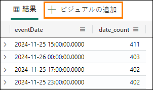
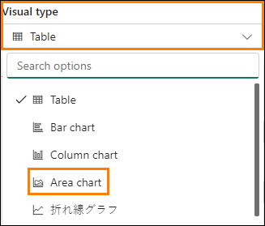
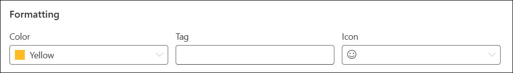

# Microsoft Fabric Real-Time Intelligence in a Day ラボ 5


# 目次 

- ドキュメントの構造 

- 概要 

- リアルタイムダッシュボード 

    - タスク1: リアルタイムダッシュボードを作成する 

    - タスク2: データソースをリアルタイムダッシュボードに接続する 

    - タスク3: KQL を含むリアルタイムダッシュボードタイルを作成する 

    - タスク4: リアルタイムダッシュボードにさらにダッシュボードタイルを追加する 

    - タスク5: 場所別インプレッションのマップビジュアルを追加する 

    - タスク6: リアルタイムダッシュボードで自動更新を設定する 

    - オプションタスク7: 会社のロゴを追加する 

    - オプションタスク8: 条件付き書式をビジュアルに適用する 

- まとめ 

- 参考資料 

 
# ドキュメントの構造

このラボでは、実行する手順だけでなく、視覚的にわかりやすいように、手順に関連するスクリーンショットも提示されます。各スクリーンショットでは、ユーザーが注目する必要のある領域が、オレンジのボックスで強調表示されて示されます。

# 概要

このラボでは、KQL データベースにストリーミングして読み込んだデータを使用し、ショートカットを使用してレイクハウスに簡単にリンクします。さらに、アクセスしたデータストリームからの分析情報を視覚化および共有するためのリアルタイムダッシュボードを作成します。

このラボを終了すると、次のことが学べます。

- Fabric でのリアルタイムダッシュボードの作成

- ダッシュボード内にビジュアルを設定するためのKQL を使用したクエリの作成

- ダッシュボードのビジュアルへの条件付き書式の追加
 
# リアルタイムダッシュボード

## スク 1: リアルタイムダッシュボードを作成する

1. コース用の **Fabric ワークスペース**を開きます。

   

2. **+ 新しい項目**ボタンをクリックして、新しい項目を作成します。
 
    

3. **データの可視化**のカテゴリが表示されます。**リアルタイムダッシュボード**という項目を クリックします。

    

4. リアルタイムダッシュボードに **RTI Dashboard** という名前を付け、**作成**をクリックします。

    

5. リアルタイムダッシュボードの空のインスタンスがすぐに表示されます。

    
 
## タスク 2: データソースをリアルタイムダッシュボードに接続する

1. [ホーム] リボンで、**New data source** というオプションを見つけてクリックします。

    

2. 画面の右側に表示されるポップアップ ペインで、**追加** + をクリックし、**OneLake data hub** を選択します。

    

3. OneLake 内の使用可能なソースの一覧が表示されます。KQL データベースのソースだけが表示されるので、**eh_Fabrikam KQL** データベースという 1 つのオプションのみを使用できます。そのオプションを選択します。

    

4. 画面の下部にある **Connect** をクリックします。

    

5. これで、データソースを作成できます。ポップアップペインの下部にある **Add** ボタンをクリックします。

    

6. これで、リアルタイムダッシュボードにデータソースが 1 つ追加されたことがわかります。ここから、必要に応じてKQL データベースを追加することもできます。ここでは、ウィンドウの下部にある**閉じる**をクリックします。

    
 
## タスク 3: KQL を含むリアルタイムダッシュボードタイルを作成する

1. ダッシュボード内の空白のタイルをクリックして、タイルにビジュアルを設定します。

    

2. 既定では、以前にソースとして作成した KQL データベースに接続します。ここから独自のKQL クエリを作成し、このビジュアルにデータを設定できます。既定で表示される以前のすべてのマークダウンKQL を削除します。以下のクエリをコピーしてクエリ ウィンドウに貼り付けます。

    ```
    //Clicks by hour Clicks
    | where eventDate between (_startTime.._endTime)
    | summarize date_count = count() by bin(eventDate, 1h)
    | render timechart
    | top 30 by date_count
    | sort by eventDate
    ```
    
3. クエリを正しく構成したら実行して、結果を確認します。

    

4. 出力に結果が 1 つしかない場合があることに注意してください。これは、このタイルに対して既定で設定されている**時間の範囲**が原因です。データを返す時間の範囲を変更できるパラメーターがあります。eventDate between (_startTime.._endTime) では、このパラメーターの利用を許可します。**時間の範囲**パラメーターを**過去 3 時間**に変更し て、出力がどのように変わるかを確認します。

    

5. 過去 3 時間の期間中のクリック数の結果がクエリ出力に表示されます。

    
 
6. このパラメーターは変更できますが、ユーザーに変更させる代わりに特定の時間範囲を既定値にすることもできます。時間範囲オプションの上にある @ **パラメーター** オプションをクリックします。

    

7. **鉛筆アイコン**をクリックして、**時間の範囲**パラメーターを編集します。
 
    

8. **既定値を過去 24 時間**に変更すると、既定で過去 1 日が常に表示されます。終わったら、**完了**をクリックします。

    

9. パラメーターペインを閉じます。

10. 次に、クエリ結果の上にある **+ ビジュアルの追加**ボタンをクリックします。

    

11. 画面の右側に新しいポップアップが表示されます。**Tile name** オプションの下のテキストボックスをクリックして、このビジュアルに **Clicks by Hour** という名前を付けます。
 
    

12. 既定では、このKQL クエリの結果の表示に使用しているビジュアルはテーブルです。データの結果をすぐに利用して起きていることを理解するには、この方法が最善ではない可能性があります。視覚化タイプを Table から **Area chart** に変更します。

    
 
13. この新しく書式設定されたビジュアルを使用すると、このクラスで前に作成したデー タストリームを使用して、e コマースサイトのクリック数の山と谷をよりよく理解できます。

    
 
14. このビジュアルをダッシュボードに保存するには、画面の右上隅にある**変更の適用**ボタンをクリックします。

    
  
15. このビジュアルがダッシュボード内に配置された後、ビジュアルが過去 1 時間の結果だけを示している可能性があります。**過去 24 時間の時間の範囲**を表示するようにダッシュボードを変更します。

    

16. ビジュアルを最新の情報に更新すると、クエリの前回の実行以降に取得されたデータを反映するように結果が若干変更されていることがわかります。

    
 
## タスク 4: リアルタイムダッシュボードにさらにダッシュボードタイルを追加する

1. リアルタイム ダッシュボードの**ホーム** リボンから、**New tile** ボタンをクリックします。

    

2. クエリペインに次のKQL クエリを入力します。

    ```
    //Impressions by hour Impressions
    | where eventDate between (_startTime.._endTime)
    | summarize date_count = count() by bin(eventDate, 1h)
    | render timechart
    | top 30 by date_count
    | sort by eventDate
    ```

3. クエリを**実行**します。

    

4.  **+ ビジュアルの追加**ボタンをクリックします。

     

5. 視覚化を編集して、**Tile name** を **Impressions by Hour** に **Visual type** を **Area chart** に変更します。

    
 
6. ビジュアルに変更を適用します。

    

7. 別の **+ New tile** を追加します。

    

8. 次のクエリをコピーしてクエリ ペインに貼り付けます。これは、複数のlet ステートメントと、セミコロンで結合されたクエリを使用する複数ステートメント クエリです。
 
    ```
    //Clicks, Impressions, CTR

    let imp = Impressions
    | where eventDate between (_startTime.._endTime)
    | extend dateOnly = substring(todatetime(eventDate).tostring(), 0, 10)
    | summarize imp_count = count() by dateOnly;

    let clck = Clicks
    | where eventDate between (_startTime.._endTime)
    | extend dateOnly = substring(todatetime(eventDate).tostring(), 0, 10)
    | summarize clck_count = count() by dateOnly;

    imp
    | join clck on $left.dateOnly == $right.dateOnly
    | project selected_date = dateOnly , impressions = imp_count , clicks = clck_count, CTR = clck_count * 100 / imp_count
    ```

9. クエリを**実行**して結果を表示します。

    

10. **+ ビジュアルの追加**ボタンをクリックします。
 
11. ビジュアル設定が表示されたら、次の設定を変更して、Impressions のカウントを作成します。

    - **Tile name** - Impressions
    - **Visual type** - Stat
    - **Value column** - impressions (long)

      

12. すべての設定が適切に構成されている場合は、**変更の適用**を選択します。

    
 
13. 新しいタイルで、省略記号 (...) をクリックし、**タイルの複製**のオプションを選択します。

    

14. 複製したタイルの**鉛筆アイコン**をクリックして、構成を編集します。

    

15. この **Tile name** を **Clicks** に変更し、**Value column** を **clicks (long)** に変更します。

    

16. このビジュアルに変更を適用します。

17. 新しいタイルの 1 つをもう一度複製して、最終的な統計のビジュアルを作成します。

    

18. 新しいタイルを編集して、**Tile name** を **Click Through Rate** に、**Value column** を **CTR (long)** に変更します。

    

19. 変更を適用します。

20. タイルが分離されている場合、またはそれらを再編成する場合は、手のアイコンが表示されるまでタイル上にマウスカーソルを置き、目的のビジュアルをドラッグ アンドドロップできます。
 
    
 
## タスク 5: 場所別インプレッションのマップビジュアルを追加する

1. **新しいタイル**をリアルタイムダッシュボードに追加します。

    

2. 次のクエリをコピーしてクエリペインに貼り付けます。このクエリは、このデータ
ストリームのIP アドレス列から緯度と経度を取り出し、マップ上にプロットできる場所を生成します。このクエリは、これまでのクエリよりも少し時間がかかる可能性があります。

    ```
    //Impressions by location

    Impressions
    | where eventDate between (_startTime.._endTime)
    | join external_table('products') on $left.productId == $right.ProductID
    | project lon = toreal(geo_info_from_ip_address(ip_address).longitude), lat = toreal(geo_info_from_ip_address(ip_address).latitude), Name
    | render scatterchart with (kind = map) //, xcolumn=lon, ycolumns=lat)
    ```

3. クエリを実行して、そのクエリが正しく構成されていることを検証します。**+ ビジュアルの追加**ボタンをクリックします。

    
 
4. **Tile name** を **Impressions by Location** に、**Visual type** を **Map** に変更します。

    

5. **Visual type** 領域で、**場所の定義方法**オプションを**緯度と経度**に変更して緯度と経度が適切に選択されていることを確認し、残りのフィールドが下の画像と一致することを 確認します。

    
 
6. 変更を適用します。

7. ダッシュボード内のマップ ビジュアルの左下にあるアンカーポイントをつかんで、ビジュアルのサイズを大きくします。

    
 
8. すべてのビジュアルは、サイズ変更および移動できます。希望に合わせて自由に再配置してください。

    
 
9. 変更を保存します。

    

 
## タスク 6: リアルタイムダッシュボードで自動更新を設定する
1. **管理**リボンをクリックし、**自動更新**オプションを選択します。

    

2. トグルをオンにして**自動更新**を有効にします。

    

3. **最小時間間隔**を 30 秒に、**既定のリフレッシュ レート**を 1 分に変更します。

    

4. ウィンドウの下部にある**適用**をクリックします。

5. メニューの右上隅で、**編集中**ボタンをクリックしてそれを**表示中**に変更して、このリアルタイムダッシュボードでのエンドユーザーのエクスペリエンスを確認します。

    

6. 会社のロゴを取得したり、以下のように条件付き形式をビジュアルに適用したりすることに関心があり、それを行う時間がある場合は、以下のオプションのタスクを自由に実行してください。そうでなければ、ラボは完了です。
 
    

## オプションタスク 7: 会社のロゴを追加する

1. 前に行ったのと同じように、ダッシュボードの**表示中**モードから**編集中**モードに切り替えます

    

2. [ホーム] リボンの **New text tile** というボタンをクリックします。
    
    

3. 次のマークダウン コードをコピーし、クエリ ウィンドウ内に貼り付けます。

    

    

4. 変更を適用します。

5. リアルタイムダッシュボード内の場所に合わせて、タイルをサイズ変更して移動します。

    

6. 変更を保存します。

    

## オプションタスク 8: 条件付き書式をビジュアルに適用する

1. **Click Through Rate** ビジュアルの**鉛筆アイコン**をクリックします。

    
 
2. ビジュアル書式ペインの下部で、**条件付き書式**の下の **+ Add rule** ボタンをクリックします。

    

3. **鉛筆アイコン**をクリックして、条件付き書式ルールを編集します。
 
    

4. ルールの条件を変更して、**CTR (long)** という **Column** をポイントし、Operator とValue のルールを **> 10** にします。

    
 
5. 必要に応じて書式設定を自由に変更できます。CTR の値が 10 を超える場合は、そのビジュアルに表示されます。
 
    

6. 条件付き書式ペイン内にある**保存**ボタンをクリックします。

    

7. 変更を適用します。

8. 変更を保存します。

    

# まとめ

このラボでは、ユーザーがリアルタイムダッシュボードを作成し、KQL データベースに接続しました。KQL 言語を使用してクエリをキュレーションし、結果をさまざまな方法で視覚化でき、各ビジュアルが独自の構成を持っていることを確認しました。また、ダッシュボードで使用できる既定のパラメーターを変更して、ダッシュボードが自動的に更新されるようにする方法を確認しました。

# 参考資料

Fabric Real-time Intelligence in a Day (RTIIAD) では、Microsoft Fabric で使用できる主要な機能の一部をご紹介します。

サービスのメニューにあるヘルプ (?) セクションには、いくつかの優れたリソースへのリンクがあります。
 
  

Microsoft Fabric の次のステップに役立つリソースをいくつか以下に紹介します。

- ブログ記事で [Microsof t Fabric の GA に関するお知らせ](https://www.microsoft.com/en-us/microsoft-fabric/blog/2023/11/15/prepare-your-data-for-ai-innovation-with-microsoft-fabric-now-generally-available/)の全文を確認する

- [ガイド付きツアー](https://guidedtour.microsoft.com/en-us/guidedtour/microsoft-fabric/microsoft-fabric/1/1)を通じて Fabric を探索する

- [Microsoft Fabric の無料試用版](https://www.microsoft.com/en-us/microsoft-fabric/getting-started)にサインアップする

- [Microsoft Fabric のWeb サイト](https://www.microsoft.com/en-in/microsoft-fabric)にアクセスする

- [Fabric の学習モジュール](https://learn.microsoft.com/en-us/training/browse/?products=fabric&resource_type=module)で新しいスキルを学ぶ

- [Fabric の技術ドキュメント](https://learn.microsoft.com/en-us/fabric/)を参照する

- [Fabric 入門編の無料のe-book](https://info.microsoft.com/ww-landing-unlocking-transformative-data-value-with-microsoft-fabric.html) を読む

- [Fabric コミュニティ](https://community.fabric.microsoft.com/)に参加し、質問の投稿やフィードバックの共有を行い、他のユーザーから学びを得る
 
より詳しい Fabric エクスペリエンスのお知らせに関するブログを参照してください。

- [Fabric のData Factory エクスペリエンスに関するブログ](https://blog.fabric.microsoft.com/en-us/blog/introducing-data-factory-in-microsoft-fabric/)

- [Fabric のSynapse Data Engineering エクスペリエンスに関するブログ](https://blog.fabric.microsoft.com/en-us/blog/introducing-synapse-data-engineering-in-microsoft-fabric/)


- [Fabric のSynapse Data Science エクスペリエンスに関するブログ](https://blog.fabric.microsoft.com/en-us/blog/introducing-synapse-data-science-in-microsoft-fabric/)

- [Fabric のSynapse Data Warehousing エクスペリエンスに関するブログ](https://blog.fabric.microsoft.com/en-us/blog/introducing-synapse-data-warehouse-in-microsoft-fabric/)

- [Fabric のReal-Time Intelligence エクスペリエンスに関するブログ](https://blog.fabric.microsoft.com/en-us/blog/category/real-time-intelligence)

- [Power BI のお知らせに関するブログ](https://powerbi.microsoft.com/en-us/blog/empower-power-bi-users-with-microsoft-fabric-and-copilot/)

- [Fabric のData Activator エクスペリエンスに関するブログ](https://blog.fabric.microsoft.com/en-us/blog/driving-actions-from-your-data-with-data-activator/)

- [Fabric の管理とガバナンスに関するブログ](https://blog.fabric.microsoft.com/en-us/blog/administration-security-and-governance-in-microsoft-fabric/)

- [Fabric の OneLake に関するブログ](https://blog.fabric.microsoft.com/en-us/blog/microsoft-onelake-in-fabric-the-onedrive-for-data/)

- [Dataverse とMicrosof t Fabric の統合に関するブログ](https://www.microsoft.com/en-us/dynamics-365/blog/it-professional/2023/05/24/new-dataverse-enhancements-and-ai-powered-productivity-with-microsoft-365-copilot/)

© 2024 Microsoft Corporation.All rights reserved.

このデモ/ラボを使用すると、次の条件に同意したことになります。

このデモ/ラボで説明するテクノロジまたは機能は、ユーザーのフィードバックを取得 し、学習エクスペリエンスを提供するために、Microsoft Corporation によって提供されます。ユーザーは、このようなテクノロジおよび機能を評価し、Microsoft にフィードバックを提供するためにのみデモ/ラボを使用できます。それ以外の目的には使用できません。このデモ/ラボまたはその一部を、変更、コピー、配布、送信、表示、実行、再現、発行、ライセンス、著作物の作成、転送、または販売することはできません。

複製または再頒布のために他のサーバーまたは場所にデモ/ラボ (またはその一部) をコピーまたは複製することは明示的に禁止されています。

このデモ/ラボは、前に説明した目的のために複雑なセットアップまたはインストールを必要としないシミュレーション環境で潜在的な新機能や概念などの特定のソフトウェアテクノロジ/製品の機能を提供します。このデモ/ラボで表されるテクノロジ/概念 は、フル機能を表していない可能性があり、最終バージョンと動作が異なることがあります。また、そのような機能や概念の最終版がリリースされない場合があります。物理環境でこのような機能を使用するエクスペリエンスが異なる場合もあります。

**フィードバック**。このデモ/ラボで説明されているテクノロジ、機能、概念に関するフィードバックをMicrosoft に提供する場合、ユーザーは任意の方法および目的でユーザ
ーのフィードバックを使用、共有、および商品化する権利を無償でMicrosoft に提供するものとします。また、ユーザーは、フィードバックを含むMicrosoft のソフトウェアまたはサービスの特定部分を使用したり特定部分とインターフェイスを持ったりする製
品、テクノロジ、サービスに必要な特許権を無償でサード パーティに付与します。ユーザーは、フィードバックを含めるためにMicrosoft がサードパーティにソフトウェアまたはドキュメントをライセンスする必要があるライセンスの対象となるフィードバックを提供しません。これらの権限は、本契約の後も存続します。

Microsoft Corporation は、明示、黙示、または法律上にかかわらず、商品性のすべての保証および条件、特定の目的、タイトル、非侵害に対する適合性など、デモ/ラボに関するすべての保証および条件を拒否します。Microsoft は、デモ/ラボから派生する結果、出力の正確さ、任意の目的に対するデモ/ラボに含まれる情報の適合性に関して、いかなる保証または表明もしません。

**免責事項**

このデモ/ラボには、Microsoft Power BI の新機能と機能強化の一部のみが含まれています。一部の機能は、製品の将来のリリースで変更される可能性があります。このデモ/ラボでは、新機能のすべてではなく一部について学習します。