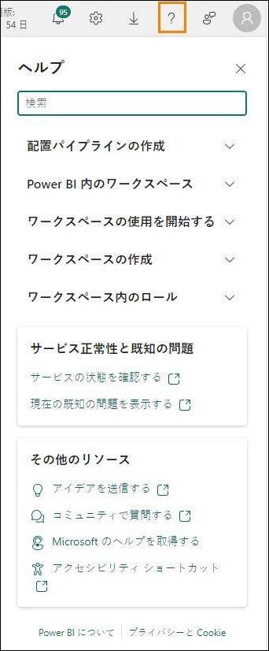

# Microsoft Fabric Real-Time Intelligence in a Day ラボ 6

 
# 目次

- ドキュメントの構造	

- 概要	

- Reflex を使用したアラートの作成	

    - タスク1: リアルタイムダッシュボードを使用してアラートを設定する	

    - タスク2: Reflex エクスペリエンスからメールアラートをテストする	

    - タスク3: データストリームから新しいReflex オブジェクトを作成する	

- リソースをクリーンアップする

- タスク4: ワークスペースをクリーンアップする	

- まとめ	

- 参考資料	

 
ドキュメントの構造

このラボでは、実行する手順だけでなく、視覚的にわかりやすいように、手順に関連するスクリーンショットも提示されます。各スクリーンショットでは、ユーザーが注目する必要のある領域が、オレンジのボックスで強調表示されて示されます。

概要

このラボでは、Data Activator を活用して Reflex を作成し、新たに作成したリアルタイム ダッシュボードからアラートを送信する方法について説明します。また、Reflex の用途を拡張して、イベントハウスにストリーミングするデータに対して追加のカスタム アラートを作成する方法も説明します。
このラボを終了すると、次のことが学べます。

- リアルタイムダッシュボードのアラートオプションからのReflex の作成

- Data Activator のReflex 項目を使用したカスタム アラートの追加作成

# Reflex を使用したアラートの作成

## タスク 1: リアルタイムダッシュボードを使用してアラートを設定する

1.	コースの Fabric ワークスペースを開き、直前のラボで作成したリアルタイム ダッシュボードを選択します。

 
2.	Click Through Rate ビジュアルで、省略記号(…) をクリックし、Set alert のオプションを選択します。

3.	画面の右側に新しいポップアウトが開きます。これからアラートを関連付ける特定のビジュアルを含め、ダッシュボードで何を監視しているかが表示されます。条件はユーザーが
完全に制御できるものです。条件を次の値より小さいに変更します。

4.	値を入力する新しいフィールドが表示されます。これを 20 に変更します。

 
 
5.	条件が満たされたことをData Activator Reflex 項目が認識したときに受け取るアラートのタイプについて、現在
3 つのアクションから選択できます。Teams でメッセージを受け取るオプションを選択します。

6.	最後に、このアラートと一緒に作成している Reflex 項目を格納する場所を決定する必要があります。既定で現在のワークスペースが選択されますが、アイテム ドロップダウンメニューの下で新しい項目を具体的に選択する必要があります。
 
7.	項目の名前を CTR Reflex に変更して、作成をクリックします。作成されるまでしばらくかかります。
 
8.	Reflex アラートが作成されたという検証を受け取ります。オープンボタンをクリック
し、Reflex を開きます。

9.	これにより、正式な Reflex エクスペリエンスに移動します。ここで、データのストリー
ムのリアルタイム監視、Reflex のサポートに使用されるデータの表示、同じストリームからの追加のトリガーの作成を行うことができます。
 
## タスク 2: Reflex エクスペリエンスからメール アラートをテストする

1.	Reflex エクスペリエンスで、イベント名の横にある鉛筆アイコンをクリックし、名前を
CTR is less than 20 に変更します

2.	見出しタイトルとメッセージを更新しましょう。これは、右側のアクション セクション
にあります。下の画像に合わせて 2 つの領域を更新し、保存して更新を選択します。

3.	右側の同じアクション セクションで、テストアクションを送信してくださいボタンをクリックし、Reflex からチーム内のサンプルメッセージを取得します。

 
4.	ご使用環境の Edge ブラウザーの新しいタブを開き、Teams.Microsoft.com に移動します。

5.	求められたら、環境の資格情報を使用してサインインします。試用版を開始するメッセージが表示された場合は、受け入れることができます。

6.	CTR が 20 未満であることを知らせるメッセージがチーム内にあります。

7.	Reflex エクスペリエンスに戻り、もう 1 つのトリガーを作成します。

## タスク 3: データストリームから新しい Reflex オブジェクトを作成する

1.	KQL Source Event というラベルが付いたオブジェクトを選択し、新しいルールを選択します。
 
2.	鉛筆アイコンをクリックし、このルールに Clicks Greater Than 30,000 という名前を付け
ます(多くのデータをストリーミングしましたが、ここでは 1 行に収まる値を選択できます)。

3.	最初に、データストリームの列の 1 つを監視する必要があります。これを行うには、条件とアクションのセクション構成する必要があります。ルールの [定義] タブをクリックして条件とアクションを設定します。

4.	開いた[定義] ページの条件で、次のプロパティを選択します:
-	操作 = 次の値以上
-	列 = clicks
- 値 = 30000

 
5.	アクションで、以下のプロパティを選択します:
-	種類 = Teams message
-	受信者 = {自身のユーザー ID}

6.	最後に、保存して開始をクリックして、このルールを開始します。

7.	これで、同じデータストリームを監視する 2 つのトリガーができました。

 
# リソースをクリーンアップする

## タスク 4: ワークスペースをクリーンアップする

1.	これは、Real-Time Analytics in a Day の最後のラボであり、最後の部分です。ラボを完了し、内容について講師への質問などがない場合は、ワークスペースの割り当て解除を行ってください。RTI_username ワークスペースに移動します。
 
2.	右上隅にあるワークスペースの設定をクリックします。

 
3.	ワークスペースの設定の全般で、下にスクロールして、このワークスペースを削除する
ボタンをクリックします。

4.	ラボと講習はこれで完了です。
 
# まとめ

このラボでは、Data Activator について説明しました。この機能を使用して、リアルタイム ダッシュボードまたはデータのストリームに直接接続し、そのデータに対してトリガーを作成できます。そのようなトリガーに検出条件を構成することができ、その条件が満たされると、アクションを実行できます。このラボでは、その機能を使用して、トリガーで特定の条件が満たされたときにメールを送信しました。Data Activator はまだプレビューであり、今 後、新しい機能が提供される可能性があります。

# 参考資料

Fabric Real-time Intelligence in a Day (RTIIAD) では、Microsoft Fabric で使用できる主要な機能の一部をご紹介します。

サービスのメニューにあるヘルプ (?) セクションには、いくつかの優れたリソースへのリンクがあります。
 
  

Microsoft Fabric の次のステップに役立つリソースをいくつか以下に紹介します。

- ブログ記事で [Microsof t Fabric の GA に関するお知らせ](https://www.microsoft.com/en-us/microsoft-fabric/blog/2023/11/15/prepare-your-data-for-ai-innovation-with-microsoft-fabric-now-generally-available/)の全文を確認する

- [ガイド付きツアー](https://guidedtour.microsoft.com/en-us/guidedtour/microsoft-fabric/microsoft-fabric/1/1)を通じて Fabric を探索する

- [Microsoft Fabric の無料試用版](https://www.microsoft.com/en-us/microsoft-fabric/getting-started)にサインアップする

- [Microsoft Fabric のWeb サイト](https://www.microsoft.com/en-in/microsoft-fabric)にアクセスする

- [Fabric の学習モジュール](https://learn.microsoft.com/en-us/training/browse/?products=fabric&resource_type=module)で新しいスキルを学ぶ

- [Fabric の技術ドキュメント](https://learn.microsoft.com/en-us/fabric/)を参照する

- [Fabric 入門編の無料のe-book](https://info.microsoft.com/ww-landing-unlocking-transformative-data-value-with-microsoft-fabric.html) を読む

- [Fabric コミュニティ](https://community.fabric.microsoft.com/)に参加し、質問の投稿やフィードバックの共有を行い、他のユーザーから学びを得る
 
より詳しい Fabric エクスペリエンスのお知らせに関するブログを参照してください。

- [Fabric のData Factory エクスペリエンスに関するブログ](https://blog.fabric.microsoft.com/en-us/blog/introducing-data-factory-in-microsoft-fabric/)

- [Fabric のSynapse Data Engineering エクスペリエンスに関するブログ](https://blog.fabric.microsoft.com/en-us/blog/introducing-synapse-data-engineering-in-microsoft-fabric/)

- [Fabric のSynapse Data Science エクスペリエンスに関するブログ](https://blog.fabric.microsoft.com/en-us/blog/introducing-synapse-data-science-in-microsoft-fabric/)

- [Fabric のSynapse Data Warehousing エクスペリエンスに関するブログ](https://blog.fabric.microsoft.com/en-us/blog/introducing-synapse-data-warehouse-in-microsoft-fabric/)

- [Fabric のReal-Time Intelligence エクスペリエンスに関するブログ](https://blog.fabric.microsoft.com/en-us/blog/category/real-time-intelligence)

- [Power BI のお知らせに関するブログ](https://powerbi.microsoft.com/en-us/blog/empower-power-bi-users-with-microsoft-fabric-and-copilot/)

- [Fabric のData Activator エクスペリエンスに関するブログ](https://blog.fabric.microsoft.com/en-us/blog/driving-actions-from-your-data-with-data-activator/)

- [Fabric の管理とガバナンスに関するブログ](https://blog.fabric.microsoft.com/en-us/blog/administration-security-and-governance-in-microsoft-fabric/)

- [Fabric の OneLake に関するブログ](https://blog.fabric.microsoft.com/en-us/blog/microsoft-onelake-in-fabric-the-onedrive-for-data/)

- [Dataverse とMicrosof t Fabric の統合に関するブログ](https://www.microsoft.com/en-us/dynamics-365/blog/it-professional/2023/05/24/new-dataverse-enhancements-and-ai-powered-productivity-with-microsoft-365-copilot/)

© 2024 Microsoft Corporation.All rights reserved.

このデモ/ラボを使用すると、次の条件に同意したことになります。

このデモ/ラボで説明するテクノロジまたは機能は、ユーザーのフィードバックを取得 し、学習エクスペリエンスを提供するために、Microsoft Corporation によって提供されます。ユーザーは、このようなテクノロジおよび機能を評価し、Microsoft にフィードバックを提供するためにのみデモ/ラボを使用できます。それ以外の目的には使用できません。このデモ/ラボまたはその一部を、変更、コピー、配布、送信、表示、実行、再現、発行、ライセンス、著作物の作成、転送、または販売することはできません。

複製または再頒布のために他のサーバーまたは場所にデモ/ラボ (またはその一部) をコピーまたは複製することは明示的に禁止されています。

このデモ/ラボは、前に説明した目的のために複雑なセットアップまたはインストールを必要としないシミュレーション環境で潜在的な新機能や概念などの特定のソフトウェアテクノロジ/製品の機能を提供します。このデモ/ラボで表されるテクノロジ/概念 は、フル機能を表していない可能性があり、最終バージョンと動作が異なることがあります。また、そのような機能や概念の最終版がリリースされない場合があります。物理環境でこのような機能を使用するエクスペリエンスが異なる場合もあります。

**フィードバック**。このデモ/ラボで説明されているテクノロジ、機能、概念に関するフィードバックをMicrosoft に提供する場合、ユーザーは任意の方法および目的でユーザ
ーのフィードバックを使用、共有、および商品化する権利を無償でMicrosoft に提供するものとします。また、ユーザーは、フィードバックを含むMicrosoft のソフトウェアまたはサービスの特定部分を使用したり特定部分とインターフェイスを持ったりする製
品、テクノロジ、サービスに必要な特許権を無償でサード パーティに付与します。ユーザーは、フィードバックを含めるためにMicrosoft がサードパーティにソフトウェアまたはドキュメントをライセンスする必要があるライセンスの対象となるフィードバックを提供しません。これらの権限は、本契約の後も存続します。

Microsoft Corporation は、明示、黙示、または法律上にかかわらず、商品性のすべての保証および条件、特定の目的、タイトル、非侵害に対する適合性など、デモ/ラボに関するすべての保証および条件を拒否します。Microsoft は、デモ/ラボから派生する結果、出力の正確さ、任意の目的に対するデモ/ラボに含まれる情報の適合性に関して、いかなる保証または表明もしません。

**免責事項**

このデモ/ラボには、Microsoft Power BI の新機能と機能強化の一部のみが含まれています。一部の機能は、製品の将来のリリースで変更される可能性があります。このデモ/ラボでは、新機能のすべてではなく一部について学習します。