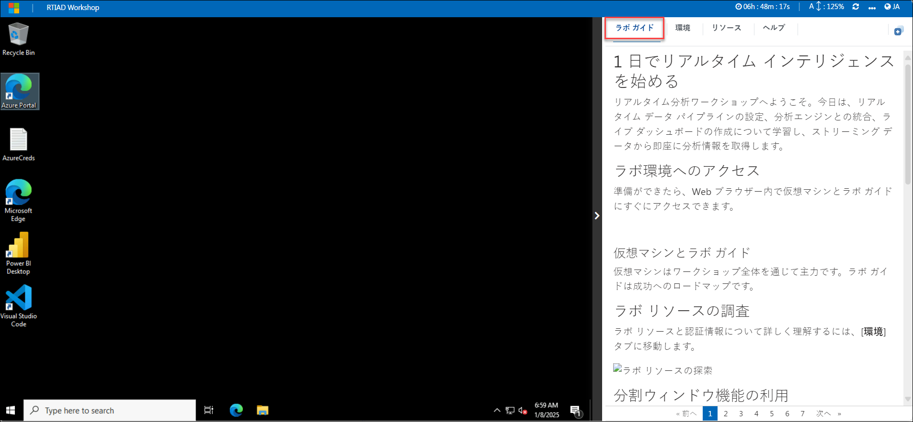
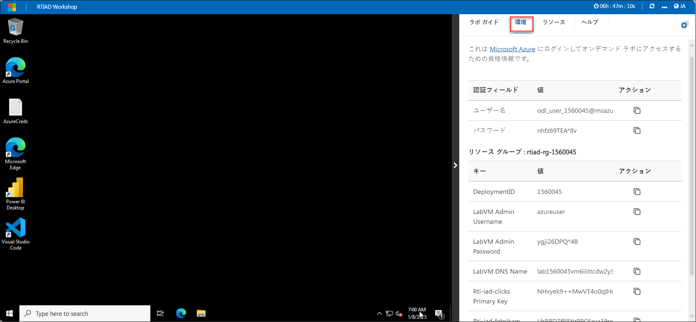
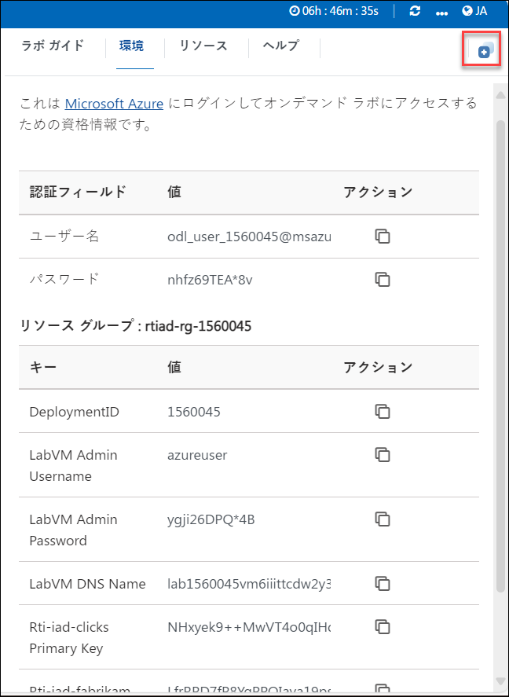
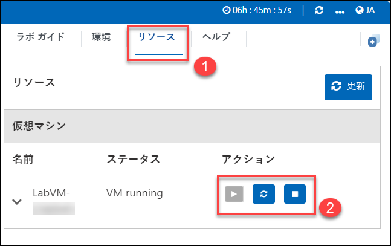
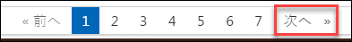

# 1 日でリアルタイム インテリジェンスを始める

リアルタイム分析ワークショップへようこそ。今日は、リアルタイム データ パイプラインの設定、分析エンジンとの統合、ライブ ダッシュボードの作成について学習し、ストリーミング データから即座に分析情報を取得します。

## ラボ環境へのアクセス

準備ができたら、Web ブラウザー内で仮想マシンとラボ ガイドにすぐにアクセスできます。

### 仮想マシンとラボ ガイド

仮想マシンはワークショップ全体を通じて主力です。ラボ ガイドは成功へのロードマップです。

## ラボ リソースの調査

ラボ リソースと認証情報について詳しく理解するには、[**環境**] タブに移動します。

## 分割ウィンドウ機能の利用

便宜上、右上隅の [**分割ウィンドウ**] ボタンを選択すると、ラボ ガイドを別のウィンドウで開くことができます。

## 仮想マシンの管理

必要に応じて、[**リソース**] タブから仮想マシンを起動、停止、または再起動してください。体験はあなた次第です!

## Azure Portal を使い始めましょう

1. 仮想マシンで、次に示すように Azure Portal アイコンをクリックします。

    

1. [**Microsoft Azure にサインイン**] タブが表示されます。ここで、資格情報を入力します:

    - **メール/ユーザー名:** <inject key="AzureAdUserEmail"></inject>

      

1. 次に、パスワードを入力します:

    - **パスワード:** <inject key="AzureAdUserPassword"></inject>

      

1. サインインしたままにするよう求められたら、[いいえ] をクリックします。

1. [Microsoft Azure へようこそ] ポップアップ ウィンドウが表示されたら、[**キャンセル**] をクリックしてツアーをスキップします。

1. 右下隅の [次へ] をクリックして、ラボの旅に乗り出します!

    

これで、テクノロジの強力な世界を探索する準備が整いました。途中でご質問がありましたら、お気軽にお問い合わせください。ワークショップをお楽しみください!
