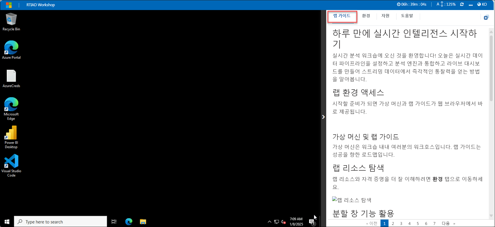
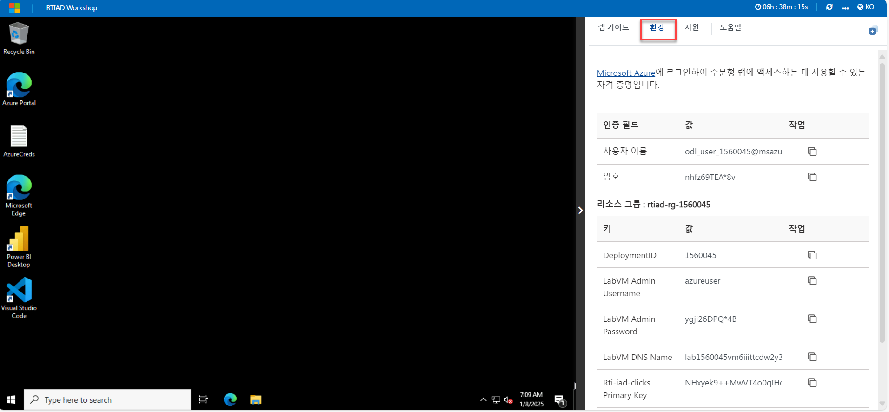
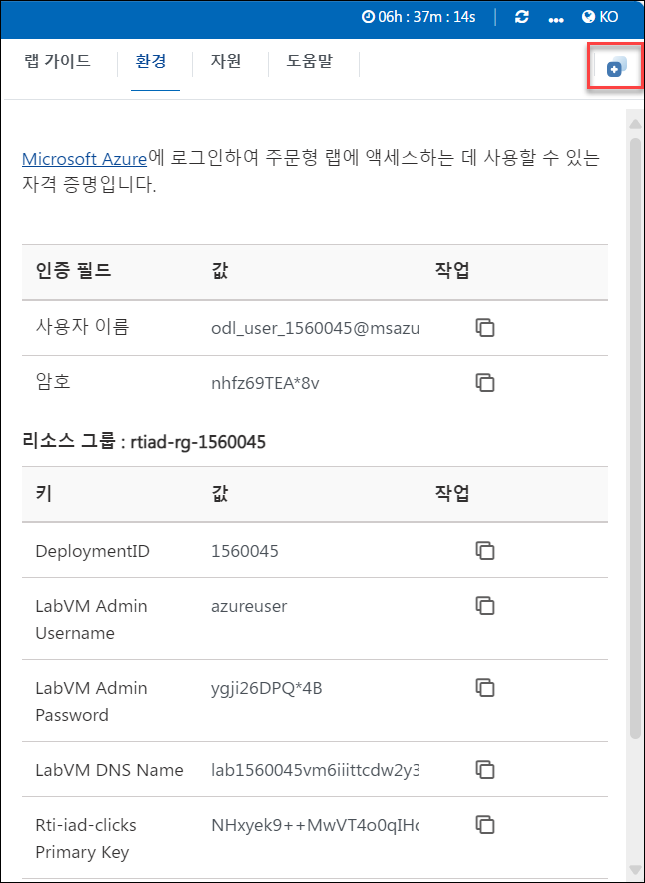
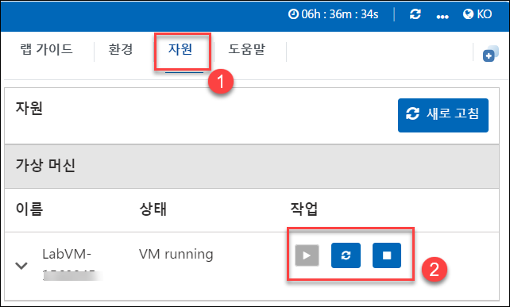
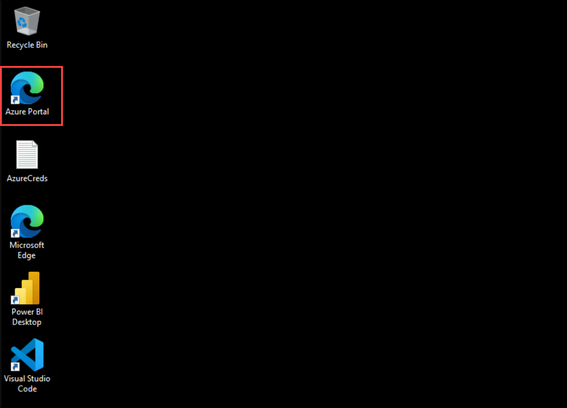
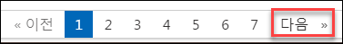

# 하루 만에 실시간 인텔리전스 시작하기

실시간 분석 워크숍에 오신 것을 환영합니다! 오늘은 실시간 데이터 파이프라인을 설정하고 분석 엔진과 통합하고 라이브 대시보드를 만들어 스트리밍 데이터에서 즉각적인 통찰력을 얻는 방법을 알아봅니다.

## 랩 환경 액세스

시작할 준비가 되면 가상 머신과 랩 가이드가 웹 브라우저에서 바로 제공됩니다.

### 가상 머신 및 랩 가이드

가상 머신은 워크숍 내내 여러분의 워크호스입니다. 랩 가이드는 성공을 향한 로드맵입니다.

## 랩 리소스 탐색

랩 리소스와 자격 증명을 더 잘 이해하려면 **환경** 탭으로 이동하세요.

## 분할 창 기능 활용

편의를 위해 오른쪽 상단 모서리에서 **분할 창** 버튼을 선택하여 랩 가이드를 별도의 창에서 열 수 있습니다.

## 가상 머신 관리

필요에 따라 **리소스** 탭에서 가상 머신을 시작, 중지 또는 다시 시작할 수 있습니다. 귀하의 경험은 귀하의 손에 달려 있습니다!

## Azure Portal 시작하기

1. 가상 머신에서 아래와 같이 Azure Portal 아이콘을 클릭합니다.

    

1. **Microsoft Azure에 로그인** 탭이 표시됩니다. 여기에 자격 증명을 입력하세요.

    - **이메일/사용자 이름:** <inject key="AzureAdUserEmail"></inject>

      

1. 다음으로 비밀번호를 입력하세요.

    - **비밀번호:** <inject key="AzureAdUserPassword"></inject>

      

1. 로그인 상태를 유지하라는 메시지가 표시되면 "아니요"를 클릭하세요.

1. **Microsoft Azure에 오신 것을 환영합니다** 팝업 창이 나타나면 "**취소**"를 클릭하여 투어를 건너뜁니다.

1. 오른쪽 하단 모서리에서 "다음"을 클릭하여 랩 여정을 시작하세요!

    

이제 강력한 기술 세계를 탐험할 준비가 되었습니다. 도중에 질문이 있으면 언제든지 연락하세요. 워크숍을 즐기세요!
