# Microsoft Fabric Real-Time Intelligence in a Day 랩 1

# 목차

- 문서 구조	
- 시나리오/문제 설명	
- 소개	
- Fabric 라이선스	
    - 작업 1: Microsoft Fabric 평가판 라이선스 활성화	
- Real-Time Intelligence 및 실시간 허브	
    - 작업 2: Real-Time Intelligence 환경 항목	
    - 작업 3: 실시간 허브	
- 작업 영역과 Eventhouse 만들기	
    - 작업 4: Fabric 작업 영역 만들기	
    - 작업 5: Eventhouse 만들기	
- 참조	

 
# 문서 구조

이 랩에서는 사용자가 수행해야 하는 단계를 보조 시각 자료의 관련 스크린샷과 함께 확인할 수 있습니다. 스크린샷에서 주황색 상자로 강조 표시된 섹션은 사용자가 특히 주목해야 하는 영역입니다.

# 시나리오/문제 설명

Fabrikam 은 다양한 아웃도어 장비와 액세서리를 전문으로 하는 전자 상거래 회사입니다. 이 회사는 자체 온라인 플랫폼을 기반으로 전 세계 소매 고객의 요구를 충족시키고 있으며 새로운 국제 시장에서 입지를 강화할 계획입니다. 전자 상거래 사이트에서 실시간 통찰력을 제공하여 경영진이 최신 정보를 기반으로 적시에 결정을 내릴 수 있는 기능을 제공하는 새로운 이니셔티브가 있습니다.

영업팀의 분석 엔지니어는 비즈니스 문제를 해결하기 위해 데이터 집합을 수집, 정리, 해석하는 업무를 담당합니다. 배치 데이터 파이프라인을 생성 및 유지 관리하고, 차트 및 그래프와 같은 시각화를 개발하고, 포괄적인 의미 체계 모델과 보고서를 빌드 및 최적화하고, 조직의 의사 결정자에게 결과를 제시합니다.
현재 과제

- 전자 상거래 웹 사이트에서 지속적인 실시간 데이터 스트림을 처리해야 하며 이 작업을 수행하기 위해서는 강력하고 확장 가능한 아키텍처가 필요합니다.

- 빠르게 돌아가는 온라인 판매의 특성을 따라잡기 위해 실시간 데이터 처리 및 분석을 보장합니다.

- 사용자 상호 작용, 트랜잭션, 웹 사이트 활동으로 생성된 데이터의 볼륨과 속도를 처리합니다.

- 실시간 스트리밍 데이터를 기록 데이터와 통합하여 포괄적인 분석을 수행합니다.

- Eventhouse 환경에서 Medallion 아키텍처를 사용하여 데이터 흐름을 효율적으로 구성합니다.

- 레이크하우스 내에서 Eventhouse 데이터를 활용합니다.

- Microsoft Fabric 을 활용하여 위 과제를 해결하고 Eventhouse, KQL 데이터베이스, Eventstream 을 사용하여 탄력적이고 효율적인 데이터 처리 파이프라인을 구축하는 데 관심이 있습니다.
 
# 소개

오늘은 Microsoft Fabric 의 다양한 주요 기능을 학습하게 됩니다. 본 랩은 Fabric 에서 이용할 수 있는 다양한 제품 환경과 항목을 소개하기 위한 입문 워크샵입니다. 이 워크샵이 끝나면 Eventhouse, 데이터 파이프라인, Eventstream, KQL 쿼리 집합, 실시간 대시보드를 사용하는 
방법을 알게 됩니다.

이 랩을 마치면 다음 사항을 알게 됩니다.

- Fabric 페르소나 탐색 방법
- Fabric 작업 영역을 만드는 방법
- Eventhouse 를 만드는 방법

# Fabric 라이선스

## 작업 1: Microsoft Fabric 평가판 라이선스 활성화

1. 바탕 화면에서 **Microsoft Edge 브라우저**를 열어서 https://app.fabric.microsoft.com/으로 이동합니다. 로그인 페이지가 열립니다. **참고:** 랩 환경을 사용하지 않고 기존 Power BI 계정이 있는 경우 브라우저를 비공개/익명 모드로 사용하기를 원할 수도 있습니다.

     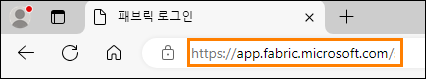

2. **환경 변수** 탭(랩 가이드 옆)에 있는 **사용자 이름을 전자 메일**로 입력하고 **제출**을 클릭합니다.

     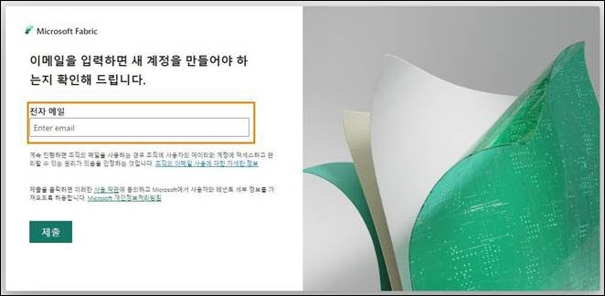
 
3. **암호** 화면이 열립니다. 강사가 **공유한 환**경 변수 탭(랩 가이드 옆)에 있는 **암호**를 입력합니다.

4. **로그인**을 클릭하고 안내에 따라 Fabric 에 로그인합니다.

     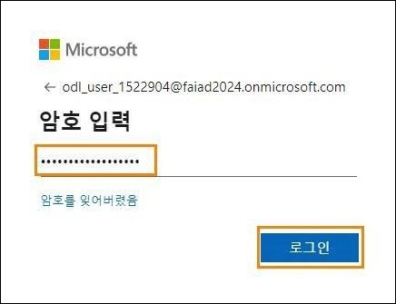
 
5. **Fabric 홈**으로 이동합니다.

     

     Fabric 항목으로 작업하려면 평가판 라이선스와 Fabric 라이선스가 있는 작업 영역이 필요합니다. 설정해 봅시다.

6. 화면의 오른쪽 상단 모서리에서 **사용자 아이콘**을 선택합니다.

7. **평가판**을 선택합니다.

     
 
8. 무료 Microsoft Fabric 평가판으로 업그레이드 대화상자가 열립니다. **활성화**를 선택합니다.

     

9. Microsoft Fabric 업그레이드 성공 대화 상자가 열립니다. **Fabric 홈 페이지**를 선택합니다.

     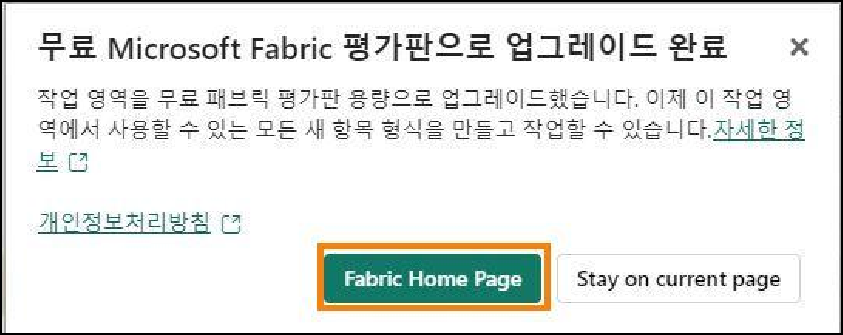

10. **Microsoft Fabric 홈 페이지**로 다시 이동합니다.

     
 
# Real-Time Intelligence 및 실시간 허브

## 작업 2: Real-Time Intelligence 환경 항목

1. Real-Time Intelligence 환경을 클릭합니다.

     

2. **Real-Time Intelligence 홈 페이지**로 이동됩니다. **작업 흐름 템플릿, 추천 항목 생성, Real-Time Intelligence 에 대해 자세히 알아보기** 범주가 표시됩니다. **추천** 범주에서 다음 항목을 확인합니다.

     a. **Eventhouse:** 프로젝트 간에 공유할 수 있는 하나 이상의 KQL 데이터베이스 작업 영역을 만드는 데 사용됩니다. 또한 Eventhouse 내에 KQL 데이터베이스를 만듭니다.

     b. **KQL 쿼리 집합:** 공유 가능한 테이블과 시각적 개체를 생성하기 위해 데이터에 대한 쿼리를 실행하는 데 사용됩니다.

     c. **실시간 대시보드:** 필요에 따라 페이지로 구성된 타일 컬렉션으로, 타일마다 기본 쿼리와 시각적 표현이 있습니다.

     d. **Eventstream:** 실시간 Eventstream 을 캡처, 변환 및 라우팅하는 데 사용됩니다.
     
     e. **Reflex:** 데이터 변경에서 패턴이나 조건이 감지되면 자동으로 조치를 취합니다.

     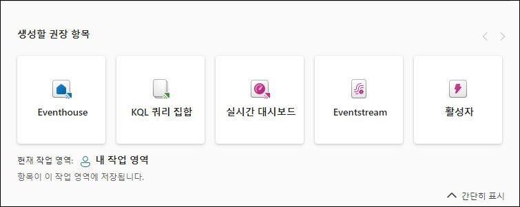

# 작업 3: 실시간 허브

1. 화면 왼쪽의 Fabric 탐색 창에서 **실시간**를 클릭합니다.

     
 
2. **실시간 허브** 시작 대화 상자가 열리고 **둘러보기** 또는 **시작**을 자유롭게 선택할 수 있습니다.

     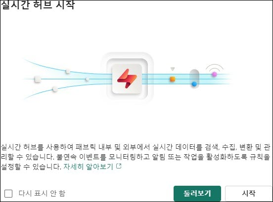

3. 실시간 허브는 조직 전체에서 이동 중인 데이터를 스트리밍할 수 있는 단일 장소입니다. 모든 Microsoft Fabric 테넌트는 이 허브와 함께 자동으로 프로비저닝됩니다. 이를 통해 다양한 원본에서 이동 중인 데이터를 쉽게 검색, 수집, 관리, 사용할 수 있습니다.

4. 실시간 허브 내에서 세 가지 유형의 데이터 통합에 액세스할 수 있습니다.

     - **모든 데이터 스트림:** 이것은 실행 중인 Eventstream 과 KQL 데이터베이스를 위한 것이므로, Eventstream 의 모든 스트림 출력과 KQL 데이터베이스의 테이블이 실시간 허브에 자동으로 표시됩니다.

     - **스트리밍 원본:** Microsoft 서비스의 모든 스트리밍 리소스를 나열합니다. Azure Event Hubs, Azure IoT 허브 또는 기타 서비스에서 데이터를 실시간 허브로 원활하게 수집할 수 있습니다.

     - **Fabric 이벤트:** Fabric 아티팩트와 외부 원본을 통해 생성된 이벤트는 실시간 경고 및 다운스트림 작업 트리거와 같은 이벤트 기반 시나리오를 지원하기 위해 Fabric 에서 사용할 수 있습니다. Fabric 작업 영역 항목 이벤트와 Azure Blob Storage 이벤트를 포함한 이벤트를 모니터링하고 이에 대응할 수 있습니다.

     - **Azure 이벤트:** 이 목록에는 Azure 에서 생성된 시스템 이벤트가 포함되어 있어 사용자가 액세스할 수 있습니다. 이벤트를 모니터링하고, 활성화되었을 때 알림을 보내거나 작업을 수행하는 규칙을 설정할 수 있습니다.

       
 
5. 실시간 허브의 오른쪽 위 모서리에서 **데이터 원본 연결** 버튼을 클릭합니다.

     

6. 창이 나타나고 실시간 허브에 통합할 수 있는 현재 사용 가능한 데이터 스트림이 자세히 표시됩니다. 여기에는 Azure 원본과 Amazon Kinesis, Confluent Cloud Kafka, Google Cloud Pub/Sub 와 같은 외부 클라우드 스트리밍 원본이 혼합되어 포함됩니다. 탐색할 수 있는 몇 가지 샘플 데이터도 있습니다.

     

7. 오른쪽 상단 모서리에서 "X"를 클릭하여 이벤트 가져오기 창을 **닫습니다**.
 
# 작업 영역과 Eventhouse 만들기

## 작업 4: Fabric 작업 영역 만들기

1. 이제 Fabric 라이선스로 작업 영역을 만들어 보겠습니다. 왼쪽 탐색 모음에서 **작업 영역**을 선택합니다.

2. **+ 새 작업 영역**을 선택합니다.

     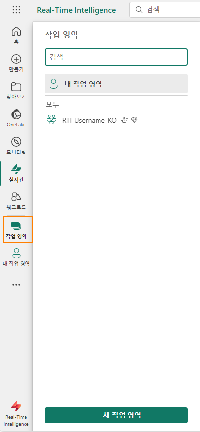

3. 브라우저 오른쪽에 **작업 영역 만들기** 대화상자가 열립니다.

4. 이름 필드에 RTI_username 을 입력합니다. 환경 세부 정보에서 제공된 사용자 이름을 사용합니다.

    > **참고:** 작업 영역 이름은 고유해야 합니다. 이름 필드 아래에 "**이 이름을 사용할 수 있습니다.**"라는 문구와 함께 녹색 확인 표시가 있는지 확인합니다.

5. 원하는 경우 작업 영역에 대한 **설명**을 입력할 수 있습니다. 이는 선택적 필드입니다.
 
6. **고급**을 클릭하여 섹션을 확장합니다.

     

7. **라이선스 모드에서 평가판** 이 선택되어 있는지 확인합니다. (기본적으로 선택되어 있어야 합니다.)

8. **적용**을 선택하여 새 작업 영역을 만듭니다.

     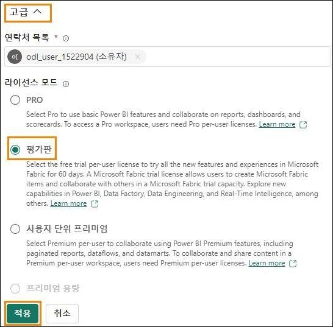

    > **참고:** 작업 흐름 소개 대화 상자가 열리면 확인을 클릭합니다.
 
     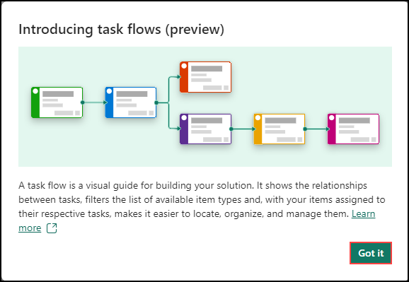
 
# 작업 5: Eventhouse 만들기

1. **+ 새 항목** 상자를 클릭하면 이 Fabric 작업 영역에서 만들 수 있는 모든 항목이 있는 새 창이 열립니다.

     

2. 창의 **데이터 저장** 섹션에서 **Eventhouse** 를 선택합니다. 앞서 이야기했듯이 이 Eventhouse 는 데이터를 저장할 수 있다는 점에서 레이크하우스와 유사해 보일 수 있지만 실시간 데이터에 중점을 두고 있습니다.

     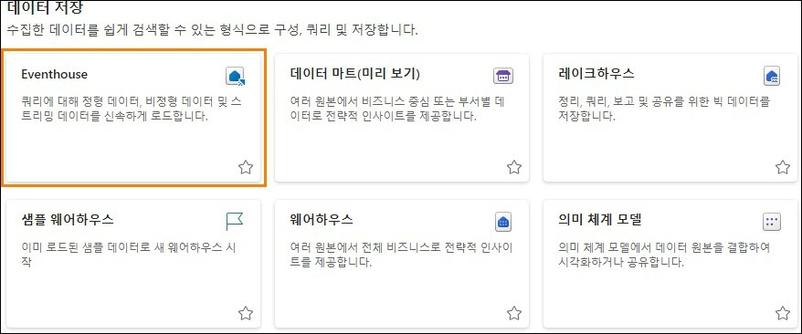
 
3. 표시되는 창에서 Eventhouse 이름을 **eh_Fabrikam** 으로 지정하고 **만들기**를 클릭합니다.

     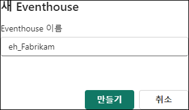

4. 여기에서 오늘 학습의 나머지 부분을 통해 궁극적으로 다양한 원본의 데이터를 스트리밍하게 됩니다. 항목이 생성되면 Eventhouse 에 대한 세부 정보를 제공하는 창이 나타납니다. **시작** 버튼을 클릭합니다.

     

5. 화면에 표시되는 녹색 도구 설명에 따라 Eventhouse 를 빠르게 둘러봅니다. 이 첫 번째 항목은
Eventhouse 를 사용하여 빈 KQL(Kusto 쿼리 언어) 데이터베이스를 만들었음을 보여 줍니다.

     
 
6. 화면 주변에 표시되는 나머지 도구 설명을 따라 추가 데이터베이스를 만들 위치를 표시하고, Eventhouse 의 OneLake 에서 스토리지를 확인하고, 컴퓨팅 시간(분) 동안 Fabric 리소스의 사용량을 확인하고, 마지막으로 Eventhouse 에서 어떤 작업이 발생했는지 확인합니다.

7. Eventhouse 왼쪽의 탐색 창에서 Eventhouse 와 함께 생성된 KQL 데이터베이스를 찾아 클릭하여 데이터베이스 세부 정보를 확인할 수 있습니다.

     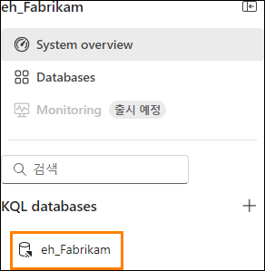

8. 이렇게 하면 왼쪽 브라우저 창에는 전체 Eventhouse 개요를 볼 수 있는 탭 하나와 KQL 데이터베이스 속성에 집중할 수 있는 새 탭이 있습니다. 이 시나리오에서 달성하고자 하는 한 가지 목표는 KQL 데이터베이스로 스트리밍되는 데이터에 OneLake 를 통해 액세스할 수 있도록 하는 것입니다. 이 기능을 활성화하면 원하는 모든 레이크하우스에서 사용할 수 있는 바로 가기를 통해 이 KQL 데이터베이스에 포함된 데이터를 쉽게 검색할 수 있습니다. 오른쪽에서 **데이터베이스 세부 정보** 섹션을 찾아 "가용성" 옵션을 **켭니다**.

     
 
9. 브라우저 왼쪽에서 **RTI_username** 작업 영역을 선택하여 돌아갑니다.

     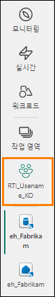

10. **작업 흐름** 옵션이 대부분의 공간을 차지하는 경우 오른쪽에 있는 이중 위쪽 화살표를 선택하여 최소화합니다

     

11. 이제 스트리밍 데이터를 OneLake 로 수집하는 방법에 대한 기초를 마련했습니다. 다음 단계는 이동 중인 데이터를 수신할 수 있는 데이터 스트림을 만드는 것입니다.

     

이 랩에서는 Real-Time Intelligence 인터페이스를 살펴보고, 실시간 허브를 검토하고, Fabric 작업 영역과 KQL 데이터베이스와 함께 제공되는 Eventhouse 를 만들었습니다. 다음 랩에서는 데이터 자산의 다양한 원본에서 OneLake 로 데이터를 수집하는 기술을 살펴보고 KQL(Kusto 쿼리 언어)을 사용하여 몇 가지 기본 분석을 수행합니다.
 
# 참조

Fabric Real-Time Intelligence in a Day(RTIIAD)는 Microsoft Fabric 에서 사용할 수 있는 몇 가지 주요 기능을 소개합니다.

서비스의 메뉴에 있는 도움말(?) 섹션에는 유용한 리소스로 연결되는 링크가 있습니다.

   

아래는 Microsoft Fabric 의 다음 단계에 도움이 되는 몇 가지 추가 자료입니다.

- [Microsoft Fabric GA 발표 ](https://aka.ms/Fabric-Hero-Blog-Ignite23)전문을 블로그 포스트로 읽기

- [가이드 투어](https://aka.ms/Fabric-GuidedTour)로 Fabric 탐색

- [Microsoft Fabric 무료 평가판](https://aka.ms/try-fabric) 신청

- [Microsoft Fabric 웹 사이트](https://aka.ms/microsoft-fabric) 방문

- [Fabric 학습 모듈](https://aka.ms/learn-fabric)을 탐색해서 새로운 기술 익히기

- [Fabric 기술 문서](https://aka.ms/fabric-docs) 검토

- [Fabric 시작하기 무료 e 북](https://aka.ms/fabric-get-started-ebook) 읽기

- [Fabric 커뮤니티](https://aka.ms/fabric-community)에 가입하여 질문을 게시하고 피드백을 공유하며 다른 사람들로부터 배우기
 
더 많은 심층 Fabric 환경 발표 블로그 포스트 읽기:

- [Fabric 블로그의 Data Factory 환경](https://aka.ms/Fabric-Data-Factory-Blog)

- [Fabric 블로그의 Synapse Data Engineering 환경](https://aka.ms/Fabric-DE-Blog)

- [Fabric 블로그의 Synapse Data Science 환경](https://aka.ms/Fabric-DS-Blog)

- [Fabric 블로그의 Synapse Data Warehousing 환경](https://aka.ms/Fabric-DW-Blog)

- [Fabric 블로그의 Real-Time Intelligence 환경](https://blog.fabric.microsoft.com/en-us/blog/category/real-time-intelligence)

- [Power BI 발표 블로그](https://aka.ms/Fabric-PBI-Blog)

- [Fabric 블로그의 Data Activator 환경](https://aka.ms/Fabric-DA-Blog)

- [Fabric 블로그의 관리 및 거버넌스 ](https://aka.ms/Fabric-Admin-Gov-Blog)

- [Fabric 블로그의 OneLake](https://aka.ms/Fabric-OneLake-Blog)

- [Dataverse 및 Microsof t Fabric 통합 블로그](https://aka.ms/Dataverse-Fabric-Blog)

© 2024 Microsoft Corporation. All rights reserved.

이 데모/랩을 사용하면 다음 조건에 동의하게 됩니다.

이 데모/랩에 설명된 기술/기능은 학습 환경을 제공하고 사용자 의견을 얻기 위해 Microsoft Corporation 에서 제공합니다. 데모/랩을 통해서만 이러한 기술적 특성과 기능을 평가하고 사용자 의견을 Microsoft 에 제시할 수 있습니다. 다른 용도로는 사용할 수 없습니다. 이 데모/랩 또는 그 일부에 대해 수정, 복사, 배포, 전송, 표시, 수행, 재현, 게시, 라이선스 허여, 파생 작업 생성, 양도 또는 판매할 수 없습니다.

추가 복제 또는 재배포를 위한 다른 서버 또는 위치에 대한 데모/랩(또는 그 일부)의 복사 또는 재현은 명시적으로 금지됩니다.

이 데모/랩은 위에서 명시한 목적을 위해 복잡한 설정 또는 설치가 없는 시뮬레이션된 환경에서 잠재적인 새로운 기능과 개념을 포함하여 특정 소프트웨어 기술/제품의 특성 및 기능을 제공합니다. 이 데모/랩에서 서술된 기술/개념은 전체 기능을 나타내지 않을 수 있으며, 최종 버전이 작동하지 않을 수도 있습니다. 또한 해당 기능 또는 개념의 최종 버전을 릴리스하지 않을 수도 있습니다. 또한 실제 환경에서 이러한 특성과 기능을 사용한 경험이 다를 수도 있습니다.
 
**피드백.** 이 데모/랩에서 서술된 기술적 특성, 기능 및/또는 개념에 대한 피드백을 Microsoft 에 제시하면 Microsoft 는 이 피드백을 어떤 방식과 목적으로든 무료로 사용, 공유 및 상용화할 수 있습니다. 또한 제품, 기술 및 서비스에서 피드백이 포함된 Microsoft 소프트웨어 또는 서비스의 특정 부분을 사용하거나 인터페이스하는 데 필요한 모든 특허권을 제 3 자에게 무료로 제공합니다. Microsoft 에서 사용자 의견을 포함하기 때문에 Microsoft 에서 해당 소프트웨어 또는 설명서의 사용을 인가해야 하는 라이선스에 종속된 사용자 의견은 제공할 수 없습니다. 이러한 권리는 본 계약에 의거하여 유효합니다.

Microsoft Corporation 은 이에 따라 명시적, 묵시적 또는 법적 특정 목적에의 적합성, 권리 및 비침해 여부에 관계없이 상품성에 대한 모든 보증과 조건을 포함하여 데모/랩과 관련된 모든 보증 및 조건을부인합니다. Microsoft 는 어떤 목적으로든 결과의 정확성, 데모/랩의 사용으로 파생된 출력 또는 데모/랩에 포함된 정보의 적합성과 관련하여 어떠한 보증이나 진술도 하지 않습니다.

# 고지 사항

이 데모/랩에는 Microsoft Power BI 의 새로운 기능 및 향상된 기능 중 일부만 포함되어 있습니다. 일부 기능은 제품의 향후 릴리스에서 변경될 수 있습니다. 이 데모/랩에서는 새로운 기능 모두가 아닌 일부에 대해 학습하게 됩니다.
