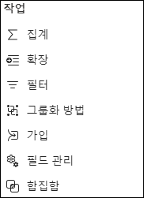
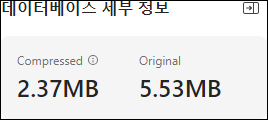
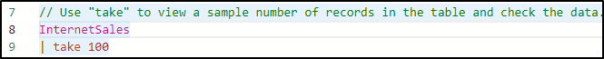
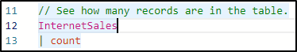
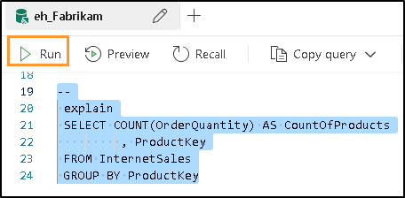
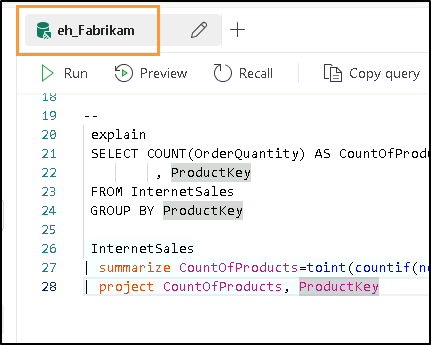

# Microsoft Fabric Real-Time Intelligence in a Day 랩 2


# 목차

- 문서 구조	
- 소개	
- Fabric 실시간 허브	
    - 작업 1: Eventstream 원본 만들기	
    - 작업 2: Eventstream 대상 설정	
- KQL(Kusto 쿼리 언어)	
    - 작업 3: Kusto 데이터베이스 쿼리 작성	
    - 작업 4: KQL 데이터베이스에 대해 T-SQL 쿼리 사용	
- KQL 쿼리 집합	
    - 작업 5: KQL 쿼리 집합 작업	
- 요약	
- 참조	

# 문서 구조

이 랩에서는 사용자가 수행해야 하는 단계를 보조 시각 자료의 관련 스크린샷과 함께 확인할 수 있습니다. 스크린샷에서 주황색 상자로 강조 표시된 섹션은 사용자가 특히 주목해야 하는 영역입니다.

# 소개

이 랩에서는 지속적인 실시간 데이터 스트림을 처리하는 방법을 경험합니다.
Eventstream 이라는 Fabric Real-Time Intelligence 개체를 사용하여 이 데이터를 지난 랩에서 만든
Eventhouse 로 수집하고 몇 가지 기본 KQL 쿼리를 작성합니다. 

이 랩을 마치면 다음 사항을 알게 됩니다.

- Eventstream 을 만드는 방법
- KQL 데이터베이스로 실시간 데이터 로드
- 기본 Kusto 쿼리 언어 쿼리 작성

# Fabric 실시간 허브

## 작업 1: Eventstream 원본 만들기

1. 지난 랩에서 만든 **Fabric 작업 영역**을 엽니다. 여기에서 이전에 만든 Eventhouse 를 볼 수 있습니다.

    

2. 왼쪽에서 **실시간** 버튼을 선택하여 실시간 허브로 이동합니다. 곧 변경될 데이터 스트림이 표시되지 않더라도

    
 
3. 오른쪽 상단 모서리에 있는 **+ 데이터 원본 연결** 녹색 버튼을 선택합니다.

    

4. 스트림 데이터 원본을 선택할 수 있는 창이 열립니다. 앞에서 설명한 대로 선택할 수 있는 흥미로운 옵션이 많이 있지만, 이 수업에서는 "Azure Event Hubs" 옵션을 선택합니다. "Azure Event Hubs"가 쉽게 표시되지 않으면 맨 위에 있는 **Microsoft 원본**을 선택하여 표시되는 옵션을 필터링합니다.

    

5. 이제 Azure Event Hub 에 대한 연결을 만들어야 합니다. 현재는 연결이 없으므로 **새 연결** 텍스트를 클릭합니다.

    

6. 환경 세부 정보 페이지에서 필요한 모든 연결 설정을 복사하여 해당 필드에 붙여 넣습니다. 이러한 랩에서는 스트리밍 데이터가 Python Notebook 에서 전송되는 Event Hub 에 연결합니다. 이 노트북은 시간당 약 3,100 건의 가짜 판매 트랜잭션을 생성하고 있습니다.

    - 이벤트 허브 네임스페이스: **rtiadhub{userid} – CloudLabs 에서 제공하는 기능**

    - Event Hub: **rti-iad-fabrikam**

    - 공유 액세스 키 이름: **rti-reader**

    - 공유 액세스 키: **환경 세부 정보 탭에서 사용 가능**

7. 모든 속성이 채워지면 **연결**을 클릭합니다.

    
 
8. Azure Event Hub 데이터 원본 구성에서 데이터 스트림에 대한 고유한 액세스 포인트에 액세스할 수 있도록 Event Hub 의 **소비자 그룹**을 수정해야 할 수 있습니다. 이 워크샵에서는 아래와 같이 "$Default" 값을 그대로 둘 수 있습니다.

    

9. 이 데이터 원본과 Eventstream 을 마무리하기 전에 Eventstream 이름을 더 유용한 이름으로 바꿔 보겠습니다. 오른쪽 "스트림 세부 정보" 섹션에서 "Eventstream 이름" 옆에 있는 연필 아이콘을 선택하고 Eventstream 이름을 "**es_Fabrikam_InternetSales**"로 지정합니다.

    
  
10. 이제 **다음**을 클릭하면 최종 개요 페이지로 이동합니다.

    

11. 이 개요 화면에서 콘텐츠가 올바르게 표시되는지 확인하고 **원본 만들기**를 클릭합니다.

    > **참고:** **세부 정보는 스크린샷에 표시된 것과 다릅니다**

    

12. Eventstream 과 Eventstream 원본이 생성되면 "**Eventstream 열기**" 옵션을 선택합니다.

    

13. 그러면 Eventstream 사용자 인터페이스로 이동합니다. 여기에서 이벤트 스트림으로 유입되는 원본 데이터 스트림을 볼 수 있으며 변환 이벤트도 추가할 수 있습니다.
 
14. 원본이 **활성 상태**가 될 때까지 몇 분 정도 걸릴 수 있지만, 잠시 기다렸다가 Eventstream 이름이 있는 중간 아이콘을 클릭하면 데이터 미리 보기가 표시됩니다.

    > **참고:** **감사 정책에 대해 "경고" 상태가 표시돼도 괜찮습니다. 그래도 스트림은 계속 작동합니다.**

    

15. 이제 아래쪽 창에 데이터 샘플이 표시됩니다.

    

16. 여기에서 Azure Event Hub 에서 수신되는 데이터 미리 보기가 표시됩니다. 아래쪽 가로 스크롤 막대를 미리 보기의 오른쪽 끝까지 밀면 **EventProcessedUtcTime** 및 **EventEnqueuedUtcTime** 이라는 두 열에서 Event Hub 에서 데이터를 수신한 시간을 볼 수 있습니다. 현재 날짜/시간을 UTC 형식으로 반영합니다.

    
 
# 작업 2: Eventstream 대상 설정

1. 캔버스 영역 내에서 "편집 모드로 전환하여 이벤트 변환 또는 대상 추가" 타일을 클릭합니다.

     

2. Eventstream 사용자 인터페이스 내에서 **이벤트 변환 또는 대상 추가** 옵션을 클릭하여 드롭다운 메뉴를 엽니다.

     
 
3. 스트림에 수행할 수 있는 사용 가능한 작업 목록을 봅니다.

    
 
4. **작업** 섹션 아래에 있는 **대상**에서 **Eventhouse** 옵션을 선택합니다.

     

5. 화면 오른쪽에 새 메뉴가 열립니다. 대상에서 가장 먼저 수정해야 하는 것은 **데이터 수집 모드**입니다. 두 가지 옵션은 직접 **수집과 수집 전 이벤트 처리입니다**. Eventstream 에서 아무것도 변환하지 않고 KQL 데이터베이스 테이블에 해당 정보를 직접 로드할 것이므로 **직접 수집** 옵션을 선택했는지 확인합니다.

     
 
6. 아래에 나와 있는 세부 정보를 사용하여 나머지 설정을 수정합니다.

    - 대상 이름 – **eh-kql-db-fabrikam**
    - 작업 영역 – **RTI_username**
    - Eventhouse – **eh_Fabrikam**
    - KQL 데이터베이스 – **eh_Fabrikam**

      
  
7. 저장을 클릭합니다.

8. Eventstream 이 구성되면 **게시** 버튼을 클릭하여 이 Eventstream 을 저장하고 수집을 시작합니다.

     

9. **Azure 이벤트 허브** 원본이 비활성 상태가 된 경우 토글을 "활성" 상태로 전환하고 대화 상자가 열리면 "지금" 옵션을 선택합니다.

          
 
10. **대상** 내에서 **구성** 옵션을 선택하여 스트림을 KQL 데이터베이스의 테이블에 올바르게 매핑합니다.

     

11. **eh_Fabrikam** 데이터베이스 아래에 있는 **+ 새 테이블** 옵션을 클릭합니다.

     

12. 새 테이블 이름을 **InternetSales** 로 지정한 후 확인 표시를 클릭합니다.

     
 
13. 요구 사항을 충족하기 위해 "**데이터 연결 이름**"을 업데이트해야 할 수 있습니다. 이름을 **"eh_Fabrikam_es_InternetSales"로 바꿔 보겠습니다.** 그 후에 **다음**을 클릭할 수 있습니다.

     

14. 잠시 동안 이벤트를 검색한 후 사용자 인터페이스에서 샘플 데이터가 발견되었음을 확인할 수 있습니다. 화면 아래쪽에 있는 **마침**를 클릭합니다.

     

15. 그런 다음, 요약이 표시됩니다. 녹색 확인 표시가 모두 있으면 **닫기**를 클릭하여 계속 진행합니다.
 
16. 사용자 인터페이스에서 원본에서 Eventstream, 대상으로의 매핑이 표시되면 KQL 데이터베이스로의 데이터 스트림을 올바르게 구성하고 시작한 것입니다.

     

# KQL(Kusto 쿼리 언어)

## 작업 3: Kusto 데이터베이스 쿼리 작성

1. **RTI_username** 작업 영역으로 돌아갑니다. 방금 생성한 새 Eventstream 이 모든 Evenhouse
항목과 함께 표시되어야 합니다.

     

2. **eh_Fabrikam** KQL 데이터베이스 항목을 엽니다.

     

3. 이 환경 내에서 KQL 데이터베이스의 현재 구조, 크기 및 사용에 대한 개요를 확인할 수 있습니다. Eventstream 은 이 KQL 데이터베이스로 데이터를 일관되게 전송하기 때문에 시간이 지나면서 스토리지 양이 증가하는 것을 알 수 있습니다.

     

4. 화면의 오른쪽 위 모서리에서 **새로 고침 아이콘**을 클릭합니다.

     
 
5. 데이터베이스 크기가 커졌을 것입니다. 표시되는 값은 랩의 나머지 부분에 있는 스크린샷과 비교할 때 정확하지 않을 수 있습니다. 콘텐츠를 완료하는 데 걸리는 시간에 따라 클래스의 다른 구성원보다 더 적거나 더 많은 레코드를 받게 됩니다. 수치가 똑같지 않더라도 괜찮으며 랩을 따라가는 데 전혀 영향을 미치지 않습니다.

     

6. 화면 왼쪽의 데이터베이스 탐색 영역에서 **InternetSales** 라는 KQL 데이터베이스 내의 테이블을 클릭하면 테이블에 대한 개요가 표시됩니다

     

7. 이 개요에서는 생성한 테이블에 대한 메타데이터 세부 정보와 Eventstream 을 통해 활발하게 스트리밍되는 데이터를 제공합니다. 다시 말하지만, 테이블 크기와 테이블 내의 행 수는 학생마다 다르며 이 랩이나 다른 랩의 최종 결과에 영향을 미치지 않습니다. 이 메뉴에서 설명할 몇 가지 추가 항목은 다음과 같습니다.

    - **데이터 활동 추적기** – 수집된 행 수, 마지막으로 생성된 시간, 표시 간격을 표시합니다.

    - **데이터 프리뷰** — 테이블 수집 결과의 프리뷰를 표시합니다.

    - **스키마 인사이트** – 여기에는 KQL 을 사용하여 쿼리할 수 있는 열 이름과 열의 데이터 형식에 대한 세부 정보가 포함됩니다. 선택한 열 값에 대한 상위 10 개 개수도 표시합니다

    - **테이블 세부 정보** – 압축된 테이블 및 원래 테이블 크기, OneLake 가용성, 테이블의 행 수 및 기타 다양한 세부 정보를 표시합니다.

      
 
8. 데이터베이스 뷰로 돌아가서 오른쪽 위 모서리에서 **데이터 탐색**을 클릭합니다.

     

9. 그러면 Eventhouse 와 함께 생성된 기본 KQL 쿼리 집합이 열립니다. 이미 작성되었지만 약간의 사용자 지정이 필요한 사전 스크립팅된 쿼리가 일부 있습니다. KQL 을 학습하거나 이 수업의 뒷부분에서 설명할 SQL 에서 KQL 로의 변환을 살펴볼 때 도움이 될 수 있는 두 개의 Microsoft 설명서 링크도 있습니다.

     

10. **8 번 줄**을 클릭하고 쿼리에서 **YOUR_TABLE_HERE** 를 테이블 이름 **InternetSales** 로 바꿉니다.

     

11. **8 번 줄과 9 번 줄**을 강조 표시하고 창의 왼쪽 위 모서리에 있는 **실행** 버튼을 클릭합니다.

     
 
12. 쿼리는 **take** 연산자를 사용하여 지정된 수의 행을 다시 가져옵니다. 쿼리가 실행되면 InternetSales 테이블에서 데이터를 가져오고 쿼리에 연결한 행 수를 다시 가져옵니다. 이 예제에서는 SQL 의 WHERE 절과 같은 100 개의 행만 반환됩니다. 반환되는 특정 행은 이 연산자를 사용하여 확인할 수 없으며 쿼리 결과는 다른 구성원의 쿼리 결과와 다릅니다.

     

13. **12 번 줄**을 클릭하고 쿼리에서 **YOUR_TABLE_HERE** 를 테이블 이름 **InternetSales** 로 바꿉니다.

     

14. **12 번 줄과 13 번 줄**을 강조 표시하고 창의 왼쪽 위 모서리에 있는 **실행** 버튼을 클릭합니다.

     

15. 이 쿼리는 count 연산자를 사용합니다. 이 쿼리는 KQL 데이터베이스 테이블에서 쿼리 실행 당시 존재하는 집계된 레코드 수를 반환합니다. 이 쿼리를 몇 번 더 실행하면 레코드 수가 몇 초마다 증가하는 것을 알 수 있습니다.

     

16. **16/17 번 줄**에서 자동으로 생성되는 최종 쿼리에 대해 이전 단계를 반복하고 쿼리를 다시 실행합니다.

     

17. 이 쿼리는 한 시간 이내에 테이블로 수집된 레코드 수를 제공합니다. 현재 수집 중인 데이터에 대한 해당 레코드의 전체 분포는 시간당 약 4,100 개입니다. 시간당 트랜잭션 수에는 약간의 변동이 있을 수 있으며 이 쿼리는 시간마다 수집된 레코드 수가 더 적거나 더 많은지 자세히 설명합니다.

## 작업 4: KQL 데이터베이스에 대해 T-SQL 쿼리 사용

Kusto 쿼리 언어를 처음 사용하는 것일 수 있습니다. 이 언어는 간단한 쿼리 작성 시 직관적이고 배우기 쉽지만, 현재 수행할 수 있는 것보다 더 복잡한 쿼리 결과를 반환하는 것이 좋습니다.
KQL 쿼리 집합 기능에는 SQL 쿼리를 KQL 쿼리로 변환하고 KQL 쿼리 집합 내에서 T-SQL 쿼리를 작성하는 등 몇 가지 유용한 도구가 포함되어 있습니다. 한번 살펴보겠습니다!

1. 각 제품별 판매 횟수를 반환하는 쿼리를 만들어야 합니다. 이 작업은 T-SQL 을 사용하여 빠르게 수행할 수 있습니다. 쿼리 창 내에서 SQL 쿼리를 KQL 로 변환하면 나중에 KQL 쿼리를 작성하는 방법을 더 잘 이해할 수 있습니다. 먼저 다음 명령을 작성합니다.

    > **참고:** **텍스트를 복사하려면 아래 개체를 두 번 클릭합니다**

    ```
    --
    explain
    ```

    

2. "--" 주석 줄 뒤에 "explain" 키워드를 사용하면 이제 SQL 쿼리를 만들고 유사한 쿼리와 결과를 얻는 데 사용할 수 있는 KQL 쿼리를 사용하여 결과를 반환할 수 있습니다. 아래에 다음 쿼리를 입력하여 KQL 쿼리의 모양을 설명합니다.

    ```
    --
    explain
    SELECT COUNT(OrderQuantity) AS CountOfProducts
            , ProductKey
    FROM InternetSales
    GROUP BY ProductKey
    ```

     

3. 이 쿼리는 InternetSales 테이블에서 결과를 검색하여 제품 키와 주문 수라는 두 개의 열을 반환하는 간단한 SQL 쿼리입니다. 집계된 열과 집계되지 않은 열이 있기 때문에 GROUP BY 를 사용하여 개별 제품에 대한 결과를 반환해야 합니다. "--"로 시작하여 T-SQL 쿼리 끝까지 전체 쿼리를 실행합니다.

    

4. explain 쿼리 출력은 변환된 KQL 쿼리를 결과로 포함하는 단일 레코드여야 합니다. **캐럿 아이콘(>)** 을 클릭하면 결과가 확장되고 더 쉽게 변환할 수 있습니다.

    
 
5. 아래에서 주황색으로 강조 표시된 쿼리 창을 클릭합니다. 이렇게 하면 변환된 KQL 쿼리를 선택하고 복사할 수 있습니다. 이 쿼리를 현재 사용하고 있는 KQL 쿼리 집합에 붙여 넣습니다.

    

6. 쿼리 창에 결과가 표시되면 쿼리를 강조 표시하고 실행하여 결과를 검색합니다. **summarize** 연산자는 입력 테이블의 내용을 집계하는 동시에 각 레코드를 **제품 키별**로 그룹화하는 방법을 결정하는 테이블을 생성하고 **project** 연산자는 포함하거나, 이름을 바꾸거나 삭제할 열을 선택하는 동시에 새로 계산된 열을 삽입합니다.

    
 
7. 추가 기능 및 변환을 위해 쿼리 집합 맨 위에 있는 SQL 에서 KQL 로의 치트 시트 작업의 목록을 자유롭게 살펴봅니다.

    
 
8. KQL 을 사용하는 대신 Fabric 내에서 KQL 데이터베이스 결과를 쿼리하는 또 다른 대안은 T- SQL 쿼리를 작성하고 실행하는 것입니다. KQL 쿼리를 변환하는 데 사용된 원래 SQL 문을 강조 표시하고 해당 문만 실행합니다.

    
 
9. 이 작업을 수행하면 미리 KQL 로 변환하지 않고도 완벽하게 유효한 결과를 얻을 수 있습니다.

    

# KQL 쿼리 집합

## 작업 5: KQL 쿼리 집합 작업

1. 이 창에 있는 대부분의 쿼리는 사용자 인터페이스에서 자동으로 생성되었지만 향후 처음부터 자체 KQL 쿼리를 만들려는 경우가 있을 수 있습니다. 이것은 상단에 있는 탭 기능을 통해 관리할 수 있습니다. 이 쿼리 집합은 주기적으로 자동으로 저장된다는 점도 유의해야 합니다.
 
2. 쿼리 집합의 맨 위에 있는 첫 번째 페이지의 기본 이름은 데이터베이스와 동일한 이름입니다.

    
 
3. 연필 아이콘을 클릭하여 이 탭의 이름을 **"내 첫 번째 KQL 쿼리"** 라고 변경해 보겠습니다.

    
 
4. 향후 코드를 분리하려면 "+" 아이콘을 클릭하여 추가 탭을 만들 수 있습니다.

    
 
5. **RTI_username** 작업 영역으로 돌아갑니다. 다음 개체가 있어야 합니다.

    

# 요약
이 랩에서는 먼저 실행 중인 데이터 스트림이 있는 Event Hub 에 대한 연결을 설정하고 Eventstream 을 사용하여 해당 데이터를 가져와서 KQL 데이터베이스로 수집했습니다. 데이터가 수집된 후에는 여러 KQL 쿼리를 작성하고 T-SQL 을 사용하여 KQL 구문을 학습하거나 SQL 문을 사용하여 결과를 반환하는 기능을 살펴볼 수 있었습니다.

# 참조

Fabric Real-Time Intelligence in a Day(RTIIAD)는 Microsoft Fabric 에서 사용할 수 있는 몇 가지 주요 기능을 소개합니다.

서비스의 메뉴에 있는 도움말(?) 섹션에는 유용한 리소스로 연결되는 링크가 있습니다.


아래는 Microsoft Fabric 의 다음 단계에 도움이 되는 몇 가지 추가 자료입니다.

- [Microsoft Fabric GA 발표 ](https://aka.ms/Fabric-Hero-Blog-Ignite23)전문을 블로그 포스트로 읽기

- [가이드 투어](https://aka.ms/Fabric-GuidedTour)로 Fabric 탐색

- [Microsoft Fabric 무료 평가판](https://aka.ms/try-fabric) 신청

- [Microsoft Fabric 웹 사이트](https://aka.ms/microsoft-fabric) 방문

- [Fabric 학습 모듈](https://aka.ms/learn-fabric)을 탐색해서 새로운 기술 익히기

- [Fabric 기술 문서](https://aka.ms/fabric-docs) 검토

- [Fabric 시작하기 무료 e 북](https://aka.ms/fabric-get-started-ebook) 읽기

- [Fabric 커뮤니티](https://aka.ms/fabric-community)에 가입하여 질문을 게시하고 피드백을 공유하며 다른 사람들로부터 배우기
 
더 많은 심층 Fabric 환경 발표 블로그 포스트 읽기:

- [Fabric 블로그의 Data Factory 환경](https://aka.ms/Fabric-Data-Factory-Blog)

- [Fabric 블로그의 Synapse Data Engineering 환경](https://aka.ms/Fabric-DE-Blog)

- [Fabric 블로그의 Synapse Data Science 환경](https://aka.ms/Fabric-DS-Blog)

- [Fabric 블로그의 Synapse Data Warehousing 환경](https://aka.ms/Fabric-DW-Blog)

- [Fabric 블로그의 Real-Time Intelligence 환경](https://blog.fabric.microsoft.com/en-us/blog/category/real-time-intelligence)

- [Power BI 발표 블로그](https://aka.ms/Fabric-PBI-Blog)

- [Fabric 블로그의 Data Activator 환경](https://aka.ms/Fabric-DA-Blog)

- [Fabric 블로그의 관리 및 거버넌스 ](https://aka.ms/Fabric-Admin-Gov-Blog)

- [Fabric 블로그의 OneLake](https://aka.ms/Fabric-OneLake-Blog)

- [Dataverse 및 Microsof t Fabric 통합 블로그](https://aka.ms/Dataverse-Fabric-Blog)

© 2024 Microsoft Corporation. All rights reserved.

이 데모/랩을 사용하면 다음 조건에 동의하게 됩니다.

이 데모/랩에 설명된 기술/기능은 학습 환경을 제공하고 사용자 의견을 얻기 위해 Microsoft Corporation 에서 제공합니다. 데모/랩을 통해서만 이러한 기술적 특성과 기능을 평가하고 사용자 의견을 Microsoft 에 제시할 수 있습니다. 다른 용도로는 사용할 수 없습니다. 이 데모/랩 또는 그 일부에 대해 수정, 복사, 배포, 전송, 표시, 수행, 재현, 게시, 라이선스 허여, 파생 작업 생성, 양도 또는 판매할 수 없습니다.

추가 복제 또는 재배포를 위한 다른 서버 또는 위치에 대한 데모/랩(또는 그 일부)의 복사 또는 재현은 명시적으로 금지됩니다.

이 데모/랩은 위에서 명시한 목적을 위해 복잡한 설정 또는 설치가 없는 시뮬레이션된 환경에서 잠재적인 새로운 기능과 개념을 포함하여 특정 소프트웨어 기술/제품의 특성 및 기능을 제공합니다. 이 데모/랩에서 서술된 기술/개념은 전체 기능을 나타내지 않을 수 있으며, 최종 버전이 작동하지 않을 수도 있습니다. 또한 해당 기능 또는 개념의 최종 버전을 릴리스하지 않을 수도 있습니다. 또한 실제 환경에서 이러한 특성과 기능을 사용한 경험이 다를 수도 있습니다.
 
**피드백.** 이 데모/랩에서 서술된 기술적 특성, 기능 및/또는 개념에 대한 피드백을 Microsoft 에 제시하면 Microsoft 는 이 피드백을 어떤 방식과 목적으로든 무료로 사용, 공유 및 상용화할 수 있습니다. 또한 제품, 기술 및 서비스에서 피드백이 포함된 Microsoft 소프트웨어 또는 서비스의 특정 부분을 사용하거나 인터페이스하는 데 필요한 모든 특허권을 제 3 자에게 무료로 제공합니다. Microsoft 에서 사용자 의견을 포함하기 때문에 Microsoft 에서 해당 소프트웨어 또는 설명서의 사용을 인가해야 하는 라이선스에 종속된 사용자 의견은 제공할 수 없습니다. 이러한 권리는 본 계약에 의거하여 유효합니다.

Microsoft Corporation 은 이에 따라 명시적, 묵시적 또는 법적 특정 목적에의 적합성, 권리 및 비침해 여부에 관계없이 상품성에 대한 모든 보증과 조건을 포함하여 데모/랩과 관련된 모든 보증 및 조건을부인합니다. Microsoft 는 어떤 목적으로든 결과의 정확성, 데모/랩의 사용으로 파생된 출력 또는 데모/랩에 포함된 정보의 적합성과 관련하여 어떠한 보증이나 진술도 하지 않습니다.

# 고지 사항

이 데모/랩에는 Microsoft Power BI 의 새로운 기능 및 향상된 기능 중 일부만 포함되어 있습니다. 일부 기능은 제품의 향후 릴리스에서 변경될 수 있습니다. 이 데모/랩에서는 새로운 기능 모두가 아닌 일부에 대해 학습하게 됩니다.

