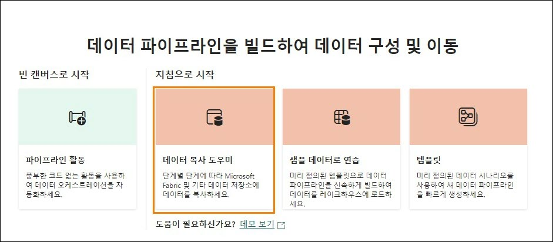

# Microsoft Fabric Real-Time Intelligence in a Day 랩 4


# 목차

- 문서 구조	
- 소개	
- KQL 데이터베이스 내의 Medallion 프레임워크	
    - 작업 1: 브론즈 테이블 만들기	
    - 작업 2: 데이터 파이프라인을 사용하여 브론즈 테이블 - - 로드	
    - 작업 3: 실버 레이어의 테이블 변환	
    - 작업 4: 구체화된 뷰를 사용하여 골드 레이어 만들기	
- Fabric 레이크하우스 및 OneLake 가용성	
    - 작업 5: 레이크하우스 만들기	
    - 작업 6: KQL 데이터베이스 테이블 바로 가기	
- 요약	
- 참조	

# 문서 구조

이 랩에서는 사용자가 수행해야 하는 단계를 보조 시각 자료의 관련 스크린샷과 함께 확인할 수 있습니다. 스크린샷에서 주황색 상자로 강조 표시된 섹션은 사용자가 특히 주목해야 하는 영역입니다.

# 소개

이 랩에서는 브론즈, 실버, 골드 레이어 접근 방식을 사용하여 다양한 개발 단계에서 데이터를 처리하는 Medallion 프레임워크를 만들고 이를 분석에 사용합니다. 그런 다음, KQL 데이터베이스에 포함된 데이터를 레이크하우스에 연결하여 실시간 데이터를 Power BI 보고에 사용하려는 조직 구성원과 얼마나 빨리 공유할 수 있는지 보여 줍니다.

이 랩을 마치면 다음 사항을 알게 됩니다.

- Kusto 쿼리 언어를 사용하여 KQL 데이터베이스 테이블 만들기
- Data Factory 파이프라인을 사용하여 KQL 데이터베이스에 데이터 로드
- KQL 데이터베이스에서 구체화된 뷰 만들기
- 레이크하우스 만들기 및 KQL 데이터베이스 바로 가기 사용

# KQL 데이터베이스 내의 Medallion 프레임워크

## 작업 1: 브론즈 테이블 만들기

1. 과정을 진행하기 위한 **Fabric 작업 영역**을 열고 지난 랩에서 만든 KQL 쿼리 집합인 **Create Tagles** 를 엽니다.

   
 
2. 이 KQL 쿼리 집합 내에서 여기에 있는 원래 탭의 이름을 "eh_Fabrikam"에서 " Create External Tables"로 변경하여 이 쿼리 집합에 있는 내용을 더 쉽게 구성하고 이해할 수 있습니다.

   

3. 이제 "+" 아이콘을 선택하여 새 탭을 만들고 새 탭의 이름을 " Bronze Layer"로 지정하겠습니다.

   

4. 이 새 탭에서 다음 코드를 붙여 넣고 강조 표시한 다음 “실행”을 선택하여 Medallion 프레임워크의 브론즈 레이어 역할을 할 새 테이블 4 개를 만듭니다.

   ```
   //BRONZE LAYER
   .execute database script <|

   .create table [Address] (AddressID:int,AddressLine1:string,AddressLine2:string,City: string, StateProvince:string, CountryRegion:string, PostalCode: string, rowguid: guid, ModifiedDate:datetime)
   .create table [Customer](CustomerID:int, NameStyle: string, Title: string, FirstName: string, MiddleName: string, LastName: string,Suffix:string, CompanyName: string, SalesPerson: string, EmailAddress: string, Phone: string, ModifiedDate: datetime)
   .create table [SalesOrderHeader](SalesOrderID: int, OrderDate: datetime, DueDate: datetime, ShipDate: datetime, ShipToAddressID: int, BillToAddressID: int, SubTotal: decimal, TaxAmt: decimal, Freight: decimal, TotalDue: decimal, ModifiedDate: datetime)
   .create table [SalesOrderDetail](SalesOrderID: int, SalesOrderDetailID: int, OrderQty: int, ProductID: int, UnitPrice: decimal , UnitPriceDiscount: decimal,LineTotal: decimal, ModifiedDate: datetime)
   ```

   
 
5. 해당 코드가 실행되면 데이터베이스 개체 탐색기 내에 생성된 새 테이블 4 개가 즉시 표시됩니다.

   - 주소
   - Customer
   - SalesOrderDetail
   - SalesOrderHeader

     

6. 이름 옆에 있는 “>” 아이콘을 클릭하여 **주소 테이블**을 확장합니다.

   

7. 그러면 테이블의 스키마(열 이름 및 데이터 형식)가 표시됩니다. KQL 데이터베이스의 이 테이블에 추가하는 데 도움이 되는 한 가지는 나중에 Medallion 아키텍처에서 사용될 수집 시간에 대한 숨겨진 열입니다. 이제 이 열을 추가해 보겠습니다. 아래 스크립트를 복사하여 붙여 넣고 수집 시간 열을 추가하여 방금 만든 테이블을 변경합니다.

   ```
   //adds a hidden field showing ingestion time
   .execute database script <|
   .alter table Address policy ingestiontime true
   .alter table Customer policy ingestiontime true
   .alter table SalesOrderHeader policy ingestiontime true
   .alter table SalesOrderDetail policy ingestiontime true
   ```

   

8. 새 테이블 4 개는 스키마가 정의된 빈 테이블입니다. 이제 해당 테이블을 올바르게 로드하는 방법이 필요합니다. 작업 영역 **RTI_username** 으로 다시 이동합니다.

# 작업 2: 데이터 파이프라인을 사용하여 브론즈 테이블 로드

1. 작업 영역에서 **"+ 새 항목"** 옵션을 선택하여 선택 창을 불러옵니다. 그런 다음 **Data pipeline** 이라는 옵션을 찾아 선택합니다.

   
 
2. 새 파이프라인 이름을 **Load KQL Database Bronze Layer** 로 지정합니다.

   

3. 만들기를 클릭합니다.

4. 파이프라인 메뉴가 나타나면 **데이터 복사 도우미** 옵션을 클릭합니다.

   

5. 시작하려면 데이터를 추출할 원본 데이터베이스에 대한 연결을 만들어야 합니다. “새 원본”에서 **Azure SQL database** 옵션을 클릭합니다. 바로 표시되지 않으면 위쪽 검색 창을 사용하여 원본을 필터링할 수 있습니다. 이전 랩과 동일한 외부 Azure SQL 데이터베이스에 연결하되 다른 테이블에 연결합니다.

   
 
6. 데이터베이스의 연결 세부 정보를 입력해야 합니다. 사용자 환경 또는 아래 정보를 사용합니다.

   - Server:

      ```
      fabrikamserverdb.database.windows.net
      ```
   - Database :

      ```
      fabrikamdb
      ```

   - Username :

      ```
      demouser
      ```
      
   - Password :
       
      ``` 
      fabrikam@1234567
      ```

7. 모든 항목이 채워지면 **다음**을 클릭합니다.

8. 사용 가능한 테이블 목록에서 다음 항목을 선택합니다.

    - SalesLT.Address
    - SalesLT.Customer
    - SalesLT.SalesOrderDetail
    - SalesLT.SalesOrderHeader

      

9. **다음**을 클릭합니다.

10. 이제 파이프라인에서 데이터를 보낼 위치를 결정하기 위해 대상을 설정해야 합니다. **OneLake 데이터 허브**를 찾은 후 KQL 데이터베이스인 **eh_Fabrikam** 을 선택합니다.

    

11. 로그인하라는 메시지가 표시되면 환경 세부 정보 페이지에 제공된 자격 증명을 사용하기만 하면 됩니다.
 
12. **SalesLT.Address** 테이블을 아직 선택하지 않은 경우 클릭한 후 **테이블** 옵션 옆에 있는 드롭다운을 클릭합니다. **Address** 테이블 옵션을 클릭합니다.

    

13. 이제 **열 매핑**에 대한 개요가 표시됩니다. 이를 통해 KQL 데이터베이스로 보내는 원본 데이터베이스에서 오는 모든 필드를 시각화할 수 있습니다. 특정 필드를 원본에서 매핑하지 않으려는 경우 해당 필드를 제거할 수 있는 옵션이 있습니다.

    

14. **SalesLT.Customer, SaleLT.SalesOrderDetail, SalesLT.SalesOrderHeader** 테이블도 11~12 단계와 동일한 단계를 따릅니다. 열 매핑을 수행할 필요가 없으므로 테이블 이름을 일치시키기만 하면 됩니다. 모든 테이블이 적절하게 매핑되면 다음을 클릭합니다.

15. 데이터 복사 도우미를 사용하는 마지막 페이지는 선택한 모든 설정을 확인할 수 있는 개요 페이지입니다. 원본 테이블 수와 대상 테이블 수가 동일한지 확인합니다.

    
 
16. **저장 + 실행**을 클릭합니다.

17. 잠시 후 **매개 변수**가 포함된 플라이아웃 창이 나타납니다. 방금 완료한 복사 도우미 마법사를 통해 반복하고 KQL 테이블에 로드할 테이블 목록을 만들었습니다. **확인** 버튼을 클릭하기만 하면 데이터 복사 도우미에서 현재 구성된 파이프라인을 실행할 수 있습니다.

    

18. 파이프라인을 실행하고 약 1 분 후에 데이터 이동이 완료됩니다. 파이프라인에 포함된 모든 활동이 **성공**했음을 확인하면 데이터를 전송한 것입니다.

    

19. 테이블 중 하나를 확인하고 데이터를 확인해 보겠습니다. 계속 사용 중인 **테이블 만들기**라는 KQL 쿼리 집합으로 다시 이동하여 **브론즈 레이어**탭에 있는지 확인하고 다음 스크립트를 실행합니다

    ```
    //Query the Bronze layer Customer table 

    Customer
    | take 100
    ```

    

20. 아래 이미지와 같은 데이터가 표시되지만 정확하지 않을 수 있습니다.

    

## 작업 3: 실버 레이어의 테이블 변환

1. 이제 브론즈 테이블이 로드되었으므로 KQL 쿼리 집합 내에 "Silver Layer"라는 새 탭을 만듭니다.

   

2. 다음을 실행합니다. "실버 레이어" 탭 내에서 다음 KQL 스크립트를 실행하여 Medallion 프레임워크의 실버 레이어 역할을 할 새 테이블 4 개를 만듭니다.

   ``` 
   //SILVER LAYER

   .execute database script <|

   .create table [SilverAddress] (AddressID:int,AddressLine1:string,AddressLine2:string,City: string, StateProvince:string, CountryRegion:string, PostalCode: string, rowguid: guid, ModifiedDate:datetime, IngestionDate: datetime)

   .create table [SilverCustomer](CustomerID:int, NameStyle: string, Title: string, FirstName: string, MiddleName: string, LastName: string,Suffix:string, CompanyName: string, SalesPerson: string, EmailAddress: string, Phone: string, ModifiedDate: datetime, IngestionDate: datetime)

   .create table [SilverSalesOrderHeader](SalesOrderID: int, OrderDate: datetime, DueDate: datetime, ShipDate: datetime, ShipToAddressID: int, BillToAddressID: int, SubTotal: decimal, TaxAmt: decimal, Freight: decimal, TotalDue: decimal, ModifiedDate: datetime, DaysShipped: long, IngestionDate: datetime)

   .create table [SilverSalesOrderDetail](SalesOrderID: int, SalesOrderDetailID: int, OrderQty: int, ProductID: int, UnitPrice: decimal, UnitPriceDiscount: decimal,LineTotal: decimal, ModifiedDate: datetime, IngestionDate: datetime)
   ```

3. 새 스크립트를 강조 표시하고 **실행**을 클릭하여 해당 스크립트를 실행합니다.

   

4. 해당 스크립트가 실행되면 KQL 데이터베이스 테이블 메뉴에 추가된 새 테이블 4 개가 표시됩니다.

   

5. 이제 테이블을 만들었으므로 데이터를 해당 테이블에 로드해야 합니다. 데이터가 브론즈 레이어로 수집될 때 데이터를 변환하는 이동하는 업데이트 정책을 만듭니다. 다음 스크립트를 복사하여 붙여 넣은 후 코드를 **실행**합니다.

   ``` 
   // use update policies to transform data during Ingestion

   .execute database script <|

   .create function ifnotexists with (docstring = 'Add ingestion time to raw data') ParseAddress (){ Address
   | extend IngestionDate = ingestion_time()
   }

   .alter table SilverAddress policy update @'[{"Source": "Address", "Query": "ParseAddress", "IsEnabled" : true, "IsTransactional": true }]'

   .create function ifnotexists with (docstring = 'Add ingestion time to raw data') ParseCustomer (){ Customer
   | extend IngestionDate = ingestion_time()
   }

   .alter table SilverCustomer policy update @'[{"Source": "Customer", "Query": "ParseCustomer", "IsEnabled" : true, "IsTransactional": true }]'

   .create function ifnotexists with (docstring = 'Add ingestion time to raw data') ParseSalesOrderHeader (){ SalesOrderHeader
   | extend DaysShipped = datetime_diff('day', ShipDate, OrderDate)
   | extend IngestionDate = ingestion_time()
   }

   .alter table SilverSalesOrderHeader policy update @'[{"Source": "SalesOrderHeader", "Query": "ParseSalesOrderHeader", "IsEnabled" : true, "IsTransactional": true }]'

   .create function ifnotexists with (docstring = 'Add ingestion time to raw data') ParseSalesOrderDetail () { SalesOrderDetail
   | extend IngestionDate = ingestion_time()
   }

   .alter table SilverSalesOrderDetail policy update @'[{"Source": "SalesOrderDetail", "Query": "ParseSalesOrderDetail", "IsEnabled" : true, "IsTransactional": true }]'
   ```

6. 쿼리 실행 결과가 표시되지만 쿼리가 완료되었음을 알 수 있는 가장 좋은 증거는 데이터베이스 개체 창에 확장 가능한 새 폴더가 표시되는 것입니다. **함수 폴더** 옆에 있는 **> 아이콘**을 클릭합니다. 이러한 함수를 사용하면 KQL 데이터베이스의 브론즈 레이어에 로드된 데이터를 미러링하고 변환하며 실버 레이어에 로드할 수 있습니다.

   

7. 이제 이 프로세스를 시뮬레이션해 보겠습니다. 이 랩의 앞부분에서 만든 파이프라인을 다시 실행합니다. 지금 **KQL 데이터베이스 로드** 파이프라인으로 다시 이동합니다.

   

8. **홈 리본** 내에서 **실행** 버튼을 클릭하기만 하면 파이프라인을 다시 실행하고 데이터를 브론즈 레이어에 로드한 후 생성한 함수로 변환하여 실버 테이블에 로드됩니다.

   

9. 이 플라이아웃에서 **확인**을 클릭하여 이전과 동일한 매개 변수를 사용하여 파이프라인을 실행합니다.

   

10. 파이프라인이 로드를 완료할 때까지 약 1 분 정도 기다렸다가 출력 메뉴의 모든 항목이 **성공**으로 표시되면 다음 단계로 이동합니다.

    

11. 데이터 파이프라인이 완료되면 KQL 데이터베이스에서 결과의 유효성을 검사합니다. **테이블 만들기** KQL 쿼리 집합으로 돌아가서 **실버 레이어** 탭으로 이동합니다.

12. 새 줄에서 다음 쿼리를 작성하고 코드를 실행하여 SilverAddress 테이블을 쿼리합니다.

    ```
    SilverAddress
    | take 100
    ```

    

13. 결과를 보면 **SilverAddress** 테이블에는 **Address** 테이블에 실제로 존재하지 않는 **IngestionDate** 라는 추가 열이 있습니다.

    

## 작업 4: 구체화된 뷰를 사용하여 골드 레이어 만들기

이제 실버 레이어 내에 변환된 데이터 레이어가 있으므로 Power BI 보고서, RTI 데이터 집합 내에서 신뢰할 수 있고 유효성 검사를 완료한 보강된 데이터를 사용하거나 일부 KQL 쿼리를 작성하여 분석을 수행할 수 있습니다. 그러나 최종 사용자가 데이터를 더 많이 사용할 수 있도록 데이터를 집계해야 한다고 생각하는 경우가 있을 수 있습니다. KQL 데이터베이스 내에서 이 작업을 수행하는 방법을 살펴보겠습니다.
 
1. **테이블 만들기** KQL 쿼리 집합을 아직 열지 않은 경우 이를 열고 "Gold Layer"라는 새 탭을 만듭니다.

   

2. 구체화된 뷰를 만들기 위해 다음 코드를 쿼리 집합에 붙여 넣습니다.

   ```
   //GOLD LAYER
   // use materialized views to view the latest changes in the SilverAddress table
   .create materialized-view with (backfill=true) GoldAddress on table SilverAddress
   {
   SilverAddress
   | summarize arg_max(IngestionDate, *) by AddressID
   }
   ```

3. 코드를 붙여 넣은 후 해당 코드를 강조 표시하고 **Run** 버튼을 클릭하여 실행합니다.

   

4. 쿼리 결과에 이 구체화된 뷰를 만든 방법에 대한 정보를 자세히 설명하는 출력이 표시됩니다.

   
 
5. KQL 데이터베이스 개체 탐색기에서 다른 폴더가 만들어진 것도 확인할 수 있습니다. **구체화된 뷰** 폴더를 확장하면 그 안에 포함된 **GoldAddress** 뷰를 찾을 수 있습니다.

   
 
6. 쿼리 창에서 다음 코드를 실행하여 새 구체화된 뷰를 쿼리합니다.

   ```
   GoldAddress
   | take 1000
   ```

   

7. 이 쿼리는 **SilverAddress** 테이블의 각 고유 **AddressID** 에 대해 최신 **IngestionDate** 가 있는 행을 반환합니다.

8. 이제 다음 쿼리를 붙여 넣고 실행하여 다른 테이블에서 더 많은 골드 레이어 구체화된 뷰를 빌드합니다.

   ```
   //Create additional Gold Materialized Views
   .execute database script <|

   .create materialized-view with (backfill=true) GoldCustomer on table SilverCustomer
   {
   SilverCustomer
   | summarize arg_max(IngestionDate, *) by CustomerID
   }

   .create materialized-view with (backfill=true) GoldSalesOrderHeader on table SilverSalesOrderHeader
   {
   SilverSalesOrderHeader
   | summarize arg_max(IngestionDate, *) by SalesOrderID
   }

   .create materialized-view with (backfill=true) GoldSalesOrderDetail on table SilverSalesOrderDetail
   {
   SilverSalesOrderDetail
   | summarize arg_max(IngestionDate, *) by SalesOrderDetailID
   }

   .create async materialized-view with (backfill=true) GoldDailyClicks on table Clicks
   {
   Clicks
   | extend dateOnly = substring(tostring(todatetime(eventDate)), 0, 10)
   | summarize count() by dateOnly
   }

   .create async materialized-view with (backfill=true) GoldDailyImpressions on table Impressions
   {
   Impressions
   | extend dateOnly = substring(tostring(todatetime(eventDate)), 0, 10)
   | summarize count() by dateOnly
   }
   ```

9. 이제 KQL 데이터베이스 내에 구체화된 뷰 6 개가 있습니다.

    

10. 이제 KQL 데이터베이스 내에 Medallion 프레임워크를 구축했습니다. 이 데이터는 쉽게 사용할 수 있지만 Kusto 를 사용한 적이 없고 다른 방법으로 해당 테이블의 데이터에 액세스하는 것을 선호하는 사용자가 있습니다. 다음 작업에서는 레이크하우스를 만듭니다. 그런 다음, 랩 01 에서 활성화한 Onelake 가용성 기능을 사용하여 바로 가기를 통해 레이크하우스에서 KQL 데이터베이스에 포함된 일부 테이블에 액세스할 수 있도록 합니다.

# Fabric 레이크하우스 및 OneLake 가용성

## 작업 5: 레이크하우스 만들기

1. **RTI_username** 작업 영역으로 돌아갑니다.

2. **+ 새 항목** 옵션을 클릭한 후 사용 가능한 옵션 목록에서 **레이크하우스**를 선택합니다.

   

3. 레이크하우스 이름을 **lh_Fabrikam** 으로 지정한 후 **만들기**를 클릭합니다. 레이크하우스 스키마의 미리 보기 기능 활성화하지 마세요.

   

## 작업 6: KQL 데이터베이스 테이블 바로 가기

레이크하우스 사용자 인터페이스에는 스트리밍 데이터를 레이크하우스 자체로 가져오는 방법에 대한 몇 가지 옵션이 있습니다. 수업의 앞부분에서 언급한 한 가지 옵션은 Eventstream 을 사용하여 KQL 데이터베이스 대신 Event Hub 에서 레이크하우스로 데이터를 직접 로드하는 것입니다. 이미 특정 목표와 요구 사항을 충족하기 위해 KQL 데이터베이스를 활용하기로 결정했으므로 해당 데이터를 다시 복사하지 않는 것이 좋습니다. 대신 **바로 가기**를 사용하여 이미 있는 KQL 데이터베이스에서 해당 데이터를 가져와 이 환경에 더 익숙한 사용자가 KQL 데이터베이스에서 계속 사용 중인 데이터에 액세스할 수 있도록 해보겠습니다.

1. 메뉴에서 **새 바로 가기** 옵션을 선택합니다.

   

2. **내부 원본**에서 **Microsoft OneLake** 옵션을 선택합니다.

   

3. 메뉴에서 **eh_Fabrikam** KQL 데이터베이스를 선택하여 데이터를 복제하거나 복사하지 않고 해당 스토리지에서 레이크하우스로 테이블을 가져옵니다.

   
 
4. 메뉴 아래에서 **다음**을 클릭합니다.
 
5. **아이**콘을 클릭하여 **eh_Fabrikam** 내에 포함된 테이블을 연 다음 가져올 다음 테이블을 선택합니다.

   - 클릭
   - 광고 노출
   - InternetSales

     

6. 해당 테이블은 Fabric 내에서 Notebooks 를 활용할 수 있는 모든 사용자에게 매우 유용할 수 있습니다. 이 데이터는 데이터 과학 실험에서 사용자가 관심을 가질 만한 링크를 예측하는 모델을 학습시키는 데 사용될 수 있습니다.

7. **다음**을 클릭합니다.

8. 마지막 유효성 검사 화면이 나타납니다. 선택 항목이 만족스러우면 화면 아래쪽에 있는 **만들기** 버튼을 클릭합니다.

   
 
9. 이제 KQL 데이터베이스에서 선택한 모든 테이블이 레이크하우스 내에 표시된 것을 확인할 수 있습니다.

   

10. **Clicks** 테이블을 클릭합니다.

    
 
11. 해당 테이블의 레코드 샘플이 사용자 인터페이스 내에 표시된 것을 확인할 수 있습니다.

    > **참고: 데이터가 OneLake(https://learn.microsoft.com/en-us/fabric/real-time- intelligence/event-house-onelake-availability)에 표시되는 데 최대 몇 시간이 걸릴 수 있습니다.**
 
# 요약

이 랩에서 사용자는 KQL(Kusto 쿼리 언어) 데이터베이스 내에 Medallion 프레임워크를 만들었습니다. 사용자는 데이터 파이프라인을 사용하여 원시 데이터를 Medallion 아키텍처의 브론즈 레이어로 수집했습니다. 추가 처리와 구체화를 위해 이 데이터를 변환하여 실버 레이어에 로드했습니다. 마지막으로, 사용자는 구체화된 뷰를 사용하여 골드 레이어에서 분석을 수행하기 위해 데이터를 집계하고 최적화했습니다.

Medallion 프레임워크를 구축한 후 사용자는 Microsoft Fabric 바로 가기를 사용하여 KQL 데이터베이스에 포함된 데이터를 레이크하우스에 연결했습니다. 이 통합을 통해 두 환경 모두에서 데이터에 원활하게 액세스하고 데이터를 분석할 수 있었습니다. 사용자가 데이터 연결을 확인하고 기본 쿼리를 수행하여 프레임워크의 기능을 확인하는 것으로 랩을 마무리했습니다.

# 참조

Fabric Real-Time Intelligence in a Day(RTIIAD)는 Microsoft Fabric 에서 사용할 수 있는 몇 가지 주요 기능을 소개합니다.

서비스의 메뉴에 있는 도움말(?) 섹션에는 유용한 리소스로 연결되는 링크가 있습니다.

   

아래는 Microsoft Fabric 의 다음 단계에 도움이 되는 몇 가지 추가 자료입니다.

- [Microsoft Fabric GA 발표 ](https://aka.ms/Fabric-Hero-Blog-Ignite23)전문을 블로그 포스트로 읽기

- [가이드 투어](https://aka.ms/Fabric-GuidedTour)로 Fabric 탐색

- [Microsoft Fabric 무료 평가판](https://aka.ms/try-fabric) 신청

- [Microsoft Fabric 웹 사이트](https://aka.ms/microsoft-fabric) 방문

- [Fabric 학습 모듈](https://aka.ms/learn-fabric)을 탐색해서 새로운 기술 익히기

- [Fabric 기술 문서](https://aka.ms/fabric-docs) 검토

- [Fabric 시작하기 무료 e 북](https://aka.ms/fabric-get-started-ebook) 읽기

- [Fabric 커뮤니티](https://aka.ms/fabric-community)에 가입하여 질문을 게시하고 피드백을 공유하며 다른 사람들로부터 배우기
 
더 많은 심층 Fabric 환경 발표 블로그 포스트 읽기:

- [Fabric 블로그의 Data Factory 환경](https://aka.ms/Fabric-Data-Factory-Blog)

- [Fabric 블로그의 Synapse Data Engineering 환경](https://aka.ms/Fabric-DE-Blog)

- [Fabric 블로그의 Synapse Data Science 환경](https://aka.ms/Fabric-DS-Blog)

- [Fabric 블로그의 Synapse Data Warehousing 환경](https://aka.ms/Fabric-DW-Blog)

- [Fabric 블로그의 Real-Time Intelligence 환경](https://blog.fabric.microsoft.com/en-us/blog/category/real-time-intelligence)

- [Power BI 발표 블로그](https://aka.ms/Fabric-PBI-Blog)

- [Fabric 블로그의 Data Activator 환경](https://aka.ms/Fabric-DA-Blog)

- [Fabric 블로그의 관리 및 거버넌스 ](https://aka.ms/Fabric-Admin-Gov-Blog)

- [Fabric 블로그의 OneLake](https://aka.ms/Fabric-OneLake-Blog)

- [Dataverse 및 Microsof t Fabric 통합 블로그](https://aka.ms/Dataverse-Fabric-Blog)

© 2024 Microsoft Corporation. All rights reserved.

이 데모/랩을 사용하면 다음 조건에 동의하게 됩니다.

이 데모/랩에 설명된 기술/기능은 학습 환경을 제공하고 사용자 의견을 얻기 위해 Microsoft Corporation 에서 제공합니다. 데모/랩을 통해서만 이러한 기술적 특성과 기능을 평가하고 사용자 의견을 Microsoft 에 제시할 수 있습니다. 다른 용도로는 사용할 수 없습니다. 이 데모/랩 또는 그 일부에 대해 수정, 복사, 배포, 전송, 표시, 수행, 재현, 게시, 라이선스 허여, 파생 작업 생성, 양도 또는 판매할 수 없습니다.

추가 복제 또는 재배포를 위한 다른 서버 또는 위치에 대한 데모/랩(또는 그 일부)의 복사 또는 재현은 명시적으로 금지됩니다.

이 데모/랩은 위에서 명시한 목적을 위해 복잡한 설정 또는 설치가 없는 시뮬레이션된 환경에서 잠재적인 새로운 기능과 개념을 포함하여 특정 소프트웨어 기술/제품의 특성 및 기능을 제공합니다. 이 데모/랩에서 서술된 기술/개념은 전체 기능을 나타내지 않을 수 있으며, 최종 버전이 작동하지 않을 수도 있습니다. 또한 해당 기능 또는 개념의 최종 버전을 릴리스하지 않을 수도 있습니다. 또한 실제 환경에서 이러한 특성과 기능을 사용한 경험이 다를 수도 있습니다.
 
**피드백.** 이 데모/랩에서 서술된 기술적 특성, 기능 및/또는 개념에 대한 피드백을 Microsoft 에 제시하면 Microsoft 는 이 피드백을 어떤 방식과 목적으로든 무료로 사용, 공유 및 상용화할 수 있습니다. 또한 제품, 기술 및 서비스에서 피드백이 포함된 Microsoft 소프트웨어 또는 서비스의 특정 부분을 사용하거나 인터페이스하는 데 필요한 모든 특허권을 제 3 자에게 무료로 제공합니다. Microsoft 에서 사용자 의견을 포함하기 때문에 Microsoft 에서 해당 소프트웨어 또는 설명서의 사용을 인가해야 하는 라이선스에 종속된 사용자 의견은 제공할 수 없습니다. 이러한 권리는 본 계약에 의거하여 유효합니다.

Microsoft Corporation 은 이에 따라 명시적, 묵시적 또는 법적 특정 목적에의 적합성, 권리 및 비침해 여부에 관계없이 상품성에 대한 모든 보증과 조건을 포함하여 데모/랩과 관련된 모든 보증 및 조건을부인합니다. Microsoft 는 어떤 목적으로든 결과의 정확성, 데모/랩의 사용으로 파생된 출력 또는 데모/랩에 포함된 정보의 적합성과 관련하여 어떠한 보증이나 진술도 하지 않습니다.

# 고지 사항

이 데모/랩에는 Microsoft Power BI 의 새로운 기능 및 향상된 기능 중 일부만 포함되어 있습니다. 일부 기능은 제품의 향후 릴리스에서 변경될 수 있습니다. 이 데모/랩에서는 새로운 기능 모두가 아닌 일부에 대해 학습하게 됩니다.
