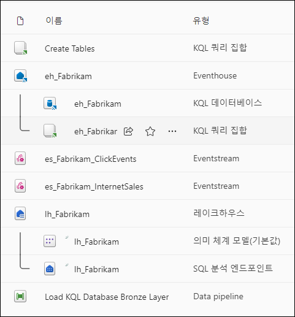
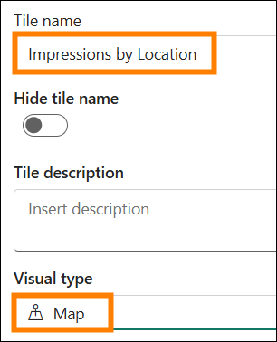
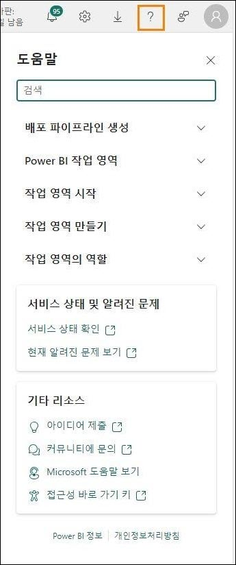

# Microsoft Fabric Real-Time Intelligence in a Day 랩 5


## 목차

- 문서 구조

- 소개

- 실시간 대시보드

  - 작업 1: 실시간 대시보드 만들기

  - 작업 2: 실시간 대시보드에 데이터 원본 연결

  - 작업 3: KQL 을 사용하여 실시간 대시보드 타일 만들기

  - 작업 4: 실시간 대시보드에 더 많은 대시보드 타일 추가

  - 작업 5: 위치별 노출에 대한 맵 시각적 개체 추가

  - 작업 6: 실시간 대시보드에서 자동 새로 고침 설정

  - 선택적 작업 7: 회사 로고 추가

  - 선택적 작업 8: 시각적 개체에 조건부 서식 적용

- 요약

- 참조

# 문서 구조

이 랩에서는 사용자가 수행해야 하는 단계를 보조 시각 자료의 관련 스크린샷과 함께 확인할 수 있습니다. 스크린샷에서 주황색 상자로 강조 표시된 섹션은 사용자가 특히 주목해야 하는 영역입니다.

# 소개

이 랩에서는 스트리밍하여 KQL 데이터베이스에 로드하고 바로 가기를 사용하여 레이크하우스에 간결하게 연결한 데이터를 사용하여 액세스한 데이터 스트림에서 인사이트를 시각화하고 공유하기 위한 실시간 대시보드를 만듭니다.

이 랩을 마치면 다음 사항을 알게 됩니다.

- Fabric 에서 실시간 대시보드 만들기

- KQL 을 사용하여 대시보드에 시각적 개체를 채우는 쿼리 작성

- 대시보드 시각적 개체에 조건부 서식 추가

## 실시간 대시보드

### 작업 1: 실시간 대시보드 만들기

1. 과정을 진행하기 위한 **Fabric 작업 영역**을 엽니다.

   

2. **+ 새 항목** 버튼을 클릭하여 새 항목을 만듭니다.

   

3. **데이터 시각화**에 대한 범주가 표시됩니다. **실시간 대시보드** 항목을 클릭합니다.

   

4. 실시간 대시보드 이름을 **RTI Dashboard** 로 지정한 후 **만들기**를 클릭합니다.

   

5. 실시간 대시보드의 빈 인스턴스로 바로 이동합니다.

   

## 작업 2: 실시간 대시보드에 데이터 원본 연결

1. 홈 리본에서 **New data source** 옵션을 찾아 클릭합니다.

   

2. 화면 오른쪽에 표시되는 플라이아웃 창에서 **추가 +**를 클릭한 후 **OneLake data hub** 를 선택합니다.

   

3. OneLake 에서 사용 가능한 원본 목록이 나타나고 KQL 데이터베이스의 원본만 나열되므로 **eh_Fabrikam** KQL 데이터베이스 옵션 하나를 사용할 수 있습니다. 해당 옵션을 선택합니다.

   

4. 화면 아래쪽에서 **Connect** 을 클릭합니다.

   

5. 이제 데이터 원본을 만들 수 있습니다. 플라이아웃 창의 아래쪽에 있는 **Add** 버튼을 클릭합니다.

   

6. 이제 데이터 원본 하나가 실시간 대시보드에 추가된 것을 확인할 수 있습니다. 여기에서 필요에 따라 KQL 데이터베이스를 추가할 수 있습니다. 지금은 창 아래쪽에 있는 **닫기**를 클릭합니다.

   

## 작업 3: KQL 을 사용하여 실시간 대시보드 타일 만들기

1. 대시보드에 있는 빈 타일을 클릭하여 타일을 시각적 개체로 채웁니다.

   

2. 기본적으로 이전에 원본으로 만든 KQL 데이터베이스에 연결합니다. 여기에서 자체 KQL 쿼리를 작성하여 이 시각적 개체를 데이터로 채울 수 있습니다. 기본적으로 있는 이전 Markdown KQL 을 모두 삭제합니다. 다음 쿼리를 복사하여 쿼리 창에 붙여 넣습니다.

    ```
    //Clicks by hour Clicks
    | where eventDate between (_startTime.._endTime)
    | summarize date_count = count() by bin(eventDate, 1h)
    | render timechart
    | top 30 by date_count
    | sort by eventDate
    ```

3. 결과를 볼 수 있도록 올바르게 구성한 후 쿼리를 실행합니다.

   

4. 출력에 결과가 하나만 표시될 수 있습니다. 이 타일에 기본적으로 설정되는 **시간 범위** 때문에 그렇습니다. 데이터를 반환하는 시간 범위를 변경할 수 있는 매개 변수가 있습니다. (_startTime.._endTime) 간의 eventDate 를 통해 이 매개 변수를 활용할 수 있습니다. **시간 범위** 매개 변수를 **마지막 3 시간**으로 수정하고 출력이 어떻게 변하는지 관찰합니다.

   

5. 이제 쿼리 출력에 마지막 3 시간 동안 발생한 클릭 결과가 표시됩니다.

   

6. 이 매개 변수를 수정할 수는 있지만 사용자가 수정하도록 강제 적용하는 대신 기본값을 특정 시간 범위로 설정하는 것이 좋습니다. 시간 범위 옵션 위에서 **@ 매개 변수** 옵션을 클릭합니다.

   

7. **연필 아이콘**을 클릭하여 **시간 범위** 매개 변수를 편집합니다.

   

8. **기본값**을 **마지막 24 시간**으로 변경하여 기본적으로 마지막 날을 항상 표시합니다. 완료되면 **완료**를 클릭합니다.

   

9. 매개 변수 창을 닫습니다.

10. 이제 쿼리 결과 위에 있는 **+ 시각적 개체 추가 버튼**을 클릭합니다.

    

11. 화면 오른쪽에 새 플라이아웃이 나타납니다. **Tile name** 옵션 아래의 텍스트 상자를 클릭하여 이 시각적 개체 이름을 **Clicks by Hour** 으로 지정합니다.

    

12. 기본적으로 이 KQL 쿼리 결과를 표시하는 데 사용하는 시각적 개체는 테이블입니다. 누군가에는 이 테이블이 데이터 결과를 빠르게 사용하고 데이터 결과에 어떤 일이 일어나고 있는지 이해하는 가장 좋은 방법이 아닐 수도 있습니다. 시각적 개체 유형을 테이블에서 **Area chart** 로 변경합니다.

    

13. 이 새로운 형식의 시각적 개체를 사용하면 이 수업의 앞부분에서 만든 데이터 스트림을 사용하여 전자 상거래 사이트에서 발생한 클릭의 최고점과 최저점을 더 효과적으로 이해할 수 있습니다.

    

14. 이 시각적 개체를 대시보드에 저장하려면 화면의 오른쪽 위 모서리에 있는 **변경 내용 적용** 버튼을 클릭합니다.

    

15. 이 시각적 개체가 대시보드 내에 배치되면 시각적 개체에는 지난 한 시간 동안의 결과만 표시될 수 있습니다. **마지막 24 시간**의 **시간 범위**를 표시하도록 대시보드를 수정합니다.

    

16. 시각적 개체를 새로 고치면 마지막 쿼리 실행 이후 들어온 데이터를 반영하도록 결과가 약간 변경됩니다.

    

## 작업 4: 실시간 대시보드에 더 많은 대시보드 타일 추가

1. 실시간 대시보드의 **홈 리본**에서 **New tile** 버튼을 클릭합니다.

   

2. 쿼리 창에 다음 KQL 쿼리를 입력합니다.

    ```
    //Impressions by hour Impressions
    | where eventDate between (_startTime.._endTime)
    | summarize date_count = count() by bin(eventDate, 1h)
    | render timechart
    | top 30 by date_count
    | sort by eventDate
    ```

3. 쿼리를 **실행**합니다.

   

4. **+ 시각적 개체 추가** 버튼을 클릭합니다.

   

5. 시각적 개체를 편집하여 **Tile name** 을 **Area chart** 로 변경하고 **Visual type** 을 **Impressions by Hour** 로 변경합니다.

   

6. 시각적 개체에 변경 내용을 적용합니다.

   

7. 또 다른 **+ New tile** 을 추가합니다.

   

8. 다음 쿼리를 복사하여 쿼리 창에 붙여 넣습니다. 이 쿼리는 여러 let 문과 세미콜론으로 결합된 쿼리를 사용하는 다중 문 쿼리입니다.

    ```
    //Clicks, Impressions, CTR

    let imp = Impressions
    | where eventDate between (_startTime.._endTime)
    | extend dateOnly = substring(todatetime(eventDate).tostring(), 0, 10)
    | summarize imp_count = count() by dateOnly;

    let clck = Clicks
    | where eventDate between (_startTime.._endTime)
    | extend dateOnly = substring(todatetime(eventDate).tostring(), 0, 10)
    | summarize clck_count = count() by dateOnly;

    imp
    | join clck on $left.dateOnly == $right.dateOnly
    | project selected_date = dateOnly , impressions = imp_count , clicks = clck_count, CTR = clck_count * 100 / imp_count
    ```

9. 쿼리를 **실행**하여 결과를 확인합니다.

   

10. **+ 시각적 개체 추가** 버튼을 클릭합니다.

11. 시각적 설정이 나타나면 다음 설정을 수정하여 노출 수를 만듭니다.

    - **Tile name** - Impressions

    - **Visual type** - Stat

    - **Value column** - impressions (long)

      

12. 모든 설정이 적절하게 구성되면 **변경 내용 적용**을 선택합니다.

    

13. 새 타일에서 줄임표(...)를 클릭하고 **타일 복제** 옵션을 선택합니다.

    

14. 복제된 타일에 표시된 **연필 아이콘**을 클릭하여 구성을 편집합니다.

    

15. 이 **Tile name** 을 **Clicks** 으로 바꾸고 **Value column** 을 **clicks (long)**으로 변경합니다.

    

16. 이 시각적 개체에 변경 내용을 적용합니다.

17. 새 타일 중 하나를 한 번 더 복제하여 최종 통계 시각적 개체를 하나 만듭니다.

    

18. 새 타일을 편집하여 **Tile name** 을 **Click Through Rate** 로 변경하고 **Value column** 을 **CTR (long)** 로 변경합니다.

    

19. 변경 내용을 적용합니다.

20. 타일이 분리되어 있거나 타일을 다시 구성하려는 경우 타일 위를 가리켜서 손 모양 아이콘이 나타나면 시각적 개체를 원하는 위치로 끌어서 놓을 수 있습니다.

    

## 작업 5: 위치별 노출에 대한 맵 시각적 개체 추가

1. 실시간 대시보드에 **New tile** 을 추가합니다.

   

2. 다음 쿼리를 복사하여 쿼리 창에 붙여 넣습니다. 이 쿼리는 이 데이터 스트림의 IP 주소 열에서 위도와 경도를 추출하여 맵에 그릴 수 있는 위치를 생성합니다. 이 쿼리는 이전 쿼리보다 시간이 조금 더 걸릴 수 있습니다.

    ```
    //Impressions by location Impressions
    | where eventDate between (_startTime.._endTime)
    | join external_table('products') on $left.productId == $right.ProductID
    | project lon = toreal(geo_info_from_ip_address(ip_address).longitude), lat = toreal(geo_info_from_ip_address(ip_address).latitude), Name
    | render scatterchart with (kind = map) //, xcolumn=lon, ycolumns=lat)
    ```

3. 쿼리를 실행하여 올바르게 구성되었는지 확인합니다. **+ 시각적 개체 추가** 버튼을 클릭합니다.

   

4. **Tile name** 을 **Impressions by Location** 로 변경하고 **Visual type** 을 **Map** 으로 변경합니다.

   

5. **Visual type** 영역에서 **위치 정의 기준** 옵션을 **위도 및 경도**로 수정하여 위도와 경도가 적절하게 선택되었는지 확인하고 나머지 필드가 아래 이미지와 일치하는지 확인합니다.

   

6. 변경 내용을 적용합니다.

7. 대시보드 내에서 맵 시각적 개체의 왼쪽 아래에 있는 앵커 포인트를 잡아 시각적 개체 크기를 늘립니다.

   

8. 모든 시각적 개체는 크기를 조정하고 이동할 수 있습니다. 시각적 개체를 원하는 대로 자유롭게 다시 정렬합니다.

   

9. 변경 내용을 저장합니다.

   

## 작업 6: 실시간 대시보드에서 자동 새로 고침 설정

1. **관리 리본**을 클릭한 후 **자동 새로 고침** 옵션을 선택합니다.

   

2. 토글을 켜서 **자동 새로 고침**을 활성화합니다.

   

3. **최소 시간 간격**을 30 초로 수정하고 **기본 새로 고침 빈도**를 1 분으로 수정합니다.

   

4. 창 아래쪽에 있는 **적용**을 클릭합니다.

5. 메뉴의 오른쪽 위 모서리에서 **편집 버튼**을 클릭하고 **보기**로 수정하여 최종 사용자가 이 실시간 대시보드에서 경험하게 될 내용을 확인합니다.

   

6. 시간 여유가 있고 아래와 같이 회사 로고를 검색하거나 시각적 개체에 조건부 서식을 적용하는 데 관심이 있는 경우 아래에 나와 있는 선택적 작업을 자유롭게 수행할 수 있습니다. 그렇지 않은 경우 랩이 완료됩니다.

   

## 선택적 작업 7: 회사 로고 추가

1. 앞서 수행한 것과 마찬가지로 대시보드의 **보기** 모드에서 **편집** 모드로 전환합니다.

   

2. 홈 리본에서 **새 텍스트 타일** 버튼을 클릭합니다.

   

3. 다음 Markdown 코드를 복사하여 쿼리 창에 붙여 넣습니다.


   

4. 변경 내용을 적용합니다.

5. 실시간 대시보드 내의 특정 위치에 맞게 타일 크기를 조정하고 이동합니다.

   

6. 변경 내용을 저장합니다.

   

## 선택적 작업 8: 시각적 개체에 조건부 서식 적용

1. **클릭률** 시각적 개체에서 **연필 아이콘**을 클릭합니다.

   

2. 시각적 서식 창 아래쪽에서 **조건부 서식** 아래에 있는 **+ Add rule** 버튼을 클릭합니다.

   

3. **연필 아이콘**을 클릭하여 조건부 서식 규칙을 편집합니다.

   

4. **CTR (long)** 을 가리키도록 규칙 조건을 수정하고 연산자와 값에 대한 규칙을 **>10** 으로 설정합니다.

   

5. 서식을 원하는 대로 자유롭게 수정합니다. CTR 값이 10 보다 크면 해당 시각적 개체에 표시됩니다.

   

6. 조건부 서식 창에서 **저장** 버튼을 클릭합니다.

   

7. 변경 내용을 적용합니다.

8. 변경 내용을 저장합니다.

   

# 요약

이 랩에서 사용자는 실시간 대시보드를 만들어 KQL 데이터베이스에 연결했습니다. KQL 언어를 사용하여 쿼리를 선별한 후 시각적 개체마다 고유한 구성을 적용하는 여러 가지 방법으로 결과를 시각화할 수 있음을 확인했습니다. 대시보드에서 사용할 수 있는 기본 매개 변수를 수정하고 대시보드를 자동으로 새로 고치는 방법도 살펴보았습니다.

# 참조

Fabric Real-Time Intelligence in a Day(RTIIAD)는 Microsoft Fabric 에서 사용할 수 있는 몇 가지 주요 기능을 소개합니다.

서비스의 메뉴에 있는 도움말(?) 섹션에는 유용한 리소스로 연결되는 링크가 있습니다.

   

아래는 Microsoft Fabric 의 다음 단계에 도움이 되는 몇 가지 추가 자료입니다.

- [Microsoft Fabric GA 발표 ](https://aka.ms/Fabric-Hero-Blog-Ignite23)전문을 블로그 포스트로 읽기

- [가이드 투어](https://aka.ms/Fabric-GuidedTour)로 Fabric 탐색

- [Microsoft Fabric 무료 평가판](https://aka.ms/try-fabric) 신청

- [Microsoft Fabric 웹 사이트](https://aka.ms/microsoft-fabric) 방문

- [Fabric 학습 모듈](https://aka.ms/learn-fabric)을 탐색해서 새로운 기술 익히기

- [Fabric 기술 문서](https://aka.ms/fabric-docs) 검토

- [Fabric 시작하기 무료 e 북](https://aka.ms/fabric-get-started-ebook) 읽기

- [Fabric 커뮤니티](https://aka.ms/fabric-community)에 가입하여 질문을 게시하고 피드백을 공유하며 다른 사람들로부터 배우기
 
더 많은 심층 Fabric 환경 발표 블로그 포스트 읽기:

- [Fabric 블로그의 Data Factory 환경](https://aka.ms/Fabric-Data-Factory-Blog)

- [Fabric 블로그의 Synapse Data Engineering 환경](https://aka.ms/Fabric-DE-Blog)

- [Fabric 블로그의 Synapse Data Science 환경](https://aka.ms/Fabric-DS-Blog)

- [Fabric 블로그의 Synapse Data Warehousing 환경](https://aka.ms/Fabric-DW-Blog)

- [Fabric 블로그의 Real-Time Intelligence 환경](https://blog.fabric.microsoft.com/en-us/blog/category/real-time-intelligence)

- [Power BI 발표 블로그](https://aka.ms/Fabric-PBI-Blog)

- [Fabric 블로그의 Data Activator 환경](https://aka.ms/Fabric-DA-Blog)

- [Fabric 블로그의 관리 및 거버넌스 ](https://aka.ms/Fabric-Admin-Gov-Blog)

- [Fabric 블로그의 OneLake](https://aka.ms/Fabric-OneLake-Blog)

- [Dataverse 및 Microsof t Fabric 통합 블로그](https://aka.ms/Dataverse-Fabric-Blog)

© 2024 Microsoft Corporation. All rights reserved.

이 데모/랩을 사용하면 다음 조건에 동의하게 됩니다.

이 데모/랩에 설명된 기술/기능은 학습 환경을 제공하고 사용자 의견을 얻기 위해 Microsoft Corporation 에서 제공합니다. 데모/랩을 통해서만 이러한 기술적 특성과 기능을 평가하고 사용자 의견을 Microsoft 에 제시할 수 있습니다. 다른 용도로는 사용할 수 없습니다. 이 데모/랩 또는 그 일부에 대해 수정, 복사, 배포, 전송, 표시, 수행, 재현, 게시, 라이선스 허여, 파생 작업 생성, 양도 또는 판매할 수 없습니다.

추가 복제 또는 재배포를 위한 다른 서버 또는 위치에 대한 데모/랩(또는 그 일부)의 복사 또는 재현은 명시적으로 금지됩니다.

이 데모/랩은 위에서 명시한 목적을 위해 복잡한 설정 또는 설치가 없는 시뮬레이션된 환경에서 잠재적인 새로운 기능과 개념을 포함하여 특정 소프트웨어 기술/제품의 특성 및 기능을 제공합니다. 이 데모/랩에서 서술된 기술/개념은 전체 기능을 나타내지 않을 수 있으며, 최종 버전이 작동하지 않을 수도 있습니다. 또한 해당 기능 또는 개념의 최종 버전을 릴리스하지 않을 수도 있습니다. 또한 실제 환경에서 이러한 특성과 기능을 사용한 경험이 다를 수도 있습니다.
 
**피드백.** 이 데모/랩에서 서술된 기술적 특성, 기능 및/또는 개념에 대한 피드백을 Microsoft 에 제시하면 Microsoft 는 이 피드백을 어떤 방식과 목적으로든 무료로 사용, 공유 및 상용화할 수 있습니다. 또한 제품, 기술 및 서비스에서 피드백이 포함된 Microsoft 소프트웨어 또는 서비스의 특정 부분을 사용하거나 인터페이스하는 데 필요한 모든 특허권을 제 3 자에게 무료로 제공합니다. Microsoft 에서 사용자 의견을 포함하기 때문에 Microsoft 에서 해당 소프트웨어 또는 설명서의 사용을 인가해야 하는 라이선스에 종속된 사용자 의견은 제공할 수 없습니다. 이러한 권리는 본 계약에 의거하여 유효합니다.

Microsoft Corporation 은 이에 따라 명시적, 묵시적 또는 법적 특정 목적에의 적합성, 권리 및 비침해 여부에 관계없이 상품성에 대한 모든 보증과 조건을 포함하여 데모/랩과 관련된 모든 보증 및 조건을부인합니다. Microsoft 는 어떤 목적으로든 결과의 정확성, 데모/랩의 사용으로 파생된 출력 또는 데모/랩에 포함된 정보의 적합성과 관련하여 어떠한 보증이나 진술도 하지 않습니다.

# 고지 사항

이 데모/랩에는 Microsoft Power BI 의 새로운 기능 및 향상된 기능 중 일부만 포함되어 있습니다. 일부 기능은 제품의 향후 릴리스에서 변경될 수 있습니다. 이 데모/랩에서는 새로운 기능 모두가 아닌 일부에 대해 학습하게 됩니다.
