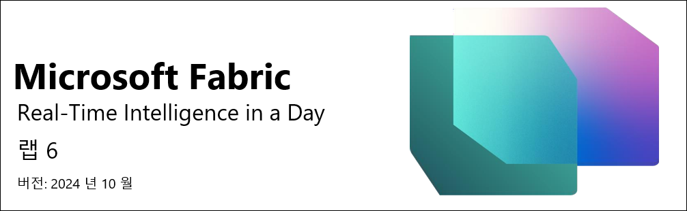
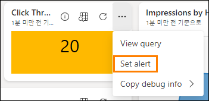
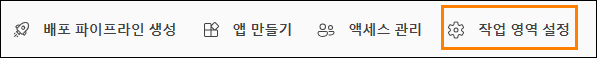

   

# 목차

- 문서 구조	
- 소개	
- Reflex 를 사용하여 알림 만들기	
    - 작업 1: 실시간 대시보드를 사용하여 알림 설정	
    - 작업 2: Reflex 환경에서 이메일 알림 테스트	
    - 작업 3: 데이터 스트림에서 새 Reflex 개체 만들기	
- 리소스 정리	
    - 작업 4: 작업 영역 정리	
- 요약	
- 참조	

 
# 문서 구조

이 랩에서는 사용자가 수행해야 하는 단계를 보조 시각 자료의 관련 스크린샷과 함께 확인할 수 있습니다. 스크린샷에서 주황색 상자로 강조 표시된 섹션은 사용자가 특히 주목해야 하는 영역입니다.

# 소개

이 랩에서는 Data Activator 를 활용하여 새로 만든 실시간 대시보드에서 알림을 보내는 Reflex 를 만드는 방법을 알아봅니다. 또한 Reflex 사용을 확장하여 Eventhouse 로 스트리밍하는 데이터에 대한 추가 사용자 지정 알림을 만드는 방법을 살펴봅니다.
이 랩을 마치면 다음 사항을 알게 됩니다.

- 실시간 대시보드의 알림 옵션에서 Reflex 만들기
- Data Activator Reflex 항목을 사용하여 더 많은 사용자 지정 알림 만들기

# Reflex 를 사용하여 알림 만들기

## 작업 1: 실시간 대시보드를 사용하여 알림 설정

1. 과정을 진행하기 위한 **Fabric 작업 영역**을 열고 지난 랩에서 만든 실시간 대시보드를 선택합니다.

     

2. **Click Through Rate** 시각적 개체에서 줄임표(...)를 클릭하고 **Set alert** 옵션을 선택합니다.

     

3. 화면 오른쪽에 새 플라이아웃이 열립니다. 알림과 연결될 특정 시각적 개체를 포함하여 대시보드에서 모니터링 중인 항목을 확인할 수 있습니다. 조건은 사용자가 완전히 제어할 수 있습니다. **조건을 보다 작음**으로 수정합니다.

     

4. **값**을 입력할 수 있는 새 필드가 나타나면 값을 **20** 으로 수정합니다.

     
 
5. Data Activator Reflex 항목이 조건을 충족했음을 인식한 후 수신하려는 알림 유형에 대해 현재 사용할 수 있는 세 가지 작업이 있습니다. **Teams 에서 나에게 메시지 보내기**옵션을 선택합니다.

     
 
6. 마지막으로, 이 알림으로 만드는 **Reflex 항목을** 저장할 위치를 결정해야 합니다. 기본적으로 현재 작업 영역이 선택되지만, 항목 드롭다운 메뉴에서 **새 항목**을 구체적으로 호출해야 합니다.

     

7. 항목 이름을 **CTR Reflex** 로 바꾼 후 **만들기**를 클릭합니다. 만드는 데 몇 분 정도 걸립니다.

     

8. Reflex 알림이 생성되었다는 확인 메시지가 표시됩니다. **열기** 버튼을 클릭하여 Reflex 를 엽니다.

     

9. 그러면 공식적인 **Reflex 환경**으로 이동합니다. 여기에서 데이터 스트림을 실시간으로 모니터링하고, Reflex 를 지원하는 데 사용되는 데이터를 확인하고, 동일한 스트림에서 추가 트리거를 만들 수 있습니다.

     
 
# 작업 2: Reflex 환경에서 이메일 알림 테스트

1. Reflex 환경에서 이벤트 이름 옆에 있는 연필 아이콘을 클릭하고 이름을 **CTR is less than 20** 으로 변경합니다.

     
 
2. 또한 오른쪽 **작업** 섹션에서 확인할 수 있는 **헤드라인 및 메시지**를 업데이트합니다. 아래 이미지와 일치하도록 두 영역을 업데이트하고 **저장 및 업데이트**를 누릅니다.

     
 
3. 오른쪽 동일한 **작업** 섹션에서 **테스트 작업 받기** 버튼을 클릭하여 Reflex 에서 팀즈로 샘플 메시지를 가져옵니다.

     
 
4. 환경 Edge 브라우저에서 새 탭을 열고 **Teams.Microsoft.com** 으로 이동합니다.

5. 메시지가 표시되면 환경 자격 증명을 사용하여 로그인합니다. 평가판을 시작하라는 메시지가 표시될 수 있으며 이를 수락해야 합니다.
 
6. 팀즈 내에 CTR 이 20 미만임을 알리는 메시지가 있어야 합니다.

     
 
7.	Reflex 환경으로 다시 이동하여 다른 트리거를 만들어 보겠습니다.

# 작업 3: 데이터 스트림에서 새 Reflex 개체 만들기

1. **KQL Source Event** 라고 레이블이 지정된 개체를 선택한 다음 **새 규칙**을 선택합니다.

     
 
2. **연필** 아이콘을 클릭하고 이 규칙의 이름을 **Clicks Greater Than 30,000**(스트리밍한 데이터 양에 따라 더 적합한 값을 선택할 수 있음)으로 지정합니다.

     

3. 시작하려면 데이터 스트림의 열 중 하나를 모니터링해야 하며, 이를 위해 조건 및 작업 섹션을 구성해야 합니다. 규칙의 정의 탭을 클릭하여 조건과 작업을 설정합니다.

4. 정의 페이지가 열리면 **조건**에서 다음 속성을 선택합니다.

    - **작업** = 다음보다 큼
    - **열** = clicks
    - **값**= 30000

     
 
5. **작업**에서 아래 속성을 선택합니다.

    - **Type** = Teams message
    - **Recipient** = {your user id here}

     

6. 마지막으로 **저장 및 시작** 을 클릭하여 이 규칙을 시작합니다

     

7. 이제 동일한 데이터 스트림을 모니터링하는 트리거 두 개가 있습니다.

     
 
# 리소스 정리

## 작업 4: 작업 영역 정리

1. 이 작업은 Real‐Time Analytics in a Day 의 마지막 랩이자 마지막 부분입니다. 랩을 완료했으며 콘텐츠와 관련하여 강사에게 추가 질문이나 요구 사항이 없으면 작업 영역 할당을 취소하여 도움을 주세요. **RTI_username** 작업 영역으로 이동합니다.

     

2. 오른쪽 위 모서리에서 **작업 영역 설정**을 클릭합니다.

     
 
3. **일반** 작업 영역 설정에서 아래로 스크롤하여 **이 작업 영역 제거** 버튼을 클릭합니다.

     
 
4. 랩과 수업이 완료되었습니다!
 
# 요약

이 랩에서는 Data Activator 를 사용하여 살펴봤습니다. 이 기능을 사용하면 실시간 대시보드 또는 데이터 스트림에 직접 연결하고 해당 데이터에 대한 트리거를 만들 수 있습니다. 그런 다음, 해당 트리거를 감지 조건으로 구성할 수 있으며 해당 조건 충족 시 조치를 취할 수 있습니다. 이 랩에서는 트리거 내에서 특정 조건을 충족할 때 이메일을 보내는 기능을 사용했습니다. Data Activator 는 아직 프리뷰 상태이므로 나중에 새로운 작업을 사용할 수 있습니다.

# 참조

Fabric Real-Time Intelligence in a Day(RTIIAD)는 Microsoft Fabric 에서 사용할 수 있는 몇 가지 주요 기능을 소개합니다.

서비스의 메뉴에 있는 도움말(?) 섹션에는 유용한 리소스로 연결되는 링크가 있습니다.

   

아래는 Microsoft Fabric 의 다음 단계에 도움이 되는 몇 가지 추가 자료입니다.

- [Microsoft Fabric GA 발표 ](https://aka.ms/Fabric-Hero-Blog-Ignite23)전문을 블로그 포스트로 읽기

- [가이드 투어](https://aka.ms/Fabric-GuidedTour)로 Fabric 탐색

- [Microsoft Fabric 무료 평가판](https://aka.ms/try-fabric) 신청

- [Microsoft Fabric 웹 사이트](https://aka.ms/microsoft-fabric) 방문

- [Fabric 학습 모듈](https://aka.ms/learn-fabric)을 탐색해서 새로운 기술 익히기

- [Fabric 기술 문서](https://aka.ms/fabric-docs) 검토

- [Fabric 시작하기 무료 e 북](https://aka.ms/fabric-get-started-ebook) 읽기

- [Fabric 커뮤니티](https://aka.ms/fabric-community)에 가입하여 질문을 게시하고 피드백을 공유하며 다른 사람들로부터 배우기
 
더 많은 심층 Fabric 환경 발표 블로그 포스트 읽기:

- [Fabric 블로그의 Data Factory 환경](https://aka.ms/Fabric-Data-Factory-Blog)

- [Fabric 블로그의 Synapse Data Engineering 환경](https://aka.ms/Fabric-DE-Blog)

- [Fabric 블로그의 Synapse Data Science 환경](https://aka.ms/Fabric-DS-Blog)

- [Fabric 블로그의 Synapse Data Warehousing 환경](https://aka.ms/Fabric-DW-Blog)

- [Fabric 블로그의 Real-Time Intelligence 환경](https://blog.fabric.microsoft.com/en-us/blog/category/real-time-intelligence)

- [Power BI 발표 블로그](https://aka.ms/Fabric-PBI-Blog)

- [Fabric 블로그의 Data Activator 환경](https://aka.ms/Fabric-DA-Blog)

- [Fabric 블로그의 관리 및 거버넌스 ](https://aka.ms/Fabric-Admin-Gov-Blog)

- [Fabric 블로그의 OneLake](https://aka.ms/Fabric-OneLake-Blog)

- [Dataverse 및 Microsof t Fabric 통합 블로그](https://aka.ms/Dataverse-Fabric-Blog)

© 2024 Microsoft Corporation. All rights reserved.

이 데모/랩을 사용하면 다음 조건에 동의하게 됩니다.

이 데모/랩에 설명된 기술/기능은 학습 환경을 제공하고 사용자 의견을 얻기 위해 Microsoft Corporation 에서 제공합니다. 데모/랩을 통해서만 이러한 기술적 특성과 기능을 평가하고 사용자 의견을 Microsoft 에 제시할 수 있습니다. 다른 용도로는 사용할 수 없습니다. 이 데모/랩 또는 그 일부에 대해 수정, 복사, 배포, 전송, 표시, 수행, 재현, 게시, 라이선스 허여, 파생 작업 생성, 양도 또는 판매할 수 없습니다.

추가 복제 또는 재배포를 위한 다른 서버 또는 위치에 대한 데모/랩(또는 그 일부)의 복사 또는 재현은 명시적으로 금지됩니다.

이 데모/랩은 위에서 명시한 목적을 위해 복잡한 설정 또는 설치가 없는 시뮬레이션된 환경에서 잠재적인 새로운 기능과 개념을 포함하여 특정 소프트웨어 기술/제품의 특성 및 기능을 제공합니다. 이 데모/랩에서 서술된 기술/개념은 전체 기능을 나타내지 않을 수 있으며, 최종 버전이 작동하지 않을 수도 있습니다. 또한 해당 기능 또는 개념의 최종 버전을 릴리스하지 않을 수도 있습니다. 또한 실제 환경에서 이러한 특성과 기능을 사용한 경험이 다를 수도 있습니다.
 
**피드백.** 이 데모/랩에서 서술된 기술적 특성, 기능 및/또는 개념에 대한 피드백을 Microsoft 에 제시하면 Microsoft 는 이 피드백을 어떤 방식과 목적으로든 무료로 사용, 공유 및 상용화할 수 있습니다. 또한 제품, 기술 및 서비스에서 피드백이 포함된 Microsoft 소프트웨어 또는 서비스의 특정 부분을 사용하거나 인터페이스하는 데 필요한 모든 특허권을 제 3 자에게 무료로 제공합니다. Microsoft 에서 사용자 의견을 포함하기 때문에 Microsoft 에서 해당 소프트웨어 또는 설명서의 사용을 인가해야 하는 라이선스에 종속된 사용자 의견은 제공할 수 없습니다. 이러한 권리는 본 계약에 의거하여 유효합니다.

Microsoft Corporation 은 이에 따라 명시적, 묵시적 또는 법적 특정 목적에의 적합성, 권리 및 비침해 여부에 관계없이 상품성에 대한 모든 보증과 조건을 포함하여 데모/랩과 관련된 모든 보증 및 조건을부인합니다. Microsoft 는 어떤 목적으로든 결과의 정확성, 데모/랩의 사용으로 파생된 출력 또는 데모/랩에 포함된 정보의 적합성과 관련하여 어떠한 보증이나 진술도 하지 않습니다.

# 고지 사항

이 데모/랩에는 Microsoft Power BI 의 새로운 기능 및 향상된 기능 중 일부만 포함되어 있습니다. 일부 기능은 제품의 향후 릴리스에서 변경될 수 있습니다. 이 데모/랩에서는 새로운 기능 모두가 아닌 일부에 대해 학습하게 됩니다.
