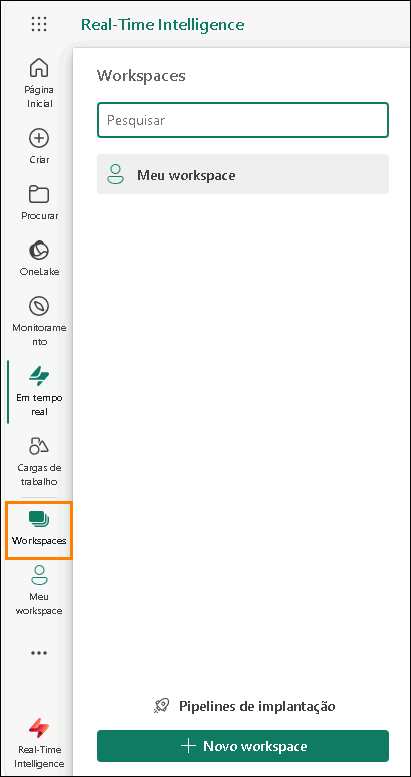

# Microsoft Fabric Real-Time Intelligence in a Day Laboratório 1

## Sumário

- Estrutura do documento 3

- Cenário/Declaração do problema

- Introdução

- Licença do Fabric

  - Tarefa 1: Habilitar uma licença de avaliação do Microsoft Fabric

- Real-Time Intelligence e Hub em Tempo Real

  - Tarefa 2: Itens da Experiência do Real-Time Intelligence

  - Tarefa 3: Hub em Tempo Real

- Criar um workspace e um Eventhouse

  - Tarefa 4: Criar um workspace do Fabric

  - Tarefa 5: Criar um Eventhouse

- Referências

# Estrutura do documento

O laboratório inclui etapas a serem seguidas pelo usuário juntamente com as capturas de tela associadas que fornecem auxílio visual. Em cada captura de tela, as seções estão destacadas com caixas laranjas para indicar as áreas nas quais o usuário deve se concentrar.

# Cenário/Declaração do problema

A Fabrikam é uma empresa de comércio eletrônico especializada em uma ampla gama de equipamentos e acessórios para áreas externas. A empresa atende clientes de varejo globalmente por meio de sua plataforma online e planeja aumentar sua presença em novos mercados internacionais. Há uma nova iniciativa que envolve o fornecimento de insights em tempo real de um site de comércio eletrônico para fornecer aos executivos a capacidade de tomar decisões oportunas com base nas informações atuais.

Como Engenheiro de Análise na equipe de Vendas, suas responsabilidades incluem coletar, limpare interpretar conjuntos de dados para resolver problemas de negócios. Você cria e mantém pipelines de dados em lote, desenvolve visualizações como tabelas e gráficos, cria e otimiza modelos e relatórios semânticos abrangentes e apresenta suas descobertas aos tomadores de decisão da organização.

**Desafios atuais**

- Você precisa lidar com um fluxo contínuo de dados em tempo real do site de comércio eletrônico, o que requer uma arquitetura robusta e escalável.

- Garantir processamento e análise de dados em tempo real para acompanhar o ritmo acelerado das vendas on-line.

- Lidar com o volume e a velocidade de dados gerados por interações do usuário, transações e atividades no site.

- Integrar dados de fluxo em tempo real com dados históricos para uma análise abrangente.

- Usar a arquitetura Medallion em um ambiente de Eventhouse para estruturar o fluxo de dados de forma eficiente.

- Aproveitar os dados do Eventhouse em um Lakehouse

- Você está interessado em aproveitar o Microsoft Fabric para enfrentar os desafios acima, usando o Eventhouse, o Banco de Dados KQL e o Eventstream para criar um pipeline de processamento de dados resiliente e eficiente.

# Introdução

Hoje você aprenderá sobre vários recursos importantes do Microsoft Fabric. Este é um workshop introdutório destinado a apresentar as diversas experiências de produtos e os vários itens disponíveis no Fabric. Ao final deste workshop, você aprenderá a usar um Eventhouse, um Pipeline de Dados, um Eventstream, um Conjunto de Consultas KQL e um Dashboard em Tempo Real.

Ao final deste laboratório, você terá aprendido a:

- Como explorar as Personas do Fabric

- Como criar um workspace do Fabric

- Como criar um Eventhouse

# Licença do Fabric

## Tarefa 1: Habilitar uma licença de avaliação do Microsoft Fabric

1. Abra o **navegador Microsoft Edge** na área de trabalho e acesse Você será direcionado para a página de logon. **Observação:** Se você não estiver usando o ambiente de laboratório e já tiver uma conta do Power BI, talvez queira usar o navegador no modo particular/anônimo.

    

2. Insira o **Nome de usuário** disponível na guia **Variáveis de Ambiente** (ao lado do Guia de Laboratório) como o **Email** e clique em **Enviar.**

    

3. Você será direcionado à tela **Senha**. Insira a **Senha** disponível na guia **Variáveis de Ambiente** (ao lado do Guia de Laboratório), que o instrutor compartilhou com você.

4. Clique em **Entrar** e siga as instruções para entrar no Fabric.

    

5. Você será direcionado à **Página Inicial do Fabric.**

    

Para trabalhar com itens do Fabric, você precisará de uma licença de avaliação e de um workspace que tenha a licença do Fabric. Vamos configurar tudo.

6. No canto superior direito da tela, selecione o **ícone de usuário**.

7. Selecione **Avaliação Gratuita**.

    

8. A caixa de diálogo Atualizar para uma avaliação gratuita do Microsoft Fabric é aberta. Selecione **Ativar**.

    

9. A caixa de diálogo Atualizado com êxito para Microsoft Fabric é aberta. Selecione **Fabric Home Page**.

    

10. Você será direcionado de volta à **Página Inicial do Microsoft Fabric**.

    

# Real-Time Intelligence e Hub em Tempo Real

## Tarefa 2: Itens da Experiência do Real-Time Intelligence

1. Clique na Experiência do Real-Time Intelligence.

    

2. Você será direcionado para a Página Inicial do **Real-Time Intelligence**. Você verá **Modelos de fluxo de tarefas**, **Itens recomendados para criar** e **Saiba mais sobre categorias do Real-Time** Intelligence. Com a categoria **Recomendados**, observe os itens:

   a. **Eventhouse:** usado para criar um workspace de um ou de vários bancos de dados KQL, que podem ser compartilhados entre projetos. Também cria um Banco de Dados KQL dentro do Eventhouse.

   b. **Conjunto de Consultas KQL:** usado para executar consultas nos dados para produzir tabelas e visuais compartilháveis.

   c. **Painel em Tempo Real:** uma coleção de blocos, organizados opcionalmente em páginas, em que cada bloco tem uma consulta subjacente e uma representação visual.

   d. **Eventstream:** usado para capturar, transformar e rotear fluxo de eventos em tempo real.

   e. **Reflex:** para executar ações automaticamente quando padrões ou condições são detectados em dados alterados.

    

## Tarefa 3: Hub em Tempo Real

1. Clique no **Hub em Tempo Real** no painel de navegação do Fabric no lado esquerdo da tela.

    

2. A caixa de diálogo **Bem-vindo ao Hub em Tempo Real** será aberta e você poderá ficar à vontade para selecionar **Fazer um tour** ou selecionar **Introdução.**

    

3. O Hub em Tempo Real é o único local para transmitir dados em movimento em toda a sua organização. Cada locatário do Microsoft Fabric é automaticamente provisionado com esse hub. Ele permite que você descubra, ingira, gerencie e consuma facilmente dados em movimento de uma ampla variedade de fontes.

4. No Hub em Tempo Real, você tem acesso a três tipos diferentes de integração de dados.

   - **Todos os fluxos de dados:** para seus fluxos de eventos em execução e bancos de dados KQL, todas as saídas de fluxo de fluxos de eventos e tabelas de bancos de dados KQL aparecem automaticamente no Hub em Tempo Real.

   - **Fontes de streaming:** lista todos os recursos de streaming dos serviços da Microsoft. Quer se trate de Hubs de Eventos do Azure, do Hub IoT do Azure ou outros serviços, você pode ingerir dados perfeitamente no Hub em Tempo Real.

   - **Eventos do Fabric:** os eventos gerados por meio de artefatos do Fabric e de fontes externas são disponibilizados no Fabric para oferecer suporte a cenários orientados a eventos, como alertas em tempo real e acionamento de ações downstream. Você pode monitorar e reagir a eventos, incluindo eventos de item do workspace do Fabric e eventos do Armazenamento de Blobs do Azure.

   - **Eventos do Azure:** esta lista inclui eventos do sistema gerados no Azure que você pode acessar. Um evento pode ser monitorado e regras definidas, as quais enviarão notificações ou executarão ações quando ativadas.

      

5. No canto superior direito do Hub em Tempo Real, clique no botão **+ Conectar a fonte de dados**.

    

6. Uma janela será exibida e detalhará os fluxos de dados acessíveis no momento que estão disponíveis para integração ao Hub em Tempo Real. Isso inclui uma mistura de fontes do Azure, bem como fontes externas de fluxo na nuvem, como o Amazon Kinesis, o Confluent Cloud Kafka e o Google Cloud Pub/Sub. Ainda há alguns dados de exemplo disponíveis para explorar.

    

7. **Feche** a janela Obter eventos clicando no "X" no canto superior direito.

# Criar um workspace e um Eventhouse

## Tarefa 4: Criar um workspace do Fabric

1. Agora vamos criar um workspace com a licença do Fabric. Selecione **Workspaces** na barra de navegação à esquerda.

2. Selecione + **Novo workspace**.

    

3. A caixa de diálogo **Criar um workspace** é aberta no lado direito do navegador.

4. No campo **Nome**, insira **RTI_username**. Use o nome de usuário fornecido a você nos detalhes do ambiente.

  > **Observação:** o nome do workspace deve ser exclusivo. Verifique se há uma marca de seleção verde em "**Este nome está disponível**", abaixo do campo Nome.

5. Se preferir, você pode inserir uma **Descrição** para o workspace. Esse campo é opcional.

6. Clique em **Avançado** para expandir a seção.

    

7. Em **Modo de licença**, verifique se **Avaliação** está selecionada. (Essa opção deve estar selecionada por padrão.)

8. Selecione **Aplicar** para criar um novo workspace.

    

  > **Observação:** se a caixa de diálogo **Introdução aos fluxos de tarefa** for aberta, clique em **Entendi**.

    

## Tarefa 5: Criar um Eventhouse

1. Clique na caixa **+Novo item** para abrir um novo painel que tem todos os itens que você pode criar neste workspace do Fabric.

    

2. Selecione o **Eventhouse** na seção **Armazenar dados** no painel. Como falamos, isso pode ser visto de forma semelhante a um Lakehouse em que podemos armazenar dados, mas esse Eventhouse é focado em dados em tempo real.

    

3. Na janela que aparece, dê ao seu Eventhouse o nome **eh_Fabrikam** e clique em **Criar**.

    

4. É aqui que, em última análise, você transmitirá dados de várias fontes pelo resto do treinamento hoje. Quando o item for criado, será exibida uma janela informando alguns detalhes sobre o Eventhouse. Clique no botão **Get started**.

    

5. Faça um rápido tour pelo Eventhouse seguindo as dicas de ferramentas verdes na tela. Essa primeira mostra que um banco de dados Linguagem de Consulta Kusto (KQL) vazio foi criado com o Eventhouse.

    

6. Siga o restante das dicas de ferramentas ao redor da tela para mostrar onde criar bancos de dados adicionais, verificar o armazenamento no OneLake do Eventhouse, verificar o uso de recursos do Fabric em minutos de computação e, por fim, ver quais ações ocorreram no Eventhouse.

7. No painel de navegação à esquerda do Eventhouse, encontre seu Banco de Dados KQL que foi criado junto com o Eventhouse e basta clicar nele para exibir os detalhes do banco de dados.

    

8. Isso nos permitirá ainda ter uma guia no painel do navegador à esquerda para ter a visão geral de todo o nosso Eventhouse e uma nova guia para focar nas propriedades do Banco de Dados KQL. Uma meta que desejamos alcançar em nosso cenário é garantir que os dados transmitidos para o Banco de Dados KQL sejam acessíveis via OneLake. Ao habilitar esse recurso, tornamos os dados neste Banco de Dados KQL facilmente detectáveis por meio de atalhos a serem usados em qualquer Lakehouse que desejarmos. Localize a seção **Detalhes do banco de dados** à direita e defina a opção "Disponibilidade" como **Ligado**.

   

9. Retorne ao workspace **RTI_username** selecionando-o no lado esquerdo do navegador.

    

10. Se você vir a opção **Fluxos de Tarefa** ocupando a maior parte do espaço, selecione a seta dupla para cima no lado direito para minimizá-la.

    

11. Agora você tem a base de como começará a ingerir os dados de fluxo em seu OneLake. A próxima etapa é criar um fluxo de dados que possa receber os dados em movimento.

    

Neste laboratório, exploramos a interface do Real-Time Intelligence, examinamos o Hub em Tempo Real, criamos um workspace do Fabric e um Eventhouse que veio com um Banco de Dados KQL.

No próximo laboratório, você começará a explorar técnicas que ingerem dados de várias fontes em seu estado de dados para o OneLake e fazer algumas análises básicas com o Linguagem de Consulta Kusto (KQL).

# Referências

O Fabric Real-time Intelligence in a Day (RTIIAD) apresenta algumas das principais funções disponíveis no Microsoft Fabric.

No menu do serviço, a seção Ajuda (?) tem links para ótimos recursos.

  

Veja aqui mais alguns recursos que ajudarão você com as próximas etapas do Microsoft Fabric.

- Veja a postagem do blog para ler o anúncio completo da [GA do Microsof t Fabric](https://aka.ms/Fabric-Hero-Blog-Ignite23)

- Explore o Fabric por meio do [Tour Guiado](https://aka.ms/Fabric-GuidedTour)

- Inscreva-se na [avaliação gratuita do Microsoft Fabric](https://aka.ms/try-fabric)

- Visite o [site do Microsoft Fabric](https://aka.ms/microsoft-fabric)

- Aprenda novas habilidades explorando os [módulos de Aprendizagem do Fabric](https://aka.ms/learn-fabric)

- Explore a [documentação técnica do Fabric](https://aka.ms/fabric-docs)

- Leia o livro eletrônico [gratuito](https://aka.ms/fabric-get-started-ebook) [sobre como começar a usar o Fabric](https://aka.ms/fabric-get-started-ebook)

- Participe da [comunidade do Fabric](https://aka.ms/fabric-community) para postar suas perguntas, compartilhar seus comentários e aprender com outras pessoas

Leia os blogs de comunicados de experiências do Fabric em mais detalhes:

- [Experiência do Data Factory no blog do Fabric](https://aka.ms/Fabric-Data-Factory-Blog)

- [Experiência do Synapse Data Engineering no blog do Fabric](https://aka.ms/Fabric-DE-Blog)

- [Experiência do Synapse Data Science no blog do Fabric](https://aka.ms/Fabric-DS-Blog)

- [Experiência do Synapse Data Warehousing no blog do Fabric](https://aka.ms/Fabric-DW-Blog)

- [Experiência do Real-](https://aka.ms/Fabric-RTA-Blog)[Time Intelligence no blog do Fabric](https://blog.fabric.microsoft.com/en-us/blog/category/real-time-intelligence)

- [Blog de anúncio do Power BI](https://aka.ms/Fabric-PBI-Blog)

- [Experiência do Data Activator no blog do Fabric](https://aka.ms/Fabric-DA-Blog)

- [Administração e governança no blog do Fabric](https://aka.ms/Fabric-Admin-Gov-Blog)

- [OneLake](https://aka.ms/Fabric-OneLake-Blog) [no blog do Fabric](https://aka.ms/Fabric-OneLake-Blog)

- [Blog de integração do Dataverse e Microsoft Fabric](https://aka.ms/Dataverse-Fabric-Blog)

© 2024 Microsoft Corporation. Todos os direitos reservados.

Ao usar esta demonstração/este laboratório, você concorda com os seguintes termos:

A tecnologia/funcionalidade descrita nesta demonstração/neste laboratório é fornecida pela Microsoft Corporation para obter seus comentários e oferecer uma experiência de aprendizado. Você pode usar a demonstração/o laboratório somente para avaliar tais funcionalidades e recursos de tecnologia e fornecer comentários à Microsoft. Você não pode usá-los para nenhuma outra finalidade. Você não pode modificar, copiar, distribuir, transmitir, exibir, executar, reproduzir, publicar, licenciar, criar obras derivadas, transferir nem vender esta demonstração/este laboratório ou qualquer parte deles.

A CÓPIA OU A REPRODUÇÃO DA DEMONSTRAÇÃO/DO LABORATÓRIO (OU DE QUALQUER PARTE DELES) EM QUALQUER OUTRO SERVIDOR OU LOCAL PARA REPRODUÇÃO OU REDISTRIBUIÇÃO ADICIONAL É EXPRESSAMENTE PROIBIDA.

ESTA DEMONSTRAÇÃO/LABORATÓRIO FORNECE DETERMINADAS TECNOLOGIAS DE SOFTWARE/RECURSOS E FUNCIONALIDADE DO PRODUTO, INCLUINDO POTENCIAIS NOVOS RECURSOS E CONCEITOS, EM UM AMBIENTE SIMULADO SEM CONFIGURAÇÃO OU INSTALAÇÃO COMPLEXA PARA A FINALIDADE DESCRITA ACIMA. A TECNOLOGIA/CONCEITOS REPRESENTADOS NESTA DEMONSTRAÇÃO/LABORATÓRIO PODEM NÃO REPRESENTAR A FUNCIONALIDADE COMPLETA DO RECURSO E PODE NÃO FUNCIONAR DA MESMA FORMA DO QUE UMA VERSÃO FINAL. NÓS TAMBÉM PODEMOS NÃO LANÇAR UMA VERSÃO FINAL DE TAIS RECURSOS OU CONCEITOS. SUA EXPERIÊNCIA COM O USO DE TAIS RECURSOS E FUNCIONALIDADES EM UM AMBIENTE FÍSICO TAMBÉM PODE SER DIFERENTE.

**COMENTÁRIOS.** Caso você forneça comentários sobre os recursos de tecnologia, as funcionalidades e/ou os conceitos descritos nesta demonstração/neste laboratório à Microsoft, você concederá à Microsoft, sem encargos, o direito de usar, compartilhar e comercializar seus comentários de qualquer forma e para qualquer finalidade. Você também concede a terceiros, sem encargos, quaisquer direitos de patente necessários para que seus produtos, suas tecnologias e seus serviços usem ou interajam com partes específicas de um software ou um serviço da Microsoft que inclua os comentários. Você não fornecerá comentários que estejam sujeitos a uma licença que exija que a Microsoft licencie seu software ou sua documentação para terceiros em virtude da inclusão de seus comentários neles. Esses direitos continuarão em vigor após o término do contrato.

A MICROSOFT CORPORATION SE ISENTA DE TODAS AS GARANTIAS E CONDIÇÕES COM RELAÇÃO À DEMONSTRAÇÃO/LABORATÓRIO, INCLUINDO TODAS AS GARANTIAS E CONDIÇÕES DE COMERCIALIZAÇÃO, SEJAM EXPRESSAS, IMPLÍCITAS OU ESTATUTÁRIAS, ADEQUAÇÃO A UM DETERMINADO FIM, TÍTULO E NÃO VIOLAÇÃO. A MICROSOFT NÃO DECLARA NEM GARANTE A PRECISÃO DOS RESULTADOS DERIVADOS DO USO DA DEMONSTRAÇÃO/DO LABORATÓRIO NEM A ADEQUAÇÃO DAS INFORMAÇÕES CONTIDAS NA DEMONSTRAÇÃO/NO LABORATÓRIO A QUALQUER FINALIDADE.

## AVISO DE ISENÇÃO DE RESPONSABILIDADE

Esta demonstração/este laboratório contém apenas uma parte dos novos recursos e aprimoramentos do Microsoft Power BI. Alguns dos recursos podem ser alterados em versões futuras do produto. Nesta demonstração/neste laboratório, você aprenderá sobre alguns dos novos recursos, mas não todos.
