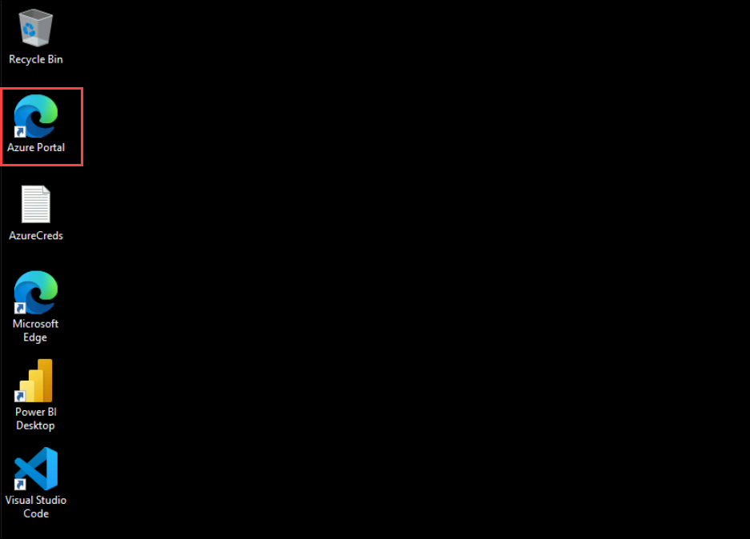

# Introdução à inteligência em tempo real em um dia

Bem-vindo ao seu workshop de análise em tempo real! Hoje, você vai mergulhar na configuração de um pipeline de dados em tempo real, integrá-lo com mecanismos de análise e criar painéis ao vivo para obter insights instantâneos de dados de streaming.

## Acessando seu ambiente de laboratório

Quando estiver pronto para mergulhar, sua máquina virtual e guia de laboratório estarão na ponta dos dedos no seu navegador da web.

### Máquina virtual e guia de laboratório

Sua máquina virtual é seu burro de carga durante todo o workshop. O guia de laboratório é seu roteiro para o sucesso.

## Explorando seus recursos de laboratório

Para entender melhor seus recursos e credenciais de laboratório, navegue até a guia **Ambiente**.

## Utilizando o recurso Split Window

Para sua conveniência, você pode abrir o guia do laboratório em uma janela separada selecionando o botão **Split Window** no canto superior direito.

## Gerenciando sua máquina virtual

Sinta-se à vontade para iniciar, parar ou reiniciar sua máquina virtual conforme necessário na guia **Recursos**. Sua experiência está em suas mãos!

## Vamos começar com o Portal do Azure

1. Na sua máquina virtual, clique no ícone do Portal do Azure, conforme mostrado abaixo:

1. Você verá a guia **Entrar no Microsoft Azure**. Aqui, insira suas credenciais:

- **E-mail/Nome de usuário:** <inject key="AzureAdUserEmail"></inject>

1. Em seguida, forneça sua senha:

- **Senha:** <inject key="AzureAdUserPassword"></inject>

1. Se solicitado a permanecer conectado, você pode clicar em "Não".

1. Se uma janela pop-up **Bem-vindo ao Microsoft Azure** aparecer, basta clicar em "**Cancelar**" para pular o tour.

1. Clique em "Próximo" no canto inferior direito para embarcar em sua jornada no Lab!

Agora você está pronto para explorar o poderoso mundo da tecnologia. Sinta-se à vontade para entrar em contato conosco caso tenha alguma dúvida ao longo do caminho. Aproveite seu workshop!
