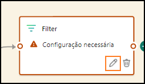

# Sumário 
- Estrutura do documento
- Introdução
- Eventstreams do Fabric
    - Tarefa 1: Criar um Eventstream
    - Tarefa 2: Transformar o Eventstream
    - Tarefa 3: Dividir o Eventstream e carregar dois destinos
- Adicionando mais dados ao Banco de Dados KQL
    - Tarefa 4: Validar tabelas de dados de evento
    - Tarefa 5: Criar atalhos de Banco de Dados KQL para tabelas de dimensão
- Resumo
- Referências

# Estrutura do documento 
O laboratório inclui etapas a serem seguidas pelo usuário juntamente com as capturas de tela associadas que fornecem auxílio visual. Em cada captura de tela, as seções estão destacadas com caixas laranjas para indicar as áreas nas quais o usuário deve se concentrar. 

# Introdução 
Neste laboratório, você criará outro Eventstream para ingerir dados adicionais em nosso Eventhouse existente. Veremos como incluir transformações no Eventstream para controlar quais dados queremos adicionar ao Banco de Dados KQL

Ao final deste laboratório, você terá aprendido a: 
- Processar e transformar o Eventstream
- Escrever consultas KQL para unir dados de um banco de dados externo
- Usar o KQL para consultar dados e exibir no Power BI

# Eventstreams do Fabric
## Tarefa 1: Criar um Eventstream 

1. Abra o **espaço de trabalho do Fabric** que você está usando para o curso hoje.

    

2. Há dados de fluxo adicionais para nós ingerirmos relacionados à nossa loja de comércio eletrônico. Para este Eventstream, porém, desejaremos transformar os dados antes de carregá-los no Eventhouse. Em vez de ir para o **“Hub em Tempo Real”**, podemos criar um Eventstream diretamente do espaço de trabalho. No menu **+ Novo item**, crie um **Eventstream**.

    

3. Dê o nome ao novo Eventstream, **es_Fabrikam_ClickEvents**, marque a opção **“Capacidades Avançadas”** e clique em **Criar**.

    

4. Na faixa de opções Página Inicial, clique no menu suspenso **Adicionar origem** e, em seguida, selecione **Fontes externas**.

    

5. Da mesma forma que no laboratório anterior, nos conectaremos a um Hub de Eventos do Azure, que tem dados sendo transmitidos de um notebook Python. Clique em **“Conectar”** no bloco **“Hubs de Eventos do Azure”**. Se você não vir **“Hubs de Eventos do Azure”** na seção recomendada, selecione **“Exibir todas as fontes”** para descobri-la.

    

6. Crie uma **Nova conexão**.

    

7. Na página de detalhes do ambiente, copie e cole todas as configurações de conexão necessárias nos campos apropriados.

    Nome de usuário: **rtiadhub{username}**

    Hub de Eventos: **rta-iad-clicks**

    Nome da Chave de Acesso Compartilhada: **rti-reader**

    Senha: **Fornecido por Detalhes do Ambiente**

    
 
8. Depois que todas as propriedades forem preenchidas, clique em **Conectar**.

9. Na configuração da fonte de dados do Hub de Eventos do Azure, você talvez precise modificar o **Grupo de consumidores** do Hub de Eventos para garantir acesso a um ponto de acesso exclusivo ao fluxo de dados. Para este workshop, você pode deixar o valor “$Default” como mostrado abaixo.

    

10. Clique em **Avançar**.

11. Na janela Examinar + conectar, verifique se tudo está configurado corretamente e clique em **Adicionar**.

    

12. Depois que o fluxo for configurado, você terá uma visualização dos dados provenientes do Hub de Eventos.

    

13. Examine os dados que estão sendo recebidos. Há dois tipos de eventos registrados no site de comércio eletrônico clique e impressão.
- **IMPRESSÃO** - um evento de impressão é registrado cada vez que um anúncio ou uma listagem de produtos é exibida para um usuário. As impressões são uma medida de quantas vezes um item (anúncio ou produto) é exibido, independentemente de ele ter interagido.
- **CLIQUE** - um evento de clique é registrado quando um usuário interage com um item clicando nele. Isso geralmente indica um nível mais alto de participação em comparação com uma impressão.

Além dos eventos de impressão e clique que são registrados, há detalhes sobre para qual produto o clique ou impressão foi destinado, de qual dispositivo e navegador a página da Web foi carregada, e qual endereço IP acessou a página e quanto tempo a página levou para carregar.

## Tarefa 2: Transformar o Eventstream

1. Agora você pegará esse fluxo de dados e os transformará antes de serem ingeridos em seu Banco de Dados KQL de uma maneira que possa ser facilmente compreendida para analistas que procuram obter insights desses dados. Na tela Eventstream, clique na lista suspensa para o objeto **Transformar eventos**.

    

2. Na lista de operações disponíveis, selecione a opção **Gerenciar os campos**.

    

3. No novo ícone que aparece, chamado **ManageFields**, clique no **ícone de lápis** para selecionar quais campos você deseja adicionar ao seu fluxo da fonte.

    

4. No painel de submenu que aparece, clique no botão da opção para **Adicionar todos os campos**.

    

5. Na lista de campos, selecione aquele chamado **PartitionId** e clique nas reticências (...) que aparecem quando você passa o mouse sobre o campo

    

6. Escolha a opção para **Remover** esse campo. Para o fluxo de dados proveniente do Hub de Eventos, o particionamento não está sendo usado, então essa coluna não é útil para nós, portanto, estamos removendo-o.

    

7. Remova todos os campos a seguir que não serão necessários para esse fluxo.
    - userAgent
    - page_loading_seconds
    - EventProcessedUtcTime
    - EventEnqueredUtcTime

    Você deve ficar com os campos a seguir na imagem abaixo.
    
    
  
8. Passe o mouse sobre o campo eventDate e, quando as reticências (...) aparecerem no lado direito da janela, clique nelas.

    

9. Escolha a opção **Editar**.

    

10. Clique no **botão de alternância Alterar tipo** para modificar o tipo de dados desse campo. O tipo original é uma Cadeia de Caracteres, você precisa modificar o **Tipo Convertido** para **DateTime**. Depois de terminar, clique em **Salvar**.

    

## Tarefa 3: Dividir o Eventstream e carregar dois destinos

1. Embora você possa carregar esse fluxo de dados em um Banco de Dados KQL para análise, talvez você queira ter outra maneira de consumir esses dados para diferenciar eventos CLIQUE e eventos IMPRESSÃO. Adicione outra atividade de transformação à interface do usuário passando o mouse sobre o final da transformação **ManageFields**.

    

2. Escolha a transformação **Filtro** na lista de operações disponíveis.

    

3. Clique no **ícone de lápis** na nova transformação, **Filter**.

    

4. No submenu que aparece no lado direito da tela, personalize as condições do filtro para refletir uma maneira de retornar apenas valores de CLIQUE usando as configurações abaixo. É importante observar que a transformação Filtro diferencia maiúsculas de minúsculas
    - **Nome da operação** - Clicks
    - **Selecionar um campo para filtrar** - eventType
    - **Manter eventos quando o valor** for igual a CLICK **(Importante! Esse é um campo que diferencia maiúsculas de minúsculas, garanta a entrada em letras maiúsculas para este exemplo)**

    
 
5. Escolha a opção **Salvar** para manter as alterações.

6. Clique no b**otão Atualizar** novamente para verificar se os dados foram filtrados para CLICK em eventTypes.

    

7. Esses podem ser a única linha que você está interessado em enviar para uma tabela, mas outra opção é criar dois fluxos separados para rotear informações diferentes para duas ou mais tabelas. Na faixa de opções **Página Inicial** do Eventstream, clique no menu suspenso **Transformar eventos** e, em seguida, selecione **Filtro**.

    

8. Um novo objeto chamado **Filter (o nome pode variar)** aparecerá na tela. Você precisará conectar o fluxo **ManageFields** à nova transformação de filtro. Arraste uma linha do ponto verde em uma transformação até outro para fazer essa conexão.

    

9. Clique no **ícone de lápis** de **Filter** para editar suas configurações.

    

10. No submenu que aparece no lado direito da tela, personalize as condições do filtro para refletir uma maneira de retornar apenas valores de IMPRESSÃO usando os valores abaixo. Lembre-se de que a transformação do Filtro diferencia maiúsculas de minúsculas
    - **Nome da operação** - Impressions
    - **Selecionar um campo para filtrar** - eventType
    - **Manter eventos quando o valor** for igual a IMPRESSION **(Importante! Esse é um campo que diferencia maiúsculas de minúsculas, garanta a entrada em letras maiúsculas para este exemplo)**
 
    

11. Escolha a opção **Salvar** para manter as alterações.

12. Antes de carregar os dados em novas tabelas em nosso Banco de Dados KQL, podemos remover colunas adicionais que não são necessárias. Nesse caso, para o fluxo de dados que é filtrado para nossos registros “CLIQUE”, não precisamos mais da coluna “eventType”, pois cada linha contém o mesmo valor. Para o nosso fluxo de dados “IMPRESSÃO” podemos remover a coluna “eventType” pelos mesmos motivos mencionados acima e também podemos remover a coluna “referrer”, pois ela está vazia para cada linha nesta tabela.

13. Clique no **ícone +** após a operação de filtro **Clicks**.

    

14. No menu suspenso, selecione “Gerenciar os campos”

    

15. Clique no **ícone de lápis** para selecionar quais campos você deseja adicionar/remover do fluxo

    

16. Renomeie a operação para “Manage_Clicks”. Além disso, selecione “Adicionar todos os campos" e”remova “eventType”. Depois de terminar, clique em **Salvar**.

    

17. Em seguida, vamos adicionar outra transformação “ManageFields1” conectada ao filtro “Impressions”, como visto abaixo

    

18. Clique no **ícone de lápis** para selecionar quais campos você deseja adicionar/remover do fluxo

    

19. Renomeie a operação para “Manage_Impressions”. Em seguida, selecione “Adicionar todos os campos” e remova “eventType” e “referrer”. Sua transformação “Gerenciar os campos” deve parecer com o seguinte:

    

20. Agora que você limpou os dados dos fluxos para cada um dos tipos de eventos, você precisa carregar cada fluxo em uma nova tabela no Banco de Dados KQL. Clique no **ícone +** após a operação de gerenciar campos **Manage_Clicks**.

    

21. Na lista suspensa exibida, vá para **Destinos** e selecione **Eventhouse**.

    

22. Clique no **ícone de lápis** para o destino Eventhouse.

    

23. Para esse destino, configure as propriedades a seguir.
    - **Nome de destino** – dbo-Clicks
    - **Espaço de trabalho** - RTI_username
    - **Eventhouse** – eh_Fabrikam
    - **Banco de Dados KQL** - eh_Fabrikam
    - **KQL Destination table** - crie uma tabela chamada **Clicks**
 
    

24. Clique em **Salvar** na parte inferior do submenu.

25. Faça o mesmo para a tabela Impressions com as seguintes informações configuradas como abaixo.

    

26. Salve suas alterações.

27. Este Eventstream agora está pronto para começar a transmitir. Clique em **Publicar** para iniciar esse fluxo.

    

28. Com o Eventstream agora em execução, você deve ver a interface do usuário do Eventstream mudar ligeiramente para significar que você está transmitindo os dados do Hub de Eventos transformando e dividindo esse fluxo de dados e carregando-o em duas tabelas de Banco de Dados KQL separadas.

    

 
# Adicionando mais dados ao Banco de Dados KQL
## Tarefa 4: Validar tabelas de dados de evento

1. Retorne para o seu espaço de trabalho **RTI_username**.

2. Abra o Banco de Dados KQL **eh_Fabrikam**.

    

3. Com o Eventstream em execução, agora você deve ver duas novas tabelas na página Visão geral do Banco de Dados KQL. Depois de deixar o Eventstream funcionar por alguns instantes, você verá que as **tabelas Principais** no Banco de Dados KQL serão exibidas na página Visão geral e mostrarão quantos dados são armazenados nas tabelas.

    

4. Clique na tabela **Impressions**. Essa tabela recebe cerca de 1,5 milhão de registros a cada 24 horas. Há muito mais impressões do que Cliques, então essa será sua maior tabela para os propósitos desta aula.

    
 
## Tarefa 5: Criar atalhos de Banco de Dados KQL para tabelas de dimensão
Até este ponto, você tem trabalhado com dados de fluxo, mas ainda estão faltando alguns elementos críticos para poder derivar inteligência dos dados que você trouxe. Nesta tarefa traremos dados de um Banco de Dados SQL do Azure externo que servirá como tabelas de dimensão em nosso Banco de Dados KQL. Isso nos permitirá descrever melhor os dados que estamos transmitindo atualmente. Por exemplo, todas as nossas tabelas contêm um formulário de ID do Produto que é um campo numérico, mas seria melhor se tivéssemos algum tipo de Nome do produto para poder exibir. Os dados que precisamos para dar suporte a isso estão atualmente em um Banco de Dados SQL do Azure externo, vamos ver como é fácil fazer conexões com algumas dessas tabelas de dimensão.

1. No banco de dados **eh_Fabrikam**, clique no menu suspenso chamado **New related item**. Em seguida, escolha a opção que diz KQL Queryset.

    

2. Dê ao Novo KQL Queryset o nome **Create Tables** e, em seguida, clique no botão **Criar**.

    

3. O hub de dados do OneLake será aberto e a única opção para selecionar será o Banco de Dados KQL **“eh_Fabrikam”**. Selecione esse banco de dados e clique em **“Conectar”**.

    

4. Na nova interface, clique uma vez dentro da janela de consulta e realce todo o texto usando o atalho de teclado **Ctrl + A**. Depois que tudo estiver realçado, exclua tudo.

    

5. Na janela de consulta em branco, insira o script KQL a seguir. Esse script criará uma conexão com um Banco de Dados SQL do Azure externo e o disponibilizará em nosso Banco de Dados KQL como um **Atalho**. Um **Atalho** é anexado em um modo somente leitura, tornando possível exibir e executar consultas junto com os dados de fluxo que foram ingeridos no Banco de Dados KQL.

    ```
    .execute database script <|
    //External tables - shortcuts
    // connect to operational Database with external table Product
    .create external table products (ProductID: int, ProductNumber: string,  Name: string) 
    kind=sql
    table=[SalesLT.Product]
    ( 
    h@'Server= fabrikamdemo.database.windows.net,1433;Initial Catalog=fabrikamdb;User Id=demouser;Password=fabrikam@123456'
    )
    with 
    (
    createifnotexists = true
    )  
    // connect to operational Database with external table ProductCategory
    .create external table productCategories (ProductCategoryID: int, Name: string) 
    kind=sql
    table=[SalesLT.ProductCategory]
    ( 
     h@'Server= fabrikamdemo.database.windows.net,1433;Initial Catalog=fabrikamdb;User Id=demouser;Password=fabrikam@123456'    )
    with 
    (
    createifnotexists = true
    )
    ```

    

6. Clique no botão **Run** para executar o script.

    

7. Na janela do Gerenciador de Banco de Dados, agora você verá uma nova pasta chamada **Shortcuts** e dentro da pasta você verá duas tabelas adicionais vinculadas a esse Banco de Dados KQL. Essas tabelas existem em um Banco de Dados SQL do Azure, mas por meio do script que você executou, agora elas são vinculadas a esse Banco de Dados KQL para serem associadas às suas tabelas de eventos e InternetSales.

    

8. Agora que você tem qualidades dimensionais para seu banco de dados, você pode responder a perguntas e dar mais contexto aos consumidores dos relatórios e consultas dessas tabelas de insights em toda a sua empresa. Execute a consulta KQL a seguir para ver um deles.

    ```
    InternetSales
    | join kind=inner 
    (external_table("products")) on ($left.ProductKey == $right.ProductID)
    | summarize SalesPerProduct=sum(SalesAmount) by Name
    | project Name, SalesPerProduct
    ```


9. Agora você verá nos resultados da consulta valores para cada produto individual que sua empresa vendeu.

    

10. Com sua consulta realçada, clique no botão da barra de ferramentas **Create Power BI report**.

    

11. Isso lhe dá a oportunidade de criar um relatório do Power BI usando os dados dentro do seu Banco de Dados KQL. Sinta-se à vontade para explorar isso por alguns instantes, mas você não precisará criar um relatório desses dados ainda. Clique no **botão X** no canto superior direito quando estiver pronto para avançar.

    

12. Volte para o Banco de Dados KQL **eh_Fabrikam**.

    

13. Clique na opção **Shortcuts** no painel de navegação de **eh_Fabrikam**. Isso mostrará todos os atalhos que você criou para este Banco de Dados KQL. Deve-se notar que esses atalhos são considerados tabelas externas clássicas do Azure Data Explorer usando a sintaxe de tabela externa do SQL do Azure e são criados de forma diferente dos atalhos do OneLake, do ADLS ou do S3, que também têm suporte no Banco de Dados KQL dentro do Fabric.

    
 
# Resumo
Neste laboratório, você criou outro fluxo de dados, mas conseguiu transformar o fluxo usando a interface do usuário do Eventstream no Fabric. Carregar os dados em duas tabelas separadas permitiu rastrear todos os cliques e impressões em seu sistema de comércio eletrônico para fins de marketing, publicidade e análise. Você também criou um atalho para um Banco de Dados SQL do Azure externo usando o recurso de tabela externa do Conjunto de Consultas KQL. Agora você tem algumas dimensões para entender melhor o contexto das vendas e cliques dentro do seu Banco de Dados KQL.

# Referências 
O Fabric Real-Time Intelligence in a Day (RTIIAD) apresenta algumas das principais funções disponíveis no Microsoft Fabric. 
No menu do serviço, a seção Ajuda (?) tem links para ótimos recursos. 

  
 
Veja aqui mais alguns recursos que ajudarão você com as próximas etapas do Microsoft Fabric.

- Veja a postagem do blog para ler o anúncio completo da [GA do Microsof t Fabric](https://aka.ms/Fabric-Hero-Blog-Ignite23)

- Explore o Fabric por meio do [Tour Guiado](https://aka.ms/Fabric-GuidedTour)

- Inscreva-se na [avaliação gratuita do Microsoft Fabric](https://aka.ms/try-fabric)

- Visite o [site do Microsoft Fabric](https://aka.ms/microsoft-fabric)

- Aprenda novas habilidades explorando os [módulos de Aprendizagem do Fabric](https://aka.ms/learn-fabric)

- Explore a [documentação técnica do Fabric](https://aka.ms/fabric-docs)

- Leia o livro eletrônico [gratuito](https://aka.ms/fabric-get-started-ebook) [sobre como começar a usar o Fabric](https://aka.ms/fabric-get-started-ebook)

- Participe da [comunidade do Fabric](https://aka.ms/fabric-community) para postar suas perguntas, compartilhar seus comentários e aprender com outras pessoas

Leia os blogs de comunicados de experiências do Fabric em mais detalhes:

- [Experiência do Data Factory no blog do Fabric](https://aka.ms/Fabric-Data-Factory-Blog)

- [Experiência do Synapse Data Engineering no blog do Fabric](https://aka.ms/Fabric-DE-Blog)

- [Experiência do Synapse Data Science no blog do Fabric](https://aka.ms/Fabric-DS-Blog)

- [Experiência do Synapse Data Warehousing no blog do Fabric](https://aka.ms/Fabric-DW-Blog)

- [Experiência do Real-](https://aka.ms/Fabric-RTA-Blog)[Time Intelligence no blog do Fabric](https://blog.fabric.microsoft.com/en-us/blog/category/real-time-intelligence)

- [Blog de anúncio do Power BI](https://aka.ms/Fabric-PBI-Blog)

- [Experiência do Data Activator no blog do Fabric](https://aka.ms/Fabric-DA-Blog)

- [Administração e governança no blog do Fabric](https://aka.ms/Fabric-Admin-Gov-Blog)

- [OneLake](https://aka.ms/Fabric-OneLake-Blog) [no blog do Fabric](https://aka.ms/Fabric-OneLake-Blog)

- [Blog de integração do Dataverse e Microsoft Fabric](https://aka.ms/Dataverse-Fabric-Blog)

© 2024 Microsoft Corporation. Todos os direitos reservados.

Ao usar esta demonstração/este laboratório, você concorda com os seguintes termos:

A tecnologia/funcionalidade descrita nesta demonstração/neste laboratório é fornecida pela Microsoft Corporation para obter seus comentários e oferecer uma experiência de aprendizado. Você pode usar a demonstração/o laboratório somente para avaliar tais funcionalidades e recursos de tecnologia e fornecer comentários à Microsoft. Você não pode usá-los para nenhuma outra finalidade. Você não pode modificar, copiar, distribuir, transmitir, exibir, executar, reproduzir, publicar, licenciar, criar obras derivadas, transferir nem vender esta demonstração/este laboratório ou qualquer parte deles.

A CÓPIA OU A REPRODUÇÃO DA DEMONSTRAÇÃO/DO LABORATÓRIO (OU DE QUALQUER PARTE DELES) EM QUALQUER OUTRO SERVIDOR OU LOCAL PARA REPRODUÇÃO OU REDISTRIBUIÇÃO ADICIONAL É EXPRESSAMENTE PROIBIDA.

ESTA DEMONSTRAÇÃO/LABORATÓRIO FORNECE DETERMINADAS TECNOLOGIAS DE SOFTWARE/RECURSOS E FUNCIONALIDADE DO PRODUTO, INCLUINDO POTENCIAIS NOVOS RECURSOS E CONCEITOS, EM UM AMBIENTE SIMULADO SEM CONFIGURAÇÃO OU INSTALAÇÃO COMPLEXA PARA A FINALIDADE DESCRITA ACIMA. A TECNOLOGIA/CONCEITOS REPRESENTADOS NESTA DEMONSTRAÇÃO/LABORATÓRIO PODEM NÃO REPRESENTAR A FUNCIONALIDADE COMPLETA DO RECURSO E PODE NÃO FUNCIONAR DA MESMA FORMA DO QUE UMA VERSÃO FINAL. NÓS TAMBÉM PODEMOS NÃO LANÇAR UMA VERSÃO FINAL DE TAIS RECURSOS OU CONCEITOS. SUA EXPERIÊNCIA COM O USO DE TAIS RECURSOS E FUNCIONALIDADES EM UM AMBIENTE FÍSICO TAMBÉM PODE SER DIFERENTE.

**COMENTÁRIOS.** Caso você forneça comentários sobre os recursos de tecnologia, as funcionalidades e/ou os conceitos descritos nesta demonstração/neste laboratório à Microsoft, você concederá à Microsoft, sem encargos, o direito de usar, compartilhar e comercializar seus comentários de qualquer forma e para qualquer finalidade. Você também concede a terceiros, sem encargos, quaisquer direitos de patente necessários para que seus produtos, suas tecnologias e seus serviços usem ou interajam com partes específicas de um software ou um serviço da Microsoft que inclua os comentários. Você não fornecerá comentários que estejam sujeitos a uma licença que exija que a Microsoft licencie seu software ou sua documentação para terceiros em virtude da inclusão de seus comentários neles. Esses direitos continuarão em vigor após o término do contrato.

A MICROSOFT CORPORATION SE ISENTA DE TODAS AS GARANTIAS E CONDIÇÕES COM RELAÇÃO À DEMONSTRAÇÃO/LABORATÓRIO, INCLUINDO TODAS AS GARANTIAS E CONDIÇÕES DE COMERCIALIZAÇÃO, SEJAM EXPRESSAS, IMPLÍCITAS OU ESTATUTÁRIAS, ADEQUAÇÃO A UM DETERMINADO FIM, TÍTULO E NÃO VIOLAÇÃO. A MICROSOFT NÃO DECLARA NEM GARANTE A PRECISÃO DOS RESULTADOS DERIVADOS DO USO DA DEMONSTRAÇÃO/DO LABORATÓRIO NEM A ADEQUAÇÃO DAS INFORMAÇÕES CONTIDAS NA DEMONSTRAÇÃO/NO LABORATÓRIO A QUALQUER FINALIDADE.

## AVISO DE ISENÇÃO DE RESPONSABILIDADE

Esta demonstração/este laboratório contém apenas uma parte dos novos recursos e aprimoramentos do Microsoft Power BI. Alguns dos recursos podem ser alterados em versões futuras do produto. Nesta demonstração/neste laboratório, você aprenderá sobre alguns dos novos recursos, mas não todos.
