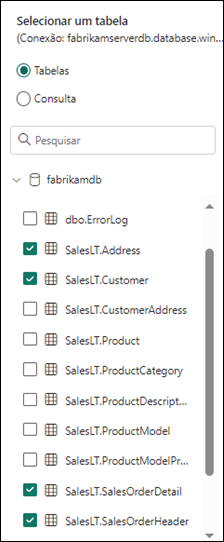
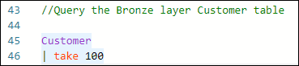
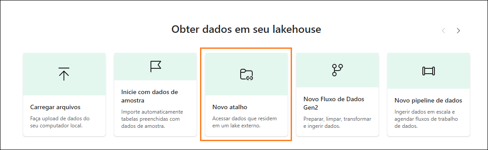

# Microsoft Fabric Real-Time Intelligence in a Day Laboratório 4


# Sumário

- Estrutura do documento	
- Introdução	
- Estrutura Medallion nos Bancos de Dados KQL	
    - Tarefa 1: Criar tabelas Bronze	
    - Tarefa 2: Carregar tabelas Bronze usando um Pipeline de Dados	
    - Tarefa 3: Transformar tabelas na camada Silver	
    - Tarefa 4: Criar a Camada Gold com as Exibições Materializadas	
- Lakehouse do Fabric e Disponibilidade do OneLake	
    - Tarefa 5: Criar Lakehouse	
    - Tarefa 6: Atalho para tabelas do Banco de Dados KQL	
- Resumo	
- Referências	

 
# Estrutura do documento

O laboratório inclui etapas a serem seguidas pelo usuário juntamente com as capturas de tela associadas que fornecem auxílio visual. Em cada captura de tela, as seções estão destacadas com caixas laranjas para indicar as áreas nas quais o usuário deve se concentrar.

# Introdução

Neste laboratório, você criará uma Estrutura Medallion usando a abordagem de camada Bronze, Silver, Gold para lidar com dados em seus diferentes estágios de desenvolvimento e usá-la em análise. Em seguida, você conectará os dados do seu Banco de Dados KQL em um Lakehouse para mostrar a rapidez com que você pode compartilhar seus dados em tempo real com aqueles em sua organização que desejam usá-los para relatórios do Power BI.

Ao final deste laboratório, você terá aprendido a:

- Criar tabelas de Banco de Dados KQL com a Linguagem de Consulta Kusto.

- Carregar dados em Bancos de Dados KQL com pipelines do Data Factory.

- Criar exibições materializadas em Bancos de Dados KQL.

- Criar um Lakehouse e usar atalhos para o Banco de Dados KQL.


# Estrutura Medallion nos Bancos de Dados KQL

## Tarefa 1: Criar tabelas Bronze

1. Abra o **espaço de trabalho do Fabric** para o curso e abra o Conjunto de Consultas KQL que você criou no último laboratório **Criar Tabelas**.

    

2. Nesse Conjunto de Consultas KQL, vamos renomear a guia original que temos aqui de “eh_Fabrikam” para “Create External Table”, facilitando a organização e compreensão do que temos nesse Conjunto de Consultas.

    
 
3. Agora, vamos criar uma nova guia selecionando o ícone “+” e atribuir o nome “Broze Layer” para a nova guia.

    

4. Nessa nova guia, copie e realce o código a seguir e selecione “Executar” para criar quatro novas tabelas que servirão como sua Camada Bronze da Estrutura Medallion.

```
//BRONZE LAYER
.execute database script <|

.create table [Address] (AddressID:int,AddressLine1:string,AddressLine2:string,City: string, StateProvince:string, CountryRegion:string, PostalCode: string, rowguid: guid, ModifiedDate:datetime)
.create table [Customer](CustomerID:int, NameStyle: string, Title: string, FirstName: string, MiddleName: string, LastName: string,Suffix:string, CompanyName: string, SalesPerson: string, EmailAddress: string, Phone: string, ModifiedDate: datetime)
.create table [SalesOrderHeader](SalesOrderID: int, OrderDate: datetime, DueDate: datetime, ShipDate: datetime, ShipToAddressID: int, BillToAddressID: int, SubTotal: decimal, TaxAmt: decimal, Freight: decimal, TotalDue: decimal, ModifiedDate: datetime)
.create table [SalesOrderDetail](SalesOrderID: int, SalesOrderDetailID: int, OrderQty: int, ProductID: int, UnitPrice: decimal , UnitPriceDiscount: decimal,LineTotal: decimal, ModifiedDate: datetime)
```


5. Depois que isso for executado, você deverá ver imediatamente quatro novas tabelas criadas no Pesquisador de Objetos de Banco de Dados.

    - Address
    - Customer
    - SalesOrderDetail
    - SalesOrderHeader


6. Expanda a **tabela Address** clicando no ícone “>” ao lado do nome.

    

7. Isso mostra o esquema (nomes de coluna e tipos de dados) para a tabela. Uma coisa que será útil adicionar a essa tabela no Banco de Dados KQL seria uma coluna oculta ao tempo de ingestão que será usada posteriormente na arquitetura Medallion. Vamos adicionar isso agora. Copie e cole o script abaixo para alterar as tabelas que você acabou de criar adicionando uma coluna de tempo de ingestão.

```

//adds a hidden field showing ingestion time
.execute database script <|
.alter table Address policy ingestiontime true
.alter table Customer policy ingestiontime true
.alter table SalesOrderHeader policy ingestiontime true
.alter table SalesOrderDetail policy ingestiontime true
```


8. As quatro novas tabelas são tabelas em branco com seu esquema definido. Agora você precisa de uma maneira de carregar corretamente essas tabelas. Volte ao seu espaço de trabalho **RTI_username**.

## Tarefa 2: Carregar tabelas Bronze usando um Pipeline de Dados

1. No espaço de trabalho, selecione a opção **“+ Novo Item”** para abrir o painel de seleção. Em seguida, localize e selecione a opção chamada **Data pipeline**.

    
 
2. Dê ao novo pipeline o nome **Load KQL Database Bronze Layer**.

    

3. Clique em **Criar**.

4. Quando o menu do pipeline aparecer, clique na opção **Assistente de cópia de dados**.

    

5. Para começar, você precisará criar uma conexão com o banco de dados de origem de onde deseja extrair os dados. Clique na opção **Banco de dados SQL do Azure** em “Novas fontes”. Se não o vir imediatamente, você poderá usar a barra de pesquisa na parte superior para filtrar fontes. Nós nos conectaremos ao mesmo banco de dados SQL do Azure externo do laboratório anterior, mas nos conectaremos a tabelas diferentes.

    

6. Você precisará inserir os detalhes de conexão do banco de dados. Siga usando as informações em seu ambiente ou como abaixo.

    - fabrikamdemo.database.windows.net
    - fabrikamdb
    - demouser
    - fabrikam@123456
 
7. Clique em **Avançar** quando tudo tiver sido preenchido.

8. Na lista de tabelas disponíveis, selecione o seguinte:

    - SalesLT.Address
    - SalesLT.Customer
    - SalesLT.SalesOrderDetail
    - SalesLT.SalesOrderHeader

    

9. Clique em **Avançar**.

10.	Agora será necessário configurar o destino para determinar para onde você deseja que o pipeline envie os dados. Localize o **Hub de dados do OneLake** e selecione seu Banco de Dados KQL,
**eh_Fabrikam**.

    

11.	Se você for solicitado a entrar, basta usar as credenciais fornecidas na página de detalhes do ambiente.
 
12.	Clique na tabela **SalesLT.Address** se ainda não estiver selecionada e, em seguida, clique na lista suspensa ao lado da opção **Table**. Clique na opção de tabela **Address**.

    

13.	Agora, você terá uma visão geral dos **Mapeamentos de coluna**. Isso permitirá que você visualize todos os campos provenientes do banco de dados de origem que você está enviando para o seu Banco de Dados KQL. Você tem a opção de remover campos específicos se não quiser que eles sejam mapeados desde a fonte.

    

14.	Siga as mesmas etapas da Etapa 11-12 para as tabelas **SalesLT.Customer, SaleLT.SalesOrderDetail** e S**alesLT.SalesOrderHeader**. Nenhum mapeamento de coluna precisará ser executado e, portanto, basta fazer a correspondência dos nomes das tabelas. Depois que todas as tabelas estiverem devidamente mapeadas, clique em **Avançar**.
 
15.	A página final usando o Assistente de cópia de dados é uma página de visão geral para verificar todas as configurações selecionadas. Certifique-se de que o número de origem de tabelas e o número de destino de tabelas sejam iguais.

    

16.	Clique em **Salvar + Executar**.

17.	Depois de alguns instantes, aparecerá uma janela de submenu com um **Parâmetro**. O assistente para cópia que acabamos de concluir criou uma lista das tabelas para iterar e carregar nas tabelas KQL. Basta clicar no botão **OK** para executar o pipeline como ele está configurado atualmente desde o Assistente de cópia de dados.

    

18.	Deixe o pipeline ser executado e, após aproximadamente um minuto, a movimentação de dados deverá ser concluída. Depois de ver que todas as atividades dentro do pipeline foram **Bem-sucedidas**, você terá transferido os dados.

    
 
19.	Vamos conferir uma de nossas tabelas e verificar os dados. Navegue de volta para o Conjunto de Consultas KQL que temos usado, chamado **Criar Tabelas** e verifique se você está na guia **Camada Bronze** e execute o script a seguir.

```
//Query the Bronze layer Customer table 

Customer
| take 100
```


20.	Você deve ver alguns dados como a imagem abaixo, mas ela pode não ser exata.

    

## Tarefa 3: Transformar tabelas na camada Silver

1. Agora que as tabelas Bronze estão carregadas, criaremos uma nova guia em nosso Conjunto de Dados KQL chamada “Silver Layer”.

    

2. Execute o seguinte script KQL na guia “Silver Layer” para criar quatro tabelas que servirão como a Camada Silver da Estrutura Medallion.
 
```
//SILVER LAYER

.execute database script <|

.create table [SilverAddress] (AddressID:int,AddressLine1:string,AddressLine2:string,City: string, StateProvince:string, CountryRegion:string, PostalCode: string, rowguid: guid, ModifiedDate:datetime, IngestionDate: datetime)

.create table [SilverCustomer](CustomerID:int, NameStyle: string, Title: string, FirstName: string, MiddleName: string, LastName: string,Suffix:string, CompanyName: string, SalesPerson: string, EmailAddress: string, Phone: string, ModifiedDate: datetime, IngestionDate: datetime)

.create table [SilverSalesOrderHeader](SalesOrderID: int, OrderDate: datetime, DueDate: datetime, ShipDate: datetime, ShipToAddressID: int, BillToAddressID: int, SubTotal: decimal, TaxAmt: decimal, Freight: decimal, TotalDue: decimal, ModifiedDate: datetime, DaysShipped: long, IngestionDate: datetime)

.create table [SilverSalesOrderDetail](SalesOrderID: int, SalesOrderDetailID: int, OrderQty: int, ProductID: int, UnitPrice: decimal, UnitPriceDiscount: decimal,LineTotal: decimal, ModifiedDate: datetime, IngestionDate: datetime)
```

3. Execute esse script realçando o novo script e clicando em **Executar**.

    

4. Depois que esse script for executado, você verá quatro novas tabelas adicionadas ao menu de tabelas do Banco de Dados KQL.

    
 
5. Agora que as tabelas foram criadas, você precisa carregar dados nelas. Você criará uma política de atualização para transformar os dados e movê-los quando eles forem ingeridos na camada bronze. Copie e cole o script a seguir e **Execute** o código.
 
``` 
// use update policies to transform data during Ingestion

.execute database script <|

.create function ifnotexists with (docstring = 'Add ingestion time to raw data') ParseAddress (){ Address
| extend IngestionDate = ingestion_time()
}

.alter table SilverAddress policy update @'[{"Source": "Address", "Query": "ParseAddress", "IsEnabled" : true, "IsTransactional": true }]'

.create function ifnotexists with (docstring = 'Add ingestion time to raw data') ParseCustomer (){ Customer
| extend IngestionDate = ingestion_time()
}

.alter table SilverCustomer policy update @'[{"Source": "Customer", "Query": "ParseCustomer", "IsEnabled" : true, "IsTransactional": true }]'

.create function ifnotexists with (docstring = 'Add ingestion time to raw data') ParseSalesOrderHeader (){ SalesOrderHeader
| extend DaysShipped = datetime_diff('day', ShipDate, OrderDate)
| extend IngestionDate = ingestion_time()
}

.alter table SilverSalesOrderHeader policy update @'[{"Source": "SalesOrderHeader", "Query": "ParseSalesOrderHeader", "IsEnabled" : true, "IsTransactional": true }]'

.create function ifnotexists with (docstring = 'Add ingestion time to raw data') ParseSalesOrderDetail () { SalesOrderDetail
| extend IngestionDate = ingestion_time()
}

.alter table SilverSalesOrderDetail policy update @'[{"Source": "SalesOrderDetail", "Query": "ParseSalesOrderDetail", "IsEnabled" : true, "IsTransactional": true }]'
```

6. Embora você veja resultados da execução da consulta, a melhor evidência de que sua consulta foi concluída é que você verá uma nova pasta expansível no painel Objetos de banco de dados. Clique no **ícone >** ao lado da pasta **Functions**. Essas funções permitirão que os dados carregados na camada Bronze do Banco de Dados KQL sejam espelhados, transformados e carregados na camada Silver.

    

7. Agora vamos simular esse processo, você executará o pipeline criado anteriormente neste laboratório outra vez. Volte para o pipeline **Load KQL Database** agora.

    
 
8. Basta clicar no botão **Executar** dentro da **faixa de opções Página Inicial** para executar o pipeline novamente e carregar os dados na camada Bronze, onde eles serão transformados pelas funções que você criou e carregou nas tabelas Silver.

    

9. Clique em **OK** neste submenu para executar o pipeline com os mesmos parâmetros anteriores.

    

10.	Novamente, aguarde aproximadamente um minuto para que o pipeline conclua sua carga e, quando todos os itens no menu Saída indicarem **Êxito**, passe para a próxima etapa.

    
 
11.	Depois que o pipeline de dados tiver sido concluído, valide os resultados no Banco de Dados KQL. Retorne ao Conjunto de Consultas KQL **Criar Tabelas** e navegue até a guia **Camada Silver**.
 
12.	Em uma nova linha, consulte a tabela SilverAddress escrevendo a consulta a seguir e executando o código.

```
SilverAddress
| take 100
```


13.	Observe nos resultados que a tabela **SilverAddress** tem uma coluna adicional, **IngestionDate**, que não está fisicamente presente na tabela **Endereço**.

    

## Tarefa 4: Criar a Camada Gold com as Exibições Materializadas

Agora que tem sua camada de dados transformada dentro da camada Silver, você poderá começar a executar análises com dados confiáveis, validados e enriquecidos dentro de um relatório do Power BI, Conjunto de Dados RTI ou simplesmente criando algumas consultas KQL. No entanto, há momentos em que você acha necessário agregar seus dados para torná-los mais consumíveis pelos usuários finais. Vamos ver como isso é feito em um Banco de Dados KQL.

1. Se ainda não estiver, abra o Conjunto de Dados KQL **Criar Tabelas** e crie uma guia chamada “Gold Layer”.

    

2. Cole no conjunto de consultas o código a seguir para criar uma exibição materializada.

```
//GOLD LAYER
// use materialized views to view the latest changes in the SilverAddress table
.create materialized-view with (backfill=true) GoldAddress on table SilverAddress
{
SilverAddress
| summarize arg_max(IngestionDate, *) by AddressID
}
```

3. Depois que o código tiver sido colado, realce o código e execute-o clicando no botão **Run**.

    

4. Você verá uma saída nos resultados da consulta detalhando informações sobre como essa exibição materializada foi criada.

    
 
5. Você também verá que outra pasta foi criada no pesquisador de objetos do Banco de Dados KQL. Expanda a pasta **Materialized View** e você encontrará sua exibição **GoldAddress**.

    

6. Na janela de consulta, execute o código a seguir para consultar a nova exibição materializada.

```
GoldAddress
| take 1000
```


7. Essa consulta retornará a linha com a **IngestionDate** mais recente para cada **AddressID** exclusiva na tabela **SilverAddress**.

8. Agora cole e execute as consultas a seguir para criar mais exibições materializadas camada Gold para as outras tabelas.

``` 
//Create additional Gold Materialized Views
.execute database script <|

.create materialized-view with (backfill=true) GoldCustomer on table SilverCustomer
{
SilverCustomer
| summarize arg_max(IngestionDate, *) by CustomerID
}

.create materialized-view with (backfill=true) GoldSalesOrderHeader on table SilverSalesOrderHeader
{
SilverSalesOrderHeader
| summarize arg_max(IngestionDate, *) by SalesOrderID
}

.create materialized-view with (backfill=true) GoldSalesOrderDetail on table SilverSalesOrderDetail
{
SilverSalesOrderDetail
| summarize arg_max(IngestionDate, *) by SalesOrderDetailID
}

.create async materialized-view with (backfill=true) GoldDailyClicks on table Clicks
{
Clicks
| extend dateOnly = substring(tostring(todatetime(eventDate)), 0, 10)
| summarize count() by dateOnly
}

.create async materialized-view with (backfill=true) GoldDailyImpressions on table Impressions
{
Impressions
| extend dateOnly = substring(tostring(todatetime(eventDate)), 0, 10)
| summarize count() by dateOnly
}
```

9. Agora você deve ter seis exibições materializadas em seu Banco de Dados KQL.

    

10.	Agora, você criou com êxito uma Estrutura Medallion em um Banco de Dados KQL. Embora esses dados sejam facilmente consumíveis, você terá usuários que nunca trabalharam com o Kusto
e preferem acessar os dados dessas tabelas por outro meio. Na próxima tarefa, você criará um Lakehouse. Em seguida, usando o recurso Disponibilidade do Onelake, que habilitamos no Laboratório 01, torne algumas das tabelas em nosso Banco de Dados KQL acessíveis por meio do Lakehouse usando atalhos
 
# Lakehouse do Fabric e Disponibilidade do OneLake

## Tarefa 5: Criar Lakehouse

1. Retorne para o seu workspace **RTI_username**.

2. Clique na opção **+ Novo Item** e depois selecione **Lakehouse** na lista de opções disponíveis.

    

3. Dê ao Lakehouse o nome **lh_Fabrikam** e clique em **Criar**. Não habilite a versão preliminar do recurso de esquemas do Lakehouse. 

    

## Tarefa 6: Atalho para tabelas do Banco de Dados KQL

Na interface do usuário do Lakehouse, você tem algumas opções de como você pode trazer dados de fluxo para o próprio Lakehouse. Uma opção mencionada anteriormente na aula é usar um Eventstream para carregar dados diretamente no Lakehouse desde o Hub de Eventos em vez do Banco de Dados KQL. Como já decidiu que os Bancos de Dados KQL deveriam ser utilizados para atender a metas e requisitos específicos, você não deseja copiar esses dados novamente. Em vez disso, vamos usar um **Atalho** para trazer esses dados do Banco de Dados KQL que já temos para que os usuários mais familiarizados com essa experiência possam ter acesso aos dados que temos usado no Banco de Dados KQL

1. Escolha a opção no menu que diz **Novo atalho**.

    

2. Select a opção **Microsoft OneLake** em **Fontes internas**.

    

3. No menu, selecione o Banco de Dados KQL **eh_Fabrikam** para trazer tabelas desse armazenamento para o Lakehouse sem duplicar ou copiar os dados.

    

4. Clique em **Avançar** na parte inferior do menu.

5. Abra as tabelas dentro de **eh_Fabrikam** clicando no **ícone >** e selecione as tabelas a seguir para exibi-las.

    - Clicks
    - Impressions
    - InternetSales

    

6. Essas tabelas podem ser muito úteis para qualquer usuário que esteja aproveitando os notebooks no Fabric. Esses dados poderão ser usados em experimentos da ciência de dados para treinar um modelo que prevê em quais vínculos os usuários provavelmente podem estar interessados.

7. Clique em **Avançar**.
 
8. Uma última tela de validação será exibida. Quando estiver satisfeito(a) com sua seleção, clique no botão **Criar** na parte inferior da tela.

    

9. Agora, você verá que todas as tabelas que você selecionou do Banco de Dados KQL apareceram no Lakehouse.

    

10.	Clique na tabela chamada **Clicks**.

    
 
11.	Você pode ver uma amostra dos registros dessa tabela que apareceram na interface do usuário.

    > **Observação: Pode levar algumas horas para os dados serem exibidos no OneLake (https://learn.microsoft.com/en-us/fabric/real-time-intelligence/event-house-onelake- availability)**

# Resumo

Neste laboratório, os usuários criaram uma Estrutura Medallion dentro de um banco de dados Linguagem de Consulta Kusto (KQL). Os usuários ingeriram dados brutos na camada Bronze da arquitetura medallion usando um pipeline de dados. Eles transformaram esses dados e os carregaram na camada Silver para processamento e refinamento posteriores. Por fim, os usuários agregaram e otimizaram os dados para análise no camada Gold usando Exibições Materializadas.

Depois de criar a estrutura medallion, os usuários empregaram atalhos do Microsoft Fabric para vincular os dados do Banco de Dados KQL a um Lakehouse. Essa integração permitiu acesso e análise contínuos de dados em ambos os ambientes. O laboratório terminou com os usuários verificando a vinculação de dados e realizando consultas básicas para garantir a funcionalidade da estrutura.

# Referências

O Fabric Real-Time Intelligence in a Day (RTIIAD) apresenta algumas das principais funções disponíveis no Microsoft Fabric. No menu do serviço, a seção Ajuda (?) tem links para ótimos recursos.


 
Veja aqui mais alguns recursos que ajudarão você com as próximas etapas do Microsoft Fabric.

- Veja a postagem do blog para ler o anúncio completo da [GA do Microsof t Fabric](https://aka.ms/Fabric-Hero-Blog-Ignite23)

- Explore o Fabric por meio do [Tour Guiado](https://aka.ms/Fabric-GuidedTour)

- Inscreva-se na [avaliação gratuita do Microsoft Fabric](https://aka.ms/try-fabric)

- Visite [o site do Microsoft Fabric](https://aka.ms/microsoft-fabric)

- Aprenda novas habilidades explorando os [módulos de Aprendizagem do Fabric](https://aka.ms/learn-fabric)

- Explore a [documentação técnica do Fabric](https://aka.ms/fabric-docs)

- Leia o livro eletrônico [gratuito sobre como começar a usar o Fabric](https://aka.ms/fabric-get-started-ebook)

- Participe da [comunidade do Fabric](https://aka.ms/fabric-community) para postar suas perguntas, compartilhar seus comentários e aprender com outras pessoas 

Leia os blogs de comunicados de experiências do Fabric em mais detalhes:

- [Experiência do Data Factory no blog do Fabric](https://aka.ms/Fabric-Data-Factory-Blog)

- [Experiência do Synapse Data Engineering no blog do Fabric](https://aka.ms/Fabric-DE-Blog)

- [Experiência do Synapse Data Science no blog do Fabric](https://aka.ms/Fabric-DS-Blog)

- [Experiência do Synapse Data Warehousing no blog do Fabric](https://aka.ms/Fabric-DW-Blog)

- [Experiência do Real-Time Intelligence no blog do Fabric](https://blog.fabric.microsoft.com/en-us/blog/category/real-time-intelligence)

- [Blog de anúncio do Power BI](https://aka.ms/Fabric-PBI-Blog)

- [Experiência do Data Activator no blog do Fabric](https://aka.ms/Fabric-DA-Blog)

- [Administração e governança no blog do Fabric](https://aka.ms/Fabric-Admin-Gov-Blog)

- [OneLake no blog do Fabric](https://aka.ms/Fabric-OneLake-Blog)

- [Blog de integração do Dataverse e Microsoft Fabric](https://aka.ms/Dataverse-Fabric-Blog)


© 2024 Microsoft Corporation. Todos os direitos reservados.

Ao usar esta demonstração/este laboratório, você concorda com os seguintes termos:

A tecnologia/funcionalidade descrita nesta demonstração/neste laboratório é fornecida pela Microsoft Corporation para obter seus comentários e oferecer uma experiência de aprendizado.
Você pode usar a demonstração/o laboratório somente para avaliar tais funcionalidades e recursos de tecnologia e fornecer comentários à Microsoft. Você não pode usá-los para nenhuma outra finalidade. Você não pode modificar, copiar, distribuir, transmitir, exibir, executar, reproduzir, publicar, licenciar, criar obras derivadas, transferir nem vender esta demonstração/este laboratório ou qualquer parte deles.

A CÓPIA OU A REPRODUÇÃO DA DEMONSTRAÇÃO/DO LABORATÓRIO (OU DE QUALQUER PARTE DELES) EM QUALQUER OUTRO SERVIDOR OU LOCAL PARA REPRODUÇÃO OU REDISTRIBUIÇÃO ADICIONAL É EXPRESSAMENTE PROIBIDA.

ESTA DEMONSTRAÇÃO/LABORATÓRIO FORNECE DETERMINADAS TECNOLOGIAS DE
SOFTWARE/RECURSOS E FUNCIONALIDADE DO PRODUTO, INCLUINDO POTENCIAIS NOVOS RECURSOS E CONCEITOS, EM UM AMBIENTE SIMULADO SEM CONFIGURAÇÃO OU INSTALAÇÃO COMPLEXA PARA A FINALIDADE DESCRITA ACIMA. A TECNOLOGIA/CONCEITOS REPRESENTADOS NESTA DEMONSTRAÇÃO/LABORATÓRIO PODEM NÃO REPRESENTAR A FUNCIONALIDADE
COMPLETA DO RECURSO E PODE NÃO FUNCIONAR DA MESMA FORMA DO QUE UMA VERSÃO FINAL. NÓS TAMBÉM PODEMOS NÃO LANÇAR UMA VERSÃO FINAL DE TAIS RECURSOS OU CONCEITOS. SUA EXPERIÊNCIA COM O USO DE TAIS RECURSOS E FUNCIONALIDADES EM UM AMBIENTE FÍSICO TAMBÉM PODEM SER DIFERENTE.
 
**COMENTÁRIOS**. Caso você forneça comentários sobre os recursos de tecnologia, as funcionalidades e/ou os conceitos descritos nesta demonstração/neste laboratório à Microsoft, você concederá à Microsoft, sem encargos, o direito de usar, compartilhar e comercializar seus comentários de qualquer forma e para qualquer finalidade. Você também concede a terceiros, sem encargos, quaisquer direitos de patente necessários para que seus produtos, suas tecnologias e seus serviços usem ou interajam com partes específicas de um software ou um serviço da Microsoft que inclua os comentários. Você não fornecerá comentários que estejam
sujeitos a uma licença que exija que a Microsoft licencie seu software ou sua documentação para terceiros em virtude da inclusão de seus comentários neles. Esses direitos continuarão em vigor após o término do contrato.

A MICROSOFT CORPORATION SE ISENTA DE TODAS AS GARANTIAS E CONDIÇÕES COM RELAÇÃO A DEMONSTRAÇÃO/LABORATÓRIO, INCLUINDO TODAS AS GARANTIAS E CONDIÇÕES DE COMERCIALIZAÇÃO, SEJAM EXPRESSAS, IMPLÍCITAS OU ESTATUTÁRIAS, ADEQUAÇÃO A UM DETERMINADO FIM, TÍTULO E NÃO VIOLAÇÃO. A MICROSOFT NÃO DECLARA NEM GARANTE A PRECISÃO DOS RESULTADOS DERIVADOS DO USO DA DEMONSTRAÇÃO/DO LABORATÓRIO NEM A ADEQUAÇÃO DAS INFORMAÇÕES CONTIDAS NA DEMONSTRAÇÃO/NO LABORATÓRIO A QUALQUER FINALIDADE.

# AVISO DE ISENÇÃO DE RESPONSABILIDADE

Esta demonstração/este laboratório contém apenas uma parte dos novos recursos e aprimoramentos do Microsoft Power BI. Alguns dos recursos podem ser alterados em versões futuras do produto. Nesta demonstração/neste laboratório, você aprenderá sobre alguns dos novos recursos, mas não todos.
