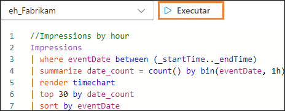
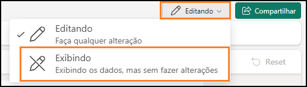

# Microsoft Fabric Real-Time Intelligence in a Day Laboratório 5

# Sumário

- Estrutura do documento	
- Introdução	
- Dashboards em Tempo Real	
    - Tarefa 1: Criar um Dashboard em Tempo Real	
    - Tarefa 2: Conectar uma fonte de dados ao Dashboard em Tempo Real	
    - Tarefa 3: Criar um bloco do Dashboard em Tempo Real com KQL	
    - Tarefa 4: Adicionar mais blocos de dashboard ao Dashboard em Tempo Real	
    - Tarefa 5: Adicionar o Visual Mapa para Impressões por - Localização	
    - Tarefa 6: Configurar a Atualização Automática no Dashboard em Tempo Real	
    - Tarefa 7 opcional: Adicionar o logotipo da empresa	
    - Tarefa 8 opcional: Aplicar a formatação condicional ao visual	
- Resumo	
- Referências	

 
# Estrutura do documento

O laboratório inclui etapas a serem seguidas pelo usuário juntamente com as capturas de tela associadas que fornecem auxílio visual. Em cada captura de tela, as seções estão destacadas com caixas laranjas para indicar as áreas nas quais o usuário deve se concentrar.

# Introdução

Neste laboratório, você usará os dados transmitidos e carregados em seu Banco de Dados KQL e vinculado sucintamente a um Lakehouse usando atalhos para criar um Dashboard em Tempo Real para visualizar e compartilhar seus insights a partir dos fluxos de dados que você acessou.

Ao final deste laboratório, você terá aprendido a:

- Criar um Dashboard em Tempo Real no Fabric.

- Usar o KQL para escrever consultas para preencher elementos visuais em um dashboard.

- Adicionar a formatação condicional aos visuais do dashboard.

# Dashboards em Tempo Real

## Tarefa 1: Criar um Dashboard em Tempo Real

1. Abra o **espaço de trabalho do Fabric** para o curso. 

    

2. Clique no botão **+ Novo Item** para criar um item.

    

3. Você verá uma categoria para **Visualizar os dados**. Clique no item chamado **Painel em Tempo Real**.

    

4. Dê ao seu Dashboard em Tempo Real o nome **RTI Dashboard** e clique em **Criar**.

    

5. Você deve ser levado imediatamente para uma instância em branco de um Dashboard em Tempo Real.

    
 
## Tarefa 2: Conectar uma fonte de dados ao Dashboard em Tempo Real

1. Na faixa de opções Página Inicial, localize a opção chamada **New data source** e clique nela.

    

2. No painel suspenso que aparece no lado direito da tela, clique em **Adicionar +** e escolha **OneLake data hub**.

    

3. Uma lista de fontes disponíveis em seu OneLake aparecerá, apenas fontes de Bancos de Dados KQL serão listadas, então uma opção estará disponível para você, o Banco de Dados KQL **eh_Fabrikam**. Selecione essa opção.

    

4. Na parte inferior da tela, clique em **Connect**.

    
 
5. Agora você poderá criar a fonte de dados. Clique no botão **Adicionar** na parte inferior do painel do submenu.

    

6. Agora você verá que uma fonte de dados foi adicionada ao Dashboard em Tempo Real. A partir daqui, você poderá adicionar outros Bancos de Dados KQL, se necessário. Por enquanto, clique em **Fechar** na parte inferior da janela.

    
 
## Tarefa 3: Criar um bloco do Dashboard em Tempo Real com KQL

1. Clique no bloco em branco no dashboard para preenchê-lo com um visual.

    

2. Por padrão, você se conectará ao Banco de Dados KQL criado anteriormente como sua fonte. A partir daqui, você pode escrever sua própria consulta KQL para preencher esse visual com dados. Exclua todas as marcações anteriores do KQL que estiverem ali por padrão. Copie e cole a consulta a seguir na janela da consulta.

    ```
    //Clicks by hour Clicks
    | where eventDate between (_startTime.._endTime)
    | summarize date_count = count() by bin(eventDate, 1h)
    | render timechart
    | top 30 by date_count
    | sort by eventDate
    ```

3. Execute a consulta depois de configurá-la corretamente para ver os resultados.

    

4. Observe que você pode ter apenas um resultado em sua saída. Isso ocorre devido ao **Período** definido por padrão para este bloco. Você tem um parâmetro com o qual pode alterar o período do qual você está retornando dados. O eventDate between (_startTime.._endTime) é o que permite que você aproveite esse parâmetro. Modifique o parâmetro **Período** para **Últimos 3 horas** e observe como sua saída muda.

    

5. Agora você deve ver na saída da consulta os resultados dos cliques na janela das últimas 3 horas.

    

6. Embora esse parâmetro possa ser modificado, você pode desejar que ele seja padronizado para um intervalo de tempo específico em vez de forçar os usuários a modificá-lo. Acima da opção de intervalo de tempo, clique na opção **@ Parâmetros**.

    
 
7. Clique no **ícone de lápis** para editar o parâmetro **Período**.

    

8. Altere o **Valor padrão** para **Últimos 24 horas** para sempre mostrar o último dia por padrão. Clique em **Concluído** quando tiver terminado.

    

9. Feche o painel de parâmetros.

10. Agora clique no botão **+ Adicionar imagem** acima dos resultados da consulta.

    

11. Um novo submenu aparecerá no lado direito da tela. Clique na caixa de texto abaixo da opção **Tile name** para dar a esse visual o nome **Clicks by Hour**.

    

12. Por padrão, o visual que você está usando para exibir os resultados dessa consulta KQL é uma tabela. Essa pode não ser a melhor maneira de alguém consumir e compreender rapidamente o que está acontecendo com os resultados de seus dados. Altere o tipo de elemento visual de uma tabela para um **Area chart**.

    
 
13. Com esse visual recém-formatado, você poderá entender melhor os picos e vales de Cliques do seu site de comércio eletrônico usando o fluxo de dados criado anteriormente nesta classe.

    

14. Para salvar esse visual no Dashboard, clique no botão **as alterações** no canto superior direito da tela.

    

15. Depois que esse visual for colocado dentro do Dashboard, pode ser que o visual esteja mostrando apenas a última hora de resultados. Modifique o Dashboard para mostrar o **Período** de **Últimos 24 horas**.

    
 
16. Atualize o visual e observe que os resultados serão ligeiramente alterados para refletir os dados que entraram desde a última execução da consulta.

    

## Tarefa 4: Adicionar mais blocos de dashboard ao Dashboard em Tempo Real

1. Na **faixa de opções Página Inicial**, no Dashboard em Tempo Real, clique no botão **New tile**.

    

2. Insira a consulta KQL a seguir no painel de consulta.

    ```
    //Impressions by hour Impressions
    | where eventDate between (_startTime.._endTime)
    | summarize date_count = count() by bin(eventDate, 1h)
    | render timechart
    | top 30 by date_count
    | sort by eventDate
    ```

3. **Execute** a consulta.

    

4. Clique no botão **+Adicionar imagem**.

    
 
5. Edite o visual para alterar o **Tile name** para **Impressions by Hour** e o **Visual Type** para **Area chart**.

    

6. Aplique as alterações ao visual.

    

7. Adicione outro **New tile**.

    

8. Copie e cole a consulta a seguir no painel da consulta. Observe que esta é uma consulta de várias instruções que usa várias instruções let e uma consulta combinada por pontos-e-vírgulas.

   ```
   //Clicks, Impressions, CTR


   let imp = Impressions
   | where eventDate between (_startTime.._endTime)
   | extend dateOnly = substring(todatetime(eventDate).tostring(), 0, 10)
   | summarize imp_count = count() by dateOnly;


   let clck = Clicks
   | where eventDate between (_startTime.._endTime)
   | extend dateOnly = substring(todatetime(eventDate).tostring(), 0, 10)
   | summarize clck_count = count() by dateOnly;


   imp
   | join clck on $left.dateOnly == $right.dateOnly
   | project selected_date = dateOnly , impressions = imp_count , clicks = clck_count, CTR = clck_count * 100 / imp_count
   ```

9. **Execute** a consulta para exibir os resultados.

    
 
10.	Clique no botão **+Adicionar imagem**.

11. Quando as configurações visuais aparecerem, modifique as configurações a seguir para criar uma contagem de impressões.

    - **Tile name**- Impressions
    - **Visual type** - Stat
    - **Value column** - impressions (long)

      

12.	Escolha **Aplicar as alterações** quando todas as configurações tiverem sido definidas adequadamente.

    
 
13.	No novo bloco, clique nas reticências (...) e selecione a opção **Bloco duplicado**.

    


14.	Clique no **ícone de lápis** do bloco duplicado para editar as configurações.

    

15.	Renomeie esse **Tile name** para **Clicks** e altere a **Value column** para **clicks (long)**.

    

16.	Aplique as alterações a esse visual.

17.	Duplique qualquer um dos novos blocos mais uma vez para criar um visual de estatística final.

    

18.	Edite o novo bloco para alterar o **Tile name** para **Click Through Rate** e a **Value column** para **CTR long**.

    

19.	Aplique as alterações.

20.	Se os blocos estiverem separados ou se quiser reorganizá-los, você poderá passar o mouse sobre o bloco até que um ícone de mão apareça e arraste e solte o visual onde desejar.

    

## Tarefa 5: Adicionar o Visual Mapa para Impressões por Localização

1. Adicione um **New tile** ao Dashboard em Tempo Real.

    

2. Copie e cole a consulta a seguir no painel da consulta. Essa consulta extrai a latitude e a longitude da coluna Endereço IP desse fluxo de dados para gerar um local que você pode plotar em um mapa. Essa consulta pode levar um pouco mais de tempo do que as anteriores.

    ``` 
    //Impressions by location

    Impressions
    | where eventDate between (_startTime.._endTime)
    | join external_table('products') on $left.productId == $right.ProductID
    | project lon = toreal(geo_info_from_ip_address(ip_address).longitude), lat = toreal(geo_info_from_ip_address(ip_address).latitude), Name
    | render scatterchart with (kind = map) //, xcolumn=lon, ycolumns=lat)
    ```

3. Execute a consulta para validar se ela está configurada corretamente. Clique no botão **+ Adicionar imagem**.

    

4. Altere o **Tile name** para **Impressions by Location** e o **Visual type** para **Map**.

    
 
5. Na área **Visual type**, certifique-se de que a latitude e a longitude tenham sido selecionadas adequadamente modificando a opção **Defina o local por** para **Latitude e longitude**e verifique se os campos restantes correspondem à imagem abaixo.

    

6. Aplique as alterações.

7. Pegue o ponto de âncora no canto inferior esquerdo do visual do mapa no Dashboard para aumentar o tamanho do visual.

    
 
8. Todos os visuais são redimensionáveis e móveis. Sinta-se à vontade para reorganizar o seu como desejar.

    

9. Salve suas alterações.

    

## Tarefa 6: Configurar a Atualização Automática no Dashboard em Tempo Real

1. Clique em **na faixa de opções** e selecione a opção **Atualização automática**.

    

2. Ative a alternância para habilitar a **Atualização automática**.

    
 
3. Modifique o **Intervalo de tempo mínimo** para 30 segundos e a **Taxa de atualização padrão** para 1 minuto.

    

4. Clique em **Aplicar** na parte inferior da janela.

5. No canto superior direito do seu menu, clique no **botão Editando** e modifique-o para **Exibindo** para ver o que seus usuários finais experimentarão com este Dashboard em Tempo Real.

    

6. Se o tempo permitir e você estiver interessado em recuperar um logotipo da empresa ou aplicar formatação condicional aos seus visuais, conforme mostrado abaixo, sinta-se à vontade para
trabalhar com as tarefas opcionais a seguir. Caso contrário, o laboratório foi concluído!

    

## Tarefa 7 opcional: Adicionar o logotipo da empresa

1. Assim como fizemos antes, mude do modo **Exibindo** do dashboard para o modo **Editando**.

    

2. Clique no botão na faixa de opções Página Inicial chamado **New text tile**.

    

3. Copie e cole o código de marcação a seguir na janela da consulta.

    ```
    
    ```

    

4. Aplique as alterações.

5. Redimensione e mova o bloco para caber em algum lugar no Dashboard em Tempo Real.

    
 
6. Salve suas alterações.

    

## Tarefa 8 opcional: Aplicar a formatação condicional ao visual

1. Clique no **ícone de lápis** no visual **Click Through Rate**.

    

2. Na parte inferior do painel de formatação visual, clique no botão **+ Add rule** abaixo de **Formatação condicional**.

    
 
3. Clique no **ícone de lápis** para editar a regra de formatação condicional.

    
 
4. Modifique as condições da regra para apontar para a **Column** chamada **CTR long** e torne a regra > **10** para o operador e o valor.

    

5. Sinta-se à vontade para modificar a Formatação como desejar. Desde que o valor de CTR seja maior do que 10, ele aparecerá nesse visual.
    

6. Clique no botão **Salvar** no painel Formatação condicional.

    

7. Aplique as alterações.

8. Salve suas alterações.

      

# Resumo

Neste laboratório, os usuários criaram um Dashboard em Tempo Real e o conectaram ao nosso Banco de Dados KQL. Vimos que usamos a linguagem KQL para coletar consultas e, em seguida, pudemos visualizar os resultados de várias maneiras, com cada visual tendo sua própria configuração. Além disso, vimos como poderíamos modificar o parâmetro padrão disponível no dashboard e fazer com que o dashboard fosse atualizado automaticamente.
 
# Referências

O Fabric Real-Time Intelligence in a Day (RTIIAD) apresenta algumas das principais funções disponíveis no Microsoft Fabric. No menu do serviço, a seção Ajuda (?) tem links para ótimos recursos.


 
Veja aqui mais alguns recursos que ajudarão você com as próximas etapas do Microsoft Fabric.

- Veja a postagem do blog para ler o anúncio completo da [GA do Microsof t Fabric](https://aka.ms/Fabric-Hero-Blog-Ignite23)

- Explore o Fabric por meio do [Tour Guiado](https://aka.ms/Fabric-GuidedTour)

- Inscreva-se na [avaliação gratuita do Microsoft Fabric](https://aka.ms/try-fabric)

- Visite [o site do Microsoft Fabric](https://aka.ms/microsoft-fabric)

- Aprenda novas habilidades explorando os [módulos de Aprendizagem do Fabric](https://aka.ms/learn-fabric)

- Explore a [documentação técnica do Fabric](https://aka.ms/fabric-docs)

- Leia o livro eletrônico [gratuito sobre como começar a usar o Fabric](https://aka.ms/fabric-get-started-ebook)

- Participe da [comunidade do Fabric](https://aka.ms/fabric-community) para postar suas perguntas, compartilhar seus comentários e aprender com outras pessoas 

Leia os blogs de comunicados de experiências do Fabric em mais detalhes:

- [Experiência do Data Factory no blog do Fabric](https://aka.ms/Fabric-Data-Factory-Blog)

- [Experiência do Synapse Data Engineering no blog do Fabric](https://aka.ms/Fabric-DE-Blog)

- [Experiência do Synapse Data Science no blog do Fabric](https://aka.ms/Fabric-DS-Blog)

- [Experiência do Synapse Data Warehousing no blog do Fabric](https://aka.ms/Fabric-DW-Blog)

- [Experiência do Real-Time Intelligence no blog do Fabric](https://blog.fabric.microsoft.com/en-us/blog/category/real-time-intelligence)

- [Blog de anúncio do Power BI](https://aka.ms/Fabric-PBI-Blog)

- [Experiência do Data Activator no blog do Fabric](https://aka.ms/Fabric-DA-Blog)

- [Administração e governança no blog do Fabric](https://aka.ms/Fabric-Admin-Gov-Blog)

- [OneLake no blog do Fabric](https://aka.ms/Fabric-OneLake-Blog)

- [Blog de integração do Dataverse e Microsoft Fabric](https://aka.ms/Dataverse-Fabric-Blog)


© 2024 Microsoft Corporation. Todos os direitos reservados.

Ao usar esta demonstração/este laboratório, você concorda com os seguintes termos:

A tecnologia/funcionalidade descrita nesta demonstração/neste laboratório é fornecida pela Microsoft Corporation para obter seus comentários e oferecer uma experiência de aprendizado.
Você pode usar a demonstração/o laboratório somente para avaliar tais funcionalidades e recursos de tecnologia e fornecer comentários à Microsoft. Você não pode usá-los para nenhuma outra finalidade. Você não pode modificar, copiar, distribuir, transmitir, exibir, executar, reproduzir, publicar, licenciar, criar obras derivadas, transferir nem vender esta demonstração/este laboratório ou qualquer parte deles.

A CÓPIA OU A REPRODUÇÃO DA DEMONSTRAÇÃO/DO LABORATÓRIO (OU DE QUALQUER PARTE DELES) EM QUALQUER OUTRO SERVIDOR OU LOCAL PARA REPRODUÇÃO OU REDISTRIBUIÇÃO ADICIONAL É EXPRESSAMENTE PROIBIDA.

ESTA DEMONSTRAÇÃO/LABORATÓRIO FORNECE DETERMINADAS TECNOLOGIAS DE
SOFTWARE/RECURSOS E FUNCIONALIDADE DO PRODUTO, INCLUINDO POTENCIAIS NOVOS RECURSOS E CONCEITOS, EM UM AMBIENTE SIMULADO SEM CONFIGURAÇÃO OU INSTALAÇÃO COMPLEXA PARA A FINALIDADE DESCRITA ACIMA. A TECNOLOGIA/CONCEITOS REPRESENTADOS NESTA DEMONSTRAÇÃO/LABORATÓRIO PODEM NÃO REPRESENTAR A FUNCIONALIDADE
COMPLETA DO RECURSO E PODE NÃO FUNCIONAR DA MESMA FORMA DO QUE UMA VERSÃO FINAL. NÓS TAMBÉM PODEMOS NÃO LANÇAR UMA VERSÃO FINAL DE TAIS RECURSOS OU CONCEITOS. SUA EXPERIÊNCIA COM O USO DE TAIS RECURSOS E FUNCIONALIDADES EM UM AMBIENTE FÍSICO TAMBÉM PODEM SER DIFERENTE.
 
**COMENTÁRIOS**. Caso você forneça comentários sobre os recursos de tecnologia, as funcionalidades e/ou os conceitos descritos nesta demonstração/neste laboratório à Microsoft, você concederá à Microsoft, sem encargos, o direito de usar, compartilhar e comercializar seus comentários de qualquer forma e para qualquer finalidade. Você também concede a terceiros, sem encargos, quaisquer direitos de patente necessários para que seus produtos, suas tecnologias e seus serviços usem ou interajam com partes específicas de um software ou um serviço da Microsoft que inclua os comentários. Você não fornecerá comentários que estejam
sujeitos a uma licença que exija que a Microsoft licencie seu software ou sua documentação para terceiros em virtude da inclusão de seus comentários neles. Esses direitos continuarão em vigor após o término do contrato.

A MICROSOFT CORPORATION SE ISENTA DE TODAS AS GARANTIAS E CONDIÇÕES COM RELAÇÃO A DEMONSTRAÇÃO/LABORATÓRIO, INCLUINDO TODAS AS GARANTIAS E CONDIÇÕES DE COMERCIALIZAÇÃO, SEJAM EXPRESSAS, IMPLÍCITAS OU ESTATUTÁRIAS, ADEQUAÇÃO A UM DETERMINADO FIM, TÍTULO E NÃO VIOLAÇÃO. A MICROSOFT NÃO DECLARA NEM GARANTE A PRECISÃO DOS RESULTADOS DERIVADOS DO USO DA DEMONSTRAÇÃO/DO LABORATÓRIO NEM A ADEQUAÇÃO DAS INFORMAÇÕES CONTIDAS NA DEMONSTRAÇÃO/NO LABORATÓRIO A QUALQUER FINALIDADE.

# AVISO DE ISENÇÃO DE RESPONSABILIDADE

Esta demonstração/este laboratório contém apenas uma parte dos novos recursos e aprimoramentos do Microsoft Power BI. Alguns dos recursos podem ser alterados em versões futuras do produto. Nesta demonstração/neste laboratório, você aprenderá sobre alguns dos novos recursos, mas não todos.
