# Microsoft Fabric - Real-Time Intelligence in a Day

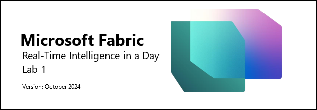

# Contents

- Document Structure
- Scenario / Problem Statement
- Introduction

- Fabric License
  - Task 1: Enable a Microsoft Fabric trial license

- Real-Time Intelligence and Real-Time Hub
  - Task 2: Real-Time Intelligence Experience Items
  - Task 3: Real-Time Hub

- Create Workspace and Eventhouse
  - Task 4: Create a Fabric Workspace
  - Task 5: Create an Eventhouse

- References

# Document Structure

The lab includes steps for the user to follow along with associated screenshots that provide visual aid. In each screenshot, sections are highlighted with orange boxes to indicate the area(s) user should focus on. 

# Scenario / Problem Statement

Fabrikam is an e-commerce company specializing in a wide range of outdoor equipment and accessories. The company caters to retail customers globally through its online platform and is planning to enhance its presence in new international markets. There is a new initiative that involves providing real-time insights from an e-commerce site to provide executives with the ability to make timely decisions based on current information.

As an Analytics Engineer on the Sales team, your responsibilities include collecting, cleaning, and interpreting data sets to solve business problems. You create and maintain batch data pipelines, develop visualizations like charts and graphs, build and optimize comprehensive semantic models and reports, and present your findings to decision-makers in the organization.

## Current Challenges

- You need to handle a continuous stream of real-time data from the e-commerce website, which requires a robust and scalable architecture.

- Ensuring real-time data processing and analytics to keep up with the fast-paced nature of online sales.

- Handling the volume and velocity of data generated by user interactions, transactions, and website activity.

- Integrating real-time streaming data with historical data for comprehensive analysis.

- Using the Medallion architecture in an Eventhouse environment to structure the data flow efficiently.

- Leveraging the Eventhouse Data within a Lakehouse

- You're interested in leveraging Microsoft Fabric to address the above challenges, using Eventhouse, KQL Database, and Eventstream to build a resilient and efficient data processing pipeline.

# Introduction

Today you will learn about various key features of Microsoft Fabric. This is an introductory workshop intended to introduce you to the various product experiences and items available in Fabric. By the end of this workshop, you will learn how to use an Eventhouse, Data Pipeline, Eventstream, KQL Queryset and a Real-Time Dashboard. 

By the end of this lab, you will have learned:  

- How to explore Fabric Personas
- How to create a Fabric workspace
- How to create an Eventhouse

# Fabric License

## Task 1: Enable a Microsoft Fabric trial license 

1. Open the **Microsoft Edge browser** on the desktop and navigate to `https://app.fabric.microsoft.com/`. You will be navigated to the login page.

   **Note**: If you are not using the lab environment and have an existing Power BI account, you may want to use the browser in private / incognito mode. 

   

 1. Enter the following email/username, and then click on **Submit**.  

   - **Username/Email**:<inject key="AzureAdUserEmail"></inject>

     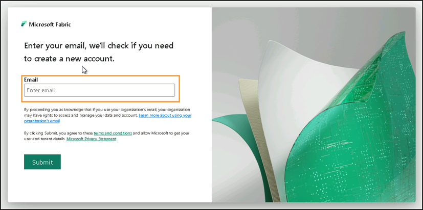

   - **Password**:<inject key="AzureAdUserPassword"></inject> , then Click **Sign in**.

     

1. You will be navigated to the **Fabric Home page**.

   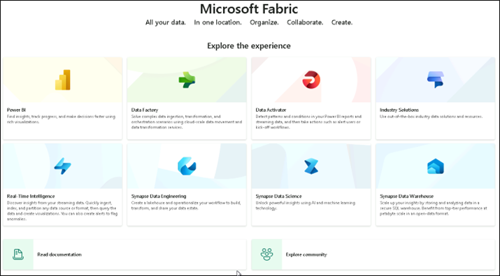

   >**Note**: To work with Fabric items, you will need a trial license and a workspace that has Fabric license. Let’s set this up. 
   
1. On the top right corner of the screen, select the **user icon**. 
1. Select **Free Trial**.

   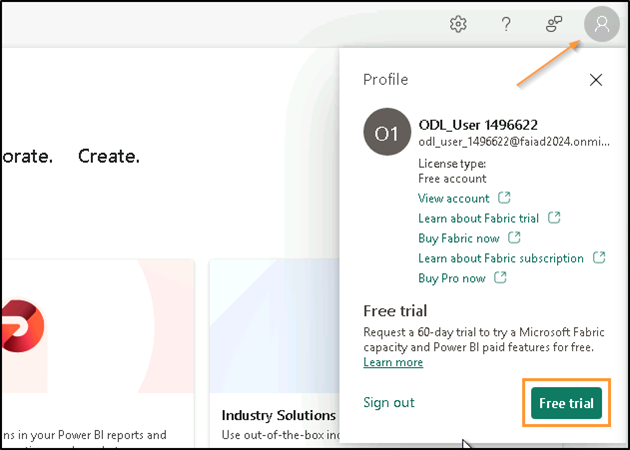

1. Upgrade to a free Microsoft Fabric trial dialog opens. Select **Activate**.

   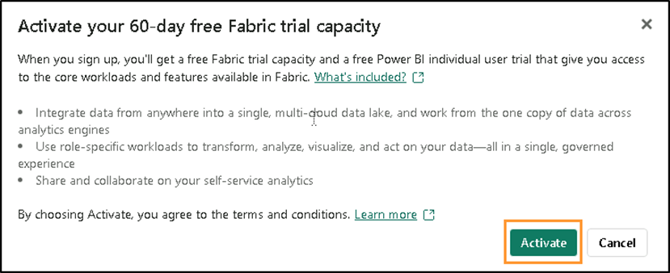

1. Successfully upgraded to Microsoft Fabric dialog opens. Select **Fabric Home Page**.  

   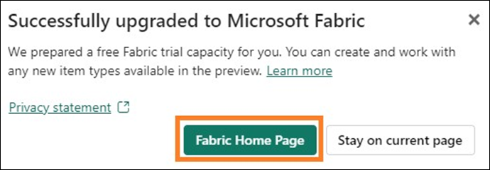

1. You will be navigated back to the **Microsoft Fabric Home page**.

   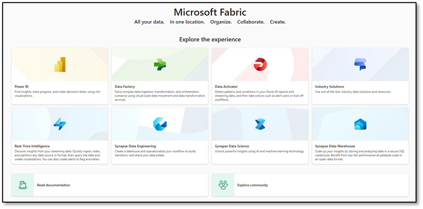

# Real-Time Intelligence and Real-Time Hub

## Task 2: Real-Time Intelligence Experience Items

1. Click on the **Real-Time Intelligence** Experience.

   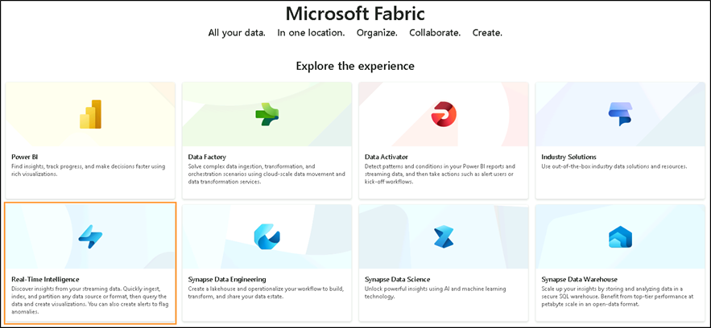

2. You will be navigated to **Real-Time Intelligence Home page**. You will see **Task flow templates**, Recommended items to create, and **Learn more about Real-Time Intelligence** categories.  With the **Recommended** category notice the items:
   
     a.	**Eventhouse**: Used to create a workspace of one or multiple KQL database(s), which can be shared across projects. Also creates a KQL Database within the Eventhouse.
   
     b.	**KQL Queryset**: Used to run queries on the data to produce shareable tables and visuals.
    
     c.	**Real-Time Dashboard**: A collection of tiles, optionally organized in pages, where each tile has an underlying query and a visual representation.
   
     d.	**Eventstream**: Used to capture, transform, and route real-time event stream.
   
     e.	**Reflex**: For automatically taking actions when patterns or conditions are detected in changing data.

      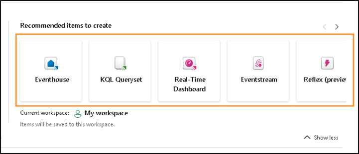

## Task 3: Real-Time Hub

1. Click on the **Real-Time hub** within the Fabric navigation pane on the left side of the screen.

   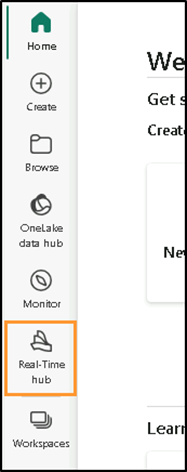

1. The **Welcome to Real-Time hub** dialogue will open and feel from to select **Take a tour** or select **Get Started**.

   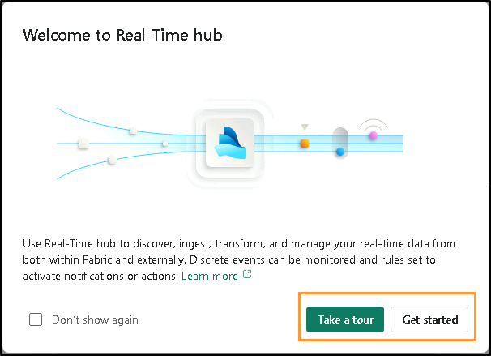

1. The Real-Time hub is the single place for streaming data-in-motion across your entire organization. Every Microsoft Fabric tenant is automatically provisioned with this hub. It enables you to easily discover, ingest, manage, and consume data-in-motion from a wide variety of sources.

1. Within the Real-Time hub you have access to three different types of data integration.

    -	**All Data streams**: For your running eventstreams and KQL databases, all the stream outputs from eventstreams and tables from KQL databases automatically show up in Real-Time hub.
    - **Streaming sources**: Lists all streaming resources from Microsoft services. Whether it’s Azure Event Hubs, Azure IoT Hub, or other services, you can seamlessly ingest data into Real-Time hub.
    - **Fabric events**: Events that are generated via Fabric artifacts and external sources, are made available in Fabric to support event-driven scenarios like real-time alerting and triggering downstream actions. You can monitor and react to events including Fabric workspace item events and Azure Blob Storage events.

      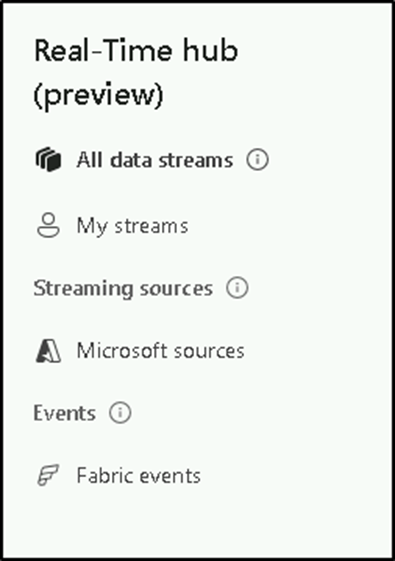

1. In the top-right corner of the Real-Time hub, click on the **+ Add Source** button.

   

1. A window will appear and will detail the currently available streams of data that are available to integrate into the Real-Time hub.  This includes a mixture of Azure sources as well as external cloud streaming sources like Amazon Kinesis, Confluent Cloud Kafka, and Google Cloud Pub/Sub. There is even some sample data available to explore.

   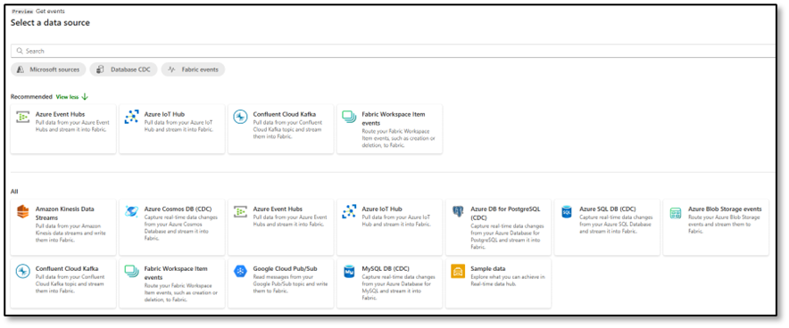

1. **Close** the Get events window by clicking the “X” in the upper right corner.

# Create Workspace and Eventhouse

## Task 4: Create a Fabric Workspace 
1.	Now let’s create a workspace with Fabric license. Select **Workspaces** from the navigation bar on the left.
1. Select **New workspace**.

   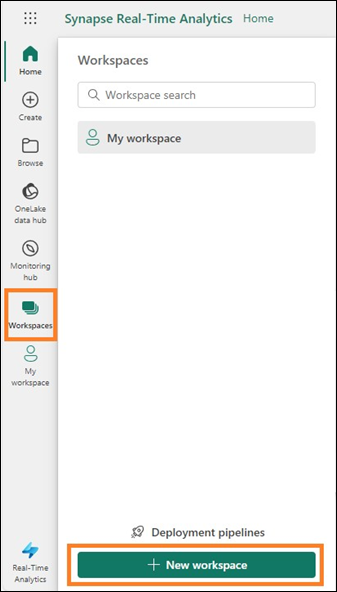
 
1. **Create a workspace** dialog opens on the right side of the browser. 
1. In the **Name** field enter **RTI_username**.  Use the username provided to you from the environment details.

   **Note**: The workspace name must be unique. Make sure a green check mark with **“This name is available”** is displayed below the Name field. 

1. If you would like, you can enter a **Description** for the workspace. This is an optional field.
   
1. Click on **Advanced** to expand the section.

   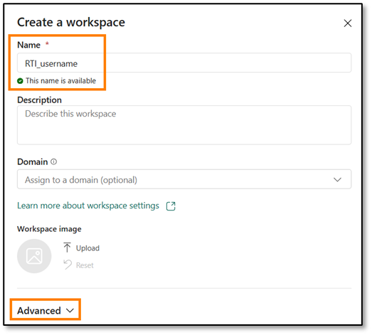
 
1. Under **License mode**, make sure **Trial** is selected. (It should be selected by default.)
	
1. Select **Apply** to create a new workspace.

   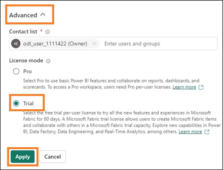
 
## Task 5: Create an Eventhouse

1. Click the **+ New** box to find all the items you can create in this Fabric workspace.

   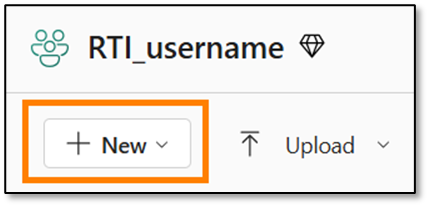
   
1. Select the **Eventhouse** option from store data . As we have talked about this can be viewed  similarly to a Lakehouse in that we can store data but this Eventhouse is focused around real time data.

   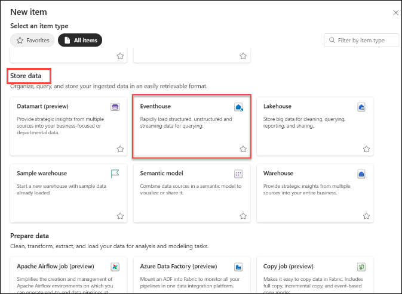
 
1. In the window that appears, give your Eventhouse the name, **eh_Fabrikam** and click on **Create**.

   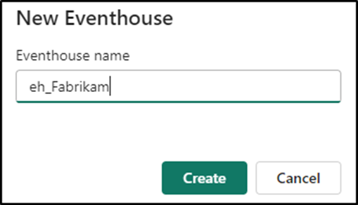
 
1. This is where you will ultimately stream data from various sources through the rest of the training today. When the item is created, a window will appear giving you some details about the Eventhouse.  Click on the **Get started** button.

   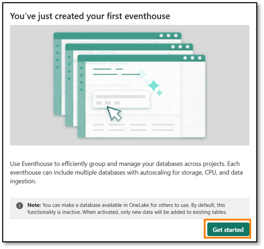
 
1. Take a quick tour of the Eventhouse by following the green tooltips on your screen.  This first one shows that an empty Kusto Query Language (KQL) Database was created with the Eventhouse.

   

1. Follow the remainder of the tooltips around the screen to show you where to create additional databases, check the storage in OneLake of the Eventhouse, check the usage of Fabric resources in compute minutes, and finally see what actions have occurred in the Eventhouse.
   
1. Within the navigational pane on the left of the Eventhouse, find your KQL Database that was created alongside the Eventhouse and simply click on it to view the database details

   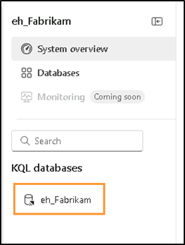

1. This will allow us to still have one tab in the left browser pane to see the overview of our entire Eventhouse and a new tab to focus on the KQL Database properties. One goal that we wish to accomplish in our scenario is to ensure that the data streamed to the KQL database is accessible via OneLake. By enabling this feature, we make the data in this KQL Database easily discoverable through shortcuts to be used in any Lakehouse we may want. Locate the **Database details** section on the right and toggle **On** the “Availability” option.
   
    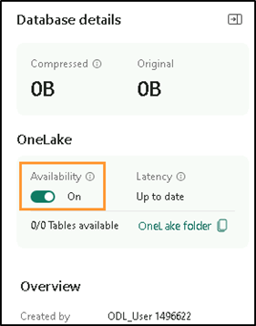
 
1. Return to your **RTI_username** workspace by selecting it from the left side of the browser

   
 
1. If you see the **Task Flows** option taking up most of the space, select the double up arrow on the right-hand side to minimize it

    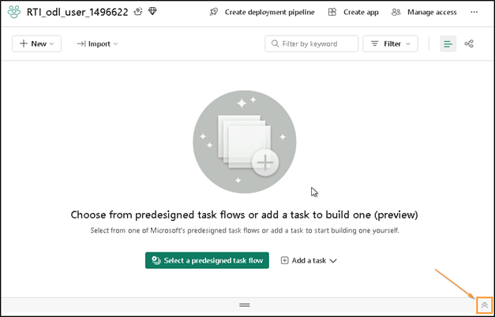

1. You now have the basis for how you will begin to ingest the streaming data into your OneLake.  The next step is to create a stream of data that can receive the data in motion.

   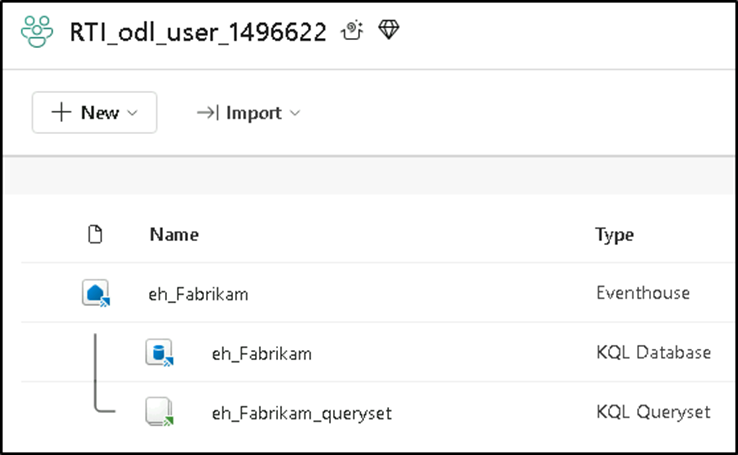
 

In this lab, we explored the Real-Time Intelligence interface, examined the Real-Time hub, created a Fabric workspace, and an Eventhouse that came with a KQL Database.  In the next lab, you will begin to explore techniques that ingest data from various sources across your data estate to OneLake and do some basic analysis with the Kusto Query Language (KQL).

## References 
Fabric Real-time Intelligence in a Day (RTIIAD) introduces you to some of the key functions available in Microsoft Fabric. 
In the menu of the service, the Help (?) section has links to some great resources. 

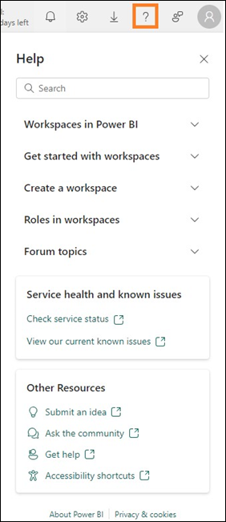
 
Here are a few more resources that will help you with your next steps with Microsoft Fabric. 

-   See blog post to read the full [Microsoft Fabric GA announcement](https://aka.ms/Fabric-Hero-Blog-Ignite23)
-   Explore Fabric through the [Guided  Tour](https://aka.ms/Fabric-GuidedTour)
-   Sign up for the [Microsoft Fabric free trial](https://aka.ms/try-fabric)
-   Visit the [Microsoft Fabric  website](https://aka.ms/microsoft-fabric)
-   Learn new skills by exploring the [Fabric Learning  modules](https://aka.ms/learn-fabric)
-   Explore the [Fabric technical  documentation](https://aka.ms/fabric-docs)
-   Read the [free e-book on getting started with  fabric](https://aka.ms/fabric-get-started-ebook)
-   Join the [Fabric community](https://aka.ms/fabric-community) to post  your questions, share your feedback, and learn from others

Read the more in-depth Fabric experience announcement blogs:

-   [Data Factory experience in Fabric blog](https://aka.ms/Fabric-Data-Factory-Blog)
-   [Synapse Data Engineering experience in Fabric  blog](https://aka.ms/Fabric-DE-Blog)
-   [Synapse Data Science experience in Fabric  blog](https://aka.ms/Fabric-DS-Blog)
-   [Synapse Data Warehousing experience in Fabric  blog](https://aka.ms/Fabric-DW-Blog)
-   [Real-](https://aka.ms/Fabric-RTA-Blog)[Time Intelligence  experience in Fabric blog](https://blog.fabric.microsoft.com/en-us/blog/category/real-time-intelligence)]
-   [Power BI announcement  blog](https://aka.ms/Fabric-PBI-Blog)
-   [Data Activator experience in Fabric  blog](https://aka.ms/Fabric-DA-Blog)
-   [Administration and governance in Fabric  blog](https://aka.ms/Fabric-Admin-Gov-Blog)
-   [OneLake in Fabric  blog](https://aka.ms/Fabric-OneLake-Blog)
-   [Dataverse and Microsoft Fabric integration  blog](https://aka.ms/Dataverse-Fabric-Blog)
 
© 2024 Microsoft Corporation. All rights reserved. 

By using this demo/lab, you agree to the following terms: 

The technology/functionality described in this demo/lab is provided by Microsoft Corporation for purposes of obtaining your feedback and to provide you with a learning experience. You may only use the demo/lab to evaluate such technology features and functionality and provide feedback to Microsoft. You may not use it for any other purpose. You may not modify, copy, distribute, transmit, display, perform, reproduce, publish, license, create derivative works from, transfer, or sell this demo/lab or any portion thereof. 

COPYING OR REPRODUCTION OF THE DEMO/LAB (OR ANY PORTION OF IT) TO ANY OTHER SERVER OR LOCATION FOR FURTHER REPRODUCTION OR REDISTRIBUTION IS EXPRESSLY PROHIBITED. 

THIS DEMO/LAB PROVIDES CERTAIN SOFTWARE TECHNOLOGY/PRODUCT FEATURES AND 
FUNCTIONALITY, INCLUDING POTENTIAL NEW FEATURES AND CONCEPTS, IN A SIMULATED 
ENVIRONMENT WITHOUT COMPLEX SET-UP OR INSTALLATION FOR THE PURPOSE DESCRIBED 
ABOVE. THE TECHNOLOGY/CONCEPTS REPRESENTED IN THIS DEMO/LAB MAY NOT REPRESENT FULL 
FEATURE FUNCTIONALITY AND MAY NOT WORK THE WAY A FINAL VERSION MAY WORK. WE ALSO 
MAY NOT RELEASE A FINAL VERSION OF SUCH FEATURES OR CONCEPTS. YOUR EXPERIENCE WITH USING SUCH FEATURES AND FUNCITONALITY IN A PHYSICAL ENVIRONMENT MAY ALSO BE DIFFERENT. 

**FEEDBACK**. If you give feedback about the technology features, functionality and/or concepts described in this demo/lab to Microsoft, you give to Microsoft, without charge, the right to use, share and commercialize your feedback in any way and for any purpose. You also give to third parties, without charge, any patent rights needed for their products, technologies and services to use or interface with any specific parts of a Microsoft software or service that includes the feedback. You will not give feedback that is subject to a license that requires Microsoft to license its software or documentation to third parties because we include your feedback in them. These rights survive this agreement. 

MICROSOFT CORPORATION HEREBY DISCLAIMS ALL WARRANTIES AND CONDITIONS WITH REGARD 
TO THE DEMO/LAB, INCLUDING ALL WARRANTIES AND CONDITIONS OF MERCHANTABILITY, 
WHETHER EXPRESS, IMPLIED OR STATUTORY, FITNESS FOR A PARTICULAR PURPOSE, TITLE AND NON-
INFRINGEMENT. MICROSOFT DOES NOT MAKE ANY ASSURANCES OR REPRESENTATIONS WITH REGARD TO THE ACCURACY OF THE RESULTS, OUTPUT THAT DERIVES FROM USE OF DEMO/ LAB, OR SUITABILITY OF THE INFORMATION CONTAINED IN THE DEMO/LAB FOR ANY PURPOSE.

**DISCLAIMER** 
This demo/lab contains only a portion of new features and enhancements in Microsoft Power BI. Some of the features might change in future releases of the product. In this demo/lab, you will learn about some, but not all, new features. 

