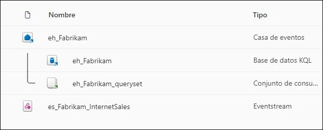
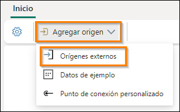
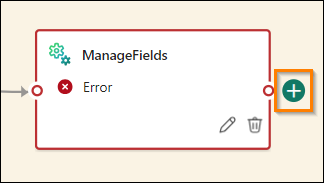
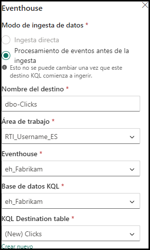
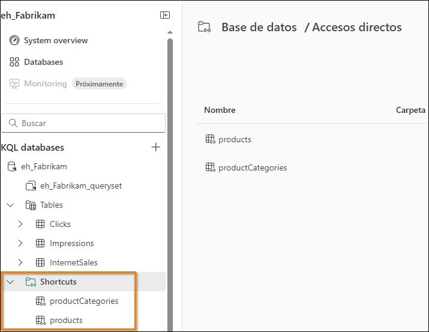

# Microsoft Fabric Real-Time Intelligence in a Day Laboratorio 3


# Contenido 
- Estructura del documento
- Introducción
- Eventstreams de Fabric
    - Tarea 1: Crear un Eventstream
    - Tarea 2: Transformar el Eventstream
    - Tarea 3: Dividir Eventstream y cargar dos destinos
- Agregar más datos a la base de datos KQL
    - Tarea 4: Validar tablas de datos de eventos
    - Tarea 5: Crear accesos directos a la base de datos KQL para tablas de dimensiones
- Resumen
- Referencias

# Estructura del documento 
El laboratorio incluye pasos que el usuario debe seguir junto con capturas de pantalla asociadas que sirven de ayuda visual. En cada captura de pantalla, las secciones se resaltan con cuadros de color naranja para indicar en qué áreas debe centrarse el usuario. 

# Introducción 
En este laboratorio, creará otro Eventstream para ingerir datos adicionales en nuestro Eventhouse existente. Veremos cómo incluir transformaciones dentro del Eventstream para controlar qué datos deseamos agregar a la base de datos KQL

Al final de este laboratorio, habrá aprendido sobre: 
- Procesamiento y transformación de Eventstream
- Escritura sobre consultas KQL para combinar datos de una base de datos externa
- Uso de KQL para consultar datos y visualizar dentro de Power BI

# Eventstreams de Fabric
## Tarea 1: Crear un Eventstream 

1. Abra el **área de trabajo de Fabric** que ha estado usando para el curso de hoy.

       

2. Hay datos de transmisión adicionales que podemos ingerir relacionados con nuestra tienda de comercio electrónico. Sin embargo, para este Eventstream, querremos transformar los datos antes de cargarlos en el Eventhouse. En lugar de ir al **“Centro en tiempo real”**, podemos crear un nuevo Eventstream directamente desde el área de trabajo. Cree un nuevo **Eventstream** en el menú **+ Nuevo elemento**.

    

3. Asigne el nombre **es_Fabrikam_ClickEvents** al nuevo Eventstream, marque la opción **“Capacidades mejoradas”** y, a continuación, haga clic en **Crear**.

    

4. En la cinta de opciones de Inicio, haga clic en el menú desplegable **Agregar origen** y luego seleccione **Orígenes externos**.

    

5. De manera similar al laboratorio anterior, nos conectaremos a un Centro de eventos de Azure, que tiene datos que se transmiten desde un cuaderno de Python. Haga clic en **“Conectar”** para el mosaico **“Azure Event Hubs”**. Si no ve **“Centro de eventos de Azure”** en la sección recomendada, seleccione **“Ver todos los orígenes”** para que aparezca.

    

6. Cree una **Nueva conexión**.

    

7. Desde la página de detalles de su entorno, copie y pegue toda la configuración de conexión necesaria en los campos correspondientes.

    - Espacio de nombres del centro de eventos: **rtiadhub{username}**

    - Centro de eventos: **rta-iad-clicks**

    - Nombre de la clave de acceso compartido: **rti-reader**

    - Clave de acceso compartido: **se proporciona en Detalles del entorno**

      

8. Una vez que se hayan completado todas las propiedades, haga clic en **Conectar**.

9. En la configuración del origen de datos del Centro de eventos de Azure, es posible que deba modificar el **Grupo de consumidore**s del Centro de eventos para asegurarse de que obtiene acceso a un punto de acceso único al flujo de datos. Para este taller, puede dejar el valor “$Default” como se  indica a continuación.

    

10. Haga clic en **Siguiente**.

11. En la ventana Revisar y crear, compruebe que todo esté configurado correctamente y haga clic en **Agregar**.

    

12. Una vez configurada la secuencia, podrá ver una versión preliminar de los datos procedentes del Centro de eventos.

    

13. Examine los datos que se reciben. Hay dos tipos de eventos que se registran desde el sitio web de comercio electrónico: clics e impresiones.
- **IMPRESSION**: se registra un evento de impresión cada vez que se muestra un anuncio o una lista de productos a un usuario. Las impresiones son una medida de cuántas veces se visualiza un elemento (anuncio o producto), independientemente de si se interactúa con él.
- **CLICK**: un evento de clic se registra cuando un usuario interactúa con un elemento haciendo clic en él. Esto suele indicar un mayor nivel de interacción en comparación con una impresión.

Además de los clics y los eventos de impresión que se registran, hay detalles sobre el producto para el que se produjo el clic o la impresión, el dispositivo y el navegador desde el que se cargó la página web, la dirección IP a la que se accedió a la página y cuánto tardó en cargarse.

## Tarea 2: Transformar el Eventstream

1. Ahora trasformará el flujo de datos antes de que la base de datos KQL empiece a ingerirlo de manera que los analistas que quieran obtener información de estos datos puedan comprenderla con facilidad. Dentro del lienzo de Eventstream, haga clic en la lista desplegable del objeto **Transformar eventos**.

    

2. En la lista de operaciones disponibles, seleccione la opción **Administrar campos**.

    

3. En el nuevo icono que aparece con el nombre **ManageFields**, haga clic en el **icono de lápiz** para seleccionar los campos que quiera agregar a su flujo desde el origen.

    

4. En el panel flotante que aparece, haga clic en el botón de la opción **Agregar todos los campos**.

    

5. En la lista de campos, seleccione el que se denomina **PartitionId** y haga clic en los puntos suspensivos (...) que aparecen cuando pasa el cursor por el campo

    

6. Elija la opción para **Quitar** ese campo. Para este flujo de datos procedente de Event Hub, no se utiliza la creación de particiones, de modo que esta columna no nos resulta útil, así que la eliminamos.

    

7. Elimine los siguientes campos, ya que no serán necesarios para este flujo.

    - userAgent
    - page_loading_seconds
    - EventProcessedUtcTime
    - EventEnqueredUtcTime

   Debería quedarse con los campos que aparecen en la siguiente imagen.

   

8. Pase el cursor sobre el campo eventDate y, cuando aparezca un botón de puntos suspensivos (...) en el lado derecho de la ventana, haga clic en él.

    

9. Elija la opción **Editar**.

    

10. Haga clic en el **botón de alternancia Cambiar tipo** para modificar el tipo de datos de este campo. El tipo original es una cadena, debe modificar el **Tipo convertido** a **DateTime**. Una vez que haya terminado, haga clic en **Guardar**.

    

## Tarea 3: Dividir Eventstream y cargar dos destinos

1. Aunque puede cargar este flujo de datos en una base de datos KQL para su análisis, es posible que quiera consumir estos datos de otra forma para diferenciar los eventos CLICK y los eventos IMPRESSION. Agregue otra actividad de transformación a la interfaz de usuario pasando el cursor sobre el final de la transformación **ManageFields**.

    

2. Elija la transformación **Filtro** en la lista de operaciones disponibles.

    

3. Haga clic en el icono de lápiz en la nueva transformación **Filter**.

    

4. En el control flotante que aparece en el lado derecho de la pantalla, personalice las condiciones del filtro para reflejar una forma de devolver solo los valores de CLICK mediante los siguientes parámetros. Es importante tener en cuenta que la transformación de filtro distingue entre mayúsculas y minúsculas
 
   - **Nombre de la operación**: Clicks
    - **Seleccione un campo para filtrar por**: eventType
    - **Mantenga los eventos cuando el valor** - es igual a - CLICK **(¡Importante! Este es un campo que distingue entre mayúsculas y minúsculas, así que asegúrese de introducir mayúsculas para este ejemplo)**
 
      

5. Elija la opción **Guardar** para conservar los cambios.

6. Vuelva a hacer clic en el **botón Actualizar** para comprobar que los datos se han filtrado para eventTypes CLICK.

    

7. Es posible que se trate de las únicas filas que quiera enviar a una tabla, pero otra opción es crear dos flujos independientes para enrutar información diferente a dos o más tablas. En la cinta de opciones de **Inicio** del Eventstream, haga clic en el menú desplegable **Transformar eventos** y luego seleccione **Filtro**.

    

8. Un nuevo objeto llamado **Filter (el nombre puede diferir)** aparecerá en su lienzo. Deberá conectar el flujo **ManageFields** a la nueva transformación de filtro. Arrastre una línea desde el punto verde de una transformación a otra para establecer esa conexión.

    

9. Haga clic en el **icono de lápiz** de **Filter** para editar su configuración.

    

10. En el control flotante que aparece en el lado derecho de la pantalla, personalice las condiciones del filtro para reflejar una forma de devolver solo los valores de IMPRESSION mediante los siguientes valores. Recuerde que la transformación de filtro distingue entre mayúsculas y minúsculas

    - **Nombre de la operación**: Impressions
    - **Seleccione un campo para filtrar por**: eventType
    - **Mantenga los eventos cuando el valor** - es igual a - IMPRESSION **(¡Importante! Este es un campo que distingue entre mayúsculas y minúsculas, así que asegúrese de introducir mayúsculas para este ejemplo)**

      

12. Elija la opción **Guardar** para conservar los cambios.

13. Antes de cargar los datos en nuevas tablas dentro de nuestra base de datos KQL, podemos eliminar columnas adicionales que no son necesarias. En este caso, para el flujo de datos que se filtra para nuestros registros “CLICK”, ya no necesitamos la columna “eventType”, puesto que cada fila tiene el mismo valor. Para nuestro flujo de datos “IMPRESSION”, podemos eliminar la columna “eventType” por las mismas razones mencionadas anteriormente, y también podemos eliminar la columna “referrer”, ya que está vacía para todas las filas de esta tabla.

14. Haga clic en el icono + después de la operación de filtro **Clicks**.

    

15. En el menú desplegable, seleccione “Administrar campos”

    

16. Haga clic en el **icono de lápiz** para seleccionar los campos que desea agregar/eliminar de su secuencia

    

17. Cambie el nombre de la operación a “Manage_Clicks”. Asimismo, seleccione “Agregar todos los campos” y luego elimine “eventType”. Cuando haya terminado, haga clic en **Guardar**.

    

18. A continuación, agreguemos otra transformación “Administrar campos” conectada al filtro “Impressions”, como se muestra a continuación

    

19. Haga clic en el **icono de lápiz** para seleccionar los campos que desea agregar/eliminar de su secuencia

    

20. Cambie el nombre de la operación a “Manage_Impressions”. A continuación, seleccione “Agregar todos los campos” y luego elimine “eventType” y “referrer”. Su transformación “Administrar campos” debería parecerse a la siguiente.

    

21. Ahora que ha limpiado los datos de las secuencias para cada uno de los tipos de eventos, debe cargar cada secuencia en una nueva tabla en la base de datos KQL. Haga clic en el **+ icono** después de la operación de administración de campos **Manage_Clicks**.

    

22. En la lista desplegable que aparece, vaya a **Destinos** y seleccione **Eventhouse**.

    

23. Haga clic en el icono de lápiz para el destino Eventhouse.

    

24. Para este destino, configure las siguientes propiedades.
 
    - **Nombre de destino**: dbo-Clicks
    - **Área de trabajo**: RTI_username
    - **Eventhouse**: eh_Fabrikam
    - **Base de datos KQL**: eh_Fabrikam
    - **Tabla de destino**: cree una nueva tabla denominada **Clicks**

      

25. Haga clic en **Guardar** en la parte inferior del control flotante.

26. Haga lo mismo para la tabla Impressions con la siguiente información configurada como se muestra a continuación.

    

27. Guarde los cambios.

28. Este Eventstream ya está listo para comenzar a transmitirse. Haga clic en **Publicar** para comenzar esa secuencia.

    

29. Con Eventstream ahora en ejecución, debería ver que la interfaz de usuario de Eventstream cambia ligeramente para indicar que está transmitiendo los datos desde Event Hub, transformando y dividiendo ese flujo de datos y cargándolo en dos tablas de base de datos KQL independientes.

    

# Agregar más datos a la base de datos KQL
## Tarea 4: Validar tablas de datos de eventos

1. Regrese a su área de trabajo **RTI_username**.

2. Abra la base de datos KQL **eh_Fabrikam**.

    

3. Con Eventstream en ejecución, ahora debería ver dos nuevas tablas en la página Información general de la base de datos KQL. Después de dejar que Eventstream se ejecute durante un tiempo, observará que las **Mejores tablas** dentro de la base de datos KQL aparecerán en la página Información general y mostrarán cuántos datos se almacenan en las tablas.

    

4. Haga clic en la tabla **Impressions**. Esta tabla recibe alrededor de 1,5 millones de registros cada 24 horas. Hay muchas más impresiones que clics, por lo que esta será la tabla más grande a los efectos de esta clase.

    

## Tarea 5: Crear accesos directos a la base de datos KQL para tablas de dimensiones
Hasta este punto, ha estado trabajando con datos de transmisión, pero todavía le faltan algunos elementos críticos para poder obtener inteligencia de los datos que ha aportado. En esta tarea, traeremos datos de una base de datos externa de Azure SQL que servirán como tablas de dimensiones dentro de nuestra base de datos KQL. Esto nos permitirá describir mejor los datos que estamos transmitiendo actualmente. Por ejemplo, todas nuestras tablas contienen una forma de id. de producto que es un campo numérico, pero sería mejor si tuviéramos algún tipo de nombre de producto para poder mostrar. Los datos que necesitamos para admitir esto se encuentran actualmente en una base de datos externa de Azure SQL. Veamos lo sencillo que es establecer conexiones a algunas de estas tablas de dimensiones.

1. En la base de datos **eh_Fabrikam**, haga clic en el menú desplegable denominado **New related item**. Acto seguido, elija la opción que dice Conjunto de consultas KQL.

    

2. Asigne el nombre **Create Tables** a la consulta KQL y luego haga clic en el botón **Crear**.

    

3. Se abrirá el centro de conectividad de datos de OneLake y la única opción a seleccionar será la base de datos KQL **“eh_Fabrikam”**. Seleccione esta base de datos y haga clic en **“Conectar”**.

    

4. En la nueva interfaz, haga clic una vez dentro de la ventana de consulta y resalte todo el texto mediante el método abreviado de teclado **Ctrl + A**. Una vez que se haya resaltado todo, elimínelo.

    

5. En la ventana de la consulta en blanco, introduzca el script KQL. Este script creará una conexión a una base de datos externa de Azure SQL y la pondrá a disposición en nuestra base de datos KQL como un acceso **directo**. Se adjunta un **Acceso directo** en modo de solo lectura, lo que permite ver y ejecutar consultas junto con los datos de transmisión que se ingirieron en la base de datos de KQL.

    ```
    .execute database script <|
    //External tables - shortcuts
    // connect to operational Database with external table Product
    .create external table products (ProductID: int, ProductNumber: string,  Name: string) 
    kind=sql
    table=[SalesLT.Product]
    ( 
    h@'Server= fabrikamdemo.database.windows.net,1433;Initial Catalog=fabrikamdb;User Id=demouser;Password=fabrikam@123456'
    )
    with 
    (
    createifnotexists = true
    )  
    // connect to operational Database with external table ProductCategory
    .create external table productCategories (ProductCategoryID: int, Name: string) 
    kind=sql
    table=[SalesLT.ProductCategory]
    ( 
    h@'Server= fabrikamdemo.database.windows.net,1433;Initial Catalog=fabrikamdb;User Id=demouser;Password=fabrikam@123456'    )
    with 
    (
    createifnotexists = true
    )
    ```

    

6. Haga clic en el botón **Ejecutar** para ejecutar el script.

    

7. En la ventana del Explorador de bases de datos, ahora verá una nueva carpeta llamada **Shortcuts** y, dentro de la carpeta, debería ver dos tablas adicionales que están vinculadas a esta base de datos KQL. Estas tablas existen dentro de una base de datos de Azure SQL, pero a través del script que ejecutó, ahora las tiene vinculadas a esta base de datos KQL para unirlas a sus tablas InternetSales y event.

    

8. Ahora que tiene cualidades dimensionales en su base de datos, puede responder a preguntas y dar más contexto a los consumidores de los informes y consultas de estas tablas en toda su empresa. Ejecute la siguiente consulta KQL para ver una de ellas.

    ```
    InternetSales
    | join kind=inner 
    (external_table("products")) on ($left.ProductKey == $right.ProductID)
    | summarize SalesPerProduct=sum(SalesAmount) by Name
    | project Name, SalesPerProduct
    ```

9. En los resultados de la consulta, ahora verá los valores de cada producto individual que ha vendido su empresa.

    

10. Con la consulta resaltada, haga clic en el botón de la barra de herramientas, **Create Power BI report**.

    

11. Esto le da la oportunidad de crear un informe de Power BI con los datos de su base de datos KQL. Explore esto con total libertad durante unos minutos, pero no tendrá que crear un informe a partir de estos datos todavía. Haga clic en el **botón X** en la esquina superior derecha cuando esté listo para avanzar.

    

12. Vuelva a la base de datos KQL **eh_Fabrikam**.

    

13. Haga clic en la opción **Shortcuts** dentro del panel de navegación **eh_Fabrikam**. Esto le mostrará todos los accesos directos que ha creado a esta base de datos KQL. Cabe señalar que estos accesos directos se consideran tablas externas clásicas de Azure Data Explorer que utilizan la sintaxis de tabla externa de Azure SQL y se crean de forma diferente a los accesos directos de OneLake, ADLS o S3, que también se admiten en la base de datos KQL dentro de Fabric.

    

# Resumen
En este laboratorio, ha creado otro flujo de datos, pero ha podido transformarlo mediante la interfaz de usuario de Eventstream en Fabric. La carga de los datos en dos tablas independientes le ha permitido realizar un seguimiento de todos los clics e impresiones dentro de su sistema de comercio electrónico con fines de marketing, publicidad y análisis. También ha creado un acceso directo a una base de datos externa de Azure SQL mediante la característica de tabla externa del conjunto de consultas KQL. Ahora dispone algunas dimensiones para comprender mejor el contexto de las ventas y los clics dentro de su base de datos KQL.

# Referencias 
Fabric Real-Time Intelligence in a Day (RTIIAD) le presenta algunas funciones clave disponibles en Microsoft Fabric. 
En el menú del servicio, la sección Ayuda (?) tiene vínculos a algunos recursos excelentes. 

   


Estos son algunos recursos más que podrán ayudarle a seguir avanzando con Microsoft Fabric.

- Vea la publicación del blog para leer el [anuncio de disponibilidad general de Microsoft Fabric completo](https://aka.ms/Fabric-Hero-Blog-Ignite23)

- Explore Fabric a través de la [Visita guiada](https://aka.ms/Fabric-GuidedTour)

- Regístrese en la [prueba gratuita de Microsoft Fabric](https://aka.ms/try-fabric)

- Visite el [sitio web de Microsoft Fabric](https://aka.ms/microsoft-fabric)

- Adquiera nuevas capacidades mediante la exploración de los [módulos de aprendizaje de Fabric](https://aka.ms/learn-fabric)

- Explore la [documentación técnica de Fabric](https://aka.ms/fabric-docs)

- Lee el [libro electrónico gratuito sobre cómo empezar a usar Fabric](https://aka.ms/fabric-get-started-ebook)

- Únase a la [comunidad de Fabric](https://aka.ms/fabric-community) para publicar sus preguntas, compartir sus comentarios y aprender de otros.

Obtenga más información en los blogs de anuncios de la experiencia Fabric:

- [Experiencia de Data Factory en el blog de Fabric](https://aka.ms/Fabric-Data-Factory-Blog)

- [Experiencia de Synapse Data Engineering en el blog de Fabric](https://aka.ms/Fabric-DE-Blog)

- [Experiencia de Synapse Data Science en el blog de Fabric](https://aka.ms/Fabric-DS-Blog)

- [Experiencia de Synapse Data Warehousing en el blog de Fabric](https://aka.ms/Fabric-DW-Blog)

- [Experiencia de Real-Time Intelligence en el blog de Fabric](https://blog.fabric.microsoft.com/en-us/blog/category/real-time-intelligence)

- [Blog de anuncios de Power BI](https://aka.ms/Fabric-PBI-Blog)

- [Experiencia de Data Activator en el blog de Fabric](https://aka.ms/Fabric-DA-Blog)

- [Administración y gobernanza en el blog de Fabric](https://aka.ms/Fabric-Admin-Gov-Blog)

- [OneLake en el blog de Fabric](https://aka.ms/Fabric-OneLake-Blog)

- [Blog de integración de Dataverse y Microsoft Fabric](https://aka.ms/Dataverse-Fabric-Blog)


© 2024 Microsoft Corporation. Todos los derechos reservados.

Al participar en esta demostración o laboratorio práctico, acepta las siguientes condiciones:

Microsoft Corporation pone a su disposición la tecnología o funcionalidad descrita en esta demostración/laboratorio práctico con el fin de obtener comentarios por su parte y de facilitarle una experiencia de aprendizaje. Esta demostración/laboratorio práctico solo se puede usar para evaluar las características de tal tecnología o funcionalidad y para proporcionar comentarios a Microsoft. No se puede usar para ningún otro propósito. Ninguna parte de esta demostración/laboratorio práctico se puede modificar, copiar, distribuir, transmitir, mostrar, realizar, reproducir, publicar, licenciar, transferir ni vender, ni tampoco crear trabajos derivados de ella.

LA COPIA O REPRODUCCIÓN DE ESTA DEMOSTRACIÓN/LABORATORIO PRÁCTICO (O PARTE DE ELLA) EN CUALQUIER OTRO SERVIDOR O UBICACIÓN PARA SU REPRODUCCIÓN O DISTRIBUCIÓN POSTERIOR QUEDA EXPRESAMENTE PROHIBIDA.

ESTA DEMOSTRACIÓN/LABORATORIO PRÁCTICO PROPORCIONA CIERTAS FUNCIONES Y CARACTERÍSTICAS DE PRODUCTOS O TECNOLOGÍAS DE SOFTWARE (INCLUIDOS POSIBLES NUEVOS CONCEPTOS Y CARACTERÍSTICAS) EN UN ENTORNO SIMULADO SIN INSTALACIÓN O CONFIGURACIÓN COMPLEJA PARA EL PROPÓSITO ARRIBA DESCRITO. LA TECNOLOGÍA/ CONCEPTOS DESCRITOS EN ESTA DEMOSTRACIÓN/LABORATORIO PRÁCTICO NO REPRESENTAN LA FUNCIONALIDAD COMPLETA DE LAS CARACTERÍSTICAS Y, EN ESTE SENTIDO, ES POSIBLE QUE NO FUNCIONEN DEL MODO EN QUE LO HARÁN EN UNA VERSIÓN FINAL. ASIMISMO, PUEDE QUE NO SE PUBLIQUE UNA VERSIÓN FINAL DE TALES CARACTERÍSTICAS O CONCEPTOS. DE IGUAL MODO, SU EXPERIENCIA CON EL USO DE ESTAS CARACTERÍSTICAS Y FUNCIONALIDADES EN UN ENTORNO FÍSICO PUEDE SER DIFERENTE.

**COMENTARIOS**. Si envía comentarios a Microsoft sobre las características, funcionalidades o conceptos de tecnología descritos en esta demostración/laboratorio práctico, acepta otorgar a Microsoft, sin cargo alguno, el derecho a usar, compartir y comercializar sus comentarios de cualquier modo y para cualquier fin. También concederá a terceros, sin cargo alguno, los derechos de patente necesarios para que sus productos, tecnologías y servicios usen o interactúen con cualquier parte específica de un software o servicio de Microsoft que incluya los comentarios. No enviará comentarios que estén sujetos a una licencia que obligue a Microsoft a conceder su software o documentación bajo licencia a terceras partes porque incluyamos sus comentarios en ellos. Estos derechos seguirán vigentes después del vencimiento de este acuerdo.
 
MICROSOFT CORPORATION RENUNCIA POR LA PRESENTE A TODAS LAS GARANTÍAS Y CONDICIONES RELATIVAS A LA DEMOSTRACIÓN/LABORATORIO PRÁCTICO, INCLUIDA CUALQUIER GARANTÍA Y CONDICIÓN DE COMERCIABILIDAD (YA SEA EXPRESA, IMPLÍCITA O ESTATUTARIA), DE IDONEIDAD PARA UN FIN DETERMINADO, DE TITULARIDAD Y DE AUSENCIA DE INFRACCIÓN.
MICROSOFT NO DECLARA NI GARANTIZA LA EXACTITUD DE LOS RESULTADOS, EL RESULTADO DERIVADO DE LA REALIZACIÓN DE LA DEMOSTRACIÓN/LABORATORIO PRÁCTICO NI LA IDONEIDAD DE LA INFORMACIÓN CONTENIDA EN ELLA CON NINGÚN PROPÓSITO.

## DECLINACIÓN DE RESPONSABILIDADES

Esta demostración/laboratorio práctico contiene solo una parte de las nuevas características y mejoras realizadas en Microsoft Power BI. Puede que algunas de las características cambien en versiones futuras del producto. En esta demostración/laboratorio práctico, conocerá algunas de estas nuevas características, pero no todas.
