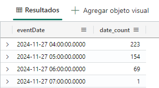
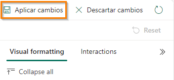
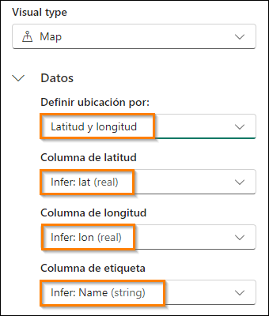
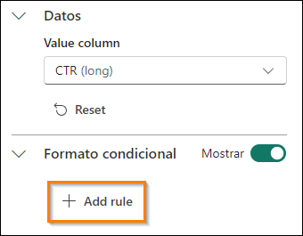
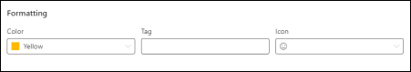

# Microsoft Fabric Real-Time Intelligence in a Day Laboratorio 5
 
 

# Contenido
- Estructura del documento	
- Introducción	
- Paneles de información en tiempo real	
  - Tarea 1: Crear un panel de información en tiempo real	
  - Tarea 2: Conectar un origen de datos al panel de información en tiempo real	
  - Tarea 3: Crear un icono del panel de información en tiempo real con KQL	
  - Tarea 4: Agregar más iconos de panel información al panel de información en tiempo real	
  - Tarea 5: Agregar un objeto visual de mapa para Impressions by Location	
  - Tarea 6: Configurar la actualización automática en el panel de información en tiempo real	
  - Tarea opcional 7: Agregar el logotipo de la empresa	
  - Tarea opcional 8: Aplicar formato condicional a un objeto visual	
- Resumen	
- Referencias
 
# Estructura del documento

El laboratorio incluye pasos que el usuario debe seguir junto con capturas de pantalla asociadas que sirven de ayuda visual. En cada captura de pantalla, las secciones se resaltan con cuadros de color naranja para indicar en qué áreas debe centrarse el usuario.

# Introducción

En este laboratorio, utilizará los datos que ha transmitido y cargado en su base de datos KQL y que ha vinculado de forma concisa a un almacén de lago mediante accesos directos para crear un panel de información en tiempo real a fin de visualizar y compartir su información de los flujos de datos a los que accedió.

Al final de este laboratorio, habrá aprendido:

- Crear un panel de información en tiempo real en Fabric.
- Usar KQL para escribir consultas para rellenar objetos visuales de un panel.
- Agregar formato condicional a objetos visuales del panel de información.

# Paneles de información en tiempo real

## Tarea 1: Crear un panel de información en tiempo real

1. Abra el **área de trabajo de Fabric** para el curso.

   

2. Haga clic en el botón **+ Nuevo elemento** para crear un elemento nuevo.

   
 
3. Verá una categoría para **Visualizar datos**. Haga clic en el elemento denominado **Panel en tiempo real**

   

4. Asigne a su panel de control en tiempo real el nombre **RTI Dashboard** y luego haga clic en **Crear**.
   
   

6. Debería pasar inmediatamente a una instancia en blanco de un panel de información en tiempo real.

   
 
## Tarea 2: Conectar un origen de datos al panel de información en tiempo real

1. En la cinta de opciones de Inicio, busque la opción denominada **New data source** y haga clic en ella.

   

2. En el panel flotante que aparece en el lado derecho de la pantalla, haga clic en **Agregar + y** luego elija **Centro de datos de OneLake**.

   

3. Aparecerá una lista de orígenes disponibles en OneLake, solo se mostrarán los orígenes de las bases de datos KQL, por lo que habrá una opción disponible, la base de datos KQL **eh_Fabrikam**. Seleccione esa opción.

   

4. Haga clic en **Conectar** en la parte inferior de la pantalla.

   
 
5. Ahora ya podrá crear el origen de datos. Haga clic en el botón **Agregar** situado en la parte inferior del panel flotante.

   

6. Ahora verá que se ha agregado un origen de datos al panel de información en tiempo real. Desde aquí, puede agregar bases de datos KQL adicionales en caso de que surja la necesidad. Por ahora, haga clic en **Cerrar** en la parte inferior de la ventana.

   
 
## Tarea 3: Crear un icono del panel de información en tiempo real con KQL

1. Haga clic en el icono en blanco dentro del panel de información para rellenar el icono con un objeto visual.

   

2. De forma predeterminada, se conectará a la base de datos KQL que creó anteriormente como origen. Desde aquí, puede escribir su propia consulta KQL para rellenar este objeto visual con datos. Elimine todo el KQL de Markdown anterior que esté ahí de forma predeterminada. Copie y pegue la siguiente consulta en la ventana de la consulta.
  
    ```
    //Clicks by hour Clicks
    | where eventDate between (_startTime.._endTime)
    | summarize date_count = count() by bin(eventDate, 1h)
    | render timechart
    | top 30 by date_count
    | sort by eventDate
    ```

3. Ejecute la consulta una vez que la haya configurado correctamente para ver los resultados.

   

4. Tenga en cuenta que es posible que solo tenga un resultado en la salida. Esto se debe al **Intervalo de tiempo** que se establece de forma predeterminada para este icono. Dispone de un parámetro con el que puede modificar el intervalo de tiempo desde el que devuelve los datos. La eventDate entre (_startTime.._endTime) es lo que le permite aprovechar este parámetro. Modifique el parámetro **Intervalo de tiempo** a **Últimos 3 horas** y observe cómo cambia la salida.

   

5. En la salida de la consulta ahora debería ver los resultados de los clics de las últimas 3 horas.

   

6. Aunque este parámetro se puede modificar, es posible que desee que tenga como valor predeterminado un intervalo de tiempo específico en lugar de obligar a los usuarios a modificarlo. Encima de la opción de intervalo de tiempo, haga clic en la opción **@ Parámetros**.

   
 
7. Haga clic en el **icono de lápiz** para editar el parámetro **Intervalo de tiempo**.

   

8. Cambie el **Valor predeterminado** a **Últimos 24 horas** para mostrar siempre el último día de forma predeterminada. Haga clic en **Listo** cuando haya terminado.

   

9. Cierre el panel de parámetros.
 
10. Ahora haga clic en el **botón + Agregar objeto visual** encima de los resultados de la consulta.

    

11. Aparecerá un nuevo control flotante en el lado derecho de la pantalla. Haga clic en el cuadro de texto debajo de la opción **Tile name** para asignar a este objeto visual el nombre **Clicks by Hour**.

    

12. De forma predeterminada, el objeto visual que está usando para mostrar los resultados de esta consulta KQL es una tabla. Es posible que esta no sea la mejor manera para que alguien consuma y comprenda rápidamente lo que está sucediendo con los resultados de sus datos. Cambie el tipo de objeto visual de tabla a **Area chart**.

    

13. Con este objeto visual con nuevo formato, puede comprender mejor los picos y valles de clics de su sitio de comercio electrónico mediante el flujo de datos que creó anteriormente en esta clase.

    

14. Para guardar este objeto visual en el panel de información, haga clic en el botón **Aplicar cambios** en la esquina superior derecha de la pantalla.

    
 
15. Una vez que este objeto visual se haya colocado dentro del panel de información, es posible que el objeto visual solo muestre la última hora de resultados. Modifique el panel de información para mostrar el **Intervalo de tiempo** de las **Últimos 24 horas**.

    

16. Actualice el objeto visual y observe que los resultados cambiarán ligeramente para reflejar los datos que se han recibido desde la última ejecución de la consulta.

    

## Tarea 4: Agregar más iconos de panel información al panel de información en tiempo real

1. Haga clic en el botón **New tile** desde la **cinta de opciones de Inicio** en el panel de información en tiempo real.

   

2. Introduzca la siguiente consulta KQL en el panel de información:

    ```
    //Impressions by hour Impressions
    | where eventDate between (_startTime.._endTime)
    | summarize date_count = count() by bin(eventDate, 1h)
    | render timechart
    | top 30 by date_count
    | sort by eventDate
    ```

3. **Ejecute** la consulta.

    

4. Haga clic en el botón **+ Agregar** objeto visual.

   
 
5. Edite el objeto visual para cambiar el **Tile name** a **Impressions by Hour** y el **Visual type** a **Area chart**.

   

6. Aplique cambios al objeto visual.

   

7. Agregue otro **+ New tile**.

   

8. Copie y pegue la siguiente consulta en el panel de la consulta. Tenga en cuenta que se trata de una consulta de varias instrucciones que utiliza varias instrucciones let y una consulta combinada con punto y coma.

   ```
   //Clicks, Impressions, CTR

   let imp = Impressions
   | where eventDate between (_startTime.._endTime)
   | extend dateOnly = substring(todatetime(eventDate).tostring(), 0, 10)
   | summarize imp_count = count() by dateOnly;

   let clck = Clicks
   | where eventDate between (_startTime.._endTime)
   | extend dateOnly = substring(todatetime(eventDate).tostring(), 0, 10)
   | summarize clck_count = count() by dateOnly;

   imp
   | join clck on $left.dateOnly == $right.dateOnly
   | project selected_date = dateOnly , impressions = imp_count , clicks = clck_count, CTR = clck_count * 100 / imp_count
   ```

9. **Ejecute** la consulta para ver los resultados.

    
 
10. Haga clic en el botón **+ Agregar objeto visual**.

11. Cuando aparezca la configuración del objeto visual, modifique la siguiente configuración para crear un recuento de impresiones.
     
     - **Tile name**: Impressions
     
     - **Visual type**: Stat
     
     - **Value column**: impressions (long)

       

12. Seleccione **Aplicar cambios** cuando todos los ajustes estén configurados correctamente.

    
 
13. En el nuevo icono, haga clic en los puntos suspensivos (...) y seleccione la opción **Icono duplicado**.

    

14. Haga clic en el **icono de lápiz** para el icono duplicado para editar las configuraciones.

    

15. Cambie este **Tile name a Clicks** y cambie la **Value column a clicks (long)**.

    

16. Aplique los cambios a este objeto visual.
 
17. Duplique cualquiera de los nuevos iconos una vez más para crear un objeto visual estadístico final.

    
 
18. Edite el nuevo icono para cambiar el **Tile name** a **Click Through Rate** y la **Value column a CTR (long)**.

    

19. Aplique los cambios.

20. Si los iconos están separados o desea reorganizarlos, puede mantener el puntero sobre el icono hasta que aparezca un icono de mano y arrastrar y soltar el objeto visual donde desee.

    

## Tarea 5: Agregar un objeto visual de mapa para Impressions by Location

1. Agregue un **New tile** al panel de información en tiempo real.

   

2. Copie y pegue la siguiente consulta en el panel de la consulta. Esta consulta extrae la latitud y la longitud de la columna de dirección IP de este flujo de datos para generar una ubicación que puede trazar en un mapa. Esta consulta puede tardar un poco más que las anteriores.
 
    ```
    //Impressions by location
    
    Impressions
    | where eventDate between (_startTime.._endTime)
    | join external_table('products') on $left.productId == $right.ProductID
    | project lon = toreal(geo_info_from_ip_address(ip_address).longitude), lat = toreal(geo_info_from_ip_address(ip_address).latitude), Name
    | render scatterchart with (kind = map) //, xcolumn=lon, ycolumns=lat)
    ```

3. Ejecute la consulta para validar que esté configurada correctamente. Haga clic en el botón **+ Agregar objeto visual**.

   

4. Cambie el **Tile name** a **Impressions by Location** y el **Visual type** a **Map**.

   
 
5. En el área **Visual type**, asegúrese de que la latitud y la longitud estén seleccionadas correctamente modificando la opción **Definir ubicación por a Latitud y Longitud** y compruebe que los campos restantes coincidan con la siguiente imagen.

   

6. Aplique los cambios.

7. Agarre el punto de anclaje de la parte inferior izquierda del objeto visual de mapa dentro del panel de información para aumentar el tamaño del objeto visual.

   
 
8. Todos los objetos visuales son redimensionables y móviles. No dude en reorganizar el suyo como desee.

   

9. Guarde los cambios.

   

## Tarea 6: Configurar la actualización automática en el panel de información en tiempo real

1. Haga clic en la **cinta de opciones Administrar** y luego seleccione la opción **Actualizar automáticamente**.

   

2. Active el botón de alternancia para habilitar **Actualizar automáticamente**.

   
 
3. Modifique el **intervalo de tiempo mínimo** a 30 segundos y la **Frecuencia de actualización predeterminada** a 1 minuto.

   

4. Haga clic en **Aplicar** en la parte inferior de la ventana.

5. En la esquina superior derecha de su menú, haga clic en el **botón Edición** y modifíquelo a **Visualización** para ver lo que sus usuarios finales experimentarán con este panel de información en tiempo real.

   

6. Si dispone de tiempo y le interesa recuperar el logotipo de una empresa o aplicar formato condicional a sus objetos visuales, tal y como se muestra a continuación, no dude en realizar las siguientes tareas opcionales. Por lo demás, el laboratorio está completo.

   
 
## Tarea opcional 7: Agregar el logotipo de la empresa

1. Al igual que hicimos antes, cambie del modo **Visualización** del panel de información al modo **Edición**

   

2. Haga clic en el botón de la cinta de opciones de Inicio denominado **New text tile**.

   

3. Copie y pegue el siguiente código Markdown en la ventana de la consulta.


   

4. Aplique los cambios.

5. Cambie el tamaño y mueva el icono para que quepa en algún lugar dentro de su panel de información en tiempo real.

   
 
6. Guarde los cambios.

   

## Tarea opcional 8: Aplicar formato condicional a un objeto visual

1. Haga clic en el **icono de lápiz** en el objeto visual **Click Through Rate**.

   

2. En la parte inferior del panel de formato de objeto visual, haga clic en el botón **+ Add rule** debajo de **Formato condicional**.

   

3. Haga clic en el **icono de lápiz** para editar la regla de formato condicional.

    

4. Modifique las condiciones de la regla para que apunten a la **Columna** denominada **CTR (long) y** haga la regla **> 10** para el operador y el valor.

   

5. No dude en modificar el formato como desee. Siempre que el valor del CTR sea mayor que 10, aparecerá en ese objeto visual.

   

6. Haga clic en el botón **Guardar** dentro del panel de formato condicional.

   

7.	Aplique los cambios.

8.	Guarde los cambios.

      

# Resumen

En este laboratorio, los usuarios crearon un panel de información en tiempo real y lo conectaron a nuestra base de datos KQL. Pudimos ver que usamos el lenguaje KQL para mantener consultas y luego podemos visualizar los resultados de muchas maneras, ya que cada objeto visual tiene su propia configuración. Además, vimos cómo podíamos modificar el parámetro predeterminado disponible en el panel de información y hacer que este se actualizara automáticamente.

## Referencias
Fabric Real-Time Intelligence in a Day (RTIIAD) le presenta algunas funciones clave disponibles en Microsoft Fabric.En el menú del servicio, la sección Ayuda (?) tiene vínculos a algunos recursos excelentes.


Estos son algunos recursos más que podrán ayudarle a seguir avanzando con Microsoft Fabric.

- Vea la publicación del blog para leer el [anuncio de disponibilidad general de Microsoft Fabric completo](https://aka.ms/Fabric-Hero-Blog-Ignite23)
- Explore Fabric a través de la [Visita guiada](https://aka.ms/Fabric-GuidedTour)
- Regístrese en la [prueba gratuita de Microsoft Fabric](https://aka.ms/try-fabric)
- Visite el [sitio web de Microsoft Fabric](https://aka.ms/microsoft-fabric)
- Adquiera nuevas capacidades mediante la exploración de los [módulos de aprendizaje de Fabric](https://aka.ms/learn-fabric)
- Explore la [documentación técnica de Fabric](https://aka.ms/fabric-docs)
- Lee el [libro electrónico gratuito sobre cómo empezar a usar Fabric](https://aka.ms/fabric-get-started-ebook)
- Únase a la [comunidad de Fabric](https://aka.ms/fabric-community) para publicar sus preguntas, compartir sus comentarios y aprender de otros.

Obtenga más información en los blogs de anuncios de la experiencia Fabric:

- [Experiencia de Data Factory en el blog de Fabric](https://aka.ms/Fabric-Data-Factory-Blog)
- [Experiencia de Synapse Data Engineering en el blog de Fabric](https://aka.ms/Fabric-DE-Blog)
- [Experiencia de Synapse Data Science en el blog de Fabric](https://aka.ms/Fabric-DS-Blog)
- [Experiencia de Synapse Data Warehousing en el blog de Fabric](https://aka.ms/Fabric-DW-Blog)
- [Experiencia de Real-Time Intelligence en el blog de Fabric](https://blog.fabric.microsoft.com/en-us/blog/category/real-time-intelligence)
- [Blog de anuncios de Power BI](https://aka.ms/Fabric-PBI-Blog)
- [Experiencia de Data Activator en el blog de Fabric](https://aka.ms/Fabric-DA-Blog)
- [Administración y gobernanza en el blog de Fabric](https://aka.ms/Fabric-Admin-Gov-Blog)
- [OneLake en el blog de Fabric](https://aka.ms/Fabric-OneLake-Blog)
- [Blog de integración de Dataverse y Microsoft Fabric](https://aka.ms/Dataverse-Fabric-Blog)


© 2024 Microsoft Corporation. Todos los derechos reservados.

Al participar en esta demostración o laboratorio práctico, acepta las siguientes condiciones:

Microsoft Corporation pone a su disposición la tecnología o funcionalidad descrita en esta demostración/laboratorio práctico con el fin de obtener comentarios por su parte y de facilitarle una experiencia de aprendizaje. Esta demostración/laboratorio práctico solo se puede usar para evaluar las características de tal tecnología o funcionalidad y para proporcionar comentarios a Microsoft. No se puede usar para ningún otro propósito. Ninguna parte de esta demostración/laboratorio práctico se puede modificar, copiar, distribuir, transmitir, mostrar, realizar, reproducir, publicar, licenciar, transferir ni vender, ni tampoco crear trabajos derivados de ella.

LA COPIA O REPRODUCCIÓN DE ESTA DEMOSTRACIÓN/LABORATORIO PRÁCTICO (O PARTE DE ELLA) EN CUALQUIER OTRO SERVIDOR O UBICACIÓN PARA SU REPRODUCCIÓN O DISTRIBUCIÓN POSTERIOR QUEDA EXPRESAMENTE PROHIBIDA.

ESTA DEMOSTRACIÓN/LABORATORIO PRÁCTICO PROPORCIONA CIERTAS FUNCIONES Y CARACTERÍSTICAS DE PRODUCTOS O TECNOLOGÍAS DE SOFTWARE (INCLUIDOS POSIBLES NUEVOS CONCEPTOS Y CARACTERÍSTICAS) EN UN ENTORNO SIMULADO SIN INSTALACIÓN O CONFIGURACIÓN COMPLEJA PARA EL PROPÓSITO ARRIBA DESCRITO. LA TECNOLOGÍA/ CONCEPTOS DESCRITOS EN ESTA DEMOSTRACIÓN/LABORATORIO PRÁCTICO NO REPRESENTAN LA FUNCIONALIDAD COMPLETA DE LAS CARACTERÍSTICAS Y, EN ESTE SENTIDO, ES POSIBLE QUE NO FUNCIONEN DEL MODO EN QUE LO HARÁN EN UNA VERSIÓN FINAL. ASIMISMO, PUEDE QUE NO SE PUBLIQUE UNA VERSIÓN FINAL DE TALES CARACTERÍSTICAS O CONCEPTOS. DE IGUAL MODO, SU EXPERIENCIA CON EL USO DE ESTAS CARACTERÍSTICAS Y FUNCIONALIDADES EN UN
ENTORNO FÍSICO PUEDE SER DIFERENTE.

**COMENTARIOS**. Si envía comentarios a Microsoft sobre las características, funcionalidades o conceptos de tecnología descritos en esta demostración/laboratorio práctico, acepta otorgar a Microsoft, sin cargo alguno, el derecho a usar, compartir y comercializar sus comentarios de cualquier modo y para cualquier fin. También concederá a terceros, sin cargo alguno, los derechos de patente necesarios para que sus productos, tecnologías y servicios usen o interactúen con cualquier parte específica de un software o servicio de Microsoft que incluya los comentarios. No enviará comentarios que estén sujetos a una licencia que obligue a Microsoft a conceder su software o documentación bajo licencia a terceras partes porque incluyamos sus comentarios en ellos. Estos derechos seguirán vigentes después del vencimiento de este acuerdo.
 
MICROSOFT CORPORATION RENUNCIA POR LA PRESENTE A TODAS LAS GARANTÍAS Y CONDICIONES RELATIVAS A LA DEMOSTRACIÓN/LABORATORIO PRÁCTICO, INCLUIDA CUALQUIER GARANTÍA Y CONDICIÓN DE COMERCIABILIDAD (YA SEA EXPRESA, IMPLÍCITA O ESTATUTARIA), DE IDONEIDAD PARA UN FIN DETERMINADO, DE TITULARIDAD Y DE AUSENCIA DE INFRACCIÓN.MICROSOFT NO DECLARA NI GARANTIZA LA EXACTITUD DE LOS RESULTADOS, EL RESULTADO DERIVADO DE LA REALIZACIÓN DE LA DEMOSTRACIÓN/LABORATORIO PRÁCTICO NI LA IDONEIDAD DE LA INFORMACIÓN CONTENIDA EN ELLA CON NINGÚN PROPÓSITO.

## DECLINACIÓN DE RESPONSABILIDADES

Esta demostración/laboratorio práctico contiene solo una parte de las nuevas características y mejoras realizadas en Microsoft Power BI. Puede que algunas de las características cambien en versiones futuras del producto. En esta demostración/laboratorio práctico, conocerá algunas de estas nuevas características, pero no todas.
