# Microsoft Fabric Real-Time Intelligence in a Day Laboratorio 6

 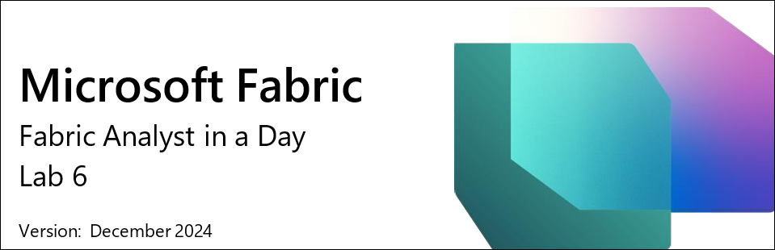

# Contenido
- Estructura del documento	
- Introducción	
- Crear una alerta con Reflex	
  - Tarea 1: Usar el panel de información en tiempo real para establecer alertas	
  - Tarea 2: Probar alerta por correo electrónico desde la experiencia de Reflex	
  - Tarea 3: Crear un objeto Reflex desde un flujo de datos	
- Limpieza de recursos	
  - Tarea 4: Limpiar espacio de trabajo	
- Resumen	
- Referencias	

 
# Estructura del documento

El laboratorio incluye pasos que el usuario debe seguir junto con capturas de pantalla asociadas que sirven de ayuda visual. En cada captura de pantalla, las secciones se resaltan con cuadros de color
naranja para indicar en qué áreas debe centrarse el usuario.

# Introducción

En este laboratorio, aprenderá cómo aprovechar Data Activator para crear un Reflex que permita enviar alertas desde nuestro panel de información en tiempo real recién creado. Además, veremos
cómo podemos ampliar el uso de Reflex para crear alertas personalizadas adicionales sobre los datos que estamos transmitiendo a nuestro Eventhouse

Al final de este laboratorio, habrá aprendido:
 - Crear un Reflex desde la opción de alerta en un panel de información en tiempo real
 - Usar elementos de Data Activator Reflex para crear más alertas personalizadas

# Crear una alerta con Reflex

## Tarea 1: Usar el panel de información en tiempo real para establecer alertas

1. Abra el **área de trabajo de Fabric** para el curso y seleccione el panel de información en tiempo real que creó en el último laboratorio.

   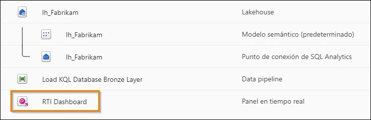

2. En el objeto visual **Click Through Rate**, haga clic en los puntos suspensivos (...) y seleccione la opción **Establecer alerta**.

   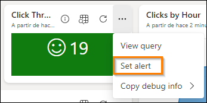

3. Se abrirá un nuevo control flotante en el lado derecho de la pantalla. Puede ver lo que está supervisando desde el panel de información, incluido el objeto visual específico al que se afiliará la alerta. La condición es algo sobre lo que tiene pleno control. Modifique la **condición** a **Es menor que**.

   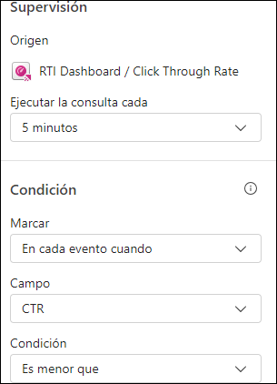

4. Aparecerá un nuevo campo para que introduzca un **valor**; modifíquelo para que sea **20**.

   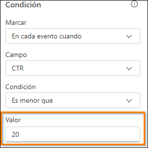
 
5. Actualmente dispone de tres acciones posibles para el tipo de alerta que desea recibir una vez que el elemento Data Activator Reflex reconozca que se ha cumplido su condición. Elija la opción **Enviarme un mensaje en Teams**.

   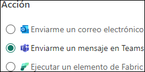
 
6. Finalmente, debe decidir la ubicación en la que almacenará el **elemento Reflex** que está creando con esta alerta. De manera predeterminada, esto debe seleccionar su área de trabajo actual, pero es necesario llamar específicamente a un **Nuevo elemento**en el menú desplegable Elemento.

    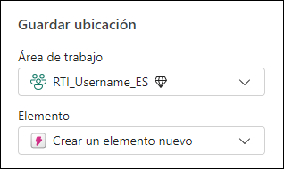

7. Cambie el nombre del elemento a **CTR Reflex** y haga clic en **Crear**. Esta operación tarda unos segundos en crearse.

    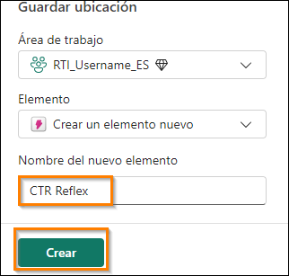
 
8. Recibirá una validación de que se creó la alerta de reflejo. Haga clic en el botón **Abrir** para abrir el Reflex.

    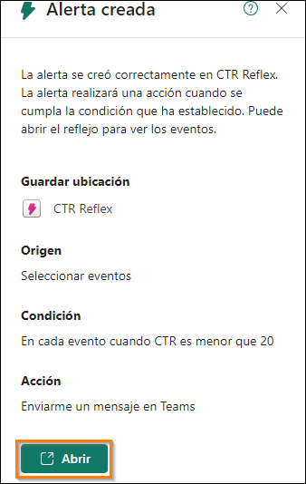
 
9. Esto le llevará a la **Experiencia de Reflex** formal. Desde aquí, puede supervisar el flujo de datos en tiempo real, ver los datos que se usan para admitir el Reflex y crear desencadenadores adicionales desde el mismo flujo.

     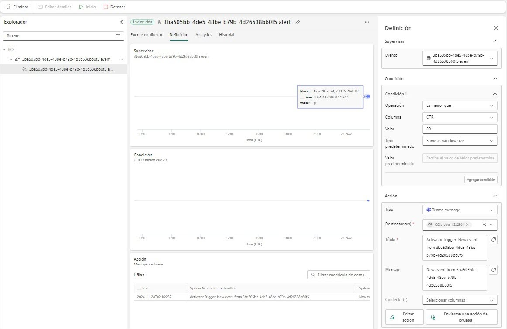

## Tarea 2: Probar alerta por correo electrónico desde la experiencia de Reflex

1. En la experiencia Reflex, haga clic en el icono de lápiz situado junto al nombre del evento y cámbiele el nombre a **CTR is less than 20**.

    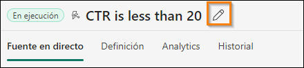

2. Actualicemos también **Título** y **Mensaje** que se pueden encontrar en la sección **Acción** a la derecha. Actualice las dos áreas para que coincidan con la imagen a continuación y presione **Guardar y actualizar**.

     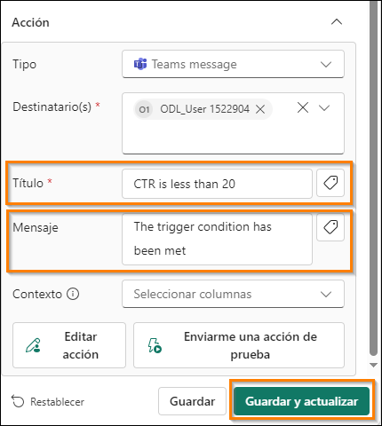

3. En la misma sección **Acción** a la derecha, haga clic en el botón **Enviarme una acción de prueba**
para obtener un mensaje de muestra en Teams desde Reflex.

     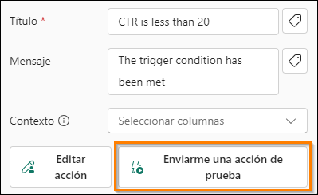

4. Abra una nueva pestaña en el navegador Edge de su entorno y vaya a **Teams.Microsoft.com**.

5. Inicie sesión con las credenciales de su entorno, si se le solicita. Es posible que aparezca un mensaje para iniciar una prueba, que deberá aceptar.

6. Debería recibir un mensaje en Teams que le indicará que CTR is less than 20.

   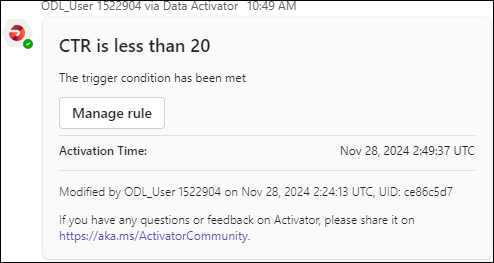

7. Vuelva a la experiencia Reflex y vamos a crear otro desencadenador.
 
## Tarea 3: Crear un objeto Reflex desde un flujo de datos

1. Seleccione el objeto etiquetado **KQL Source Event** y, después, seleccione **Nueva regla**.

   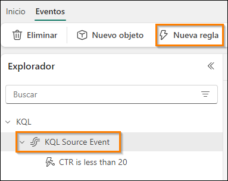

2. Haga clic en el icono del **lápiz** y asigne a esta regla el nombre, **Clicks Greater Than 30,000** (puede elegir un valor aquí que se corresponda mejor con la cantidad de datos que haya transmitido).

    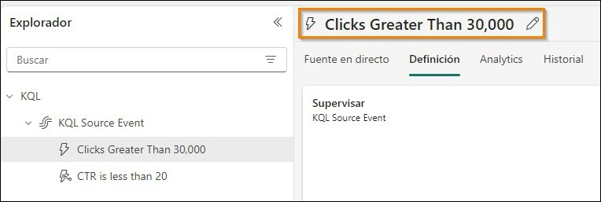

3. Para comenzar, debe supervisar una de las columnas del flujo de datos. Para conseguirlo, debe configurar las secciones Condición y Acción. Haga clic en la pestaña Definición de la regla para establecer las condiciones y la acción.

4. En la página Definición que se abre, en **Condición**, seleccione las propiedades siguientes:

    -	**Operación** = Es mayor que
    -	**Columna**= clics
    - **Valor** = 30000

      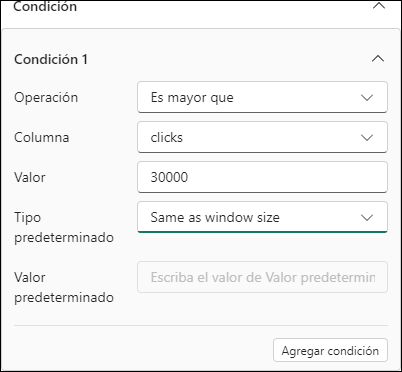

5. En **Acción**, seleccione las propiedades siguientes:

   - **Tipo** = Teams message
   - **Destinatario** = {su id. de usuario}

      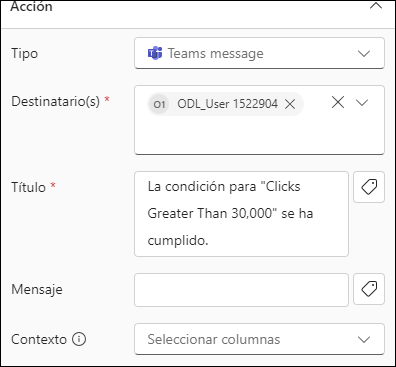

6. Por último, haga clic en Guardar e iniciar a ejecutar esta regla.

   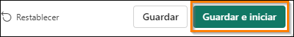

7. Ahora tiene dos desencadenadores que supervisan el mismo flujo de datos.

   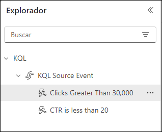

# Limpieza de recursos

## Tarea 4: Limpiar espacio de trabajo

1. Este es el último laboratorio y la última parte de Real-Time Analytics in a Day. Si ha completado el laboratorio y no tiene más preguntas o necesidades del instructor sobre el contenido,ayúdenos a desasignar el espacio de trabajo. Vaya al espacio de trabajo **RTI_username**.

   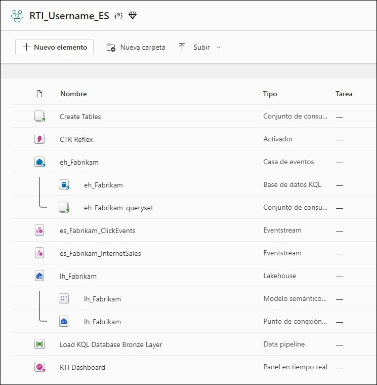

2. Haga clic en la **Configuración del área de trabajo** en la esquina superior derecha.

   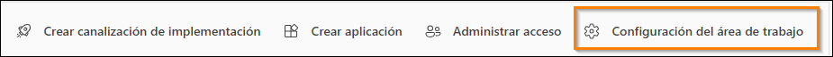
  
3. En la configuración **General** del espacio de trabajo, desplácese hacia abajo y haga clic en el botón **Eliminar esta área de trabajo**.

   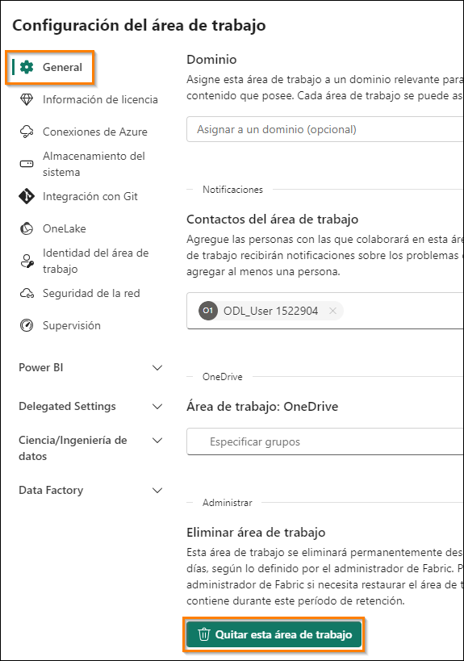

4. Laboratorio y clase completos.
 
# Resumen
En este laboratorio, hemos visto cómo usar Data Activator. Con esta característica, puede conectarse directamente a paneles de información o flujos de datos en tiempo real y crear desencadenadores
para esos datos. Estos desencadenadores se pueden configurar con condiciones de detección y, una vez que se cumplen esas condiciones, se pueden tomar medidas. En este laboratorio, utilizamos la capacidad de enviar un correo electrónico cuando se cumplían determinadas condiciones dentro
de nuestros desencadenadores. Data Activator aún se encuentra en versión preliminar, así que es posible que haya nuevas acciones disponibles en el futuro.

## Referencias
Fabric Real-Time Intelligence in a Day (RTIIAD) le presenta algunas funciones clave disponibles en Microsoft Fabric.En el menú del servicio, la sección Ayuda (?) tiene vínculos a algunos recursos excelentes.

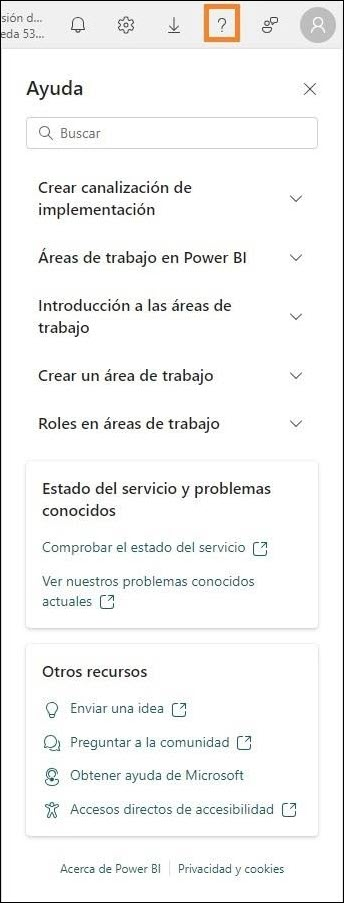

Estos son algunos recursos más que podrán ayudarle a seguir avanzando con Microsoft Fabric.

- Vea la publicación del blog para leer el [anuncio de disponibilidad general de Microsoft Fabric completo](https://aka.ms/Fabric-Hero-Blog-Ignite23)
- Explore Fabric a través de la [Visita guiada](https://aka.ms/Fabric-GuidedTour)
- Regístrese en la [prueba gratuita de Microsoft Fabric](https://aka.ms/try-fabric)
- Visite el [sitio web de Microsoft Fabric](https://aka.ms/microsoft-fabric)
- Adquiera nuevas capacidades mediante la exploración de los [módulos de aprendizaje de Fabric](https://aka.ms/learn-fabric)
- Explore la [documentación técnica de Fabric](https://aka.ms/fabric-docs)
- Lee el [libro electrónico gratuito sobre cómo empezar a usar Fabric](https://aka.ms/fabric-get-started-ebook)
- Únase a la [comunidad de Fabric](https://aka.ms/fabric-community) para publicar sus preguntas, compartir sus comentarios y aprender de otros.

Obtenga más información en los blogs de anuncios de la experiencia Fabric:

- [Experiencia de Data Factory en el blog de Fabric](https://aka.ms/Fabric-Data-Factory-Blog)
- [Experiencia de Synapse Data Engineering en el blog de Fabric](https://aka.ms/Fabric-DE-Blog)
- [Experiencia de Synapse Data Science en el blog de Fabric](https://aka.ms/Fabric-DS-Blog)
- [Experiencia de Synapse Data Warehousing en el blog de Fabric](https://aka.ms/Fabric-DW-Blog)
- [Experiencia de Real-Time Intelligence en el blog de Fabric](https://blog.fabric.microsoft.com/en-us/blog/category/real-time-intelligence)
- [Blog de anuncios de Power BI](https://aka.ms/Fabric-PBI-Blog)
- [Experiencia de Data Activator en el blog de Fabric](https://aka.ms/Fabric-DA-Blog)
- [Administración y gobernanza en el blog de Fabric](https://aka.ms/Fabric-Admin-Gov-Blog)
- [OneLake en el blog de Fabric](https://aka.ms/Fabric-OneLake-Blog)
- [Blog de integración de Dataverse y Microsoft Fabric](https://aka.ms/Dataverse-Fabric-Blog)

© 2024 Microsoft Corporation. Todos los derechos reservados.

Al participar en esta demostración o laboratorio práctico, acepta las siguientes condiciones:

Microsoft Corporation pone a su disposición la tecnología o funcionalidad descrita en esta demostración/laboratorio práctico con el fin de obtener comentarios por su parte y de facilitarle una experiencia de aprendizaje. Esta demostración/laboratorio práctico solo se puede usar para evaluar las características de tal tecnología o funcionalidad y para proporcionar comentarios a Microsoft. No se puede usar para ningún otro propósito. Ninguna parte de esta demostración/laboratorio práctico se puede modificar, copiar, distribuir, transmitir, mostrar, realizar, reproducir, publicar, licenciar, transferir ni vender, ni tampoco crear trabajos derivados de ella.

LA COPIA O REPRODUCCIÓN DE ESTA DEMOSTRACIÓN/LABORATORIO PRÁCTICO (O PARTE DE ELLA) EN CUALQUIER OTRO SERVIDOR O UBICACIÓN PARA SU REPRODUCCIÓN O DISTRIBUCIÓN POSTERIOR QUEDA EXPRESAMENTE PROHIBIDA.

ESTA DEMOSTRACIÓN/LABORATORIO PRÁCTICO PROPORCIONA CIERTAS FUNCIONES Y CARACTERÍSTICAS DE PRODUCTOS O TECNOLOGÍAS DE SOFTWARE (INCLUIDOS POSIBLES NUEVOS CONCEPTOS Y CARACTERÍSTICAS) EN UN ENTORNO SIMULADO SIN INSTALACIÓN O CONFIGURACIÓN COMPLEJA PARA EL PROPÓSITO ARRIBA DESCRITO. LA TECNOLOGÍA/ CONCEPTOS DESCRITOS EN ESTA DEMOSTRACIÓN/LABORATORIO PRÁCTICO NO REPRESENTAN LA FUNCIONALIDAD COMPLETA DE LAS CARACTERÍSTICAS Y, EN ESTE SENTIDO, ES POSIBLE QUE NO FUNCIONEN DEL MODO EN QUE LO HARÁN EN UNA VERSIÓN FINAL. ASIMISMO, PUEDE QUE NO SE PUBLIQUE UNA VERSIÓN FINAL DE TALES CARACTERÍSTICAS O CONCEPTOS. DE IGUAL MODO, SU EXPERIENCIA CON EL USO DE ESTAS CARACTERÍSTICAS Y FUNCIONALIDADES EN UN
ENTORNO FÍSICO PUEDE SER DIFERENTE.

**COMENTARIOS**. Si envía comentarios a Microsoft sobre las características, funcionalidades o conceptos de tecnología descritos en esta demostración/laboratorio práctico, acepta otorgar a Microsoft, sin cargo alguno, el derecho a usar, compartir y comercializar sus comentarios de cualquier modo y para cualquier fin. También concederá a terceros, sin cargo alguno, los derechos de patente necesarios para que sus productos, tecnologías y servicios usen o interactúen con cualquier parte específica de un software o servicio de Microsoft que incluya los comentarios. No enviará comentarios que estén sujetos a una licencia que obligue a Microsoft a conceder su software o documentación bajo licencia a terceras partes porque incluyamos sus comentarios en ellos. Estos derechos seguirán vigentes después del vencimiento de este acuerdo.
 
MICROSOFT CORPORATION RENUNCIA POR LA PRESENTE A TODAS LAS GARANTÍAS Y CONDICIONES RELATIVAS A LA DEMOSTRACIÓN/LABORATORIO PRÁCTICO, INCLUIDA CUALQUIER GARANTÍA Y CONDICIÓN DE COMERCIABILIDAD (YA SEA EXPRESA, IMPLÍCITA O ESTATUTARIA), DE IDONEIDAD PARA UN FIN DETERMINADO, DE TITULARIDAD Y DE AUSENCIA DE INFRACCIÓN.MICROSOFT NO DECLARA NI GARANTIZA LA EXACTITUD DE LOS RESULTADOS, EL RESULTADO DERIVADO DE LA REALIZACIÓN DE LA DEMOSTRACIÓN/LABORATORIO PRÁCTICO NI LA IDONEIDAD DE LA INFORMACIÓN CONTENIDA EN ELLA CON NINGÚN PROPÓSITO.

## DECLINACIÓN DE RESPONSABILIDADES

Esta demostración/laboratorio práctico contiene solo una parte de las nuevas características y mejoras realizadas en Microsoft Power BI. Puede que algunas de las características cambien en versiones futuras del producto. En esta demostración/laboratorio práctico, conocerá algunas de estas nuevas características, pero no todas.
